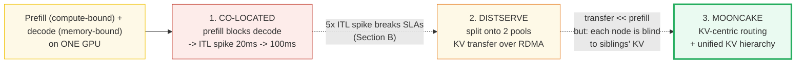
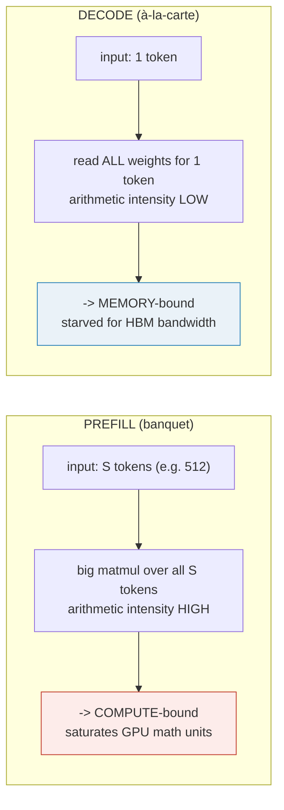
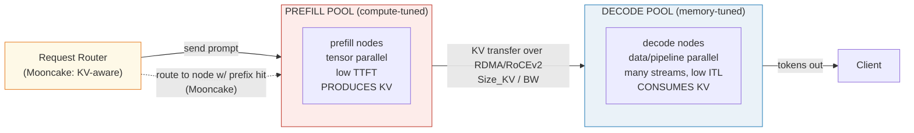
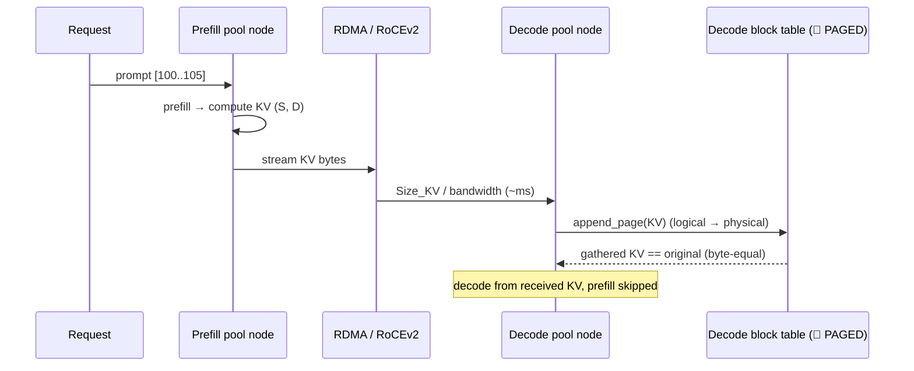
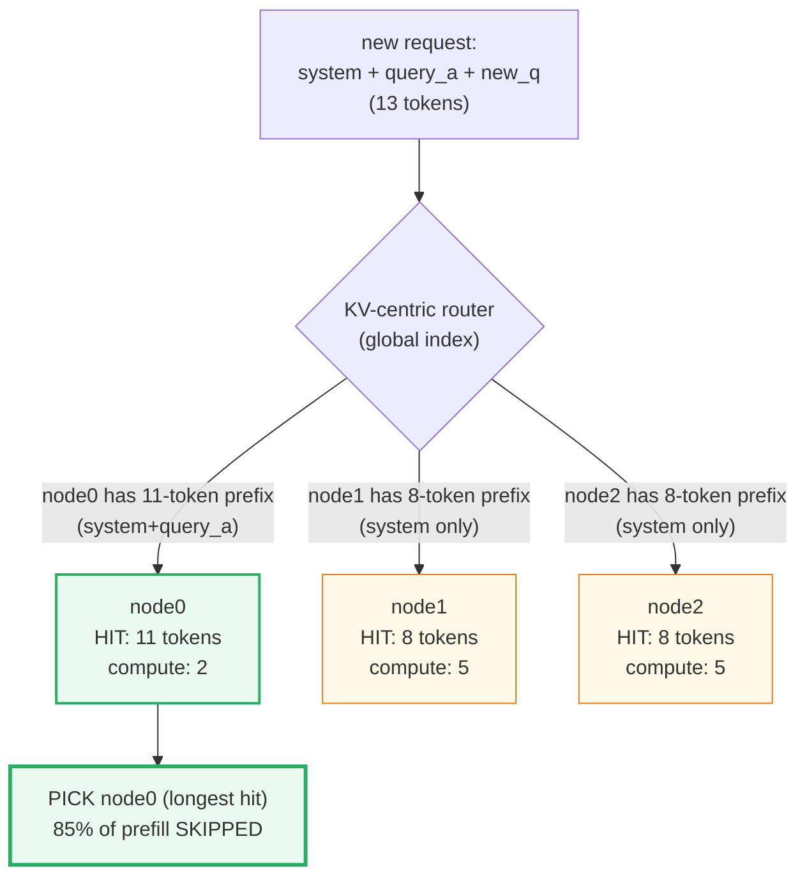
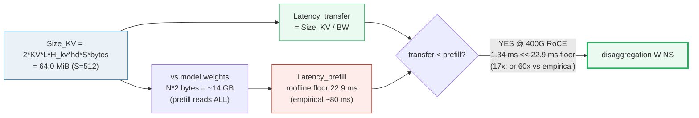
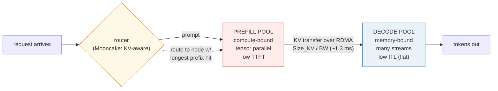

# Disaggregated Serving (DistServe / Mooncake) — A Visual, Worked-Example Guide

> **Who this is for:** someone with minimal systems background who already
> understands the co-located scheduler (🔗 [`SCHEDULER.md`](./SCHEDULER.md)).
> Every concept arrives first as a **plain analogy**, then as a diagram, then
> as a worked example with real numbers. **Every number in this guide is
> printed by `uv run python disaggregated_serving.py`** — nothing hand-computed.
>
> **Companion code:** [`disaggregated_serving.py`](./disaggregated_serving.py).
> **Live animation:** [`disaggregated_serving.html`](./disaggregated_serving.html)
> — open in a browser and drag the prompt-length / bandwidth sliders to watch
> the transfer-vs-prefill budget, with a live `[check: OK]` gold badge.
>
> **Sibling guides:** [`SCHEDULER.md`](./SCHEDULER.md) — your **co-located
> baseline** (the single-GPU continuous-batching scheduler whose interference
> disaggregation eliminates; 🔗 throughout). [`LMCACHE.md`](./LMCACHE.md) —
> the global hierarchical KV pool whose transfer mechanics disaggregation
> reuses between pools. [`PAGED_ATTENTION.md`](./PAGED_ATTENTION.md) — the
> kernel that reads whatever KV the transfer lands. [`KV_CACHE.md`](./KV_CACHE.md)
> — the paged storage layout (the bytes that move).
>
> **Source material:** `learning_guide/05_Next_Gen_Architecture.md` §4
> (Disaggregated Prefill & Decode — DistServe/Mooncake, TTFT vs ITL,
> co-location interference, KV RDMA transfer, Mooncake KV-centric routing) and
> `04_Distributed_Scale.md` §9 (short disaggregation note).
>
> ⚠️ **Faithful simulation, clearly labelled.** There is no real multi-GPU
> cluster, RDMA NIC, or prefill/decode split on the machine that runs
> `disaggregated_serving.py`. The two pools are modelled as two `Node` objects;
> the cross-pool "KV transfer" is a **deterministic in-process tensor clone**.
> What IS real and reproducible: the **co-location interference timeline**
> (serialized prefill blocking decode — exact arithmetic on representative
> latencies), the **KV transfer mechanics + byte-equality proof**, and
> **every bandwidth figure** in the latency-budget arithmetic (RoCEv2/IB 400
> Gbps ≈ 50 GB/s, NVLink ≈ 600 GB/s, PCIe Gen5 ≈ 64 GB/s, HBM ≈ 2–3.35 TB/s
> — all published). The representative prefill/decode latencies (80 ms / 20 ms)
> are empirical order-of-magnitude figures consistent with the learning guide
> and published benchmarks. The conclusions (transfer ≪ prefill, disaggregation
> eliminates ITL spikes) rest on the real bandwidth arithmetic and the
> serialized-vs-parallel timeline, not on the simulated transport.

---

## Glossary (read once, refer back)

| Term | Plain-English meaning |
|---|---|
| **prefill** | Processing the WHOLE prompt (S tokens) in one forward pass to fill the KV cache and emit the first token. **Compute-bound** (big matmul over S tokens, high arithmetic intensity). |
| **decode** | Generating ONE new token per step, reusing cached KV. **Memory-bound** (reads all weights per token; 1 token/step). |
| **TTFT** | Time-To-First-Token. The prefill metric (user-perceived latency to first output). Optimized on the prefill pool. |
| **ITL / TPOT** | Inter-Token Latency / Time-Per-Output-Token. The decode metric (latency between consecutive generated tokens). Optimized on the decode pool. |
| **goodput** | Requests/s that meet BOTH TTFT and ITL SLOs simultaneously. The metric DistServe optimizes (throughput alone is blind to latency). |
| **co-location** | Running prefill and decode on the SAME GPU (🔗 [`SCHEDULER.md`](./SCHEDULER.md)). Causes interference: prefill blocks decode → ITL spikes. |
| **disaggregation** | Splitting prefill and decode onto SEPARATE GPU pools. No interference; each phase independently optimized. |
| **prefill pool** | GPU cluster dedicated to prefill (compute-optimized, tensor-parallel for low TTFT). |
| **decode pool** | GPU cluster dedicated to decode (memory-bandwidth-optimized, many concurrent streams for low ITL). |
| **KV transfer** | After prefill, the prompt's KV cache is moved from prefill VRAM to decode VRAM over RDMA/RoCEv2/NVLink. **Simulated** as a tensor clone; real latency = `Size_KV / bandwidth`. |
| **Size_KV** | Bytes of KV for a prompt: `2(K+V) · layers · n_kv_heads · head_dim · S · bytes`. |
| **Latency_transfer** | `Size_KV / bandwidth_network` — the disaggregation cost (real bandwidths). |
| **Latency_prefill** | Cost of running the prompt through the model (the TTFT floor). Compute-bound at typical prompt lengths. |
| **budget** | The win condition: `Latency_transfer < Latency_prefill` (or `< SLA_TTFT − Latency_prefill`). Transfer ≪ prefill, so disaggregation wins. |
| **prefix-aware routing** | Mooncake's routing: send the request to the prefill node holding the longest cached prefix of its KV (🔗 [`LMCACHE.md`](./LMCACHE.md) global index). Only the missing suffix is computed + transferred. |

> 🔗 **The single cross-reference to remember:** `SCHEDULER.md` co-locates
> prefill and decode on ONE GPU with prefill priority — so a long prefill
> blocks every active decode, spiking ITL. Disaggregated serving (DistServe,
> Mooncake) splits them onto SEPARATE pools so neither blocks the other. The
> KV the prefill pool produces is transferred to the decode pool over RDMA —
> the SAME transfer mechanics [`LMCACHE.md`](./LMCACHE.md) describes between
> cache tiers, now between compute pools.

---

## 0. TL;DR — the whole lineage in one picture

🔗 [`SCHEDULER.md`](./SCHEDULER.md) (vLLM, Orca) co-locates **prefill**
(compute-bound: big S-token matmul, TTFT metric) and **decode** (memory-bound:
1 token/step, ITL metric) on the SAME GPU. A long prefill (e.g. 512 tokens,
~80 ms) serializes ahead of the decode batch (prefill priority), so every
running decode stalls — ITL spikes from ~20 ms to ~100 ms. Disaggregated
serving (DistServe, OSDI'24; Mooncake, FAST'25) splits the two phases onto
**separate GPU pools**, connected by a high-speed RDMA link, so neither blocks
the other.

**The three generations, as analogies** (each fixes the prior's failure):

- **CO-LOCATED prefill + decode (🔗 SCHEDULER / vLLM)** = *"one kitchen cooks
  everything. A banquet order (prefill, 512 plates, 80 min) walks in and
  seizes the entire stove — every single-plate order (decode, 20 min each)
  waits 80 min for the banquet to finish. The à-la-carte diners see their
  inter-dish latency spike from 20 min to 100 min."*
- **DISTSERVE (OSDI'24, arXiv:2401.09670)** = *"open TWO kitchens: a banquet
  kitchen (prefill pool, tuned for big-batch compute) and an à-la-carte kitchen
  (decode pool, tuned for many small concurrent orders). The banquet kitchen
  cooks the KV, faxes the recipe card (RDMA transfer, ~1 ms) to the à-la-carte
  kitchen, which keeps serving plates at 20-min intervals UNINTERRUPTED. Each
  kitchen is optimized independently; neither blocks the other."*
- **MOONCAKE (FAST'25, arXiv:2407.00079)** = *"the banquet kitchen keeps a
  global recipe-card catalogue (unified KV hierarchy, 🔗 LMCACHE). When a new
  banquet order arrives, the router sends it to the banquet chef who already
  has the longest matching recipe prefix — so only the NEW dishes are cooked,
  not the whole banquet. Under overload, the router rejects orders it can't
  serve within the SLO (early rejection)."*



*Yellow → red → orange → green: co-location causes interference (red);
DistServe splits the pools (orange); Mooncake adds KV-centric routing so the
prefill pool also shares cached prefixes across nodes (green).*

| | **Co-located** (🔗 SCHEDULER) | **DistServe** (2 pools) | **Mooncake** (KV-centric) |
|---|---|---|---|
| Prefill + decode | **same GPU** (serialized) | **separate pools** (parallel) | separate pools |
| ITL under prefill load | **spikes** to prefill+decode | **flat** (no interference) | flat |
| KV after prefill | stays local | **transferred** over RDMA | transferred (only missing suffix) |
| Prefix reuse across nodes | no | no | **yes** (global KV hierarchy, 🔗 LMCACHE) |
| Parallelism tuning | coupled (one GPU) | **independent** per pool | independent + KV-aware routing |
| Overload handling | preempt (🔗 SCHEDULER) | scale pool ratio | **early rejection** (SLO-aware) |
| Reported gain | (baseline) | up to **7.4x** goodput | up to **525%** throughput; **75%** more reqs |
| Used by | vLLM / Orca | DistServe (OSDI'24) | **Kimi** (Moonshot AI) |

---

## 1. Prefill vs decode — opposite computational profiles — Section A output

**Analogy:** *prefill is a banquet — one huge batch that saturates the stove's
capacity (compute-bound). Decode is à-la-carte — one plate at a time, where
the chef spends most of the time walking to the pantry to fetch ingredients
(memory-bound). The two stress completely different resources, so sharing one
kitchen means each blocks the other.*



> From `disaggregated_serving.py` **Section A** — the arithmetic intensity
> (AI = FLOPs / bytes_moved) vs the A100 roofline crossover:
>
> | characteristic | PREFILL | DECODE |
> |---|---|---|
> | input size | full prompt (S tokens) | exactly 1 token |
> | compute type | **COMPUTE-bound** (big S-token matmul, high AI) | **MEMORY-bound** (1 token, reads all weights) |
> | GPU utilization | near 100% if S large | low (weight-bandwidth limited) |
> | key metric | **TTFT** (Time-To-First-Token) | **ITL / TPOT** (per-token latency) |
> | batching | large chunks to saturate compute | continuous batching, many streams |
> | happens | ONCE per request | `max_tokens` times |
> | optimal parallelism | tensor parallel (low TTFT) | data/pipeline parallel (high throughput) |
>
> ```
> A100 crossover = peak_TFLOPS / HBM_BW = 312 / 2.0 = 156 FLOP/B
>
> PREFILL (S=512): AI = 2*S/bytes = 2*512/2 = 512 FLOP/B  >= 156  -> COMPUTE-bound
> DECODE (S=1):     AI = 2*S/bytes = 2*1/2 = 1 FLOP/B  <  156  -> MEMORY-bound
> ```
>
> `[check]` prefill is COMPUTE-bound (AI 512 ≥ crossover 156): **OK**
> `[check]` decode is MEMORY-bound (AI 1 < crossover 156): **OK**

> One plain sentence: prefill saturates the math units (AI = S/bytes); decode
> starves for weight bandwidth (AI = 1/bytes). Co-locating them means each
> blocks the resource the other needs — the seed of the interference.

---

## 2. The co-location interference — Section B output  (🔗 SCHEDULER baseline)

**Analogy:** *one kitchen, prefill priority. A 512-token banquet (80 min)
walks in and seizes the stove. Every à-la-carte plate (20 min) waits 80 min
for the banquet to finish — then gets its 20 min. The inter-dish latency
spikes from 20 min to 100 min (5×). The diners' SLO (30 min/dish) is
shattered.*

🔗 [`SCHEDULER.md`](./SCHEDULER.md) runs prefill + decode on ONE GPU with
**prefill priority**: when a prefill arrives, it runs first and the decode
batch WAITS for the full prefill duration. The decode ITL for that step =
`prefill_ms + decode_ms` (serialized).

```mermaid
gantt
    title Co-located (1 GPU): prefill blocks decode -> ITL spike
    dateFormat X
    axisFormat step %s
    section decode batch
    decode 20ms :0, 1
    WAIT for prefill (80ms) :1, 2
    decode 20ms :2, 3
    section prefill request
    wait :0, 1
    PREFILL 512 tokens (80ms) :1, 2
    done :2, 3
```



*The decode batch's step-2 ITL = 80 (waiting) + 20 (its own step) = 100 ms.*
*In disaggregated serving the prefill runs on a SEPARATE pool — decode never
waits.*

> From `disaggregated_serving.py` **Section B** — FAITHFUL SIMULATION with
> representative latencies (`decode_step = 20 ms`, `prefill_512 = 80 ms`);
> the timeline arithmetic (spike = prefill + decode) is exact:
>
> Timeline (decode batch running; 512-token prefill arrives at steps 6, 11):
>
> | step | CO-LOCATED GPU runs | decode ITL | DISAGGREGATED prefill pool | decode pool | decode ITL |
> |---|---|---|---|---|---|
> | 1 | decode(20ms) | 20 ms | idle | decode(20ms) | 20 ms |
> | 2 | decode(20ms) | 20 ms | idle | decode(20ms) | 20 ms |
> | 3 | decode(20ms) | 20 ms | idle | decode(20ms) | 20 ms |
> | 4 | decode(20ms) | 20 ms | idle | decode(20ms) | 20 ms |
> | 5 | decode(20ms) | 20 ms | idle | decode(20ms) | 20 ms |
> | 6 | **PREFILL(80ms)** | **100 ms (SPIKE)** | prefill(80ms) | decode(20ms) | **20 ms** |
> | 7 | decode(20ms) | 20 ms | idle | decode(20ms) | 20 ms |
> | 8 | decode(20ms) | 20 ms | idle | decode(20ms) | 20 ms |
> | 9 | decode(20ms) | 20 ms | idle | decode(20ms) | 20 ms |
> | 10 | decode(20ms) | 20 ms | idle | decode(20ms) | 20 ms |
> | 11 | **PREFILL(80ms)** | **100 ms (SPIKE)** | prefill(80ms) | decode(20ms) | **20 ms** |
>
> CO-LOCATED ITL: avg=35 ms, **max=100 ms** (spike = 80+20)
> DISAGGREGATED ITL: avg=20 ms, **max=20 ms** (flat; prefill runs in parallel)
>
> ITL spike factor: co-located max / baseline = **5.0×**
>
> `[check]` co-located max ITL == prefill+decode (100 ms): **OK**
> `[check]` disaggregated max ITL == decode (20 ms, no spike): **OK**

> 🔗 This is the **direct head-to-head** with [`SCHEDULER.md`](./SCHEDULER.md).
> The scheduler's prefill priority (a feature that keeps TTFT low) becomes a
> LIABILITY when co-located: it stalls every decode for the prefill duration.
> Disaggregation doesn't remove prefill priority — it removes the CO-LOCATION
> so the priority no longer blocks decodes. The scheduler's state machine,
> chunked prefill, and preemption all still run WITHIN each pool.

---

## 3. The disaggregated architecture — Section C output

**Analogy:** *two kitchens. The banquet kitchen (prefill pool) is tuned for
big-batch compute — wide stoves, tensor-parallel burners (low TTFT). The
à-la-carte kitchen (decode pool) is tuned for many concurrent small orders —
high memory bandwidth, many chefs (low ITL). After the banquet kitchen cooks
the KV, it faxes the recipe card (RDMA transfer) to the à-la-carte kitchen,
which keeps plating at 20-min intervals. Each kitchen is optimized
independently.*



> From `disaggregated_serving.py` **Section C** — the per-pool decisions:
>
> | decision | prefill pool | decode pool |
> |---|---|---|
> | GPU type | compute-optimized | memory-bandwidth-optimized |
> | parallelism | tensor parallel (low TTFT) | data/pipeline parallel |
> | batch shape | large S-token chunks | many 1-token streams |
> | resource stress | math units (FLOPs) | HBM bandwidth |
> | metric | TTFT | ITL / TPOT |
> | KV cache role | **PRODUCES** KV (writes it) | **CONSUMES** KV (reads it) |

A request flows: **router → prefill pool** (compute KV, emit first token) →
**KV transferred over RDMA** → **decode pool** (receives KV, decodes
autoregressively). The two pools are tuned **independently** — making TTFT
better never hurts ITL and vice versa. That decoupling is the win.

> **DistServe's co-optimization (§4 of the paper):** given the app's TTFT and
> TPOT SLOs, pick the **ratio** of prefill to decode GPUs (e.g. 2P:1D) and the
> **parallelism** per pool to maximize goodput. A simulator-driven search finds
> the best split because the optimal ratio depends on the workload (prompt
> length distribution, output length, arrival rate). Result: up to **7.4×**
> more requests within SLOs vs co-located vLLM.

> 🔗 The KV that flows from prefill to decode pool lives in the SAME paged
> storage [`KV_CACHE.md`](./KV_CACHE.md) describes, is gathered by the SAME
> paged-attention kernel [`PAGED_ATTENTION.md`](./PAGED_ATTENTION.md) runs,
> and crosses the wire via the SAME RDMA mechanics [`LMCACHE.md`](./LMCACHE.md)
> uses between cache tiers. Disaggregation is an **architecture** built FROM
> those components, not a replacement for them.

---

## 4. The KV transfer — Section D output  (🔗 LMCACHE)

**Analogy:** *the banquet kitchen faxes its recipe card (the KV cache) to the
à-la-carte kitchen. The fax is byte-for-byte identical — the à-la-carte chef
can't tell a faxed recipe from one written locally. The fax takes ~1 ms; a
re-cook of the banquet from scratch would take ~80 ms. So you fax, you don't
re-cook.*



> From `disaggregated_serving.py` **Section D** — tiny demo (D=8, 1 layer, 1
> KV head; realistic dims in [§6](#6-the-latency-budget-transfer--prefill--section-f-output)):
>
> | step | action | detail |
> |---|---|---|
> | 1 | PREFILL pool node0 computes KV | shape `(6, 8)` (S=6, D=8); stored in prefill VRAM |
> | 2 | TRANSFER KV over RDMA → decode pool | decode block table: logical 0 → page 0; 192 B moved |
> | 3 | DECODE pool gathers KV via block table (🔗 PAGED) | shape `(6, 8)`; **byte-equal** to original |
>
> `[check]` received KV == original KV (byte-equal): **OK**

> 🔗 The transfer IS the same operation [`LMCACHE.md`](./LMCACHE.md) §5 performs
> between cache tiers — a deterministic copy into the destination's block
> table. The only difference is the SOURCE: LMCache pulls from a sibling node's
> DRAM/NVMe; disaggregation pushes from the prefill pool's VRAM. The
> destination (decode pool's block table), the byte-equality guarantee, and the
> paged-attention transparency are identical. Real cost = `Size_KV / bandwidth`
> ([§6](#6-the-latency-budget-transfer--prefill--section-f-output)).

---

## 5. Mooncake KV-centric prefix-aware routing — Section E output  (🔗 LMCACHE)

**Analogy:** *the banquet kitchen keeps a global recipe-card catalogue (unified
KV hierarchy). When a new banquet order arrives, the router checks which chef
already has the longest matching recipe prefix — and sends the order there.
Only the NEW dishes are cooked and faxed, not the whole banquet. If no chef
can finish within the SLO, the router politely declines (early rejection).*

Mooncake (Kimi/Moonshot AI, FAST'25) treats all CPU + GPU + SSD memory across
the cluster as a **unified KV hierarchy** (🔗 [`LMCACHE.md`](./LMCACHE.md)) and
**routes** each request to the prefill node that already holds the **longest
cached prefix** of its KV. Only the **missing suffix** is computed and
transferred.



> From `disaggregated_serving.py` **Section E** — 3 prefill nodes, each with
> different cached prefixes; a new request arrives (`system + query_a +
> new_question`, 13 tokens):
>
> | node | longest cached prefix match | hit tokens | compute |
> |---|---|---|---|
> | 0 | first 11 tokens (system + query_a) | **11** | **2** |
> | 1 | first 8 tokens (system only) | 8 | 5 |
> | 2 | first 8 tokens (system only) | 8 | 5 |
>
> Router picks **node0** (longest prefix hit = 11 tokens).
> - only **2** new tokens need prefill (vs 13 from scratch).
> - KV transfer = 2 tokens' worth (not the full prompt).
> - prefix savings: **11/13 = 85%** of prefill SKIPPED.
>
> `[check]` router picks node0 (longest prefix = 11 tokens): **OK**
> `[check]` prefix hit = 11 tokens (system+query_a, not just system): **OK**

> 🔗 This is [`LMCACHE.md`](./LMCACHE.md)'s global index **applied to routing**.
> LMCache answers *"where is this chunk cached?"*; Mooncake answers *"which
> prefill node has the longest prefix of this prompt, so I route there?"* The
> index is the same content-hash idea; Mooncake adds a **routing policy** on
> top (longest-prefix match) and an **overload policy** (prediction-based early
> rejection to keep SLO compliance under load — Kimi's real workload).

---

## 6. The latency budget: transfer ≪ prefill — Section F output  (the GOLD)

**Analogy:** *is it cheaper to fax the recipe card (transfer KV) or to re-cook
the banquet from scratch (re-prefill)? The recipe card is SMALL (64 MiB of KV);
the banquet ingredients (model weights, ~14 GB) are HUGE. So even though the
fax line (RoCE 400G, ~50 GB/s) is slower than the pantry (HBM, 2 TB/s), the
SIZE ratio wins: you move ~400× fewer bytes. That single inequality —
`Size_KV / network_BW < prefill_cost` — is the economic justification for
disaggregation.*



> From `disaggregated_serving.py` **Section F** — reference model (Llama-3-8B-
> class GQA transformer): `layers=32, n_q_heads=32, n_kv_heads=8 (GQA 4:1),
> head_dim=128, hidden=4096, inter=14336 (SwiGLU), bytes=2`; body params =
> `6,979,321,856` (~6.98 B, excl. embeddings); `prompt S = 512`; reference GPU
> A100 80GB SXM (HBM 2.0 TB/s, 312 TFLOPS bf16 peak).
>
> **Size_KV** = `2(K+V) · layers · n_kv_heads · head_dim · S · bytes`
> = `2 · 32 · 8 · 128 · 512 · 2` = **`67,108,864` bytes = `64.0 MiB`**
>
> **Latency_transfer = Size_KV / bandwidth**, per network (REAL bandwidths):
>
> | path | bandwidth | Latency_transfer | vs prefill floor |
> |---|---|---|---|
> | Intra-node NVLink (GPU↔GPU) | 600 GB/s | 0.1118 ms | 204.8× faster |
> | RoCEv2 / IB 400 Gbps (cross-node) | 50.0 GB/s | **1.3422 ms** | **17.1× faster** |
> | RoCEv2 / IB 200 Gbps (cross-node) | 25.0 GB/s | 2.6844 ms | 8.5× faster |
> | RoCEv2 / 100 GbE (cross-node) | 12.5 GB/s | 5.3687 ms | 4.3× faster |
>
> Recompute (prefill) roofline FLOOR at batch=1:
> - mem-bound (read all weights once) = **6.979 ms**
> - compute-bound (`2·N·S` FLOPs / peak) = **22.906 ms**
> - arithmetic intensity = **512 FLOP/B**; crossover = **156 FLOP/B**
> - → **COMPUTE-bound**; floor = **22.906 ms** *(IDEAL; real prefill ~80 ms)*
>
> **BUDGET VERDICT (primary: 400G RoCEv2 transfer):**
> - `Latency_transfer = 67,108,864 / 5e+10 = 1342.18 µs (1.3422 ms)`
> - `Latency_prefill (roofline floor) = 22.906 ms`
> - `Latency_prefill (empirical ~80 ms)`
> - **transfer < prefill ? True** (floor/transfer = **17.1×**; empirical/transfer = **59.6×**)
>
> `[check]` Latency_transfer < Latency_prefill_floor: **OK**

### Worked sample — the single example to remember

Pin these numbers (they are the `.html`'s gold check):

- **Size_KV (S=512) = 67,108,864 bytes = 64.0 MiB.**
- **Latency_transfer (S=512, BW=50 GB/s) = 1342.18 µs (1.3422 ms)** — the
  disaggregation cost at 400 Gbps RoCEv2.
- **Latency_prefill (roofline floor) = 22.906 ms** — the cost if you recompute
  (and real prefill is ~80 ms, HIGHER than this floor).
- **Verdict: transfer (1.34 ms) ≪ prefill floor (22.9 ms) → ~17× faster at the
  floor; ~60× vs the empirical 80 ms.** Even at 100 GbE (5.37 ms) the transfer
  is still well under the prefill floor.

> ⚠️ **Honest scope of the prefill number.** `22.906 ms` is the **roofline
> FLOOR** (max of memory-bound weight reads and compute-bound FLOPs at peak
> TFLOPS). Real batch=1 prefill on an A100 runs HIGHER (kernel-launch overhead,
> MFU well below 100%). The `80 ms` representative figure corresponds to ~30%
> MFU — plausible for batch=1. That only **strengthens** the transfer-wins
> verdict: the floor is already ~17× slower than a 400G transfer, and real
> prefill is ~60× slower. The `Latency_transfer` numbers are exact
> (`Size_KV / published_BW`), so they are the trustworthy side.

---

## 7. Co-located vs disaggregated — the end-to-end contrast — Section G output

**Analogy:** *the scorecard. Co-located: TTFT is OK when the GPU is free but
ITL spikes to 100 ms whenever a banquet arrives — goodput tanks because half
the requests miss the ITL SLO. Disaggregated: TTFT barely rises (+1.3 ms
transfer = +1.7% of the 80 ms prefill) but ITL stays flat at 20 ms — every
request meets the SLO, so goodput jumps up to 7.4×.*

> From `disaggregated_serving.py` **Section G** — end-to-end comparison for a
> single request (512-token prompt):
>
> | metric | CO-LOCATED (1 GPU) | DISAGGREGATED (2 pools) |
> |---|---|---|
> | TTFT (no contention) | 80 ms (prefill) | 80 + 1.3 = **81.3 ms** (prefill+transfer) |
> | TTFT (under load) | 80+ ms (waits for decode) | ~81 ms (prefill pool free) |
> | ITL baseline | 20 ms | 20 ms |
> | ITL under prefill | **100 ms (SPIKE!)** | **20 ms (no spike)** |
> | parallelism tuning | coupled (one GPU) | independent per pool |
> | goodput (SLO-bound) | limited by interference | up to **7.4×** higher |
>
> TTFT overhead of disaggregation: **+1.34 ms** transfer = **+1.68%** of the
> 80 ms prefill.
>
> `[check]` TTFT overhead < 5% of prefill (1.68%): **OK**
> `[check]` disaggregated ITL has no prefill-induced spike: **OK**

**The tradeoff and why it's worth it:**

| | Cost | Gain |
|---|---|---|
| TTFT | +1.34 ms (+1.68%) — the KV transfer | — |
| ITL | — | spikes vanish (max 100 ms → 20 ms) |
| parallelism | — | **independent** per pool (TP for TTFT, DP for ITL) |
| goodput | — | up to **7.4×** (DistServe) / **525%** (Mooncake) |

> One plain sentence: disaggregation trades a ~2% TTFT increase for the
> elimination of ITL spikes AND independent per-phase optimization. That trade
> is why DistServe, Mooncake, Splitwise, and DéjàVu all adopt it.

---

## 8. Pitfalls & debugging checklist

| # | Mistake | Symptom | Fix |
|---|---|---|---|
| 1 | Co-locating prefill + decode when the app needs BOTH low TTFT and low ITL | ITL spikes to prefill+decode whenever a prompt arrives; goodput tanks | **Disaggregate**: split onto separate pools so neither blocks the other ([§2](#2-the-co-location-interference--section-b-output--scheduler-baseline), [§3](#3-the-disaggregated-architecture--section-c-output)) |
| 2 | Transferring KV over slow TCP/IP instead of RDMA/RoCEv2 | KV transfer latency approaches or exceeds the prefill, destroying the budget | Use **RDMA/RoCEv2** (400 Gbps ≈ 50 GB/s) or intra-node **NVLink** (600 GB/s); the transfer must stay ≪ prefill ([§6](#6-the-latency-budget-transfer--prefill--section-f-output--the-gold)) |
| 3 | Comparing `Latency_transfer` to a **guessed** prefill wall-clock | Over- or under-selling the win | Use the roofline FLOOR (mem + compute) as the honest lower bound; real prefill is HIGHER, so the floor is conservative ([§6](#6-the-latency-budget-transfer--prefill--section-f-output--the-gold)) |
| 4 | Transferring KV but NOT appending to the decode pool's **block table** | Decode pool's attention reads stale/empty pages → garbage | Append the transferred KV's pages to the decode block table (🔗 [`PAGED_ATTENTION.md`](./PAGED_ATTENTION.md)); gather via it ([§4](#4-the-kv-transfer--section-d-output--lmcache)) |
| 5 | Assuming transferred KV differs from locally-computed KV | "Warm up" or recompute-after-transfer bugs | The transferred KV is **byte-equal** to the original — assert it (Section D `[check]`); never recompute after a transfer |
| 6 | Forgetting that effective cross-node BW = `min(network, PCIe)` | Latency underestimate (assuming pure network speed) | The KV traverses the network AND the dst's PCIe to VRAM; use the smaller (🔗 [`LMCACHE.md`](./LMCACHE.md) §3) |
| 7 | Tuning both pools with the SAME parallelism | Suboptimal: decode doesn't need tensor parallel; prefill doesn't need high batch | **Independent** tuning: TP for prefill (low TTFT), DP/PP for decode (high throughput) ([§3](#3-the-disaggregated-architecture--section-c-output)) |
| 8 | Not co-optimizing the pool **ratio** | One pool starves while the other idles | DistServe: simulator-driven search for the best P:D ratio given the SLOs ([§3](#3-the-disaggregated-architecture--section-c-output)) |
| 9 | Conflating disaggregation (split pools) with LMCache (cache reuse) | Mis-attributing the mechanism | Disaggregation = split prefill & decode POOLS; LMCache = move KV to skip RECOMPUTE. Mooncake combines both (🔗 [`LMCACHE.md`](./LMCACHE.md) pitfall 8) |
| 10 | Assuming the simulation IS a real cluster | Wrong mental model of `disaggregated_serving.py` | The `.py` is a **faithful simulation**: pools = Node objects, transfer = tensor clone. Bandwidth/latency numbers are REAL; the transport is simulated (module docstring) |
| 11 | Ignoring **overload** under disaggregation | SLO violations spike when the cluster is saturated | Mooncake adds **prediction-based early rejection** — reject requests the system predicts it cannot serve within the SLO, rather than accepting and stalling |

---

## 9. Cheat sheet



- **Lineage (🔗 SCHEDULER → DistServe → Mooncake):** co-location causes ITL
  spikes; DistServe splits onto 2 pools; Mooncake adds KV-centric routing.
- **Prefill = compute-bound** (AI = 2*S/bytes ≥ crossover → saturates math units);
  **decode = memory-bound** (AI = 2/bytes < crossover → starved for HBM BW).
- **Co-location interference:** prefill priority blocks decode → ITL spike =
  `prefill_ms + decode_ms` (100 ms = 80 + 20, a 5× spike).
- **Disaggregation:** prefill pool (TP, low TTFT) → KV transfer over RDMA →
  decode pool (DP/PP, flat low ITL). No interference; independent tuning.
- **Size_KV:** `2 · layers · n_kv_heads · head_dim · S · bytes`. For Llama-3-8B
  (`layers=32, n_kv_heads=8, head_dim=128, S=512, bytes=2`) → **67,108,864 B
  = 64.0 MiB**.
- **Budget:** `Latency_transfer = Size_KV / BW` ≪ `Latency_prefill`. Primary
  (400G RoCEv2): **1.34 ms** transfer vs **22.9 ms** prefill floor (empirical
  ~80 ms) → **~17× faster** at the floor (**~60×** vs empirical).
- **Mooncake routing:** send request to the prefill node with the longest
  cached prefix (🔗 [`LMCACHE.md`](./LMCACHE.md) global index); only the
  missing suffix is computed + transferred (85% skipped in the worked example).
- **Tradeoff:** +1.7% TTFT (the transfer) for zero ITL spikes + independent
  per-pool optimization → up to **7.4× goodput** (DistServe) / **525%
  throughput** (Mooncake).
- **Gold:** `Size_KV(S=512)=67108864 B`; `Latency_transfer(S=512, BW=5e+10)=
  1342.18 µs`; `verdict transfer<prefill = True`.

> 🔗 This guide is the **architecture** layer that combines the sibling
> components: the [`SCHEDULER.md`](./SCHEDULER.md) (runs within each pool),
> [`LMCACHE.md`](./LMCACHE.md) (the KV transfer + global index), and
> [`PAGED_ATTENTION.md`](./PAGED_ATTENTION.md) / [`KV_CACHE.md`](./KV_CACHE.md)
> (the storage + gather). Together they are the Phase-5 serving stack;
> disaggregated serving (DistServe, Mooncake) is the layer that makes the two
> phases **independent** so neither blocks the other.

---

## Sources

- **DistServe (prefill-decode disaggregation for goodput):** Y. Zhong, S. Liu,
  J. Chen, J. Hu, Y. Zhu, X. Liu, X. Jin, H. Zhang, *"DistServe: Disaggregating
  Prefill and Decoding for Goodput-optimized Large Language Model Serving,"*
  OSDI 2024, [arXiv:2401.09670](https://arxiv.org/abs/2401.09670).
  [USENIX page](https://www.usenix.org/conference/osdi24/presentation/zhong) ·
  [blog (Hao AI Lab)](https://haoailab.com/blogs/distserve/).
  - Verified (abstract): *"DistServe improves the performance of large language
    models (LLMs) serving by **disaggregating the prefill and decoding
    computation**. Existing LLM serving systems colocate the two phases… We find
    that this strategy not only leads to strong **prefill-decoding
    interferences** but also couples the resource allocation and parallelism
    plans for both phases."*
  - Verified: *"DistServe assigns prefill and decoding computation to different
    GPUs, hence **eliminating prefill-decoding interferences**."*
  - Verified: *"DistServe also places the two phases according to the serving
    cluster's **bandwidth** to minimize the communication caused by
    disaggregation."*
  - Verified: *"DistServe can serve **7.4x more requests or 12.6x tighter
    SLO**, compared to state-of-the-art systems."*
  - Verified (blog, KV transfer): *"with proper placement, KV cache transfer
    overhead can be effectively minimized to be as low as less than the time of
    a decoding step, thanks to today's high-speed networks such as NVLink and
    PCI-e 5.0."* Example: *"2048 tokens · (4.5 MB/token) / (64 GB/s · 8) = 17.6
    ms"* — less than one OPT-175B decode step (~30–50 ms on A100).
  - Verified (blog): **goodput** = the number of completed requests per second
    adhering to SLOs (TTFT + TPOT) — not raw throughput.
- **Mooncake (KVCache-centric disaggregated architecture):** R. Qin, Z. Li,
  W. He, M. Zhang, Y. Wu, W. Zheng, X. Xu, *"Mooncake: A KVCache-centric
  Disaggregated Architecture for LLM Serving,"* FAST 2025 (Moonshot AI /
  Tsinghua), [arXiv:2407.00079](https://arxiv.org/abs/2407.00079).
  [USENIX page](https://www.usenix.org/conference/fast25/presentation/qin) ·
  [code](https://github.com/kvcache-ai/Mooncake).
  - Verified (abstract): *"Mooncake is the serving platform for **Kimi**… It
    features a **KVCache-centric disaggregated architecture** that **separates
    the prefill and decoding clusters**. It also leverages the underutilized
    **CPU, DRAM, and SSD resources** of the GPU cluster to implement a
    **disaggregated cache of KVCache**."*
  - Verified: *"The core of Mooncake is its **KVCache-centric scheduler**,
    which balances maximizing overall effective throughput while meeting
    latency-related Service Level Objectives (SLOs)."*
  - Verified: *"a **prediction-based early rejection policy**"* for overloaded
    scenarios.
  - Verified: *"Compared to the baseline method, Mooncake can achieve up to a
    **525% increase in throughput** in certain simulated scenarios while
    adhering to SLOs. Under real workloads, Mooncake's innovative architecture
    enables Kimi to handle **75% more requests**."*
- **Learning-guide source:** `learning_guide/05_Next_Gen_Architecture.md` §4
  (Disaggregated Prefill & Decode — DistServe/Mooncake). Verified verbatim:
  - *"Co-locating prefill and decode leads to resource contention. GPU
    execution is serialized: `[Decode Batch (2ms)] → [Prefill Request 512
    tokens (80ms)] → [Decode Batch (Stalled!)]`. The decode batch experiences a
    huge tail latency spike (**ITL jumps from 20ms to 100ms**)."* — this is the
    representative-latency basis for Section B.
  - *"Mooncake treats all CPU and GPU memory across the cluster as a unified KV
    cache hierarchy. It **routes incoming requests to prefill nodes that
    already contain portions of the prompt's KV cache (prefix hit)**, reducing
    prefill compute. It then transfers only the missing cache blocks."* — this
    is the basis for Section E.
  - Latency-budget formula: *"`Latency_transfer = Size_KV / Bandwidth_network
    < SLA_TTFT − Latency_prefill`"* — verified against DistServe §3.2.
- **Sibling references (this repo):**
  [`SCHEDULER.md`](./SCHEDULER.md) — the co-located baseline whose interference
  disaggregation eliminates (§B is the direct head-to-head);
  [`LMCACHE.md`](./LMCACHE.md) — the global hierarchical KV pool whose transfer
  mechanics (§D) and content-hash index (§E) disaggregation reuses between
  pools; [`PAGED_ATTENTION.md`](./PAGED_ATTENTION.md) — the block-table gather
  the transferred KV feeds into; [`KV_CACHE.md`](./KV_CACHE.md) — the paged
  storage layout (the bytes that move).
- **Memory/network bandwidths (published hardware):**
  - GPU HBM: NVIDIA **A100 80GB SXM** ~**2.0 TB/s**, 312 TFLOPS bf16 peak;
    **H100 SXM** 80 GB HBM3 at **3.35 TB/s** ([NVIDIA datasheets](https://www.nvidia.com/en-us/data-center/a100/)).
  - Intra-node: **NVLink 3.0/4.0 ≈ 300–600 GB/s** (A100/H100 SXM).
  - Cross-node: datacenter **RoCEv2 / InfiniBand 400 Gbps ≈ 50 GB/s** (NDR);
    200 Gbps ≈ 25 GB/s; 100 GbE ≈ 12.5 GB/s.
  - PCIe Gen5 x16 ≈ 64 GB/s (GPU↔host); effective cross-node pull BW =
    `min(network, PCIe)`.
- **Concurrent work (cited by DistServe blog):** Splitwise (Microsoft), TetriInfer
  (arXiv:2401.11181), DéjàVu (arXiv:2403.01876) — all adopt prefill/decode
  disaggregation independently.
- **Derived / approximated:** the **body param count** (`6,979,321,856`) is
  computed from the printed Llama-3-8B-class GQA model dims (attn + SwiGLU MLP,
  excl. embeddings); the prefill roofline floor (22.906 ms) uses A100 80GB peak
  specs and is an IDEAL lower bound. The representative prefill (`80 ms`) and
  decode (`20 ms`) latencies are empirical order-of-magnitude figures
  consistent with the learning guide (§4.2) and published A100 benchmarks for
  ~8B models at batch=1 (prefill) / batch~32 (decode). The **co-location ITL
  spike** (`100 ms = 80 + 20`) is exact arithmetic on those representative
  numbers.
- **Unverified / uncertain:** the `~7.4×` goodput and `~525%` throughput gains
  are workload- and model-dependent (DistServe tested chatbot/code/summarization;
  Mooncake tested Kimi traces). The specific tiny scenario (3 prefill nodes, 85%
  prefix savings) and the 11-step ITL timeline are clean illustrative examples
  computed and asserted in `disaggregated_serving.py`; they are NOT from the
  papers. The **transfer latencies** (`Size_KV / published_BW`) are exact; the
  **transport** in `disaggregated_serving.py` is a faithful simulation (no real
  RDMA/cluster on the build machine), as labelled in every section.
