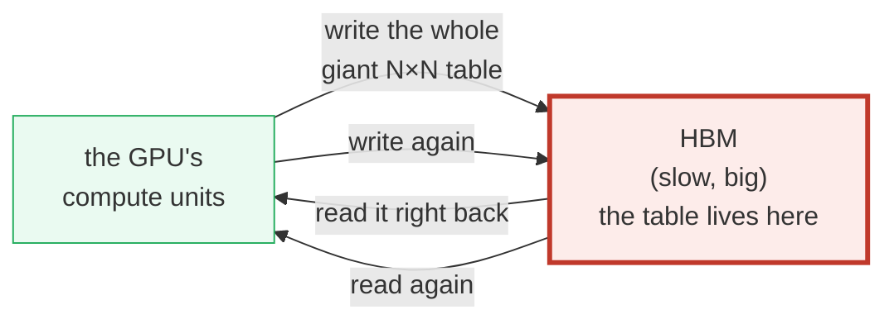
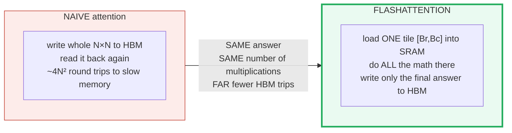
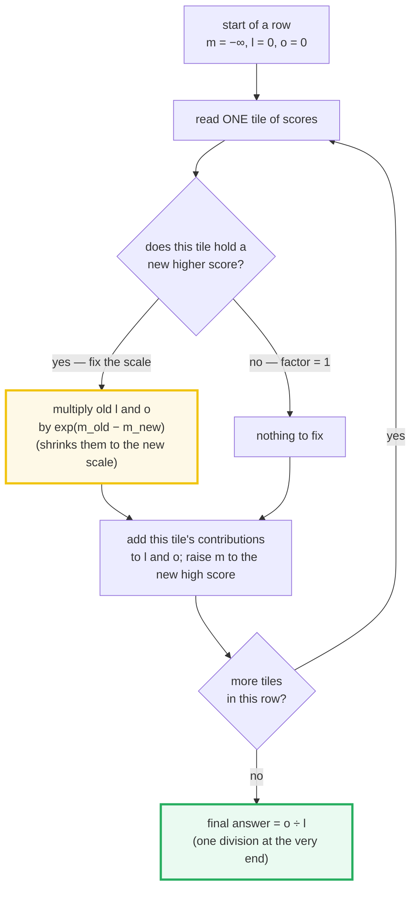
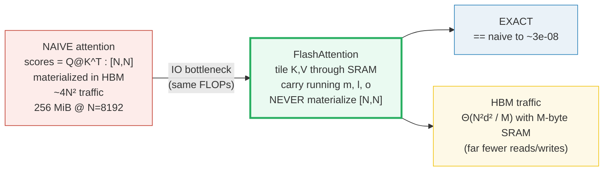
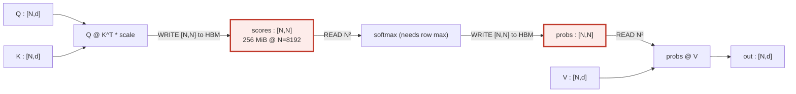
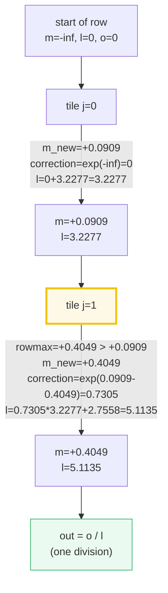
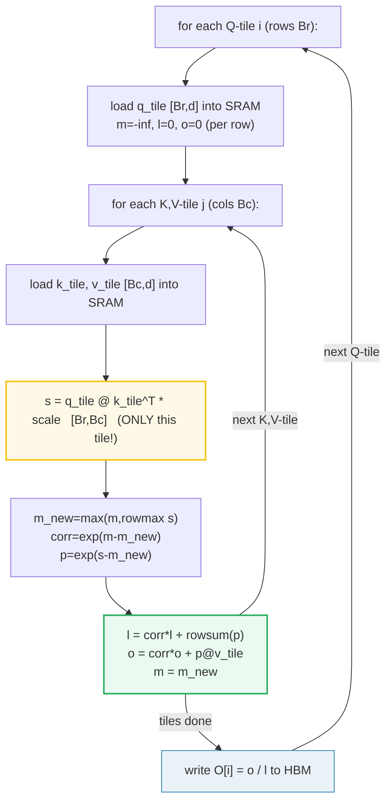
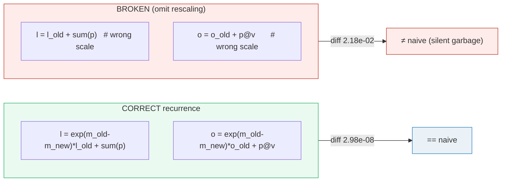
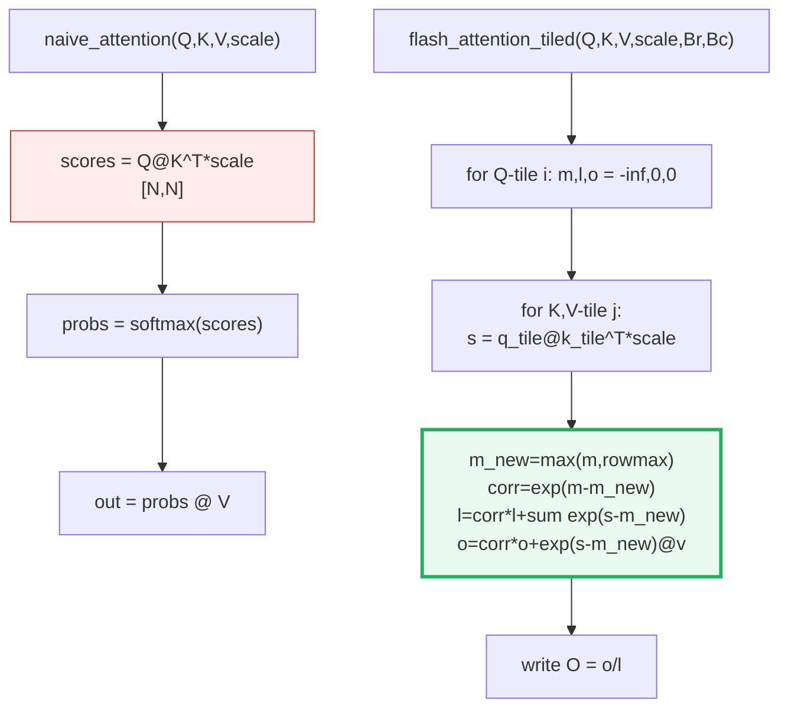
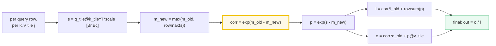

# FlashAttention — A Visual, Worked-Example Guide

> **Companion code:** [`flash_attention.py`](./flash_attention.py). **Every number
> in this guide is printed by `uv run python flash_attention.py`** — change the
> code, re-run, re-paste. Nothing here is hand-computed.
>
> **Sibling guides:** [`ROPE.md`](./ROPE.md) & [`ABSOLUTE_PE.md`](./ABSOLUTE_PE.md)
> — position embeddings, the *other* half of the attention layer. FlashAttention
> is the *compute* half; RoPE/PE are the *position* half. Cross-references are
> marked 🔗 throughout.
>
> **Live animation:** [`flash_attention.html`](./flash_attention.html) — open in a
> browser, step the tiles, watch `m,l,o` rescale.
>
> **Source material:** `learning_guide/02_Acceleration.md` §4 (FlashAttention).

---

## 0. The whole idea — read this first (no math required)

This section is **plain English only**. If you've never heard of a "softmax" or a
"matrix," you can still follow it. The formulas come later (§3); this is the
picture behind them. We build it up in four steps.

### 0.1 The problem: attention builds a giant score table

In attention, every token "looks at" every other token to decide what matters.
For **N** tokens that means building an **N × N table of scores** — one cell per
pair of tokens. The table grows as the *square* of the sequence length:

| sequence length N | table cells (N × N) | table memory (4-byte floats) |
|---|---|---|
| 8 (our toy example) | 64 | 256 bytes |
| 1,024 | 1,048,576 | 4 MiB |
| **8,192** | **~67 million** | **256 MiB** |

> From `flash_attention.py` **Section A** — the same number, computed by the code:
> `Scaling to N=8192, d=64 (4-byte float): N*N*4 bytes = 268435456 bytes = 256 MiB
> per head per layer`.

A modern LLM runs this **once per attention head, once per layer, for every token
it touches**. 256 MiB is *one head of one layer* — and there are dozens of each.

### 0.2 The slow part is the *shuffling*, not the *math*

A GPU has two kinds of memory, and which one you use is the whole story:

- **HBM (the "slow" main memory)** — big (tens of GB) but far from the compute.
  Every read or write here costs real time.
- **SRAM (the "fast" scratchpad)** — tiny (a few KB to a few MB) but right next to
  the compute units. Blazing fast, but can't hold much.

Naive attention does the obvious thing: compute the whole giant score table, then
**write it out to slow HBM**, **read it right back** to turn it into percentages
(softmax), **write the percentages to HBM again**, and **read them back** for the
final step. That round-trip to slow memory — not the arithmetic — is what wastes
time.



> **One plain sentence:** LLMs are starved for memory *bandwidth*, not compute.
> The chip can do the math fast — it spends most of its time waiting on trips to
> slow memory. This is called being **bandwidth-bound**.

### 0.3 The fix: work in tiny chunks that never leave the fast memory

FlashAttention's move: **never build the giant table in slow memory at all.**
Instead, process the scores **one small chunk at a time**, keeping each chunk
inside the GPU's tiny-but-fast SRAM. Those small chunks are called **tiles** (or
**blocks**). Each tile is small enough to fit in SRAM, so it never round-trips
through HBM.



> **One plain sentence:** same math, same answer, far less shuffling. It is *not*
> an approximation — the output is identical to naive attention (the biggest
> difference is `2.98e-08`, pure float noise; we prove it in §5).

### 0.4 The clever core: online softmax

Here is the only genuinely tricky part. **Softmax** is the step that turns raw
scores into "percentages that sum to 1." To stay numerically stable, standard
softmax must know the **single biggest score in the whole row** *before* it can
compute anything — it subtracts that max from every score first. That requirement
seems to force us to keep the entire row (the entire giant table) around before we
can do anything. **Online softmax is the escape hatch.**

Online softmax reads the row **one tile at a time** and keeps three running
numbers per row:

- **`m` — the running HIGH SCORE** (the largest score seen *so far*).
- **`l` — the running SUM** (a running total, used to normalize at the very end).
- **`o` — the running OUTPUT** (the answer, built up tile by tile).

The key trick: whenever a new tile reveals a score **higher** than the current
high score `m`, we **fix everything we accumulated so far** by multiplying it by a
correction factor `exp(m_old − m_new)`. Since `m_old < m_new`, this factor is less
than 1 — it *shrinks* the old contributions down to the new (correct) scale. Then
we add the new tile's contribution. At the very end, the answer is simply
`o ÷ l`.



> **One plain sentence:** you never need the whole row at once — just keep a
> running high score `m`, sum `l`, and output `o`, and rescale the past whenever
> the high score rises. The rescaling factor `exp(m_old − m_new)` is the single
> idea that makes chunked exact softmax possible.

### 0.5 The one thing you must not forget

Forget the `exp(m_old − m_new)` rescaling and your running sum `l` and output `o`
are now on the **wrong scale** — they were built using a high score that turned out
to be too small, so every earlier contribution is too large. The result is a
**silently-wrong answer** (or `NaN` if you are unlucky). The numbers in §5 prove
it: the *correct* tiled version differs from naive by only `2.98e-08`; the
*broken* version (rescaling omitted) differs by `2.18e-02` — roughly a million
times worse. **That single correction factor is load-bearing.** This is the #1
implementation bug, which is why the rest of this guide spends so much time on it.

### 0.6 Reassurance: it is EXACT

Despite all this machinery, FlashAttention gives the **same answer** as plain naive
attention — not a close approximation. The `2.98e-08` gap is pure floating-point
rearrangement noise (the same kind of difference you'd get from adding the same
numbers in a different order). It is a **memory-traffic trick**, full stop. We
assert `tiled == naive` in code on every run (§5).

### 0.7 Glossary — every term we use, defined once

| Term | Plain meaning |
|---|---|
| **attention** | The step where each token looks at all others to decide what matters. |
| **softmax** | Turns a list of raw scores into "percentages that sum to 1." Needs the biggest score first (for numerical stability). |
| **scores** (`S`) | The `N × N` table of "how much token *i* cares about token *j*." Computed as `Q @ Kᵀ`. |
| **HBM** | The GPU's **slow, big** main memory. Trips here are expensive. |
| **SRAM** | The GPU's **fast, tiny** scratchpad (KB–MB). Where tiles live. |
| **tile / block** | A small chunk of the data (e.g. `[Br × Bc]` scores) small enough to fit in SRAM. |
| **running max `m`** | The biggest score seen *so far* in a row, updated each tile. Starts at `−∞`. |
| **running sum `l`** | A running total used to normalize the answer at the very end. Starts at `0`. |
| **running output `o`** | The answer, built up tile by tile; divided by `l` at the end. Starts at the `0` vector. |
| **rescaling factor** | `exp(m_old − m_new)` — shrinks the past to the new scale when the max rises. `< 1` when the max moves, `= 1` when it doesn't, `= 0` on the very first tile. |
| **tiling** | Processing data in small chunks (tiles) instead of all at once. |
| **exact (vs approximate)** | Exact = identical answer to naive. FlashAttention is **exact** (gap ~3e-08, just float noise). |
| **bandwidth-bound** | Limited by *memory trips* (bandwidth), not by *arithmetic* (FLOPs). LLM inference is this. |

---

### 0.8 The one-picture summary

Standard ("naive") attention computes `scores = Q @ K^T` — an `[N, N]` matrix that
**lives in slow HBM**. For `N=8192` that is **256 MiB per head per layer**, read
and written at every layer. Because LLM inference is **memory-bandwidth bound**,
this HBM traffic — not the FLOPs — is the bottleneck.



| | **Naive attention** | **FlashAttention** |
|---|---|---|
| Materializes `[N,N]`? | **YES** (in HBM) | **NO** (one tile `[Br,Bc]` in SRAM at a time) |
| HBM traffic | `~4N²` | `Θ(N²d² / M)` — far less |
| FLOPs | `2N²d` | **same** `2N²d` (it is not an approximation) |
| Result vs naive | — | **identical** (`max|diff| ≈ 3e-08`, see §5) |
| Trick needed | none | **online softmax** (running max `m`, sum `l`, output `o`) |

> **The single sentence to remember:** FlashAttention is *not* faster because it
> does fewer multiplications — it does the *same* number. It is faster because it
> **reads/writes slow HBM far less** by keeping the `[N,N]` matrix decomposed into
> tiles that never leave fast on-chip SRAM, stitched together by a running-max
> softmax recurrence.

Now the rigorous version, with the code's numbers. ↓

---

## 1. The naive baseline and the `[N,N]` HBM problem — Section A

Attention for one head is, in full:

```
scores = Q @ K^T * (1/sqrt(d))     # [N, N]   <-- the whole matrix materialized in HBM
probs  = softmax(scores, dim=-1)   # [N, N]   <-- read N², write N²
out    = probs @ V                 # [N, d]   <-- read N² again
```

The HBM (high-bandwidth memory, the GPU's main DRAM) round-trips dominate:
writing `scores` once, reading it for softmax, writing `probs`, reading it for the
final matmul. The leading term is **`~4N²` floats** shuffling through HBM.

> From `flash_attention.py` **Section A** — the materialized `[8,8]` score matrix
> `S = Q @ K^T / sqrt(d)` (`N=8, d=8, scale = 0.3536`):
>
> | q\k | k=0 | k=1 | k=2 | k=3 | k=4 | k=5 | k=6 | k=7 |
> |---|---|---|---|---|---|---|---|---|
> | q=0 | −0.1160 | **+0.0909** | −0.0998 | −0.4400 | −0.3969 | +0.0736 | **+0.4049** | −0.1240 |
> | q=1 | +0.1595 | +0.0673 | −0.0434 | −0.4481 | −0.0200 | +0.0276 | +0.2197 | +0.2710 |
> | q=2 | −0.2861 | +0.1418 | −0.0041 | −0.2182 | +0.2089 | −0.0232 | +0.4081 | +0.2560 |
> | q=3 | +0.0296 | −0.1254 | +0.0781 | −0.4158 | −0.4133 | +0.0830 | +0.2035 | +0.0956 |
> | q=4 | −0.0327 | +0.0913 | +0.1463 | +0.0832 | −0.2202 | −0.0010 | −0.0073 | +0.0617 |
> | q=5 | +0.5159 | +0.0707 | −0.1574 | −0.1376 | −0.5931 | −0.1283 | +0.0715 | −0.1468 |
> | q=6 | +0.1365 | −0.0496 | +0.0134 | +0.0490 | −0.0689 | +0.1214 | −0.2589 | +0.1266 |
> | q=7 | +0.4462 | −0.2285 | +0.0145 | +0.1127 | +0.5438 | +0.3833 | −0.4868 | +0.0673 |

(Highlighted on `q=0`: the per-tile local maxima — they will matter in §3.)

> From `flash_attention.py` **Section A** — HBM traffic estimate:
>
> - `S` written once: `N*N` floats; `softmax` reads `N*N` and writes `N*N`;
>   `out = P @ V` reads `N*N + N*d`. Leading term **`~4N²` floats**.
> - **Scaling to `N=8192, d=64` (4-byte float): `N*N*4 = 268435456 bytes = 256 MiB`
>   per head per layer**, read+written at every one of `(layers × heads)` calls.
>   *Catastrophic.*



The two big red boxes are the `[N,N]` matrices in HBM. **Every arrow is bandwidth
spent.** FlashAttention's goal: make those boxes small enough to live entirely in
SRAM and never round-trip through HBM.

> 🔗 The `Q,K,V` here are the *rotated* outputs of [`ROPE.md`](./ROPE.md) §6 —
> FlashAttention operates on `[B,H,L,D]` attention **after** RoPE has been applied
> to `Q` and `K`. This guide flattens batch/head and focuses on the `[N,d]`
> per-head core.

---

## 2. Why streaming softmax is non-obvious — Section B

The naive plan above is fine on paper. The problem: **softmax needs the full row
max *before* it can normalize**. So if we want to avoid the `[N,N]` matrix, we'd
need to compute softmax *one tile at a time* — but a tile's local max is **not**
the global max.

> From `flash_attention.py` **Section B** — row `q=0`, split into two `Bc=4` tiles:
>
> | tile | keys | local rowmax | global max so far |
> |---|---|---|---|
> | j=0 | [0,1,2,3] | **+0.0909** | +0.0909 |
> | j=1 | [4,5,6,7] | **+0.4049** | +0.4049 |

Tile `j=1` **raises the running max** from `+0.0909` to `+0.4049`. Every `exp()`
term we accumulated during tile `j=0` was computed with the *wrong* (too small)
max — it is too large by a factor of `exp(0.0909 − 0.4049)`. The naive reaction is
"then I must keep the whole row." That reaction is what produces the `[N,N]`
matrix. **The online softmax recurrence (next section) is the escape hatch.**

---

## 3. The online softmax recurrence — Section C (the heart)

The trick (Milakov & Gimelshein 2018; adopted by FlashAttention): carry three
running quantities **per query row** as you stream through K/V tiles, and **rescale
the accumulators whenever the max moves**.

**Anchor recurrence (web-verified — see [Sources](#sources)).** For a query row
processing K/V tile `j` with local scores `s`:

```
m_new = max(m_old, rowmax(s))                 # update running HIGH SCORE
p     = exp(s - m_new)                        # [Br,Bc], shifted by the new high score
l_new = exp(m_old - m_new) * l_old + rowsum(p)    # rescale past, add new
o_new = exp(m_old - m_new) * o_old + p @ v_tile   # rescale past, add new
m_old = m_new
```
**final output row** `= o / l` (one division at the very end).

The factor **`exp(m_old − m_new)`** is the entire magic. When the max increases,
it is `< 1` and shrinks every previously-accumulated term down to the new
denominator. When the max is unchanged it is exactly `1` (no-op). On the **first**
tile `m_old = −∞`, so `exp(−∞ − m_new) = 0` — which correctly zeroes the empty
accumulators and seeds them with just this tile's contribution.

### 3.1 Worked example, narrated: query row `q=0` across two tiles

This is the row from §2 whose high score moves. We have `Bc=4`, so the 8 keys split
into **two tiles**. Walk through it slowly — this is the make-or-break moment.

**Tile j=0 (keys 0,1,2,3) — the high score is first discovered here.**

Before this tile, the accumulators are empty: `m_old = −∞`, `l_old = 0`,
`o_old = 0`. The tile's local max is `+0.0909`, so that becomes the new high score
`m_new = +0.0909`. The correction factor is `exp(−∞ − 0.0909) = 0` — i.e. "there is
no past to fix, just start fresh." We seed `l` and `o` with this tile's own
contribution.

> From `flash_attention.py` **Section C** — `q=0`, `Bc=4`, two K/V tiles:
>
> **Tile j=0** (keys 0,1,2,3):
> ```
> scores s   = [-0.1160, +0.0909, -0.0998, -0.4400]
> rowmax(s)  = +0.0909
> m_old      = -inf
> m_new      = max(m_old, rowmax) = +0.0909
> correction = exp(m_old - m_new) = 0.0000   ← first tile: empty history wiped
> p          = [0.8131, 1.0000, 0.8264, 0.5881]
> l_new      = correction*l_old + sum(p) = 0.0000*0 + 3.2277 = +3.2277
> o_new      = correction*o_old + p@v_tile = [-0.4464, -0.2905, -1.0848, +0.1282,
>                                             +0.1119, -0.0819, +0.6012, -0.2488]
> (m,l,o) after = m=+0.0909, l=+3.2277
> ```

**Tile j=1 (keys 4,5,6,7) — the rescaling factor lights up.**

Now the past is *not* empty: `m_old = +0.0909`, `l_old = 3.2277`. This tile's local
max is `+0.4049`, which is **bigger** than the old high score — so the high score
*must* rise. The correction factor is `exp(0.0909 − 0.4049) = 0.7305`. **That 0.7305
is the whole trick in action**: before adding this tile's contribution, we shrink
the past `l` and `o` by 0.7305 so they are expressed relative to the *new* (higher)
high score. Then we add the new tile. The two contributions now share the same
scale and add correctly.

> **Tile j=1** (keys 4,5,6,7):
> ```
> scores s   = [-0.3969, +0.0736, +0.4049, -0.1240]
> rowmax(s)  = +0.4049
> m_old      = +0.0909
> m_new      = max(m_old, rowmax) = +0.4049
> correction = exp(m_old - m_new) = +0.7305   ← THE rescaling! past l,o shrunk
> p          = [0.4485, 0.7180, 1.0000, 0.5893]
> l_new      = correction*l_old + sum(p) = +0.7305*3.2277 + 2.7558 = +5.1135
> o_new      = correction*o_old + p@v_tile = [-0.3441, -0.7496, -1.1122, +0.1029,
>                                             +0.9256, -0.7843, +1.1381, -0.5088]
> (m,l,o) after = m=+0.4049, l=+5.1135
> ```
> **Cross-check** (one-shot global result the recurrence must match):
> `global m = +0.4049`, `global l = +5.1135`,
> `out = o/l = [-0.0673, -0.1466, -0.2175, +0.0201, +0.1810, -0.1534, +0.2226, -0.0995]`.



**The two tiles' `l`'s add up correctly** (`0.7305·3.2277 + 2.7558 = 5.1135`) only
*because* the first tile's `l` was rescaled by `0.7305` first. Skip that rescaling
and the row is unnormalized — §5 shows it diverging from naive by `2.18e-02`.

---

## 4. The full tiled algorithm — Sections D & E

Generalize §3 to a 2D tile loop: outer loop over **Q-tiles** (rows, size `Br`),
inner loop over **K/V-tiles** (cols, size `Bc`). Each `(m, l, o)` triplet is a
`[Br]` / `[Br]` / `[Br, d]` tensor carried in SRAM; only the final `o/l` is written
to HBM.



> From `flash_attention.py` **Section D** — full tiled run, `N=8, d=8, Br=Bc=4`
> (`Tr=2` Q-tiles, `Tc=2` K/V-tiles). Tiled output `out = o/l` after the last tile:
>
> ```
> q=0: [-0.0673, -0.1466, -0.2175, +0.0201, +0.1810, -0.1534, +0.2226, -0.0995]
> q=1: [-0.0869, -0.1722, -0.1426, +0.0429, +0.1965, -0.1631, +0.1951, -0.1364]
> q=2: [-0.0483, -0.1822, -0.1586, +0.0177, +0.1988, -0.1705, +0.1755, -0.0755]
> q=3: [-0.0909, -0.1532, -0.1658, +0.0661, +0.1783, -0.1459, +0.1959, -0.1446]
> q=4: [-0.0699, -0.1647, -0.1881, +0.0550, +0.1415, -0.1415, +0.1624, -0.1159]
> q=5: [-0.1143, -0.1606, -0.2405, +0.0533, +0.1633, -0.1072, +0.2689, -0.1515]
> q=6: [-0.0709, -0.1749, -0.1611, +0.0700, +0.1426, -0.1509, +0.1702, -0.1519]
> q=7: [-0.0292, -0.1977, -0.1412, +0.0884, +0.1608, -0.1492, +0.2218, -0.1576]
> ```
> `[check] max|tiled - naive| = 2.98e-08` — **`[check] FlashAttention == naive
> attention (atol=1e-5): OK (EXACT, not approximate)`**.

To *see* the rescaling across the whole Q-tile, here is the running `(m, l, |o|max)`
after each K/V tile for Q-tile `i=0` (rows `q=0..3`):

> From `flash_attention.py` **Section E**:
>
> | step | q=0: m / l / \|o\|max | q=1: m / l / \|o\|max | q=2: m / l / \|o\|max | q=3: m / l / \|o\|max |
> |---|---|---|---|---|
> | j=0 | +0.091 / 3.228 / 1.085 | +0.159 / 3.273 / 1.093 | +0.142 / 3.214 / 1.120 | +0.078 / 3.379 / 1.086 |
> | j=1 | +0.405 / 5.113 / 1.138 | +0.271 / 6.409 / 1.260 | +0.408 / 5.790 / 1.151 | +0.204 / 6.304 / 1.235 |

**Reading the table:** at tile `j=1`, `q=0`'s `m` jumps `+0.091 → +0.405`. The
prior `l` and `o` got multiplied by `exp(0.091−0.405)=0.731` before the new tile's
contributions were added. **THAT correction is the whole trick.** Note every query
row's `m` is non-decreasing across tiles (a running max can only go up), and `l`
only grows after rescaling.

> 🔗 The kernel runs this exact tile loop on Apple Silicon GPUs in `flash_attention.metal`
> (see `learning_guide/02_Acceleration.md` §4.4): one threadgroup per
> `(head, Q-tile)`, `m,l` in registers, `q_local`/`o_i` in `~32 KB` of threadgroup
> SRAM. Block size `Br=Bc=32` is chosen to *exactly fill* Apple's per-threadgroup
> SRAM limit.

---

## 5. Equivalence and the rescaling pitfall — Section F

FlashAttention is **exact**. The proof is one assertion away: run both, diff.

> From `flash_attention.py` **Section F**:
>
> | variant | max\|out − naive\| | verdict |
> |---|---|---|
> | tiled (correct) | **2.98e-08** | OK |
> | tiled (no rescaling) | **2.18e-02** | WRONG |
>
> `[check] tiled == naive (atol=1e-5): OK (diff=2.98e-08)`
> `[check] broken diverges: OK (diff=2.18e-02 >> 1e-5)`



**Why the broken one fails:** when a later tile raises `m`, every earlier
`exp(s − m_old)` term was computed with a smaller `m`. They are too large by a
factor of `exp(m_old − m_new)`. Skipping the correction leaves `l` and `o` on the
wrong scale → output is **silently wrong** (or `NaN` if `m_old = −∞` leaked into a
non-rescaled path). This is the #1 implementation bug and the reason the
recurrence is reproduced *verbatim* in [`flash_attention.py`](./flash_attention.py).

---

## 6. The reference code (`flash_attention.py`) — annotated



Three functions in [`flash_attention.py`](./flash_attention.py):
- `naive_attention` — materializes `[N,N]`, the baseline (§1).
- `flash_attention_tiled` — the tiled online-softmax algorithm, exact (§3–§4).
  Optional `trace_row=` prints the per-tile `(m,l,o)` evolution used by §3.
- `flash_attention_broken` — omits the `exp(m_old−m_new)` rescaling; the
  demonstration that the correction is load-bearing (§5).

Quick equivalence test (from the guide):

```python
from flash_attention import make_inputs, naive_attention, flash_attention_tiled
import math
Q, K, V = make_inputs(seed=0)               # N=8, d=8, deterministic
scale = 1/math.sqrt(Q.shape[1])
out_naive, _ = naive_attention(Q, K, V, scale)
out_tiled = flash_attention_tiled(Q, K, V, scale, Br=4, Bc=4)
assert (out_tiled - out_naive).abs().max() < 1e-5   # exact
```

---

## 7. Pitfalls & debugging checklist

| # | Mistake | Symptom | Fix |
|---|---|---|---|
| 1 | **Omitting `exp(m_old − m_new)`** on `l`/`o` | Silent wrong output (diff `~2e-2`), or `NaN` | Apply the correction to *both* `l` and `o` every tile (§5) |
| 2 | Computing `p = exp(s − m_old)` (stale max) | Wrong normalization | Use `m_new`, the just-updated max |
| 3 | Forgetting the final `o / l` division | Output magnitudes wildly off | Divide once after the tile loop |
| 4 | Initializing `m = 0` instead of `−∞` | First-tile correction wrong → bias | `m_i = full((Br,), -inf)` |
| 5 | SRAM budget | Using `Br=Bc=128` without checking if your SRAM can actually hold the tiles. | Pick `Br,Bc` from SRAM budget: `Br·d + Bc·d` floats ≤ SRAM. |
| 6 | Treating it as an *approximation* | Wrong mental model | It is **EXACT**; assert `==` naive (§5) |
| 7 | Causal mask on a tiled score without masking the `-inf` rows | `NaN` via `exp(−inf − −inf)` | Mask future cells to `−inf` *before* the max/exp |

> 🔗 Contrast with [`ROPE.md`](./ROPE.md) §10's offset bug: both are "silent
> corruption, no error" traps inside the attention layer. RoPE's is a *position*
> bug; FlashAttention's is a *normalization* bug.

---

## 8. Cheat sheet



- **Naive:** `scores=Q@K^T/√d` `[N,N]` in HBM; `~4N²` traffic; **256 MiB @ N=8192**.
- **FlashAttention:** tile `K,V` through SRAM, carry running `m,l,o`, **never**
  materialize `[N,N]`. Same FLOPs, far less HBM traffic.
- **Exact:** `max|tiled − naive| ≈ 3e-08` (§5). NOT an approximation.
- **Magic factor:** `exp(m_old − m_new)` — rescales all prior accumulators when the
  running max rises. `1.0` if max unchanged; `0.0` on the first tile.
- **Final:** one division `out = o / l` per row after the tile loop.
- **Pitfall #1:** forgetting the rescaling → diff `~2e-2`, silent garbage.

> 🔗 FlashAttention is the *compute* half of the attention layer. The *position*
> half is [`ROPE.md`](./ROPE.md) (rotate) / [`ABSOLUTE_PE.md`](./ABSOLUTE_PE.md)
> (add). Step through both halves live: [`flash_attention.html`](./flash_attention.html).

---

## Sources

Recurrences and claims are web-verified against these sources (≥2 each for the
online-softmax recurrence):

- **FlashAttention: Fast and Memory-Efficient Exact Attention with IO-Awareness**
  — Dao, Fu, Ermon, Rudra, Ré (2022). **arXiv:2205.14135.**
  https://arxiv.org/abs/2205.14135 — confirms **exact** (not approximate),
  **IO-aware tiling** HBM↔SRAM, and the online-softmax update. The title itself
  ("Exact Attention with IO-Awareness") states the two headline facts.
- **Online normalizer calculation for softmax** — Milakov & Gimelshein (2018).
  **arXiv:1805.02867.** https://arxiv.org/abs/1805.02867 — the original
  running-max / `exp(m_old − m_new)` rescaling recurrence (Algorithms 1–3).
- **Online Softmax to Flash Attention** — Hugging Face blog by atharv6f,
  https://huggingface.co/blog/atharv6f/flash-attention-online-softmax — a full
  step-by-step derivation of `m`, `l`, `o` and the rescaling factor, including a
  proof that the algorithm is *exact*.
- **Streaming softmax: the recurrence that makes FlashAttention work** —
  https://medium.com/@saucam/streaming-softmax-the-recurrence-that-makes-flashattention-work-75ce1a5412d6
  — secondary derivation of the same recurrence (`m_new, l_new, o_new`).
- **FlashAttention from First Principles** —
  https://medium.com/@nandpatel1456/flashattention-from-first-principles-io-aware-exact-attention-via-tiling-and-recomputation-1a824ce1aec1
  — independent confirmation of the tiled algorithm + exactness.
- Local source: `learning_guide/02_Acceleration.md` §4.1–§4.3 (the `[N,N]` HBM
  problem, the online softmax trick, and the tiled pseudocode).
