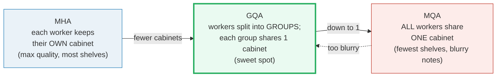
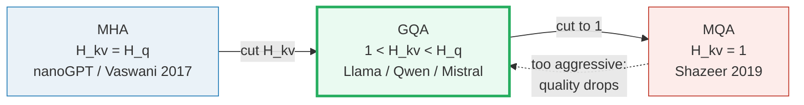
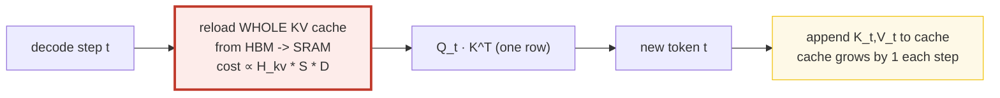
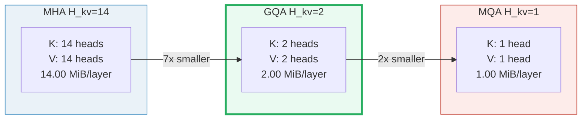
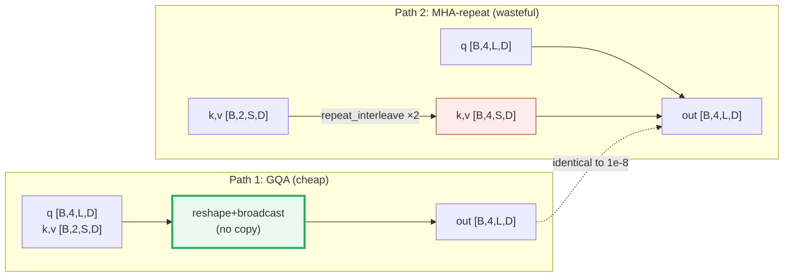
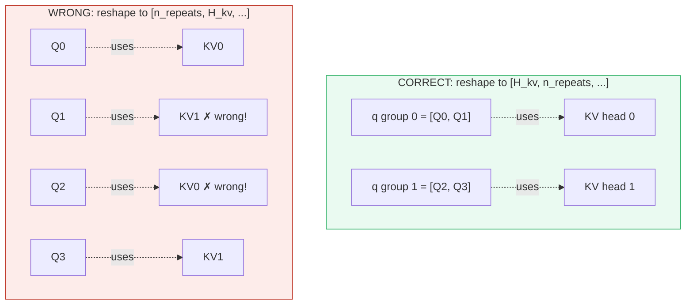
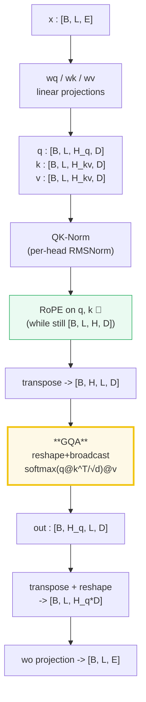
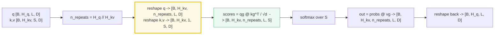

# Grouped-Query Attention (GQA) — A Visual, Worked-Example Guide

> **Companion code:** [`gqa.py`](./gqa.py). **Every number in this guide is
> printed by `uv run python gqa.py`** — change the code, re-run, re-paste.
> Nothing here is hand-computed.
>
> **Sibling guides:** [`ROPE.md`](./ROPE.md) (rotates Q/K on `[B,L,H,D]` *before*
> the transpose this guide assumes) and [`ABSOLUTE_PE.md`](./ABSOLUTE_PE.md).
> Cross-references are marked 🔗 throughout.
>
> **Live animation:** [`gqa.html`](./gqa.html) — open in a browser.
>
> **Source material:** `learning_guide/00_Foundations.md` §7.5 and
> `learning_guide/01_Math_Pipe.md` §2.5.

---

## 0. TL;DR — the whole lineage in one picture

### Read this first — the office with the filing cabinets

You don't need any math to get the idea. Picture an office with **workers**
and **filing cabinets**:

- There are **H_q workers** (the *query heads*). Each worker's job is to look at
  the new word and ask "which past words matter to me?"
- To answer, every worker reads from a **filing cabinet of past notes** — that
  cabinet is the **KV cache** (the stored *Keys* = relevance tags, and *Values* =
  the notes themselves, for every word the model has seen so far).
- At serving time (generating text one word at a time), every single step **all
  the workers re-read their cabinets** from slow memory. **Fewer cabinets = less
  to re-read = faster generation.** *That is the entire reason GQA exists.*

The three designs differ only in **how many cabinets** there are:



For the bundle's reference config **"Qwen3-0.5B"** (a Qwen-class 0.5B config
whose 14/2 head shape matches **Qwen2.5-0.5B**; real Qwen3-0.6B uses 16/8 — see
[Sources](#sources)): **14 workers, 2 cabinets → 7 workers per cabinet**. That
`7` is the whole story — it is `n_repeats = 14 // 2`.

> **One-line definition:** *Grouped-Query Attention* = give the `H_q` query
> heads only `H_kv < H_q` shared key/value heads, so groups of query heads
> **share a cabinet**. `H_kv` is a dial: all the way up (`= H_q`) you get MHA;
> all the way down (`= 1`) you get MQA; in between you get GQA.

### Glossary (every term used below)

| Term | Plain meaning |
|---|---|
| **query head** | a "worker" — one of `H_q` parallel question-askers |
| **key/value head** | a "cabinet" — a shared store of past-token notes (a *Key* = relevance tag, a *Value* = the note). There are `H_kv` of these |
| **KV cache** | the cabinets, full of past notes — **re-read from slow memory every single decode step** |
| **`H_q`** | number of query heads (workers). Here `14` |
| **`H_kv`** | number of key/value heads (cabinets). Here `2`. Must divide `H_q` evenly |
| **`n_repeats`** | workers per cabinet `= H_q // H_kv`. Here `7` |
| **broadcasting** | letting every worker in a group read the **same** cabinet **without physically photocopying it** — this is the trick that keeps GQA cheap |
| **reshape** | relabeling a tensor's axes (no data copied) so the group structure is visible and broadcasting can do its job |

---

### The technical TL;DR

Attention is `softmax(Q·Kᵀ/√d)·V`. The question this guide answers: **how many
distinct K and V heads do we keep?** That single number (`H_kv`) is a dial between
*quality* and *decode memory bandwidth*.



| | **MHA** | **GQA** (sweet spot) | **MQA** |
|---|---|---|---|
| **H_kv** | `= H_q` | `1 < H_kv < H_q` (divides H_q) | `1` |
| **n_repeats** | 1 | `H_q // H_kv` | `H_q` |
| **KV cache** | largest | **H_q/H_kv × smaller** | smallest |
| **Quality** | best | **≈ MHA** (Ainslie 2023) | drops |
| **Decode speed** | slow | **≈ MQA** | fastest |
| **Used by** | GPT-2 / nanoGPT | Llama, Qwen, Mistral | PaLM, T5-11B |

> 🔗 **Why GQA exists, in one line:** during autoregressive decode, every step
> reloads the *entire* key/value cache from HBM; that cache is proportional to
> `H_kv`, **not** `H_q` (Shazeer 2019). Cutting `H_kv` cuts memory bandwidth
> linearly. MQA cuts it all the way to 1 but hurts quality; GQA keeps a few
> groups and recovers ~all of MHA's quality at ~MQA's speed.

---

## 1. Why the KV cache is the serving bottleneck

Training is parallel — all positions are computed at once, and you can stream K,V
through SRAM. **Decode is serial:** one new token per step, and to produce it you
must re-read the K,V of *every past token* from HBM into the compute cores.



The K and V tensors together have size (per layer):

```
KV cache elements = num_layers × 2 × H_kv × S × D
                    └─layers──┘   └2┘ └H_kv┘ └S┘ └D┘
                                   K+V  heads  tokens  head-dim
```

This is the **memory-bandwidth** cost per decode step. `H_q` (query heads) does
**not** appear — only ONE new query token is processed per step, so queries are
cheap; the *cached* keys and values are what we pay for, again and again. 🔗 This
is also why the [KV cache + `offset`](./ROPE.md#10-the-offset-parameter--kv-cache-prefill-vs-decode)
machinery matters so much.

---

## 2. The lineage: MHA → MQA → GQA (the *why*)

| Step | Paper | Idea | Trade-off |
|---|---|---|---|
| **MHA** | Vaswani et al. 2017 ("Attention Is All You Need") | `H_q` query heads, `H_kv = H_q` KV heads — each Q-head has its own K,V | max expressivity, max KV memory |
| **MQA** | Shazeer 2019 ("Fast Transformer Decoding") | collapse to `H_kv = 1` — ALL Q-heads share ONE K,V | min memory, but quality drops |
| **GQA** | Ainslie et al. 2023 ("GQA") | keep `H_kv` groups (`1 < H_kv < H_q`, `H_q % H_kv == 0`) | **sweet spot**: ≈MHA quality, ≈MQA speed |

> From `gqa.py` **Section A** — fix `H_q = 14` (Qwen3-0.5B), vary `H_kv`:
>
> | config | H_q | H_kv | n_repeats = H_q//H_kv | KV heads per Q-head |
> |---|---|---|---|---|
> | MHA | 14 | 14 | 1 | 1 own |
> | GQA | 14 | 2 | 7 | 1 shared by 7 |
> | MQA | 14 | 1 | 14 | 1 shared by 14 |

GQA is literally an **interpolation**: `H_kv = H_q` collapses to MHA, `H_kv = 1`
collapses to MQA, anything in between is GQA. Ainslie et al. showed empirically
that a *grouped* middle ground "achieves quality close to multi-head attention
with comparable speed to MQA."

---

## 3. KV-cache memory math — Section B output

The headline formula, with concrete Qwen3-0.5B numbers:

```
elements_per_layer = 2 * H_kv * S * D          (the 2 = one K + one V)
bytes_per_layer    = elements * bytes_per_element   (2 for fp16)
```

> From `gqa.py` **Section B** — Qwen3-0.5B (`H_q=14, H_kv=2, D=64, layers=28`), `S=4096`, fp16:
>
> | variant | H_kv | elements/layer = 2·H_kv·S·D | bytes/layer (fp16) | savings vs MHA |
> |---|---|---|---|---|
> | MHA | 14 | 7,340,032 | 14.00 MiB | 1.0x (baseline) |
> | GQA | 2 | 1,048,576 | 2.00 MiB | **7.0x smaller** |
> | MQA | 1 | 524,288 | 1.00 MiB | 14.0x smaller |
>
> Total KV cache (all 28 layers), GQA, fp16, S=4096:
> `= 28 * 2 * 2 * 4096 * 64 * 2 bytes = 29,360,128 elements = 58,720,256 bytes = 56.0 MiB`.
> Had this been MHA (`H_kv=14`) the cache would be **7× bigger** (≈392 MiB).

**In one plain sentence:** for Qwen3-0.5B at 4096 tokens, GQA re-reads **56 MiB**
of cabinets per layer-set each step instead of ~392 MiB — that 7× cut in memory
traffic is the whole reason the model can generate fast.



> 🔗 Note the savings ratio is exactly `H_q/H_kv` — it is **layer- and
> sequence-independent**. Double the context and GQA still saves 7× vs MHA; this
> is what makes long-context serving affordable.

---

## 4. The broadcast reshape trick — Section C output

The naive way to do GQA: **photocopy** each cabinet `n_repeats` times so every
worker gets a private copy, then run plain MHA. That throws away the whole
memory win — you've materialized the full MHA-size cabinet set. The trick is:
**never copy.**

> **In plain English:** instead of copying each cabinet 7 times (wasteful), we
> tell the computer *"these 7 workers are a group"* and let them all **point at
> the one cabinet**. The math handles the sharing automatically — the cabinet
> count stays `H_kv`, it never balloons to `H_q`. We do this by *reshaping*
> (relabeling axes, no data copy) to expose the group structure, then letting
> `matmul` broadcast over the shared axis. (Caveat: you must group them in the
> **right order** — see [§7](#7-the-reshape-order-pitfall--section-e-output-the-1-bug).)

> From `gqa.py` **Section C** — tiny model `B=1, H_q=4, H_kv=2, L=4, S=4, D=8, n_repeats=2`:
>
> ```
> Input (attention layout, AFTER [B,L,H,D]->[B,H,L,D] transpose):
>   q: (1, 4, 4, 8) = [B, H_q,  L, D]
>   k: (1, 2, 4, 8) = [B, H_kv, S, D]
>   v: (1, 2, 4, 8) = [B, H_kv, S, D]
>
> Step 1  reshape to expose groups (KV is NEVER copied):
>   q -> qg: (1, 4, 4, 8) -> (1, 2, 2, 4, 8) = [B, H_kv, n_repeats, L, D]
>   k -> kg: (1, 2, 4, 8) -> (1, 2, 1, 4, 8) = [B, H_kv, 1,        S, D]   <- size-1 broadcasts
>   v -> vg: (1, 2, 4, 8) -> (1, 2, 1, 4, 8) = [B, H_kv, 1,        S, D]
>
> Step 2  scores = qg @ kg^T * 1/√D  -> (1, 2, 2, 4, 4) = [B, H_kv, n_repeats, L, S]
> Step 3  softmax over S, then @ vg  -> (1, 2, 2, 4, 8) = [B, H_kv, n_repeats, L, D]
> Step 4  flatten (H_kv, n_repeats) back to H_q -> (1, 4, 4, 8) = [B, H_q, L, D]
> ```
>
> **Key point:** `k` and `v` stayed `[B, H_kv, S, D]` the whole time. Zero extra
> KV was materialized — the savings in §3 are real, not bookkeeping.

```mermaid
graph TD
    Q["q [B, H_q, L, D]"] -->|reshape| QG["qg [B, H_kv, n_repeats, L, D]"]
    K["k [B, H_kv, S, D]"] -->|reshape (size-1)| KG["kg [B, H_kv, 1, S, D]"]
    V["v [B, H_kv, S, D]"] -->|reshape (size-1)| VG["vg [B, H_kv, 1, S, D]"]
    QG --> MM["scores = qg @ kg^T / √d<br/>broadcasts n_repeats × 1"]
    KG --> MM
    MM --> SM["softmax over S"]
    SM --> OUT2["out = probs @ vg<br/>broadcasts n_repeats × 1"]
    VG --> OUT2
    OUT2 -->|reshape back| R["result [B, H_q, L, D]"]
    style MM fill:#eafaf1,stroke:#27ae60,stroke-width:3px
    style KG fill:#fef9e7,stroke:#f1c40f
    style VG fill:#fef9e7,stroke:#f1c40f
```

The crucial shape move: the **`1`** in `[B, H_kv, 1, S, D]` is what broadcasts
over the `n_repeats` axis of `qg`. PyTorch (and the MLX ref in the source guide)
expand that singleton for free during `matmul`.

---

## 5. Worked example: shapes `[B=1, H_q=4, H_kv=2, L=4, D=8]`

This is the tiny model the whole bundle is pinned to. We use **deterministic,
seeded** Q, K, V (`torch.randn(..., generator=manual_seed(0)) * 0.5`, rounded to
4 dp) so every number reproduces — including in [`gqa.html`](./gqa.html).

The grouping (this is the *only* thing GQA adds on top of MHA):

```
H_q axis (4 query heads):  [ g0: Q0, Q1 | g1: Q2, Q3 ]
                              └─ group 0 ─┘  └─ group 1 ─┘
KV heads (2):               [   KV0      |     KV1     ]

mapping:  Q0 -> KV0,  Q1 -> KV0,  Q2 -> KV1,  Q3 -> KV1
          (Q-head h uses KV-head  h // n_repeats)
```

For Qwen3-0.5B (`H_q=14, H_kv=2, n_repeats=7`): Q-heads 0..6 → KV-head 0,
Q-heads 7..13 → KV-head 1.

---

## 6. GQA == MHA-with-repeated-KV — Section D output (the proof)

> **Reassurance first:** the broadcasting trick from [§4](#4-the-broadcast-reshape-trick--section-c-output)
> is **not an approximation**. GQA gives *exactly the same answer* as MHA run on
> photocopied cabinets — just without the photocopying. We prove it below by
> computing the tiny example both ways and diffing; they match to `1e-8`.

The deep claim: **the broadcast trick is numerically identical to explicitly
copying each KV head `n_repeats` times and running plain MHA.** We prove it by
computing both ways and diffing.

> From `gqa.py` **Section D**:
>
> Two ways to compute the same thing:
> 1. **GQA** — reshape + broadcast, KV never copied.
> 2. **MHA-repeat** — `k.repeat_interleave(n_repeats, dim=1)` to get `[B, H_q, S, D]`, then plain MHA.
>
> ```
> max|GQA - MHA-repeat| = 1.490e-08
> [check] GQA == MHA(repeated KV)?  True  (atol=1e-6)
> ```
>
> The repeat mapping (`repeat_interleave`, NOT `repeat`) gives contiguous groups:
> ```
> Q-head 0 -> KV-head 0
> Q-head 1 -> KV-head 0
> Q-head 2 -> KV-head 1
> Q-head 3 -> KV-head 1
> ```



**Why `repeat_interleave` and not `repeat`?** `repeat_interleave` yields
`[kv0, kv0, kv1, kv1, ...]` — *contiguous* groups, matching how the Q heads are
laid out. `repeat` would yield `[kv0, kv1, kv0, kv1, ...]` — striped — which
pairs each Q-head with the wrong KV-head.

### The GOLD value (pinned for `gqa.html`)

> From `gqa.py` **Section D** — GQA output for Q-head `h=0`, all positions:
>
> | m | d0 | d1 | d2 | d3 | d4 | d5 | d6 | d7 |
> |---|---|---|---|---|---|---|---|---|
> | 0 | +0.1477 | +0.1235 | +0.1470 | +0.2909 | −0.0165 | +0.1233 | −0.1583 | −0.0593 |
> | 1 | +0.1701 | +0.1540 | +0.1353 | +0.2926 | −0.0287 | +0.1402 | −0.1822 | −0.0644 |
> | 2 | +0.1984 | +0.0860 | +0.1432 | +0.3035 | −0.0228 | +0.0652 | −0.1475 | −0.1401 |
> | 3 | +0.1580 | +0.1518 | +0.1443 | +0.2910 | −0.0318 | +0.1529 | −0.1785 | −0.0530 |
>
> Compact gold scalar `out[h=0, m=0, d=0] = +0.147747` — [`gqa.html`](./gqa.html)
> recomputes the full tiny case in JS and checks against this.

---

## 7. The reshape-order pitfall — Section E output (the #1 bug)

> ⚠️ **Vivid warning:** group as **`[cabinet, workers-in-group, ...]`**
> (`[..., H_kv, n_repeats, ...]`). If you swap the order to
> `[workers-in-group, cabinet, ...]`, you **scramble which worker reads which
> cabinet** — the shapes still line up, so **no error is raised, just silently
> wrong output** (half the numbers turn to garbage).

This is the most common GQA bug and it is **silent** (no error, no shape
mismatch — just garbage). The reshape order must be
`[..., H_kv, n_repeats, L, D]`, **not** `[..., n_repeats, H_kv, L, D]`.

**Why:** Q-heads are laid out as *contiguous* groups in the `H_q` axis:
`[g0h0, g0h1, g1h0, g1h1]`. Reshaping `[H_q] → (H_kv, n_repeats)` splits
row-major into `[[g0h0, g0h1], [g1h0, g1h1]]` — groups preserved. Reshaping to
`(n_repeats, H_kv)` gives `[[g0h0, g1h0], [g0h1, g1h1]]` — striped, scrambled.

> From `gqa.py` **Section E**:
>
> ```
> reshape [H_q] -> (H_kv, n_repeats):  groups PRESERVED  ✓
> reshape [H_q] -> (n_repeats, H_kv):  groups SCRAMBLED  ✗
>
> max|correct - wrong| = 0.6535
> num elements that differ (>|1e-4|): 64 / 128
> ```
>
> Output for Q-head `h=1`, position `m=0` (`h=1` is where the orderings diverge):
>
> | | d0 | d1 | d2 | d3 | d4 | d5 | d6 | d7 |
> |---|---|---|---|---|---|---|---|---|
> | **CORRECT** (Q1→KV0) | +0.1724 | +0.1228 | +0.1341 | +0.2949 | −0.0143 | +0.0997 | −0.1632 | −0.0864 |
> | **WRONG** (Q1→KV1) | −0.2905 | −0.0170 | +0.0757 | −0.0709 | +0.0046 | +0.1739 | +0.3920 | −0.3487 |
>
> Head `h=0` is identical in both (Q0→KV0 either way); the scramble only shows on
> the *middle* heads of each group — which is exactly why it slips past a casual
> smoke test.
>
> ```
> CORRECT pairing: Q0->KV0, Q1->KV0, Q2->KV1, Q3->KV1
> WRONG   pairing: Q0->KV0, Q1->KV1, Q2->KV0, Q3->KV1
> ```



**Fix:** always reshape `q → [..., H_kv, n_repeats, L, D]`, `k,v → [..., H_kv, 1, S, D]`.
(The source ref impl in `learning_guide/01_Math_Pipe.md` §2.5 Stage B uses exactly this.)

---

## 8. The full Qwen3 attention forward (where GQA fits)

GQA is just the `Q·Kᵀ·V` kernel. The surrounding forward pass (from
`learning_guide/00_Foundations.md` §7.5) is:



Note `k` and `v` come out of the projection at `H_kv` heads (not `H_q`) — that
asymmetry is the whole point. 🔗 RoPE is applied to **both** `q` and `k` on
`[B, L, H, D]` *before* the transpose ([`ROPE.md`](./ROPE.md) §6); it works
fine even though `q` and `k` now have different head counts, because RoPE rotates
each head independently.

---

## 9. Pitfalls & debugging checklist

| # | Mistake | Symptom | Fix |
|---|---|---|---|
| 1 | **Wrong reshape order** `[..., n_repeats, H_kv, ...]` | Silent garbage (no error) | Use `[..., H_kv, n_repeats, L, D]` (see §7) |
| 2 | **Materializing** repeated KV (`repeat` then MHA) | Loses the entire memory win | Use the broadcast reshape (§4) |
| 3 | `repeat` instead of `repeat_interleave` (when you *do* expand) | Striped KV → wrong pairing | `repeat_interleave(n_repeats, dim=head)` |
| 4 | `H_q % H_kv != 0` | Crash / uneven groups | `H_kv` must divide `H_q` evenly |
| 5 | Applying RoPE to `v` | Wrong (only q and k) | Rotate only q and k 🔗 |
| 6 | Forgetting Q/K come out at *different* head counts from the projection | Shape errors at attention | `q→H_q`, `k,v→H_kv` |
| 7 | Casting K,V to fp16 for the matmul | Numerical drift vs fp32 reference | Do the attention in fp32, cast back (Qwen3 does this) |

---

## 10. Cheat sheet



- **Lineage:** MHA (`H_kv=H_q`) → GQA (`1<H_kv<H_q`) → MQA (`H_kv=1`).
- **Why:** decode reloads the whole KV cache each step; cost ∝ `H_kv`, not `H_q`.
- **n_repeats:** `H_q // H_kv` (must divide evenly). Q-head `h` uses KV-head `h // n_repeats`.
- **KV cache:** `num_layers × 2 × H_kv × S × D` elements. Savings vs MHA = `H_q/H_kv`.
- **The trick:** reshape to expose groups, broadcast the size-1 KV axis — **never copy KV**.
- **Equivalence:** GQA output == MHA(repeat_interleave KV) output (proven to 1e-8).
- **#1 bug:** reshape order `[H_kv, n_repeats]` not `[n_repeats, H_kv]` — silent garbage.
- **Qwen3-0.5B:** `H_q=14, H_kv=2, n_repeats=7` → **7× smaller KV cache** than MHA.

> 🔗 GQA assumes Q/K are already position-aware. That position signal comes from
> RoPE ([`ROPE.md`](./ROPE.md)), applied to `q` and `k` on `[B, L, H, D]` just
> before the transpose this guide starts from. Absolute PE
> ([`ABSOLUTE_PE.md`](./ABSOLUTE_PE.md)) is the *other* family — used by nanoGPT,
> which is also the canonical MHA reference (no GQA, no RoPE).

---

## Sources

- **GQA** — Ainslie, Lee-Thorp, de Jong, Zemlyanskiy, Lebrón, Sanghai. *GQA:
  Training Generalized Multi-Query Transformer Models from Multi-Head
  Checkpoints.* EMNLP 2023. arXiv:2305.13245.
  https://arxiv.org/abs/2305.13245
  - Verified claims: "grouped-query attention (GQA), a generalization of
    multi-query attention which uses an intermediate (more than one, less than
    number of query heads) number of key-value heads"; "uptrained GQA achieves
    quality close to multi-head attention with comparable speed to MQA."
- **MQA** — Shazeer. *Fast Transformer Decoding: One Write-Head is All You
  Need.* 2019. arXiv:1911.02150. https://arxiv.org/abs/1911.02150
  - Verified claim (the "serving bottleneck"): "incremental inference ... is
    often slow, due to the memory-bandwidth cost of repeatedly loading the large
    'keys' and 'values' tensors"; MQA shares "the keys and values ... across all
    of the different attention 'heads', greatly reducing the size of these
    tensors and hence the memory bandwidth requirements of incremental decoding."
- **MHA** — Vaswani et al. *Attention Is All You Need.* NeurIPS 2017.
  arXiv:1706.03762. https://arxiv.org/abs/1706.03762
- **Reference-model shape (H_q=14, H_kv=2, D=64, n_repeats=7).** This is a
  Qwen-class 0.5B config: the head counts match `Qwen/Qwen2.5-0.5B`
  (`num_attention_heads=14, num_key_value_heads=2, hidden_size=896`,
  `head_dim=64`). The published `Qwen/Qwen3-0.6B` differs (16/8 heads,
  `head_dim=128`, `n_repeats=2`). This bundle follows the local learning repo's
  "Qwen3-0.5B" name for its worked example; the structural claims (broadcast
  trick, 7× cache savings, equivalence proof) hold regardless.
  https://huggingface.co/Qwen/Qwen2.5-0.5B
- **Local source material** (the 14/2/7 reference-model config; the
  reshape+broadcast reference implementation; the full forward pass):
  `learning_guide/00_Foundations.md` §7.5, `learning_guide/01_Math_Pipe.md` §2.5.
- **nanoGPT MHA reference** (no GQA, no RoPE): `learning_guide/01_Math_Pipe.md`
  §2.5 Stage C comparison; `nanoGPT/model.py` `CausalSelfAttention`.
