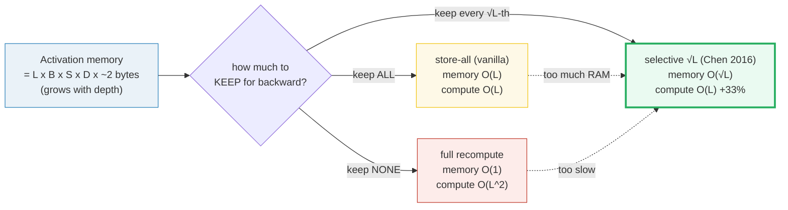
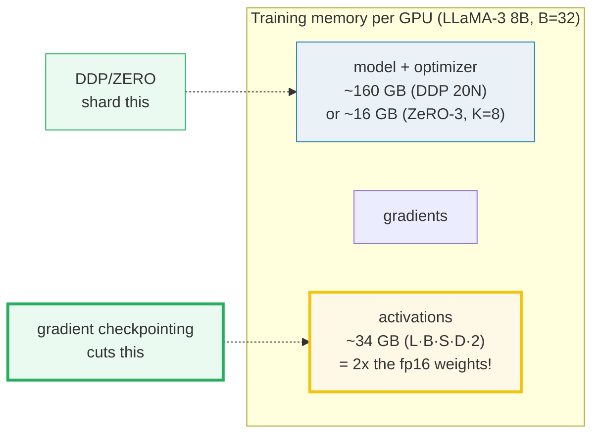
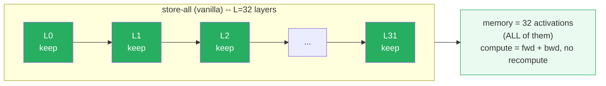
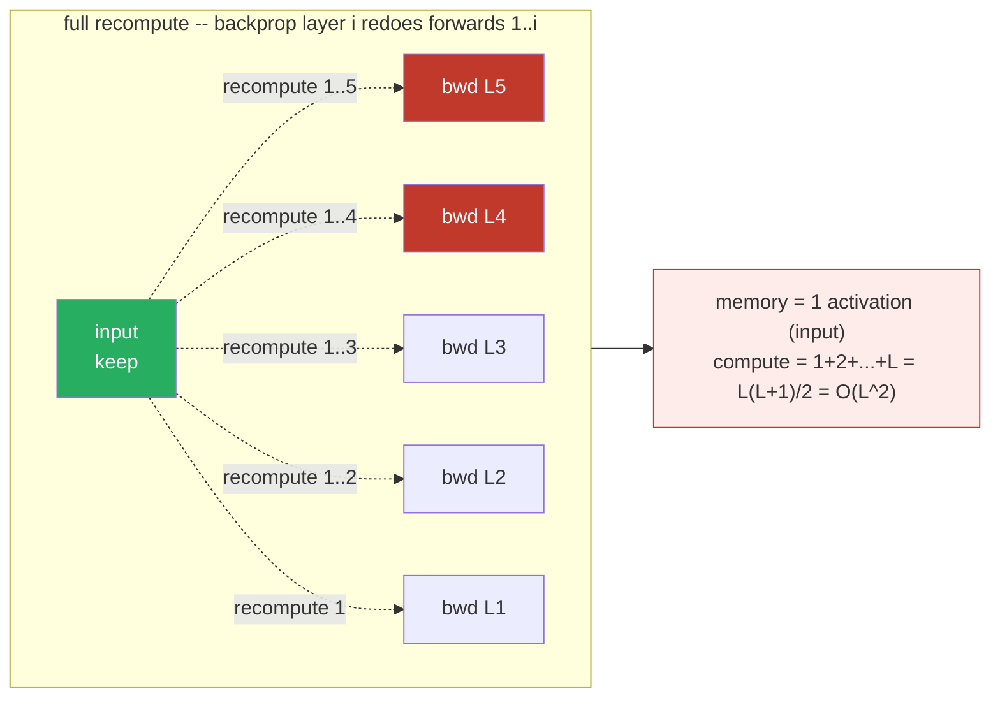
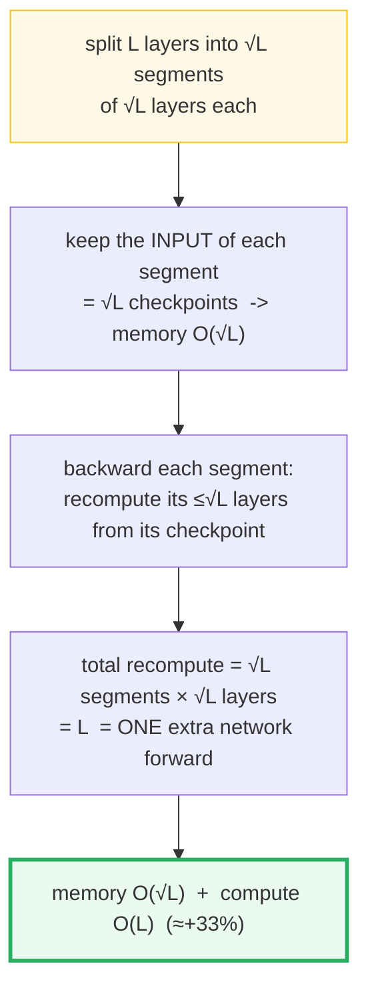
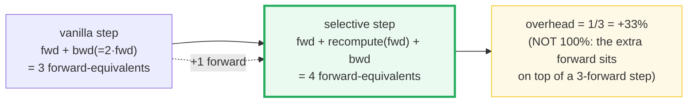
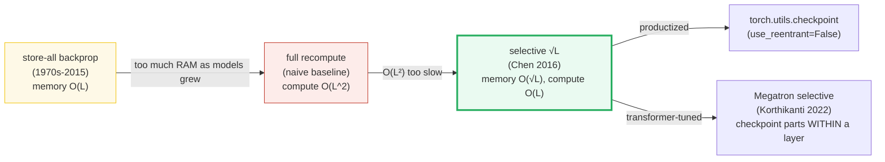
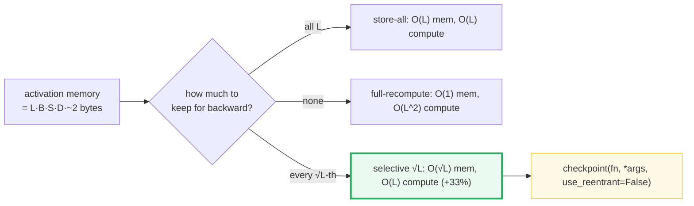

# Gradient Checkpointing (Activation Recomputation) — A Visual, Worked-Example Guide

> **Companion code:** [`gradient_checkpointing.py`](./gradient_checkpointing.py).
> **Every number in this guide is printed by `uv run python gradient_checkpointing.py`**
> — change the code, re-run, re-paste. Nothing here is hand-computed.
>
> **Sibling guides:** [`DDP.md`](./DDP.md) & [`ZERO.md`](./ZERO.md) (the model +
> optimizer memory the 20N rule), [`PIPELINE_PARALLEL.md`](./PIPELINE_PARALLEL.md)
> (1F1B activation memory across pipeline stages), [`MLP_ACTIVATION.md`](./MLP_ACTIVATION.md)
> (the per-layer block whose internals we may or may not store). Cross-references
> are marked 🔗 throughout.
>
> **Live animation:** [`gradient_checkpointing.html`](./gradient_checkpointing.html)
> — open in a browser, drag `L`, watch the checkpoint grid redraw and the memory
> bars shrink.
>
> **Source material:** `learning_guide/04_Distributed_Scale.md` §8 (Gradient
> Checkpointing / Activation Recomputation) and §11 pitfall #10.

---

## 0. TL;DR — the whole idea in one picture

> **The suitcase analogy (read this first):** Backprop is a round trip — you walk
> **forward** through the network dropping a **snack (activation)** at every layer,
> then walk **backward** eating each snack to compute that layer's gradient.
> Vanilla training carries **all** the snacks in a backpack that grows with depth
> (`O(L)` memory). Full recompute carries **none**, but walks back to the start to
> re-fetch each snack (`O(L²)` compute — brutal). **Gradient checkpointing** is the
> middle path: stash a snack only at **every √L-th layer** (√L checkpoints), and on
> the way back detour ≤√L steps to regenerate each missing snack. Memory drops to
> `O(√L)` for the price of **one extra forward** (`~33%` more compute). That is the
> whole trick.

Training a transformer stores three piles of bytes: the **model + optimizer**
(`20N` per param under DDP — 🔗 [`DDP.md`](./DDP.md) §F / [`ZERO.md`](./ZERO.md)),
the **gradients**, and the **activations** (`L × B × S × D × ~2`). DDP/ZeRO attack
the *first* pile by sharding the optimizer states. Gradient checkpointing attacks
the *third* pile by **throwing activations away and recomputing them**. They are
orthogonal axes — you combine them.



| | store-all (vanilla) | full recompute | **selective √L** |
|---|---|---|---|
| **Keep** | all L layer activations | only the network input | every √L-th layer (√L checkpoints) |
| **Memory** | `O(L)` — `32×` at L=32 | `O(1)` — `1×` | **`O(√L)` — `6×` at L=32** |
| **Recompute** | none | `1+2+…+L = L(L+1)/2` | one per layer = `L` |
| **Compute** | `3L` (= fwd+bwd) | `(L²+7L)/2` | `4L` (**+33%**) |
| **Used?** | default | never (baseline only) | **the standard** (`torch.utils.checkpoint`) |

> 🔗 **If you only read one cross-reference:** DDP/ZeRO shard the *model + optimizer*
> bytes (`20N`); gradient checkpointing cuts the *activation* bytes (`L·A`). They
> are independent memory axes — a big training run uses **both**. See
> [`ZERO.md`](./ZERO.md) and §8 below.

---

### Glossary (plain English — refer back any time)

| Term | Plain meaning |
|---|---|
| **activation** | The tensor a layer outputs in the forward pass, which its backward needs to compute its gradient. *The thing we either STORE or RECOMPUTE.* |
| **`B`, `S`, `D`** | Batch size, sequence length, hidden/model dim. One layer's activation is `[B, S, D]` → `B·S·D·~2` bytes (fp16/bf16). |
| **`L`** | Number of transformer layers. Activation memory scales `O(L)`. LLaMA-3 8B: `L=32, D=4096`. |
| **checkpoint** | A layer boundary whose *input* activation we KEEP, so the layers after it can be recomputed from it during backward. A.k.a. the √L markers. |
| **recompute** | Redoing a layer's forward *during backward* to regenerate the activations that were thrown away. "Throw it away, redo it." |
| **strategy** | The rule deciding which activations to keep: store-all, full-recompute, or selective √L. |
| **`use_reentrant`** | The `torch.utils.checkpoint` mode flag. `False` = modern (non-reentrant) impl, supports DDP/FSDP; `True` = legacy. See [§5](#5-the-torchutilscheckpoint-api--use_reentrantfalse). |
| **backward ≈ 2× forward** | A matmul's backward computes gradients w.r.t. *both* inputs, so it costs ~2× the forward. This is *why* the overhead is ~33%, not ~100% — see [§6](#6-the-33-compute-overhead--where-the-number-comes-from). |

> **A note on simulation (the discipline):** the `.py` models a transformer's layer
> activations as `L` tensors of shape `[B, S, D]` and tracks — across the three
> strategies — exactly which are STORED vs RECOMPUTED. The **byte arithmetic is
> measured from the real tensors** (`.element_size() × .numel()`), and the
> **compute arithmetic is closed-form and asserted**. Only the multi-layer
> *execution* is simulated (no real L=32 training run). [§5](#5-the-torchutilscheckpoint-api--use_reentrantfalse)
> *also* runs a **real** `torch.utils.checkpoint` network to prove the recomputed
> gradients are bit-identical to the non-checkpointed ones. Numbers are never
> hand-computed.

---

## 1. Why activation memory must be cut — Section A output

Backpropagation needs every layer's forward activation to compute that layer's
gradient. For one transformer layer the activation is `[B, S, D]`, so:

```
per-layer activation bytes   A = B · S · D · dtype_bytes
total activation memory      = L · A          (all L layers stored)
```

With fp16/bf16 (2 bytes/elem):

> From `gradient_checkpointing.py` **Section A**:
>
> | B | S | D | A = B·S·D·2 (bytes) | × L=32 layers |
> |---|---|---|---|---|
> | 1 | 4096 | 4096 | 33.55 MB | 1.07 GB |
> | 1 | 8192 | 4096 | 67.11 MB | 2.15 GB |
> | 8 | 4096 | 4096 | 268.44 MB | 8.59 GB |
> | **32** | **4096** | **4096** | **1073.74 MB** | **34.36 GB** |
> | 32 | 8192 | 4096 | 2147.48 MB | 68.72 GB |

> `[tensor check]` a real `[1,4096,4096]` fp16 tensor measures **33.55 MB**; 32 of
> them = **1.07 GB**. `[check] measured == B·S·D·2 == 32·A: True` — the bytes come
> from the tensor, not from a calculator.

**The headline:** at LLaMA-3 8B shape (`B=32, S=4096, D=4096`), one training step
holds **34.36 GB of activations** — about **2× the 16 GB of fp16 model weights**.
Put next to the model + optimizer pile:

> From `gradient_checkpointing.py` **Section A** (LLaMA-3 8B, N = 8B params):
>
> ```
> model + optimizer (DDP 20N/param) = 160.0 GB / GPU   (DDP/ZERO)
> activations, B=32, S=4096           =  34.4 GB
> ```



> One plain sentence: the activations pile can rival the model itself, and unlike
> the weights it **scales with batch × seq-len × depth** — so it is the first thing
> to OOM as you grow the model or the context window. 🔗 [`DDP.md`](./DDP.md) §F and
> [`ZERO.md`](./ZERO.md) explain the 20N rule; this guide explains how to cut the
> `L·A` activation term — **a third, orthogonal axis**.

---

## 2. Strategy 1 — store-all (vanilla backprop): `O(L)` memory, `O(L)` compute

> **Keep every snack.** During the forward pass, retain every layer's activation
> for the whole backward pass. Nothing is recomputed. This is the default — simple
> and fastest, but the backpack grows linearly with depth.

> From `gradient_checkpointing.py` **Section B** (L = 32):
>
> ```
> stored layer activations : 32  (= L)
> recompute (layer-forwards): 0
> compute (fwd + recompute + bwd=2x): 32 + 0 + 64 = 96 layer-fwd units
> memory multiplier : 32x  (= L ; linear in depth)
> ```
> `[check] stored==L=32, recompute==0, compute==3L=96: True`



> One plain sentence: vanilla keeps everything, recomputes nothing — `O(L)` memory,
> `O(L)` compute. It is the first thing to OOM as `L` or `B` grows.

---

## 3. Strategy 2 — full recompute (store none): `O(1)` memory, `O(L²)` compute

> **Carry no snacks — walk back to the start each time.** Keep only the network
> input. When layer `i`'s backward needs its activation, re-run forwards `1..i`
> from the input. Memory is tiny (`O(1)`), but the compute is **quadratic**.

> From `gradient_checkpointing.py` **Section C** (L = 32):
>
> ```
> stored layer activations : 1  (just the network input)
> recompute (layer-forwards): 1+2+...+32 = 528  (= L(L+1)/2)
> compute (fwd + recompute + bwd=2x): 32 + 528 + 64 = 624 layer-fwd units
> memory multiplier : 1x  (= 1 ; O(1))
> ```
> `[check] stored==1, recompute==L(L+1)/2=528: True`
>
> `==> Tiny memory, but the O(L²) compute is brutal: at L=32 the backward alone
> redoes 528 layer-forwards → 624 total units vs vanilla's 96. That is **6.5×** the
> compute. No one trains this way — it is the baseline the √L trick beats.`



**Why `O(L²)`?** To backprop layer `i` you must re-run forwards `1..i` from the
input. Summed over all `L` layers that is `1 + 2 + … + L = L(L+1)/2`. The deeper
the net, the more the early layers get re-done over and over. This is the "naive
bad" baseline.

> One plain sentence: storing nothing makes memory `O(1)` but forces `O(L²)`
> recompute — correct yet unusable for deep nets. The √L trick is *the* way to keep
> `O(L)` compute while cutting memory.

---

## 4. Strategy 3 — selective √L checkpointing: `O(√L)` memory, `O(L)` compute *(the centerpiece)*

> **The suitcase, optimized.** Stash a snack only at every √L-th layer (√L
> checkpoints). On the way back, each *segment* of ≤√L layers detours from its
> checkpoint to regenerate the missing snacks. You carry only √L snacks, and each
> layer's forward is re-run **once** — total recompute = `L`, i.e. one extra
> network forward. Memory `O(√L)`, compute `O(L)`. This is the sweet spot Chen et
> al. (2016) proved, and what `torch.utils.checkpoint` implements.

> From `gradient_checkpointing.py` **Section D** (L = 32):
>
> ```
> checkpoint layer indices (stored inputs): [0, 6, 12, 19, 25, 31]
> stored layer activations : 6  (= ceil(sqrt(L)) = 6)
> recompute (layer-forwards): 32  (one per non-checkpoint layer)
> compute (fwd + recompute + bwd=2x): 32 + 32 + 64 = 128 layer-fwd units
> memory multiplier : 6x  (O(sqrt L))
> ```
> `[check] stored==ceil(sqrt(32))==6, recompute==L=32, compute==4L=128: True`

The stored-vs-recomputed layer grid for L=32 (this is exactly what the `.html`
animates — drag `L` and watch it redraw):

```mermaid
graph LR
    subgraph grid["selective √L -- L=32, 6 checkpoints  (■=STORE  □=recompute)"]
        direction LR
        C0["■L0"] --> R1["□"] --> R2["□"] --> R3["□"] --> R4["□"] --> R5["□"] --> R6["□"]
        R6 --> C1["■L6"] --> R7["□"] --> R8["□"] --> R9["□"] --> R10["□"] --> R11["□"] --> C2["■L12"]
        C2 --> D2["..."] --> C3["■L19"] --> D3["..."] --> C4["■L25"] --> D4["..."] --> C5["■L31"]
    end
    NOTE["6 checkpoints stored (■)<br/>26 layers recomputed in backward (□)<br/>memory 32x -> 6x ; recompute = L (one extra fwd)"]
    grid --> NOTE
    style C0 fill:#27ae60,color:#fff
    style C1 fill:#27ae60,color:#fff
    style C2 fill:#27ae60,color:#fff
    style C3 fill:#27ae60,color:#fff
    style C4 fill:#27ae60,color:#fff
    style C5 fill:#27ae60,color:#fff
    style NOTE fill:#eafaf1,stroke:#27ae60,stroke-width:3px
```



**Why `O(L)` compute?** Split the `L` layers into ~`√L` segments of ~`√L` layers
each. Backward of each segment recomputes its ≤`√L` layers from its checkpoint
input, **once**. Total recompute = `√L` segments × `√L` layers/segment = `L`
layer-forwards = **one extra network forward**.

> `==> THE SWEET SPOT. Memory drops 32/6 = 5.3× (from 32× to 6×) for ONE extra
> forward. At L=32: 32× → 6× memory, 128/96 = 1.33× the compute (~33% overhead).
> (Chen 2016: "1000-layer net, 48G → 7G with ~30% extra runtime".)`



> One plain sentence: keep every √L-th activation; on the way back, each segment
> rebuilds its few missing activations from its one stored checkpoint — `O(√L)`
> memory for one extra forward.

---

## 5. The `torch.utils.checkpoint` API — `use_reentrant=False`

`torch.utils.checkpoint.checkpoint(fn, *args, use_reentrant=False)` wraps a
sub-network: during the **forward** it runs `fn` but **discards** `fn`'s
intermediate activations (saving memory); during **backward** it **re-runs** `fn`
to regenerate them on demand. The recomputed activations feed an *identical*
backward, so the **gradients are bit-identical** — checkpointing is exact, not
approximate.

The `.py` proves this on a real 4-layer network (blocks 1–2 wrapped as one
checkpoint segment, `use_reentrant=False`):

> From `gradient_checkpointing.py` **Section E** (4 layers, D_in=8, D_hidden=16):
>
> ```
> forward output match?      max|h_ref - h_ckp| = 0.00e+00
> loss match?                |loss_ref - loss_ckp| = 0.00e+00
> input-grad match?          max|dx_ref - dx_ckp| = 0.00e+00
> ```
> `[check] forward bit-identical? True`
> `[check] GRADIENT bit-identical? True  <- the whole point: checkpointing trades
> MEMORY for COMPUTE, NOT accuracy.`

The canonical usage (from `learning_guide/04_Distributed_Scale.md` §8):

```python
from torch.utils.checkpoint import checkpoint

class TransformerBlock(nn.Module):
    def forward_fn(self, x, attn_mask):
        # ... attention + MLP ...   (internals discarded after the forward)
        return x

    def forward(self, x, attn_mask):
        # checkpoint() drops forward_fn's intermediates, recomputes on backward
        return checkpoint(self.forward_fn, x, attn_mask, use_reentrant=False)
```

**The #1 pitfall — `use_reentrant`** (learning_guide 04 §11 #10):

> From `gradient_checkpointing.py` **Section E**:
>
> - `use_reentrant=False` → **MODERN** impl. Supports DDP/FSDP, double-backward,
>   dropped-inputs. **RECOMMENDED.**
> - `use_reentrant=True` → **LEGACY** reentrant impl. Needed only for very old
>   patterns; **breaks under DDP/FSDP** (the "Checkpoint recompute inside DDP →
>   double backward issue" pitfall).
>
> In torch ≥ 2.1 you get a `UserWarning` if you omit the flag; in a future release
> `use_reentrant=True` will be removed. **Always pass `use_reentrant=False`
> explicitly.**

> 🔗 This matters most under DDP/FSDP: the non-reentrant impl composes correctly
> with the gradient sync hooks. See [`DDP.md`](./DDP.md) (the
> `require_backward_grad_sync` trick) and [`ZERO.md`](./ZERO.md) — checkpointing
> fits *inside* a sharded data-parallel rank without breaking the AllReduce.

---

## 6. The ~33% compute overhead — where the number comes from

> **One sentence:** the recompute is *one extra forward*, and a training step
> already costs ~3 forwards (1 forward + 1 backward, backward ≈ 2× forward), so
> `1/3 = 33%`.

Measure compute in **layer-forward units**, with backward ≈ 2× forward (a matmul
backward computes gradients w.r.t. *both* inputs):

> From `gradient_checkpointing.py` **Section F** (L = 32):
>
> ```
> vanilla step   = fwd(32) + bwd(64)           =  96 units
> selective step = fwd(32) + recompute(32) + bwd(64) = 128 units
> overhead       = (128 - 96) / 96 = +33.3%
> ```
> `[check] overhead == 1/3 == +33.33%: True`

**Counted other ways (same fact, different denominator):**

| Denominator | Overhead | Meaning |
|---|---|---|
| whole step (fwd+bwd ≈ 3 fwd) | **+33%** | the standard figure |
| forward only | +100% | the forward literally runs twice |
| wall-clock (empirical) | ~30% | Chen 2016: "30% extra runtime"; learning_guide 04 §8: "30–40%" |



> One plain sentence: checkpointing adds exactly one extra forward; because a step
> already costs ~3 forwards, that is `+1/3 ≈ +33%` — not `+100%`.

---

## 7. The gold table — memory + compute across the 3 strategies (L=32)

The centerpiece. All numbers come straight from the asserted formulas; the `.html`
gold-check recomputes the L=32 row in JS.

> From `gradient_checkpointing.py` **Section G** (memory in units of `A` = one
> layer's activation):
>
> | strategy | stored | memory mult | recompute | compute (units) | vs vanilla |
> |---|---|---|---|---|---|
> | store-all (vanilla) | 32 | **32×** | 0 | 96 | 1.00× |
> | full-recompute | 1 | **1×** | 528 | 624 | 6.50× |
> | **selective √L** | 6 | **6×** | 32 | 128 | **1.33×** |

Concrete, with the LLaMA-3 8B per-sequence activation `A = 1·4096·4096·2 = 33.55 MB`:

> From `gradient_checkpointing.py` **Section G** (B=1):
>
> | strategy | memory mult | activation memory | compute (vs vanilla) |
> |---|---|---|---|
> | store-all (vanilla) | 32× | 1073.7 MB | 1.00× |
> | full-recompute | 1× | 33.6 MB | 6.50× |
> | **selective √L** | 6× | **201.3 MB** | **1.33×** |

**GOLD pins** (recomputed by `gradient_checkpointing.html` for the check badge,
L=32):
- store-all memory mult = **32**
- full-recompute memory mult = **1**
- selective memory mult = `ceil(√32)` = **6** (checkpoints)
- selective recompute = **32** (= L; one extra forward)
- selective overhead = **+1/3 = +33.33%**

`[check] mults {32, 1, 6}, recompute==32, overhead==+33.33%: True`

The √L memory curve flattening (store-all grows linearly, selective grows as √L):

> From `gradient_checkpointing.py` **Section G**:
>
> | L | store-all (L) | selective `ceil(√L)` | full-recompute (1) |
> |---|---|---|---|
> | 4 | 4 | 2 | 1 |
> | 8 | 8 | 3 | 1 |
> | 16 | 16 | 4 | 1 |
> | **32** | **32** | **6** | 1 |
> | 64 | 64 | 8 | 1 |
> | 128 | 128 | 12 | 1 |
> | 1000 | 1000 | 32 | 1 |
>
> `READ: store-all grows LINEARLY with L; selective grows as √L (flattens fast);
> full-recompute is always 1×. At L=1000: store-all = 1000×, selective =
> ceil(√1000) = 32×. That is the Chen 2016 result (1000-layer net, 48G → 7G at
> ~30% extra runtime).`

> One plain sentence: at L=32 the three strategies give **{32×, 1×, 6×}** memory
> and **{1.0×, 6.5×, 1.33×}** compute — selective wins on the Pareto frontier.

---

## 8. The lineage + the three axes of training memory (🔗 siblings)



**Why the lineage moved:** store-all OOM'd as depth grew; full-recompute was
unusably slow; the √L trick (Chen 2016) hit the Pareto sweet spot. Production
then refined it: `torch.utils.checkpoint` makes it a one-line wrapper, and
Megatron-LM's **selective recomputation** (Korthikanti et al. 2022) checkpoints
*parts within* every layer (e.g. the attention scores `[B,H,S,S]` and dropout
masks — big in memory, cheap to recompute) rather than whole √L layers. That
gets most of the memory win back with even less overhead.

**The three orthogonal axes of training memory** (a big run uses all three):

| Axis | Attacks | Tool | 🔗 |
|---|---|---|---|
| **Model + optimizer** (`20N`) | the per-param bytes | DDP replicate → ZeRO-1/2/3 shard | [`DDP.md`](./DDP.md), [`ZERO.md`](./ZERO.md) |
| **Pipeline activations** | in-flight micro-batches | 1F1B (peak `M→K`) | [`PIPELINE_PARALLEL.md`](./PIPELINE_PARALLEL.md) |
| **Per-layer activations** (`L·A`) | the forward activations | **gradient checkpointing (this guide)** | [`MLP_ACTIVATION.md`](./MLP_ACTIVATION.md) |

> 🔗 [`PIPELINE_PARALLEL.md`](./PIPELINE_PARALLEL.md) §D: 1F1B cuts the
> *in-flight micro-batch* activations (`M→K`); this guide cuts the *per-layer*
> activations (`L→√L`). They compose — pipeline-parallel training of big models
> checkpoint each block too.
> 🔗 [`MLP_ACTIVATION.md`](./MLP_ACTIVATION.md): the per-layer block (SwiGLU:
> `down(silu(gate(x))·up(x))`). Its *internal* activations (the `[B,S,F]` MLP
> intermediate, `F≈2.7D`) are bigger than its `[B,S,D]` I/O — that is exactly
> what per-block checkpointing throws away.

---

## 9. Pitfalls & debugging checklist

| # | Mistake | Symptom | Fix |
|---|---|---|---|
| 1 | `use_reentrant=True` (or omitted) under DDP/FSDP | double-backward error / wrong grads | **always pass `use_reentrant=False`** (learning_guide 04 §11 #10) |
| 2 | Forgetting RNG state is re-run | non-determinism: dropout/RNG differs between fwd and recompute | `torch.utils.checkpoint` preserves RNG by default (non-reentrant); for custom, save/restore RNG state |
| 3 | Checkpointing tensor that needs grad but is a leaf without `requires_grad` | recompute silently skipped | ensure checkpointed inputs carry grad, or they won't trigger recompute |
| 4 | Expecting *free* speedup | training ~33% slower, not faster | checkpointing trades compute for memory — turn it on for memory, off for speed |
| 5 | Confusing the two "selective" senses | wrong mental model | √L = checkpoint every √L-th *full layer* (Chen 2016); Megatron = checkpoint *parts within* every layer (Korthikanti 2022) |
| 6 | Counting overhead as +100% | overestimating cost | the extra is one forward on a ~3-forward step → **+33%**, not +100% (§6) |
| 7 | Checkpointing the *whole* model when only attention OOMs | wasted recompute | checkpoint only the memory-heavy blocks (attention scores) — Megatron selective |
| 8 | Assuming grads are approximate | unnecessary anxiety | grads are **bit-identical** (§5 proves `0.00e+00` diff) — checkpointing is exact |

---

## 10. Cheat sheet



- **Per-layer activation bytes:** `A = B · S · D · dtype_bytes` (fp16/bf16 = 2).
- **Vanilla:** store all → `L·A` memory, `0` recompute.
- **Selective √L:** store `⌈√L⌉` checkpoints → `⌈√L⌉·A` memory, `L` recompute
  (one extra forward).
- **At L=32:** memory `{32×, 1×, 6×}`, compute `{1.0×, 6.5×, 1.33×}` — selective
  is the Pareto pick.
- **Overhead:** `+1/3 ≈ +33%` (one extra forward on a ~3-forward step).
- **API:** `checkpoint(fn, *args, use_reentrant=False)` — drops forward
  intermediates, recomputes on backward, **bit-identical gradients**.
- **Gradients are exact, not approximate** — `0.00e+00` grad diff (§5).

> 🔗 Want the *model + optimizer* memory axis? Read [`DDP.md`](./DDP.md) (the 20N
> rule) and [`ZERO.md`](./ZERO.md) (shard it across K GPUs). Want the
> *pipeline-activation* axis? Read [`PIPELINE_PARALLEL.md`](./PIPELINE_PARALLEL.md)
> (1F1B cuts in-flight micro-batches `M→K`). All three axes compose in big runs.

---

## Sources

- **Chen, T.; Xu, B.; Zhang, C.; Guestrin, C. (2016).**
  *Training Deep Nets with Sublinear Memory Cost.*
  arXiv:1604.06174 — https://arxiv.org/abs/1604.06174
  The **√L / sublinear-memory** paper. Defines the O(√n) checkpointing scheme
  (our [§4](#4-strategy-3--selective-√l-checkpointing-o√l-memory-ol-compute-the-centerpiece)),
  proves `O(√L)` memory at `O(L)` compute, and reports the headline empirical
  result (a 1000-layer net: 48 GB → 7 GB at ~30% extra runtime — our
  [§6](#6-the-33-compute-overhead--where-the-number-comes-from) overhead, [§7](#7-the-gold-table--memory--compute-across-the-3-strategies-l32)
  L=1000 row). This is the origin of the "throw activations away, recompute a √L
  prefix" trick that `torch.utils.checkpoint` implements.

- **Gruslys, A.; Munos, R.; Danihelka, I.; Lanctot, M.; Graves, A. (2016).**
  *Memory-Efficient Backpropagation Through Time.*
  arXiv:1606.03401 — https://arxiv.org/abs/1606.03401 (NeurIPS 2016)
  The same recompute principle for BPTT/RNNs: store a subset of hidden states and
  recompute the unroll between them during backward. Establishes the general
  "activation recomputation" idea (our [§0](#0-tldr--the-whole-idea-in-one-picture)
  lineage) independently of Chen et al., specialized to the temporal dimension.
  *(Note: 1606.03401 is the canonical arXiv ID; an earlier version circulated as
  1604.06174-v1 but that ID was reassigned to Chen et al.)*

- **Korthikanti, V.; Casper, J.; Lym, S.; McAfee, L.; et al. (2022).**
  *Reducing Activation Recomputation in Large Transformer Models.*
  arXiv:2205.05198 — https://arxiv.org/abs/2205.05198 (MLSys 2023)
  The **Megatron-LM selective recomputation** paper. Instead of checkpointing
  every √L-th *whole* layer, checkpoint only the memory-heavy *parts within* each
  transformer layer (attention score arrays `[B,H,S,S]`, dropout masks) — big in
  memory, cheap to recompute. Recovers most of the memory win at lower overhead.
  Our [§8](#8-the-lineage--the-three-axes-of-training-memory--siblings) Megatron
  branch and pitfall #5 ("two senses of selective").

- **PyTorch maintainers.**
  *`torch.utils.checkpoint` documentation.*
  https://docs.pytorch.org/docs/stable/checkpoint.html
  The `checkpoint(fn, *args, use_reentrant=False)` API (our [§5](#5-the-torchutilscheckpoint-api--use_reentrantfalse)):
  the non-reentrant implementation that drops forward intermediates and
  recomputes them on backward; supports DDP/FSDP, double-backward, and
  dropped-inputs. The `use_reentrant` semantics and the deprecation trajectory
  of the legacy reentrant variant (pitfall #1).

- **`learning_guide/04_Distributed_Scale.md` §8 & §11.**
  The course material this bundle derives from: the `L × B × S × D × ~2` memory
  math, the three-strategy framing (store-all / full-recompute / selective √L),
  the `torch.utils.checkpoint` snippet, and pitfall #10 (`use_reentrant=False`
  for DDP). All numbers re-derived and asserted in `gradient_checkpointing.py`.
