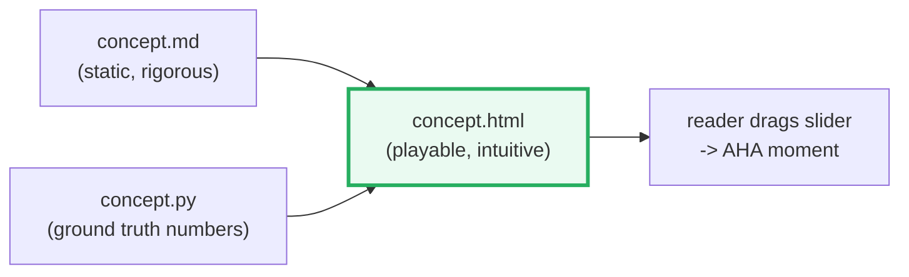

# HOW_TO_ANIMATE — Building Self-Contained Concept Animations

> A recipe for turning a `.md` concept + a `.py` reference into a single,
> interactive, **self-contained `.html` file** (embedded CSS + JS, zero
> dependencies, opens by double-click) that makes the idea *click*.
>
> **Worked examples:** [`rope.html`](./rope.html) and
> [`absolute_pe.html`](./absolute_pe.html).

---

## 0. Why animate at all?

A mermaid diagram is a **frozen** state. The hardest concepts in this repo
(position embeddings, KV-cache, speculative decode) are **dynamic** — they change
with a parameter (position `m`, sequence length, base). Letting a reader *drag a
slider* and watch the vector rotate is worth a thousand words. The `.html` is the
"playable" companion to the static `.md`.



---

## 1. The hard rules

1. **One file, zero deps.** No npm, no CDN, no `fetch`. Everything inline:
   `<style>...</style>` and `<script>...</script>`. It must work offline by
   double-clicking. This guarantees it still renders in 5 years.
2. **The .py is ground truth.** Numbers shown in the HTML must either (a) be
   copied verbatim from the `.py` output, or (b) be **recomputed in JS with the
   identical formula** and spot-checked against the `.py`. Never invent numbers.
3. **Mirror the .md sections.** Each animation panel maps to a section of the
   `.md` so a reader can ping-pong between them.
4. **No build step.** Plain ES5-ish JS. Avoid modules/imports so it runs from
   `file://`.

---

## 2. The skeleton (copy this)

```html
<!DOCTYPE html>
<html lang="en">
<head>
<meta charset="utf-8">
<meta name="viewport" content="width=device-width, initial-scale=1">
<title>CONCEPT — interactive</title>
<style>
  /* ---------- 1. design tokens ---------- */
  :root{
    --bg:#0d1117; --panel:#161b22; --ink:#e6edf3; --muted:#8b949e;
    --accent:#27ae60; --warn:#e67e22; --bad:#c0392b; --good:#27ae60;
  }
  *{box-sizing:border-box}
  body{margin:0;background:var(--bg);color:var(--ink);
       font-family:system-ui,Segoe UI,Roboto,sans-serif;padding:1.5rem}
  h1{font-size:1.4rem} h2{font-size:1.1rem;color:var(--muted);margin-top:2rem}
  .panel{background:var(--panel);border:1px solid #30363d;border-radius:10px;
         padding:1rem;margin:1rem 0}
  .controls{display:flex;flex-wrap:wrap;gap:1.2rem;align-items:center}
  label{color:var(--muted);font-size:.85rem;display:flex;gap:.5rem;align-items:center}
  input[type=range]{width:220px;accent-color:var(--accent)}
  .val{color:var(--accent);font-weight:600;min-width:3ch}
  /* canvas fills its panel */
  canvas{width:100%;height:auto;display:block;background:#0d1117;border-radius:6px}
  .legend{display:flex;gap:1rem;flex-wrap:wrap;color:var(--muted);font-size:.8rem}
  .swatch{display:inline-block;width:12px;height:12px;border-radius:3px;margin-right:4px}
</style>
</head>
<body>
  <h1>CONCEPT</h1>
  <div class="panel">
    <div class="controls">
      <label>position m <input type="range" id="m" min="0" max="20" value="2">
        <span class="val" id="mVal">2</span></label>
      <!-- more sliders ... -->
    </div>
  </div>
  <div class="panel"><canvas id="canvas"></canvas></div>

<script>
"use strict";
/* ---------- 3. ground-truth math (copied from the .py formula) ---------- */
const D = 8, HALF = 4, BASE = 10000;
function theta(j){ return Math.pow(BASE, -j/HALF); }           // matches rope.py
/* ---------- 4. drawing helpers ---------- */
function clear(ctx,w,h){ ctx.clearRect(0,0,w,h); }
function drawArrow(ctx,x1,y1,x2,y2,color){ ... }
/* ---------- 5. main render, called on every change ---------- */
function render(){
  const m = +document.getElementById('m').value;
  document.getElementById('mVal').textContent = m;
  const cv=document.getElementById('canvas'), ctx=cv.getContext('2d');
  clear(ctx,cv.width,cv.height);
  // ... draw current state using m ...
}
/* ---------- 6. wire up events ---------- */
document.getElementById('m').addEventListener('input', render);
render();
</script>
</body>
</html>
```

The six numbered blocks (design tokens → skeleton → math → helpers → render →
events) are the template for every animation in this repo.

---

## 3. Canvas vs SVG — pick once

| Need | Use |
|---|---|
| Rotating vectors, arrows, many particles | **Canvas** (`<canvas>`) |
| Crisp resizable diagrams, hover tooltips on shapes | **SVG** (inline) |
| Bars / heatmaps that need exact pixel control | **Canvas** |

For position-embedding animations we use **Canvas**: we redraw on every slider
tick, and rotation is trivial (`Math.cos/sin`). Set a fixed internal resolution
(`canvas.width = 900`) and let CSS scale it — crisp enough, simple.

---

## 4. Animation patterns (the toolbox)

### 4.1 Reactivity = re-render on `input`
Every slider has `addEventListener('input', render)`. No animation loop needed
for *interactive* viz — you redraw only when something changes. Cheap and exact.

### 4.2 `requestAnimationFrame` only for *motion*
If you want continuous motion (e.g. auto-spinning through positions), use a loop:

```js
let m=0, running=true;
function loop(){
  if(!running) return;
  m=(m+1)%21; document.getElementById('m').value=m;
  render();
  requestAnimationFrame(loop);
}
```
Add a Play/Pause button. Always offer the manual slider too — readers want to
*stop* and inspect.

### 4.3 Easing for transitions
When the value jumps (slider step), interpolate over ~200ms for smoothness:

```js
let cur=2, target=2;
function tween(){ cur += (target-cur)*0.2; render();
  if(Math.abs(target-cur)>0.001) requestAnimationFrame(tween); }
```

### 4.4 Color = semantics
Fix a palette so both `.html` files (and the `.md` mermaid diagrams) agree:
- 🔴 red `#c0392b` = absolute/additive family / "watch out"
- 🟢 green `#27ae60` = rotary family / "good / correct"
- 🟠 orange `#e67e22` = the active / selected thing
- 🔵 blue `#2980b9` = low-frequency / long-range
- ⚪ muted `#8b949e` = axes, grid, labels

### 4.5 Numbers on screen, always
Overlay the *actual* vector values near the shapes. A reader should be able to
cross-check against the `.md` table. Format to 4 decimals to match the `.py`.

---

## 5. Mapping concepts → visuals (the cheat sheet)

| Concept | Visual primitive | What the slider does |
|---|---|---|
| **RoPE rotation** | arrow on a 2D plane, per pair | `m` → rotates arrow by `m·θ_j` |
| **frequency ladder** | concentric "clocks" of different speeds | `m` → fast ones spin, slow ones creep |
| **cos/sin tables** | heatmap `[L × D/2]` | highlight row `m` |
| **absolute PE add** | bar chart `[E]` + `pe[m]` bars | `m` → bars shift by sin/cos |
| **relative vs absolute** | dot-product readout for (m_q,m_k) | move both → RoPE constant per distance, absolute not |
| **extrapolation** | line past training length | `m` past cap → absolute breaks, RoPE smooth |

---

## 6. Verifying HTML against the .py (mandatory)

Two ways, both legitimate:

1. **Recompute in JS** with the exact formula from the `.py`, then assert a known
   value. Example for RoPE:
   ```js
   // spot-check: RoPE of [1,0.5,-0.3,0.8,0.2,-0.1,0.4,0.6] at m=2
   // must equal rope.py Section D output:
   const expect=[-0.598,0.5099,-0.3079,0.7988,0.8261,0.0013,0.3939,0.6016];
   ```
   Show this as a tiny `[check: OK]` badge in the page footer.

2. **Embed** a few gold rows from `*_output.txt` and diff on load. If mismatch,
   flash a red banner — never silently ship wrong numbers.

Treat the animation like the `.md`: it cites the `.py`, it doesn't invent.

---

## 7. File & naming conventions

```
llm/
  rope.py              # ground truth
  rope_output.txt      # captured stdout (commit it)
  ROPE.md              # static guide, mermaid + numbers from .py
  rope.html            # interactive companion to ROPE.md
  absolute_pe.py / .md / .html   # sibling pair
  HOW_TO_ANIMATE.md    # this file
```

- Animation filename = lowercase concept name, `.html`.
- `<title>` and `<h1>` match the `.md` H1 so cross-linking is obvious.
- Put a link to the `.md` at the top of every animation, and vice versa.

---

## 8. Quick checklist before committing an animation

- [ ] Single file, opens from `file://`, no network calls.
- [ ] Every number either copied from `.py` output or recomputed with identical formula + spot-checked.
- [ ] Slider + manual inspection works (not only auto-play).
- [ ] Palette matches §4.4.
- [ ] Values shown on-canvas to 4 decimals.
- [ ] `[check: OK]` badge or gold-value diff present.
- [ ] Links to the `.md` and `.py` in the header.
- [ ] Defaults to dark theme (light mode is out of scope).

---

## 9. Where to go next

- Study [`rope.html`](./rope.html): the rotating-arrows pattern (§5 rows 1–3).
- Study [`absolute_pe.html`](./absolute_pe.html): the bar-add + extrapolation pattern (§5 rows 4, 6).
- Then build the next animation (KV cache? speculative decode?) using this skeleton.
