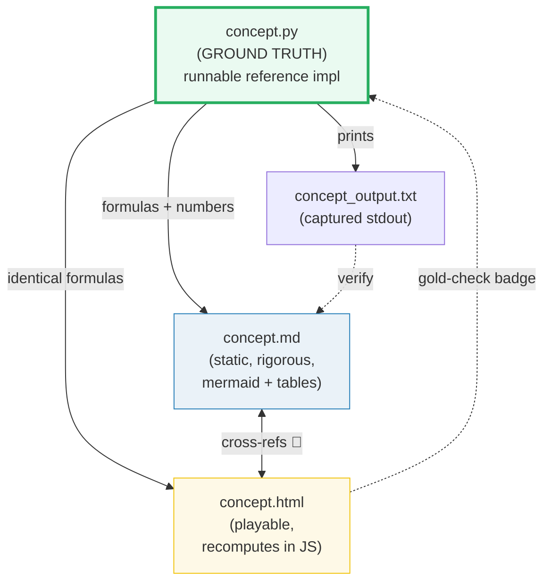
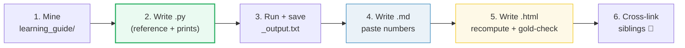
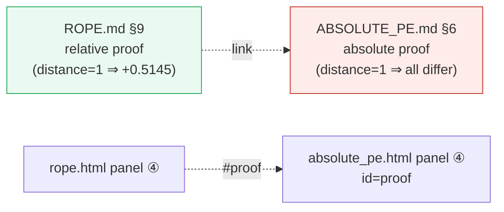

# HOW_TO_RESEARCH — The "Concept-as-a-Bundle" Workflow

> A note from past-me to future-me: **how this `research/` folder is organized,
> why, and how to extend it.** This is the meta-guide that sits above the
> individual concept guides ([`ROPE.md`](./ROPE.md),
> [`ABSOLUTE_PE.md`](./ABSOLUTE_PE.md)) and the animation guide
> ([`HOW_TO_ANIMATE.md`](./HOW_TO_ANIMATE.md)).
>
> Source material these guides draw from: `learning_guide/` (the ZeroServe
> journey).

---

## 0. The one rule

> **Every concept is a bundle of files that cite each other, all deriving from ONE
> ground-truth `.py`. Nothing is ever hand-computed.**

If a number appears in a `.md` or an `.html`, it was either printed by the `.py`
or recomputed with the *identical* formula and spot-checked against it. This is
the discipline that keeps these guides trustworthy as they grow.



---

## 1. The directory layout

```
research/
├── HOW_TO_RESEARCH.md      ← you are here (meta-workflow)
├── HOW_TO_ANIMATE.md       ← how to build the .html animations
├── pyproject.toml          ← uv env (torch)
│
├── rope.py                 ← ground-truth RoPE impl      ─┐
├── rope_output.txt         ← captured stdout              │ one concept
├── ROPE.md                 ← static guide                  │ bundle
├── rope.html               ← interactive companion        ─┘
│
├── absolute_pe.py          ─┐
├── absolute_pe_output.txt   │  another concept bundle
├── ABSOLUTE_PE.md           │  (cross-referenced with RoPE)
├── absolute_pe.html        ─┘
```

A **concept bundle** = `{name}.py` + `{name}_output.txt` + `{NAME}.md` + `{name}.html`.
When you add a concept (e.g. KV cache, speculative decode), add all four.

---

## 2. The four roles of each file

| File | Role | Hard rules |
|---|---|---|
| **`name.py`** | Ground truth. Clean, runnable reference implementation + `print` of every number the docs need. | Single source of truth. PyTorch, run via `uv run python name.py`. Sections printed with banners. |
| **`name_output.txt`** | Captured stdout. Committed so the `.md` can be re-derived/audited without running. | `uv run python name.py > name_output.txt 2>/dev/null` |
| **`NAME.md`** | Static, rigorous guide. Mermaid diagrams + tables pasted *verbatim* from the `.py` output. | Every number traced to a "From `name.py` Section X:" callout. Cross-refs to siblings marked 🔗. |
| **`name.html`** | Playable companion. Recomputes in JS with the *identical* formula, gold-checked against `.py`. | Single file, zero deps, opens from `file://`. See [`HOW_TO_ANIMATE.md`](./HOW_TO_ANIMATE.md). |

---

## 3. The workflow (step by step)



### Step 1 — Mine the source
`grep` the topic across `learning_guide/*.md`. Read the relevant sections fully.
Note: the code, the math, the pitfalls, the "what to implement" checklists. These
become the spine of the `.md`.

### Step 2 — Write the `.py` (the keystone)
- One clean class/function that is the reference (e.g. `RoPE`).
- A `section_*()` function per teachable point, each printing a **banner** + a
  markdown-friendly table.
- Use a *tiny* but *complete* model (e.g. `D=8, L=4, base=10000`) so every number
  is printable, while every behavior shows up.
- **Deterministic inputs** (hardcoded vectors, seeded RNG) so output is reproducible.

### Step 3 — Run & capture
```bash
cd research
uv run python name.py > name_output.txt 2>/dev/null   # also prints to terminal
```
Verify `[check] ... OK` lines pass inside the script before moving on.

### Step 4 — Write the `.md`
- Paste tables **verbatim** from `_output.txt`, each under a
  `> From name.py Section X:` callout.
- Add mermaid diagrams for the *dynamic* structure (pipelines, shapes, contrast).
- Add a worked example at the sample level (`B=1, L=4, H=2, D=8`).
- Add pitfalls table (reuse the ones from `learning_guide/`).
- End with a cheat sheet.

### Step 5 — Write the `.html`
Follow [`HOW_TO_ANIMATE.md`](./HOW_TO_ANIMATE.md). Critically: recompute in JS with
the same formula, then **gold-check** one known value from the `.py` and show a
`[check: OK]` badge.

### Step 6 — Cross-link
- `.md` ↔ sibling `.md` (🔗 markers for the conceptual contrasts).
- `.html` ↔ its `.md` (badges in the header).
- `.html` ↔ sibling `.html` (the "compare with…" link, and anchored panels like
  `#proof` so the contrast is one click away).

---

## 4. Cross-referencing conventions

The whole point of sibling bundles is **contrast to build understanding**. Be explicit:

- 🔗 marker in `.md` = a cross-reference to the other family/sibling.
- Always state *why* the cross-ref matters in one line
  (e.g. "RoPE rotates where absolute adds — that's why §9 holds and §6 doesn't").
- Anchor panels in `.html` (`id="proof"`) so a link from the sibling lands on the
  exact comparison.

Example spine used by the RoPE ↔ Absolute pair:



---

## 5. Verification discipline (do not skip)

1. **`.py` self-checks:** assert inline math == class output, assert norm-preservation, etc. (see `[check] OK` in `rope.py`).
2. **`.md` traceability:** every number block sits under a `> From name.py Section X:` callout — no orphan numbers.
3. **`.html` gold-check:** recompute in JS, `diff` against a known `.py` value, show `[check: OK/FAIL]` badge with color. (Both current `.html` files pass.)
4. **JS syntax:** `node --check` the extracted `<script>` before shipping.

Commands used during this build (reusable):

```bash
uv run python rope.py > rope_output.txt 2>/dev/null          # capture
uv run python rope.py 2>/dev/null | grep -c OK                # sanity
# JS gold-check (extract + node):
python3 -c "import re;print(re.search(r'<script>(.*)</script>',open('rope.html').read(),re.S).group(1))" > /tmp/c.js
node --check /tmp/c.js
```

---

## 6. Tooling

- **`uv`** manages the env; **PyTorch** is the numerical backend (NOT numpy — the
  source material targets MLX, PyTorch is the portable, universal analogue and
  what we standardize on here). See `pyproject.toml`.
- Run anything with `uv run python <file>`. No manual venv activation.
- Mermaid renders in GitHub/GitLab and most markdown viewers natively.
- `.html` needs nothing — open with any browser, even offline.

---

## 7. Adding a new concept (checklist)

- [ ] `grep` the concept in `learning_guide/`; read all hits.
- [ ] `name.py`: reference impl + `section_*()` printouts + `[check]` asserts.
- [ ] `uv run python name.py > name_output.txt 2>/dev/null` — all checks pass.
- [ ] `NAME.md`: mermaid + verbatim tables + worked example + pitfalls + cheat sheet, 🔗 to existing siblings.
- [ ] `name.html`: recompute in JS, gold-check badge, links to `.md`/`.py`/siblings, `node --check` passes.
- [ ] Update this file's §1 layout if the bundle pattern changes.

---

## 8. Why this structure works

- **The `.py` makes it falsifiable.** Anyone can re-run and see the exact numbers.
  No "trust me" math.
- **The `.md` is rigorous but static** — good for careful reading and search.
- **The `.html` is intuitive but dynamic** — good for the "aha" moment a static
  diagram can't give.
- **Cross-references force clarity.** Explaining *why* RoPE differs from absolute
  PE, with matching section numbers, is what makes both click.
- **It ages well.** Zero-deps `.html` + a `.py` + committed `_output.txt` will
  still make sense in 5 years; a notebook with 47 cells won't.

---

## 9. Where to start next

Pick the next hard concept from `learning_guide/` and run the workflow:
- **KV cache + `offset`** (`02_Acceleration.md` §3) — the `offset` is already in
  `rope.py`; a dedicated bundle would animate prefill→decode→rewind.
- **GQA** (`00_Foundations.md` §7.5) — the broadcasting trick is very visualizable.
- **SwiGLU / RMSNorm** (`00_Foundations.md` §7.2, §7.4) — simpler bundles, good
  warm-up.

Open [`HOW_TO_ANIMATE.md`](./HOW_TO_ANIMATE.md) for the `.html` recipe, and
[`ROPE.md`](./ROPE.md) / [`ABSOLUTE_PE.md`](./ABSOLUTE_PE.md) for the model
bundles to imitate.
