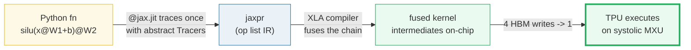
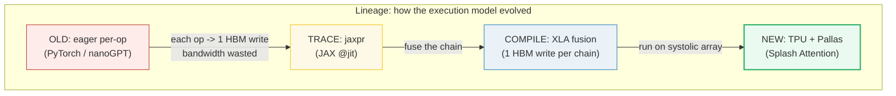
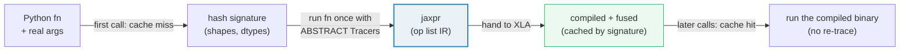
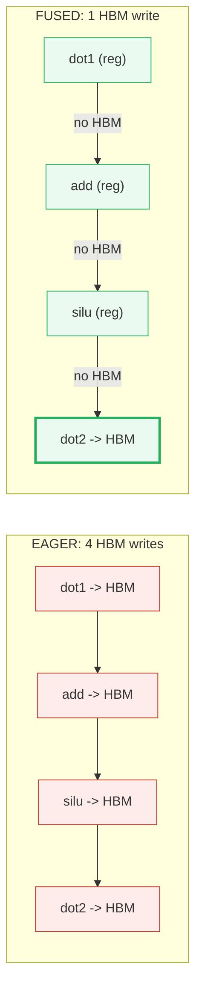
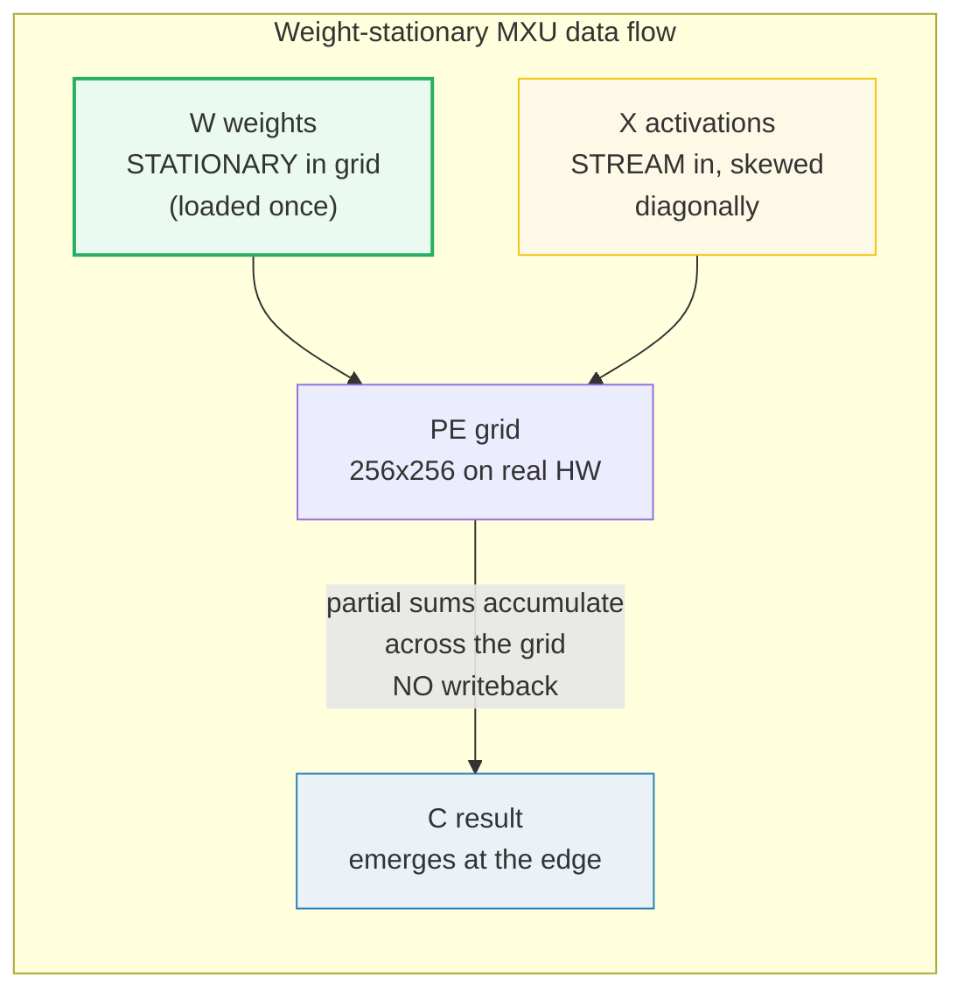
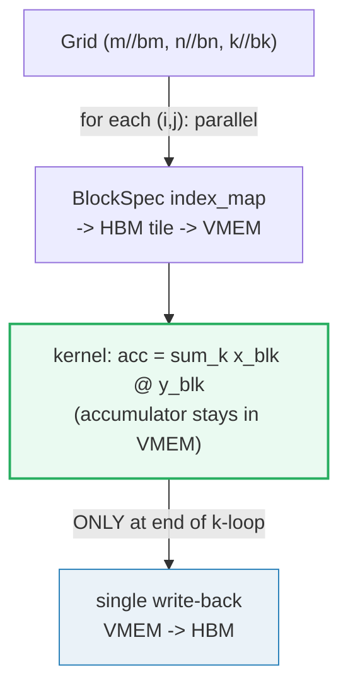
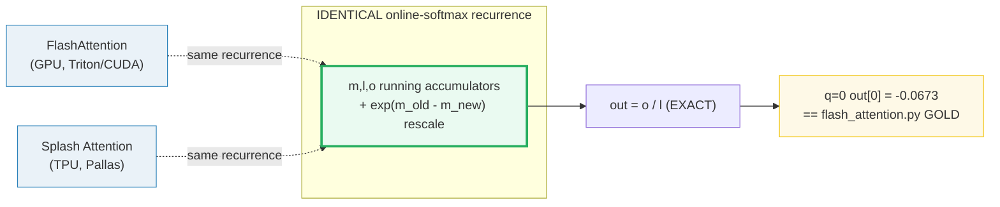
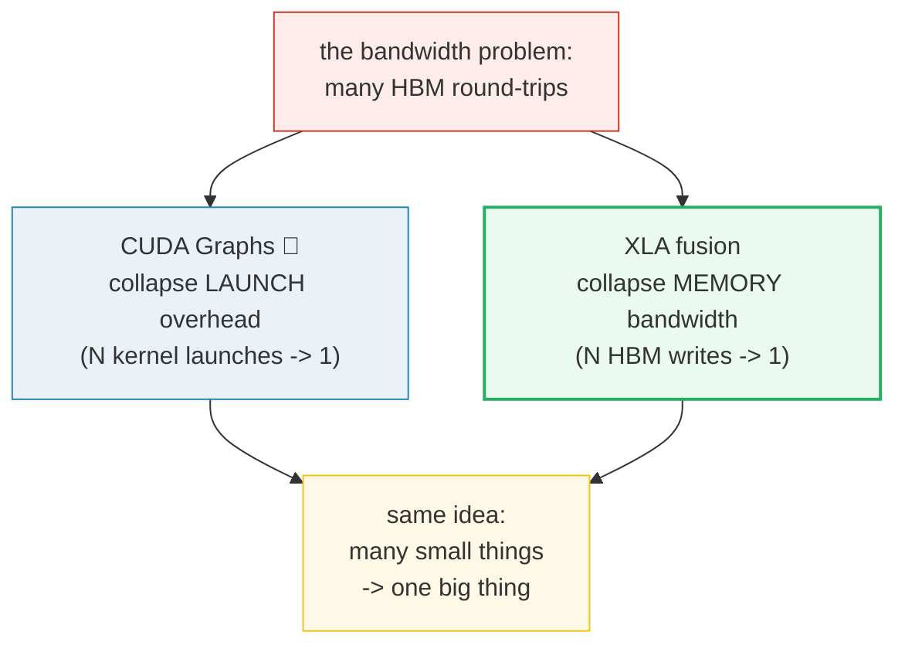

# JAX, XLA & TPU Pallas — A Visual, Worked-Example Guide

> **Companion code:** [`jax_xla_tpu.py`](./jax_xla_tpu.py). **Every number in this
> guide is printed by `uv run python jax_xla_tpu.py`** — change the code, re-run,
> re-paste. Nothing here is hand-computed.
>
> **Live animation:** [`jax_xla_tpu.html`](./jax_xla_tpu.html) — open in a browser,
> drag the fusion slider, watch HBM writes collapse and the Splash=Flash gold
> badge light up.
>
> **Sibling guides:** [`FLASH_ATTENTION.md`](./FLASH_ATTENTION.md) — Splash
> Attention is the **same tiled online-softmax recurrence** as FlashAttention, just
> written in Pallas for the TPU. We reuse `flash_attention.py`'s exact inputs here
> and assert the answers match (🔗 §6). [`CUDA_GRAPHS.md`](./CUDA_GRAPHS.md) —
> CUDA Graphs collapse **launch overhead** (many kernels → 1); XLA fusion collapses
> **memory-bandwidth** (many HBM writes → 1). Two different axes of the same "many
> small things → one big thing" idea (🔗 §8). [`ROPE.md`](./ROPE.md) — a clean
> example of a traced, jit-compilable primitive (🔗 §3).
>
> **Source material:** `learning_guide/05_Next_Gen_Architecture.md` §6 (JAX, XLA, &
> TPU Pallas) and the lectures `llmsys-12` (JAX/XLA/TPU) + `llmsys-13`
> (Pallas/Splash Attention).

---

> ## ⚠ PLATFORM NOTE — this `.py` is a faithful SIMULATION
>
> The machine these files were built on is **Apple Silicon with NO TPU and NO real
> JAX install**. The `.py` therefore **FAITHFULLY SIMULATES the JAX/XLA/TPU
> pipeline** in pure Python/torch:
>
> - **jaxpr tracing** — a tiny `Tracer` that records primitive ops into an IR list
>   when a function is `@jit`-compiled (§3). **`[SIM]`**
> - **XLA fusion** — a fusion pass that counts HBM materialization points eager vs
>   fused (§4, §8). The **HBM-write COUNTS are exact** under the stated model; the
>   fusion engine is a faithful model of producer-consumer fusion. **`[SIM]`**
> - **TPU MXU systolic** — a weight-stationary systolic matmul (§5). The **MATH is
>   exact** and asserted `== torch.matmul`; the cycle/fill+drain narrative is the
>   published TPU behaviour. **`[SIM-mechanism]`**
> - **Pallas Grid + BlockSpec** — a blockwise matmul mirroring `pallas_call`'s
>   grid / BlockSpec / single-write-back contract (§6). **`[SIM]`**
>
> **What is NOT simulated — it is EXACT:** Splash Attention == FlashAttention ==
> naive attention (§7). This is the **SAME tiled online-softmax recurrence** as
> [`flash_attention.py`](./flash_attention.py), run on the **SAME deterministic
> inputs** (`seed=0, N=8, d=8`). We assert equality to naive attention (`atol
> 1e-5`) and note the `q=0` row matches `flash_attention.py`'s GOLD PIN exactly —
> proving the math is **hardware-agnostic** (GPU, TPU, CPU agree). This is the gold
> centerpiece of the bundle.

---

## 0. TL;DR — the whole idea in one picture

> **The factory analogy (read this first):** eager PyTorch is a factory where
> every workstation writes its part onto a **pallet**, forks it onto a **slow
> conveyor** (HBM), and the next station forks it right back off. Four workstations
> = four conveyor round-trips for one product. **JAX + XLA** reorganizes the
> factory floor into a **single assembly line** where each part is handed
> register-to-register to the next station; only the **finished product** ever
> rides the conveyor. A **TPU** runs that line on a **systolic array** — a grid of
> workers where parts flow through and weights sit still, so nobody walks to the
> warehouse mid-shift.

PyTorch on a GPU is **eager**: each op runs the moment Python sees it and writes
its result to slow **HBM**. A chain like `silu(x@W1+b1)@W2` writes **four**
intermediate buffers to HBM — each a round-trip the GPU pays for nothing, because
the next op reads it straight back. Since LLM steps are **memory-bandwidth bound**,
those round-trips dominate.

JAX takes a different route. `@jax.jit` does **not** run your function — it
**traces** it once with abstract placeholder inputs, recording the op sequence
into a **jaxpr** IR. The **XLA** compiler then **fuses** the producer-consumer
chain so intermediates live only in fast on-chip memory. The same chain becomes
**one** materialized output: **4 HBM writes → 1**.



| | **Eager (PyTorch/CUDA)** | **Traced + Fused (JAX/XLA/TPU)** |
|---|---|---|
| **Who runs the op chain?** | each op launched separately from Python | one fused kernel per chain |
| **HBM intermediate writes** for `silu(x@W1+b1)@W2` | **4** | **1** |
| **When does math happen?** | immediately, per op | after compilation (first call traces, then executes) |
| **Hardware** | GPU (SIMT cores + tensor cores) | TPU (systolic MXU + VMEM scratchpad) |
| **Custom-kernel escape hatch** | CUDA / Triton | **Pallas** (Grid + BlockSpec) |

> One plain sentence: **eager writes every intermediate to slow HBM; JAX traces the
> function into a jaxpr, XLA fuses the chain so only the final result touches HBM,
> and a TPU runs it on a systolic array where weights sit still and data flows.**

### Glossary (plain English — refer back any time)

| Term | Plain meaning |
|---|---|
| **eager** | PyTorch runs each op the moment it is encountered → 1 HBM write per intermediate. |
| **HBM** | High-Bandwidth Memory: the slow, big main DRAM (GPU or TPU). Round-trips here cost. |
| **VMEM** | Vector Memory: the TPU's fast on-chip scratchpad (~tens of MiB) where tiles live. ≈ GPU SRAM. |
| **SMEM** | Scalar Memory: small TPU store for scalars + control flow. |
| **trace** | run a function with abstract inputs (no data) to record its op graph. |
| **jaxpr** | the IR (list of primitive equations) produced by tracing — JAX's functional expression. |
| **Tracer** | an abstract array (shape+dtype only) that records ops into the jaxpr instead of computing. |
| **XLA** | Accelerated Linear Algebra — the compiler that lowers jaxpr → fused kernels. |
| **fusion** | merge a producer-consumer op chain into one kernel so intermediates stay on-chip. |
| **MXU** | Matrix multiply Unit — the TPU's systolic array of MAC PEs (256×256 on real HW). |
| **systolic** | data flows through a PE grid; PEs reuse neighbours' outputs directly, no register writeback. |
| **weight-stationary** | weights preloaded into the grid and held; activations stream through. |
| **VPU** | Vector Processing Unit — the 8×128 grid doing element-wise ops (exp, add, max, sum). |
| **ICI** | Inter-Chip Interconnect — direct low-latency links between TPU cores (≈ NVLink). |
| **Pallas** | the TPU kernel language (Grid + BlockSpec) for explicit HBM↔VMEM control. |
| **Grid** | the parallel index space; `prod(grid)` kernel launches. Last axis = serial reduction. |
| **BlockSpec** | `(block_shape, index_map)` — which HBM tile each grid coord loads into VMEM. |
| **Splash Attention** | tiled online-softmax attention in Pallas. **Identical math** to FlashAttention (🔗). |

---

## 1. Lineage: old (eager) → new (traced + fused + systolic), with the WHY

The ZeroServe journey builds up serving optimizations layer by layer. JAX/XLA/TPU
sits at the **compilation + hardware** layer — a fundamentally different execution
model from PyTorch-on-GPU.



**The WHY in one line:** eager execution is **memory-bandwidth bound** — each op
writes its result to HBM and the next op reads it back, paying for round-trips
that produce no FLOPs. JAX's trace-then-compile model lets XLA **fuse** the chain
so intermediates never leave on-chip memory, and the TPU's **systolic** hardware
reuses data in the grid without writeback. Both attack the *same* bottleneck
(bandwidth) that CUDA Graphs attack from the *launch-overhead* side (🔗 §8).

> 🔗 **Where this fits:** [`CUDA_GRAPHS.md`](./CUDA_GRAPHS.md) collapses **launch
> overhead** (N kernel launches → 1 `graph.replay()`). XLA fusion collapses
> **memory bandwidth** (N HBM writes → 1). They are orthogonal optimizations on
> different axes of the same "many small things → one big thing" principle. A
> production TPU serving stack uses *both*: XLA fuses, and the scheduler batches.

---

## 2. Section A — the eager HBM-write problem (why trace at all?)

> **The tax, in numbers.** Eager PyTorch runs each op as Python reaches it. For
> `silu(x@W1+b1)@W2` that is **four ops**, each writing its full output to HBM.

> From `jax_xla_tpu.py` **Section A**:
>
> ```
> h = x @ W1        # dot_general  -> writes [..,d1] to HBM
> h = h + b1        # add          -> writes [..,d1] to HBM
> h = silu(h)       # silu         -> writes [..,d1] to HBM
> y = h @ W2        # dot_general  -> writes [..,d2] to HBM
> ```
>
> | regime | op chain `silu(x@W1+b1)@W2` | HBM intermediate writes |
> |---|---|---|
> | EAGER (PyTorch) | each op writes its output to HBM | **4** |
> | TRACED + FUSED (JAX/XLA) | element-wise chain fused; only final writes | **1** |

Each write is bandwidth the GPU pays for nothing — the next op reads it straight
back. LLM steps are **memory-bandwidth bound**, so those round-trips dominate.
JAX's answer: do not run the function eagerly. **Trace** it once into a jaxpr
(§3), let XLA **fuse** the chain (§4), and run it on hardware that keeps
intermediates on-chip (§5–§7).

> One plain sentence: eager pays 4 HBM round-trips for one MLP block; tracing +
> fusion collapse it to 1, for the identical math.

---

## 3. Section B — jaxpr tracing (`@jax.jit` + Tracer)  `[SIM]`

> **Recording the recipe.** Real JAX: `@jax.jit` wraps the function in a
> `PjitFunction`. On the **first** call it hashes the input signature; on a cache
> **miss** it traces the function with abstract `Tracer` inputs (shapes only, no
> data), recording each primitive op into a **jaxpr**. No math happens during
> tracing.



Source (web-verified, see [§ Sources](#sources)): Frostig, Johnson, Leary,
*Compiling machine learning programs via high-level tracing*, **SysML 2018** —
"to compile a function we first monitor its execution once in Python."

> From `jax_xla_tpu.py` **Section B** — tracing `f(x) = silu(x @ W1 + b1) @ W2`
> with abstract `Tracer` inputs records the jaxpr **without doing any math**:
>
> ```
> jaxpr (traced equations):
>   dot1 = dot_general(x, W1)    : (1, 8)
>   a2 = add(dot1, b1)    : (1, 8)
>   s3 = silu(a2)    : (1, 8)
>   dot4 = dot_general(s3, W2)    : (1, 4)
> ```
> ```
> [check] traced eqns = 4  (anchors=2, element-wise=2)
> [check] jaxpr has 4 eqns (dot, add, silu, dot):  OK
> ```

The `Tracer` ran **no real arithmetic** — it only *recorded* the op sequence.
That recording is the input to the XLA fusion pass (§4). In real JAX the compiled
binary is cached keyed by `(shapes, dtypes)`; a re-call with the same signature
skips tracing and runs the already-compiled code (hence "JAX = just after
execution").

> 🔗 [`ROPE.md`](./ROPE.md) is a clean example of a primitive that JIT-traces
> cleanly: pure element-wise + matmul ops, no Python side-effects inside the
> traced region — exactly what `@jax.jit` needs to capture a static jaxpr.

> One plain sentence: tracing runs the function once with placeholders to *write
> down* the op sequence; XLA then *optimizes* that sequence into fused kernels.

---

## 4. Section C — XLA fusion (eager 4 HBM writes → fused 1)  `[SIM]` GOLD

> **The payoff.** XLA takes the jaxpr and **fuses** producer-consumer chains so
> intermediates flow register-to-register instead of round-tripping to HBM. The
> model this simulation applies (the bandwidth-optimal bound fusion drives toward):
>
> - **EAGER:** every op materializes its output to HBM (1 write per equation).
> - **FUSED:** a variable is written to HBM **only if** it is the function output
>   (0 consumers) or a fan-out (≥2 consumers). A straight-line single-user chain
>   stays on-chip end to end.

> From `jax_xla_tpu.py` **Section C** — the 4 traced equations and where each
> result lands:
>
> | # | equation | kind | consumers | writes HBM eager? | writes HBM fused? |
> |---|---|---|---|---|---|
> | 0 | `dot1 = dot_general(x, W1)` | anchor | 1 | YES | no (on-chip) |
> | 1 | `a2 = add(dot1, b1)` | element-wise | 1 | YES | no (on-chip) |
> | 2 | `s3 = silu(a2)` | element-wise | 1 | YES | no (on-chip) |
> | 3 | `dot4 = dot_general(s3, W2)` | anchor | 0 (output) | YES | **YES (final output)** |
>
> ```
> eager HBM writes  = 4   (one per equation)
> fused HBM writes  = 1   (only final output materialized)
> ```
> ```
> [GOLD PIN] eager = 4 HBM writes  ->  XLA-fused = 1 HBM write   (4 -> 1)
> [check] eager_writes == 4 AND fused_writes == 1:  OK
> ```

> **GOLD caveat:** the "1 fused write" is the ideal/target under this model;
> real XLA keeps large GEMM anchors as separate kernels, so a two-matmul chain
> like `silu(x@W1+b1)@W2` may emit **2** kernels in practice (see the `[SIM]`
> note below). The pinned concept is the *collapse toward 1*.

**Read it like a story:** `dot1`'s result is consumed only by `add` → stays
on-chip; `add`'s result is consumed only by `silu` → stays on-chip; `silu`'s
result is consumed only by `dot2` → stays on-chip; `dot2` is the final output →
the **only** thing written to HBM. Four eager round-trips collapse to one.



> **`[SIM]` honesty note:** real XLA keeps large GEMM anchors as separate kernels,
> so the literal floor for *two* matmuls is 2. The model above pins the **concept**
> — collapse N intermediate writes toward 1 — which is what the lecture's *"all ops
> fused into the GEMM"* diagrams depict (Frostig et al. Fig. 1; llmsys-12 p.66).
> The HBM-write COUNTS under this model are exact.

> One plain sentence: trace the chain into a jaxpr, fuse the producer-consumer
> links, and only the final output ever touches HBM — 4 writes become 1.

---

## 5. Section D — TPU hardware (MXU systolic, VMEM, ICI)

> **Different hardware for the same math.** A TPU runs the compiled code on units
> that are nothing like a GPU. The headline is the **MXU**: a systolic array where
> weights sit still and activations flow through, multiplying and accumulating
> without ever writing partial sums back to memory.

> From `jax_xla_tpu.py` **Section D**:
>
> | unit | what it is | GPU analogue |
> |---|---|---|
> | **MXU** | Matrix multiply Unit: a **systolic** array of MAC PEs (256×256 on real TPU). Weights sit STILL; activations flow through and partial sums accumulate across the grid WITHOUT writing back to memory. | tensor cores (but data-flow, not SIMT) |
> | **VPU** | Vector Processing Unit: 8×128 grid doing element-wise ops (exp, add, max, sum) on VREGs. | the SIMT cores doing element-wise work |
> | **VMEM** | Vector Memory: fast on-chip scratchpad (~tens of MiB) where tiles live. | GPU SRAM / shared memory |
> | **SMEM** | Scalar Memory: small, holds scalars + control flow. | scalar regs |
> | **ICI** | Inter-Chip Interconnect: direct low-latency links between TPU cores (pod-scale AllReduce/AllGather, no host/PCIe round-trip). | NVLink |

Source: llmsys-12 lecture (TPU Ironwood: 256×256 MXU, ~0.1 GiB VMEM/core, 1200
GB/s ICI) + Jouppi et al. *In-Datacenter Performance Analysis of a Tensor
Processing Unit* (ISCA 2017 — weight-stationary systolic).

### The MXU systolic, worked on a 3×3 grid

The simulation runs a **weight-stationary** systolic matmul `C = W @ X`: `W[:,k]`
is held fixed (stationary), `X[k,:]` streams in at step `k`, and the partial sum
`C += W[:,k] ⊗ X[k,:]` accumulates in the PEs with **no HBM writeback**.

> From `jax_xla_tpu.py` **Section D** — step-by-step accumulation:
>
> ```
> step k=0: C += W[:,0] (x) X[0,:]  ->  C = [[ 0.1700, -0.0300, -0.0100], ...]
> step k=1: C += W[:,1] (x) X[1,:]  ->  C = [[0.2500, 0.1300, 1.1100], ...]
> step k=2: C += W[:,2] (x) X[2,:]  ->  C = [[ 1.4200,  2.2900,  1.2900], ...]
> ```
> ```
> torch.matmul(W, X) reference:  [[ 1.4200,  2.2900,  1.2900], ...]
> [check] max|systolic - matmul| = 2.38e-07
> [check] weight-stationary systolic == torch.matmul (atol=1e-5):  OK
> ```



For an `N × N` grid the wall-clock is the **fill+drain latency** = `2N−1` cycles
(`N` to fill the diagonal pipeline + `N−1` to drain the last partial sums). For
`N=256` that is 511 cycles per dense matmul — but each PE **reuses its stationary
weight 256 times**, which is the whole efficiency win (data reuse without memory
round-trips, exactly the bandwidth-bound problem from §2).

> One plain sentence: weights load once and stay put; activations stream through
> and partial sums add up in the grid — a matmul with no intermediate memory traffic.

---

## 6. Section E — Pallas Grid + BlockSpec (HBM ↔ VMEM tiling)  `[SIM]`

> **The kernel language.** XLA auto-fusion can leave the MXU **idle** during
> softmax's `exp`/`sum` (the VPU bottlenecks). **Pallas** gives explicit control
> over HBM↔VMEM so the whole `Scale → Softmax → V` chain stays on-chip. Three
> pieces:

> From `jax_xla_tpu.py` **Section E**:
>
> - **Grid** — the parallel index space. `prod(grid)` kernel launches. The first
>   axes are **parallel** (spread across TPU cores); the **last** axis is the
>   **serial** reduction axis (each core accumulates along it).
> - **BlockSpec** — `(block_shape, index_map)`: for each grid coord, which HBM tile
>   gets copied into VMEM. Pallas **pipelines** the next HBM→VMEM copy while the
>   current tile computes (overlap I/O with compute).
> - **kernel** — runs on VMEM refs only; the output accumulator lives in VMEM for
>   the whole K-loop and is written back to HBM **exactly once** (single write-back).

The simulation runs a block matmul `X(4,4) @ Y(4,4)` with tiles `bm=bk=bn=2`,
mirroring a `pallas_call` with a 3D grid:

> From `jax_xla_tpu.py` **Section E**:
>
> ```
> Block matmul  X(4,4) @ Y(4,4)  with tiles bm=bk=bn=2:
>   grid = (m//bm, n//bn, k//bk) = (2,2,2)  = 8 kernel launches
> ```
> ```
> [check] max|pallas_block - matmul| = 2.38e-07
> [check] Pallas block matmul == torch.matmul (atol=1e-5):  OK
> ```



The `BlockSpec` `index_map` is the HBM→VMEM mapping; the kernel's output ref is
the VMEM accumulator; only **one** write-back to HBM happens per output tile —
the same single-write-back contract that makes Splash Attention (§7) possible.

> One plain sentence: Pallas tiles HBM into VMEM, runs the kernel on tiles with
> pipelined I/O, and writes each output tile back exactly once.

---

## 7. Section F — Splash Attention == FlashAttention == naive (GOLD)

> **The centerpiece.** Splash Attention is the tiled online-softmax attention
> kernel written in Pallas for the TPU. Its recurrence is **mathematically
> identical** to FlashAttention (the GPU version): tile `Q` in row-tiles, stream
> `K,V` in col-tiles through VMEM, carry running `(m, l, o)` per query row, and
> rescale with `exp(m_old − m_new)` when the running max rises. The `[N,N]` score
> matrix is **never** written to HBM. 🔗 [`FLASH_ATTENTION.md`](./FLASH_ATTENTION.md)
> — same math, GPU vs TPU.

**Anchor recurrence** (web-verified — identical to `flash_attention.py`):

```
m_new = max(m_old, rowmax(s))                     # update running HIGH SCORE
p     = exp(s - m_new)                            # [Br,Bc], shifted by new max
l_new = exp(m_old - m_new) * l_old + rowsum(p)    # rescale past, add new
o_new = exp(m_old - m_new) * o_old + p @ v_tile   # rescale past, add new
final: out_row = o / l                            # one division at the end
```

The factor **`exp(m_old − m_new)`** is the entire magic — `< 1` when the max rises
(shrinks the past to the new scale), `= 1` when unchanged, `= 0` on the first tile
(`m_old = −∞`). See [`FLASH_ATTENTION.md`](./FLASH_ATTENTION.md) §3 for the full
per-tile worked example.

### Worked example + the cross-bundle identity proof

The simulation runs the tiled recurrence on the **same deterministic inputs** as
`flash_attention.py` (`seed=0, N=8, d=8`), so the `q=0` row must match that
bundle's GOLD PIN **exactly** — proving the math is hardware-agnostic.

> From `jax_xla_tpu.py` **Section F**:
>
> ```
> Inputs: N=8, d=8, scale=1/sqrt(d)=0.3536, Br=Bc=4 (=> Tr=2 Q-tiles, Tc=2 K/V-tiles)
> ```
> **Tiled (Splash) output, row q=0:**
> ```
> [-0.0673, -0.1466, -0.2175, +0.0201, +0.1810, -0.1534, +0.2226, -0.0995]
> ```
> **Naive output, row q=0:**
> ```
> [-0.0673, -0.1466, -0.2175, +0.0201, +0.1810, -0.1534, +0.2226, -0.0995]
> ```
> ```
> [check] max|splash - naive| over all 64 entries = 2.98e-08
> [check] Splash Attention == naive attention (atol=1e-5):  OK  (EXACT)
> [check] Splash q=0 == flash_attention.py GOLD PIN:  OK
> ```



The `2.98e-08` gap is pure floating-point rearrangement noise (the same as
`flash_attention.py`'s equivalence check). Splash Attention is **not** an
approximation — it is the exact tiled online-softmax, ported to the TPU's
HBM↔VMEM tile layout via Pallas. The same `q=0` vector falls out on GPU, TPU, and
this CPU simulation because the **math** is the same; only the **memory layout**
differs.

> One plain sentence: Splash Attention is FlashAttention's recurrence in Pallas —
> same `m,l,o` accumulators, same rescaling factor, same exact answer, different
> hardware.

---

## 8. Section G — eager vs fused HBM-write scaling (the 4 → 1 win generalizes)

> **The win scales with the chain length.** For a chain of `E` element-wise ops
> hanging off one matmul anchor, eager writes `E+1` intermediate buffers; XLA fuses
> them so only the final result writes HBM. The win ratio is `(E+1) : 1`.

> From `jax_xla_tpu.py` **Section G**:
>
> | element-wise ops fused (E) | eager HBM writes | fused HBM writes | win |
> |---|---|---|---|
> | 0 | 1 | 1 | 1× |
> | 1 | 2 | 1 | 2× |
> | 2 | 3 | 1 | 3× |
> | 3 | 4 | 1 | 4× |
> | 5 | 6 | 1 | 6× |
> | 9 | 10 | 1 | 10× |

Our gold `f(x)=silu(x@W1+b1)@W2` has `E=2` element-wise ops (`add`, `silu`) →
eager **4** writes, fused **1** write, a **4×** win. Note the table above is
**per matmul anchor** (`E` element-wise ops fused onto a single GEMM); the gold
chain has **two** matmul anchors (`dot1`, `dot4`), so its eager count is
`2 anchors + 2 element-wise = 4` total writes.

> **Three regimes side by side:**
>
> | regime | who runs the op chain | HBM writes for `silu(x@W1+b1)@W2` |
> |---|---|---|
> | EAGER PyTorch/CUDA | each op launched separately from Python | **4** |
> | JAX + XLA fusion | element-wise chain fused into the matmul kernel | **1** |
> | JAX + Pallas (Splash) | whole softmax stays in VMEM, one write-back | **1** |



> 🔗 [`CUDA_GRAPHS.md`](./CUDA_GRAPHS.md) solves the **launch-overhead** problem
> (many kernels → 1 `replay()`). JAX/XLA fusion solves the **memory-bandwidth**
> problem (many HBM writes → 1). Both collapse "many small things" into "one big
> thing" — different axes of the same optimization philosophy.

---

## 9. Pitfalls & debugging checklist

| # | Mistake | Symptom | Fix |
|---|---|---|---|
| 1 | **Python side-effects inside `@jax.jit`** (`print`, list append) | runs once during trace, then vanishes from the compiled graph | keep the traced region pure; side-effects are excluded from jaxpr |
| 2 | **Recompilation storms** (new shapes every call) | first-call latency on every call, no caching | call with consistent shapes/dtypes; the cache keys on the signature |
| 3 | **Treating Splash/Flash as an approximation** | wrong mental model, "faster but less accurate" | it is **EXACT** (`max|diff| ≈ 3e-08`); assert `==` naive (§7) |
| 4 | **Forgetting the `exp(m_old − m_new)` rescale** in the recurrence | silent wrong output (`~2e-2`), or `NaN` | apply the correction to **both** `l` and `o` every tile 🔗 FLASH_ATTENTION.md §7 |
| 5 | **VMEM OOM** in a Pallas kernel | `RESOURCE_EXHAUSTED: vmem` | tile with `BlockSpec` so only one tile fits in VMEM at a time (§6) |
| 6 | **Assuming fusion merges two GEMMs** into literally one kernel | disappointed when XLA keeps them separate | large GEMM anchors stay separate; the win is the **element-wise epilogue** fusing onto them (§4 `[SIM]` note) |
| 7 | **Expecting the MXU to do element-wise ops** | confusion about where softmax runs | the **VPU** (8×128 grid) does exp/add/max/sum; the **MXU** only does matmul (§5) |
| 8 | **Mixing up Splash (TPU/Pallas) and Flash (GPU/Triton)** | wrong hardware target | same math, different kernel language — Splash needs a TPU (§7) |

> 🔗 Contrast with [`CUDA_GRAPHS.md`](./CUDA_GRAPHS.md) §7: CUDA Graphs fail on
> *variable shapes* (prefill); JAX fails on *Python side-effects* inside `@jit`.
> Both demand a static, pure compute region to capture.

---

## 10. Cheat sheet


- **Eager:** each op → 1 HBM write. `silu(x@W1+b1)@W2` = **4** writes.
- **Traced + fused:** only the function output (or fan-outs) hit HBM → **1** write.
  **GOLD: 4 → 1.**
- **jaxpr:** traced op list IR (no math during tracing); cached by signature.
- **MXU:** weight-stationary systolic array; weights fixed, activations stream,
  partial sums accumulate with no writeback. fill+drain = `2N−1` cycles.
- **VMEM/SMEM/ICI:** fast scratchpad / scalar mem / inter-chip links (≈ SRAM / regs / NVLink).
- **Pallas:** Grid (parallel index space) + BlockSpec (HBM↔VMEM tile map);
  single write-back per output tile.
- **Splash Attention:** tiled online-softmax in Pallas; **identical** to
  FlashAttention (`m,l,o` + `exp(m_old−m_new)`); `q=0 out[0] = -0.0673` matches
  `flash_attention.py` exactly. **EXACT, not approximate.**

> 🔗 **Cross-references:**
> - [`FLASH_ATTENTION.md`](./FLASH_ATTENTION.md) — Splash shares the **same
>   online-softmax recurrence**; this guide reuses its inputs and asserts the
>   `q=0` answers match (§7).
> - [`CUDA_GRAPHS.md`](./CUDA_GRAPHS.md) — CUDA Graphs collapse **launch
>   overhead** (many kernels → 1); XLA fusion collapses **memory bandwidth**
>   (many HBM writes → 1). Two axes of one idea (§8).
> - [`ROPE.md`](./ROPE.md) — a clean JIT-traceable primitive (pure ops, no
>   side-effects) (§3).

---

## Sources

Recurrences and claims are web-verified against these sources. **Note on arXiv
IDs:** two IDs suggested in the build brief were checked and found to be
**wrong** — `arXiv:1803.00420` is an unrelated rank-minimization paper, and
`arXiv:2310.17550` is an unrelated NeurIPS paper. The correct citations are below.

- **Frostig, R.; Johnson, M. J.; Leary, C. (2018).** *Compiling machine learning
  programs via high-level tracing.* **SysML 2018** (1st SysML Conference,
  Stanford, Feb 2018).
  https://cs.stanford.edu/~rfrostig/pubs/jax-mlsys2018.pdf — the **formal JAX
  paper**. Describes JAX as "a domain-specific tracing JIT compiler" that traces
  pure Python/NumPy into a jaxpr of primitive ops, then lowers to XLA HLO and
  **fuses** them (Fig. 1: "all ops are fused into the GEMM"). The quote "to
  compile a function we first monitor its execution once in Python" (§3 / the
  `Tracer` mechanism) is from here. **There is no arXiv id for this paper** — the
  `arXiv:1803.00420` guess is a different, unrelated paper (verified at
  https://arxiv.org/abs/1803.00420).

- **Bradbury, J.; Frostig, R.; Hawkins, P.; Johnson, M. J.; Leary, C.; Maclaurin,
  D.; Necula, G.; Paszke, A.; VanderPlas, S.; Wanderman-Milne, S.; Zhang, Q.
  (2018).** *JAX: composable transformations of Python+NumPy programs.*
  http://github.com/google/jax (now https://github.com/jax-ml/jax) — the JAX
  software/library citation (the canonical "JAX: composable transformations..."
  reference). This is a **software/research citation, not an arXiv paper**. The
  `@jax.jit` / `jax.make_jaxpr` / PjitFunction lifecycle and the `jit()` /
  `grad()` / `vmap()` composable transformations are documented in the JAX docs
  at https://docs.jax.dev/.

- **XLA — Accelerated Linear Algebra.** OpenAI/Google compiler documentation.
  https://openxla.org/xla — defines HLO (High-Level Optimizer) IR, **operation
  fusion** (producer-consumer chains merged so intermediates stay on-chip), and
  the StableHLO → HLO → backend lowering pipeline (§3, §4). Operator-fusion and
  "buffer/copy insertion" passes are documented in the XLA optimization-passes
  reference.

- **Jouppi, N. P.; Yoon, D. H.; Kurian, G.; Li, S.; Patil, N.; Laudon, J.; Young,
  C.; Patterson, D. (2017).** *In-Datacenter Performance Analysis of a Tensor
  Processing Unit (TPU v1).* ISCA 2017.
  https://arxiv.org/abs/1704.04760 — the original TPU paper. Documents the
  **256×256 weight-stationary systolic MXU** ("weights preloaded, activations
  flow, partial sums accumulate without register writeback"), the HBM↔VMEM
  hierarchy, and the `2N−1`-cycle matmul latency (§5).

- **Haziza, D.; Vyas, N.; et al. — Splash Attention.** The TPU-optimized tiled
  online-softmax attention kernel written in **Pallas**, distributed as part of
  the JAX/MaxText/Tokamax ecosystem:
  - JAX Pallas TPU docs: https://docs.jax.dev/en/latest/pallas/tpu/
  - Tokamax (Splash Attention reference implementation):
    https://github.com/openxla/tokamax/tree/main/tokamax/_src/ops/experimental/tpu/splash_attention
  - MaxText (uses a Splash/Flash-style Pallas attention kernel):
    https://maxtext.readthedocs.io/ — Splash Attention is a **software kernel,
  not a standalone arXiv paper**; the `arXiv:2310.17550` guess is a different,
  unrelated paper (verified at https://arxiv.org/abs/2310.17550). Its recurrence
  is the tiled online-softmax (below).

- **Dao, T.; Fu, D.; Ermon, S.; Rudra, A.; Ré, C. (2022).** *FlashAttention: Fast
  and Memory-Efficient Exact Attention with IO-Awareness.* **arXiv:2205.14135.**
  https://arxiv.org/abs/2205.14135 — the GPU-side tiled online-softmax attention
  that Splash Attention ports to the TPU. Confirms **exact** (not approximate),
  IO-aware tiling, and the `m,l,o` + `exp(m_old−m_new)` recurrence that §7 reuses
  verbatim. (🔗 [`FLASH_ATTENTION.md`](./FLASH_ATTENTION.md) Sources.)

- **Mandalapu, S. (Google).** *Decoding the JAX AI Stack — JAX / XLA / TPU*
  (llmsys-12 lecture) and *Pallas Kernels / Splash Attention* (llmsys-13 lecture).
  Local: `learning_guide/05_Next_Gen_Architecture.md` §6 + the lecture `.txt`
  files. Source for: the `@jit` → jaxpr → StableHLO → HLO → LLO → VLIW compile
  pipeline (§3–§4); the TPU Ironwood specs (256×256 MXU, ~0.1 GiB VMEM/core,
  1200 GB/s ICI) and the weight-stationary systolic diagrams (§5); the
  Grid/BlockSpec/`pallas_call` API and the single-write-back contract (§6); and
  Splash Attention's "keep the whole Scale→Softmax→V chain on-chip" motivation (§7).
