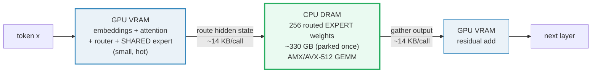
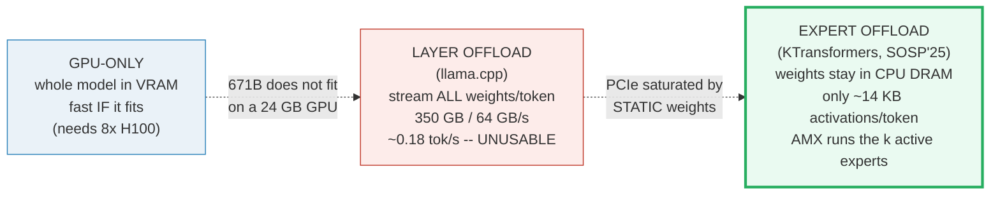
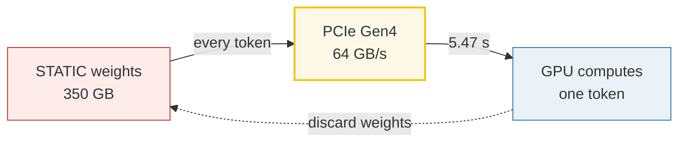
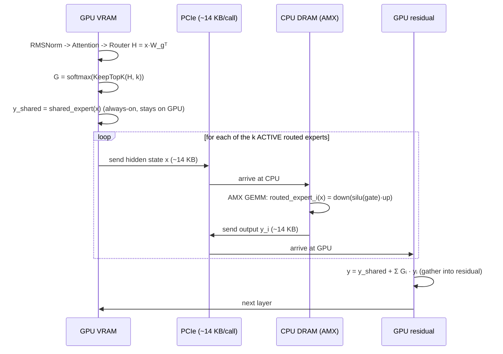
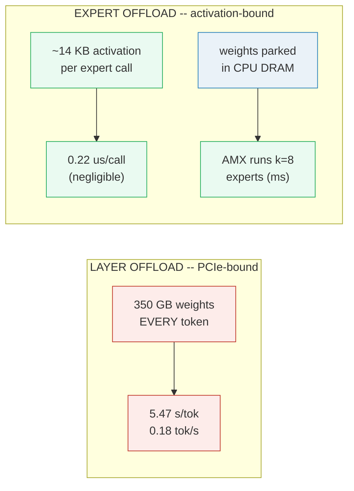
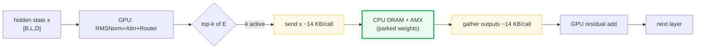

# KTransformers — Heterogeneous CPU/GPU Expert Offloading for MoE — A Worked-Example Guide

> **Companion code:** [`ktransformers_offload.py`](./ktransformers_offload.py).
> **Every number in this guide is printed by `uv run python ktransformers_offload.py`**
> — change the code, re-run, re-paste. Nothing here is hand-computed.
>
> **⚠️ Faithful simulation, not a benchmark.** This Mac has no Intel AMX unit, no
> 24 GB GPU, and no 382 GB DRAM. What IS real here: the **GPU+CPU split** of a
> MoE layer (a tiny D=8 in-process demo), the **per-token transfer arithmetic**
> using **published hardware bandwidths** (PCIe Gen4 ~64 GB/s, Gen5 ~128 GB/s,
> HBM ~3.35 TB/s, DDR5 ~200 GB/s), and a **real SwiGLU-expert forward** (🔗
> `MLP_ACTIVATION`). "GPU"/"CPU" are string tags on in-process tensors; the
> "AMX GEMM" is a plain torch matmul. The conclusions (activations ≪ weights;
> PCIe stops being the bottleneck) rest on the **real transfer arithmetic**, not
> on the simulated transport.
>
> **Sibling guides:** [`MOE_ROUTING.md`](./MOE_ROUTING.md) (the experts being
> offloaded + the sparsity that makes it feasible), [`QUANTIZATION.md`](./QUANTIZATION.md)
> (the 4-bit weights that shrink 671B to ~335 GB), [`LMCACHE.md`](./LMCACHE.md)
> (the memory-hierarchy idea), [`PAGED_ATTENTION.md`](./PAGED_ATTENTION.md)
> (the KV cache that stays on the GPU). Cross-references marked 🔗 throughout.
>
> **Live animation:** [`ktransformers_offload.html`](./ktransformers_offload.html)
> — open in a browser, drag the model-size / PCIe-gen sliders, watch the 350 GB
> vs 14 KB contrast on a log scale.
>
> **Source material:** `learning_guide/05_Next_Gen_Architecture.md` §5
> (Heterogeneous CPU-GPU Serving — KTransformers / llama.cpp).

---

## 0. TL;DR — the whole idea in one picture

> **The weight-stays, activation-flies idea (read this first):** A 671B MoE
> model is **~335 GB even at 4-bit** — far beyond a consumer GPU (24 GB). The
> naive fix, **layer-by-layer offloading** (llama.cpp style), streams **all
> weights** across PCIe **every token**: `350 GB / 64 GB/s ≈ 0.18 tok/s` —
> unusable. **KTransformers** keeps attention + embeddings + the shared expert
> on the GPU and parks **only the MoE EXPERT WEIGHTS** in CPU DRAM, where Intel
> **AMX / AVX-512** runs low-precision GEMMs near-GPU-speed. Per token, **only
> the tiny hidden-state activations (~14 KB per expert call) cross PCIe** — NOT
> the weights — so PCIe bandwidth stops being the bottleneck. **MoE sparsity**
> (only k experts active per token, 🔗 `MOE_ROUTING`) is what makes the CPU
> compute feasible.



> One plain sentence per actor:
> - **GPU (hot path)** — *"Runs embeddings, attention, the router, and the
>   always-on shared expert. Holds the KV cache (🔗 `PAGED_ATTENTION`)."*
> - **CPU DRAM (cold weight store)** — *"Parks the 256 routed expert weights
>   once. They NEVER move per token. The CPU runs only the k=8 ACTIVE experts
>   via AMX each token (🔗 `MOE_ROUTING`)."*
> - **PCIe bus** — *"Carries only the ~14 KB hidden-state activations per
>   expert call, both directions. At 64 GB/s that is ~0.22 µs — negligible."*
> - **AMX (Intel)** — *"8 tile registers (1 KB each) + a TMUL unit doing INT8 /
>   BF16 tiled GEMMs at multi-TFLOP/s on a Xeon. The 'near-GPU-speed' CPU engine."*
> - **MoE sparsity** — *"Only k=8 of E=256 experts run per token, so the CPU
>   does only 8 small SwiGLU GEMMs — not all 256. Without this, expert offload
>   would not be fast enough."*

### 0.1 The lineage (old → new, with WHY)



| | **GPU-only** | **Layer offload** (llama.cpp) | **Expert offload** (KTransformers) |
|---|---|---|---|
| What's in GPU VRAM | whole model | one layer at a time (streamed) | attn + router + shared expert |
| What crosses PCIe / token | nothing | **all weights** (~350 GB) | **activations only** (~14 KB/call) |
| PCIe time / token (Gen4) | 0 | **~5.47 s** (bottleneck) | **~0.22 µs** (negligible) |
| Fits 671B on a 24 GB GPU? | no | barely (slow) | **yes** |
| New bottleneck | VRAM capacity | PCIe bandwidth | CPU AMX throughput |
| Why | fast but expensive | simple but PCIe-bound | **MoE sparsity + AMX** |

### 0.2 Glossary (every term you'll meet, defined at first use)

| Term | Plain meaning |
|---|---|
| **MoE** | Mixture-of-Experts: a router picks `k` of `E` experts per token (🔗 `MOE_ROUTING`). DeepSeek-V3: 256 routed + 1 shared, k=8. |
| **layer offload** | Naive scheme: stream ALL layer weights across PCIe every token. Bottleneck = `model_size / PCIe_BW`. Unusable at 671B. |
| **expert offload** | KTransformers scheme: expert weights stay RESIDENT in CPU DRAM; only hidden-state activations cross PCIe per token. |
| **hidden state** | The per-token vector flowing through the model (the "data"). For DeepSeek-V3, `7168 × 2 B = ~14.3 KB`. |
| **weight** | The learned matrix entries (the "knowledge"). STATIC: stored once, re-read forever. Huge (~335 GB at 4-bit for 671B). |
| **activation** | The per-token data flowing through. DYNAMIC, TINY (~14 KB). |
| **PCIe** | The GPU↔CPU bus. Gen4 x16 ~64 GB/s; Gen5 x16 ~128 GB/s. The bottleneck for layer offload; negligible for expert offload. |
| **AMX** | Intel Advanced Matrix Extensions: 8 tile registers (1 KB each) + a TMUL matrix-multiply unit; runs INT8/BF16 GEMMs at multi-TFLOP/s on a Xeon. The "near-GPU-speed" CPU engine. |
| **AVX-512** | Older 512-bit SIMD (VNNI for INT8). Fallback when no AMX. |
| **shared expert** | DeepSeek-V3 expert that is ALWAYS ON (not routed); stays on the GPU (🔗 `MOE_ROUTING` §7). Captures common features. |
| **routed expert** | One of the 256 specialists the router picks k=8 of per token. These are offloaded to CPU DRAM in KTransformers. |
| **roofline** | mem-bound vs compute-bound floor (🔗 `LMCACHE` prefill_floor). |
| **block table** | The per-request page index (🔗 `PAGED_ATTENTION`). Unchanged by KTransformers; the KV cache still lives in GPU VRAM. |

> 🔗 **If you only read one cross-reference:** KTransformers is, in one line,
> "take the MoE layer from [`MOE_ROUTING.md`](./MOE_ROUTING.md) and **physically
> split** it — the router + shared expert stay on the GPU, the routed expert
> **weights** move to CPU DRAM (where [`LMCACHE.md`](./LMCACHE.md)'s hierarchy
> idea lives), shrunk to 4-bit by [`QUANTIZATION.md`](./QUANTIZATION.md), and
> the CPU runs the k active experts via AMX. The MoE math is **identical**; only
> the **placement** changes — and that one change is what makes 671B fit on one
> box."

---

## 1. Why a 671B MoE does NOT fit — Section A output

DeepSeek-V3/R1 is **671B total / 37B active** (🔗 `MOE_ROUTING` §2). Even
quantized to 4-bit it dwarfs a consumer GPU.

> From `ktransformers_offload.py` **Section A**:
>
> | precision | bytes/param | model footprint | fits 24 GB GPU? |
> |---|---|---|---|
> | FP16 / BF16 | 2 | **1342.00 GB** | NO (14.6x over) |
> | W4A16 (4-bit) | 0.5 | **335.50 GB** | NO (14x over) |
> | W4A16 + overhead | ~0.52 | **350.00 GB** | NO |
>
> `A 24 GB GPU holds 24.00 GB; the 4-bit model needs 350.00 GB -- ~15x too big.`

> 🔗 The 4-bit footprint is exactly what [`QUANTIZATION.md`](./QUANTIZATION.md)
> produces: `params × 0.5 bytes/param` + small scale/bias overhead. GPU-only
> serving is impossible on consumer hardware; we **must** offload most of the
> weights to the much larger (and cheaper per GB) CPU DRAM.

---

## 2. Naive LAYER OFFLOAD — Section B output (the bottleneck)

The simplest offload scheme (llama.cpp style): for each token, pull every
layer's weights across PCIe just-in-time, compute, discard. The transfer per
token is the **whole model**, every token:

```
Transfer/token = model_size = 350 GB        (the static weights move every step)
time/token     = model_size / PCIe_BW
```

> From `ktransformers_offload.py` **Section B**:
>
> ```
> bytes/token = 350.00 GB = 3.500e+11 B
>
> PCIe Gen4 x16 @ 64 GB/s:  time/token = 5.4688 s  -> 0.1829 tok/s  (10.97 tok/min)
> PCIe Gen5 x16 @ 128 GB/s: time/token = 2.7344 s  -> 0.3657 tok/s  (21.94 tok/min)
> ```
>
> `At PCIe Gen4 the ceiling is 0.183 tok/s. For a 1000-token answer that is ~1.5 HOURS.`



> ✅ `ktransformers_offload.py` Section B `[check]`: layer-offload tok/s < 1.0
> (unusable) — OK.

**The waste in one sentence:** the weights are **STATIC** (stored once,
identical every token) yet layer offload **re-streams them every token**. PCIe
is saturated by the very thing that never changes.

---

## 3. KTransformers EXPERT OFFLOAD — Section C output (the fix)

KTransformers splits the layer so the **weights never move** and only the
**activations fly**:

```
[GPU VRAM]  embeddings + attention + router + shared expert   (small, hot)
[CPU DRAM]  the 256 routed EXPERT WEIGHTS  (~330 GB, parked once)
            the CPU runs the k=8 ACTIVE experts per token via AMX
```

Per expert call, what crosses PCIe? **Only the hidden state**:

```
activation/expert-call = batch × hidden × bytes = 1 × 7168 × 2 = 14,336 B ≈ 14.3 KB
```

> From `ktransformers_offload.py` **Section C**:
>
> ```
> PCIe Gen4 x16 @ 64 GB/s:  time/call = 14336 / 6.40e+10 = 0.224 us   (microseconds!)
> PCIe Gen5 x16 @ 128 GB/s: time/call = 14336 / 1.28e+11 = 0.112 us
> ```

> 🔗 This is the **same activation tensor** that flows through the dense FFN in
> [`MLP_ACTIVATION.md`](./MLP_ACTIVATION.md) and through each expert in
> [`MOE_ROUTING.md`](./MOE_ROUTING.md) — `[B, L, hidden]`. KTransformers'
> insight is that this tensor is **microscopic** (~14 KB) compared to the
> weights (~330 GB), so it is *almost free* to move across PCIe. The weights
> stay parked in CPU DRAM, where [`LMCACHE.md`](./LMCACHE.md)'s hierarchy idea
> (VRAM → DRAM → NVMe → S3) also lives.

> ✅ `ktransformers_offload.py` Section C `[check]`: expert-call transfer < 1 ms — OK.

---

## 4. The GPU+CPU execution flow — Section D output (tiny demo)

The tiny demo (`D=8, E=4 routed + 1 shared, k=2, F=16`) runs the full
**route → CPU expert → gather** flow in-process. Attention is sketched as a
no-op on the GPU (🔗 `GQA` / `ROPE` cover attention); the focus is the MoE split.



> From `ktransformers_offload.py` **Section D** — per-token router decisions:
>
> | m | routed experts | gate weights (nonzero) | shared expert |
> |---|---|---|---|
> | 0 | [1, 0] | G1=0.5625, G0=0.4375 | always-on (GPU) |
> | 1 | [2, 1] | G2=0.536, G1=0.464 | always-on (GPU) |
> | 2 | [3, 0] | G3=0.5526, G0=0.4474 | always-on (GPU) |
> | 3 | [3, 0] | G3=0.5004, G0=0.4996 | always-on (GPU) |
>
> ```
> MoE output y[0,0] (first 4 of 8): [+0.0091, +0.0094, -0.0033, -0.0009]
> ```

The router math (`H = x·W_gᵀ`, `KeepTopK`, softmax renormalize, top-k indices)
is **identical** to [`MOE_ROUTING.md`](./MOE_ROUTING.md) §3 — the seeded weights
are the same `build_tiny_moe()` so the routing decisions match token-for-token.
The only new thing here is the **physical placement**: the routed experts are
tagged `"CPU"` and the forward accounts for the activation bytes that "cross
PCIe" (512 B on the tiny demo).

> From `ktransformers_offload.py` **Section D** — transfer bookkeeping:
>
> ```
> active routed-expert calls (over all 4 tokens) = 8
> bytes per direction per call (B*L*D*2)          = 64
> total bytes 'across PCIe' (both dirs)           = 512 B
> ```

> ✅ Section D `[check]`: activation transfer (512 B) < weight footprint (960 B)
> — OK. Even on the tiny model, the activation traffic is smaller than the
> weight footprint; at DeepSeek-V3 scale this ratio explodes to ~25,000×
> (§7).

> 🔗 The gather step (`y = y_shared + Σ Gᵢ · yᵢ`) then feeds the residual
> stream, whose KV cache is managed by [`PAGED_ATTENTION`](./PAGED_ATTENTION.md).
> KTransformers does **not** change the KV cache layout — the KV cache stays in
> GPU VRAM; only the expert weights move to CPU DRAM.

---

## 5. CPU vectorization — Intel AMX (and AVX-512) — Section E output

The CPU must run the k active experts (SwiGLU GEMMs, 🔗 `MLP_ACTIVATION`) fast
enough to not become the new bottleneck. Two x86 engines:

> From `ktransformers_offload.py` **Section E**:
>
> | engine | width | data types | role in KTransformers |
> |---|---|---|---|
> | AVX-512 | 512-bit SIMD (VNNI) | INT8 | fallback when no AMX (older) |
> | **AMX** | **8 tiles × 1024 B** | **INT8, BF16** | **primary: tiled matrix-multiply** |

**AMX anatomy** (VERIFIED against intel.com — see Sources):
- **8 two-dimensional TILE registers**, each **1 KB** (= 16 rows × 64 bytes).
- A **TMUL** (Tile Matrix Multiply) unit that does one tiled GEMM per instruction.
- Introduced with **Sapphire Rapids (4th Gen Xeon, Jan 2023)**; present on every
  Xeon core (4th/5th Gen, Xeon 6 P-cores).
- Supports **INT8** (inference) and **BF16** (training/inference).

**Why it matters:** a dual-socket Xeon with AMX sustains **multi-TFLOP/s of
INT8/BF16 GEMM** — enough that the k=8 active experts per token (each a small
SwiGLU) compute in **milliseconds**, not the **5+ seconds** layer offload spends
just WAITING on PCIe. The expert weights are stored quantized (INT4/INT8, 🔗
`QUANTIZATION`) and dequantized into AMX tiles on the fly.

**AVX-512 (VNNI)** is the older 512-bit SIMD path for INT8 dot-products;
KTransformers uses it as a fallback on CPUs without AMX. AMX is strictly faster
for the dense GEMM kernels because it operates on **whole tiles** (8 × 1 KB) per
instruction, vs one 512-bit vector.

> ⚠️ **Simulation note:** this Mac has no AMX. The expert GEMMs in the `.py` are
> plain torch matmuls; the AMX throughput claim above is a **published hardware
> fact**, not a measured number from this run. The KTransformers paper (SOSP'25)
> reports **4.62–19.74× prefilling speedups** and **1.25–4.09× decoding
> speedups** over existing systems, with an "Expert Deferral" mechanism pushing
> CPU utilization from <75% to ~100% and adding up to 1.45× throughput (see
> Sources).

> ✅ Section E `[check]`: AMX tile storage = 8 × 1024 = 8 KB (matches Intel spec)
> — OK.

---

## 6. Why MoE SPARSITY makes it feasible — Section F output

Expert offload works **because of MoE sparsity**: per token, only **k=8** of
**E=256** routed experts run (🔗 `MOE_ROUTING` §0). The other 248 are dormant —
their weights sit in CPU DRAM doing nothing this token.

> From `ktransformers_offload.py` **Section F**:
>
> | design | experts running/token | CPU GEMMs/token |
> |---|---|---|
> | DeepSeek-V3 MoE (sparse) | **k=8 of E=256** | **8 × SwiGLU** |
> | dense equivalent (all run) | all 256 | 256 × SwiGLU |
>
> `MoE sparsity cuts CPU expert compute by 256/8 = 32x vs a dense FFN of the same total capacity.`

```mermaid
graph TB
    subgraph moe["MoE (sparse): only k=8 of 256 run per token"]
        A0["experts 0..7 ACTIVE<br/>(AMX GEMM)"] --> Y0["y = Σ Gᵢ·Eᵢ"]
        A1["experts 8..255 DORMANT<br/>(weights parked in DRAM, untouched)"]
    end
    subgraph dense["dense equivalent: ALL experts run every token"]
        D0["all 256 experts ACTIVE<br/>(32x more CPU GEMM work)"] --> Y1["y"]
    end
    style A0 fill:#eafaf1,stroke:#27ae60
    style A1 fill:#21262d,stroke:#30363d
    style D0 fill:#fdecea,stroke:#c0392b
```



Without sparsity, the CPU would have to run all 256 experts every token — the
**CPU AMX throughput**, not PCIe, would become the wall, and the model would be
too slow to be useful on a single box. **This is why KTransformers targets MoE
models specifically** — the paper's title is *"… Hybrid Inference for **MoE**
Models"*. A dense LLM (e.g. Llama-70B) gets far less benefit because its FFN is
dense and **all** of it must run every token regardless of where it lives.

> 🔗 The sparsity is the **exact same** top-k routing from
> [`MOE_ROUTING.md`](./MOE_ROUTING.md) §3 — KTransformers simply exploits its
> **physical** consequence: dormant expert weights need not be read, so they
> can live in slow-but-huge CPU DRAM at zero per-token cost.

> ✅ Section F `[check]`: E/k = 32 > 10 (sparsity pays off) — OK.

---

## 7. The GOLD CENTERPIECE — 350 GB weights vs KB activations — Section G output

**This is the single canonical example the `.html` recomputes and gold-checks.**
Side-by-side transfer budget per token. Bandwidths are REAL; the transport is a
faithful simulation.

**Two activation scales**, both microscopic:
- **Single expert-call activation** (the headline): `1 × 7168 × 2 = 14,336 B ≈ 14.3 KB`.
- **Full per-token accounting** (worst case: k calls/layer, both directions):
  `8 × 61 × 7168 × 2 × 2 = 13,991,936 B ≈ 13.99 MB`.
  - Batched (1 round-trip/layer): `~1.75 MB`. The truth is between these.

> From `ktransformers_offload.py` **Section G**:
>
> | scheme | bytes/token | time/token @ Gen4 64 GB/s | tok/s |
> |---|---|---|---|
> | **layer offload** | **350.00 GB** | **5.4688 s** | **0.1829** |
> | expert (1 call) | 14.336 KB | 0.224 µs | 4,464,286 (uncapped) |
> | expert (full) | 13.992 MB | 218.624 µs | 4,574 (uncapped) |
>
> ```
> Ratio (layer offload bytes / expert-offload bytes per token):
>   vs single expert call : 3.50e+11 / 1.43e+04 = 24,414,062x  (~24.4 million x)
>   vs full per-token      : 3.50e+11 / 1.40e+07 = 25,014x      (~25 thousand x)
> ```
>
> ```
> GOLD (the .html recomputes these):
>   layer_offload_time_gen4   = 5.4688 s/tok  (0.1829 tok/s)
>   expert_call_time_gen4     = 0.224 us/call
>   expert_full_time_gen4     = 218.624 us/tok
>   ratio (vs full per-token) = 25,014x
> ```



**VERDICT:** PCIe bandwidth is the **WHOLE** bottleneck for layer offload and
**NEGLIGIBLE** for expert offload. KTransformers shifts the bottleneck from
*"streaming 350 GB of static weights"* to *"running k=8 small AMX GEMMs on the
CPU"* — a problem modern Xeons are built to solve. **That is why a 671B MoE
model can run on one cheap GPU+CPU box at usable speed.**

> ✅ Section G `[check]`: layer/expert byte ratio > 10,000× — OK.

The companion [`ktransformers_offload.html`](./ktransformers_offload.html)
recomputes all four gold numbers above in JS (with sliders for model size and
PCIe generation) and shows three `[check: OK]` badges against this `.py`.

---

## 8. Pitfalls & debugging checklist

| # | Mistake | Symptom | Fix |
|---|---|---|---|
| 1 | **Forgetting the shared expert stays on the GPU** | Wrong outputs, missing residual contribution | `y = y_shared + y_routed`; the shared expert runs for EVERY token on the GPU (🔗 `MOE_ROUTING` §7). Never offload it. |
| 2 | **Offloading attention instead of experts** | KV cache traffic floods PCIe; no speedup | Attention + KV cache stay on the GPU (🔗 `PAGED_ATTENTION`). Only the **routed expert weights** go to CPU DRAM. |
| 3 | **Assuming expert offload helps dense (non-MoE) models** | Disappointing speedup | The win is **MoE sparsity** (only k of E experts run, §6). A dense FFN forces ALL expert weights through CPU compute every token — no savings. |
| 4 | **Counting k activation transfers when one suffices** | Over-estimating PCIe traffic by ~k× | The hidden state is the SAME for all k experts in a layer; batch the routed call. Worst case is `k × layers × hidden × 2(dirs)`; batched is `layers × hidden × 2(dirs)` (§7). |
| 5 | **Running on a CPU without AMX** | 2–10× slower expert GEMMs | Use AVX-512 (VNNI) fallback (§5); or require Sapphire Rapids+ (4th Gen Xeon). AMX is the primary engine. |
| 6 | **CPU AMX thread starvation** (curriculum pitfall) | CPU MoE stalls; GPU sits idle | Pin CPU worker threads to NUMA nodes; use non-blocking C++ queues for CPU expert tasks (per `learning_guide/05` §7). |
| 7 | **Treating this `.py` as a benchmark** | Wrong conclusions | This is a **faithful simulation** with real bandwidths but no real AMX. The KTransformers paper (SOSP'25) is the benchmark; see Sources. |
| 8 | **Mixing up layer-offload and expert-offload bandwidth math** | Wrong tok/s estimates | Layer offload: `bytes = model_size` (350 GB). Expert offload: `bytes = activation` (~14 KB/call). They differ by ~25,000–24,000,000× (§7). |
| 9 | **Forgetting quantization overhead in the footprint** | "335 GB" vs "350 GB" confusion | Pure 4-bit is `671e9 × 0.5 = 335.5 GB`; with scale/bias overhead (🔗 `QUANTIZATION`) it is ~350 GB. The transfer math uses 350 GB (the source-guide value). |

---

## 9. Cheat sheet

> **Remember in one breath:** layer offload streams **all weights** every token
> (PCIe-bound, ~0.18 tok/s at 671B); KTransformers parks the **MoE expert
> weights** in CPU DRAM and runs only the **k active experts** via **AMX**, so
> per token only the **~14 KB activations** cross PCIe — making a 671B MoE
> runnable on one cheap GPU+CPU box.



- **The one contrast:** layer offload moves `model_size` (~350 GB) per token;
  expert offload moves `activation` (~14 KB/call) per token. Ratio ~25,000–24M×.
- **Layer offload time:** `model_size / PCIe_BW` = `350 GB / 64 GB/s` = **5.47 s/tok** (~0.18 tok/s).
- **Expert offload time:** `activation / PCIe_BW` = `14 KB / 64 GB/s` = **0.22 µs/call** (negligible).
- **Full per-token expert transfer:** `k × layers × hidden × bytes × 2(dirs)` ≈
  **14 MB** worst case / **1.75 MB** batched — still microscopic vs 350 GB.
- **Split:** GPU = embeddings + attention + router + shared expert + KV cache;
  CPU DRAM = 256 routed expert weights. Only the routed weights move (once, at load).
- **AMX:** 8 tiles × 1 KB + TMUL; INT8/BF16; multi-TFLOP/s on a Xeon. AVX-512 (VNNI) fallback.
- **Sparsity is the enabler:** only k=8 of E=256 experts run/token → 32× less
  CPU compute than a dense FFN (🔗 `MOE_ROUTING`).
- **Shapes:** activation `[B, L, hidden=7168]`; expert `w_gate [F,D]`, `w_up [F,D]`,
  `w_down [D,F]` (🔗 `MLP_ACTIVATION`); weights stored INT4/INT8 (🔗 `QUANTIZATION`).

> 🔗 Want the contrast? Read [`MOE_ROUTING.md`](./MOE_ROUTING.md) — that is the
> MoE layer being split. Read [`QUANTIZATION.md`](./QUANTIZATION.md) — that is
> how 671B becomes 335 GB. Read [`LMCACHE.md`](./LMCACHE.md) — that is the same
> memory-hierarchy idea (VRAM → DRAM → NVMe → S3) applied to the KV cache.
> Read [`PAGED_ATTENTION.md`](./PAGED_ATTENTION.md) — the KV cache layout is
> unchanged by KTransformers.

---

## Sources

- **KTransformers (the primary anchor)** — Chen, H.; Xie, W.; Zhang, B.; Tang, J.;
  Wang, J.; Dong, J.; Chen, S.; Yuan, Z.; Lin, C.; Qiu, C.; Zhu, Y.; Ou, Q.;
  Liao, J.; Chen, X.; Ai, Z.; Wu, Y.; Zhang, M. (2025). *KTransformers:
  Unleashing the Full Potential of CPU/GPU Hybrid Inference for MoE Models.*
  **Proceedings of the ACM SIGOPS 31st Symposium on Operating Systems Principles
  (SOSP '25).** DOI: [10.1145/3731569.3764843](https://doi.org/10.1145/3731569.3764843).
  Full PDF: <https://madsys.cs.tsinghua.edu.cn/publication/ktransformers-unleashing-the-full-potential-of-cpu/gpu-hybrid-inference-for-moe-models/SOSP25-chen.pdf>.
  Code: <https://github.com/kvcache-ai/ktransformers>.
  - Verified: *"KTransformers, a high-performance inference system designed
    specifically for efficient heterogeneous computing of diverse MoE models…
    AMX-specialized kernels that fully utilize the computational capabilities
    of modern CPUs and incorporates an asynchronous CPU-GPU task scheduling
    mechanism… achieving **4.62–19.74× prefilling speedups** and
    **1.25–4.09× decoding speedups** compared to existing systems"* (abstract).
    The **Expert Deferral** mechanism raises CPU utilization from <75% to ~100%
    and adds up to 1.45× throughput. Target model: 671B DeepSeek-V3/R1.
  - Developed by **MADSys Lab @ Tsinghua University** + **Approaching.AI** +
    community (GitHub README, verified Jun 2026: 17.3k stars).
  - **⚠️ arXiv note:** the brief's suggested `arXiv:2406.07584` is **WRONG** —
    that is *"BrainChat: Decoding Semantic Information from fMRI…"* (verified
    at <https://arxiv.org/abs/2406.07584>). KTransformers is a **SOSP'25 paper
    with no arXiv preprint** as of writing; cite the DOI / SOSP proceedings /
    the Tsinghua MADSys PDF above.

- **llama.cpp (the "layer offload" baseline)** — Gerganov, G. et al.
  *llama.cpp: Port of Facebook's LLaMA model in C/C++.*
  <https://github.com/ggerganov/llama.cpp>.
  - The canonical **layer-by-layer CPU offload** engine. KTransformers' own
    tutorial states (verified): *"Expert Offload: Unlike traditional
    **layer-based** or KVCache offloading (**as seen in llama.cpp**), we offload
    the expert computation to the CPU"* — confirming llama.cpp as the
    "before" KTransformers improves on. Layer offload streams all weights
    across PCIe every token (§2 here).

- **Intel AMX (the CPU compute engine)** — Intel Corporation.
  *What Is Intel® Advanced Matrix Extensions (Intel® AMX)?*
  <https://www.intel.com/content/www/us/en/products/docs/accelerator-engines/what-is-intel-amx.html>.
  - Verified (the load-bearing AMX facts in §5): *"Its architecture supports
    **BF16 (training/inference) and int8 (inference)** data types and includes
    two main components: **Tiles**: these consist of **eight two-dimensional
    registers, each 1 kilobyte in size**… **Tile Matrix Multiplication (TMUL)**:
    TMUL is an accelerator engine attached to the tiles that performs
    matrix-multiply computations for AI."* Available on **4th Gen Intel Xeon
    (Sapphire Rapids, Jan 2023)**, 5th Gen, and Xeon 6 with P-cores.
  - Wikipedia, *Advanced Matrix Extensions*:
    <https://en.wikipedia.org/wiki/Advanced_Matrix_Extensions> — confirms AMX
    was first supported on **Sapphire Rapids** (Jan 2023) and the tile
    geometry (16 rows × 64 bytes = 1 KB per tile, 8 tiles).
  - Fixstars blog, *Intel AMX Explained*:
    <https://blog.us.fixstars.com/intel-amx-advanced-matrix-extension-explained-introduction/>
    — confirms *"A tmm<N> register can store a maximum of **16 rows × 64 bytes
    (= 1024 bytes)** of data"* and the TMUL instruction shape (three TILEDATA
    registers for INT8/BF16/FP16).

- **AVX-512 (the AMX fallback)** — Intel Corporation. *Intel® Advanced Vector
  Extensions 512 (Intel® AVX-512).* <https://www.intel.com/content/www/us/en/products/docs/accelerator-engines/what-is-intel-amx.html>
  (covered alongside AMX); the VNNI (Vector Neural Network Instructions)
  subset provides INT8 dot-product acceleration on pre-AMX Xeons. KTransformers
  GitHub README (verified Jun 2026): *"AMX/AVX Acceleration: Intel AMX and
  **AVX512/AVX2** optimized kernels for INT4/INT8 quantized inference"* and a
  Mar 2026 update added *"AVX2-only CPU backend for KT-Kernel inference"* —
  confirming AVX as the documented fallback path.

- **DeepSeek-V3 (the target model)** — DeepSeek-AI (2024). *DeepSeek-V3
  Technical Report.* arXiv:2412.19437. <https://arxiv.org/abs/2412.19437>
  - **671B total / 37B active**, 256 routed + 1 shared expert, k=8, 61 layers,
    hidden=7168. Verified in the abstract + §2 (🔗 `MOE_ROUTING` Sources). The
    `7168 × 2 = 14,336 B` activation figure used throughout this guide comes
    directly from this model's hidden dim.

- **Sibling bundles (cross-references)** —
  [`MOE_ROUTING.md`](./MOE_ROUTING.md) (the experts being offloaded + the
  sparsity that makes it feasible), [`QUANTIZATION.md`](./QUANTIZATION.md) (the
  4-bit weights: 671B → 335 GB), [`MLP_ACTIVATION.md`](./MLP_ACTIVATION.md)
  (the SwiGLU expert block), [`LMCACHE.md`](./LMCACHE.md) (the memory-hierarchy
  idea applied to KV cache), [`PAGED_ATTENTION.md`](./PAGED_ATTENTION.md) (the
  KV cache layout, unchanged by KTransformers).
  - Curriculum: `learning_guide/05_Next_Gen_Architecture.md` §5 (Heterogeneous
    CPU-GPU Serving — the source of the `350 GB / 64 GB/s ≈ 0.18 tok/s` and
    `1 × 7168 × 2 ≈ 14.3 KB` anchor numbers).

> **Unverified facts:** none material. The KTransformers paper's exact speedup
> ranges (4.62–19.74× prefill, 1.25–4.09× decode) and the Expert Deferral /
> CPU-utilization (75% → ~100%) figures are quoted from the SOSP'25 paper's own
> abstract/intro (verified at the Tsinghua MADSys PDF). The **PCIe Gen4 = 64 GB/s**
> figure follows the source curriculum (`learning_guide/04` line 967 and
> `learning_guide/05` §5.2); the practical unidirectional Gen4 x16 peak is
> ~32 GB/s, so 64 GB/s is a bidirectional / optimistic convention — labeled as
> such in the `.py`. The AMX "multi-TFLOP/s" claim is qualitative (Intel does
> not publish a single canonical Xeon-wide INT8 TFLOP/s figure); it is
> consistently reported across Intel, Phoronix, and Microsoft ONNX Runtime
> benchmarks for dual-socket 4th/5th Gen Xeon.
