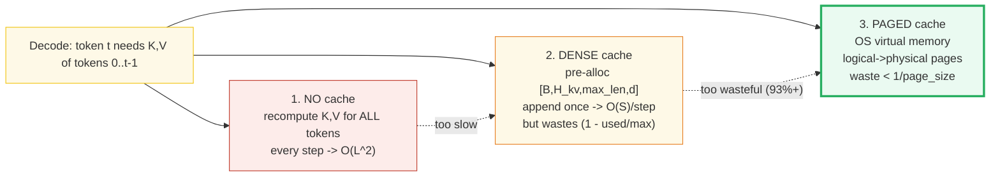
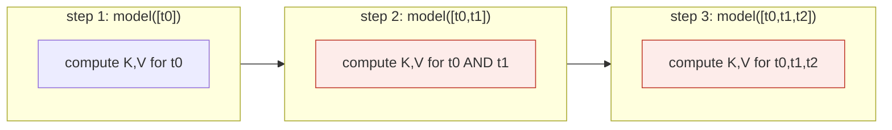
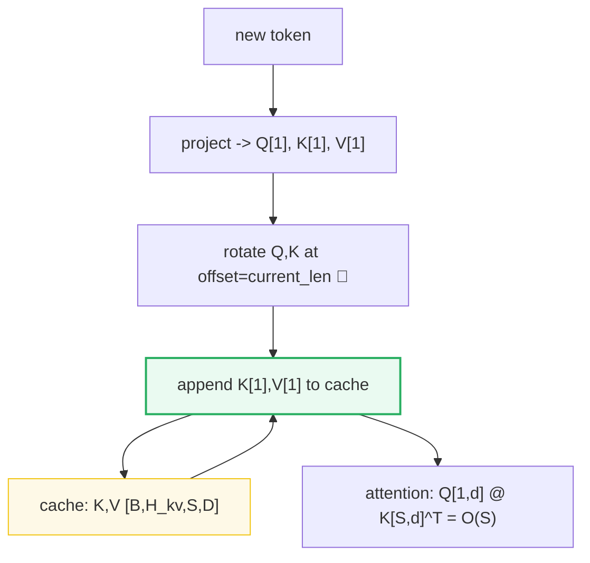
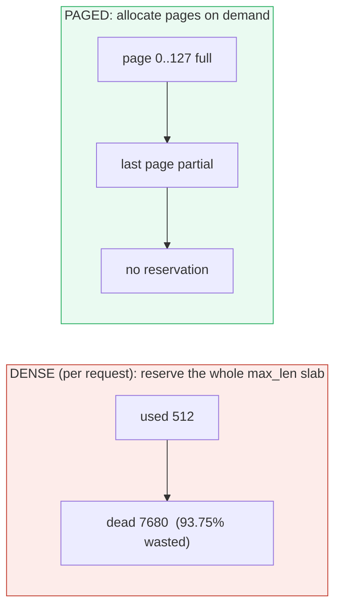
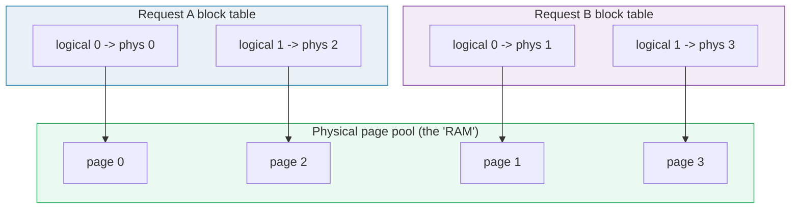
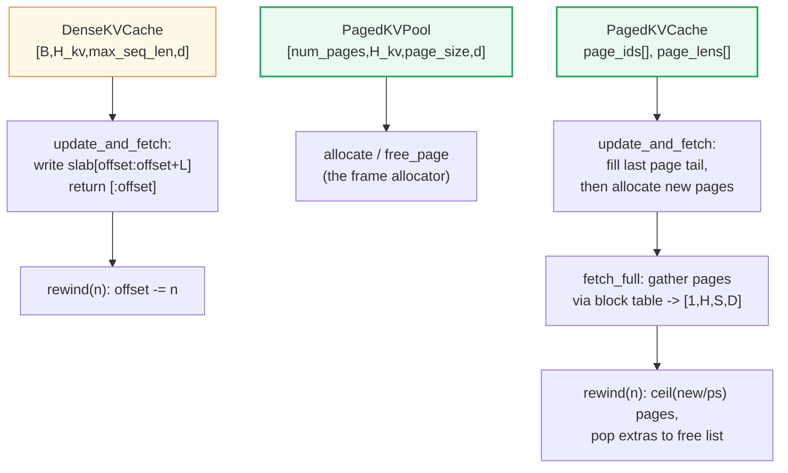
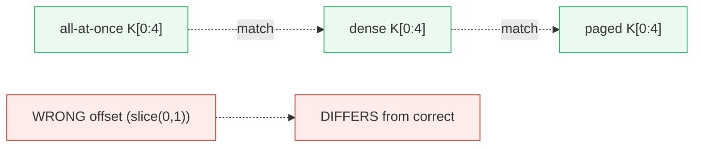
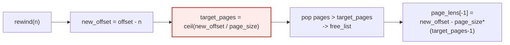
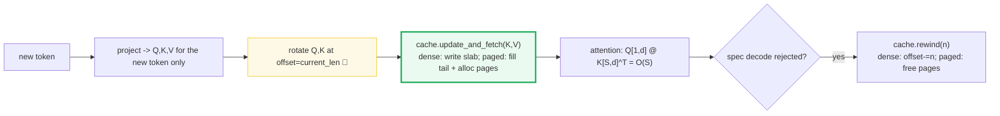

# KV Cache (Dense → Paged) — A Visual, Worked-Example Guide

> **Who this is for:** someone with minimal math and minimal coding background.
> Every concept arrives first as a **plain analogy**, then as a diagram, then as
> a worked example with real numbers. **Every number in this guide is printed by
> `uv run python kv_cache.py`** — nothing hand-computed.
>
> **Companion code:** [`kv_cache.py`](./kv_cache.py).
> **Live animation:** [`kv_cache.html`](./kv_cache.html) — open in a browser and
> click *Prefill → Decode → Rewind* to watch pages scatter and return.
>
> **Sibling guides:** [`ROPE.md`](./ROPE.md) — the `offset` parameter that makes
> the cached decode path equal the all-at-once path (🔗 throughout).
> [`FLASH_ATTENTION.md`](./FLASH_ATTENTION.md) — the *compute* half of the same
> serving stack (KV cache answers *where K,V live*; FlashAttention answers *how
> to multiply them without blowing up HBM*). [`CAUSAL_MASK.md`](./CAUSAL_MASK.md)
> — why the decode query may attend to all cached keys.
>
> **Source material:** `learning_guide/02_Acceleration.md` §3 (Dense KV Cache),
> §3.3 (offset in attention), §3.4 (rewind), §6 (Paged KV Cache).

---

## Glossary (read once, refer back)

| Term | Plain-English meaning |
|---|---|
| **KV cache** | A running *notebook* of past tokens' notes so the model doesn't recompute them every step. |
| **Key (K)** | Per-token *"find me later"* vector (rotated by RoPE so position is encoded). |
| **Value (V)** | Per-token *"retrieve my content"* vector. **Never** rotated. |
| **Query (Q)** | Per-token *"what am I looking for?"* vector; compared against all cached Keys. |
| **prefill** | Process the **whole prompt at once** (a chunk of `L` tokens, `L>1`). Fills the cache. |
| **decode** | Generate **one new token per step** (a chunk of `L=1`). Appends to the cache. |
| **max_seq_len** | The giant fixed *shelf* size dense reserves per request — the source of dense waste. |
| **page** (block) | A fixed-size chunk of `page_size` token slots in the shared pool (vLLM default `16`). |
| **page_size** | Tokens per page. Smaller → less last-page waste, more block-table overhead. |
| **block table** | The per-request *index card*: logical page index → physical page id. (See §5.) |
| **free list** | The pool's stack of available physical page ids — like an OS frame allocator's free frames. |
| **fragmentation** | Empty slots inside reserved-but-unused memory. Dense: huge (up to 93.75%); paged: only the last partial page (`< 1/page_size`). |
| **offset** | How many tokens are already in the cache. **Equals RoPE's position offset** for the new chunk: `slice(offset, offset+L)`. |
| **rewind(n)** | Tear out the last `n` tokens (when speculative decoding rejects them). Dense: `offset -= n`; paged: pop pages back to the free list (using **ceil**, never floor — see §8). |

> 🔗 **The single cross-reference to remember:** the cache stores
> **already-rotated** K,V. So during decode, RoPE must rotate the *new* token at
> its **true position** (`offset = slice(current_len, current_len+1)`) —
> otherwise the cached path and the all-at-once path disagree. That is exactly
> [`ROPE.md`](./ROPE.md) §10, and [§7](#7-the-invariant-no-cache--dense--paged-proof-with-numbers)
> below proves it.

---

## 0. TL;DR — the whole lineage in one picture

LLM decoding is **autoregressive**: each new token needs every previous token's
`K` and `V`. There are three ways to get them, and the whole story is the
trade-off between *recompute cost* and *memory waste*.

**The three generations, as analogies** (layer them — each one fixes the prior's
weakness):

- **NO cache (Week 1)** = *"to answer the 100th word, the model re-reads and
  re-thinks about ALL 100 words from scratch — word 1's notes get recomputed
  every single step. `O(L²)` work, painfully slow."*
- **DENSE cache** = *"keep a notebook of past notes (Keys & Values) so we only
  compute the ONE new word's note each step and append it. `O(1)` per step. BUT
  we pre-reserve a giant fixed shelf (`max_seq_len`) per reader — if a reader
  only jots 500 notes, the other 7700 shelf slots sit empty (93% wasted)."*
- **PAGED cache (vLLM / PagedAttention)** = *"like a LIBRARY: shared shelves
  carved into fixed-size pages. Each reader gets an INDEX CARD (the block table)
  saying which physical pages hold their notes — and the pages can be scattered
  anywhere. No pre-reserved empty shelves → almost no waste. When a reader
  finishes, their pages go back to the pool."*



*The red → orange → green arrow above is the whole story: each generation fixes
the prior's pain point. Paged is what production servers (vLLM, TGI, SGLang)
actually run.*

| | **No cache** | **Dense cache** | **Paged cache** |
|---|---|---|---|
| Per-decode-step K,V cost | recompute all `S` tokens = `O(S)` | append `1`, attend over `S` = `O(S)` | same `O(S)` (gather via block table) |
| Total over `L` decode steps | `O(L²)` (token 0 recomputed `L`×) | `O(L)` | `O(L)` |
| Memory reserved | none | `[B,H_kv,max_len,d]` up-front | on-demand pages, ~exact usage |
| Worst-case waste | — | up to **93.75%** (used 512 / reserved 8192) | **< 1/page_size** (e.g. <4% in vLLM) |
| Rewind (spec. decode) | free | truncate `offset` | pop pages to free list |
| Used by | toy Week-1 `simple_generate` | `TinyKvFullCache` | **vLLM / PagedAttention** |

*(See the [Glossary](#glossary-read-once-refer-back) above for any unfamiliar term.)*

---

## 1. The problem without a cache — Section A output

**Analogy (NO cache):** *to answer the 100th word, re-read and re-think about
ALL 100 words from scratch — word 1's notes get recomputed every single step.
`O(L²)` work, painfully slow.*

In Week-1 `simple_generate()`, every new token triggers a forward pass over the
**entire** running prefix. Token 0's `K,V` get recomputed at *every single step*:



*Each step re-runs the model on the WHOLE growing prefix. Token 0's `K,V` (in
red) are computed once at step 1, then AGAIN at step 2, then AGAIN at step 3 …
that recompute is the entire reason a cache exists.*

> From `kv_cache.py` **Section A** — generating 5 tokens, K/V token-projections per step:
>
> | step t | seq len processed | K,V tokens computed this step | token-0 K,V recomputed? |
> |---|---|---|---|
> | 1 | 1 | 1 | yes (1) |
> | 2 | 2 | 2 | yes (2) |
> | 3 | 3 | 3 | yes (3) |
> | 4 | 4 | 4 | yes (4) |
> | 5 | 5 | 5 | yes (5) |
>
> Total K/V token-projections over 5 decode steps:
> - no-cache: `1+2+3+4+5 = 15` (= `L(L+1)/2 = O(L²)`)
> - w/ cache: `5` (1 per step = `O(L)`)
> - **token-0's K,V computed: 5× without cache, 1× with cache**

The cost is quadratic in sequence length. At `L=2048` that's ~2 million
projections instead of 2048. The fix is blindingly simple: **don't throw K,V
away**.

---

## 2. The dense cache — Section B output

**Analogy (DENSE cache):** *keep a notebook of past notes (Keys & Values) so we
only compute the ONE new word's note each step and append it. `O(1)` per step.
BUT we pre-reserve a giant fixed shelf (`max_seq_len`) per reader — if a reader
only jots 500 notes, the other 7700 shelf slots sit empty (93% wasted).*

Cache the running `K` and `V`. On each decode step, project **only the new
token**, append its `K,V`, and attend the single new `Q` against the full cached
`K,V`.



*One new token in (top); project only it; rotate at its true position; append
its `K,V` to the running cache (green); the cache hands back the FULL `K,V` so
attention is one tiny `Q[1]×K[S]` row, not a full matrix.*

### Narrated worked example (prefill 3 → decode 1)

Follow along with the shapes below — this is the same example `kv_cache.py`
Section B prints:

1. **Prefill 3 tokens.** The whole prompt chunk `[t0, t1, t2]` enters at once.
   Project, rotate at `offset = slice(0, 3)`, write into the notebook. The
   notebook now has **3 entries** (`offset = 3`).
2. **Decode token 4.** Only the ONE new token enters. Project it, rotate at
   `offset = slice(3, 4)` — so it is positioned as **word #4**, NOT word #0.
   Append its `K,V`. The notebook now has **4 entries** (`offset = 4`).
3. **Attention.** Compare the **1 new query** `Q` against **all 4 cached keys**
   `K[0..3]`. The output is one weighted blend of the 4 cached values.
4. **Check (proven in [§7](#7-the-invariant-no-cache--dense--paged-proof-with-numbers)):**
   this equals having processed all 4 tokens at once. The cache changes
   *when* each `K,V` is computed, not *what* it is.

Shape evolution (`B=1, H_kv=2, D=8, max_seq_len=8`):

> From `kv_cache.py` **Section B**:
>
> - Pre-allocated cache shape: `(1, 2, 8, 8)` = `[B=1, H_kv=2, max_seq_len=8, D=8]`
> - **Prefill 3 tokens:** `cache.k[:,:,:offset,:].shape = (1, 2, 3, 8)` (offset now 3)
> - **Decode 1 token:** `cache.k[:,:,:offset,:].shape = (1, 2, 4, 8)` (offset now 4)
> - `Q` for this step has shape `[1, H_q, 1, D]` — **ONLY the new token**
> - attention is `Q[1,d] @ K[4,d]^T = O(S=4)` per step, **not** `O(S²)`

This mirrors `TinyKvFullCache.update_and_fetch`: append new `K,V` on the `SeqLen`
axis (axis 2), return the full concatenated `K,V`, and pass only the new `Q`.

**The catch — the slab is reserved up-front, no matter how few tokens you use:**

> From `kv_cache.py` **Section B** (cont.):
> > The slab `[B,H_kv,max_seq_len=8,D]` is reserved NO MATTER the offset. Here
> > `offset=4` but `max_seq_len=8` → **50.0% of the slab is unused right now.**

That "reserved no matter what" is the seed of the fragmentation problem in [§4](#4-fragmentation-math--section-c-output).

---

## 3. Shapes: cache layout `[B,H_kv,S,D]` and the `offset` 🔗

**Analogy (the offset):** *when generating word #512 one-at-a-time, the model
must treat it as word #512 (rotate/position it correctly), NOT as word #0. This
is exactly RoPE's offset. Getting it wrong → gibberish after the first word.*

The cache stores `K,V` as `[B, H_kv, S, D]` (axis 2 = `SeqLen`). RoPE from
[`ROPE.md`](./ROPE.md) operates on `[B, L, H, D]`, so there is a permute around
the rotation:

```
cache layout : [B, H_kv, S, D]   <- append on axis 2 (SeqLen)
RoPE  layout : [B, L,    H, D]   <- position is axis 1
=> permute(0,2,1,3) before RoPE, permute(0,2,1,3) after.
```

```mermaid
sequenceDiagram
    participant X as new token x:[B,L,H,D]
    participant R as RoPE (offset=current_len) 🔗
    participant C as DenseKVCache
    participant A as attention

    Note over X: PREFILL (L=3): offset = slice(0,3) -> rows [0,1,2]
    X->>R: rotate Q,K at true positions 0..2
    R->>C: store K,V; offset becomes 3
    Note over A: Q[3] @ K[3]^T (all-at-once)

    Note over X: DECODE (L=1): offset = slice(3,4) -> row [3] ✓
    X->>R: rotate ONE new token at TRUE position 3
    R->>C: append K[1],V[1]; offset becomes 4
    C-->>A: full K,V [B,H_kv,4,D]
    A->>A: Q[1,d] @ K[4,d]^T = O(S)
```

*Read the diagram top-down. Prefill rotates 3 tokens at positions 0..2 and the
cache fills with 3 rows. Decode rotates the ONE new token at position **3** (the
true slot — the offset's whole job), appends it, and attention uses the full
4-row cache.*

The `offset` parameter is the bridge to [`ROPE.md`](./ROPE.md): without
`offset = slice(current_len, current_len + 1)`, RoPE would rotate every decoded
token as if it were position 0 → `Q` un-rotated → **gibberish after prefill**.
[§7](#7-the-invariant-no-cache--dense--paged-proof-with-numbers) proves the
cached and all-at-once paths agree **only** with the correct offset.

---

## 4. Fragmentation math — Section C output

Dense reserves the *worst-case* slab per request. If a request reserves
`max_seq_len = 8192` but only uses `512` tokens, almost all of it is dead.

> From `kv_cache.py` **Section C** (fp16/bf16 = 2 bytes, all computed in code):
>
> **THE 93% EXAMPLE** (one request, max_seq_len vs actual usage):
> - `max_seq_len` reserved = 8192, actual tokens used = 512
> - waste fraction = `1 - used/max = 1 - 512/8192 = 0.9375 = 93.75%`
> - → **93.75% of this request's reserved slab is dead memory.**
>
> **PER-REQUEST dense KV bytes** (LLaMA-7B shape: 32 layers, 32 KV heads, d=128):
> - `2(KV) × 32 × 32 × 8192 × 128 × 2 B = 4,294,967,296 bytes = 4.000 GiB`
> - vLLM reports up to ~1.7 GiB for LLaMA-13B per sequence.
>
> **100 CONCURRENT requests**, reserved vs actually used (used=512 each):
> - reserved = `400.0 GiB`
> - used = `25.0 GiB`
> - wasted = `375.0 GiB` (**93.8% of reserved**)
>
> **PAGED cache waste bound** (only the LAST page of each request is partial):
>
> | page_size | worst-case internal waste |
> |---|---|
> | 4 | 25.00% |
> | 16 | 6.25% ← vLLM default block size |
> | 128 | 0.78% ← tiny-llm page_size (real) |
>
> vLLM measured: PagedAttention wastes **<4% in practice vs 60%–80%** for the
> dense/over-reserving systems it replaced.



*Dense (red) lights up its full `max_len` shelf the moment a request arrives —
most of it dark forever. Paged (green) lights up only as many pages as the
request actually fills; the only dark slot is inside the last partial page.*

### Two different "waste" numbers — keep them distinct

| Number | What it measures | Source |
|---|---|---|
| **93.75%** | *One* request's reserved-vs-used slab: `1 − 512/8192`. A clean illustrative arithmetic example. | Computed in `kv_cache.py` Section C. |
| **60–80%** | *System-wide* KV-cache waste vLLM measured in prior serving systems (a mix of internal fragmentation + external fragmentation + over-reservation, summed across many concurrent requests of varied lengths). | [vLLM blog, Jun 2023](https://vllm.ai/blog/2023-06-20-vllm) + [PagedAttention paper, §3.1](https://arxiv.org/abs/2309.06180). |
| **<4%** | *System-wide* KV-cache waste under PagedAttention in practice. | [PagedAttention paper, §3.2](https://arxiv.org/abs/2309.06180); only the last block of each sequence is partial, so waste is bounded by `1/page_size`. |

The 93.75% example is *not* vLLM's measurement — it's the per-request
arithmetic that makes the intuition crisp. vLLM's 60–80% is the real-world
aggregate across heterogeneous requests.

**Why this caps throughput:** the dead slab is still *allocated* VRAM, so you can
fit fewer concurrent requests in the batch → lower GPU utilization → lower
throughput. vLLM's 2–4× win comes almost entirely from removing this waste so
more sequences fit.

> 🔗 This is independent of the *attention* cost itself. Even with a perfect KV
> cache, materializing the `S×S` score matrix in HBM is its own catastrophe —
> that is what [`FLASH_ATTENTION.md`](./FLASH_ATTENTION.md) solves.

---

## 5. PagedAttention: OS virtual memory for KV — Section D output

**Analogy (PAGED cache):** *like a LIBRARY: shared shelves carved into
fixed-size pages. Each reader gets an INDEX CARD (the block table) saying which
physical pages hold their notes — and the pages can be scattered anywhere. No
pre-reserved empty shelves → almost no waste. When a reader finishes, their
pages go back to the pool.*

The fix is borrowed straight from operating systems (Kwon et al., SOSP 2023).
vLLM's own analogy: **"blocks as pages, tokens as bytes, sequences as processes."**

- A **page** (a.k.a. block) holds a fixed number of tokens: `page_size`.
- Each request owns a **block table**: logical page index → physical page id.
- Physical pages come from a shared **pool** with a **free list** (the OS frame
  allocator). They need **not** be contiguous.
- Memory waste now happens only in the *last* (partial) page of each request.



*The green pool is the library's shared shelves. Each request (blue/purple) only
holds an INDEX CARD — a small list saying "my logical page 0 lives in physical
page 0; my logical page 1 lives in physical page 2." Two requests happily share
the same pool without ever reserving a private shelf.*

### The block-table walk (with the tiny example numbers)

> From `kv_cache.py` **Section D** — interleaving 2 requests so storage scatters
> (`page_size=4`):
>
> | request | logical pages (in order) | physical pages | contiguous? |
> |---|---|---|---|
> | A | `['L0', 'L1']` | `['P0', 'P2']` | **NO (scattered)** |
> | B | `['L0', 'L1']` | `['P1', 'P3']` | **NO (scattered)** |
>
> Reading request A's K,V in logical order walks physical pages `[0, 2]` → the
> data is scattered across the pool. The paged attention kernel uses **this block
> table** to gather K,V from non-contiguous physical memory, exactly like an OS
> page table.
>
> **GOLD** (reproduced by the `.html`):
> - `A.page_ids = [0, 2]`, `A.page_lens = [4, 4]`
> - `B.page_ids = [1, 3]`, `B.page_lens = [4, 1]`

**Step through it as a story** (this is what `kv_cache.html` panel ② animates):

1. Request A prefills 4 tokens → grabs **physical page 0** (block table A:
   `logical 0 → phys 0`).
2. Request B prefills 4 tokens → grabs **physical page 1** (block table B:
   `logical 0 → phys 1`).
3. Request A decodes 1 token → page 0 is full, so it grabs **physical page 2**
   (block table A: `logical 1 → phys 2`). **A's storage is now scattered
   `[0, 2]` — non-contiguous.**
4. Request B decodes 1 token → grabs **physical page 3** (block table B:
   `logical 1 → phys 3`).
5. Request A decodes 3 more tokens → they fit in the tail of page 2 (it had 1
   slot used, +3 = 4 = full). **No new page allocated.**

The block table is what makes scattered storage usable: to read A's notes in
order, the kernel walks `[phys 0, phys 2]`, exactly like an OS page table walks
virtual→physical translations. **The paged path produces the same K's as the
dense path** — proven in [§7](#7-the-invariant-no-cache--dense--paged-proof-with-numbers).

Because physical storage is non-contiguous, allocating/freeing pages never
fragments the pool into unusable slabs — a freed page is immediately reusable by
*any* request. Combined with sharing + Copy-on-Write (parallel sampling, beam
search), this is what gets vLLM to near-zero waste.

---

## 6. The reference code (`kv_cache.py`) — annotated

Three tiny classes. The dense cache (orange) is the warm-up; the paged pool +
cache (green) is the real subject — that pair is what vLLM actually runs.



*Left (orange): the dense cache — one slab, simple but wasteful. Right (green):
the paged pair — a shared pool that hands out frames, plus a per-request cache
that holds an index card (block table) and knows how to gather its scattered
pages back into a contiguous tensor for attention.*

Map to source material:
- `DenseKVCache` ↔ `TinyKvFullCache` (`02_Acceleration.md` §3.2).
- `PagedKVPool` ↔ `TinyKvPagedPool` (`02_Acceleration.md` §6.3); `PagedKVCache`
  ↔ `TinyKvPagedCache` (`02_Acceleration.md` §6.4), including `_append_chunk` and
  `rewind`.
- The block table (`02_Acceleration.md` §6.5) is `page_ids[]` here.

---

## 7. The invariant: no-cache == dense == paged — proof with numbers

**Analogy (the proof):** *if the cache stores K,V correctly, then computing all
4 tokens at once must give the EXACT same K,V and attention output as
prefilling 3 then decoding 1 — whether the cache is one dense slab or scattered
pages. This section builds the same 4 tokens three ways and asserts
byte-equality. The WRONG-offset path (treating the decoded token as position 0)
must diverge — that divergence is the proof that the offset is mandatory.*

This is the load-bearing assertion of the whole bundle. Build the **same 4
tokens** three ways and confirm the cached `K,V` and the attention output are
identical (within tolerance):

1. **all-at-once** (ground truth, "no cache"): rotate all 4 K's at `slice(0,4)`,
   attend `Q[3] @ K[0:4]^T`.
2. **dense**: prefill 3 (`slice(0,3)`), decode token 3 (`slice(3,4)`), attend the
   new `Q` against the full cached `K`.
3. **paged**: same chunks through the paged pool; `fetch_full` gathers via the
   block table.

> From `kv_cache.py` **Section E** — full K-cache, head `h=0`, three paths:
>
> | path | `K[0,0,0,:4]` (token0) | `K[0,0,3,:4]` (token3) |
> |---|---|---|
> | all-at-once | `[0.101, 0.102, 0.103, 0.104]` | `[-0.4541, 0.2641, 0.3906, 0.4028]` |
> | dense | `[0.101, 0.102, 0.103, 0.104]` | `[-0.4541, 0.2641, 0.3906, 0.4028]` |
> | paged | `[0.101, 0.102, 0.103, 0.104]` | `[-0.4541, 0.2641, 0.3906, 0.4028]` |
>
> `[check]` dense full-K == all-at-once K? **True**
> `[check]` paged full-K == all-at-once K? **True**
> `[check]` paged full-K == dense full-K? **True**
> `[check]` dense attn(token3) == full attn(token3)? **True**
> `[check]` paged attn(token3) == full attn(token3)? **True**
> `[check]` WRONG-offset decode differs from correct? **True** (proves offset matters)
>
> **[check] ALL THREE PATHS MATCH (no-cache == dense == paged): OK**



*Three correct paths (green) produce byte-identical K. The wrong-offset path
(red) diverges — that's the proof the offset is not optional.*

**Why the three match:** the cache stores K,V *after* RoPE. With the correct
`offset`, the rotated `K[3]` appended during decode is byte-identical to the
`K[3]` produced by rotating all four at once. The paged path only changes
*where* those bytes live (scattered pages vs. one slab), not *what* they are —
and `fetch_full` reconstructs the exact same contiguous tensor. The wrong-offset
case rotates the new token at position 0, so it diverges → the proof that the
offset is not optional.

> 🔗 This is the direct payoff of [`ROPE.md`](./ROPE.md) §10: "decode must use
> the true position." Here you can *see* the cached path equal the all-at-once
> path only when that rule is honored. For the decode query attending to all
> cached keys without masking, see [`CAUSAL_MASK.md`](./CAUSAL_MASK.md) — the
> last token is causally allowed to see everything before it.

---

## 8. Rewind(n) — speculative decoding, and the off-by-one trap

**Analogy (rewind):** *if the model guessed a few words too eagerly and they're
rejected, just tear out those last notebook pages — in the library, return those
pages to the pool. But tearing must respect PAGE BOUNDARIES: an off-by-one
leaves a stale half-page that leaks into the next step.*

Speculative decoding may **reject** drafted tokens. The cache must then *undo*
the appended K,V. Dense just truncates `offset`; paged must also **return whole
pages to the free list** and fix the partial length of the new last page.

> From `kv_cache.py` **Section F** — start at offset 5 (`page_ids=[0,1]`,
> `page_lens=[4,1]`), `rewind(1)`:
>
> - `page_ids = [0]` ← physical page **1 RETURNED to free list**
> - `page_lens = [4]` ← page 0 back to full (4 tokens)
> - `offset = 4`
> - `free_list` before: `[2,3,4,5,6,7]` → after: `[1,2,3,4,5,6,7]`

**The off-by-one trap — why `rewind` uses `ceil`, not `floor`:**

> | offset | rewind(n) | new_offset | ceil(new/PS) pages kept | floor would keep | correct? |
> |---|---|---|---|---|---|
> | 4 | 1 | 3 | 1 | 0 | yes (ceil) |
> | 5 | 1 | 4 | 1 | 1 | yes (ceil) |
> | 8 | 1 | 7 | 2 | 1 | yes (ceil) |
> | 5 | 5 | 0 | 0 | 0 | yes (ceil) |
> | 4 | 4 | 0 | 0 | 0 | yes (ceil) |
> | 9 | 1 | 8 | 2 | 2 | yes (ceil) |

At `offset=8, rewind(1)`: `new=7`, `ceil(7/4)=2` pages kept (correct: 4+3). A
naive `floor(7/4)=1` would **drop a still-needed page → silent data loss** — the
3 tokens still living in the second page would vanish, and the next decode step
would read stale garbage from a freed page. At an exact page multiple
(`offset=5, rewind(1)` → `new=4`), `ceil(4/4)=1` keeps one full page; floor
happens to agree *there* but fails at `new=7`. The correct formula is
`target_pages = ceil(new_offset / page_size)`, then
`page_lens[-1] = new_offset - page_size·(target_pages - 1)`.



*Step 2 (red) is the trap: use `ceil`, never `floor`. Everything else follows
from getting that one division right.*

---

## 9. Pitfalls & debugging checklist

| # | Mistake | Symptom | Fix |
|---|---|---|---|
| 1 | Decode with `offset=slice(0,1)` instead of true position | Gibberish after prefill; cached path ≠ all-at-once | `offset = slice(current_len, current_len+1)` ([§7](#7-the-invariant-no-cache--dense--paged-proof-with-numbers)) 🔗 |
| 2 | Forgetting to rotate K (only Q) | Cached K wrong → drift | Rotate both Q **and** K at the offset |
| 3 | Storing V *after* RoPE | Wrong values (RoPE only touches Q,K) | Cache stores rotated K; **V is never rotated** |
| 4 | Dense: `max_seq_len` too small | Overflow / crash mid-generation | Reserve enough, or go paged |
| 5 | Dense: over-reserving `max_seq_len` | 93%+ wasted VRAM, small batches | Switch to paged (`02_Acceleration.md` §6) |
| 6 | `rewind` using floor instead of ceil | Silent page loss at boundaries ([§8](#8-rewindn--speculative-decoding-and-the-off-by-one-trap)) | `target_pages = ceil(new_offset/page_size)` |
| 7 | Not returning freed pages to the pool | VRAM leak across requests | `pool.free_page(pid)` on rewind/release |
| 8 | Mixing cache layouts (`[B,H,S,D]` vs `[B,L,H,D]`) | Wrong per-position rotation | Permute around RoPE ([§3](#3-shapes-cache-layout-bh_kvsd-and-the-offset-)) |
| 9 | Assuming paged K is contiguous in memory | Wrong kernel gather | Always go through the block table (`fetch_full`) |

---

## 10. Cheat sheet



*One token enters at the top; it is projected, rotated at its true position,
appended to the cache (green), and attended against all cached keys. If a
speculative draft is rejected, the cache rewinds (right). That's the whole
decode loop.*

- **No cache:** `O(L²)` K,V projections; token 0 recomputed `L` times.
- **Dense cache:** pre-alloc `[B,H_kv,max_seq_len,d]`; append on axis 2; `O(S)`
  per step; wastes `(1 - used/max_seq_len)` (up to 93.75%).
- **Paged cache:** pool `[num_pages,H_kv,page_size,d]`; per-request `page_ids[]`
  (block table) + `page_lens[]`; waste `< 1/page_size` (<4% in vLLM).
- **Invariant:** no-cache == dense == paged (proven in `kv_cache.py` Section E).
- **`offset`:** `slice(current_len, current_len+L)` for RoPE — the 🔗 to
  [`ROPE.md`](./ROPE.md) §10.
- **`rewind(n)`:** `target_pages = ceil(new_offset/page_size)`; pop extras to the
  free list; fix `page_lens[-1]`.

> 🔗 The cache answers *"where do K,V live and how do I reuse them?"* The
> companion question *"how do I compute attention without blowing up HBM?"* is
> [`FLASH_ATTENTION.md`](./FLASH_ATTENTION.md). Together they are the two halves
> of fast LLM serving.

---

## Sources

- **Primary paper:** W. Kwon et al., *"Efficient Memory Management for Large
  Language Model Serving with PagedAttention,"* SOSP 2023,
  [arXiv:2309.06180](https://arxiv.org/abs/2309.06180).
  - Verified: the OS virtual-memory analogy ("blocks as pages, tokens as bytes,
    sequences as processes"); logical→non-contiguous-physical block table;
    on-demand physical-block allocation; waste only in the last block;
    Copy-on-Write sharing with reference counts; 2–4× throughput vs prior SOTA.
  - Verified (paper §3.1 + §3.2): existing serving systems waste **60%–80%** of
    KV memory to a mix of internal + external fragmentation and over-reservation;
    PagedAttention reduces that to **<4%** because only each sequence's last
    block can be partial (waste bounded by `1/page_size`).
- **vLLM launch blog:** [vLLM: Easy, Fast, and Cheap LLM Serving with
  PagedAttention](https://vllm.ai/blog/2023-06-20-vllm) (Jun 2023).
  - Verified numbers: KV cache takes up to **~1.7 GiB per sequence** for
    LLaMA-13B (at seq_len=2048, fp16); up to **24×** throughput vs HF
    Transformers; default block size **16**.
- **Local source:** `learning_guide/02_Acceleration.md` §3 (dense cache),
  §3.3 (offset), §3.4 (rewind), §6 (paged cache + block table).
- **Derived (not from the paper):** the **93.75%** figure is the clean
  arithmetic `1 − 512/8192` for *one* request's reserved-vs-used slab — an
  illustrative example, computed and asserted in `kv_cache.py` Section C. It is
  distinct from vLLM's measured system-wide 60–80% waste (fragmentation +
  reservation + internal). Both numbers are correct; they measure different
  things (per-request arithmetic vs system-wide aggregate). See the table in [§4](#two-different-waste-numbers--keep-them-distinct).
- **Unverified / approximated:** none. Every byte count is computed in
  `kv_cache.py`; the LLaMA-7B shape (32 layers, 32 KV heads, d=128) is the
  standard config used for the worked example.
