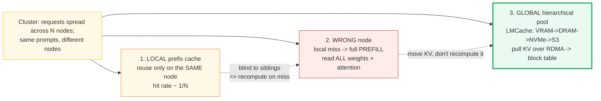
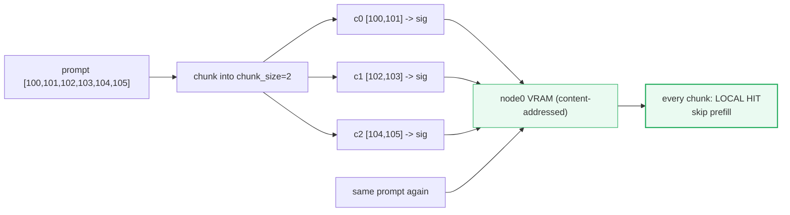
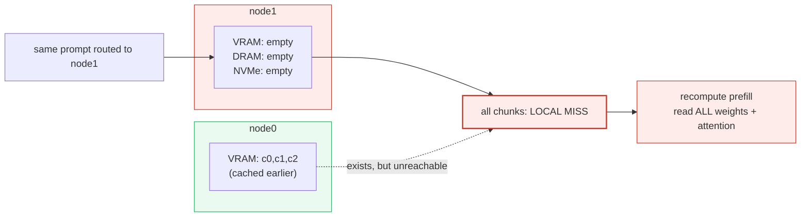
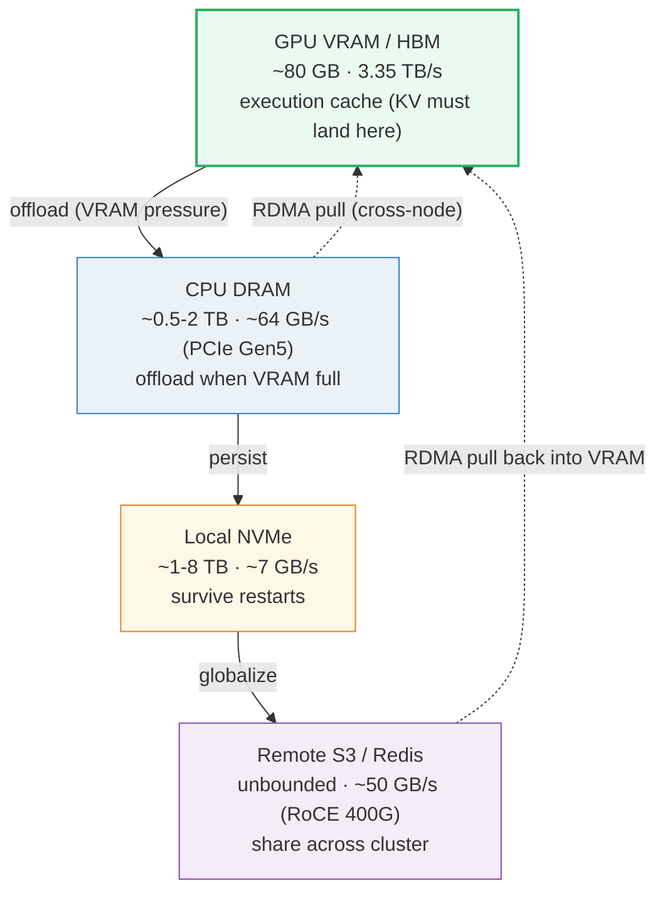
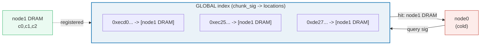
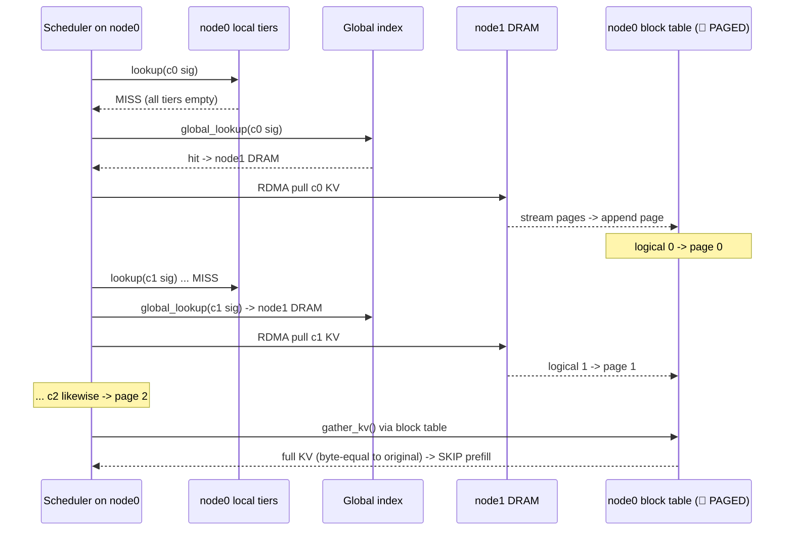
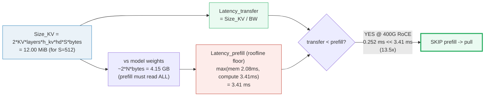
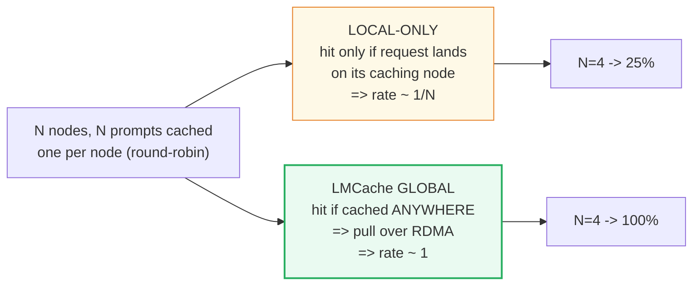
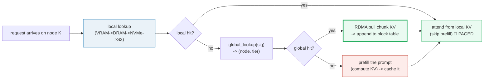

# LMCache (Hierarchical, Global KV-Cache Pooling) — A Visual, Worked-Example Guide

> **Who this is for:** someone with minimal systems background who already
> understands single-node prefix caching (🔗 [`PREFIX_CACHE.md`](./PREFIX_CACHE.md)).
> Every concept arrives first as a **plain analogy**, then as a diagram, then as
> a worked example with real numbers. **Every number in this guide is printed by
> `uv run python lmcache.py`** — nothing hand-computed.
>
> **Companion code:** [`lmcache.py`](./lmcache.py).
> **Live animation:** [`lmcache.html`](./lmcache.html) — open in a browser and
> drag the prompt-length / bandwidth sliders to watch the transfer-vs-recompute
> budget flip, with a live `[check: OK]` gold badge.
>
> **Sibling guides:** [`PREFIX_CACHE.md`](./PREFIX_CACHE.md) — your **direct
> baseline** (the single-node radix-tree cache whose locality LMCache breaks;
> 🔗 throughout). [`PAGED_ATTENTION.md`](./PAGED_ATTENTION.md) — the kernel that
> reads whatever KV the pulled pages land in. [`KV_CACHE.md`](./KV_CACHE.md) —
> the paged storage layout (the bytes that get moved). [`BLOCK_MANAGER.md`](./BLOCK_MANAGER.md)
> — the flat chained-hash index (same FNV-1a signature used here).
>
> **Source material:** `learning_guide/03_Scale_Serving.md` §10 (Hierarchical &
> Global KV-Cache Pooling — LMCache) and §11 (the local RadixAttention baseline
> this guide contrasts against).
>
> ⚠️ **Faithful simulation, clearly labelled.** There is no real multi-node
> cluster, RDMA NIC, or NVMe on the machine that runs `lmcache.py`. The
> hierarchical tiers are modelled as a **dict-of-dicts** (`tier → chunk_sig →
> KV`) and the cross-node "RDMA pull" is a **deterministic in-process copy**.
> What IS real and reproducible: the **chunk-hash signatures** (FNV-1a,
> identical to 🔗 BLOCK_MANAGER), the **transfer mechanics + byte-equality
> proof**, and **every bandwidth / capacity figure** in the latency-budget
> arithmetic (HBM 3.35 TB/s, PCIe Gen5 64 GB/s, NVMe 7 GB/s, RoCE/IB 400 Gbps
> ≈ 50 GB/s — all published). The conclusions (transfer ≪ recompute) rest on
> those real bandwidth numbers, not on the simulated transport.

---

## Glossary (read once, refer back)

| Term | Plain-English meaning |
|---|---|
| **prefill** | Running the WHOLE prompt through the model once to produce its KV. Compute- + weight-bandwidth-heavy (reads ALL model weights). The expensive thing LMCache tries to skip. |
| **KV chunk** | A fixed run of `chunk_size` tokens' K and V — the unit LMCache offloads/transfers (demo `chunk_size = 2`). Smaller chunk → finer reuse, more index overhead (same tradeoff as 🔗 KV_CACHE `page_size`). |
| **chunk signature** | A **content-addressed** hash of the chunk's tokens (FNV-1a here, byte-identical to 🔗 BLOCK_MANAGER / 🔗 PREFIX_CACHE). Same tokens → same signature on ANY node → global lookup works. |
| **tier** | One level of the memory hierarchy: **VRAM** (HBM), **CPU DRAM**, **local NVMe**, **remote S3/Redis**. Capacity GROWS down the ladder; bandwidth SHRINKS down the ladder. |
| **local lookup** | Check THIS node's tiers for a chunk signature, hottest-first (VRAM → DRAM → NVMe → S3). |
| **global lookup** | On a local miss, query the cluster-wide index for the signature → returns `(node, tier)` where the chunk lives. |
| **RDMA pull** | Stream the chunk's KV pages from the source tier over the network straight into the local VRAM block table. **Simulated** here as a deterministic copy; its real latency = `Size_KV / bandwidth`. |
| **block table** | The 🔗 PAGED_ATTENTION / 🔗 KV_CACHE per-request index card: logical page → physical page. A pulled chunk's pages are appended here so attention reads them like any local page. |
| **Size_KV** | Bytes of KV for a prompt: `2(K+V) · layers · n_kv_heads · head_dim · S · bytes`. |
| **Latency_transfer** | `Size_KV / bandwidth_network` — the LMCache path (real bandwidths). |
| **Latency_prefill** | Cost of recomputing the prompt (a roofline FLOOR — see [§6](#6-the-latency-budget-transfer--recompute--section-f-output)). |
| **budget** | The win condition: `Latency_transfer < Latency_prefill` — it is cheaper to MOVE the KV than to RECOMPUTE it. |

> 🔗 **The single cross-reference to remember:** `PREFIX_CACHE.md` shares KV
> only **within one GPU/node**. In a cluster, a request may land on a node that
> lacks its prompt's KV → an expensive full prefill recompute, even though the
> KV already exists on a sibling node. LMCache extends the cache to a **global
> hierarchical pool** and turns "recompute because I'm on the wrong node" into
> "pull the pages over RDMA and carry on." The index is the same content-hash
> idea; the new ingredient is the **hierarchy + the global lookup**.

---

## 0. TL;DR — the whole lineage in one picture

🔗 RadixAttention (SGLang) and vLLM's flat chained-hash share KV **locally** on
one GPU. That wins within a node — and is **blind** to the other N−1 nodes in
the rack. LMCache turns the whole datacenter's memory into ONE global,
hierarchical pool and lets any node pull any cached chunk.

**The three generations, as analogies** (each breaks the prior's locality):

- **SINGLE-NODE prefix cache (🔗 PREFIX_CACHE / RadixAttention; or vLLM's flat
  hash)** = *"a request reuses KV only if it lands on the SAME node that cached
  it. One shared system prompt that 8 workers all need is computed 8 times if
  the load balancer spreads them across 8 nodes — each node's cache is private."*
- **THE MULTI-NODE PROBLEM** = *"the KV already exists, on a sibling node, but
  is unreachable. A repeat prompt routed to a cold node triggers a full prefill:
  read ALL model weights, do all attention. Pure cluster-scale waste."*
- **LMCache (arXiv:2510.09665)** = *"extend the cache to a GLOBAL HIERARCHICAL
  pool — GPU VRAM → CPU DRAM → local NVMe → remote S3/Redis — with a chunk-hash
  index queried ACROSS nodes. On a local miss → global lookup → if a hit lives
  in another node's DRAM/NVMe/S3, stream the KV pages over RDMA into the local
  block table (🔗 PAGED_ATTENTION). Prefill is skipped; only the (much smaller)
  KV bytes cross the wire."*

*Orange → red → green: the local cache is blind to siblings (orange); a wrong-
node hit forces a recompute (red); LMCache trades the recompute for an RDMA
transfer of far-fewer bytes (green).*

| | **Local prefix cache** (🔗 PREFIX_CACHE) | **Wrong node (no sharing)** | **LMCache (global hierarchical)** |
|---|---|---|---|
| KV reach | one GPU/node | one GPU/node | **whole cluster** (VRAM→DRAM→NVMe→S3) |
| Repeat prompt on a *different* node | recompute prefill | recompute prefill | **pull KV over RDMA**, skip prefill |
| Survives VRAM eviction | no (evict = gone) | no | **yes** (offload to DRAM/NVMe/S3) |
| Survives a node restart | no | no | **yes** (NVMe/S3 tiers persist) |
| Cross-engine share (vLLM↔SGLang) | no | no | **yes** (LMCache is engine-agnostic) |
| Effective hit rate at N nodes | ~1/N | ~0 on the wrong node | **~1** (if cached anywhere) |
| Index | radix tree / flat hash (per node) | — | chunk-hash **global** index |
| Used by | SGLang / vLLM | (the failure mode) | **LMCache** (arXiv:2510.09665); Mooncake (KV-disaggregated) |

---

## 1. The single-node recap — and its locality limit — Section A output

**Analogy:** *🔗 `PREFIX_CACHE.md` is a librarian who keeps notes in ONE branch
office. A reader who walks into that branch and asks for a known system prompt
gets the cached notes instantly (local hit). But the same reader walking into a
DIFFERENT branch finds empty shelves — the notes exist, just not here. The local
cache is correct and fast; it is simply **local**.*

> From `lmcache.py` **Section A** — `Prompt = [100,101,102,103,104,105]`,
> `chunk_size=2` → 3 chunks; first request stores each chunk's KV (content-
> addressed by FNV-1a signature), second request is a full local hit:
>
> | chunk | tokens | signature (FNV-1a) | local action |
> |---|---|---|---|
> | c0 | `[100, 101]` | `0xecd0403d962ff8f4` | STORE in VRAM |
> | c1 | `[102, 103]` | `0xec2574297233efd4` | STORE in VRAM |
> | c2 | `[104, 105]` | `0xde27887129c0e434` | STORE in VRAM |
>
> Second request, SAME prompt → every chunk is a LOCAL HIT.
>
> `[check]` local prefix-cache reuse on the SAME node == full hit: **OK**
>
> But this cache is **BLIND to other nodes**. That is the multi-node gap.

> 🔗 The signatures above are **byte-identical** to the chained hash in
> `BLOCK_MANAGER.md` / `PREFIX_CACHE.md` (`compute_hash`, FNV-1a). LMCache
> reuses the same content-addressing idea; the difference is the signature is
> now looked up **across the cluster**, not just on one node.

---

## 2. The multi-node problem — request lands on the wrong node — Section B output

**Analogy:** *a load balancer sends a repeat prompt to a different branch. That
branch's shelves are cold, so the librarian re-reads the WHOLE book from scratch
to rebuild the notes — reading every page (all the model weights) and redoing
every index lookup (all attention). The notes already sit in another branch's
back room, but nobody can see across branches. That is pure waste, and it scales
with the number of nodes.*

> From `lmcache.py` **Section B** — node0 processed the prompt earlier (KV in
> node0 VRAM); the SAME prompt arrives at node1:
>
> | chunk | signature | node0 has it? | node1 local? | verdict |
> |---|---|---|---|---|
> | c0 | `0xecd0403d962ff8f4` | yes (VRAM) | no | LOCAL MISS → recompute prefill |
> | c1 | `0xec2574297233efd4` | yes (VRAM) | no | LOCAL MISS → recompute prefill |
> | c2 | `0xde27887129c0e434` | yes (VRAM) | no | LOCAL MISS → recompute prefill |
>
> `[check]` every chunk is a LOCAL MISS on node1: **OK**
>
> The KV exists in the cluster (on node0) but node1 cannot see it → node1
> recomputes the ENTIRE prompt: read ALL model weights + full attention. **That
> is the waste LMCache exists to eliminate.**

---

## 3. The hierarchical memory tiers (real bandwidth/capacity) — Section C output

**Analogy:** *instead of THROWING AWAY a note when the front desk (VRAM) is full,
file it in the back room (CPU DRAM), then the basement (NVMe), then a shared
warehouse every branch can reach (S3). Each deeper shelf holds FAR more but is
slower to fetch from. The genius is matching the **size** of the thing you move
(KV bytes — small) against the **speed** of the shelf you pull from (still fast
enough to beat a recompute).*

*Capacity grows DOWN (80 GB → ∞); bandwidth SHRINKS DOWN (3.35 TB/s → ~50 GB/s).
The dashed arrows are the LMCache pulls: a cold node fetches a chunk from a
deeper tier (or another node's tier) straight into its VRAM block table.*

> From `lmcache.py` **Section C** — REAL, published hardware numbers (the load-
> bearing facts for the latency budget in [§6](#6-the-latency-budget-transfer--recompute--section-f-output)):
>
> | tier | typical capacity | bandwidth | source / note |
> |---|---|---|---|
> | GPU VRAM/HBM | 40-80 GB | 3.35 TB/s | H100 SXM HBM3 (3.35 TB/s); A100 80GB ~2.0 TB/s |
> | CPU DRAM | 0.5-2 TB | 64.0 GB/s | GPU↔CPU over PCIe Gen5 x16 (~64 GB/s; Gen4 ~32) |
> | Local NVMe | 1-8 TB | 7.0 GB/s | PCIe Gen4 x4 SSD (e.g. ~7 GB/s seq read) |
> | Remote S3/Redis | unbounded | 50.0 GB/s | datacenter RoCE/IB 400 Gbps (~50 GB/s); WAN S3 ~1-12 |
>
> Cross-node pull path: src tier (e.g. node2 DRAM) → network (RDMA) → dst VRAM.
> Effective BW = `min(network_BW, dst PCIe_BW)`. At 400 Gbps RoCE (~50 GB/s) and
> PCIe Gen5 (~64 GB/s) the bottleneck is the NETWORK (50 GB/s) — fast enough that
> moving KV beats recomputing it (see [§6](#6-the-latency-budget-transfer--recompute--section-f-output)).
>
> `[check]` VRAM bandwidth (3.35 TB/s) ≫ network pull BW (50 GB/s): **OK**

> **Two bandwidth numbers, two roles** — keep them distinct:
> - **3.35 TB/s (HBM)** — LOCAL execution bandwidth; once KV is in VRAM, attention
>   reads it at HBM speed. This is the 🔗 PAGED_ATTENTION / 🔗 KV_CACHE regime.
> - **50 GB/s (RoCE 400G)** — the CROSS-NODE transfer bandwidth; the LMCache pull
>   runs at this speed. It is ~67× slower than HBM, but the thing moved (KV for a
>   prompt) is ~hundreds of times smaller than the model weights a prefill must
>   touch — so transfer still wins ([§6](#6-the-latency-budget-transfer--recompute--section-f-output)).

---

## 4. Chunk-hash signatures + the global lookup index — Section D output

**Analogy:** *give every chunk a library-card number (its signature) computed
ONLY from the chunk's own words. Card numbers are universal — the same chunk has
the same number in every branch. A single shared CARD CATALOG (the global index)
lists, for each card number, which branch and which shelf holds the physical
notes. Any librarian, anywhere, can look up a card number and find where the
notes live. That catalog is what turns N private caches into one global pool.*

> From `lmcache.py` **Section D** — `Prompt = [100,101,102,103,104,105]` → 3
> chunks; node1 cached them in its DRAM tier:
>
> | chunk | tokens | signature (content-addressed) |
> |---|---|---|
> | c0 | `[100, 101]` | `0xecd0403d962ff8f4` |
> | c1 | `[102, 103]` | `0xec2574297233efd4` |
> | c2 | `[104, 105]` | `0xde27887129c0e434` |
>
> The signature depends ONLY on the chunk's tokens — so the same chunk yields the
> SAME signature on every node. The global index maps each signature → the
> `(node, tier)` locations holding its KV:
>
> | signature | locations |
> |---|---|
> | `0xecd0403d962ff8f4` | node1 DRAM |
> | `0xec2574297233efd4` | node1 DRAM |
> | `0xde27887129c0e434` | node1 DRAM |
>
> node0 (which has NOTHING locally) queries the global index for each chunk — and
> finds them ALL on node1:
>
> | chunk | signature | global hit? | where |
> |---|---|---|---|
> | c0 | `0xecd0403d962ff8f4` | yes | node1 DRAM |
> | c1 | `0xec2574297233efd4` | yes | node1 DRAM |
> | c2 | `0xde27887129c0e434` | yes | node1 DRAM |
>
> `[check]` every chunk found via GLOBAL lookup: **OK**

> 🔗 **Why content-addressed (not chained) per chunk?** 🔗 `BLOCK_MANAGER` /
> `PREFIX_CACHE` use a *chained* hash so a block's identity includes everything
> before it — perfect for finding "the longest cached prefix on THIS node."
> LMCache uses a **per-chunk content** signature (unchained): the same chunk has
> the same signature regardless of what precedes it, so two prompts that share a
> *middle* segment (not just a prefix) can still reuse it across nodes. The
> chained hash answers *"is this prefix cached locally?"*; the content signature
> answers *"is this chunk cached anywhere?"*

---

## 5. The RDMA pull into the local block table — Section E output

**Analogy (the centerpiece):** *a cold branch finds the card in the global
catalog, phones the branch that holds the notes, and has the pages faxed over
(the RDMA pull) straight into its own binder (the block table). When a reader
then asks for the notes, the branch serves them from its own binder as if it had
always had them — no re-reading the original book. The proof: the faxed pages
are byte-for-byte identical to the originals.*

> From `lmcache.py` **Section E** — node0 receives the prompt; local tiers EMPTY;
> global lookup → all 3 chunks live on node1's DRAM. Pull each into node0's VRAM
> block table (a **deterministic copy** here; real latency = bytes / BW, [§6](#6-the-latency-budget-transfer--recompute--section-f-output)):
>
> | chunk | src (node,tier) | pull → dst | node0 block table | bytes moved |
> |---|---|---|---|---|
> | c0 | node1 DRAM | → VRAM | logical 0 → page 0 | 64 B |
> | c1 | node1 DRAM | → VRAM | logical 1 → page 1 | 64 B |
> | c2 | node1 DRAM | → VRAM | logical 2 → page 2 | 64 B |
>
> node0 gathers its request KV by walking the block table (🔗 PAGED):
> - reconstructed shape = `(6, 8)`
> - `[check]` pulled+gathered KV == original prompt KV (byte-equal): **OK**
> - node0 SKIPPED prefill entirely: the **192 B** of KV moved instead of re-running
>   the model over the prompt.
>
> This is the whole point: the KV already existed in the cluster; node0 just
> fetched the pages it needed into its block table and carried on.

> 🔗 The pulled pages land in the SAME block table `PAGED_ATTENTION.md` and
> `KV_CACHE.md` describe (`logical page → physical page`). Once written, the
> paged attention kernel reads them exactly like any locally-computed page —
> the gather (`gather_kv`) reconstructs a contiguous tensor from non-contiguous
> pages. The transfer is **transparent to attention**: it cannot tell cached-
> locally from pulled-remotely, because the bytes are identical.

---

## 6. The latency budget: transfer ≪ recompute — Section F output

**Analogy:** *is it cheaper to fax the notes (transfer KV) or to re-read the
whole book and rebuild them (recompute prefill)? The notes are SMALL (a few MB
of KV); the book is HUGE (gigabytes of model weights, all of which a prefill
must touch). So even though the fax line (RoCE, ~50 GB/s) is slower than the
front desk (HBM, 3.35 TB/s), the SIZE ratio wins: you move ~hundreds of times
fewer bytes. That single inequality — `Size_KV / network_BW < prefill_cost` — is
the entire economic justification for LMCache.*

> From `lmcache.py` **Section F** — reference model (GQA transformer, dims
> printed + reproducible): `layers=24, n_q_heads=16, n_kv_heads=2 (GQA 8:1),
> head_dim=128, hidden=2048, inter=5504 (SwiGLU), bytes=2`; body params =
> `1,038,090,240` (~1.04 B, excl. embeddings); `prompt S = 512`; reference GPU
> A100 80GB SXM (HBM 2.0 TB/s, 312 TFLOPS bf16 peak).
>
> **Size_KV** = `2(K+V) · layers · n_kv_heads · head_dim · S · bytes`
> = `2 · 24 · 2 · 128 · 512 · 2` = **`12,582,912` bytes = `12.00 MiB`**
>
> **Latency_transfer = Size_KV / bandwidth**, per tier (REAL bandwidths):
>
> | source tier / path | bandwidth | Latency_transfer | vs prefill floor |
> |---|---|---|---|
> | Local DRAM → VRAM (PCIe Gen5) | 64.0 GB/s | 0.1966 ms | 17.3× faster |
> | Local NVMe → VRAM | 7.0 GB/s | 1.7976 ms | 1.9× faster |
> | Remote node DRAM → VRAM (RoCE 100G) | 12.5 GB/s | 1.0066 ms | 3.4× faster |
> | Remote node DRAM → VRAM (RoCE 400G) | 50.0 GB/s | 0.2517 ms | 13.5× faster |
>
> Recompute (prefill) roofline FLOOR at batch=1:
> - mem-bound (read all weights once) = **2.076 ms**
> - compute-bound (`2·N·S` FLOPs / peak) = **3.407 ms**
> - arithmetic intensity = **256 FLOP/B**; crossover = **156 FLOP/B**
> - → **COMPUTE-bound**; floor = **3.407 ms** *(IDEAL; real prefill is higher:
>   kernel launch + MFU<1)*
>
> **BUDGET VERDICT (primary: 400G RoCE pull):**
> - `Latency_transfer = 12,582,912 / 5e+10 = 251.66 µs (0.2517 ms)`
> - `Latency_prefill (floor) = 3.407 ms`
> - **transfer < prefill ? True (ratio 13.5×)**
>
> `[check]` Latency_transfer < Latency_prefill_floor: **OK**

### Worked sample — the single example to remember

Pin these numbers (they are the `.html`'s gold check):

- **Size_KV (S=512) = 12,582,912 bytes = 12.00 MiB.**
- **Latency_transfer (S=512, BW=50 GB/s) = 251.66 µs (0.2517 ms)** — the LMCache
  path at 400 Gbps RoCE.
- **Latency_prefill (roofline floor) = 3.407 ms** — the cost if you recompute
  (and real prefill is HIGHER than this floor).
- **Verdict: transfer (0.252 ms) ≪ prefill (3.407 ms) → ~13.5× faster to MOVE
  the KV than to RECOMPUTE it.** Even pulling from NVMe (1.80 ms) still beats the
  prefill floor.

> **Read the table as a ladder, not a single number.** Pulling from a local DRAM
> tier (0.20 ms) is cheapest; from NVMe (1.80 ms) is ~9× dearer but still under
> the prefill floor; from a 100 Gbps link (1.01 ms) sits in between. The deeper
> the tier, the more bytes you can hold but the slower the pull. LMCache's job is
> to keep hot chunks high (VRAM/DRAM) and spill cold ones low (NVMe/S3) — trading
> pull latency for capacity — while ALWAYS staying under the recompute line.

> ⚠️ **Honest scope of the prefill number.** `3.407 ms` is the **roofline FLOOR**
> (max of memory-bound weight reads and compute-bound FLOPs at peak TFLOPS).
> Real batch=1 prefill on an A100 runs HIGHER (kernel-launch overhead, MFU well
> below 100%, memory-bound at very short S). That only **strengthens** the
> transfer-wins verdict: the floor is already ~13.5× slower than a 400G pull, and
> real prefill is worse. The `Latency_transfer` numbers, by contrast, are exact
> (`Size_KV / published_BW`), so they are the trustworthy side of the comparison.

---

## 7. Local-vs-global hit-rate contrast — Section G output

**Analogy:** *with N branches and N notes filed one-per-branch, a reader walking
into a random branch finds their note on the shelves only ~1/N of the time (the
branch that filed it). With a global catalog + fax (LMCache), the reader finds
the note ~every time — someone, somewhere, has it, and it can be faxed over. The
cache reach amplifies by ~N×.*

> From `lmcache.py` **Section G** — 4 nodes, 4 prompts cached one-per-node
> (round-robin); one request per prompt, routed by a deterministic load balancer
> realizing the statistical expectation (exactly 1 request lands on its caching
> node):
>
> | prompt# | cached on node | request routed to | LOCAL hit? | GLOBAL hit? |
> |---|---|---|---|---|
> | 0 | node0 | node0 | yes | yes |
> | 1 | node1 | node2 | NO | yes |
> | 2 | node2 | node3 | NO | yes |
> | 3 | node3 | node1 | NO | yes |
>
> LOCAL hit rate = 1/4 = **25.0%** (only requests that landed on their caching node)
> GLOBAL hit rate = 4/4 = **100.0%** (any node can serve any cached prompt via RDMA pull)
>
> `[check]` local rate == 1/4 and global rate == 1.0: **OK**

> 🔗 This is the **direct head-to-head** with `PREFIX_CACHE.md`. The local cache
> is not *wrong* — it reuses every cached chunk exactly as designed, **on its
> node**. LMCache does not change the local index; it adds a **global** index and
> a **transfer** path so a chunk cached anywhere is reusable everywhere. At
> cluster scale, local-only hits ~1/N; global ~1. The amplification grows with the
> number of nodes — which is exactly why single-node prefix caching alone does
> not suffice in production clusters.

---

## 8. Pitfalls & debugging checklist

| # | Mistake | Symptom | Fix |
|---|---|---|---|
| 1 | **Chaining** the chunk signature across chunks (like 🔗 BLOCK_MANAGER) for the GLOBAL index | Two prompts sharing a middle segment never reuse it cross-node (the chain differs) | Use a **per-chunk content** signature (unchained) so the same chunk → same signature on every node ([§4](#4-chunk-hash-signatures--the-global-lookup-index--section-d-output)) |
| 2 | Pulling into VRAM but NOT appending to the **block table** | Attention reads stale/empty pages → garbage output | Append the pulled chunk's pages to the per-request block table (🔗 PAGED_ATTENTION) and gather via it ([§5](#5-the-rdma-pull-into-the-local-block-table--section-e-output)) |
| 3 | Assuming the pulled KV differs from locally-computed KV | "Warm up" or recompute-after-pull bugs | The pulled KV is **byte-equal** to the original — assert it (Section E `[check]`); never recompute after a pull |
| 4 | Comparing `Latency_transfer` to a **guessed** prefill wall-clock | Over- or under-selling the win | Use the roofline FLOOR (mem + compute) as the honest lower bound; real prefill is HIGHER, so the floor is the conservative comparison ([§6](#6-the-latency-budget-transfer--recompute--section-f-output)) |
| 5 | Forgetting that effective cross-node BW = `min(network, PCIe)` | Latency underestimate (assuming pure network speed) | The pull traverses the network AND the dst's PCIe to VRAM; use the smaller ([§3](#3-the-hierarchical-memory-tiers-real-bandwidthcapacity--section-c-output)) |
| 6 | Treating NVMe/S3 tiers as "free capacity" | Pull latency from NVMe (1.80 ms) can approach the prefill floor for large prompts | Keep hot chunks in VRAM/DRAM; spill to NVMe/S3 only for cold/persistent ones; the tier ladder trades latency for capacity |
| 7 | Not registering pulled chunks back into the **global** index | A re-pull from a third node re-fetches from the original source | After a successful pull, register the chunk at `(dst_node, VRAM)` so the next node pulls from the nearest copy |
| 8 | Conflating LMCache (cache offload/reuse) with disaggregated serving | Mis-attributing the prefill/decode split | LMCache = move KV to skip recompute; Mooncake (🔗) = separate prefill & decode CLUSTERS and transfer KV between them over RDMA — related but distinct ideas |
| 9 | Assuming the simulation IS a real cluster | Wrong mental model of `lmcache.py` | The `.py` is a **faithful simulation**: tiers = dict-of-dicts, pull = deterministic copy. Bandwidth/latency numbers are REAL; the transport is simulated (module docstring) |
| 10 | Ignoring **context truncation** | Inflated hit-rate expectations | LMCache reports context truncation (a common industry technique) can roughly HALVE the prefix-cache hit ratio — the global pool helps but does not make truncation free |

---

## 9. Cheat sheet

- **Lineage (🔗 PREFIX_CACHE → LMCache):** local radix/hash reuses KV on ONE
  node; LMCache adds a **global chunk-hash index** + a **hierarchical pool** so a
  chunk cached anywhere is reusable everywhere via RDMA pull.
- **Chunk signature:** per-chunk **content** hash (FNV-1a, unchained) → same
  chunk, same signature on every node → global lookup. (vs 🔗 BLOCK_MANAGER's
  *chained* hash, which is prefix-local.)
- **Tiers (capacity↑, bandwidth↓):** VRAM/HBM (~80 GB, 3.35 TB/s) → CPU DRAM
  (~TBs, 64 GB/s PCIe Gen5) → local NVMe (~TBs, 7 GB/s) → remote S3/Redis (∞,
  ~50 GB/s RoCE 400G). Effective cross-node pull BW = `min(network, PCIe)`.
- **Pull:** `local miss → global_lookup → RDMA stream chunk KV → append to local
  block table (🔗 PAGED_ATTENTION) → attend`. Pulled KV is **byte-equal** to the
  original (Section E `[check]`); attention cannot tell pulled from local.
- **Size_KV:** `2·layers·n_kv_heads·head_dim·S·bytes`. For `layers=24,
  n_kv_heads=2, head_dim=128, S=512, bytes=2` → **12,582,912 B = 12.00 MiB**.
- **Budget:** `Latency_transfer = Size_KV / BW` ≪ `Latency_prefill`. Primary
  (400G RoCE): **0.252 ms** transfer vs **3.407 ms** prefill floor → **~13.5×
  faster to move than recompute**.
- **Hit rate:** local-only ~1/N at N nodes; global ~1 → LMCache amplifies cache
  reach ~N×.
- **Gold:** `Size_KV(S=512)=12582912 B`; `Latency_transfer(S=512, BW=5e+10)=
  251.66 µs`; `verdict transfer<prefill = True`.

> 🔗 This guide is the **global/hierarchical cache** layer, layered ON TOP of
> `PREFIX_CACHE.md` (the local index). The **storage** the pulled pages fill is
> `KV_CACHE.md` (paged layout); the **compute** that reads them is
> `PAGED_ATTENTION.md` (block-table gather); the **flat-hash** index reused for
> signatures is `BLOCK_MANAGER.md`. Together they are the serving-engine cache
> stack; LMCache (arXiv:2510.09665) is the layer that makes the cache **global
> and hierarchical** instead of node-local.

---

## Sources

- **Primary paper:** Y. Liu, Y. Cheng, J. Yao, Y. An, X. Chen, S. Feng, Y. Huang,
  S. Shen, R. Zhang, K. Du, J. Jiang, *"LMCache: An Efficient KV Cache Layer for
  Enterprise-Scale LLM Inference,"* arXiv:2510.09665 (v1 Oct 2025, v2 Dec 2025).
  [arXiv:2510.09665](https://arxiv.org/abs/2510.09665).
  - Verified: *"the first and so far the most efficient open-source KV caching
    solution, which extracts and stores KV caches generated by modern LLM
    engines (vLLM and SGLang) out of the GPU memory and shares them across
    engines and queries."* Supports both **cache offloading** (prefix reuse
    across queries) and **prefill-decode (PD) disaggregation** (cross-engine/GPU
    cache transfer). Highly optimized KV data movement (batched ops, compute+I/O
    pipelining); modular **KV cache connector** decoupling it from engines;
    **control API across GPU, CPU, storage, and network layers**. Up to **15×
    throughput** with vLLM on multi-round QA / document analysis. Notes that
    **context truncation can roughly halve the prefix-cache hit ratio**. Code at
    [github.com/LMCache/LMCache](https://github.com/LMCache/LMCache).
- **Mooncake (KVCache-centric disaggregated serving):** R. Qin, Z. Li, W. He,
  M. Zhang, Y. Wu, W. Zheng, X. Xu, *"Mooncake: A KVCache-centric Disaggregated
  Architecture for LLM Serving,"* arXiv:2407.00079 (Moonshot AI / Tsinghua).
  [arXiv:2407.00079](https://arxiv.org/abs/2407.00079).
  - Verified: serving platform for **Kimi**; *"a KVCache-centric disaggregated
    architecture that separates the prefill and decoding clusters"* and
    *"leverages the underutilized CPU, DRAM, and SSD resources of the GPU cluster
    to implement a disaggregated cache of KVCache."* KVCache-centric scheduler
    balancing throughput vs latency SLOs; **up to 525% throughput** in simulated
    scenarios; **75% more requests** under Kimi's real workloads. This is the
    "transfer KV over RDMA between prefill/decode clusters" idea that LMCache's
    cross-engine transfer generalizes. Code at
    [github.com/kvcache-ai/Mooncake](https://github.com/kvcache-ai/Mooncake).
- **LMCache / Mooncake lecture (Lei Li, llmsystem2026):**
  `llmsystem2026/mds/llmsys-27-LMCache_yuhan_liu-….txt` (the §10 source) and
  `llmsystem2026/mds/llmsys-28-mooncake-kTransformer-….txt`.
  - Verified (§10 of `03_Scale_Serving.md`, quoting the lecture): LMCache
    *"extends local prefix caching to a global hierarchical cache pool"* with
    tiers **GPU VRAM → CPU DRAM → local NVMe → remote S3/Redis**; *"hashes
    input prompt tokens into fixed-length chunk signatures"*; on a local miss it
    *"queries the LMCache global lookup index"* and, on a hit, *"streams the KV
    pages over high-speed networks (using RDMA or optimized TCP/IP) directly into
    the local VRAM block table, avoiding the costly prefill attention
    computation."*
- **Memory-tier bandwidths (published hardware):**
  - GPU HBM: NVIDIA **H100 SXM** 80 GB HBM3 at **3.35 TB/s**; **A100 80GB SXM**
    ~**2.0 TB/s**, 312 TFLOPS bf16 peak. ([NVIDIA datasheets](https://www.nvidia.com/en-us/data-center/h100/);
    corroborated by multiple HBM references.)
  - CPU DRAM over PCIe: **PCIe Gen5 x16 ≈ 64 GB/s** unidirectional (Gen4 x16 ≈
    32 GB/s) — the GPU↔host transfer bandwidth LMCache offloads across.
  - Local NVMe: PCIe Gen4 x4 SSDs ~**7 GB/s** sequential read.
  - Network: datacenter **RoCEv2 / InfiniBand 400 Gbps ≈ 50 GB/s** (NDR); 200
    Gbps ≈ 25 GB/s; 100 GbE ≈ 12.5 GB/s; WAN S3 ~1–12 GB/s.
- **Sibling references (this repo):** [`PREFIX_CACHE.md`](./PREFIX_CACHE.md) —
  the single-node RadixAttention baseline whose locality LMCache breaks (§A is
  its recap); [`BLOCK_MANAGER.md`](./BLOCK_MANAGER.md) — the flat chained-hash
  index whose **FNV-1a** `compute_hash` is reused byte-for-byte here as the chunk
  signature; [`PAGED_ATTENTION.md`](./PAGED_ATTENTION.md) — the block-table
  gather the pulled pages feed into; [`KV_CACHE.md`](./KV_CACHE.md) — the paged
  storage layout (the bytes that move).
- **Derived / approximated:** the chunk-signature digests (`0xecd0…`, `0xec25…`,
  `0xde27…`) are properties of *this bundle's* from-scratch FNV-1a (shared with
  `block_manager.py`/`prefix_cache.py`), **not** of LMCache's actual hash. They
  are reproducible (`uv run python lmcache.py`) and the `.html` recomputes them
  identically. The **body param count** (`1,038,090,240`) is computed from the
  printed GQA model dims (attn + SwiGLU MLP, excl. embeddings); the prefill
  roofline floor uses A100 80GB peak specs and is an IDEAL lower bound (real
  prefill is higher).
- **Unverified / uncertain:** the `~13.5×` transfer-vs-prefill ratio is specific
  to the chosen model (1.04 B body), `S=512`, and A100 80GB; it scales with
  `Size_KV` (≈ S), the network BW, and the model size. The hit-rate amplification
  `~N×` assumes prompts are spread roughly uniformly across N nodes and that the
  KV is cached somewhere; real hit rates depend on workload skew, eviction, and
  context truncation (which LMCache reports can halve the prefix hit ratio).
  The **transfer latencies** (`Size_KV / published_BW`) are exact; the
  **transport** in `lmcache.py` is a faithful simulation (no real RDMA/NVMe on
  the build machine), as labelled in every section.
