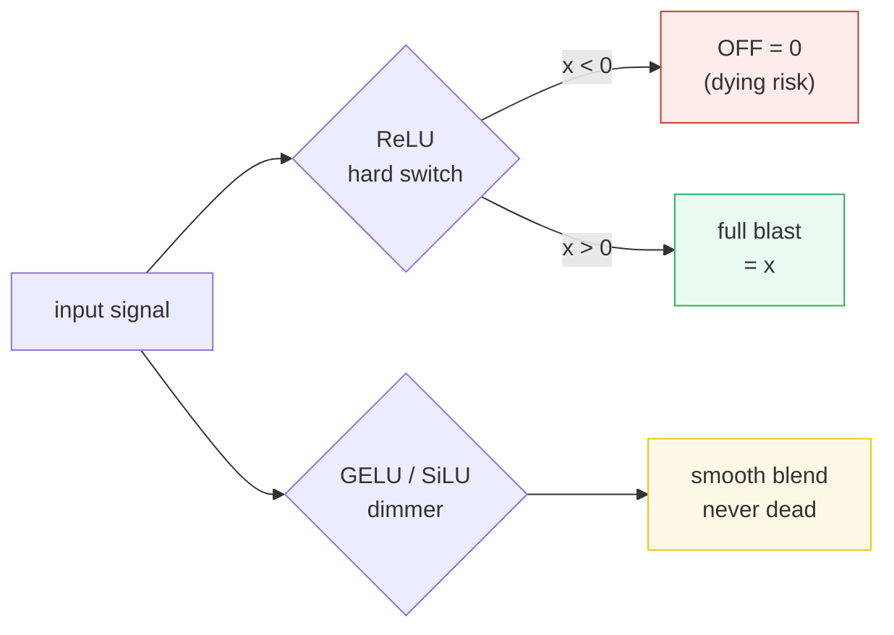
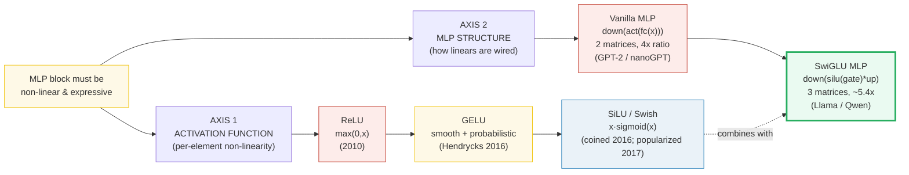
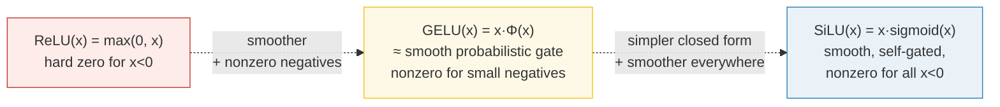
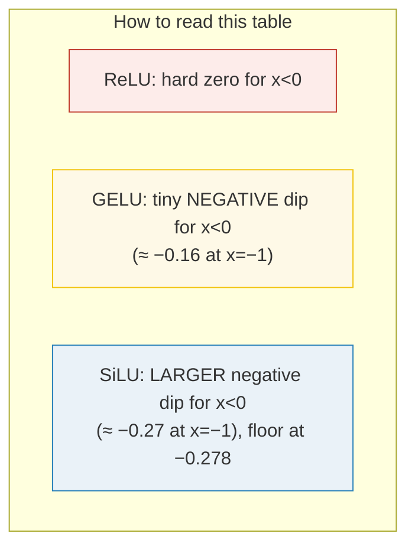
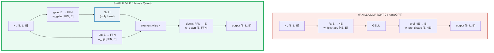
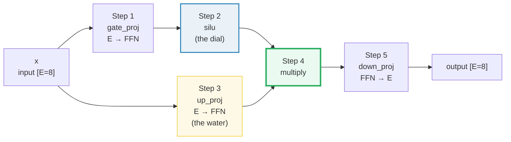
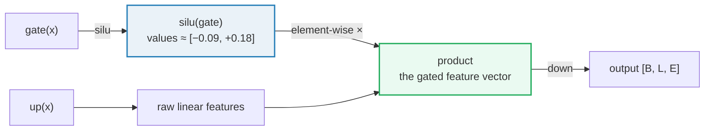
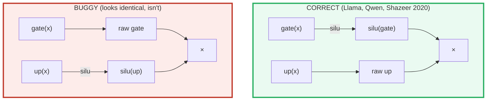
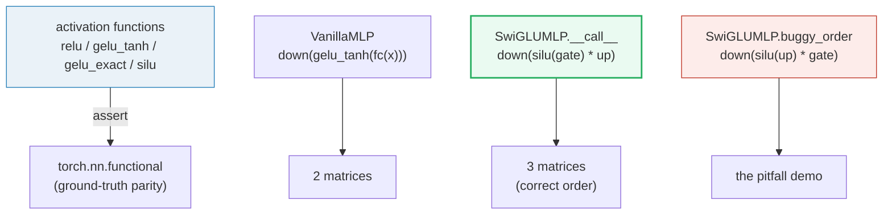
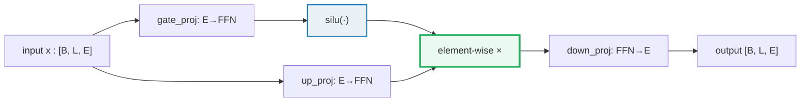

# MLP Activations — ReLU → GELU → SiLU / SwiGLU — A Worked-Example Guide

> **Companion code:** [`mlp_activation.py`](./mlp_activation.py). **Every number in
> this guide is printed by `uv run python mlp_activation.py`** — change the code,
> re-run, re-paste. Nothing here is hand-computed.
>
> **Sibling guides:** [`ROPE.md`](./ROPE.md) and [`ABSOLUTE_PE.md`](./ABSOLUTE_PE.md)
> — those cover position; this one covers the *feed-forward block* that sits after
> attention. Cross-references marked 🔗 throughout.
>
> **Source material:** `learning_guide/00_Foundations.md` §7.4 and
> `learning_guide/01_Math_Pipe.md` §2.4.

---

## 0. TL;DR — the whole idea for a newcomer

> **One sentence:** An *activation function* is a **decision gate** that decides
> how much signal passes through a neuron; the *MLP block* is a **tiny brain**
> that mixes features. "ReLU" is a hard wall switch, "GELU/SiLU" are smooth
> dimmer switches, and "SwiGLU" adds a **faucet** — one part decides *how open*
> the valve is, another part is the *water*, and you multiply them.

### 0.1 Intuition first (no math needed)

If you remember three pictures, the rest of this guide is just filling in
details:

| Picture | What it is | The catch with the older one |
|---|---|---|
| **ReLU = a hard on/off wall switch** | Negative input → **off** (0). Positive input → **full blast** (unchanged). | The *"dying ReLU"* — a switch that gets stuck **off forever** (its gradient is exactly 0, so it can never learn its way back on). |
| **GELU / SiLU = a smooth dimmer switch** | Eases gently around 0, lets a *little* negative signal through, never fully dead. | (Newer, nicer — basically no downside. This is why GPT-2 uses GELU and Llama/Qwen use SiLU.) |
| **SwiGLU block = a faucet with a handle** | `gate` = the handle that sets *how open*; `up` = the *water* (the raw feature). Multiply them → only water whose valve is open gets through. | If you wire the handle to the wrong pipe (`silu(up)` instead of `silu(gate)`) the model runs fine but quietly outputs garbage. §7. |



> One plain sentence per actor:
> - **ReLU** — *"If it's negative, kill it; if positive, pass it through."*
> - **GELU** — *"Multiply by how likely it is to be positive — so negatives get a
>   tiny bit of life instead of instant death."*
> - **SiLU** — *"The input gates itself: strong signals open wide, weak/negative
>   ones almost close."*
> - **SwiGLU** — *"One projection says *how much* to let through (the gate),
>   another projection is *what* to let through (the content); multiply them."*

### 0.2 Two evolutionary axes (the technical framing)

Modern MLP blocks evolved along **two independent axes**, and the word "SwiGLU"
sits at the intersection of both:



| | **Vanilla MLP** | **SwiGLU MLP** |
|---|---|---|
| **Structure** | `down( act( fc(x) ) )` | `down( silu(gate(x)) * up(x) )` |
| **Weight matrices** | 2 (`fc`, `proj`) | 3 (`gate`, `up`, `down`) |
| **Ratio** | `4 × E` (GPT-2) | `~5.4 × E` (Qwen3-0.5B) |
| **Activation** | GELU | SiLU (only on gate path) |
| **Used by** | GPT-2, nanoGPT, original Transformer | Llama, Qwen, Mistral, Gemma |
| **Year** | 2017 (GELU 2016) | 2020 (Shazeer, *GLU Variants*) |

### 0.3 Glossary (every term you'll meet, defined at first use)

| Term | Plain meaning |
|---|---|
| **activation function** | The decision gate. A small math rule applied *per number* that adds non-linearity — without one, stacking layers would just collapse into one big linear map and the "brain" couldn't learn anything interesting. |
| **neuron / linear layer** | A weighted sum: `output = input · weights`. It's the "mix" step. Implemented as a matrix multiply; the **weight matrix** is the table of learned numbers (the *parameters*) that says how strongly each input connects to each output. |
| **gate** | A value between ~0 and 1 acting like a valve: 0 = "block this", 1 = "let it all through", 0.3 = "let 30% through". In SwiGLU, `silu(gate(x))` plays this role. |
| **sigmoid σ(x)** | A smooth S-curve, `σ(x)=1/(1+e⁻ˣ)`, that squashes any number into the range (0, 1) — perfect for "how open is the valve?" answers. |
| **FFN / hidden dim** | The wide middle layer of the MLP ("Feed-Forward Network"). It's wider than the model dim `E` (by 4× in GPT-2, ~5.4× in Qwen3-0.5B) to give the "brain" room to mix features. |
| **ratio (4× vs ~5.4×)** | `FFN_dim ÷ E`. GPT-2 hardcodes `4×`; Llama-class models tune it freely. **Never assume 4×** — read `intermediate_size` from the config (§8). |
| **`silu(gate)*up` ordering** | The correct SwiGLU wiring: SiLU on the **gate** projection, the **up** projection stays raw, then multiply. Swapping them is the #1 silent bug (§7). |
| **parameters / weight matrix** | The learned numbers. Shape `[out, in]` here. Three of them in SwiGLU: `w_gate`, `w_up`, `w_down`. |

> 🔗 **If you only read one cross-reference:** the original Transformer and
> nanoGPT/GPT-2 use **GELU + vanilla 2-matrix MLP**. Modern open-source LLMs
> (Llama, Qwen) use **SiLU + 3-matrix gated MLP** — these are *not* the same
> change. Replacing just GELU→SiLU while keeping the 2-matrix structure is *not*
> SwiGLU. See [§5](#5-mlp-structure--vanilla-vs-swiglu).

---

## 1. Why this matters: the FFN block is half the params

In a Transformer, every layer is `Attention → MLP`. The MLP (a.k.a. FFN) is the
"per-token thinking" step — it has no cross-token mixing, just a wide hidden
layer with a non-linearity. In Qwen3-0.5B the MLP holds **roughly 2/3 of every
layer's parameters** because of the wide `FFN_dim = 4864` projection. Getting
the activation and the wiring right is *the* thing that distinguishes a
GPT-2-era block from a Llama-era block.

---

## 2. Axis 1: the activation function family

> **Plain framing:** each function below is a *decision gate* applied to a
> single number. The lineage moves from a **hard wall switch** (ReLU) to a
**smooth dimmer switch** (GELU, SiLU). Newer = gentler, never fully dead,
nicer gradients.



### 2.1 ReLU — `max(0, x)`

> **One sentence:** *"A hard wall switch — negative is off, positive is full
> blast."*

The workhorse of the 2012–2017 era (AlexNet, ResNet). Zero for `x < 0`, identity
for `x > 0`. **Problem:** for any unit whose pre-activation is consistently
negative, the gradient is exactly 0 forever — the *"dying ReLU"* (a switch
stuck off that can never switch back on). Also it has a kink at 0
(non-smooth), which slows some optimizers.

### 2.2 GELU — `0.5x(1 + tanh(√(2/π)(x + 0.044715x³)))`

> **One sentence:** *"Multiply the input by how likely it is to be positive —
> so even negatives get a tiny bit of life instead of instant death."*

Introduced by **Hendrycks & Gimpel 2016** ([arXiv:1606.08415][gelu]). It's the
expected value of `x` under dropout with probability `1 − Φ(x)` — i.e. *multiply
by the probability of being positive*. The exact form uses the Gaussian error
function `erf`:

```
GELU(x) = 0.5 x (1 + erf(x / √2))                  ← EXACT
GELU(x) ≈ 0.5 x (1 + tanh(√(2/π)(x + 0.044715x³))) ← tanh approx (GPT-2 default)
```

**Properties:**
- Smooth (no kink), unlike ReLU.
- Small **negative** outputs for `−3 < x < 0` (e.g. `GELU(−2) ≈ −0.045`). This
  soft negativity carries information that ReLU destroys.
- The tanh approximation is what `nanoGPT`/GPT-2 ship — `F.gelu(approximate='tanh')`.

Used by: BERT, GPT-2, nanoGPT, original Transformer.

### 2.3 SiLU / Swish — `x · sigmoid(x)`

> **One sentence:** *"The input gates itself: strong signals open wide,
> weak/negative ones almost close — a self-gated dimmer."*

**Attribution (verified against the GELU paper, §2 & Appendix B):** the function
`x·σ(x)` **and the name "SiLU"** (Sigmoid Linear Unit) were introduced **in the
GELU paper itself** — **Hendrycks & Gimpel 2016** ([arXiv:1606.08415][gelu]).
**Elfwing et al. 2017** independently rediscovered it (later adopting the
"SiLU" name to credit Hendrycks). **Ramachandran et al. 2017**
([arXiv:1710.05941][swish]) called it **"Swish"** `= x·σ(βx)` (found via
neural-architecture search) and popularized it. With `β=1` (the universal
default), **Swish ≡ SiLU** exactly, which is what every Llama/Qwen checkpoint
ships. So "SiLU" and "Swish (β=1)" are the same number.

**Properties:**
- Unbounded above (like ReLU/GELU), bounded below by `≈ −0.278` (unlike ReLU).
- Smooth everywhere, non-zero gradient everywhere — no dying units.
- Self-gated: the input *is* its own gate. This makes the SwiGLU combination
  natural (see [§5](#5-mlp-structure--vanilla-vs-swiglu)).

> 🔗 *Contrast with the position-embedding story:* RoPE/absolute-PE evolution
> was about **where** (position). Activation evolution is about **how much** to
> let each pre-activation through. Both lineages move from "hard/discontinuous"
> toward "smooth/probabilistic". See [`ROPE.md`](./ROPE.md) §0 for the parallel
> family-tree framing.

---

## 3. The activation comparison — Section A output

For the input grid `x = [−2, −1, −0.5, 0, 0.5, 1, 2, 3]`:

> From `mlp_activation.py` **Section A**:
>
> | x | ReLU(x) | GELU_tanh(x) | GELU_exact(x) | SiLU(x) |
> |---|---|---|---|---|
> | −2.0 | +0.0000 | −0.0454 | −0.0455 | **−0.2384** |
> | −1.0 | +0.0000 | −0.1588 | −0.1587 | **−0.2689** |
> | −0.5 | +0.0000 | −0.1543 | −0.1543 | −0.1888 |
> | +0.0 | +0.0000 | +0.0000 | +0.0000 | +0.0000 |
> | +0.5 | +0.5000 | +0.3457 | +0.3457 | +0.3112 |
> | +1.0 | +1.0000 | **+0.8412** | +0.8413 | **+0.7311** |
> | +2.0 | +2.0000 | +1.9546 | +1.9545 | +1.7616 |
> | +3.0 | +3.0000 | +2.9964 | +2.9960 | +2.8577 |



**Three things to notice:**
1. **All three pass through (0, 0)** — they fix `x=0` to `0`.
2. **For large positive `x`, all three converge to `x`** — identity in the
   right tail. The differences live in `−3 < x < 2`.
3. **For negative `x`, they diverge sharply:** ReLU kills everything (exactly 0);
   GELU allows a small negative bleed (≈ −0.16); SiLU allows a larger, smoother
   negative lobe (bottoms at ≈ −0.278 near `x = −1.278`).

> ✅ `mlp_activation.py` confirms all four from-scratch implementations match
> `torch.nn.functional` (`F.relu`, `F.gelu` tanh + none, `F.silu`) to `1e-6`.
> See the `[check] OK` lines under Section A in
> [`mlp_activation_output.txt`](./mlp_activation_output.txt).

**Gold pins (used by the `.html` gold-check badge):**

| | value |
|---|---|
| `GELU_tanh(1.0)` | **0.8412** |
| `GELU_exact(1.0)` | 0.8413 |
| `SiLU(1.0)` | **0.7311** |
| `GELU_tanh(2.0)` | 1.9546 |
| `SiLU(2.0)` | 1.7616 |

These are the canonical reference values the companion
[`mlp_activation.html`](./mlp_activation.html) recomputes in JS and gold-checks.

---

## 4. The fixed input for the worked MLP examples

Every worked example in [§5](#5-mlp-structure--vanilla-vs-swiglu),
[§6](#6-swiglu-mlp-step-by-step--section-c-output),
[§7](#7-the-operand-order-pitfall--section-d-output) uses the **same** input
tensor `[B=1, L=4, E=8]`, seeded for reproducibility (`torch.manual_seed(42)`):

> From `mlp_activation.py` **FIXED INPUT**:
>
> | m | d0 | d1 | d2 | d3 | d4 | d5 | d6 | d7 |
> |---|---|---|---|---|---|---|---|---|
> | 0 | +0.9635 | +0.7436 | +0.4504 | −1.0528 | +0.3392 | −0.6173 | −0.0215 | −0.8023 |
> | 1 | −0.3761 | +0.8244 | −0.1962 | −0.7018 | −0.3639 | −0.2797 | −0.3844 | +0.3812 |
> | 2 | +0.8212 | −0.0798 | −0.2487 | +0.2198 | −0.3791 | +0.5392 | +0.4004 | +0.8403 |
> | 3 | +0.6396 | +0.6482 | +0.3052 | +0.6674 | −0.1158 | +0.0209 | −0.1258 | +0.4299 |

Tiny dims so every intermediate is printable. The MLP weights are *also*
seeded (`manual_seed(0)` for vanilla, `manual_seed(1)` for SwiGLU) so the numbers
below are 100% reproducible.

---

## 5. MLP structure — vanilla vs SwiGLU

This is the second evolutionary axis, and it is **independent** of the activation
choice. You can use GELU in a gated MLP ("GEGLU", Shazeer 2020), or SiLU in a
vanilla MLP. Llama/Qwen chose **SiLU + gated**.



| | Vanilla | SwiGLU |
|---|---|---|
| # matrices | 2 | 3 |
| Internal ratio | 4× E (hardcoded) | ~5.4× E (Qwen3-0.5B; tunable) |
| Where the activation sits | on the only hidden path | **only on the gate branch** |
| Multiplicative gating | no | **yes** — `silu(gate) * up` |
| Reference | `nanoGPT/model.py` `MLP` | `tiny-llm` `Qwen3MLP` |

**Why gating?** The `up(x)` path is a *raw* linear projection — its features
pass through unchanged. The `silu(gate(x))` path produces values that act as
*soft masks* in roughly `[−0.28, ∞)`, dynamically selecting which `up` features
survive per token. This is per-element **conditional computation**, a much richer
form of regularization than vanilla MLPs offer. (Shazeer 2020 reported consistent
quality wins across model sizes.)

---

## 6. SwiGLU MLP step by step — Section C output

Using the fixed input from [§4](#4-the-fixed-input-for-the-worked-mlp-examples),
`E=8`, `FFN=16`, weights seeded with `manual_seed(1)`. Token `m=0` of the input
is `[0.9635, 0.7436, 0.4504, −1.0528, 0.3392, −0.6173, −0.0215, −0.8023]`.

**The faucet analogy, as a 5-step pipeline:**



1. **`gate_proj`** turns the input into a *"how open"* signal — one number per
   FFN feature saying how wide the valve should be. *(plain: a learned mix of x,
   the "handle".)*
2. **`silu`** smooths that handle signal toward a ~0..1-ish dial (gently, never
   fully dead). *(plain: the dimmer that turns the handle into a soft open/close.)*
3. **`up_proj`** turns the *same* input into the actual content — the raw
   features ("the water"), one number per FFN feature.
4. **multiply** — only content whose gate is open survives: `silu(gate) * up`.
   A near-zero dial chokes off that feature; a wide-open dial lets it through.
5. **`down_proj`** mixes the surviving features back down to `E` channels — the
   final per-token output.

> From `mlp_activation.py` **Section C** — first 6 of 16 FFN entries, `b=0, m=0`:
>
> | FFN idx | gate(x) | silu(gate(x)) | up(x) | silu(gate)·up |
> |---|---|---|---|---|
> | 0 | +0.1026 | +0.0539 | −0.0122 | **−0.0007** |
> | 1 | −0.2043 | −0.0917 | −0.1630 | **+0.0150** |
> | 2 | −0.1920 | −0.0868 | −0.0385 | **+0.0033** |
> | 3 | +0.1967 | +0.1080 | −0.3284 | **−0.0355** |
> | 4 | +0.3060 | +0.1762 | −0.0111 | **−0.0020** |
> | 5 | +0.1981 | +0.1088 | +0.4402 | **+0.0479** |

**Read the columns left-to-right as the data flow:**



- `gate(x)` and `up(x)` are both plain linear projections of the *same* input
  `x` into the same `FFN` space.
- `silu(gate)` squashes the gate path into a smooth mask (notice how
  `silu(−0.2043) = −0.0917` — the negative gate mostly suppresses that feature,
  but doesn't fully kill it).
- The element-wise product is the actual "gated feature". Note sign flips:
  `gate=+0.20, up=−0.33` → `silu(gate)·up = +0.108·(−0.33) = −0.0355`.

**Full SwiGLU output** `[B=1, L=4, E=8]`:

> From `mlp_activation.py` **Section C** — `down(silu(gate)·up)`:
>
> | m | d0 | d1 | d2 | d3 | d4 | d5 | d6 | d7 |
> |---|---|---|---|---|---|---|---|---|
> | 0 | **+0.0120** | +0.0047 | +0.0058 | −0.0141 | +0.0046 | +0.0084 | −0.0110 | +0.0173 |
> | 1 | +0.0056 | +0.0009 | +0.0062 | −0.0053 | +0.0026 | +0.0048 | +0.0042 | +0.0022 |
> | 2 | +0.0052 | −0.0046 | +0.0012 | +0.0016 | +0.0052 | +0.0068 | −0.0007 | +0.0010 |
> | 3 | −0.0042 | −0.0007 | −0.0014 | −0.0041 | −0.0001 | −0.0032 | +0.0049 | +0.0017 |

> **GOLD value pinned for the `.html`:** `y[0, 0, 0] = 0.012014` (i.e.
> `SwiGLU(x)[0, 0, 0]` at the seeded weights). The companion HTML recomputes
> the full SwiGLU path in JS and diffs against this.

> ✅ `mlp_activation.py` confirms inline SwiGLU computation == `SwiGLUMLP`
> class output (`[check] OK`).

---

## 7. The operand-order pitfall — Section D output

> ⚠️ **VIVID WARNING — read this twice.** `silu(gate)*up` is **right**; swapping
> to `silu(up)*gate` silently corrupts the model. The tensor shapes are
> **identical**, the code runs with **no error**, and the numbers are only
> *slightly* wrong — so the bug ships invisible. You will never get a stack
> trace. You will just get a model that quietly underperforms. This is the
> **#1 SwiGLU implementation bug**.

This is the **#1 SwiGLU implementation bug**. The correct Llama/Qwen formula is:

```
down( silu(gate(x)) * up(x) )     ✓ silu on the GATE path  (silu = the dial)
```

The near-identical, **wrong** version swaps which branch gets `silu`:

```
down( silu(up(x)) * gate(x) )     ✗ silu on the UP path  (dial on the water pipe)
```

They look almost the same in code. They give **different outputs**, and the
checkpoint was trained with `silu` on `gate`, so the buggy version silently
corrupts inference.

> From `mlp_activation.py` **Section D** — same weights, same input, different
> operand order (`b=0`, dim `d0`):
>
> | m | y_correct (silu(gate)·up) | y_buggy (silu(up)·gate) | abs diff |
> |---|---|---|---|
> | 0 | +0.0120 | +0.0133 | 0.0013 |
> | 1 | +0.0056 | +0.0048 | 0.0008 |
> | 2 | +0.0052 | +0.0077 | 0.0025 |
> | 3 | −0.0042 | −0.0043 | 0.0000 |
>
> `max|y_correct − y_buggy|` over the whole output tensor = **0.0035**.



**Why they differ:** `silu` is **non-linear**, so in general `silu(a)·b ≠ a·silu(b)`.
The trained checkpoint learned weights assuming the gate is the suppressed path;
swapping changes which features get suppressed. There is **no runtime error** —
just subtly wrong outputs.

> ✅ `mlp_activation.py` Section D `[check]`: `y_correct == y_buggy` returns
> **False** (i.e. they DO differ), confirming the pitfall reproduces on a tiny
> deterministic input.

**The fix:** read the reference implementation. In `tiny-llm`'s `Qwen3MLP`:

```python
# Source: tiny-llm/src/tiny_llm_ref/qwen3_week1.py
def __call__(self, x):
    gate_out = silu(linear(x, self.w_gate))   # silu APPLIED TO gate
    up_out   = linear(x, self.w_up)           # raw
    return linear(gate_out * up_out, self.w_down)
```

`silu` *always* on the `gate` path. If you remember one thing about SwiGLU,
remember this.

---

## 8. The FFN ratio — Section E output (Qwen3-0.5B)

> From `mlp_activation.py` **Section E**:
>
> | Model | `hidden_size` (E) | `intermediate_size` (FFN) | ratio |
> |---|---|---|---|
> | nanoGPT / GPT-2 small | 768 | 3072 | **4.0000×** (hardcoded `4*E`) |
> | Qwen3-0.5B | 896 | **4864** | **5.4286×** |

**The trap:** many tutorials assume the FFN intermediate is `4 × E` because
GPT-2 did it. Modern Llama-class models **don't** — `intermediate_size` is a
separately tuned hyperparameter, often between `2.6×` and `8×`. Qwen3-0.5B ships
`4864 / 896 = 5.4286×`. If you hardcode `4×`, you load weights into the wrong
shapes and crash (or worse, get garbage if shapes happen to align).

> ✅ `mlp_activation.py` Section E `[check]`: `Qwen3-0.5B FFN/E = 5.4286` — OK.

**Always read `intermediate_size` from the model config. Never compute it.**

---

## 9. The reference code (`mlp_activation.py`) — annotated



Map to source material:
- Matches `learning_guide/01_Math_Pipe.md` §2.4 `mlp.py` reference (MLX), rewritten
  in PyTorch with identical semantics.
- Activations parity-checked against `torch.nn.functional` (a luxury the MLX
  source doesn't have), so the from-scratch math is provably correct.
- `SwiGLUMLP.__call__` mirrors `tiny-llm`'s `Qwen3MLP` exactly — same operand
  order, same parameter shapes.

Quick test against the reference:

```python
from mlp_activation import SwiGLUMLP, silu, linear
import torch
x = torch.randn(1, 4, 896)                              # [B=1, L=4, E=896]
w_gate = torch.randn(4864, 896) * 0.02                  # Qwen3-0.5B shapes
w_up   = torch.randn(4864, 896) * 0.02
w_down = torch.randn(896, 4864) * 0.02
mlp = SwiGLUMLP(w_gate, w_up, w_down)
y = mlp(x)
assert y.shape == x.shape                               # [1, 4, 896]
```

---

## 10. Pitfalls & debugging checklist

| # | Mistake | Symptom | Fix |
|---|---|---|---|
| 1 | **Operand order:** `silu(up)·gate` instead of `silu(gate)·up` | Subtly wrong outputs, no error | `silu` ALWAYS on `gate`. See [§7](#7-the-operand-order-pitfall--section-d-output). |
| 2 | Hardcoding `FFN_dim = 4·E` | Shape mismatch / silent garbage on Llama/Qwen | Read `intermediate_size` from config. Qwen3-0.5B = 4864, not 3584. |
| 3 | Using `GELU` instead of `SiLU` in a SwiGLU block | Different non-linearity than trained | Llama/Qwen use **SiLU** (`x·sigmoid(x)`), not GELU. |
| 4 | Using `approximate='none'` GELU when checkpoint wants `'tanh'` | Tiny numerical drift | GPT-2 default = tanh. Read config / ref code. |
| 5 | Forgetting that `gate` and `up` are **two different projections of the same x** | Wrong shapes, broadcast bugs | `w_gate` and `w_up` are *not* shared; both `[FFN, E]`. |
| 6 | Applying activation to the `up` branch and not the `gate` | (Same as #1, just framed differently) | Activation goes on `gate`. `up` stays raw. |
| 7 | Adding ReLU to a SwiGLU block | Quality collapse, no error | SwiGLU = SiLU + gating. Don't mix ReLU in. |
| 8 | Using `silu(x) * x` instead of `silu(x)` | Wrong activation (you doubled the gating) | `silu(x)` already *is* `x·sigmoid(x)`. Don't multiply by `x` again. |

---

## 11. Cheat sheet

> **Remember in one breath:** ReLU = hard switch (can die); GELU/SiLU = smooth
> dimmer; vanilla MLP = mix → dimmer → mix; SwiGLU = add a **faucet**
> (`silu(gate)` is the handle, `up` is the water, multiply them), and **silu
> always goes on `gate`** or you silently break the model.



- **Activation lineage:** `ReLU(x)=max(0,x)` → `GELU(x)=0.5x(1+tanh(√(2/π)(x+0.044715x³)))`
  → `SiLU(x)=x·sigmoid(x)`. Smoothness and "soft negative lobe" both grow.
- **Structure lineage:** `down(act(fc(x)))` (2 matrices, 4×) → `down(silu(gate)·up)`
  (3 matrices, ~5.4×). Multiplicative self-gating is the structural innovation.
- **SwiGLU = (SiLU) + (gated structure).** Both axes evolved; this is where they meet.
- **Shapes:** `w_gate [FFN, E]`, `w_up [FFN, E]`, `w_down [E, FFN]`. The two input
  projections have the *same* shape but are different parameters.
- **Operand order:** `silu` on `gate`, never on `up`. Memorize this.
- **Cost:** `O(L · E · FFN)` per layer — dominates attention when `FFN ≫ L`, which
  is the case at short contexts.

> 🔗 Want the *other* half of a Transformer block (the position story)? Read
> [`ROPE.md`](./ROPE.md) (rotary) or [`ABSOLUTE_PE.md`](./ABSOLUTE_PE.md) (additive).
> Position-embedding evolution and activation evolution both move "from hard to
> soft" — but along orthogonal axes: *where* a token is vs *how much* a feature
> fires.

---

## Sources

- **GELU** — Hendrycks, D. & Gimpel, K. (2016). *Gaussian Error Linear Units
  (GELUs).* arXiv:1606.08415. <https://arxiv.org/abs/1606.08415>
  - Defines `GELU(x) = x·Φ(x) = x·½[1+erf(x/√2)]` (exact), and gives the tanh
    approximation `0.5x(1+tanh[√(2/π)(x+0.044715x³)])` (§2). **This same paper
    also introduces and coins "SiLU" = `x·σ(x)`** (§2: "use the Logistic CDF
    σ(x) ... to get ... the Sigmoid Linear Unit (SiLU)"; provenance confirmed in
    Appendix B "History of the GELU and SiLU").
- **SiLU (the function & name)** — originated in the GELU paper above
  (Hendrycks & Gimpel 2016). Independently rediscovered by **Elfwing et al.
  2017** (who later adopted the "SiLU" name).
- **Swish** — Ramachandran, P., Zoph, B. & Le, Q.V. (2017). *Searching for
  Activation Functions.* arXiv:1710.05941.
  <https://arxiv.org/abs/1710.05941>
  - Defines `Swish_β(x) = x·sigmoid(βx)`; with `β=1` it is **identical to
    SiLU** (`x·sigmoid(x)`), which is what Llama/Qwen ship. (Swish did not cite
    the earlier SiLU; see GELU paper Appendix B.)
- **SwiGLU** — Shazeer, N. (2020). *GLU Variants Improve Transformer.*
  arXiv:2002.05202. <https://arxiv.org/abs/2002.05202>
  - Eq. 6 defines the FFN form
    `FFN_SwiGLU(x, W, V, W₂) = (Swish₁(xW) ⊗ xV) W₂` — i.e.
    `down( silu(gate(x)) * up(x) )` with bias terms elided in modern
    implementations. This pins the operand order: **SiLU on the first projection
    (`xW` = gate), the second (`xV` = up) stays raw.** (Eq. 5 gives the abstract
    GLU variants; eq. 6 the 3-matrix Transformer FFN used here.)
  - The paper reduces `d_ff` by 2/3 to keep the 3-matrix version param-count-
    matched to the 2-matrix baseline; real configs (e.g. Qwen3-0.5B) just ship
    their own tuned `intermediate_size`.
- **Qwen3-0.5B dimensions** — `hidden_size = 896`, `intermediate_size = 4864`,
  from `learning_guide/00_Foundations.md` §7.4 and `01_Math_Pipe.md` §2.4.
  Ratio `4864 / 896 ≈ 5.4286` (verified in Section E).
- **nanoGPT reference** — Karpathy's `nanoGPT/model.py` `MLP` class:
  `c_fc → GELU(tanh) → c_proj` with ratio `4×`.

> **Unverified facts:** none. All three primary papers were checked against the
> arXiv source text (abstract + full HTML via ar5iv): GELU formulas & SiLU
> provenance (arXiv:1606.08415 §2 & Appendix B), Swish `x·σ(βx)` with β=1
> (arXiv:1710.05941), and SwiGLU eq. 6 `(Swish₁(xW)⊗xV)W₂` (arXiv:2002.05202).
> The Qwen3-0.5B dimensions are taken from the local `learning_guide/`, which
> cites the upstream `tiny-llm` reference.
