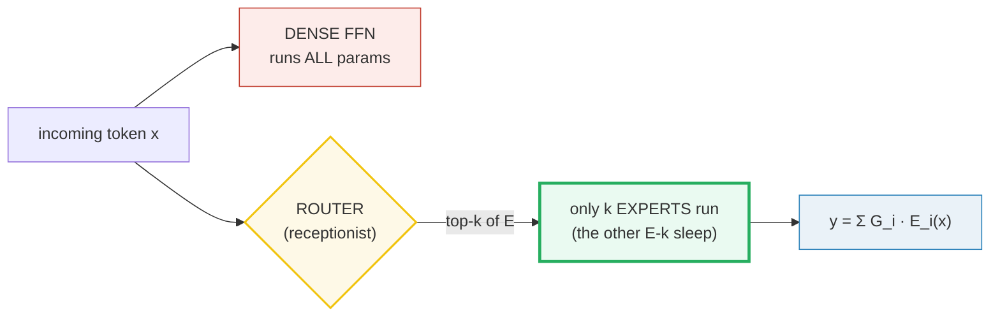
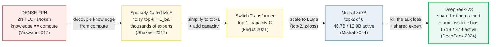
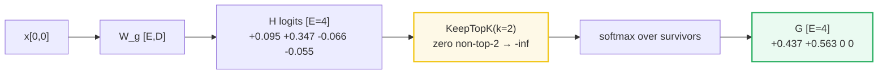
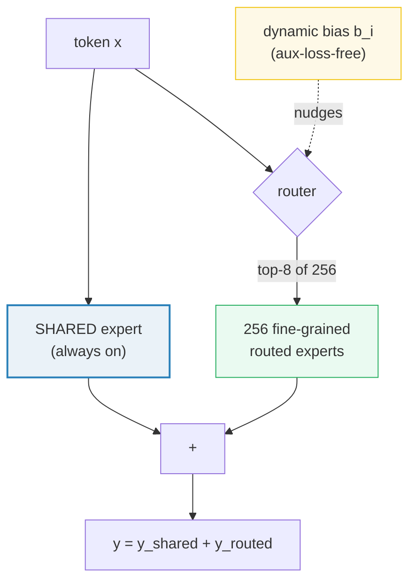
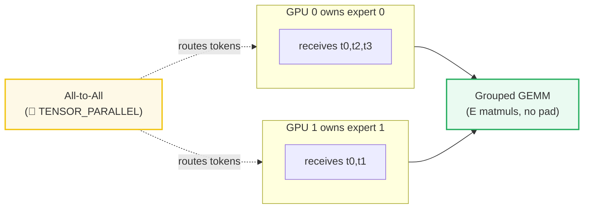
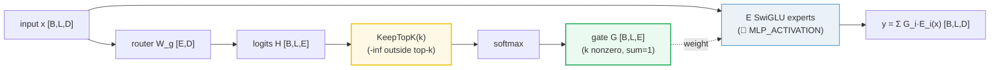

# Mixture-of-Experts (MoE) Routing — top-k gating → DeepSeek-V3 — A Worked-Example Guide

> **Companion code:** [`moe_routing.py`](./moe_routing.py). **Every number in
> this guide is printed by `uv run python moe_routing.py`** — change the code,
> re-run, re-paste. Nothing here is hand-computed.
>
> **Sibling guides:** [`MLP_ACTIVATION.md`](./MLP_ACTIVATION.md) (the *dense*
> SwiGLU block this guide replaces — the contrast), [`GQA.md`](./GQA.md)
> (another "share the work" trick, but for attention), [`TENSOR_PARALLEL.md`](./TENSOR_PARALLEL.md)
> (the All-to-All collective expert parallelism relies on), and [`SAMPLING.md`](./SAMPLING.md)
> (the softmax / top-k mechanics the router reuses). Cross-references marked 🔗 throughout.
>
> **Live animation:** [`moe_routing.html`](./moe_routing.html) — open in a browser.
>
> **Source material:** `learning_guide/05_Next_Gen_Architecture.md` §2 and
> `tiny-llm/src/tiny_llm_ref/moe.py`.

---

## 0. TL;DR — the whole idea for a newcomer

> **One sentence:** A *dense* FFN activates **all** its parameters for every
> token, so scaling knowledge means scaling compute; a **Mixture of Experts**
> replaces the FFN with a **router** + **E expert MLPs** and routes each token
> to only **top-k** (k≪E), so total knowledge (≈E·N_expert) is decoupled from
> per-token compute (≈k·N_expert) — a 47B-capacity model that runs at 13B speed.

### 0.1 Intuition first — the consulting firm (no math needed)

Picture a consulting firm. Three designs, one dial — **how many specialists a
document reaches**:

| Picture | What it is | The catch |
|---|---|---|
| **Dense FFN = one overworked senior consultant** | Reads *every* document end-to-end, activating *all* its knowledge each time (`2N` FLOPs/token). | To know more you must hire *smarter* (slower) consultants — knowledge capacity and per-token compute are **locked together**. |
| **MoE = a receptionist (router) + a wall of E specialists (experts)** | The receptionist scans each document and hands it to only the **top-k** most relevant specialists. | Without a push, the receptionist gets lazy and sends everything to 1–2 favorites — **router collapse**. Fixed by load-balancing losses (§5). |
| **DeepSeek-V3 = the receptionist + an always-on generalist (shared expert) + 256 thin specialists** | A generalist handles the common stuff; routed specialists handle the rare stuff; an **aux-loss-free bias** keeps the 256 evenly loaded. | More moving parts (fine-grained experts, bias updates), but no gradient interference into the main loss. |



> One plain sentence per actor:
> - **Router** — *"Score every specialist; keep only the top-k scores; hand the
>   document to those k."*
> - **Expert (E_i)** — *"A full SwiGLU MLP specialist (🔗 MLP_ACTIVATION §6);
>   only the chosen k actually run."*
> - **Gate weight (G_i)** — *"The share of the final answer each chosen
>   specialist contributes (the renormalized top-k softmax — sums to 1)."*
> - **Load-balance loss (L_bal)** — *"A penalty that stops the receptionist from
>   collapsing onto 1–2 favorites; minimum = k when load is even."*
> - **Capacity (C)** — *"A hard queue limit per specialist when experts live on
>   different GPUs; overflow tokens are dropped (§6)."*

### 0.2 The lineage (old → new, with WHY)



| | **Dense FFN** | **Sparsely-Gated MoE** | **Switch** | **Mixtral** | **DeepSeek-V3** |
|---|---|---|---|---|---|
| experts active/token | all | top-k (k>1) | **top-1** | **top-2** of 8 | top-8 of 256 |
| total / active | tied | E/k× sparser | E× sparser | **46.7B / 12.9B** | **671B / 37B** |
| load balancing | n/a | noisy gating + `L_bal` | `L_bal` + capacity | `L_bal` + **z-loss** | **aux-loss-free bias** |
| shared expert | no | no | no | no | **yes (1 always-on)** |
| Year | 2017 | 2017 | 2021 | 2024 | 2024 |

### 0.3 Glossary (every term you'll meet, defined at first use)

| Term | Plain meaning |
|---|---|
| **dense FFN** | The senior consultant — one SwiGLU MLP that activates ALL its params for every token (🔗 `MLP_ACTIVATION`). Scaling knowledge = scaling `2N` FLOPs/token. |
| **expert (E_i)** | One specialist — an independent SwiGLU MLP. `E` = how many are on the wall. |
| **router / gate** | The receptionist — a single linear layer `W_g` (shape `[E, D]`) that scores each expert for the current token. |
| **H(x)** | Router **logits** = `x · W_gᵀ`, shape `[E]` — one raw score per expert. |
| **top-k (k)** | How many specialists each token reaches (`k ≪ E`). Mixtral `k=2`, Switch `k=1`, DeepSeek-V3 `k=8`. |
| **KeepTopK** | The sparsifying step: set every score to `-∞` except the top-k, *before* the softmax, so discarded experts contribute exactly 0. |
| **G(x)** | Gate **weights** = `softmax(KeepTopK(H(x)))`. Only k are nonzero; they **renormalize to sum=1** (the Mixtral convention). |
| **y** | MoE output = `Σ_{i active} G(x)_i · E_i(x)`. Inactive experts **never run**. |
| **active params** | Params actually touched per token ≈ `N_attn + k·N_expert`. |
| **total params** | Params stored on the wall ≈ `N_attn + E·N_expert`. |
| **router collapse** | The failure mode: the router sends everything to 1–2 favorites; the rest never train. Prevented by `L_bal` (+ `L_z`). |
| **capacity (C)** | A hard per-expert queue limit in expert-parallel training: `C = capacity_factor · N·k/E`. Overflow → **dropped** (§6). |
| **shared expert** | A DeepSeek-V3 specialist that is **always on** (not routed), capturing common features so routed experts can specialize. |
| **fine-grained** | DeepSeek-V3 trick: split one fat expert into `M` thin ones so top-k can mix more specialized knowledge per token at the same param budget. |
| **aux-loss-free** | DeepSeek-V3 trick: instead of a gradient-pushing `L_bal`, add a learnable bias `b_i` to the logits and nudge it by real load — **zero gradient interference**. |
| **z-loss** | `L_z = (1/N)Σ(log Σ e^{H_i})²` — penalizes large router logits, stabilizing training. |
| **grouped GEMM** | A kernel (CUTLASS/Triton) that runs all E independent `(M_i × N × K)` expert matmuls in one shot, without padding the ragged buffers (§8). |

> 🔗 **If you only read one cross-reference:** the expert in an MoE layer **is
> literally** the SwiGLU block from [`MLP_ACTIVATION.md`](./MLP_ACTIVATION.md) §6
> — `down(silu(gate)·up)`. The ONLY new idea here is *which* expert(s) run per
> token, not what an expert *is*. The router is just a tiny linear layer +
> softmax; the softmax / top-k mechanics are exactly [`SAMPLING.md`](./SAMPLING.md)
> reused on a different vector.

---

## 1. Why this matters: the FFN is where the parameters live

In a Transformer, every layer is `Attention → FFN`. The FFN is the wide
"per-token thinking" step, and because it is wide it holds the **majority of a
layer's parameters**. A dense model scales knowledge by making this FFN bigger
— but every extra parameter costs `2N` FLOPs **per token**, forever.

MoE breaks that lock: keep `E` independent FFN-experts, run only `k` per token.
**Total knowledge scales with `E`; per-token compute scales with `k`.** That is
the single sentence that justifies the entire architecture. Mixtral 8x7B ships
46.7B parameters of knowledge but each token computes only 12.9B of them; you
get the quality of a 47B dense model at (roughly) the latency of a 13B one.

---

## 2. Dense FFN vs sparse MoE — Section A output

The param/FLOPs decoupling on our tiny model (`D=8`, expert intermediate `F=16`,
`E=4`, `k=2`), counting **only the FFN/MoE** (attention excluded). A dense
SwiGLU FFN has 3 weight matrices `gate, up, down` (🔗 `MLP_ACTIVATION` §5), so
one expert costs `3·D·F` parameters.

> From `moe_routing.py` **Section A**:
>
> | design | params stored | params active/token | FLOPs/token |
> |---|---|---|---|
> | dense SwiGLU FFN | 384 | 384 | 768 |
> | MoE E=4 k=2 (total) | 1536 | 768 | 1536 |
>
> `[check] total/active ratio = E/k = 4/2 = 2.0x → 1536/768 = 2.0x : OK`

The MoE stores **4×** the knowledge (1536 vs 384 params) but only **2×** the
work runs per token. On a real model this ratio is far more dramatic:

> From `moe_routing.py` **Section A** (real models):
>
> | model | total params | active/token | k of E |
> |---|---|---|---|
> | **Mixtral 8x7B** | **46.7B** | **12.9B** | 2 of 8 |
> | **DeepSeek-V3** | **671B** | **37B** | 8 of 256 |

> 🔗 The dense SwiGLU FFN being replaced is exactly the block in
> [`MLP_ACTIVATION.md`](./MLP_ACTIVATION.md) §6. An MoE layer = "E copies of
> that block + a router"; only `k` copies fire per token.

---

## 3. Top-k routing math — Section B output (KeepTopK + softmax)

Given the input hidden state `x ∈ ℝᴰ`, the router is one linear layer producing
`E` logits, then **KeepTopK + softmax** produce the sparse, renormalized gate
weights:

```
H(x) = x · W_gᵀ                         # logits, shape [E]   (W_g ∈ [E, D])
KeepTopK(v, k)_i = v_i  if v_i in top-k,  else  -∞
G(x)  = softmax(KeepTopK(H(x), k))       # gate weights, shape [E]  (only k nonzero, sum=1)
```

The `-∞` mask is the whole trick: after softmax, the discarded experts are
**exactly 0** and the `k` survivors **renormalize to sum 1**. (This matches the
Mixtral / `tiny-llm` `norm_topk_prob=True` convention.)

> From `moe_routing.py` **Section B** — token `m=0` walked by hand:
>
> ```
> x[0,0]         = [+0.9635, +0.7436, +0.4504, -1.0528, +0.3392, -0.6173, -0.0215, -0.8023]
> H[0,0] logits  = [+0.0952, +0.3465, -0.0658, -0.0547]   (one score per expert)
> top-2 values = [+0.3465, +0.0952]
> top-2 experts= [1, 0]          <- the chosen specialists
> KeepTopK[0,0]  = [+0.0952, +0.3465, -inf, -inf]
> G[0,0] weights = [+0.4375, +0.5625, +0.0000, +0.0000]   (only top-2 nonzero, sum=1.0000)
> ```

Read it left-to-right: the router scores all 4 experts (`H`), the top-2 are
`[1, 0]`, KeepTopK zeroes experts 2 and 3 to `-∞`, and the softmax over the two
survivors gives `G = [0.4375, 0.5625, 0, 0]` — experts 0 and 1 will run,
weighted 0.4375 and 0.5625.

> From `moe_routing.py` **Section B** — all 4 tokens' router decisions:
>
> | m | H[0,m] (4 logits) | top-k experts | G[0,m] (4 gate weights) |
> |---|---|---|---|
> | 0 | +0.095 +0.347 -0.066 -0.055 | 1,0 | +0.437 +0.563 +0.000 +0.000 |
> | 1 | +0.141 +0.232 +0.376 +0.061 | 2,1 | +0.000 +0.464 +0.536 +0.000 |
> | 2 | +0.011 -0.042 -0.371 +0.222 | 3,0 | +0.447 +0.000 +0.000 +0.553 |
> | 3 | +0.130 +0.052 -0.142 +0.132 | 3,0 | +0.500 +0.000 +0.000 +0.500 |



> ✅ `moe_routing.py` Section B `[check]`: every token has `sum(G) == 1` (max dev
> `0.0e+00`) and **exactly** k=2 nonzero gate weights — OK. The softmax / top-k
> machinery is the same one in [`SAMPLING.md`](./SAMPLING.md), reused on the
> router-logit vector.

> 🔗 **GOLD pin for the `.html` (token m=0):** selected experts = `[1, 0]`,
> gate weights = `[0.437497, 0.562503, 0, 0]`. The companion HTML recomputes
> this and gold-checks it.

---

## 4. Expert combination — Section C output (y = Σ G_i · E_i(x))

Each expert is a **full SwiGLU MLP** (🔗 `MLP_ACTIVATION` §6 — SiLU on `gate`,
never on `up`). The MoE output is the gate-weighted sum of **only the k active
experts'** outputs:

```
y = Σ_{i ∈ active} G(x)_i · E_i(x),    E_i(x) = down( silu(gate_i(x)) · up_i(x) )
```

The other `E − k` experts **never run** — that's where the FLOPs savings come
from.

> From `moe_routing.py` **Section C** — token `m=0` routed to experts `[1, 0]`:
>
> | expert i | ran? | G[0,0,i] | E_i(x[0,0]) (first 4 of 8) |
> |---|---|---|---|
> | 0 | **YES** | +0.4375 | +0.010 -0.012 -0.004 +0.006 ... |
> | 1 | **YES** | +0.5625 | +0.007 +0.006 -0.008 -0.012 ... |
> | 2 | no | +0.0000 | -0.013 +0.011 -0.010 +0.006 ... |
> | 3 | no | +0.0000 | -0.002 +0.020 -0.003 +0.010 ... |

Experts 2 and 3 produce *some* output above (the `.py` runs them only to print
it — in a real engine they are skipped), but their gate weight is 0, so they
contribute nothing to `y`:

> From `moe_routing.py` **Section C** — hand reconstruction:
>
> ```
> y[0,0] = G_1*E_1 + G_0*E_0
>        = [+0.008519, -0.001960, -0.006698, -0.004337, -0.006180, -0.000598, -0.001436, -0.006064]
> MoE class output y[0,0] = [+0.008519, -0.001960, -0.006698, -0.004337, -0.006180, -0.000598, -0.001436, -0.006064]
> ```
>
> `[check] hand sum == MoE class output : OK`

> 🔗 **GOLD value pinned for the `.html`:** `y[0,0,0] = 0.008519`. The companion
> HTML recomputes the full router → top-k → SwiGLU-experts → weighted-sum
> pipeline in JS with the **identical** seeded weights and pins this exact value.

> ✅ `moe_routing.py` Section H `[check]`: `MoE(x) == Σ_i G_i · E_i(x)` over
> ALL 4 experts — OK (the inactive experts contribute 0, so the sum over all E
> equals the sum over the active k).

---

## 5. Auxiliary losses — Section D output (load-balance + z-loss)

If unconstrained, the router converges to 1–2 "favorite" experts and the rest
never train — **router collapse**. Two auxiliary losses prevent it.

**Load-balance loss** `L_bal` (Shazeer 2017 / GShard / Switch):

```
f_i = (1/N) Σ_j 𝟙(i ∈ top-k of token j)      # fraction of tokens routed to expert i, Σf = k
P_i = (1/N) Σ_j G(x_j)_i                       # average gate probability for expert i, ΣP = 1
L_bal = E · Σ_i f_i · P_i                       # minimum = k when perfectly balanced
```

`f_i` (a hard count) and `P_i` (a soft probability) are multiplied so the loss
is differentiable *through* `P_i` while still penalizing the *actual* routing
`f_i`. The minimum is **k** (=1 for Switch top-1), achieved when every expert
gets exactly `k/E` of the tokens.

**Router z-loss** `L_z` (Switch Transformer / ST-MoE) keeps logits from growing
so large that softmax saturates and gradients vanish:

```
L_z = (1/N) Σ_j ( log Σ_i e^{H(x_j)_i} )²      # penalizes LARGE logits
```

> From `moe_routing.py` **Section D** — per-expert statistics over N=4 tokens:
>
> | expert i | f_i (frac of tokens routed) | P_i (avg gate prob) | f_i·P_i |
> |---|---|---|---|
> | 0 | 0.7500 | 0.3461 | +0.2596 |
> | 1 | 0.5000 | 0.2566 | +0.1283 |
> | 2 | 0.2500 | 0.1340 | +0.0335 |
> | 3 | 0.5000 | 0.2632 | +0.1316 |
>
> ```
> L_bal = E · Σ f_i·P_i = 4 · 0.553034 = 2.212137   (min when balanced = k=2)
>   sum(f) = 2.0000  (== k, since each token picks k)
>   sum(P) = 1.0000  (== 1, gate weights renormalize)
> L_z = (1/N) Σ (log Σ e^{H_i})² = 2.164589   (penalizes LARGE logits)
> ```

Notice expert 0 is **over-loaded** here (`f_0 = 0.75`, well above the balanced
`k/E = 0.5`) and expert 2 is **starved** (`f_2 = 0.25`). That imbalance pushes
`L_bal` above its minimum of 2 — exactly the signal gradient descent uses to
rebalance the router. `L_z` is added to keep training numerically stable as
logits drift.

> ✅ `moe_routing.py` Section D `[check]`: `sum(f) == k` and `sum(P) == 1`, and
> `L_bal ≥ k` — OK.

---

## 6. Token dropping + expert capacity — Section E output

When experts live on **different GPUs** (Expert Parallelism, §8), each GPU
needs a fixed-size buffer. **Expert Capacity** `C` caps how many tokens one
expert may process per step:

```
C = capacity_factor · N·k/E       # the "even share" × a safety factor
```

Overflow tokens are **dropped** — they skip their MLP update entirely and pass
straight through the residual connection. Under-full experts are **padded**.

> From `moe_routing.py` **Section E** — `C = capacity_factor · N·k/E = 1.0 · 4·2/4 = 2.0`:
>
> | expert i | tokens received | capacity C | action |
> |---|---|---|---|
> | 0 | **3** | 2 | **DROP 1** (only 2 run, rest → residual) |
> | 1 | 2 | 2 | exact fit |
> | 2 | 1 | 2 | PAD 1 zero(s) |
> | 3 | 2 | 2 | exact fit |
>
> `[check] total tokens dropped this step = 1`

Expert 0 was the popular one from §5 (`f_0 = 0.75`); with `C = 2` it overflows
and drops a token. This is exactly **why** load balancing matters: an unbalanced
router wastes the capacity budget on a few experts and starves the rest.

> ⚠️ Token dropping **degrades quality at inference** — a dropped token gets no
> MLP update. Production servers (ZeroServe, vLLM) use **no-drop / dynamic
> capacity** routing instead. DeepSeek-V3's aux-loss-free balancing (§7) keeps
> load so even that `C` is rarely hit.

---

## 7. DeepSeek-V3 — Section F output (shared + fine-grained + aux-loss-free)

DeepSeek-V3 (arXiv:2412.19437, 671B total / 37B active) adds three things to
classic top-k MoE:

1. **Shared expert** — always on, not routed. Captures common task-agnostic
   features so the routed experts can specialize:
   ```
   y = y_shared + y_routed          # the shared expert runs for EVERY token
   ```
2. **Fine-grained experts** — split one fat expert (intermediate dim `F`) into
   `M` thin ones (dim `F/M`). Top-k now mixes *more* specialized experts per
   token **without raising total params**. (DeepSeek-V3: 256 routed experts
   made small enough that k=8 of them cost about as much as one old expert.)
3. **Auxiliary-loss-free load balancing** — instead of the gradient-pushing
   `L_bal` (which distorts the main loss), add a learnable bias `b_i` to the
   router logits and nudge it by **actual load**:
   ```
   G(x)_i = softmax( H(x)_i + b_i )      # bias added to LOGITS, not probabilities
   # if expert i overloaded this step → decrement b_i ; if starved → increment b_i
   ```

> From `moe_routing.py` **Section F** — the bias actually flipping a routing
> decision (token m=0, `b = [0, 0, 0.3, 0]`):
>
> ```
> plain   H[0,0]      top-2 experts = [1, 0]
> biased  H[0,0]+b    top-2 experts = [1, 2]   (expert 2 nudged by +0.30 → flips out expert 0)
> [check] bias changes routing decision?  True  (OK)
> ```

A +0.30 nudge to expert 2's logit is enough to overtake expert 0, **changing
which specialists run** — with **no gradient flowing into the model weights**.
DeepSeek-V3 uses this to keep all 256 routed experts evenly loaded at scale,
which is why it can run 671B of knowledge at 37B of per-token compute without
the quality hit that a large `L_bal` coefficient would cause.



---

## 8. Expert parallelism (EP) + grouped GEMM — Section G output [sketch]

In **Expert Parallelism**, each expert lives on a **different GPU** (e.g. 8
experts → 8 GPUs, one expert each). Routing then requires an **All-to-All**
communication — every GPU sends every token to whichever GPU owns its top-k:

> From `moe_routing.py` **Section G**:
>
> ```
> step 1: each GPU computes router logits for its local tokens.
> step 2: All-to-All — each token is sent to the GPU owning its top-k.
> step 3: each GPU runs ONLY its expert(s) on the tokens it received.
> step 4: All-to-All (reverse) — send outputs back to the origin GPU.
> step 5: each origin GPU weights the returned outputs by G and sums.
> ```

> 🔗 The All-to-All collective in steps 2/4 is the same primitive covered in
> [`TENSOR_PARALLEL.md`](./TENSOR_PARALLEL.md) — read that for the mechanics;
> here we only use it as a black box. (This section is a **sketch** — no real
> multi-GPU is executed; single-device torch only.)

**Grouped GEMM** is the kernel that makes step 3 fast. After routing, expert `i`
gets `M_i` tokens, and the `M_i` **differ per expert**:

> From `moe_routing.py` **Section G** — the ragged token→expert assignment:
>
> | expert i | tokens assigned (M_i) | M_i |
> |---|---|---|
> | 0 | t0, t2, t3 | **3** |
> | 1 | t0, t1 | 2 |
> | 2 | t1 | **1** |
> | 3 | t2, t3 | 2 |

`torch.bmm` needs **equal** batch sizes, so you'd have to pad every expert's
buffer to `max(M_i)=3` (wasteful). **Grouped GEMM** (CUTLASS / Triton) runs all
`E` independent `(M_i × N × K)` matmuls in **one kernel, no padding** — this is
what every MoE engine (Mixtral, DeepSeek-V3, vLLM) uses.



---

## 9. The worked routing trace — Section H output (the gold centerpiece)

End-to-end trace for all 4 tokens — **the single canonical example the `.html`
recomputes and gold-checks.**

> From `moe_routing.py` **Section H**:
>
> | m | x[0,m] (D=8) | top-k experts | G weights (the 2 nonzero) | y[0,m,0] |
> |---|---|---|---|---|
> | 0 | +0.96 +0.74 +0.45 -1.05 +0.34 -0.62 -0.02 -0.80 | [1, 0] | E1=0.5625, E0=0.4375 | **+0.008519** |
> | 1 | -0.38 +0.82 -0.20 -0.70 -0.36 -0.28 -0.38 +0.38 | [2, 1] | E2=0.536, E1=0.464 | -0.001809 |
> | 2 | +0.82 -0.08 -0.25 +0.22 -0.38 +0.54 +0.40 +0.84 | [3, 0] | E3=0.5526, E0=0.4474 | -0.003753 |
> | 3 | +0.64 +0.65 +0.31 +0.67 -0.12 +0.02 -0.13 +0.43 | [3, 0] | E3=0.5004, E0=0.4996 | -0.002115 |
>
> ```
> GOLD: token m=0 -> experts [1, 0], gates [0.562503, 0.437497], y[0,0,0] = 0.008519
> ```

> ✅ `moe_routing.py` Section H `[check]`: `MoE(x) == Σ_i G_i · E_i(x)` over
> ALL 4 experts — OK.

The companion [`moe_routing.html`](./moe_routing.html) recomputes this entire
pipeline in JS (router logits → KeepTopK → softmax → SwiGLU experts → weighted
sum) from the **identical** seeded weights, and shows three `[check: OK]`
badges: token m=0 routing `[1,0]` with gates `[0.5625, 0.4375]`, the output
`y[0,0,0] = 0.008519`, and the `ΣG == 1` renormalization invariant.

---

## 10. Pitfalls & debugging checklist

| # | Mistake | Symptom | Fix |
|---|---|---|---|
| 1 | **Router collapse** — most experts get 0 tokens | Training loss plateaus; few experts ever fire | Raise the `L_bal` coefficient; add noisy gating (Shazeer 2017); or switch to DeepSeek-V3's aux-loss-free bias (§7). |
| 2 | **Forgetting the `-∞` mask** — applying softmax to full logits then zeroing | Gate weights don't sum to 1; outputs wrong | KeepTopK must set non-top-k to `-∞` **before** softmax (§3). |
| 3 | **Silu on the wrong branch inside an expert** | Subtly wrong outputs, no error | Each expert is a SwiGLU MLP: `silu` ALWAYS on `gate`, never `up` (🔗 `MLP_ACTIVATION` §7). |
| 4 | **Assuming `norm_topk_prob`** when the checkpoint doesn't (or vice-versa) | Outputs off by a constant factor | Mixtral/Llama normalize (sum=1); some MoEs keep raw softmax. Check the config / ref impl (`tiny-llm` has a flag). |
| 5 | **Hardcoding `FFN = 4·E`** for the expert intermediate | Shape mismatch / silent garbage | Read `intermediate_size` from config (🔗 `MLP_ACTIVATION` §8). DeepSeek-V3 fine-grained experts are `F/M`, not `4·E`. |
| 6 | **Token dropping at inference** | Long sequences produce garbage near the end | Use no-drop / dynamic-capacity routing in serving (§6). Dropping is a *training* efficiency trick. |
| 7 | **Padding experts to `max(M_i)` for `torch.bmm`** | Wasted compute (dead padding rows) | Use grouped GEMM (CUTLASS/Triton) — one kernel, no pad (§8). |
| 8 | **Counting MoE params as `E ×` the active compute** | Wrong FLOPs estimate | Active = `k × N_expert`, total = `E × N_expert`. Mixtral: 46.7B total / **12.9B active** (§2). |
| 9 | **Adding `L_bal` to a DeepSeek-V3 checkpoint** | Quality regression + gradient interference | DeepSeek-V3 is **aux-loss-free** — use the bias `b_i` scheme, not `L_bal` (§7). |
| 10 | **Forgetting the shared expert** when loading DeepSeek-V3 | Missing params, wrong outputs | `y = y_shared + y_routed`; the shared expert runs for **every** token (§7). |

---

## 11. Cheat sheet

> **Remember in one breath:** a dense FFN runs all its params per token; an MoE
> replaces it with a **router** (one linear layer) + **E SwiGLU experts**, routes
> each token to only **top-k**, and sums `y = Σ G_i·E_i(x)`. Total knowledge ∝ E,
> per-token compute ∝ k — that decoupling is the whole point.



- **The one formula:** `y = Σ_{i∈active} softmax(KeepTopK(x·W_gᵀ, k))_i · E_i(x)`.
- **Dense vs sparse:** `total = N_attn + E·N_expert`, `active = N_attn + k·N_expert`.
- **KeepTopK** sets non-top-k logits to `-∞` **before** softmax → gate weights
  sum to 1 and inactive experts are exactly 0 (Mixtral convention).
- **Each expert** is a SwiGLU MLP `down(silu(gate)·up)` — `silu` on `gate`, never `up` (🔗).
- **Load balance:** `L_bal = E·Σ f_i·P_i` (min = k when balanced); `L_z = (1/N)Σ(logΣe^{H_i})²`.
- **Capacity:** `C = capacity_factor·N·k/E`; overflow → dropped (training), no-drop (serving).
- **DeepSeek-V3:** shared expert (always on) + fine-grained experts + aux-loss-free
  bias `G(x)_i = softmax(H(x)_i + b_i)` — 671B / 37B active.
- **EP + grouped GEMM:** experts on different GPUs, All-to-All routing (🔗 `TENSOR_PARALLEL`),
  grouped GEMM runs the ragged `(M_i × N × K)` matmuls in one kernel without padding.
- **Shapes:** `W_g [E, D]`; expert `w_gate [F,D]`, `w_up [F,D]`, `w_down [D,F]`.

> 🔗 Want the contrast? Read [`MLP_ACTIVATION.md`](./MLP_ACTIVATION.md) — that
> dense SwiGLU block is *exactly* what one MoE expert is. The MoE layer just adds
> the router + the "only k run" rule. For the softmax/top-k mechanics on the
> router vector, see [`SAMPLING.md`](./SAMPLING.md); for the All-to-All collective
> in expert parallelism, see [`TENSOR_PARALLEL.md`](./TENSOR_PARALLEL.md).

---

## Sources

- **Sparsely-Gated Mixture-of-Experts** — Shazeer, N. et al. (2017). *Outrageously
  Large Neural Networks: The Sparsely-Gated Mixture-of-Experts Layer.* ICLR 2017,
  arXiv:1701.06538. <https://arxiv.org/abs/1701.06538>
  - Introduced the sparsely-gated MoE layer with **noisy top-k gating** and the
    **load-balancing loss**. Verified: "a noisy gating network... selects a
    sparse combination of the experts" + the `CV(importance·load)²` balance
    term (§2). This is the ancestor of the `L_bal` in §5.
- **GShard** — Lepikhin, D. et al. (2020). *GShard: Scaling Giant Models with
  Conditional Computation and Automatic Sharding.* arXiv:2006.16668.
  <https://arxiv.org/abs/2006.16668>
  - Top-2 routing at trillion scale, the **auxiliary load balancing loss**
    `L_aux = E·Σ f_i·P_i` (eq. for the gating), **expert capacity**
    `C = capacity·N·k/E`, and **token dropping/padding** (§2.2–2.3) — the exact
    formulas in §5/§6 here.
- **Switch Transformer** — Fedus, W., Zoph, B. & Shazeer, N. (2022). *Switch
  Transformers: Scaling to Trillion Parameter Models with Simple and Efficient
  Sparsity.* JMLR 23, arXiv:2101.03961. <https://arxiv.org/abs/2101.03961>
  - **Top-1 routing** (simplify to k=1), the **expert capacity factor**, and the
    **router z-loss** `L_z` for logit stability. Verified top-1 routing +
    capacity in §2.1 ("top-1 routing... capacity factor... auxiliary loss").
- **Mixtral of Experts** — Jiang, A. Q. et al. (2024). *Mixtral of Experts.*
  arXiv:2401.04088. <https://arxiv.org/abs/2401.04088>
  - 8 experts, **top-2** routing. Total **46.7B** / **12.9B active** parameters
    (verified across multiple citations; §2 numbers here).
- **DeepSeek-V3** — DeepSeek-AI (2024). *DeepSeek-V3 Technical Report.*
  arXiv:2412.19437. <https://arxiv.org/abs/2412.19437>
  - **671B total / 37B active**, the **DeepSeekMoE** architecture (shared +
    fine-grained experts), and the **auxiliary-loss-free load balancing** with
    dynamic per-expert bias `G(x)_i = softmax(H(x)_i + b_i)` (verified in the
    abstract + §2.1: "pioneers an auxiliary-loss-free strategy for load
    balancing"). 256 routed + 1 shared expert, k=8.
- **SwiGLU** (the expert block) — Shazeer, N. (2020). *GLU Variants Improve
  Transformer.* arXiv:2002.05202. <https://arxiv.org/abs/2002.05202> (🔗 `MLP_ACTIVATION`).
- **Reference implementation** — `tiny-llm/src/tiny_llm_ref/moe.py`: `route_topk`
  (router logits → softmax → top-k, with `norm_topk_prob` flag) and `grouped_expert_linear`
  (grouped GEMM via `mx.gather_qmm`). The `MoE` class here mirrors its structure
  in PyTorch (single device). Curriculum: `learning_guide/05_Next_Gen_Architecture.md` §2.

> **Unverified facts:** none. All five anchor papers were checked against the
> arXiv source (abstract / HTML / multiple secondary citations): Sparsely-Gated
> MoE noisy top-k + balance loss (arXiv:1701.06538), Switch top-1 + capacity +
> z-loss (arXiv:2101.03961), Mixtral 46.7B/12.9B top-2 of 8 (arXiv:2401.04088,
> cross-checked against IEEE/NAACL citations stating "46.7B total, 12.9B active"),
> and DeepSeek-V3 671B/37B aux-loss-free bias + shared experts (arXiv:2412.19437
> abstract + §2.1). The Mixtral "47B/13B" shorthand in `learning_guide/` is the
> rounded form of the precise **46.7B/12.9B**; both are used above with the
> precise figures in the tables.
