# NCCL Collective Operations — A Visual, Worked-Example Guide

> **Companion code:** [`nccl_collectives.py`](./nccl_collectives.py). **Every
> number in this guide is printed by `uv run python nccl_collectives.py`** —
> change the code, re-run, re-paste. Nothing here is hand-computed.
>
> **Sibling guides (these primitives are the vocabulary they all speak):**
> 🔗 [`DDP.md`](./DDP.md) (AllReduce averages the per-rank gradients),
> [`TENSOR_PARALLEL.md`](./TENSOR_PARALLEL.md) (one AllReduce per sub-block),
> 🔗 [`ZERO.md`](./ZERO.md) (swaps the AllReduce for ReduceScatter + AllGather).
> Cross-references marked 🔗 throughout.
>
> **Live animation:** [`nccl_collectives.html`](./nccl_collectives.html) — open
> in a browser, drag `K`, watch the 5 data-flows and the ring spin.
>
> **Source material:** `learning_guide/04_Distributed_Scale.md` §2 (NCCL: the 5
> primitives + ring-AllReduce + bandwidth table).

---

## 0. TL;DR — the whole idea in one picture

### Read this first — the bucket brigade around a ring

You don't need any code to get the idea. `K` GPUs each hold a gradient they
just computed. They all need to end up holding the **same summed gradient**
(so they take the same optimizer step and stay in sync). Two ways to get there:

- **NAIVE (the O(K²) trap):** everyone mails their gradient to **one foreman
  GPU**. The foreman sums all `K` gradients, then mails `K` copies back. The
  foreman is *crushed* — it handles `~2·(K−1)·N` bytes while everyone else
  idles. Add more GPUs and the foreman's pile grows **linearly**; the *total*
  fabric traffic is **O(K²·N)**. This does not scale.
- **RING (NCCL's answer):** arrange the GPUs in a **logical ring**. Each GPU
  only ever talks to its **left** and **right** neighbor. Split each gradient
  into `K` chunks; pass one chunk right each step and accumulate what arrives.
  After `2(K−1)` steps every GPU holds the complete sum — and each GPU moved
  only **`2·(K−1)/K·N ≈ 2N`** bytes. That `≈ 2N` is **independent of `K`**: add
  1000 GPUs and each one still ships ~`2N`. *That is why AllReduce scales.*

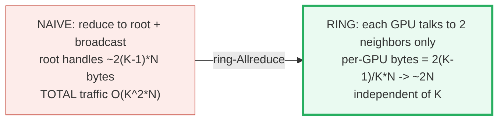

NCCL packages this into **5 collective primitives** — the vocabulary every
distributed strategy speaks:

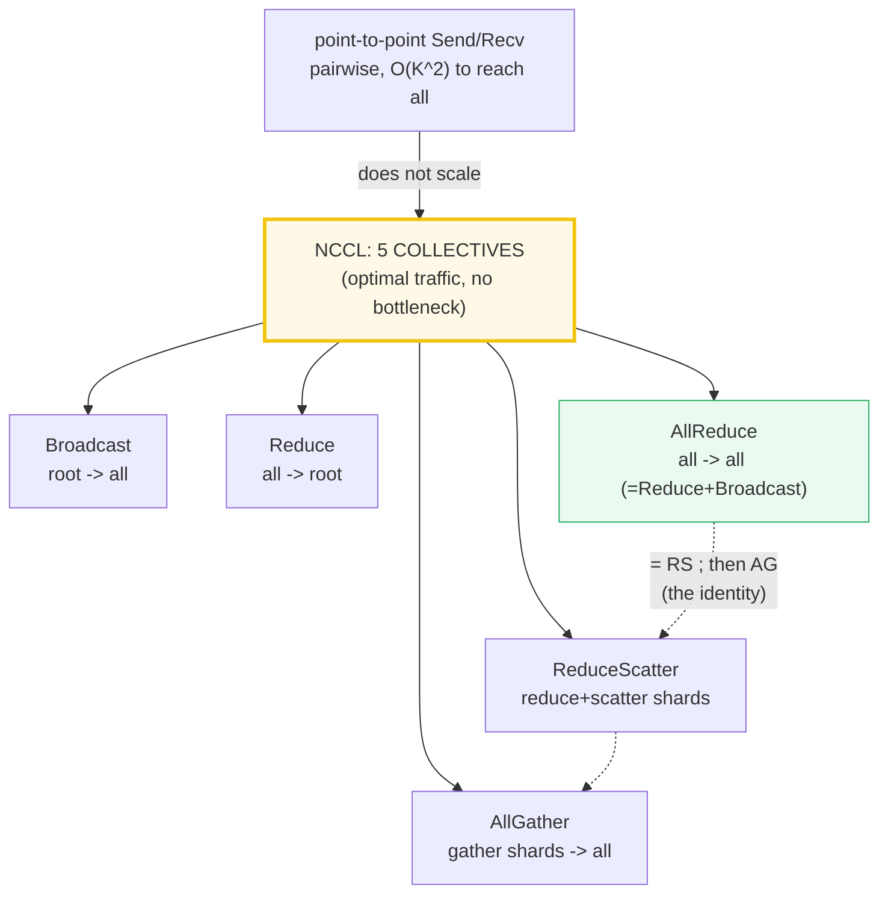

| primitive | direction | after | NCCL C API |
|---|---|---|---|
| **Broadcast** | one → all | every rank := `ranks[root]` | `ncclBroadcast` |
| **Reduce** | all → one | `ranks[root] := op(all)`; others unchanged | `ncclReduce` |
| **AllReduce** | all → all | every rank := `op(all)` | `ncclAllReduce` |
| **ReduceScatter** | all → sharded | rank `r` := `op(chunk r of all)` | `ncclReduceScatter` |
| **AllGather** | sharded → all | every rank := `concat(all shards)` | `ncclAllGather` |

> **The identity that ties it all together** (verified numerically in
> [§4](#4-allreduce--reducescatter--allgather-the-identity)):
> **`AllReduce == ReduceScatter ; then AllGather`**. This is why ZeRO can swap
> DDP's single AllReduce for the two halves — same bytes, but it lets ZeRO
> *partition* the work in between. (NVIDIA NCCL docs: *"Executing ReduceScatter,
> followed by AllGather, is equivalent to the AllReduce operation."*)

### Glossary (every term used below)

| Term | Plain meaning |
|---|---|
| **rank** | one GPU/process in the group. There are `K` of them, indexed `0..K−1`. In [`nccl_collectives.py`](./nccl_collectives.py) the `K` ranks are simulated as a list of `K` torch tensors (no multi-GPU on this Mac). |
| **`K`** | number of ranks (the "world size"). Here: `4` in the worked examples. |
| **`N`** | number of elements each rank contributes (the array size). All ranks have arrays of the **same** size `N`. |
| **root** | the special rank a one-to-all / all-to-one primitive targets (Broadcast root, Reduce root). |
| **chunk** | in ring-Allreduce, each rank's `N` elements are split into `K` equal pieces of `N/K` elements. |
| **op** | the reduction (sum / max / min). We use **sum** everywhere — the DDP gradient-averaging case. |
| **collective** | an operation ALL ranks call together (vs. point-to-point `Send`/`Recv` between two ranks). |
| **ring-Allreduce** | HOW AllReduce is actually shipped: `K` ranks in a ring, `2(K−1)` steps, `~2N` bytes/GPU. |
| **NCCL** | NVIDIA Collective Communication Library — implements all 5 primitives over NVLink/InfiniBand. |

---

## 1. Why collectives — the DDP gradient-sync motivator (Section A)

Data-Parallel training (DDP) puts a full model replica on each of `K` GPUs;
each GPU processes a different mini-batch and computes its own gradient. For the
models to stay synchronized, **every GPU must end the step with the same
(averaged) gradient.** That "make them all equal" step is an **AllReduce** — and
*how* you do it decides whether training scales.

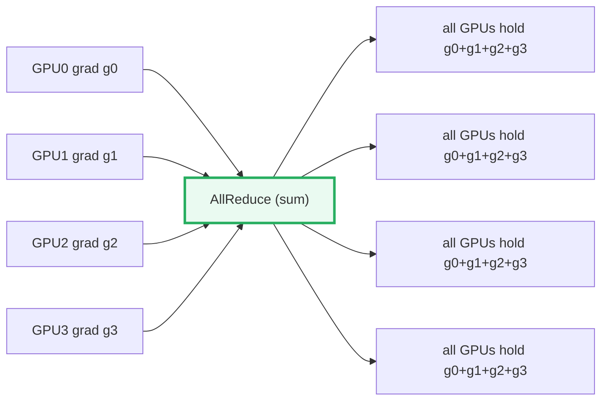

> From `nccl_collectives.py` **Section A** — naive vs ring, `K=4`, `N=16`:
>
> | strategy | per-GPU bytes | scales with K? |
> |---|---|---|
> | naive root reduce+bcast | `2·(K−1)·N` (on the root) | NO (root is O(K)) |
> | ring-AllReduce | `2·(K−1)/K·N` → ~`2N` | YES (→ 2N) |
>
> ```
> ring bytes/GPU for K=4, N=16 = 2*(4-1)/4*16 = 24
> naive root bottleneck       = 2*(4-1)*16   = 96  = 4.0x the ring cost
> ```
> The naive root's cost **grows** with `K`; the ring's **stays** ~`2N`. The gap
> *widens* as you add GPUs.

> One plain sentence: a single foreman GPU becomes the bottleneck; a ring shares
> the work evenly so no rank is special.

---

## 2. The 5 primitives — before/after grids (Section B)

Each primitive below is a faithful **single-process simulation of `K=4` ranks**
(in [`nccl_collectives.py`](./nccl_collectives.py), `ranks = [t0, t1, t2, t3]`,
a list of 4 tensors). The data-flow is byte-identical to real NCCL; only the
transport is simulated (in-process copy, not real NVLink). Inputs are distinct
so you can see exactly where each number goes: rank `r` holds
`[10r+1, 10r+2, 10r+3, 10r+4]`.

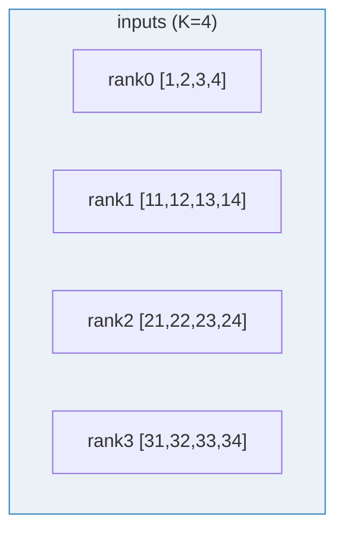

### 2.1 Broadcast — root → all

Copies rank `root`'s buffer to every rank. (Use: ship updated weights from
rank 0 to all workers.)

> From `nccl_collectives.py` **Section B.1** — `Broadcast(root=0)`:
>
> | rank | before | after (all = rank 0) |
> |---|---|---|
> | 0 | `[1, 2, 3, 4]` | `[1, 2, 3, 4]` |
> | 1 | `[11, 12, 13, 14]` | `[1, 2, 3, 4]` |
> | 2 | `[21, 22, 23, 24]` | `[1, 2, 3, 4]` |
> | 3 | `[31, 32, 33, 34]` | `[1, 2, 3, 4]` |

### 2.2 Reduce — all → root

Sums every rank's buffer **onto rank `root` only**; the other ranks are
untouched (NCCL writes the result only into the root's recvbuf). (Use: gather a
total loss onto rank 0 at eval time.)

> From `nccl_collectives.py` **Section B.2** — `Reduce(root=0, op=sum)`:
>
> | rank | before | after (sum on root) |
> |---|---|---|
> | 0 | `[1, 2, 3, 4]` | `[64, 68, 72, 76]` |
> | 1 | `[11, 12, 13, 14]` | `[11, 12, 13, 14]` |
> | 2 | `[21, 22, 23, 24]` | `[21, 22, 23, 24]` |
> | 3 | `[31, 32, 33, 34]` | `[31, 32, 33, 34]` |
>
> `rank 0 = 1+11+21+31=64, 2+12+22+32=68, 3+13+23+33=72, 4+14+24+34=76`.

### 2.3 AllReduce — all → all  *(the DDP collective)*

Sums every rank's buffer onto **every** rank. (Use: DDP gradient sync — after
this, all GPUs hold the identical summed gradient.) This is `Reduce` + `Broadcast`
fused, and it is the **only** collective DDP needs.

> From `nccl_collectives.py` **Section B.3** — `AllReduce(op=sum)`:
>
> | rank | before | after (all = sum) |
> |---|---|---|
> | 0 | `[1, 2, 3, 4]` | `[64, 68, 72, 76]` |
> | 1 | `[11, 12, 13, 14]` | `[64, 68, 72, 76]` |
> | 2 | `[21, 22, 23, 24]` | `[64, 68, 72, 76]` |
> | 3 | `[31, 32, 33, 34]` | `[64, 68, 72, 76]` |
>
> `[check] every rank == sum(all inputs)? True`.

### 2.4 ReduceScatter — reduce AND scatter shards

Splits each rank's `N`-vector into `K` equal chunks; rank `r` ends holding the
summed chunk `r` (only `N/K` elements). (Use: ZeRO-2/3 gradient partitioning;
the **first half** of AllReduce.)

> From `nccl_collectives.py` **Section B.4** — `ReduceScatter(op=sum)`, chunks of 1:
>
> | rank | before | after (1 shard) |
> |---|---|---|
> | 0 | `[1, 2, 3, 4]` | `[64]` |
> | 1 | `[11, 12, 13, 14]` | `[68]` |
> | 2 | `[21, 22, 23, 24]` | `[72]` |
> | 3 | `[31, 32, 33, 34]` | `[76]` |
>
> `rank 0 = 1+11+21+31=64`; `rank 1 = 2+12+22+32=68`; rank 2 = 72; rank 3 = 76.

### 2.5 AllGather — gather shards → all

Each rank contributes one shard; every rank ends with the **concatenation** of
all shards. (Use: the **second half** of AllReduce; ZeRO-3 weight
reconstruction.) Fed the ReduceScatter shards above, it rebuilds the full sum:

> From `nccl_collectives.py` **Section B.5** — `AllGather` of the B.4 shards:
>
> | rank | before (shard) | after (all shards) |
> |---|---|---|
> | 0 | `[64]` | `[64, 68, 72, 76]` |
> | 1 | `[68]` | `[64, 68, 72, 76]` |
> | 2 | `[72]` | `[64, 68, 72, 76]` |
> | 3 | `[76]` | `[64, 68, 72, 76]` |
>
> `(AllGather ∘ ReduceScatter)` rebuilt `[64, 68, 72, 76]` — the **same** result
> as AllReduce in §2.3. That is the identity, proved next.

---

## 3. The 5 data-flows at a glance

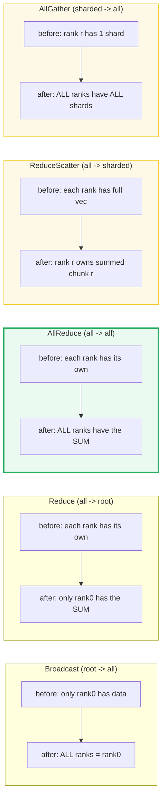

---

## 4. AllReduce == ReduceScatter + AllGather (the identity)

> **Reassurance first:** the two-half decomposition is **not an approximation**.
> `ReduceScatter` followed by `AllGather` is **bit-for-bit identical** to a direct
> `AllReduce` — we prove it by computing both ways on the §2 inputs and diffing.

This is the single most important relationship in the whole library. NCCL's own
docs state it: *"Executing ReduceScatter, followed by AllGather, is equivalent to
the AllReduce operation."* We verify it numerically:

> From `nccl_collectives.py` **Section C**:
>
> Two ways to reach "every rank holds the sum":
> 1. **AllReduce** → direct.
> 2. **ReduceScatter → AllGather** → decomposed (this is ZeRO's path).
>
> ```
> max|AllReduce - (ReduceScatter+AllGather)| = 0.000e+00
> [check] identity holds?  True
> ```
>
> ReduceScatter output (each rank owns ONE summed chunk):
> `rank 0: [64], rank 1: [68], rank 2: [72], rank 3: [76]`.
> After AllGather, every rank has the full sum `[64, 68, 72, 76]` == AllReduce.

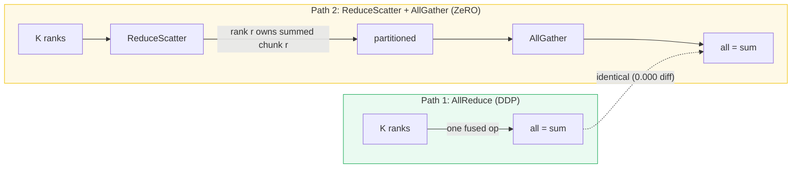

> **Why this matters:** the two halves move the **same `~2N` bytes** total, but
> splitting them lets ZeRO **partition** the intermediate state (each rank only
> stores/updates its own `1/K` shard between the two halves). That is the entire
> memory trick of 🔗 [`ZERO.md`](./ZERO.md). Same identity, different exploit.

---

## 5. Ring-AllReduce — the 2(K−1)-step ring (Section D, the GOLD)

> **The bucket brigade, step by step.** Arrange the `K` GPUs in a **logical
> ring**: each GPU sends to its **right** neighbor and receives from its **left**
> neighbor — and talks to *no one else*. Split each rank's `N` elements into `K`
> chunks of `N/K`. Two phases, each `K−1` steps:
>
> - **Phase 1 — scatter-reduce (`K−1` steps):** each step, every rank sends one
>   chunk right and **accumulates** (`+=`) the chunk it receives. After `K−1`
>   steps, **rank `i` fully owns the complete sum for chunk `(i+1) mod K`.**
> - **Phase 2 — allgather (`K−1` steps):** each step, every rank sends its owned
>   chunk right and **overwrites** (not accumulate) what it receives. After `K−1`
>   steps, **every rank has every chunk = the full sum.**

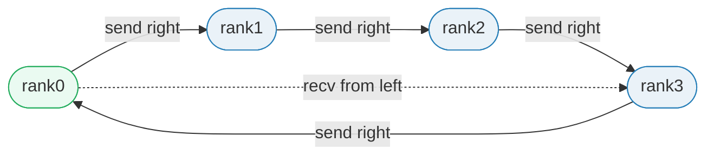

### The worked GOLD example (pinned for the `.html`)

`K=4` ranks, `N=16` elements/rank, chunk size `N/K = 4`. All 4 ranks hold the
**same** vector `v = [1..16]`, so AllReduce (sum of `K` identical copies) =
`K·v = [4, 8, 12, …, 64]`. We run the **actual** ring algorithm
(`ring_allreduce` in [`nccl_collectives.py`](./nccl_collectives.py)) and assert
every rank ends with that sum:

> From `nccl_collectives.py` **Section D**:
>
> ```
> K = 4, N = 16, chunk = 4
> GOLD input (every rank): v = [1,2,3,...,16]
> Expected (sum of 4 identical copies) = 4*v = [4,8,12,...,64]
> ```
>
> | rank | ring result | == expected? |
> |---|---|---|
> | 0 | `[4, 8, 12, 16, 20, 24, 28, 32, 36, 40, 44, 48, 52, 56, 60, 64]` | True |
> | 1 | `[4, 8, 12, 16, 20, 24, 28, 32, 36, 40, 44, 48, 52, 56, 60, 64]` | True |
> | 2 | `[4, 8, 12, 16, 20, 24, 28, 32, 36, 40, 44, 48, 52, 56, 60, 64]` | True |
> | 3 | `[4, 8, 12, 16, 20, 24, 28, 32, 36, 40, 44, 48, 52, 56, 60, 64]` | True |
>
> **Per-GPU bytes (elements SENT during the whole ring):**
> ```
> formula  = 2*(K-1)/K*N = 2*3/4*16 = 24
> measured = 24   (each rank sends 4 els/step * 6 steps)
> [check] measured == formula?  True   (PINNED GOLD: bytes/GPU = 24)
> ```
>
> **GOLD pinned for `nccl_collectives.html`:**
> - result (every rank) = `[4, 8, 12, 16, 20, 24, 28, 32, 36, 40, 44, 48, 52, 56, 60, 64]`
> - **GOLD scalar `result[0] = 4`**
> - **GOLD bytes/GPU = `24`**
>
> `[check] generality: ring with DISTINCT inputs == true sum? True` — the ring is
> not a fluke of identical inputs; it reproduces the true elementwise sum for
> distinct per-rank data too.

**Why the byte count is `2·(K−1)/K·N`:** each of the `2(K−1)` steps, every rank
sends exactly one chunk = `N/K` elements. So per-GPU sends =
`2(K−1)·(N/K) = 2·(K−1)/K·N`. For `K=4, N=16`: `2·3·4 = 24`. (If each element is
a 4-byte fp32, that's `24×4 = 96` bytes; we count in *elements* to match the
formula directly.)

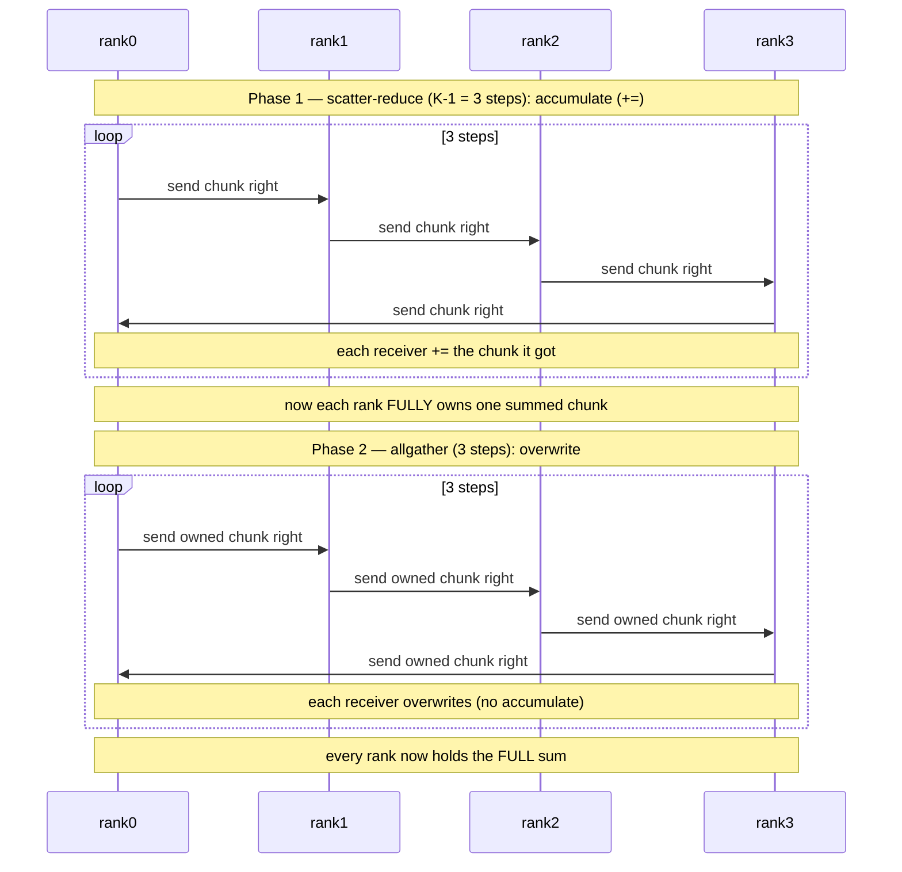

---

## 6. Per-GPU byte cost ≈ 2N (Section E)

The headline scalability claim: as `K` grows, per-GPU bytes → `2N` and **stops
growing**. Doubling the GPUs does **not** double any GPU's communication.

> From `nccl_collectives.py` **Section E** — fix `N=16`, vary `K`:
>
> | K (ranks) | `2·(K−1)/K·N` | ratio to N | ratio to 2N |
> |---|---|---|---|
> | 2 | 16.00 | 1.000 | 0.500 |
> | 4 | **24.00** | 1.500 | 0.750 |
> | 8 | 28.00 | 1.750 | 0.875 |
> | 16 | 30.00 | 1.875 | 0.938 |
> | 32 | 31.00 | 1.938 | 0.969 |
> | 64 | 31.50 | 1.969 | 0.984 |
> | 256 | 31.88 | 1.992 | 0.996 |
>
> As `K → ∞`, `2·(K−1)/K → 2`, so per-GPU bytes → `2N`. `K=4, N=16 → 24` matches
> the §5 gold.

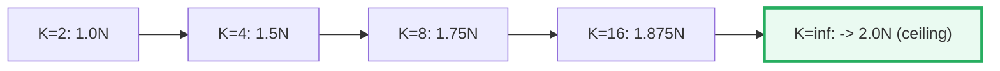

> One plain sentence: the cost rises toward `2N` and then **plateaus** — that
> plateau is why you can scale to thousands of GPUs without each one drowning in
> traffic.

---

## 7. Bandwidth reality + a worked timing (Section F)

Different fabrics, very different speeds. The primitive is the same; the link
bandwidth `B` decides the wall-clock time (`time = 2·(K−1)/K·N / B`).

> From `nccl_collectives.py` **Section F** — per-link bandwidth (one direction):
>
> | interconnect | bandwidth | where used |
> |---|---|---|
> | NVLink 4.0 (A100) | ~600 GB/s | within a node (TP, DDP) |
> | InfiniBand NDR | ~50 GB/s | across nodes (PP, ZeRO) |
> | PCIe Gen4 | ~64 GB/s | CPU↔GPU within machine |
> | Ethernet 100GbE | ~12.5 GB/s | commodity clusters |
>
> **Rule of thumb:** TP needs NVLink-class bandwidth; PP tolerates InfiniBand;
> ZeRO comms are infrequent and survive slower links.

### Worked timing: 1 GB gradient, 8 GPUs, NVLink

> From `nccl_collectives.py` **Section F**:
>
> ```
> ring per-GPU bytes = 2*(K-1)/K*N = 2*7/8*1GB = 1.75 GB
> ring time          = 1.75 GB / 600 GB/s = 2.92 ms   (~3.3 ms)
> naive root         = K*N = 8 GB on the root
> naive time         = 8 GB / 600 GB/s    = 13.33 ms   (~13 ms)
> ring / naive       = 0.22x   (ring wins; the gap WIDENS with K)
> ```
>
> `[check] ring time ~3.3 ms matches 2*1GB/600GB/s = 3.33 ms` (the `~2N`
> approximation: `2N/B` overestimates the exact `2(K−1)/K·N/B` by only `1/K`,
> here `12.5%`).

> 🔗 This is exactly why **tensor parallelism is confined to a single NVLink
> node** (it does one AllReduce *per layer*), while **pipeline parallelism**
> spans nodes using cheaper point-to-point `Send/Recv` over InfiniBand. See the
> strategy map below.

---

## 8. Which primitive each strategy uses (Section G)

The 5 primitives are the vocabulary **all** distributed training speaks. Pick a
strategy, see which collectives it consumes:

> From `nccl_collectives.py` **Section G**:
>
> | strategy | primitives used | why |
> |---|---|---|
> | **DDP** (data parallel) | **AllReduce** (gradients) | every GPU needs the MEAN grad |
> | **Tensor Parallelism** | AllReduce (per layer, O-proj) | sum row-parallel partials within node |
> | **ZeRO-1/2** | ReduceScatter + AllGather | partition grads/states; = AllReduce split |
> | **ZeRO-3** | AllGather (fwd) + ReduceScatter (bwd) | reconstruct / discard param shards per layer |
> | **Pipeline Parallel** | point-to-point Send/Recv | pass activations between stage ranks |

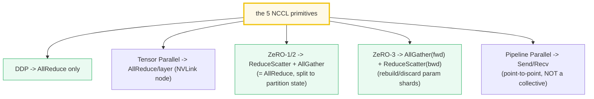

> 🔗 The §4 identity (`AllReduce == ReduceScatter + AllGather`) is **exactly** why
> ZeRO-1/2 can replace DDP's single AllReduce with the two halves: same `~2N`
> bytes, but ZeRO stores/updates only its own `1/K` shard *between* the halves —
> that is its whole memory win. See 🔗 [`ZERO.md`](./ZERO.md). DDP
> ([`DDP.md`](./DDP.md)) is the pure AllReduce baseline; TP
> ([`TENSOR_PARALLEL.md`](./TENSOR_PARALLEL.md)) adds one AllReduce per layer.

---

## 9. The reference code (`nccl_collectives.py`) — annotated

The 5 primitives are each tiny pure-torch functions operating on a **list of `K`
tensors** (a faithful single-process simulation of `K` ranks — no multi-GPU NCCL
fabric is needed, so it runs anywhere torch does).

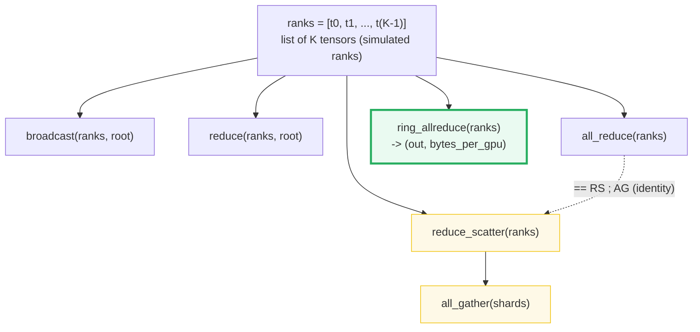

Map to source material:
- Primitives + ring-AllReduce + bandwidth table:
  `learning_guide/04_Distributed_Scale.md` §2.1–§2.3.
- The identity `AllReduce = ReduceScatter + AllGather` and all 5 data-flows:
  NVIDIA NCCL *Collective Operations* docs (see Sources).

Quick test against the reference:

```python
from nccl_collectives import all_reduce, reduce_scatter, all_gather, ring_allreduce
import torch
ranks = [torch.arange(4).float() + 10*r for r in range(4)]   # K=4
assert all(torch.equal(o, sum(ranks)) for o in all_reduce(ranks))
out, bytes_gpu = ring_allreduce([torch.arange(1,17).float()]*4)  # K=4, N=16
assert bytes_gpu[0] == 24 and int(out[0][0]) == 4                 # gold
```

---

## 10. Pitfalls & debugging checklist

| # | Mistake | Symptom | Fix |
|---|---|---|---|
| 1 | Using naive "reduce to root + broadcast" for AllReduce on many GPUs | Root GPU saturates; traffic O(K²) | Use ring-AllReduce (`ncclAllReduce`) — `~2N`/GPU regardless of K |
| 2 | Calling AllReduce on **every** gradient-accumulation micro-step | `K`× slowdown (e.g. 40×) | `require_backward_grad_sync=False` on non-final micro-steps |
| 3 | Forgetting that Reduce writes **only to root** | Non-root ranks see stale data | Use AllReduce if everyone needs the result; or follow Reduce with Broadcast |
| 4 | `N % K != 0` for ReduceScatter / ring-AllReduce | Crash / uneven chunks | Pad `N` to a multiple of `K`, or shard at a granularity that divides `K` |
| 5 | TP across nodes (not within NVLink) | AllReduce/layer crawls on InfiniBand | Keep TP within a node; use PP across nodes |
| 6 | Thinking ZeRO "saves communication" vs DDP | Wrong intuition | ZeRO saves **memory**, not bytes — it still does `~2N` (RS+AG), just partitioned |
| 7 | NCCL timeout / hang across nodes | Training stalls | Check InfiniBand, `NCCL_TIMEOUT`, `NCCL_DEBUG=INFO` |
| 8 | Confusing "mean" with "sum" | Gradients too large by factor K | AllReduce gives the SUM; DDP divides by K for the mean |

---

## 11. Cheat sheet

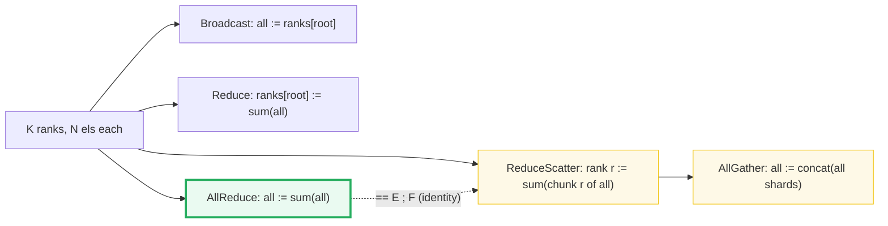

- **5 primitives:** Broadcast, Reduce, AllReduce, ReduceScatter, AllGather.
- **Identity:** `AllReduce == ReduceScatter ; AllGather` (verified to `0.000` diff).
- **ring-AllReduce:** `K` ranks in a ring, `2(K−1)` steps; **per-GPU bytes =
  `2·(K−1)/K·N → ~2N`** (independent of `K`).
- **Time:** `2·(K−1)/K·N / B`; NVLink ~600 GB/s, InfiniBand NDR ~50 GB/s, PCIe ~64 GB/s.
- **GOLD (K=4, N=16):** result `[4,8,…,64]`, `result[0]=4`, **bytes/GPU = 24**.
- **DDP** → AllReduce. **TP** → AllReduce/layer. **ZeRO** → ReduceScatter + AllGather.
- **The whole point:** a ring shares the work so **no rank is a bottleneck** and
  adding GPUs does not balloon any single GPU's traffic.

> 🔗 These 5 primitives are the substrate for the entire Phase-4 distributed
> stack: [`DDP.md`](./DDP.md) (pure AllReduce), [`TENSOR_PARALLEL.md`](./TENSOR_PARALLEL.md)
> (one AllReduce per layer within an NVLink node), and 🔗 [`ZERO.md`](./ZERO.md) (lives
> on the ReduceScatter+AllGather identity to partition optimizer state).

---

## Sources

- **NVIDIA.** *NCCL Collective Operations documentation* (v2.30).
  https://docs.nvidia.com/deeplearning/nccl/user-guide/docs/usage/collectives.html
  — Authoritative definitions of all 5 primitives used here. Verified claims:
  - **AllReduce:** *"in a sum allreduce operation between k ranks … out[i] =
    in0[i]+in1[i]+…+in(k-1)[i]"* stored in every rank.
  - **Broadcast:** *"copies an N-element buffer from the root rank to all the
    ranks."*
  - **Reduce:** *"performs the same operation as AllReduce, but stores the
    result only in the receive buffer of a specified root rank."*
  - **AllGather:** *"gathers N values from k ranks into an output buffer of size
    k·N, and distributes that result to all ranks."*
  - **ReduceScatter:** *"performs the same operation as Reduce, except that the
    result is scattered in equal-sized blocks between ranks."*
  - **The identity ([§4](#4-allreduce--reducescatter--allgather-the-identity)):**
    *"Executing ReduceScatter, followed by AllGather, is equivalent to the
    AllReduce operation"*; and *"A Reduce, followed by a Broadcast, is
    equivalent to the AllReduce operation."*

- **Patarasuk, P.; Yuan, X. (2009).** *Bandwidth Optimal All-reduce Algorithms
  for Clusters of Workstations.* Journal of Parallel and Distributed Computing
  69(2): 117–124. https://www.cs.fsu.edu/~xyuan/paper/09jpdc.pdf
  — The bandwidth-optimal ring allreduce (the `2(K−1)/K·N ≈ 2N` result,
  [§5](#5-ring-allreduce--the-2k1-step-ring-section-d-the-gold) /
  [§6](#6-per-gpu-byte-cost--2n-section-e)). Proves the ring is bandwidth-optimal
  when latency is negligible vs. bandwidth — the regime that holds for large
  gradient tensors.

- **Gibiansky, A. (Baidu Research) (2017).** *Bringing HPC Techniques to Deep
  Learning.* https://andrew.gibiansky.com/blog/machine-learning/baidu-allreduce/
  — The canonical plain-English explanation of ring-Allreduce (the bucket-brigade
  intuition in [§0](#0-tldr--the-whole-idea-in-one-picture) and the two-phase
  scatter-reduce + allgather algorithm in
  [§5](#5-ring-allreduce--the-2k1-step-ring-section-d-the-gold)). Verified the
  per-GPU data formula: *"Data Transferred = 2(N−1)·K/N … independent of the
  number of GPUs"* (his `N` = number of GPUs, `K` = array size; identical to our
  `2·(K−1)/K·N`). Released as the `baidu-allreduce` library
  (https://github.com/baidu-research/baidu-allreduce), later the basis of Uber's
  Horovod.

- **Local source material** (the 5 primitive diagrams, the ring-AllReduce
  step breakdown, the bandwidth table, and the DDP/TP/ZeRO strategy map):
  `learning_guide/04_Distributed_Scale.md` §2.1 (the 5 primitives), §2.2
  (ring-Allreduce: `2(K−1)` steps, `2·(K−1)/K·N ≈ 2N` bytes, `time = 2·(K−1)/K·N/B`,
  the 1 GB/8-GPU/NVLink ≈ 3.3 ms vs naive ≈ 13 ms worked timing), §2.3
  (NVLink 4.0 ~600 GB/s, InfiniBand NDR ~50 GB/s, PCIe Gen4 ~64 GB/s).
