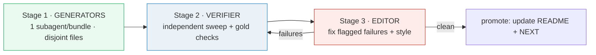
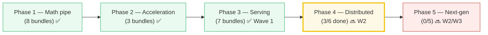
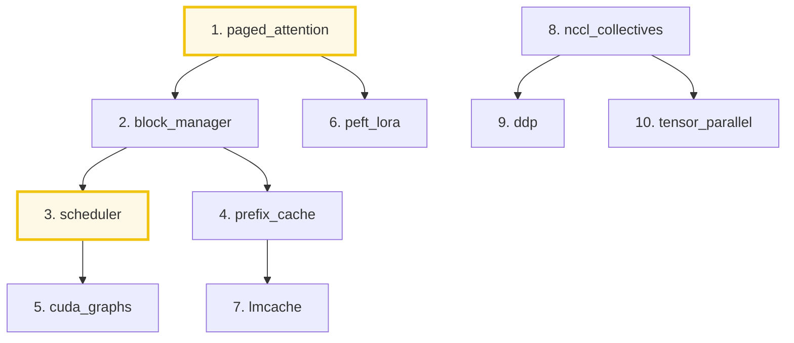

# NEXT.md — the build queue

> The roadmap for every bundle still to build, in priority order. **The next
> swarm = the first 10 (Wave 1).** Read this to know what's next; read
> [`HOW_TO_RESEARCH.md`](./HOW_TO_RESEARCH.md) / [`SUBAGENTS_RESEARCH_GUIDE.md`](./SUBAGENTS_RESEARCH_GUIDE.md)
> for *how* to build them.
>
> Companion to [`README.md`](./README.md) (the 11 bundles already shipped).

> **✅ WAVE 1 SHIPPED** — all 10 bundles built + independently verified GREEN
> (Batch 1: 3/3, Batch 2: 3/3, Batch 3: 4/4) through generator → verifier →
> editor. `research/` now holds **21 bundles** (Phases 1–4). W2/W3 below are NEXT.

---

## MANDATORY — how this gets built (coordinator-only, 3 subagent stages)

This queue is executed by a **coordinator-only** loop. The coordinator writes
briefs, launches subagents, reads their reports, and sequences stages — it does
NOT write bundle code. All bundle work happens in **three subagent stages**:



| Stage | Who | Does |
|---|---|---|
| **0 · setup** | 1 subagent (one-off, **DONE**) | rebuilt `research/.venv`; verified the 11 existing bundles. **Do NOT rebuild again.** |
| **1 · generators** | N subagents (one per bundle, parallel) | build the 4-file bundle per its brief; self-verify `[check]` passes; web-check every formula |
| **2 · verifier** | 1 subagent | independent re-run: `uv run python`, `node --check`, gold value vs `.py`; report per-bundle pass/fail |
| **3 · editor** | 1 subagent | fix ONLY what the verifier flagged; backport house style; cross-link siblings; **never alter a computed number** |

**Non-negotiable rules:**
- Coordinator = briefs + sequencing + reports only. No bundle code from the coordinator.
- Generators own **disjoint** 4-path file sets → safe parallel writes.
- Verifier is **independent** — it re-runs everything; it does not trust generator self-reports.
- Editor edits **only** flagged items; computed numbers are ground truth.
- One wave = Stage 1 (batched, ~3/batch) → Stage 2 → Stage 3, then promote.

---

## TL;DR

- **21 done & green** (Phases 1–4; Wave 1 shipped — 10 bundles, 3 batches).
  **~8 to go** (W2/W3, Phases 3 remainder + 4 remainder + 5).
- **Next = Wave 2:** `pipeline_parallel`, `zero`, `moe_routing`,
  `speculative_decoding` (then W3: `gradient_checkpointing` + Phase 5 trio).
- Executed in batches: Stage 1 generators → Stage 2 verifier → Stage 3 editor
  (see MANDATORY above), then promote.
- **Env:** `research/.venv` was fixed once by Stage 0 (torch 2.12.1, py 3.13.5) —
  **do NOT rebuild it** (see §5).

---

## 1. Coverage so far



---

## 2. The full build queue

`✅ DONE (Wave 1)` = shipped & green · `NEXT (W2)` = Wave 2 · `NEXT (W3)` = Wave 3.
Source = `learning_guide/` section + primary reference repo.

### Phase 3 — Scale & Serving (`03_Scale_Serving.md` · ref: `nano-vllm/`)

| # | Bundle | Lineage (old → new, with WHY) | Key source | Visual hook (the `.html`) | Wave |
|---|---|---|---|---|---|
| 1 | `paged_attention` | Dense prealloc KV (93% wasted) → **PagedAttention**: OS virtual memory, logical→physical pages | §2 · `tiny-llm/paged_kv_cache.py` | page pool, block_table, non-contiguous K/V gather | ✅ DONE (Wave 1) |
| 2 | `block_manager` | Flat alloc → **BlockManager**: chained xxHash prefix dedup + `ref_count` sharing | §5 · `nano-vllm/block_manager.py` | hash-chain fingerprint, ref_count, free-list | ✅ DONE (Wave 1) |
| 3 | `scheduler` | Static batching → **continuous batching** (Orca) + prefill-priority + chunked prefill + preemption | §4,§6 · `nano-vllm/scheduler.py`+`sequence.py` | WAITING/RUNNING/FINISHED state machine + batching timeline | ✅ DONE (Wave 1) |
| 4 | `prefix_cache` | Block-hash reuse → **RadixAttention**: radix tree for arbitrary prefix sharing (SGLang) | §11 | radix-tree traversal, cache hits on shared prefixes | ✅ DONE (Wave 1) |
| 5 | `cuda_graphs` | Eager Python overhead per step → **captured/replayed** decode graphs (one per BS) | §7.3 · `nano-vllm/model_runner.py` | eager vs captured timeline, launch-overhead elimination | ✅ DONE (Wave 1) |
| 6 | `peft_lora` | Full fine-tune replicas → **LoRA/QLoRA** low-rank adapters + Punica/S-LoRA grouped GEMM | §9 | rank-r decomposition, grouped GEMM for batched adapters | ✅ DONE (Wave 1) |
| 7 | `lmcache` | Single-GPU prefix cache → **hierarchical** GPU→CPU→NVMe→S3 global pool + RDMA lookup | §10 | memory-hierarchy tiers, cross-node cache transfer | ✅ DONE (Wave 1) |

### Phase 4 — Distributed (`04_Distributed_Scale.md` · ref: `nanoGPT/`)

| # | Bundle | Lineage (old → new, with WHY) | Key source | Visual hook (the `.html`) | Wave |
|---|---|---|---|---|---|
| 8 | `nccl_collectives` | P2P comms → **NCCL 5 primitives** + ring-AllReduce (2N bytes regardless of K) | §2 | ring topology, ReduceScatter+AllGather = AllReduce | ✅ DONE (Wave 1) |
| 9 | `ddp` | Single-GPU training → **DDP**: full replica + grad AllReduce + AMP + grad accumulation + cosine LR | §3 · `nanoGPT/train.py` | per-GPU replica, gradient sync, micro-batch accumulation | ✅ DONE (Wave 1) |
| 10 | `tensor_parallel` | Matrices too big for 1 GPU → **Megatron** column/row parallel (AllReduce cancels across MLP/attn) | §4 · `nano-vllm/layers/linear.py` | column/row shard, the "AllReduce cancels" trick | ✅ DONE (Wave 1) |
| 11 | `pipeline_parallel` | TP not enough → **GPipe** micro-batching, 1F1B, interleaved (bubble `(K-1)/(K+M-1)`) | §5 | pipeline timeline, bubble shrinking with M microbatches | NEXT (W2) |
| 12 | `zero` | DDP redundancy (20N bytes) → **ZeRO 1/2/3** partition opt-state/grad/params | §6 | per-stage memory bars, 20N → 16/K bytes | NEXT (W2) |
| 13 | `gradient_checkpointing` | O(L) activation memory → **selective recompute** (√L trick) | §8 | checkpoint grid, recompute spans | NEXT (W3) |

### Phase 5 — Next-Gen (`05_Next_Gen_Architecture.md` · ref: `tiny-llm/moe.py`)

| # | Bundle | Lineage (old → new, with WHY) | Key source | Visual hook (the `.html`) | Wave |
|---|---|---|---|---|---|
| 14 | `moe_routing` | Dense FFN (all params active) → **top-k sparse MoE** + load-balance/z-loss + DeepSeek aux-free | §2 · `tiny-llm/moe.py` | router gate, top-k selection, expert routing | NEXT (W2) |
| 15 | `speculative_decoding` | 1 token/step (memory-bound) → **draft+verify** parallel (rejection sampling, exact dist) | §3 | draft chain, parallel verify, accept/reject | NEXT (W2) |
| 16 | `disaggregated_serving` | Co-located prefill+decode contention → **DistServe/Mooncake** split + KV RDMA transfer | §4 | prefill vs decode clusters, KV transfer latency budget | NEXT (W3) |
| 17 | `ktransformers_offload` | GPU-only (671B won't fit) → **CPU DRAM expert offload** + AMX/AVX (activation-only transfer) | §5 | GPU attn + CPU experts, 14 KB activation vs 350 GB weight | NEXT (W3) |
| 18 | `jax_xla_tpu` | PyTorch/CUDA eager → **JAX trace → XLA → Pallas** TPU kernels (Splash Attention) | §6 | jaxpr trace, systolic MXU, VMEM tiling | NEXT (W3) |

---

## 3. WAVE 1 — SHIPPED ✅

> **All 10 GREEN** — every bundle passed independent verifier re-run
> (`uv run python`, `node --check`, gold value vs `.py`). Built in 3 batches
> (3/3, 3/3, 4/4) through the generator → verifier → editor pipeline.
> The build order below is preserved for reference.



**Why these 10 first:** they finish the entire serving-engine arc (Phase 3 = the
`nano-vllm` story end-to-end), then lay the distributed-training foundation that
every later bundle cites — `tensor_parallel` is referenced in Phase 3's
ModelRunner, `nccl_collectives` is the language of all of Phase 4, `ddp` is the
baseline every ZeRO/TP/PP bundle contrasts against.

**Build order rationale:**
1. `paged_attention` — direct bridge from the shipped `KV_CACHE` bundle.
2. `block_manager` — sibling to #1 (same `block_manager.py`, shared page model).
3. `scheduler` — the big one; depends on understanding #2's allocation.
4. `prefix_cache` — sibling contrast to #2's flat hash (radix tree).
5–7. `cuda_graphs`, `peft_lora`, `lmcache` — independent serving features.
8–10. the Phase 4 foundation trio (comms → replication → sharding).

**Not in Wave 1:** `pipeline_parallel` + `zero` (need #10 as a cited sibling),
`gradient_checkpointing`, and all of Phase 5 (MoE/spec decode cite shipped
`KV_CACHE` + Wave-1 `scheduler`; disaggregation/KTransformers/JAX are the
weakest "tiny `.py`" fits — defer until the engine story is solid).

---

## 4. Launching Wave 1 (orchestrator checklist)

Follow [`SUBAGENTS_RESEARCH_GUIDE.md`](./SUBAGENTS_RESEARCH_GUIDE.md) §2:

- [x] Fix `research/.venv` (§5 below).
- [x] Write **10 worker briefs** — each with: lineage, anchor formulas,
      `{WEB_ANCHORS}` (arXiv IDs), `{GOLD_VALUE}`, exact 4 file paths, source
      section refs. (~5 min each; this is where orchestrator judgment lives.)
- [x] Confirm the 40 file paths are pairwise disjoint across workers.
- [x] Launch all 10 `Task` workers in ONE message + 1 style-consistency worker.
- [x] Run the §5 verification sweep; re-spawn failures.
- [x] Update `README.md` mermaid/table + this file (mark W1 done, promote W2).

---

## 5. Blockers & gotchas

- **`research/.venv` is broken** — points at a missing `libpython3.13.dylib`
  from another project. All `uv run python *.py` fail until rebuilt:
  ```bash
  cd research && rm -rf .venv && uv venv --python 3.13 && uv sync
  ```
  Then re-run the README verification sweep to confirm the 11 existing bundles
  are still green before adding new ones.
- **`pyproject.toml` / `uv.lock` are read-only** to workers. torch only.
- **Never hand-compute a number** — paste from `_output.txt` or recompute in JS
  and gold-check against the `.py`.
