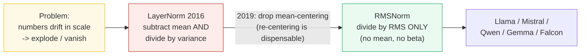
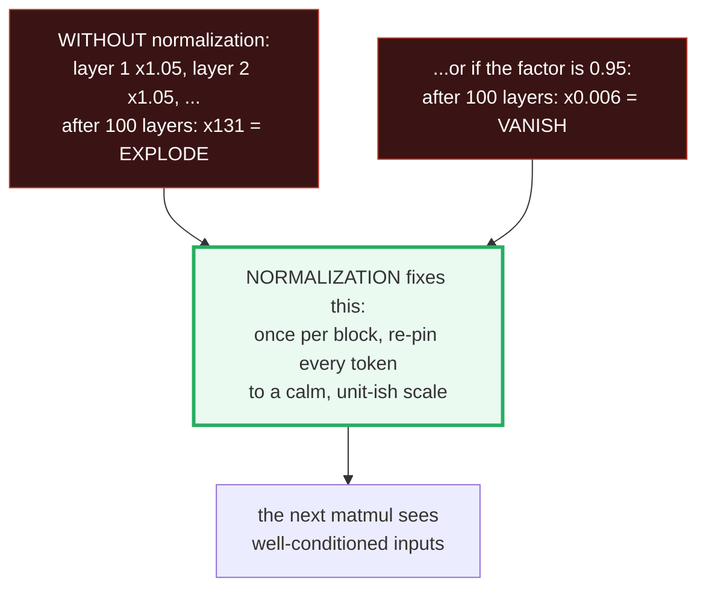
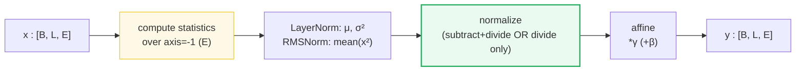
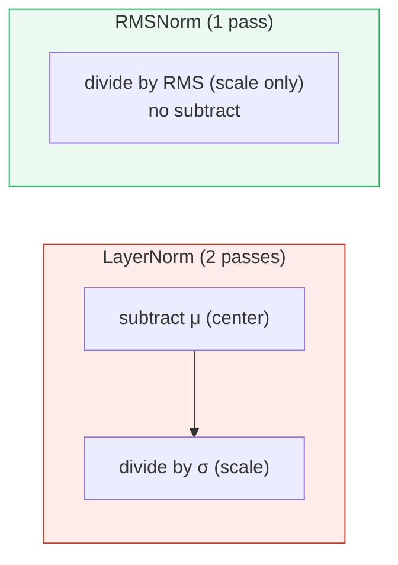
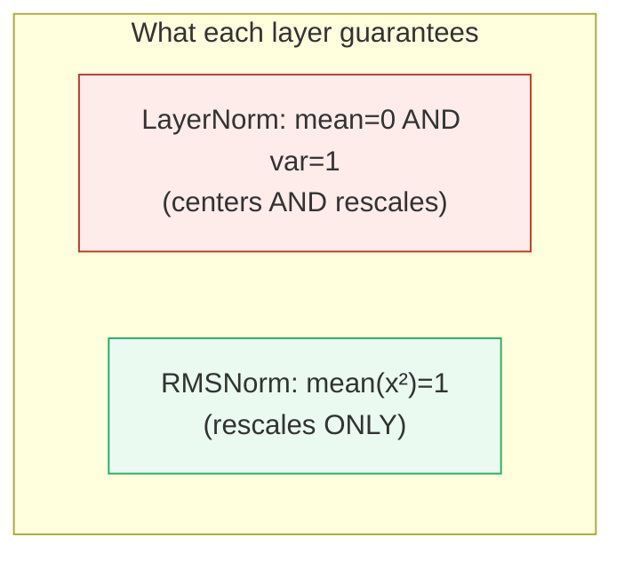
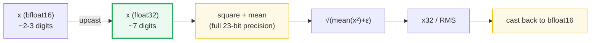
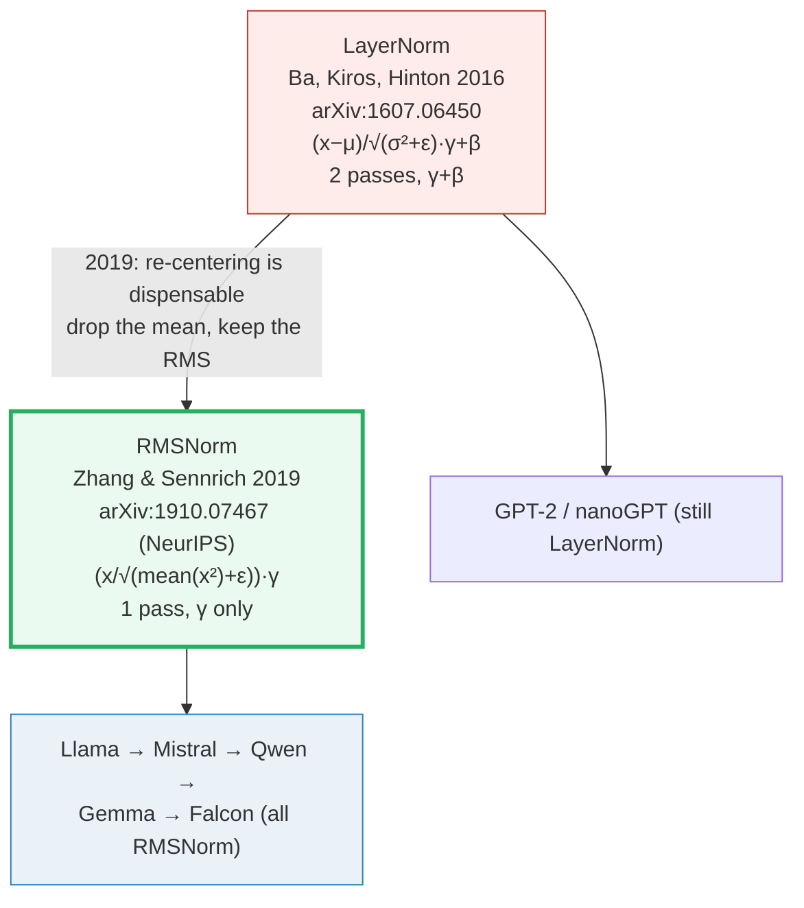
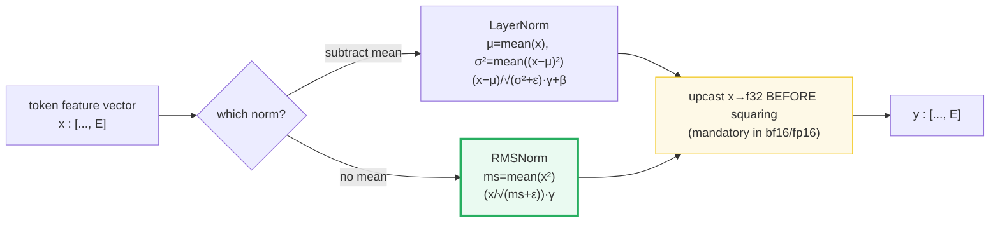

# Layer Normalization Lineage (LayerNorm → RMSNorm) — A Visual, Worked-Example Guide

> **Companion code:** [`normalization.py`](./normalization.py). **Every number in this
> guide is printed by `uv run python normalization.py`** — change the code, re-run,
> re-paste. Nothing here is hand-computed.
>
> **Sibling guides:** [`ROPE.md`](./ROPE.md) and [`ABSOLUTE_PE.md`](./ABSOLUTE_PE.md) —
> position embeddings. Normalization is *orthogonal* to position, but the two meet at
> **QK-Norm**: an RMSNorm is applied to Q/K *just before* RoPE (see ROPE.md §6).
> Cross-references are marked 🔗 throughout.
>
> **Source material:** `learning_guide/00_Foundations.md` §7.2 and
> `learning_guide/01_Math_Pipe.md` §2.2.

---

## Read this first (no math or coding background needed)

> **Normalizing = making sure no single feature is too loud.**

A Transformer is a tall stack of ~100 blocks that all multiply numbers together.
If those numbers are allowed to grow freely, they **explode** (turn into `NaN` =
"not a number", garbage). If they shrink freely, they **vanish** (become so tiny the
model stops learning). So once per block we quietly re-pin every token to a calm,
known scale. That act is called **normalization**.

There are two flavors, and they differ in exactly **one** step:

- **LayerNorm (2016):** first **center** everything to zero (subtract the average),
  *then* **scale**. Two moves.
- **RMSNorm (2019):** **skip the centering** — just **scale** by how loud the numbers
  are on average (the "RMS"). It turns out the centering barely matters, so RMSNorm
  drops it to go **7–64% faster**. This is what Llama, Mistral, Qwen, and Gemma use;
  GPT-2 still uses LayerNorm.

That is the whole idea. Everything below just fills in the numbers.

---

## Glossary — every symbol, defined once, in plain words

| Symbol | Plain-English meaning |
|---|---|
| **`x`** | the input: one token's list of numbers (its "feature vector"). Length `E`. |
| **`E`** | how many numbers are in `x`. The "feature" / "embedding" axis. (`E = 8` in our examples.) |
| **mean / `μ`** | the **average** of the numbers in `x` = `sum(x) / E`. |
| **variance / `σ²`** | the average of `(each number − mean)²`. "How spread-out the numbers are." |
| **std / `σ`** | the **standard deviation** = `√variance`. "The typical spread." |
| **RMS** | **r**oot-**m**ean-**s**quare = `√(average of x²)`. Think of it as **"the loudness"** — the average size of the numbers, ignoring plus/minus signs. |
| **`eps`** | a tiny safety number (`1e-5` = 0.00001) added *inside* the square root so we **never divide by zero**, even if all inputs are ~0. |
| **`gamma` (γ)** | a **learned "volume knob"**, one per feature. After we calm the scale, gamma lets the model re-emphasize features it likes. Starts at `1` (no change). |
| **`beta` (β)** | a **learned "shift knob"**, one per feature, **LayerNorm only**. Lets the model slide features up/down. RMSNorm has **no** beta. Starts at `0` (no change). |
| **`dtype`** | "data type" — how many bits a number is stored in (its precision). |
| **`float32`** | 32-bit float: ~7 decimal digits of precision. The **safe** precision. |
| **`bfloat16`** | "brain float" 16-bit: only ~2–3 decimal digits. Tiny numbers, squared, can round to **zero** here → disaster (see §5). |

> **One-sentence summary of the two layers:** LayerNorm subtracts the mean *and*
> divides by the spread; RMSNorm just divides by the loudness. That is the entire
> difference.

---

## 0. TL;DR — the whole idea in one picture

> **In one plain sentence:** every Transformer block re-pins its numbers to a calm
> scale so they don't explode or vanish; LayerNorm centers-then-scales, RMSNorm just
> scales (and is faster).



| | LayerNorm (2016) 🔴 | RMSNorm (2019) 🟢 |
|---|---|---|
| **Plain words** | center to zero, *then* scale | just scale (no centering) |
| **Formula** | `(x − μ) / √(σ² + ε) · γ + β` | `(x / √(mean(x²) + ε)) · γ` |
| **Subtract mean?** | **Yes** | **No** |
| **Reduction passes** | 2 (mean, then var) | 1 (mean of squares) |
| **Affine params** | `gamma` **and** `beta` | `gamma` **only** |
| **Invariance granted** | re-centering **and** re-scaling | re-scaling only |
| **Speed** | baseline | **7–64% faster** (NeurIPS 2019 paper) |
| **Accuracy** | baseline | competitive |
| **Used by** | GPT-2 / nanoGPT / original Transformer | Llama, Mistral, Qwen, Gemma, Falcon |

> 🔗 **If you only read one cross-reference:** RMSNorm is LayerNorm with the mean
> *deleted*. That single deletion removes a reduction pass and the `beta` parameter
> — which is why it's faster. The hypothesis (Zhang & Sennrich 2019, stated verbatim
> in the paper's abstract) is that the "re-centering" the mean provides is
> *dispensable*; "re-scaling" is what actually stabilizes training.

---

## 1. Why normalize at all? (the human pain, first)

> **In one plain sentence:** without normalization, a 100-layer network's numbers
> either balloon into `NaN` or shrink to nothing — both produce garbage — so we
> re-pin the scale once per block.

Attention and MLPs **multiply** activations together. Multiplying is dangerous: if
the numbers are even slightly too big, they grow **exponentially** across the stack
→ **explode** → `NaN` → the model outputs garbage. If they're slightly too small,
they shrink to zero → **vanish** → gradients die → the model stops learning. There
is nothing, by default, tying the magnitudes to a known scale.



Normalization re-pins every token's feature vector to a **unit-ish scale** once per
block, so the next matmul sees well-conditioned inputs.

Both layers normalize **over the last axis** (the feature/embedding dim `E`),
**independently per token**. So a `[B, L, E]` activation becomes `[B, L, 1]` worth
of statistics broadcast back over `E`. Position and batch are untouched.



> 🔗 Normalization lives **inside every block**, not at the input. Contrast with
> position embeddings ([`ABSOLUTE_PE.md`](./ABSOLUTE_PE.md)), which are added *once*
> at the input embedding. The one place they meet is **QK-Norm** in
> [`ROPE.md`](./ROPE.md) §6: a per-head RMSNorm applied to Q/K right before RoPE.

---

## 2. LayerNorm step by step — Section A output

> **Intuition:** LayerNorm does **two** things to each token's feature vector:
> (1) **center** it at 0 by subtracting the average, (2) **rescale** it to unit
> spread by dividing by the standard deviation. Then it applies two learned knobs
> (`gamma` to re-emphasize, `beta` to shift).

**The math** (two "reduction passes" — a pass is one scan over the vector):

```
μ = mean(x)                     # pass 1: the average
σ² = mean((x − μ)²)             # pass 2: the spread  (BIASED: divide by E, not E−1)
out = (x − μ) / √(σ² + ε) · γ + β
```

**Narrated on the gold input** `x = [1, 2, 3, 4, 5, 6, 7, 8]` (`E=8`, `gamma=ones`,
`beta=zeros`, `eps=1e-5`):

- **Step 1 — average.** Add `1+2+…+8 = 36`, divide by 8 → mean = **4.5**.
- **Step 2 — center.** Subtract 4.5 from each: `[−3.5, −2.5, …, +3.5]`. Now they straddle 0.
- **Step 3 — spread.** Square those, average them → variance = **5.25**; `√(5.25 + eps) = 2.291290`.
- **Step 4 — scale.** Divide each centered number by 2.291290 → spread is now ~1.
- **Step 5 — knobs.** Multiply by `gamma=1` and add `beta=0` → no extra change here.

> From `normalization.py` **Section A**:
>
> ```
> pass 1  mean(x)              = 4.500000
> pass 2  var = mean((x−μ)²)   = 5.250000   (BIASED, divides by E not E−1)
>         sqrt(var + eps)       = 2.291290
> ```
>
> | field | x | x − mean | (x−mean)/std | *gamma+beta |
> |---|---|---|---|---|
> | d0 | +1.000000 | −3.500000 | **−1.527524** | −1.527524 |
> | d1 | +2.000000 | −2.500000 | **−1.091088** | −1.091088 |
> | d2 | +3.000000 | −1.500000 | **−0.654653** | −0.654653 |
> | d3 | +4.000000 | −0.500000 | **−0.218218** | −0.218218 |
> | d4 | +5.000000 | +0.500000 | **+0.218218** | +0.218218 |
> | d5 | +6.000000 | +1.500000 | **+0.654653** | +0.654653 |
> | d6 | +7.000000 | +2.500000 | **+1.091088** | +1.091088 |
> | d7 | +8.000000 | +3.500000 | **+1.527524** | +1.527524 |

**Read the table:** the `x − mean` column is symmetric around zero (centered); the
`(x−mean)/std` column is the same shape but squashed to a spread of ~1. With
`gamma=1, beta=0`, the last column is identical to it. The two-pass structure
(mean first, then a variance that *depends* on that mean) is the cost LayerNorm pays.

✅ `normalization.py` verifies the from-scratch version matches `torch.nn.LayerNorm`
and `F.layer_norm` bit-for-bit (`[check] OK`).

---

## 3. RMSNorm step by step — Section B output

> **Intuition:** RMSNorm drops the centering. It does **one** thing: divide by the
> **RMS** ("how loud the vector is on average"). Then a single learned knob
> (`gamma`, no `beta`).

**The math** (a single pass — no mean subtraction):

```
mean(x²) = (1/E) · Σ xᵢ²        # single pass, NO mean subtraction
out = (x / √(mean(x²) + ε)) · γ
```

**Narrated on the same gold input** `x = [1, 2, 3, 4, 5, 6, 7, 8]` (`gamma=ones`,
`eps=1e-5`):

- **Step 1 — square each number:** `[1, 4, 9, 16, 25, 36, 49, 64]`.
- **Step 2 — average the squares:** `204 / 8 = 25.5`.
- **Step 3 — square root:** `√(25.5 + eps) = 5.049753` — **that's the RMS, the loudness.**
- **Step 4 — divide each original number by it:** `1/5.049…, 2/5.049…, …` → calm scale.
- **Step 5 — multiply by the learned knob** `gamma=1` → no extra change here.

> From `normalization.py` **Section B**:
>
> ```
> mean(x²) = (1/E) · Σ xᵢ² = 25.500000
> RMS = √(mean(x²) + eps)  = 5.049753
> NOTE: mean(x) was 4.500000 but RMSNorm IGNORES it.
> ```
>
> | field | x | x² | x/RMS | *gamma |
> |---|---|---|---|---|
> | d0 | +1.000000 | +1.000000 | **+0.198029** | +0.198029 |
> | d1 | +2.000000 | +4.000000 | **+0.396059** | +0.396059 |
> | d2 | +3.000000 | +9.000000 | **+0.594088** | +0.594088 |
> | d3 | +4.000000 | +16.000000 | **+0.792118** | +0.792118 |
> | d4 | +5.000000 | +25.000000 | **+0.990147** | +0.990147 |
> | d5 | +6.000000 | +36.000000 | **+1.188177** | +1.188177 |
> | d6 | +7.000000 | +49.000000 | **+1.386206** | +1.386206 |
> | d7 | +8.000000 | +64.000000 | **+1.584236** | +1.584236 |

**Read the table:** notice the `x²` column grows fast (1, 4, 9, …) — that's why
squaring is the "dangerous" op we protect in §5. The `x/RMS` column keeps the
**same sign pattern** as `x` (all positive here) and is **not** centered at 0 — but
its average *loudness* is now pinned to 1. That constant scale is exactly what
stabilizes the next layer.



> **Plain sentence:** LayerNorm centers *then* scales (two scans); RMSNorm just
> scales by the loudness (one scan). Same calm result, less work.

---

## 4. Side-by-side on the same input — Section C output

> **Intuition:** feed both layers the **identical** vector and read off what
> changes. LayerNorm's output straddles zero; RMSNorm's stays on one side.

> From `normalization.py` **Section C**:
>
> Running statistics on `x = [1..8]`:
> ```
> mean(x)         = +4.500000     <- LayerNorm uses this (subtract)
> var(x) [biased] = 5.250000      <- LayerNorm divides by sqrt(this)
> mean(x²)        = 25.500000     <- RMSNorm divides by sqrt(this)
> ```
>
> | field | x | LayerNorm | RMSNorm | diff (LN−RN) |
> |---|---|---|---|---|
> | d0 | +1.000000 | −1.527524 | +0.198029 | −1.725553 |
> | d1 | +2.000000 | −1.091088 | +0.396059 | −1.487147 |
> | d2 | +3.000000 | −0.654653 | +0.594088 | −1.248742 |
> | d3 | +4.000000 | −0.218218 | +0.792118 | −1.010336 |
> | d4 | +5.000000 | +0.218218 | +0.990147 | −0.771930 |
> | d5 | +6.000000 | +0.654653 | +1.188177 | −0.533524 |
> | d6 | +7.000000 | +1.091088 | +1.386206 | −0.295118 |
> | d7 | +8.000000 | +1.527524 | +1.584236 | −0.056712 |

**Key observations (from the run):**

- LayerNorm output has mean ≈ **0**: `+0.000000`
- RMSNorm output has mean ≈ **+0.891133** (NOT centered)
- `max|LN − RN| = 1.725553` — a **real** difference.

They are **not interchangeable**: swapping them silently changes every activation.
Always read the checkpoint config — Qwen/Llama = `RMSNorm`, GPT-2/nanoGPT = `LayerNorm`.



> **Plain sentence:** LayerNorm guarantees both "centered at 0" and "spread of 1";
> RMSNorm only guarantees "loudness of 1" — and that turns out to be enough.

---

## 5. The float32 upcast — why it is MANDATORY — Section D output

> **Intuition (the vivid reason):** tiny numbers, **squared**, get *so small* that
> half-precision (`bfloat16`, only ~2–3 decimal digits) **rounds them to zero**.
> Then we'd divide by ~zero and get nonsense (`NaN`). So we do the dangerous
> squaring in **high precision** (`float32`, ~7 digits) and switch back afterward.

Both layers **square** and **sum** the activations. In `bfloat16` (only ~8 mantissa
bits, vs float32's 23) this loses precision, and for tiny values the sum of squares
can underflow to **exactly 0**. Then the denominator collapses to `√ε` (wrong scale)
or, without `eps`, to 0 (`NaN`). The universal fix: **upcast `x` to float32 before
squaring**, then cast back.



> **Plain sentence:** we compute the loudness (RMS) in high precision so the
> squaring doesn't silently vanish, then return to the cheap low precision.

### Part 1 — precision loss (the everyday case)

`x = [0.001, 0.002, …]` stored in bfloat16, `eps=1e-5`:

> From `normalization.py` **Section D, Part 1**:
>
> ```
> mean(x²)  bfloat16 (no upcast) : 4.202127e-06
>           float32  (upcast)    : 4.189518e-06
>           ratio (bf16 / f32)   : 1.00301   <- bf16 over-estimates
> max| no-upcast − upcast | over the output = 1.278e-03
> ```

The two normalizations **differ** because bf16's ~8 mantissa bits cannot hold the sum
of squares faithfully. In production (`E=4096+`) this error compounds across the
reduction.

### Part 2 — catastrophic underflow (the motivation)

Tiny activations `x ≈ 1e-22`, `eps=0` to expose the worst case:

> From `normalization.py` **Section D, Part 2**:
>
> ```
> mean(x²)  bfloat16 (no upcast) : 0.000e+00     <- rounds to EXACTLY 0
>           float32  (upcast)    : 2.550e-43     <- tiny but nonzero
> x / √mean(x²)  with eps = 0:
>   bfloat16 (no upcast) : contains NaN/inf? True   <- DEAD
>   float32  (upcast)    : max |out| = 1.5855       (finite, correct)
> ```

Without the upcast the bf16 sum of squares underflows to 0 → division by zero → `NaN`.
Adding `eps=1e-5` prevents the `NaN` but still yields a **wrong scale** whenever the
true mean-square is below `eps`. Upcasting to float32 before squaring preserves the
true (tiny) mean-square so the division stays well-conditioned.

This upcast is in **every** production RMSNorm (LLaMA, Qwen, Mistral, Gemma). See
`rmsnorm_from_scratch` in [`normalization.py`](./normalization.py).

---

## 6. Worked example & gold value — Section E output

> **Intuition:** this is the single vector we "pin" into the interactive page so the
> browser's JavaScript can prove it recomputes the same answer as the Python.

> From `normalization.py` **Section E**:
>
> ```
> RMSNorm(x=[1..8], eps=1e-5, gamma=ones) =
>   [0.198029, 0.396059, 0.594088, 0.792118, 0.990147, 1.188177, 1.386206, 1.584236]
>
> mean(x²) = 25.500000    RMS = √(mean(x²)+eps) = 5.049753
> (HTML JS recomputes 1/RMS = 0.198029 and multiplies each x[i].)
> ```

All four `[check]` assertions pass:

```
[check] from-scratch RMSNorm == manual  x * (1/RMS):           OK
[check] from-scratch RMSNorm == x * rsqrt(mean(x²)+eps):       OK
[check] from-scratch LayerNorm == torch.nn.LayerNorm:          OK
[check] from-scratch LayerNorm == F.layer_norm:                OK
```

The from-scratch implementations in this file **are** the definitions — they match
torch's references bit-for-bit (within float32 tolerance).

---

## 7. Full worked batch: `B=1, L=4, E=8` — Section F output

> **Intuition:** a real call normalizes **every token independently** over its `E=8`
> features — so a tiny-input token and a big-input token both end up at the same
> calm scale.

> From `normalization.py` **Section F** — input then RMSNorm output:
>
> **Input** `x[b=0]`:
>
> | m | d0 | d1 | d2 | d3 | d4 | d5 | d6 | d7 |
> |---|---|---|---|---|---|---|---|---|
> | 0 | 0.1100 | 0.1200 | 0.1300 | 0.1400 | 0.1500 | 0.1600 | 0.1700 | 0.1800 |
> | 1 | 0.2100 | 0.2200 | 0.2300 | 0.2400 | 0.2500 | 0.2600 | 0.2700 | 0.2800 |
> | 2 | 0.3100 | 0.3200 | 0.3300 | 0.3400 | 0.3500 | 0.3600 | 0.3700 | 0.3800 |
> | 3 | 0.4100 | 0.4200 | 0.4300 | 0.4400 | 0.4500 | 0.4600 | 0.4700 | 0.4800 |
>
> **Output RMSNorm(x)** `x[b=0]`:
>
> | m | d0 | d1 | d2 | d3 | d4 | d5 | d6 | d7 |
> |---|---|---|---|---|---|---|---|---|
> | 0 | 0.7491 | 0.8173 | 0.8854 | 0.9535 | 1.0216 | 1.0897 | 1.1578 | 1.2259 |
> | 1 | 0.8533 | 0.8940 | 0.9346 | 0.9753 | 1.0159 | 1.0565 | 1.0972 | 1.1378 |
> | 2 | 0.8965 | 0.9255 | 0.9544 | 0.9833 | 1.0122 | 1.0411 | 1.0701 | 1.0990 |
> | 3 | 0.9201 | 0.9425 | 0.9650 | 0.9874 | 1.0099 | 1.0323 | 1.0548 | 1.0772 |

**The check that proves it worked** — the per-token RMS (loudness) before vs after:

```
[check] RMS per token BEFORE: [0.1468, 0.2461, 0.3458, 0.4456]
[check] RMS per token AFTER : [0.9998, 0.9999, 1.0, 1.0]
```

After RMSNorm, **every token's RMS ≈ 1.0** regardless of its original magnitude.
Token 0 (small inputs) and token 3 (larger inputs) are both pinned to the same unit
scale — that is the whole point.

---

## 8. The lineage, and WHY each step — Section G output

> **Intuition:** Zhang & Sennrich noticed the mean-subtraction did little for
> accuracy but cost a whole extra scan plus a parameter. Drop it → same stability,
> 7–64% faster. Llama adopted it; the open-source world followed.



> From `normalization.py` **Section G** — the lineage, verbatim:
>
> ```
> LayerNorm   Ba, Kiros, Hinton 2016  (arXiv:1607.06450)
>     out = (x − mean) / sqrt(var + eps) · gamma + beta
>     - 2 reduction passes (mean, then var)
>     - 2 affine params per feature (gamma, beta)
>     - gives re-centering AND re-scaling invariance
>     - GPT-2 / nanoGPT / original Transformer use this
>
>         |  Zhang & Sennrich (2019) hypothesized:
>         |  "re-centering invariance is dispensable;
>         |   re-scaling invariance is what actually helps."
>         |  -> drop the mean subtraction, keep only the RMS scaling.
>         v
>
> RMSNorm     Zhang & Sennrich 2019  (arXiv:1910.07467, NeurIPS 2019)
>     out = (x / sqrt(mean(x²) + eps)) · gamma
>     - 1 reduction pass (mean of squares only)
>     - 1 affine param per feature (gamma; NO beta)
>     - gives re-scaling invariance only
>     - 7%-64% faster than LayerNorm at comparable accuracy (the paper)
>     - LLaMA / Mistral / Qwen / Gemma / Falcon all use this
> ```

**The "why" in one line:** Zhang & Sennrich observed empirically that the
*re-centering* (mean-subtraction) part of LayerNorm contributed little to accuracy
but cost a full reduction pass plus the `beta` parameter. Dropping it gave
re-scaling invariance alone — enough to stabilize training — at **7–64%** lower
runtime. Llama adopted it; the rest of the open-source LLM world followed.

---

## 9. Pitfalls & debugging checklist

| # | Mistake | Symptom | Fix |
|---|---|---|---|
| 1 | Using LayerNorm where the checkpoint wants RMSNorm (or vice-versa) | Silent: every activation changes, model outputs garbage | Read config; Qwen/Llama = RMSNorm, GPT-2 = LayerNorm |
| 2 | **Forgetting the float32 upcast** in bfloat16/fp16 | NaN/inf, or wrong scale (precision loss) | `x = x.to(torch.float32)` before squaring; cast back after |
| 3 | Unbiased variance (dividing by `E−1`) | Doesn't match torch; slightly off normalization | LayerNorm uses **biased** variance (divide by `E`) — match `torch.nn.LayerNorm` |
| 4 | Applying `beta` in RMSNorm | Wrong — RMSNorm has only `gamma` | RMSNorm: no `beta`; LayerNorm: `gamma` + `beta` |
| 5 | Normalizing over the wrong axis | Token mixing / wrong stats | Always over the **last** axis (`axis=-1`, the feature dim `E`) |
| 6 | Wrong `eps` (e.g. 1e-6 vs 1e-5) | Tiny but real numerical differences | Read config; Llama/Qwen class use `eps=1e-5` or `1e-6` |
| 7 | Adding `eps` inside vs outside the sqrt | Different at the rounding boundary | Standard: `√(mean(x²) + eps)`, eps INSIDE the sqrt |

---

## 10. Cheat sheet



- **Axis:** always the last (feature) axis `E`; per-token, per-position independent.
- **LayerNorm:** `(x − μ) / √(σ² + ε) · γ + β` — 2 passes, 2 affine params. (GPT-2.)
- **RMSNorm:** `(x / √(mean(x²) + ε)) · γ` — 1 pass, 1 affine param, no `beta`. (Llama/Qwen.)
- **Upcast:** `x → float32` before squaring when running bf16/fp16, else underflow → NaN.
- **eps:** INSIDE the sqrt (`√(· + eps)`); Llama/Qwen typically `1e-5` or `1e-6`.
- **Gold value:** `RMSNorm([1..8], eps=1e-5, γ=1)` = `[0.1980, 0.3961, 0.5941, 0.7921, 0.9901, 1.1882, 1.3862, 1.5842]`.

> 🔗 **Where this meets the rest of the model:** the QK-Norm step in
> [`ROPE.md`](./ROPE.md) §6 is a **per-head RMSNorm** applied to Q and K right before
> RoPE rotation — same formula as here, just over the head dim `D`. And normalization
> is independent of how position is injected ([`ABSOLUTE_PE.md`](./ABSOLUTE_PE.md)) —
> it operates on feature scale, not token order.

---

## Sources

- **Layer Normalization** — Jimmy Lei Ba, Jamie Ryan Kiros, Geoffrey E. Hinton (2016).
  arXiv:1607.06450. Submitted 21 Jul 2016.
  https://arxiv.org/abs/1607.06450
- **Root Mean Square Layer Normalization** — Biao Zhang, Rico Sennrich (2019), NeurIPS 2019.
  arXiv:1910.07467. Submitted 16 Oct 2019. (Reports 7–64% speedup vs LayerNorm at
  comparable accuracy; abstract states verbatim "re-centering invariance in LayerNorm
  is dispensable".)
  https://arxiv.org/abs/1910.07467
- **RMSNorm reference implementation** (official, by the authors):
  https://github.com/bzhangGo/rmsnorm
- **Hugging Face paper page** (RMSNorm): https://huggingface.co/papers/1910.07467
- Local source material: `learning_guide/00_Foundations.md` §7.2 (RMSNorm),
  `learning_guide/01_Math_Pipe.md` §2.2 (RMSNorm, bfloat16 upcast).
