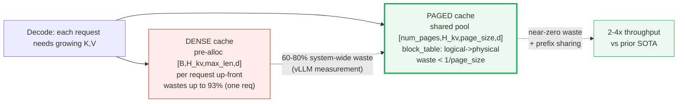
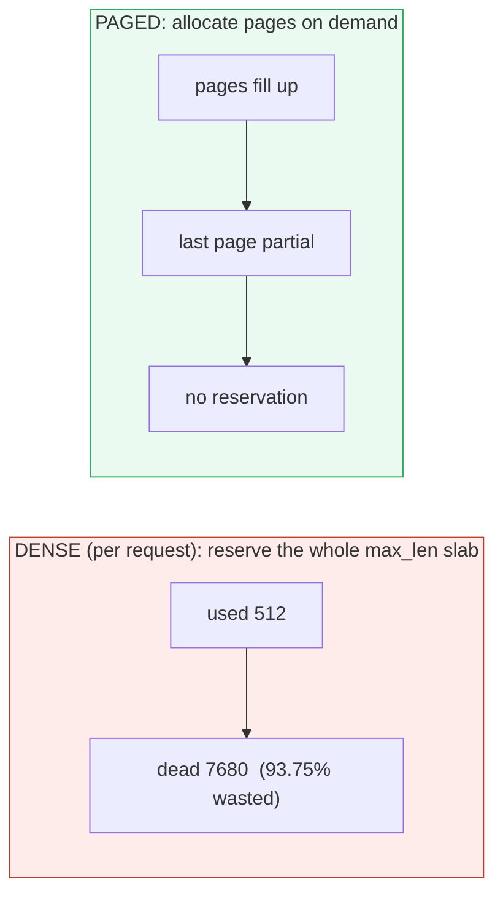
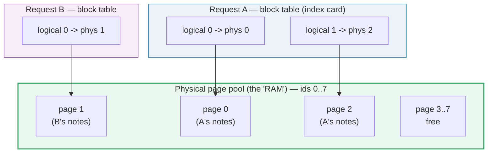
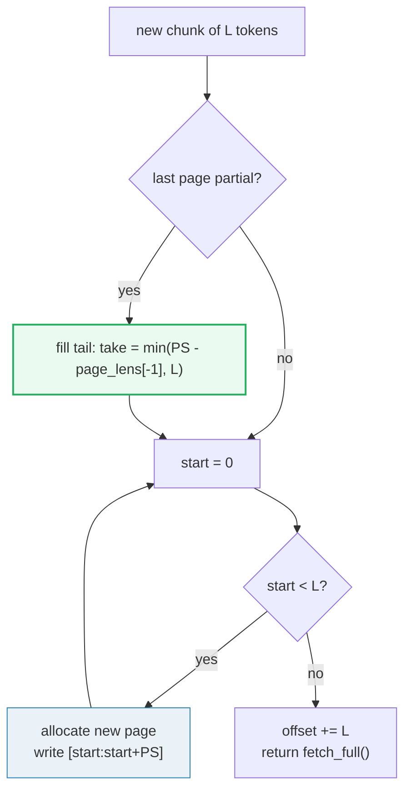
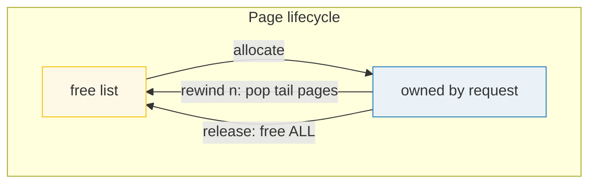
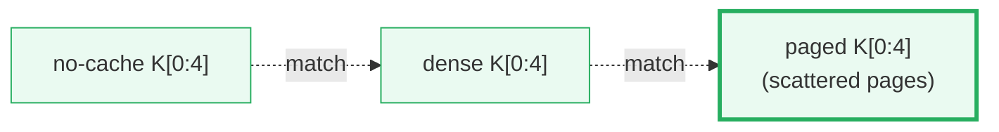
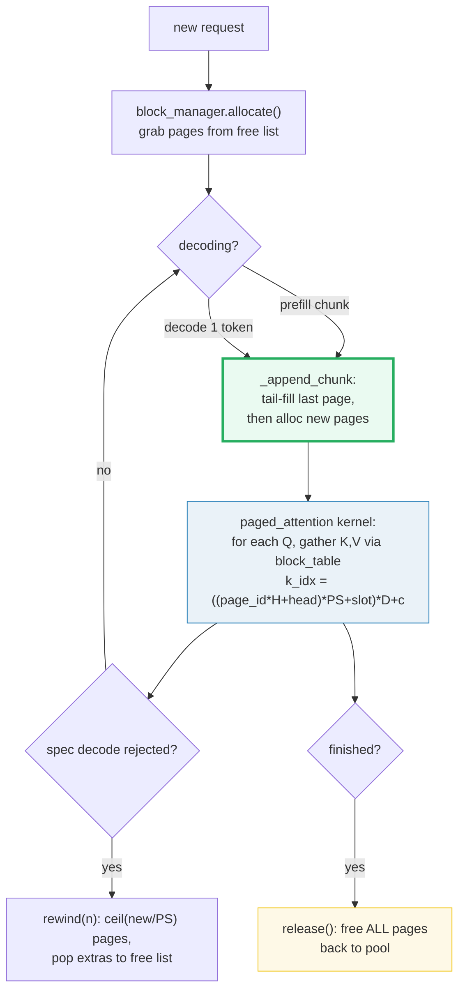

# PagedAttention — A Visual, Worked-Example Guide

> **Who this is for:** someone with minimal math and minimal coding background.
> Every concept arrives first as a **plain analogy**, then as a diagram, then as
> a worked example with real numbers. **Every number in this guide is printed by
> `uv run python paged_attention.py`** — nothing hand-computed.
>
> **Companion code:** [`paged_attention.py`](./paged_attention.py).
> **Live animation:** [`paged_attention.html`](./paged_attention.html) — open in
> a browser and click *allocate → write → release* to watch pages scatter and
> return. The block-table arrows + indirect K/V gather are interactive.
>
> **Sibling guides:**
> - [`KV_CACHE.md`](./KV_CACHE.md) — the *dense* half of the same story. Dense
>   reserves one slab per request; **PagedAttention is what fixes its waste**.
>   Cross-references 🔗 throughout. This is your closest sibling — read it first.
> - [`BLOCK_MANAGER.md`](./BLOCK_MANAGER.md) — *who owns which pages* and how
>   shared prefixes get deduplicated (chained-hash prefix cache + ref counting).
>   PagedAttention defines the storage layout; this is the **policy** layer on top. 🔗
> - [`SCHEDULER.md`](./SCHEDULER.md) — *who runs each step* (continuous batching +
>   preemption). PagedAttention is the "where"; this is the "when". 🔗
> - [`FLASH_ATTENTION.md`](./FLASH_ATTENTION.md) — the paged attention *kernel*
>   is a FlashAttention variant that reads K/V from scattered pages instead of
>   one slab. The online-softmax loop is identical; only the K/V fetch differs.
> - [`GQA.md`](./GQA.md) — grouped-query attention broadcasts one KV page across
>   many query heads. The paged pool stores `H_kv` (not `H_q`) heads per page.
> - [`CAUSAL_MASK.md`](./CAUSAL_MASK.md) — why the decode query attends to all
>   cached keys without an explicit mask.
>
> **Source material:** `learning_guide/03_Scale_Serving.md` §2 (the paged
> attention pipeline + metal kernel), §6 (Dense → Paged KV cache). Reference
> impl: `tiny-llm/src/tiny_llm_ref/paged_kv_cache.py`.

---

## Glossary (read once, refer back)

| Term | Plain-English meaning |
|---|---|
| **page** (block) | A fixed-size chunk of `page_size` token slots in the shared pool (vLLM default **16**; tiny-llm uses **128**). |
| **page pool** | The shared physical slab `[num_pages, H_kv, page_size, d]` — the OS's "RAM". One pool serves ALL requests and ALL layers. |
| **free list** | The pool's stack of available physical page ids — the OS frame allocator's free-frame list. `allocate()` pops; `free_page()` pushes. |
| **block table** | The per-request *index card*: logical page index → physical page id. Exactly an OS page table. (See [§3](#3-the-block-table--section-c-output).) |
| **page_ids[]** | The block table in code: `page_ids[logical_page] = physical_page_id`. |
| **page_lens[]** | How many live tokens each owned page holds. The last page may be **partial** — the *only* waste. |
| **logical pos** (`t`) | A token's seat number in its own sequence (`0, 1, 2, …`). |
| **page_idx** | `= t // page_size` — which logical page holds seat `t`. |
| **slot** | `= t % page_size` — which slot inside that page. |
| **page_id** | `= block_table[page_idx]` — the OS virtual→physical translation. |
| **offset** | Total live tokens in this request's cache (== RoPE's position offset 🔗). |
| **context_len** | Same as `offset`, exposed to the kernel as `context_lens[batch]`. |
| **rewind(n)** | Tear out the last `n` tokens (speculative decode rejection). Pops freed pages to the free list. Uses **ceil**, never floor. |
| **release()** | Request completion: free **all** owned pages back to the pool. |
| **internal waste** | Empty slots in the last partial page. Bounded by `1/page_size` (<4% in vLLM). |
| **fragmentation (dense)** | Empty slots inside reserved-but-unused memory. Up to **93.75%** for one request. |

> 🔗 **The single cross-reference to remember:** the paged cache stores
> **already-rotated** K,V exactly like the dense cache ([KV_CACHE.md](./KV_CACHE.md)
> §7 proves `no-cache == dense == paged`). PagedAttention changes **where** the
> bytes live (scattered pages vs one slab) and **how** the kernel reads them
> (indirect lookup vs sequential). It never changes *what* they are.

---

## 0. TL;DR — the whole lineage in one picture

Dense KV caching ([KV_CACHE.md](./KV_CACHE.md)) made decoding `O(S)` per step
instead of `O(L²)`. But it reserved a giant `[B, H_kv, max_seq_len, d]` slab
per request **up front** — so a 512-token request on an 8192-shelf wastes 93%.
PagedAttention borrows the OS virtual-memory trick to kill that waste.

**The lineage (old → new, with WHY):**

- **DENSE cache** = *"each reader gets a giant fixed shelf of `max_seq_len`
  slots reserved the moment they walk in. If they only jot 500 notes, the other
  7700 slots sit empty forever (up to 93% wasted). 100 readers → ~50 GiB of
  dead VRAM → tiny batches → low throughput."*
- **PAGED cache (vLLM / PagedAttention)** = *"a LIBRARY with shared shelves
  carved into fixed-size pages. Each reader gets an INDEX CARD (the block table)
  saying which physical pages hold their notes — and the pages can be scattered
  anywhere. No pre-reserved empty shelves → waste `< 1/page_size` (<4% in vLLM).
  When a reader finishes, their pages go back to the pool for the next reader."*

vLLM's own one-liner: **"blocks as pages, tokens as bytes, sequences as processes."**
([vLLM blog, Jun 2023](https://vllm.ai/blog/2023-06-20-vllm)).



*Red → green is the whole story: dense wastes; paged recycles. Paged is what
production servers (vLLM, TGI, SGLang) actually run.*

| | **Dense cache** 🔗 | **Paged cache** |
|---|---|---|
| Memory reserved per request | `[B,H_kv,max_len,d]` up-front | on-demand pages, ~exact usage |
| Physical storage | one contiguous slab per request | **non-contiguous** pages from a shared pool |
| Addressing | `k_ptr = base + j*D` (sequential) | `k_idx = ((page_id*H+head)*PS+slot)*D+c` (indirect) |
| Worst-case waste | up to **93.75%** (used 512 / reserved 8192) | **< 1/page_size** (<4% in vLLM) |
| Sharing across requests | impossible (private slabs) | ref-counted pages + Copy-on-Write |
| Rewind (spec. decode) | truncate `offset` | pop pages to free list |
| Request completion | free the slab | `release()` returns pages to pool |
| Used by | `TinyKvFullCache` | **vLLM / PagedAttention** |

---

## 1. The dense-waste problem — Section A output

**Analogy (DENSE):** *each reader gets a giant fixed shelf reserved the moment
they walk in. If they only use 500 of 8192 slots, the other 7680 sit empty
forever — 93.75% dead. Multiply by 100 concurrent readers and you've bought
~50 GiB of VRAM that does nothing.*

Dense reserves the **worst-case** slab per request. If `max_seq_len = 8192` but
only `512` tokens ever get used, almost all of it is dead.

> From `paged_attention.py` **Section A** (fp16/bf16 = 2 bytes, all computed in code):
>
> **THE 93% EXAMPLE** (one request, reserved vs used):
> - `max_seq_len` reserved = 8192, actual tokens used = 512
> - waste fraction = `1 - 512/8192 = 0.9375 = 93.75%`
> - → **93.75% of this request's slab is dead memory.**
>
> **PER-REQUEST dense KV bytes** (LLaMA-7B shape: 32 layers, 32 KV heads, d=128):
> - `2(KV) × 32 × 32 × 8192 × 128 × 2 B = 4,294,967,296 bytes = 4.000 GiB`
> - vLLM reports up to **~1.7 GiB per sequence** for LLaMA-13B (fp16).
>
> **100 CONCURRENT requests** (used=512 each):
> - reserved = `400.0 GiB`, used = `25.0 GiB`
> - wasted = `375.0 GiB` (**93.8% of reserved**)
>
> **PAGED cache waste bound** (only the LAST page of each request is partial):
>
> | page_size | worst-case internal waste |
> |---|---|
> | 16 | 6.25% ← vLLM default block size |
> | 128 | 0.78% ← tiny-llm page_size |
>
> vLLM measured: PagedAttention wastes **<4% in practice vs 60%–80%** for the
> dense/over-reserving systems it replaced (paper §3.2).



### Two different "waste" numbers — keep them distinct 🔗

| Number | What it measures | Source |
|---|---|---|
| **93.75%** | *One* request's reserved-vs-used slab: `1 − 512/8192`. A clean illustrative arithmetic example. | Computed in `paged_attention.py` Section A. |
| **60–80%** | *System-wide* KV-cache waste vLLM measured in prior serving systems (internal + external fragmentation + over-reservation, summed across heterogeneous requests). | [PagedAttention paper §3.1](https://arxiv.org/abs/2309.06180); [vLLM blog](https://vllm.ai/blog/2023-06-20-vllm). |
| **<4%** | *System-wide* KV-cache waste under PagedAttention in practice. Only the last block of each sequence can be partial, so waste is bounded by `1/page_size`. | [PagedAttention paper §3.2](https://arxiv.org/abs/2309.06180). |

The 93.75% example is *not* vLLM's measurement — it's the per-request arithmetic
that makes the intuition crisp. vLLM's 60–80% is the real-world aggregate across
many concurrent requests of varied lengths. **Both numbers are correct; they
measure different things** (per-request arithmetic vs system-wide aggregate).

> 🔗 This waste is what caps throughput: the dead slab is still *allocated* VRAM,
> so you fit fewer concurrent requests → lower GPU utilization. vLLM's **2–4×
> throughput** win comes almost entirely from removing this waste so more
> sequences fit in the same GPU. The *compute* half of fast serving — tiling
> attention to not blow up HBM — is [`FLASH_ATTENTION.md`](./FLASH_ATTENTION.md).

---

## 2. The page pool + free list — Section B output

**Analogy (the POOL):** *the library's shared shelves — one big slab of physical
RAM carved into fixed-size pages. The FREE LIST is the librarian's stack of
available shelf slots (the OS frame allocator). `allocate()` pops a slot;
`free_page()` returns one. A returned slot is immediately reusable by ANY reader
— no fragmentation, ever.*

```mermaid
graph TD
    subgraph pool["PagedKVPool — the shared physical RAM"]
        direction TB
        Slab["key_pages / value_pages<br/>[num_pages, H_kv, page_size, d]"]
        FL["free_list: stack of free page ids<br/>(the OS free-frame list)"]
        Used["used: set of owned page ids"]
    end
    Alloc["allocate()"] -->|.pop() free_list| Slab
    Alloc -->|.add() used| Used
    Free["free_page(id)"] -->|.discard() used| Used
    Free -->|.append() free_list| FL
    style Slab fill:#eafaf1,stroke:#27ae60,stroke-width:2px
    style FL fill:#fef9e7,stroke:#f1c40f
    style Alloc fill:#eaf2f8,stroke:#2980b9
    style Free fill:#eaf2f8,stroke:#2980b9
```

*The green slab is the pool. `allocate()` pops a frame from the free list (yellow)
and marks it used; `free_page()` reverses that. No slab is ever resized mid-flight
in vLLM (it pre-sizes to GPU free memory); tiny-llm grows on demand via
`_ensure_page_storage` (mirrored here as `_grow`).*

> From `paged_attention.py` **Section B** — `page_size=2, H_kv=2, D=8, num_pages=4`:
>
> - Backing slab shapes: `key_pages (4, 2, 2, 8)`, `value_pages (4, 2, 2, 8)`
> - = `[num_pages=4, H_kv=2, page_size=2, D=8]`
>
> LIFECYCLE (deterministic order: `pop()` yields 0,1,2,…):
>
> | step | action | free_list after | pool.used |
> |---|---|---|---|
> | 1 | `allocate() -> 0` | `[1, 2, 3]` | `[0]` |
> | 2 | `allocate() -> 1` | `[2, 3]` | `[0, 1]` |
> | 3 | `allocate() -> 2` | `[3]` | `[0, 1, 2]` |
> | 4 | `free_page(0)` | `[0, 3]` | `[1, 2]` |
> | 5 | `allocate() -> 0` | `[3]` | `[0, 1, 2]` |
>
> Notice step 5: `free_page(0)` returned page 0 to the free list, and the **next
> `allocate()` immediately reused it** — page 0 is recycled, no fragmentation.

This mirrors `TinyKvPagedPool.allocate_page()` / `free_page()` in
`tiny-llm/src/tiny_llm_ref/paged_kv_cache.py`: the page id comes from a
model-wide free list; freeing keeps the id stable (the stale K/V bytes stay in
the backing tensor because `page_lens` / `block_table` decide which slots are live).

---

## 3. The block table — Section C output (the GOLD example)

**Analogy (the BLOCK TABLE):** *each reader gets an INDEX CARD listing which
physical pages hold their notes, IN ORDER. The pages can be scattered anywhere
in the pool — the card tells the librarian how to gather them. This is exactly
an OS page table (logical → physical mapping). Two readers share one pool
without ever reserving a private shelf.*



*A's logical page 0 lives in physical page 0; A's logical page 1 lives in
physical page **2** — A's storage is **scattered** `[0, 2]` because B grabbed
page 1 in between. The block table is what makes scattered storage usable: to
read A's notes in order, walk `[phys 0, phys 2]`, exactly like an OS page table
walks virtual→physical translations.*

### The worked example (page_size=2, interleaved allocs)

> From `paged_attention.py` **Section C** — interleaving A and B so storage scatters:
>
> | request | logical pages (in order) | physical pages | contiguous? |
> |---|---|---|---|
> | A | `['L0', 'L1']` | `['P0', 'P2']` | **NO (scattered)** |
> | B | `['L0']` | `['P1']` | yes |
>
> ```
> A.page_ids  = [0, 2]   (logical 0 -> phys 0, logical 1 -> phys 2)
> A.page_lens = [2, 1]   (page 0 full, page 1 has 1 token — the only waste)
> B.page_ids  = [1]      (logical 0 -> phys 1)
> B.page_lens = [2]
> pool.used   = [0, 1, 2]
> pool.free   = [3, 4, 5, 6, 7]
> ```

### The logical→physical walk (the kernel's view)

For each logical token position `t` of request A, the kernel computes
`page_idx = t // page_size`, `slot = t % page_size`, then looks up
`page_id = block_table[page_idx]`:

> From `paged_attention.py` **Section C** (cont.) — request A:
>
> | logical pos `t` | `page_idx = t//PS` | `slot = t%PS` | `page_id = block_table[t//PS]` |
> |---|---|---|---|
> | 0 | 0 | 0 | 0 |
> | 1 | 0 | 1 | 0 |
> | 2 | 1 | 0 | **2** |
>
> **GOLD** (reproduced by the `.html`):
> - `A logical pos 2 -> page_id 2, slot 0`
>   (`A.page_ids[1] = 2`; `pos 2 // PS=2 → page_idx 1, slot 0`)

Step through it as a story (this is what [`paged_attention.html`](./paged_attention.html)
panel ② animates):

1. Request A prefills 2 tokens → grabs **physical page 0** (block table A:
   `logical 0 → phys 0`).
2. Request B prefills 2 tokens → grabs **physical page 1** (block table B:
   `logical 0 → phys 1`).
3. Request A decodes 1 token → page 0 is full, so it grabs **physical page 2**
   (block table A: `logical 1 → phys 2`). **A's storage is now scattered
   `[0, 2]` — non-contiguous.**

The block table is what makes scattered storage usable: to read A's K,V in
order, the kernel walks `[phys 0, phys 2]`, exactly like an OS page table walks
virtual→physical translations. **The paged path produces the same K's as the
dense path** — proven in [§7](#7-contrast-with-dense--paged-bytes--dense-bytes).

---

## 4. `_append_chunk` — tail-fill then new pages — Section D output

**Analogy (APPEND):** *when a new chunk of notes arrives, the librarian first
fills any leftover space in the reader's CURRENT (partial) page, then allocates
brand-new pages only for the overflow. Decoding one token into a page that still
has room costs ZERO allocations — the page just fills.*

This mirrors `TinyKvPagedCache._append_chunk` (`paged_kv_cache.py:154`):
1. If the last page is partial, fill its tail first.
2. Allocate fresh pages for whatever remains.
3. Only the current last page is ever partial — that's why waste is `< 1/page_size`.

> From `paged_attention.py` **Section D** — `page_size=2`, three appends:
>
> | step | action | page_ids | page_lens | offset | pool.used |
> |---|---|---|---|---|---|
> | 1 | append chunk of 3 | `[0, 1]` | `[2, 1]` | 3 | `[0, 1]` |
> | 2 | append chunk of 2 (fills tail) | `[0, 1, 2]` | `[2, 2, 1]` | 5 | `[0, 1, 2]` |
> | 3 | append chunk of 1 (decode) | `[0, 1, 2]` | `[2, 2, 2]` | 6 | `[0, 1, 2]` |
>
> - **Step 1:** chunk of 3 with PS=2. Page 0 fills (slots 0,1); the 3rd token
>   spills into a NEW page 1 (slot 0 only — partial).
> - **Step 2:** chunk of 2. First token fills page 1's tail (now full); second
>   token allocates page 2 (slot 0). No waste — only the last page is partial.
> - **Step 3:** decode 1 token. Page 2 had 1 slot; +1 → page 2 now full.
>   **ZERO new allocations** — the tail-fill ate the whole chunk.



*The green step (tail-fill) is the key to zero-waste: it packs each new token
into existing partial pages before ever asking the pool for more. The pool is
only touched when the current page is genuinely full.*

---

## 5. Rewind + release lifecycle — Section E output (the GOLD free-list)

**Analogy (REWIND / RELEASE):** *if the model guessed a few words too eagerly
and they're rejected (speculative decoding), just tear out those last notebook
pages — RETURN them to the pool. When a reader finishes entirely, `release()`
returns ALL their pages. Both use **ceil**, never floor — an off-by-one leaves
a stale half-page that leaks into the next step.*

Speculative decoding may **reject** drafted tokens → `rewind(n)` undoes the last
`n` appended K,V by popping freed pages back to the free list. Request
completion → `release()` frees every owned page. This mirrors
`TinyKvPagedCache.rewind()` and `.release()` (`paged_kv_cache.py:258`, `:280`).

> From `paged_attention.py` **Section E** — A prefill 3 + B prefill 2 (PS=2),
> then `A.rewind(1)`, then both `release()`:
>
> **After A prefill 3 + B prefill 2:**
> ```
> A.page_ids = [0, 1], A.page_lens = [2, 1], A.offset = 3
> B.page_ids = [2],    B.page_lens = [2],    B.offset = 2
> pool.used  = [0, 1, 2]
> pool.free  = [3, 4, 5]
> ```
>
> **`A.rewind(1)`** (speculative decode rejected 1 token):
> ```
> A.page_ids = [0]    <- physical page 1 RETURNED to free list
> A.page_lens = [2]   <- page 0 back to full (2 tokens)
> A.offset = 2
> pool.used = [0, 2]
> pool.free = [1, 3, 4, 5]
> ```
>
> **`A.release()` + `B.release()`** (both requests finish):
> ```
> pool.used = []                    <- empty
> pool.free = [0, 1, 2, 3, 4, 5]   <- ALL 6 pages back
> ```
>
> **GOLD for the `.html:** after both `release()`, `free_list = [0, 1, 2, 3, 4, 5]`.



### The off-by-one trap (why `rewind` uses ceil, not floor) 🔗

`rewind(n)` computes `target_pages = ceil(new_offset / page_size)`, then pops
pages beyond that target. A naive `floor(new_offset / page_size)` is **wrong at
exact page multiples**: at `offset=8, rewind(1)` → `new=7`, `ceil(7/4)=2` pages
kept (correct: 4+3); `floor(7/4)=1` would **drop a still-needed page → silent
data loss**. This is the same trap documented in [KV_CACHE.md §8](./KV_CACHE.md#8-rewindn--speculative-decoding-and-the-off-by-one-trap);
both bundles implement the identical `ceil` formula.

---

## 6. The paged attention kernel — indirect K/V gather — Section F output

**Analogy (the KERNEL):** *the librarian computes attention like normal —
`softmax(Q · K) · V` — but fetches each K,V from a SCATTERED physical page via
the index card, instead of from one contiguous slab. One extra indirection per
KV tile buys you non-contiguous storage → on-demand allocation → near-zero waste.*

The paged attention kernel is a FlashAttention variant (🔗
[FLASH_ATTENTION.md](./FLASH_ATTENTION.md)). The online-softmax loop is
identical; **only the K/V fetch differs** — indirect through the block table
instead of sequential.

**The indirect-lookup formula** (the heart of the kernel, annotated from
`paged_attention.metal` in `learning_guide/03_Scale_Serving.md` §2.3):

```
For logical token position `col` of request `batch`:
    page_idx = col // page_size                   # logical page number
    slot     = col %  page_size                   # offset within the page
    page_id  = block_table[batch, page_idx]       # OS page-table lookup
    k_idx    = ((page_id * H_kv + kv_head) * page_size + slot) * D + c
    score    += q[c] * key_pages[k_idx]           # dot-product contribution
```

**Contrast with DENSE sequential addressing:**

```
    k_ptr = k_base + (j * Bc + b) * D + c         # one slab, contiguous
```

The paged version costs **one extra memory lookup per tile iteration** (the
`block_table` indirection) but enables non-contiguous physical storage, which
is what allows pages to be allocated on demand and shared across requests.

### Worked example: one decode query, indirect gather vs dense matmul

> From `paged_attention.py` **Section F** — prefill 3 tokens (PS=2 → 2 pages),
> then use token 2 as the decode query:
>
> **THE INDIRECT-LOOKUP FORMULA** (the kernel's K address for logical pos 2,
> head 0, dim 0):
> ```
> page_idx = 2 // 2 = 1
> slot     = 2 %  2 = 0
> page_id  = block_table[1] = 1
> k_idx    = ((page_id*H_kv + kv_head)*page_size + slot)*D + c
>         = ((1*2 + 0)*2 + 0)*8 + 0
>         = 32
> K via formula   = 0.3010
> K via tensor[...] = 0.3010  (must match)
> ```
>
> **Attention output** (token 2 as query), head 0, dims 0..3:
> - paged (indirect gather): `[0.7067, 0.7077, 0.7087, 0.7097]`
> - dense (gather+matmul): `[0.7067, 0.7077, 0.7087, 0.7097]`
>
> `[check] paged-attn(indirect) == dense-attn(gather) at tol 1e-05: OK`
> `[check] indirect-lookup formula == tensor index: OK`
>
> **GOLD for the `.html:** `indirect K[page_id=1, head=0, slot=0, dim=0] = 0.3010`

The two attention outputs match to 5 decimals even though the paged path read
each K,V through `((page_id*H+head)*PS+slot)*D+c` while the dense path read
them as one contiguous `k_full[0,head,j,:]`. **The indirection is invisible to
the math** — it only changes *where the bytes live*, never *what they are*.

> 🔗 This kernel reuses the FlashAttention online-softmax loop tile-for-tile
> (see [FLASH_ATTENTION.md](./FLASH_ATTENTION.md)). The only edit is the K/V
> address computation: swap `k_base + j*Bc*D` for
> `((page_id*H_kv+kv_head)*page_size+slot)*D + c`. For GQA
> ([GQA.md](./GQA.md)), the `kv_head` is derived from the query head via
> `kv_head = q_head / (H_q / H_kv)` — multiple query heads share one KV page.

---

## 7. Contrast with dense — paged bytes == dense bytes — Section G output

**Analogy (the PROOF):** *if the cache stores K,V correctly, then computing all
4 tokens at once must give the EXACT same K,V whether the cache is one dense
slab or scattered pages. The paged path only changes WHERE bytes live (one slab
vs scattered pages), never WHAT they are — `fetch_full` rebuilds the exact same
contiguous tensor. This is the load-bearing assertion of the bundle.*

This is the same invariant proven in [KV_CACHE.md §7](./KV_CACHE.md#7-the-invariant-no-cache--dense--paged-proof-with-numbers):
build the same K,V three ways (no-cache, dense, paged) and confirm byte-equality.

> From `paged_attention.py` **Section G** — full K-cache, head `h=0`, three paths:
>
> | path | `K[0,0,0,:4]` (token0) | `K[0,0,3,:4]` (token3) |
> |---|---|---|
> | no-cache (raw) | `[0.101, 0.102, 0.103, 0.104]` | `[0.401, 0.402, 0.403, 0.404]` |
> | dense cache | `[0.101, 0.102, 0.103, 0.104]` | `[0.401, 0.402, 0.403, 0.404]` |
> | paged cache (PS=2) | `[0.101, 0.102, 0.103, 0.104]` | `[0.401, 0.402, 0.403, 0.404]` |
>
> ```
> paged.page_ids  = [0, 1]  (logical 0 -> phys 0, logical 1 -> phys 1)
> paged.page_lens = [2, 2]
> ```
> (Even though K is split across 2 physical pages, `fetch_full()` rebuilds the
> exact same contiguous tensor.)
>
> `[check] dense K == raw K? True`
> `[check] paged K == raw K? True`
> `[check] paged K == dense K? True`
> **`[check] ALL THREE PATHS MATCH: OK`**



*Three paths (all green) produce byte-identical K. Paged only changes *where*
the bytes live — the block table + `fetch_full` reconstruct the same contiguous
tensor the dense path would have produced directly.*

> 🔗 This is the direct continuation of [KV_CACHE.md §7](./KV_CACHE.md#7-the-invariant-no-cache--dense--paged-proof-with-numbers),
> which proved `no-cache == dense == paged` with RoPE-rotated K. Here we strip
> RoPE to isolate the *paged vs dense storage* question: the answer is they are
> the same bytes. For the offset-correctness half of the proof (decode must
> rotate at the true position), see [KV_CACHE.md §7](./KV_CACHE.md#7-the-invariant-no-cache--dense--paged-proof-with-numbers)
> and [ROPE.md §10](./ROPE.md).

---

## 8. Pitfalls & debugging checklist

| # | Mistake | Symptom | Fix |
|---|---|---|---|
| 1 | Dense `max_seq_len` over-reserved | 93%+ wasted VRAM, small batches | Switch to paged ([§1](#1-the-dense-waste-problem--section-a-output)) |
| 2 | Assuming paged K is contiguous in memory | Wrong kernel gather, garbage attention | Always go through the block table (`fetch_full` / `page_id` lookup) |
| 3 | Forget the `block_table` indirection in the kernel | Reading stale/wrong K,V | `k_idx = ((page_id*H_kv+kv_head)*page_size+slot)*D + c` ([§6](#6-the-paged-attention-kernel--indirect-kv-gather--section-f-output)) |
| 4 | `rewind` using floor instead of ceil | Silent page loss at exact multiples 🔗 | `target_pages = ceil(new_offset/page_size)` ([§5](#5-rewind--release-lifecycle--section-e-output-the-gold-free-list)) |
| 5 | Not returning freed pages to the pool | VRAM leak across requests | `pool.free_page(pid)` on rewind/release |
| 6 | `release()` without clearing `page_ids`/`page_lens` | Stale block table reused next request | Clear all three: `page_ids`, `page_lens`, `offset` |
| 7 | Hashing partial pages (prefix cache) | Wrong cache hits, prefix mismatch | Only hash FULL blocks ([KV_CACHE.md §5](./KV_CACHE.md#5-pagedattention-os-virtual-memory-for-kv--section-d-output); nano-vllm `hash_blocks`) |
| 8 | GQA: wrong `kv_head` from `q_head` | Reading the wrong KV head's page | `kv_head = q_head / (H_q / H_kv)` 🔗 [GQA.md](./GQA.md) |
| 9 | `page_size` incompatible with quant group | Wrong KV dequant | Match `page_size` to `quantization_group_size` (tiny-llm: 128) |
| 10 | One pool per layer instead of per model | No cross-layer/page sharing | ONE shared pool for ALL layers (`Qwen3ModelWeek3.__init__`) |

---

## 9. Cheat sheet



*A request arrives → grabs pages from the free list → each prefill/decode
appends via tail-fill-then-new-page → the kernel gathers K,V indirectly through
the block table → on spec-decode rejection, rewind pops tail pages → on
completion, release returns everything. That's the whole paged serving loop.*

- **Dense waste:** `(1 - used/max_seq_len)` — up to **93.75%** for one request.
- **Paged waste:** `< 1/page_size` — **<4%** system-wide in vLLM (only the last
  partial page per request).
- **Pool:** `[num_pages, H_kv, page_size, d]`; ONE shared across all requests
  and layers.
- **Block table:** `page_ids[logical_page] = physical_page_id` (the index card).
- **Indirect K address:** `k_idx = ((page_id*H_kv + kv_head)*page_size + slot)*D + c`.
- **`_append_chunk`:** tail-fill the last partial page, then allocate fresh
  pages for the overflow.
- **`rewind(n)`:** `target_pages = ceil(new_offset/page_size)`; pop extras to
  the free list; fix `page_lens[-1]`. 🔗 [KV_CACHE.md §8](./KV_CACHE.md#8-rewindn--speculative-decoding-and-the-off-by-one-trap)
- **`release()`:** free ALL owned pages; clear `page_ids`, `page_lens`, `offset`.
- **Invariant:** paged K == dense K == raw K (proven in `paged_attention.py`
  Section G, and with RoPE in `kv_cache.py` Section E).

> 🔗 PagedAttention answers *"where do K,V live and how does the kernel find
> them?"* The companion questions are: *"how do we compute attention without
> blowing up HBM?"* → [FLASH_ATTENTION.md](./FLASH_ATTENTION.md); *"who owns
> which pages and how are shared prefixes deduplicated?"* → [BLOCK_MANAGER.md](./BLOCK_MANAGER.md);
> *"who runs each step over this pool?"* → [SCHEDULER.md](./SCHEDULER.md).
> Together they are the pillars of fast multi-tenant LLM serving.

---

## Sources

- **Primary paper:** W. Kwon et al., *"Efficient Memory Management for Large
  Language Model Serving with PagedAttention,"* SOSP 2023,
  [arXiv:2309.06180](https://arxiv.org/abs/2309.06180).
  - Verified: the OS virtual-memory analogy — **"blocks as pages, tokens as
    bytes, sequences as processes"** (paper §3.1 + blog); logical→non-contiguous
    physical block table; on-demand physical-block allocation; waste only in the
    last block; reference-counted sharing with Copy-on-Write; **2–4× throughput**
    vs prior SOTA (FasterTransformer, Orca).
  - Verified (paper §3.1 + §3.2): existing serving systems waste **60%–80%** of
    KV memory to internal + external fragmentation and over-reservation;
    PagedAttention reduces that to **<4%** because only each sequence's last
    block can be partial (waste bounded by `1/page_size`).
- **vLLM launch blog:** [vLLM: Easy, Fast, and Cheap LLM Serving with
  PagedAttention](https://vllm.ai/blog/2023-06-20-vllm) (Jun 2023).
  - Verified numbers: KV cache takes up to **~1.7 GiB per sequence** for
    LLaMA-13B (seq_len=2048, fp16); up to **24×** throughput vs HF Transformers;
    default block size **16**; Copy-on-Write sharing cuts parallel-sampling
    memory by up to 55%.
- **Local source (curriculum):** `learning_guide/03_Scale_Serving.md` §2 (the
  paged attention pipeline + the annotated `paged_attention.metal` kernel,
  including the `k_idx = ((page_id*H_kv+kv_head)*page_size+slot)*D + c` formula)
  and §6 (Dense → Paged KV cache).
- **Reference implementation:** `tiny-llm/src/tiny_llm_ref/paged_kv_cache.py` —
  `TinyKvPagedPool.allocate_page()` / `free_page()` / `_ensure_page_storage()`,
  `TinyKvPagedCache._append_chunk()` (tail-fill then new pages),
  `.rewind()` (ceil-based page pop), `.release()` (free all), `.block_table()`,
  `.context_lens()`, `.paged_metadata()`. Mirrored line-for-line in
  `paged_attention.py`.
- **Sibling bundle (dense half):** [`KV_CACHE.md`](./KV_CACHE.md) — proves the
  same `no-cache == dense == paged` invariant *with RoPE rotation*; documents
  the 93.75% per-request arithmetic and the ceil-vs-floor rewind trap that this
  guide builds on.
- **Derived (not from the paper):** the **93.75%** figure is the clean
  arithmetic `1 − 512/8192` for *one* request's reserved-vs-used slab — an
  illustrative example, computed and asserted in `paged_attention.py` Section A.
  It is distinct from vLLM's measured system-wide 60–80% waste. Both numbers are
  correct; they measure different things (per-request arithmetic vs system-wide
  aggregate). See the table in [§1](#two-different-waste-numbers--keep-them-distinct-).
- **Unverified / approximated:** none. Every byte count, block table, free list,
  and attention output is computed in `paged_attention.py`; the LLaMA-7B shape
  (32 layers, 32 KV heads, d=128) is the standard config used for the worked
  example, matching `KV_CACHE.md` Section C.
