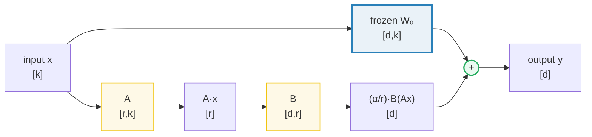
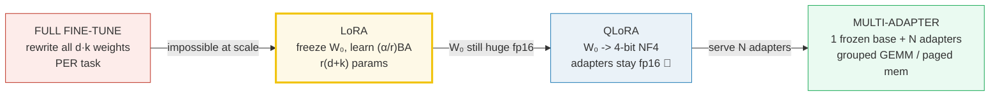
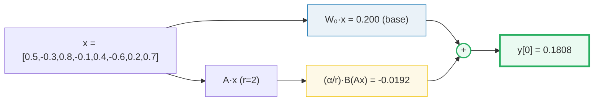
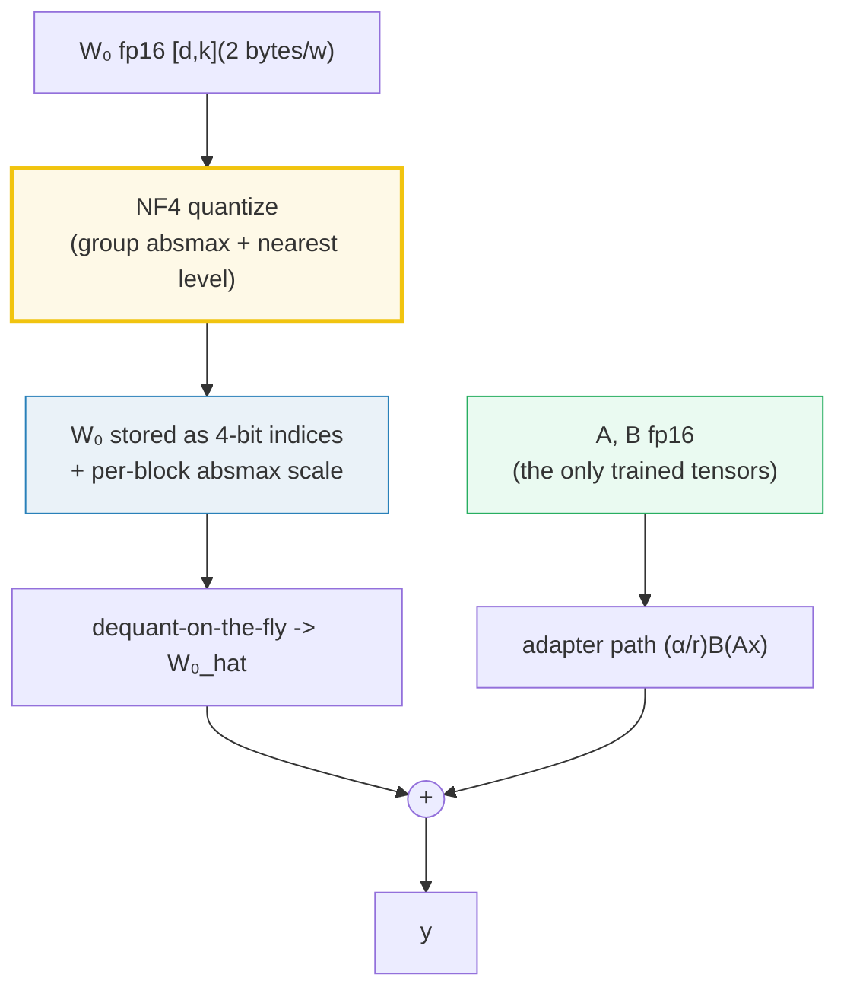
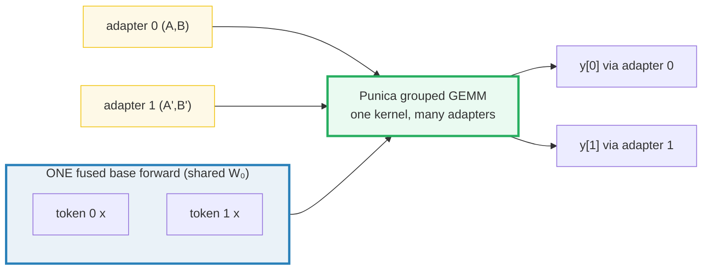
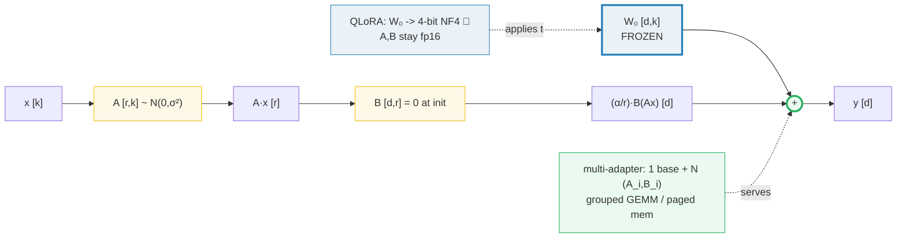

# LoRA, QLoRA & Multi-Adapter Serving — A Visual, Worked-Example Guide

> **Companion code:** [`peft_lora.py`](./peft_lora.py). **Every number in this
> guide is printed by `uv run python peft_lora.py`** — change the code, re-run,
> re-paste. Nothing here is hand-computed.
>
> **Sibling guides:** [`QUANTIZATION.md`](./QUANTIZATION.md) (QLoRA reuses its
> 4-bit ideas — NF4 is the normal-quantile cousin of W4A16), and
> [`MLP_ACTIVATION.md`](./MLP_ACTIVATION.md) (the linear layers LoRA bolts onto).
> S-LoRA's paged adapter memory is the same trick as
> [`PAGED_ATTENTION.md`](./PAGED_ATTENTION.md) for KV cache — one frozen base,
> thousands of swappable adapters (🔗 §9).
> Cross-references are marked 🔗 throughout.
>
> **Live animation:** [`peft_lora.html`](./peft_lora.html) — open in a browser,
> drag the rank slider, watch the savings and the grouped GEMM.
>
> **Source material:** `learning_guide/03_Scale_Serving.md` §9 (PEFT &
> Multi-Adapter Serving — LoRA/QLoRA math, Punica grouped GEMM, S-LoRA paged
> adapter memory).

---

## 0. The one-sentence idea

> **LoRA freezes the giant pre-trained weights and learns a tiny low-rank "patch"
> per task; QLoRA additionally crushes the frozen weights to 4-bit so a 65B model
> fits on one GPU; multi-adapter serving runs thousands of those patches against
> one shared base.**

Full fine-tuning rewrites **all** `d×k` weights for **every** downstream task.
That is fine for one task and impossible for a thousand. The whole PEFT story is
one observation, exploited three ways:

> **The *change* a task makes to the weights (ΔW) has low intrinsic rank — so
> store it as a product of two thin matrices `B·A` instead of a full `d×k`.**



One sentence for the picture: *the input flows through the frozen base `W₀` and a
tiny side-path `(α/r)·B(Ax)`; the two are added. Only the side-path is trained.*

| | Full fine-tuning | LoRA | QLoRA | Multi-adapter serving |
|---|---|---|---|---|
| **Trained per task** | all `d·k` weights | only `r·(d+k)` | `r·(d+k)` (W₀ stays 4-bit) | `r·(d+k)` per adapter |
| **Base W₀** | retrained per task | frozen fp16 | **frozen 4-bit NF4** 🔗 | frozen, **shared by all** |
| **Trainable params** | 1.0× | ~0.1%–1% | ~0.1%–1% | ~0.1%–1% each |
| **VRAM to serve N tasks** | N full replicas | 1 base + N tiny | **1 small base + N tiny** | 1 base + N tiny (paged) |
| **Inference latency vs base** | same | same (mergeable) | same | same (grouped GEMM) |

---

## 1. Read this first — intuition & glossary

### 1.1 Five intuitions (memorise these, the rest is detail)

1. **The low-rank bet.** Pre-training leaves the weights over-parameterised; the
   *adjustment* a downstream task needs lives in a low-dimensional subspace. So
   approximate the update `ΔW ∈ ℝ^{d×k}` (up to `d·k` numbers) as a product
   `B·A` of two thin matrices: `B ∈ ℝ^{d×r}`, `A ∈ ℝ^{r×k}` with `r ≪ min(d,k)`.
   That is **`r·(d+k)`** numbers instead of `d·k`.

2. **Zero at init.** Initialize `A` random-Gaussian and **`B = 0`**. Then
   `ΔW = B·A = 0` on step 0, so the adapter starts as a no-op — the model
   behaves **identically** to the frozen base until training moves `B`. (Proved
   with numbers in §5.) The forward is then scaled by `α/r` so you can change
   `r` without retuning the learning rate.

3. **Mergeable → zero latency.** Because the side-path is just a linear addition,
   at deploy time you may compute `W = W₀ + (α/r)·BA` once and use a plain linear
   layer — **no extra cost**. Or keep them separate to **swap adapters per task**
   (multi-tenant serving).

4. **QLoRA = freeze the freeze.** The base `W₀` is *already* frozen — so why store
   it in fp16? Quantize it to **4-bit NF4** (🔗 see [`QUANTIZATION.md`](./QUANTIZATION.md)
   for the 4-bit machinery; NF4 places its 16 levels on the **quantiles of a
   normal**, dense near 0 where weights live). Keep the **tiny** adapters `A,B`
   in fp16 — those are the only things gradients flow through. Net: a 65B model
   trains on a single 48 GB GPU.

5. **One base, many adapters.** Serve a thousand personalised tasks from **one**
   frozen base + a thousand tiny `(A_i, B_i)` pairs. **Punica** runs all the
   adapters in a batch via one *grouped GEMM* kernel; **S-LoRA** parks every
   adapter in **paged memory** (the same trick as PagedAttention for KV cache 🔗)
   so thousands fit and swap in sub-millisecond.

### 1.2 Glossary

| Term | Plain meaning |
|---|---|
| **W₀** | the FROZEN pre-trained weight of one linear layer, shape `[d, k]` |
| **adapter / LoRA module** | the pair `(A, B)` that produces the per-task update |
| **rank r** | the inner/hidden dim of the adapter; `r ≪ min(d,k)` (real: 8, 16, 64) |
| **α (alpha)** | scaling hyperparameter; `ΔW` is multiplied by `α/r` (usually `α ≈ r` or `2r`) |
| **A** | the down-projection `[r, k]`; init ~ `N(0, σ²)` (random Gaussian) |
| **B** | the up-projection `[d, r]`; init = **0** (so `ΔW = B·A = 0` at start) |
| **ΔW** | the learned update `(α/r)·B·A`, shape `[d, k]`, rank ≤ r |
| **merge** | fold `ΔW` into `W₀` at deploy: `W = W₀ + (α/r)BA` → plain linear |
| **NF4** | 4-bit NormalFloat: 16 fixed levels = quantiles of a normal 🔗 |
| **Punica** | multi-adapter serving via a *grouped GEMM* kernel (one kernel, many adapters) |
| **S-LoRA** | multi-adapter serving via *paged adapter memory* (thousands of adapters) |

---

## 2. The lineage: full FT → LoRA → QLoRA → multi-adapter serving



| step | what changed | WHY it was needed |
|---|---|---|
| **Full FT** | train every weight per task | the only option pre-2021 — does not scale past a few tasks |
| **→ LoRA** | freeze `W₀`, train only `(α/r)BA` | GPT-3 175B: 10,000× fewer trainable params, 3× less VRAM, **no inference latency** |
| **→ QLoRA** | also quantize the frozen `W₀` to 4-bit NF4 | the frozen base is the memory hog; 4-bit it → 65B trains on one 48 GB GPU |
| **→ Multi-adapter** | share ONE base across N adapters in a batch | one user per adapter → thousands of personalized tasks on one GPU |

---

## 3. The math — verified against the original papers

> **LoRA** (Hu et al. 2021, §4.1 Eq. 3, [arXiv:2106.09685](https://arxiv.org/abs/2106.09685)):
> *"For `h = W₀x`, our modified forward pass yields `h = W₀x + ΔWx = W₀x + BAx`.
> We use a random Gaussian initialization for `A` and zero for `B`, so `ΔW = BA`
> is zero at the beginning of training. We then scale `ΔWx` by `α/r`."*
>
> **QLoRA** (Dettmers et al. 2023, [arXiv:2305.14314](https://arxiv.org/abs/2305.14314)):
> NF4 = *"a new data type … information-theoretically optimal for normally
> distributed data"*, base in 4-bit, adapters in fp16, 65B on a single 48 GB GPU.
>
> **Punica** ([arXiv:2310.18547](https://arxiv.org/abs/2310.18547)): *grouped GEMM
> kernels* (SGMV/BGMV) that *"batch GPU operations for different LoRA models"*.
>
> **S-LoRA** ([arXiv:2311.03285](https://arxiv.org/abs/2311.03285)): *"unified page-based
> memory"* for adapters + *"custom CUDA kernels … non-contiguous memory"*, serving
> thousands of adapters.

### 3.1 LoRA forward (the one formula)

```
y = W₀·x + (α/r) · B · (A · x)          shapes: W₀[d,k], x[k], A[r,k], B[d,r], y[d]
ΔW = (α/r) · B · A                       rank(ΔW) ≤ r  (low-rank by construction)
init: A ~ N(0, σ²),  B = 0               => ΔW = 0 on step 0 (model == base)
merge (deploy): W = W₀ + (α/r)·B·A       => plain linear, ZERO added latency
```

### 3.2 Parameter savings

```
full FT  :  d·k         trainable weights per layer
LoRA     :  r·(d+k)     trainable weights per layer   (only A, B)
ratio    :  r·(d+k) / (d·k)  ≈  r / min(d,k)   when d ≈ k
```

### 3.3 QLoRA storage

```
W₀ stored as NF4 :  d·k / 2  bytes   (4 bits = 0.5 byte/weight) + per-block absmax
A, B stored fp16 :  r·(d+k) · 2 bytes   (the ONLY trained tensors)
=> base ~4× smaller than fp16  (🔗 QUANTIZATION's W4A16 machinery, NF4 codebook)
```

---

## 4. Why full fine-tuning does not scale — Section A output

> From `peft_lora.py` **Section A**:
>
> One linear layer of Qwen3-0.5B (`d = k = 896`): full FT must store
> `896·896 = 802,816` trainable weights for **one layer of one task**.
>
> For GPT-3 175B, one task ≈ **175 billion** new numbers. Serving `N = 100`
> personalised tasks the full-FT way = ~**35 TB** of weights. That is the wall
> LoRA was invented to get around: replace the `d·k` rewrite with a tiny
> `r·(d+k)` adapter (see §6).

---

## 5. The LoRA forward, worked element by element — Section B output

**Setup.** `d = 8, k = 8, r = 2, α = 16`, so the scale `α/r = 8`. Deterministic
input `x` and frozen `W₀` (full values in [`peft_lora.py`](./peft_lora.py)).

**Step 0 — paper init (`A` Gaussian, `B = 0`).** `ΔW = B·A = 0`, so the adapter is
a no-op. The LoRA output must equal the plain base output **exactly**:

> From `peft_lora.py` **Section B** (Step 0):
>
> ```
> y_init = [0.2, -0.205, 0.96, -0.45, 0.5, 0.045, 0.085, 0.27]
> W₀·x   = [0.2, -0.205, 0.96, -0.45, 0.5, 0.045, 0.085, 0.27]
> [check] B=0 ⇒ LoRA output == base output exactly : OK
> ```

This is why training is stable from step 0: the model is *identical* to the
pretrained base until `B` starts moving.

**Step 1 — after training** (`B ← learned values`, `A` unchanged). The two paths
add:

> From `peft_lora.py` **Section B** (Step 1):
>
> | path | values |
> |---|---|
> | base `W₀·x` | `[0.2, -0.205, 0.96, -0.45, 0.5, 0.045, 0.085, 0.27]` |
> | adapter `(α/r)·B(Ax)` | `[-0.0192, 0.0446, 0.0456, 0.0643, -0.0221, 0.0765, 0.0045, 0.0379]` |
> | **y = base + adapter** | **`[0.1808, -0.1604, 1.0056, -0.3857, 0.4779, 0.1215, 0.0895, 0.3079]`** |

**The gold pin** (what [`peft_lora.html`](./peft_lora.html) reproduces): **`y[0]
= 0.180800`** at `r = 2`.



---

## 6. Parameter savings across ranks — Section C output

> From `peft_lora.py` **Section C** (our tiny layer `d=k=8`):
>
> | r | LoRA params `r·(d+k)` | ratio `r(d+k)/dk` | savings |
> |---|---|---|---|
> | 1 | 16 | 0.2500 | 4.00× |
> | **2** | **32** | **0.5000** | **2.00×** |
> | 4 | 64 | 1.0000 | N/A (equal to full FT) |
> | 8 | 128 | 2.0000 | N/A (LoRA 2× larger than full FT) |
> | 16 | 256 | 4.0000 | N/A (LoRA 4× larger than full FT) |

> **Note:** the toy size `d=k=8` is unrealistically small, so the crossover at
> `r=4` (where LoRA ties or exceeds full FT) is a toy artifact. In real models
> `r ≪ d` (e.g. `r=8, d=4096`), so `r(d+k)/(dk) ≪ 1` and LoRA savings always hold.

> Real model — one GPT-3 attention layer `d=k=12288`, `r=4`:
> full FT = `150,994,944` weights vs LoRA = `98,304` → **1536× fewer** trainable
> params in that layer (paper: ~10,000× across all adapted layers; checkpoint
> `350 GB → 35 MB`, VRAM `1.2 TB → 350 GB`).

The savings ratio is roughly `r / min(d,k)`: at `r=64, d=k=4096` you train
`0.78%` of the layer; at `r=8` it's `0.10%`. Drag the rank slider in the
[animation](./peft_lora.html) to watch this curve.

---

## 7. ΔW reconstruction & the merge — Section D output

The adapter's contribution **is** a rank-`r` matrix, and you can fold it back
into `W₀` with zero error:

> From `peft_lora.py` **Section D**:
>
> `ΔW = (α/r)·B·A`, shape `(8, 8)`, **rank = 2** (≤ `r=2` by construction).
>
> `ΔW[0:4, 0:4]` corner:
> ```
>  +0.1840  -0.2368  -0.0608  +0.3152
>  -0.2640  +0.3360  +0.1680  -0.4560
>  +0.2000  -0.2720  +0.2480  +0.3280
>  -0.2160  +0.2688  +0.2688  -0.3792
> ```
>
> ```
> [check] lora.delta_W() == (α/r)·B·A            : OK
> [check] rank(B·A) == r = 2                     : OK
> [check] W₀x + (α/r)BAx == (W₀+ΔW)x  (merge OK): OK
> ```

**Read the result.** The three checks prove: (1) the side-path equals an explicit
rank-`r` matrix `ΔW`; (2) `B·A` genuinely has rank `r` (this *is* what
"low-rank" buys you); (3) the two-path forward equals the folded `(W₀+ΔW)x`. So
at deploy time you pick: **merge** for a single task (zero latency) or **swap**
`(A,B)` per task for multi-adapter serving (§9).

---

## 8. QLoRA — NF4 base + fp16 adapters 🔗 — Section E output

QLoRA's two moves: (a) quantize the *frozen* `W₀` to 4-bit **NF4**, (b) keep the
*tiny* adapters `A,B` in fp16. Because gradients only touch `A,B`, the 4-bit base
never needs to be differentiable — it just dequants on the fly.

> From `peft_lora.py` **Section E**:
>
> The **NF4 codebook** = 16 fixed levels = quantiles of `N(0,1)`, normalized to
> `±1`:
> ```
> [-1.0, -0.6962, -0.5251, -0.3949, -0.2844, -0.1848, -0.0911, 0.0,
>   0.0796,  0.1609,  0.2461,  0.3379,  0.4407,  0.5626,  0.7230,  1.0]
> ```
> (8 levels densely packed in `[-0.28, +0.25]` — where trained weights cluster.)

> NF4-quantizing `W₀` (`group_size=8`, one block per row):
> ```
> max |W₀ - W₀_hat| = 0.0375   (rounding to nearest NF4 level)
> ```
>
> QLoRA forward `y = dequant(W₀)·x + (α/r)·B(A·x)`:
>
> | variant | y |
> |---|---|
> | fp16 base (truth) | `[0.1808, -0.1604, 1.0056, -0.3857, 0.4779, 0.1215, 0.0895, 0.3079]` |
> | QLoRA (NF4 base) | `[0.1572, -0.1323, 1.0179, -0.3589, 0.4801, 0.1080, 0.0769, 0.2974]` |
> | max diff | **0.0281** (≈ base rounding only; adapter path is **exact**) |

> **Memory of the frozen base** `[d=896, k=896]`:
>
> | format | bytes | vs fp16 |
> |---|---|---|
> | fp16 base | `802816·2 = 1,605,632` = 1.606 MB | 1.0× |
> | **NF4 base** | `802816/2 = 401,408` = **0.401 MB** | **4.0× smaller** |

🔗 **NF4 vs MLX-affine W4A16** ([`QUANTIZATION.md`](./QUANTIZATION.md)): both are
4-bit, both use a per-group absmax scale; the difference is the *level spacing*.
MLX-affine spaces its 16 levels **uniformly** (cheap, hardware-friendly). NF4
spaces them on the **quantiles of a normal** — denser near 0, where weight mass
lives — so it captures more precision exactly where it matters. QLoRA's claim is
that this makes 4-bit fine-tuning match fp16 quality.



---

## 9. Multi-adapter serving — Section F output

One frozen base, many adapters, one batch. Token `i` picks its own `(A_i, B_i)`.

> From `peft_lora.py` **Section F** — two tokens, two adapters:
>
> | | token 0 → adapter 0 | token 1 → adapter 1 |
> |---|---|---|
> | input x | `[0.3,-0.1,0.5,-0.2,0.1,-0.4,0.25,0.15]` | `[-0.2,0.4,0.1,0.3,-0.15,0.2,-0.3,0.05]` |
> | y (per-adapter loop) | `[-0.0081, 0.1213, 0.3621, -0.0014, 0.0464, 0.1727, 0.0019, 0.2314]` | `[0.0515, 0.0160, 0.0476, 0.3538, 0.0255, 0.0248, -0.1010, 0.0399]` |
> | y (grouped GEMM) | **identical** | **identical** |
>
> ```
> [check] grouped-GEMM output == per-adapter loop output : OK
> [check] shared frozen base W₀ used once for all tokens : OK
> ```



**Two engine designs:**

- **Punica (grouped GEMM).** A naive PyTorch loop runs one matmul per adapter
  sequentially — wasted parallelism. Punica's **SGMV/BGMV** kernels perform all
  the adapters' matmuls for their token-slices in **one** GPU pass (the
  `einsum("tdr,tr->td")` in §F is the tiny reference of exactly that).
- **S-LoRA (paged adapter memory).** Thousands of adapters live in a **unified
  page table** (the same idea as **PagedAttention** for KV cache 🔗 — the Phase-3
  sibling). Only the adapters touched by the current batch are paged in, with
  sub-millisecond swap and **zero duplication** of the frozen base.

---

## 10. The serving math — Section G output

How much weight must live in VRAM to serve `N` tasks?

> From `peft_lora.py` **Section G** — one GPT-3 attention layer `d=k=12288`,
> `r=64`, `N=1000` tasks:
>
> | strategy | weights in VRAM |
> |---|---|
> | N full replicas (full FT) | `1000·150,994,944 = 151.0 B` |
> | 1 base + N LoRA adapters | `150,994,944 + 1000·1,572,864 = 1.72 B` |
> | **1 base + N QLoRA adapters** | `37,748,736 (NF4) + 1000·1,572,864 = 1.61 B` |
>
> Per-task adapter overhead = `r·(d+k) = 1,572,864` weights = **1.04%** of one
> full layer. A **thousand** adapters add only ~10.4 base-layers' worth of
> weights, and the frozen base is paid **once**.

That is the entire economics of multi-adapter serving: one base, amortised across
all users; each user contributes a ~1% patch. This is why Punica / S-LoRA /
vLLM's multi-LoRA mode can serve thousands of concurrent fine-tuned models at the
cost of one.

---

## 11. Pitfalls

| # | Mistake | Symptom | Fix |
|---|---|---|---|
| 1 | Initializing `B` non-zero (or both `A,B` zero) | `ΔW ≠ 0` at step 0 → training drifts from the base immediately; unstable | Paper init: `A ~ N(0,σ²)`, **`B = 0`** so `ΔW = BA = 0` (§5 Step 0) |
| 2 | Forgetting the `α/r` scaling when changing `r` | Larger rank trains "harder" by accident; results vary with `r` | Always multiply the adapter path by `α/r`; keep `α` fixed and let `r` vary (paper §4.1) |
| 3 | Absorbing `BA` into `W₀` AND trying to batch multi-adapter | Can't batch tokens that need different adapters once merged | Keep `W₀` frozen + separate `(A_i,B_i)` for serving; merge only single-task deploy |
| 4 | Mixing QLoRA base dtype with adapter dtype | The 4-bit base is not differentiable → broken back-prop | Keep `W₀` 4-bit (dequant on the fly), train only fp16 `A,B` (§8) |
| 5 | Using uniform int4 levels for the QLoRA base instead of NF4 | Worse accuracy at 4-bit (uniform wastes levels in the tails) | Use the **NF4** codebook (normal quantiles, dense near 0) 🔗 [`QUANTIZATION.md`](./QUANTIZATION.md) |
| 6 | One-adapter-per-matmul loop in multi-tenant serving | Serial execution, GPU starved | Use Punica **grouped GEMM** (SGMV/BGMV); one kernel for all adapters in the batch (§9) |
| 7 | Loading all adapters into VRAM for S-LoRA-style serving | OOM with thousands of adapters | Page adapters like KV cache; only the referenced ones live on-GPU (§9) |
| 8 | Assuming "low-rank = always small enough" | Too-tiny `r` under-fits hard tasks | LoRA converges to full FT as `r → rank(W₀)`; raise `r` for hard tasks (paper §4.1) |

---

## 12. Cheat sheet



- **LoRA forward:** `y = W₀x + (α/r)·B(Ax)`. `W₀` frozen; only `A,B` trained.
- **Init:** `A ~ N(0,σ²)`, **`B = 0`** → `ΔW = 0` at step 0 (model == base).
- **Params:** full FT `d·k` → LoRA `r·(d+k)`; ratio ≈ `r/min(d,k)` (GPT-3 r=4 → ~1500× per layer).
- **Merge:** `W = W₀ + (α/r)BA` → plain linear, zero added latency (rank `ΔW ≤ r`).
- **QLoRA:** `W₀` → 4-bit NF4 (4× smaller base); `A,B` fp16; 65B on one 48 GB GPU. 🔗
- **Punica:** grouped GEMM — one kernel for all adapters in a batch.
- **S-LoRA:** paged adapter memory (PagedAttention for adapters) — thousands of adapters.
- **Serving:** 1 base paid once + `N` ~1%-size patches (vs `N` full replicas).

> 🔗 **Cross-refs:** [`QUANTIZATION.md`](./QUANTIZATION.md) for the 4-bit
> machinery (QLoRA's NF4 is its normal-quantile cousin);
> [`MLP_ACTIVATION.md`](./MLP_ACTIVATION.md) for the linear layers LoRA adapts;
> [`NORMALIZATION.md`](./NORMALIZATION.md) for the norm layers QLoRA upcasts to
> fp32. Multi-adapter paged memory mirrors **PagedAttention** for KV cache (Phase 3).

---

## Sources

- **LoRA: Low-Rank Adaptation of Large Language Models** — Hu et al., 2021.
  §4.1 Eq. 3 (`h = W₀x + BAx`), init ("random Gaussian for A and zero for B …
  scale ΔWx by α/r"), §4.2 (GPT-3 175B: 10,000× fewer params, 1.2 TB→350 GB
  VRAM, checkpoint 350 GB→35 MB, 25% training speedup):
  arXiv:2106.09685 — https://arxiv.org/abs/2106.09685
- **QLoRA: Efficient Finetuning of Quantized LLMs** — Dettmers et al., 2023.
  NF4 ("a new data type that is information theoretically optimal for normally
  distributed data"), 4-bit base + 16-bit adapters, 65B on a single 48 GB GPU,
  double quantization, paged optimizers:
  arXiv:2305.14314 — https://arxiv.org/abs/2305.14314
- **NF4 codebook (verified verbatim)** — bitsandbytes `create_normal_map` /
  `NF4` quant levels, cross-checked against an independent from-scratch
  implementation matching bitsandbytes bit-for-bit:
  https://github.com/bitsandbytes-foundation/bitsandbytes and
  https://manalelaidouni.github.io/4Bit-Quantization-Models-QLoRa.html
- **Punica: Multi-Tenant LoRA Serving** — Chen et al., 2023. Grouped GEMM
  kernels (SGMV/BGMV) that batch GPU operations for different LoRA models:
  arXiv:2310.18547 — https://arxiv.org/abs/2310.18547 (kernel internals:
  https://ashraf-bhuiyan.com/blog/lora-05-kernels/)
- **S-LoRA: Serving Thousands of Concurrent LoRA Adapters** — Sheng et al.,
  2023. Unified page-based adapter memory + custom CUDA kernels on
  non-contiguous memory, serving thousands of adapters:
  arXiv:2311.03285 — https://arxiv.org/abs/2311.03285 (blog:
  https://lmsys.org/blog/2023-11-15-slora/)
- **Sibling quant bundle** — [`QUANTIZATION.md`](./QUANTIZATION.md) / `quantization.py`
  (MLX-affine W4A16 group quant — the even-spaced 4-bit cousin of NF4):
  https://ml-explore.github.io/mlx/build/html/python/_autosummary/mlx.core.dequantize.html
- **Internal source material** — `learning_guide/03_Scale_Serving.md` §9
  (PEFT & Multi-Adapter Serving — LoRA/QLoRA math `y = W₀x + (α/r)BAx`, Punica
  grouped GEMM, S-LoRA paged adapter memory).
