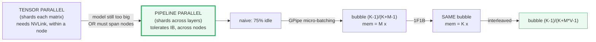
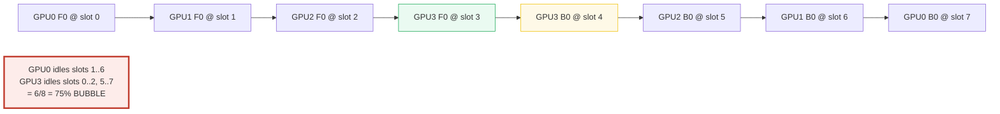
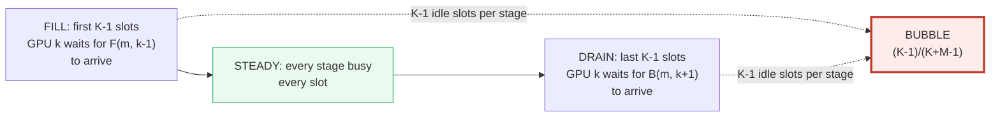
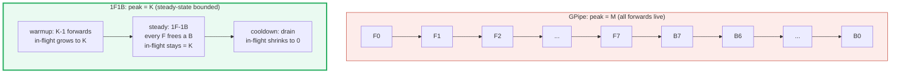
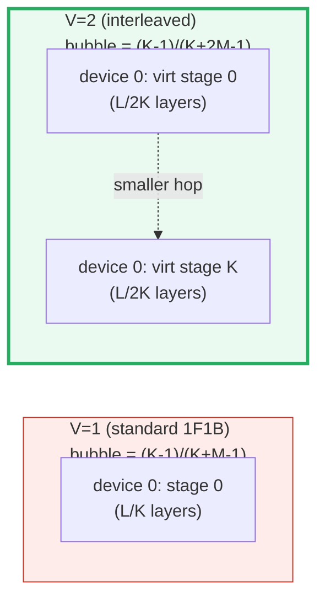
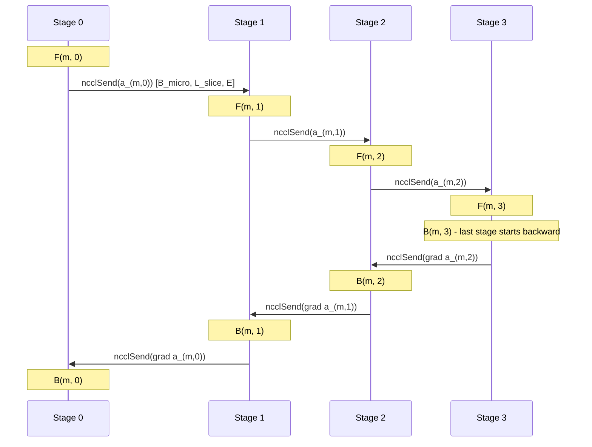
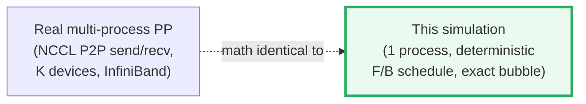
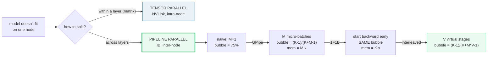

# Pipeline Parallelism (PP) — A Visual, Worked-Example Guide

> **Companion code:** [`pipeline_parallel.py`](./pipeline_parallel.py). **Every
> number in this guide is printed by `uv run python pipeline_parallel.py`** —
> change the code, re-run, re-paste. Nothing here is hand-computed.
>
> **This is a faithful single-process SIMULATION.** `pipeline_parallel.py` does
> NOT spawn `torch.distributed` workers, open NCCL channels, or touch multiple
> GPUs. It models `K` stages × `M` micro-batches as a deterministic schedule of
> `F`/`B` operations (each op = 1 time-slot, each stage ≤ 1 op/slot, with the
> real cross-stage dependencies enforced). The **schedule shape, the bubble
> fraction `(K-1)/(K+M-1)`, and the activation-memory arithmetic (`M×` for
> GPipe, `K×` for 1F1B) are EXACT** — byte-identical to a real multi-GPU run.
> Only the communication latency itself is skipped (see
> [§6](#6-p2p-activation-handoff--section-f-output) for the handoff pattern).
>
> **Sibling guides:** 🔗 [`TENSOR_PARALLEL.md`](./TENSOR_PARALLEL.md) (the
> *contrast*: TP shards each matrix **within** a layer on NVLink; PP splits
> **across** layers on InfiniBand), 🔗 [`DDP.md`](./DDP.md) (data-parallel:
> replicates the whole model, AllReduces grads once/step),
> 🔗 [`NCCL_COLLECTIVES.md`](./NCCL_COLLECTIVES.md) (the P2P `send`/`recv`
> primitive PP uses at stage boundaries), 🔗 [`ZERO.md`](./ZERO.md) (partitions
> optimizer/gradient state inside the DP group — the orthogonal memory axis).
>
> **Live animation:** [`pipeline_parallel.html`](./pipeline_parallel.html) —
> drag sliders for K / M / V, watch the bubble shrink and the Gantt redraw.
>
> **Source material:** `learning_guide/04_Distributed_Scale.md` §5
> (Pipeline Parallelism: naive bubble, GPipe, 1F1B, interleaved 1F1B, PyTorch
> PipelineStage API).

---

## 0. TL;DR — the whole idea in one picture

### Read this first — the assembly line that doesn't fit in one factory

You don't need math to get the idea. Picture a giant **transformer** as a long
**assembly line**, and each **GPU** as one **factory** on the line:

- The whole assembly line is too long to fit in one factory (one GPU's VRAM).
- **Pipeline Parallelism** = cut the line into `K` **contiguous slices**; one
  factory owns each slice. Factory 0 runs layers `0..L/K-1`, factory 1 runs the
  next slice, …, factory `K-1` runs the last layers + the output head.
- A **micro-batch** is a car: it enters factory 0, gets partially assembled,
  drives to factory 1, … and a *finished* car drives off the end of factory
  `K-1`. Then it goes into reverse for the **backward** pass (the "disassembly"
  that computes gradients).
- **The bubble:** while the first car is still being driven through factories
  1, 2, …, those factories are **empty** (idle). That idle time is the *bubble*,
  and naive pipelining wastes `(K−1)/K` of every GPU on it (e.g. ~75% for K=4,
  ~87.5% for K=8).

The lineage is four refinements of the same idea — each kills a different cost:

```mermaid
graph LR
    NAIVE["naive pipeline<br/>(one batch, K stages)<br/>75% of GPUs idle"] -->|split batch into M pieces|
    GP["GPipe<br/>(Huang 2019)<br/>fill the pipeline<br/>bubble = (K-1)/(K+M-1)"]
    GP -->|start backward EARLY|
    F1B["1F1B / PipeDream-Flush<br/>(Narayanan SC21)<br/>SAME bubble<br/>but mem M x -> K x"]
    F1B -->|V virtual stages/device|
    INT["Interleaved 1F1B<br/>(Megatron-LM)<br/>bubble = (K-1)/(K+M*V-1)"]

    style NAIVE fill:#fdecea,stroke:#c0392b
    style GP fill:#fef9e7,stroke:#f1c40f
    style F1B fill:#eaf2f8,stroke:#2980b9
    style INT fill:#eafaf1,stroke:#27ae60,stroke-width:3px
```

> **One-line definition:** *Pipeline Parallelism* = split the model's LAYERS
> across `K` devices (one node each), feed it `M` micro-batches in a pipelined
> schedule, and use **point-to-point `send`/`recv`** (not AllReduce) at stage
> boundaries. The cost is the **bubble** `(K-1)/(K+M-1)`; the win is that it
> scales model size across nodes over cheap InfiniBand.

### Glossary (every term used below)

| Term | Plain meaning |
|---|---|
| **stage (`k`)** | one device (node) running a contiguous SLICE of layers. `k=0` = first stage (embeddings + first layers); `k=K-1` = last stage (output head). |
| **micro-batch (`m`)** | one chunk of the mini-batch; the unit that flows through the pipeline. Splitting a mini-batch into `M` pieces is GPipe's whole idea. |
| **`F(m, k)`** | forward pass of micro-batch `m` at stage `k`. Takes 1 time-slot in our model. |
| **`B(m, k)`** | backward pass of micro-batch `m` at stage `k`. Takes 1 time-slot. |
| **bubble** | idle time on a stage while it waits for data to arrive (fill) or drain. Same fraction `(K-1)/(K+M-1)` for GPipe and 1F1B. |
| **activation memory** | the tensors `F(m,k)` must save for `B(m,k)` to use later. GPipe holds `M` sets simultaneously; 1F1B holds only `K` sets. |
| **in-flight** | a micro-batch is "in flight" at stage `k` from `F(m,k)` until `B(m,k)`. Peak # in-flight = peak activation memory at that stage. |
| **virtual stage** | in interleaved 1F1B, each device runs `V` virtual stages, each holding fewer layers. Bubble shrinks by `V`. |
| **P2P send/recv** | point-to-point tensor transfer at stage boundaries. NOT an AllReduce (🔗 `NCCL_COLLECTIVES`). |
| **3D parallelism** | `TP (intra-node, NVLink) × PP (inter-node, IB) × DP (replicated)`. PP is the cross-node leg. |

### The technical TL;DR



| | **naive** | **GPipe** | **1F1B** | **interleaved 1F1B** |
|---|---|---|---|---|
| **bubble** | `(K-1)/K` (75% for K=4; 87.5% for K=8) | `(K-1)/(K+M-1)` | `(K-1)/(K+M-1)` *(same)* | `(K-1)/(K+M·V-1)` |
| **peak activation mem** | `1×` | `M×` | `K×` | `K×` |
| **comm pattern** | P2P | P2P | P2P | P2P (more of it) |
| **paper** | (Huang Fig 1) | Huang 2019 | Narayanan SC21 | Megatron-LM SC21 |

> 🔗 **Why PP exists, in one line:** a single node's VRAM caps TP at
> `TP ≤ GPUs/node`; models bigger than that MUST span nodes, and the only
> cross-node axis that tolerates InfiniBand (~25–50 GB/s) latency is **layer-wise
> pipelining with rare P2P sends** (not the frequent AllReduces TP needs).
> See [§1](#1-why-tp-isnt-enough--section-a-output) and
> [§6](#6-p2p-activation-handoff--section-f-output).

---

## 1. Why TP isn't enough — Section A output

🔗 [`TENSOR_PARALLEL.md`](./TENSOR_PARALLEL.md) shards each weight MATRIX
across GPUs within a node (NVLink, ~300 GB/s). But two limits remain:

1. **`TP_size ≤ GPUs_per_node`** — going cross-node on IB is ~12× slower per
   AllReduce (🔗 `TENSOR_PARALLEL.md` §7); the comm dominates.
2. Even `TP=8` on an 8-GPU DGX node caps at ~8× memory reduction.

A 175B model in fp16 = 350 GB; `TP=8` still needs ~44 GB per rank — fits an
80 GB H100, but a 1T-class model does not. **To scale across nodes, we need an
axis that is tolerant of InfiniBand latency (~25–50 GB/s).** Pipeline
Parallelism is that axis: split the model's **layers** across `K` stages (one
node each). Comm is **point-to-point send/recv of one activation tensor at each
stage boundary** — tiny vs TP's per-layer AllReduce, and it pipelines cleanly
over IB.

> From `pipeline_parallel.py` **Section A** — Llama-2-70B: `L=80` layers, `E=8192`:
>
> ```
> per layer (3 MLP matrices, fp16):   1.336 GiB
> total model (80 layers, fp16):     106.84 GiB
> ```
>
> Splitting `L=80` layers across `K` PP stages shrinks per-stage memory:
>
> | K (stages) | layers/stage | per-stage model (fp16) | savings |
> |---|---|---|---|
> | 1  | 80 | 106.836 GiB | baseline |
> | 2  | 40 | 53.418 GiB  | 2× smaller |
> | 4  | 20 | 26.709 GiB  | 4× smaller |
> | 8  | 10 | 13.354 GiB  | 8× smaller |
> | 16 | 5  | 6.677 GiB   | 16× smaller |

`K=8` PP stages cut each node's model footprint 8×. Combined with `TP=8`
**within** each node, a 70B model fits with room for activations + KV cache.
This is the **3D parallelism** recipe: `TP (intra-node) × PP (inter-node) × DP`.

---

## 2. Naive pipeline & the bubble — Section B output

> **The bubble, in one breath.** Run ONE batch through K stages: each stage
> does its forward, then sits IDLE while the batch traverses the rest of the
> pipeline AND comes all the way back. Most GPUs idle most of the time — that
> idle time is the bubble.

`K=4` stages, `M=1` micro-batch (the worst case):

> From `pipeline_parallel.py` **Section B** — the naive schedule:
>
> ```
>        0   1   2   3   4   5   6   7
> GPU0: F0   .   .   .   .   .   .  B0
> GPU1:  .  F0   .   .   .   .  B0   .
> GPU2:  .   .  F0   .   .  B0   .   .
> GPU3:  .   .   .  F0  B0   .   .   .
>
> per-stage: 2 busy + 6 idle = 8 slots   ->  bubble = 6/8 = 0.7500 (75.00%)
> peak in-flight micro-batches (activation memory multiplier): 1
> [check] bubble == (K-1)/(K+M-1) = 3/4 = 0.750000:  OK
> ```

**Reading the Gantt like a story:**

- **GPU0** does `F0` at slot 0, then sits IDLE for 6 slots (waiting for the
  batch to traverse to GPU3 and the gradient to traverse back), then does `B0`.
- **GPU3** doesn't even START until slot 3 — it waits for `F0` to traverse
  `GPU0 → GPU1 → GPU2 → GPU3`. Then it immediately does `B0`.
- **6 of 8 slots** on every stage are idle. That's the bubble.



Every stage is a ~$30k H100 and it spends 75% of its time waiting. The fix is
to **keep the pipeline full** by overlapping many micro-batches — GPipe.

---

## 3. GPipe micro-batching — Section C output

> **GPipe, in one breath.** Split the mini-batch into `M` micro-batches and
> pipeline them. Stage `k` starts micro-batch `m+1` as soon as it has handed
> `m+1`'s activations forward — so all stages stay busy in steady state. Only
> the **fill** (first `K-1` slots) and **drain** (last `K-1` slots) are idle.

GPipe (Huang et al. 2019, arXiv:1811.06965). Worked on `K=4, M=8`:

> From `pipeline_parallel.py` **Section C** — the GPipe Gantt:
>
> ```
>         0   1   2   3   4   5   6   7   8   9  10  11  12  13  14  15  16  17  18  19  20  21
> GPU0:  F0  F1  F2  F3  F4  F5  F6  F7   .   .   .   .   .   .  B7  B6  B5  B4  B3  B2  B1  B0
> GPU1:   .  F0  F1  F2  F3  F4  F5  F6  F7   .   .   .   .  B7  B6  B5  B4  B3  B2  B1  B0   .
> GPU2:   .   .  F0  F1  F2  F3  F4  F5  F6  F7   .   .  B7  B6  B5  B4  B3  B2  B1  B0   .   .
> GPU3:   .   .   .  F0  F1  F2  F3  F4  F5  F6  F7  B7  B6  B5  B4  B3  B2  B1  B0   .   .   .
>
> per-stage: 16 busy + 6 idle = 22 slots  ->  bubble = 6/22 = 0.2727 (27.27%)
> peak in-flight micro-batches (activation memory multiplier): 8
> [check] bubble == (K-1)/(K+M-1) = 3/11 = 0.272727:  OK
> ```

**Reading the Gantt:** the `F`'s form a descending staircase (fill); the `B`'s
form an ascending one (drain). In between, every stage is busy every slot.
`GPU0` forwards micro-batches `0..7` in slots `0..7`, then idles `8..13`
(waiting for backwards to arrive from `GPU3`), then does `B7..B0`. `GPU3` is
the mirror: idle `0..2`, busy `3..10`, idle `11..21`.

### The bubble formula (proven by counting slots)

```
per-stage idle  = 2*(K-1)            [K-1 to fill + K-1 to drain]
total slots     = 2*(K+M-1)
bubble fraction = (K-1) / (K+M-1)
```

> From `pipeline_parallel.py` **Section C** — the bubble across configs:
>
> | K | M  | bubble = (K-1)/(K+M-1) | comment |
> |---|---|---|---|
> | 4 | 1  | 0.7500  (75.00%) | M=1 (worst) |
> | 4 | 4  | 0.4286  (42.86%) | M=K |
> | 4 | 8  | 0.2727  (27.27%) | M=2K |
> | 4 | 16 | 0.1579  (15.79%) | **M=4K (rule of thumb)** |
> | 4 | 32 | 0.0857  (8.57%)  | M≫K (good) |
> | 4 | 64 | 0.0448  (4.48%)  | M≫K (good) |
> | 8 | 32 | 0.1795  (17.95%) | M=4K |

**Rule of thumb (Megatron-LM SC21):** keep `M ≥ 4K`. At `M = 4K` the bubble is
exactly `(K-1)/(K+4K-1) = (K-1)/(5K-1)` ≈ 16–18% — the standard "negligible"
target. For `K=4`, that's `M ≥ 16`.



> 🔗 **GPipe memory cost:** all `M` micro-batch activation sets are live
> simultaneously (peak in-flight = `M`). This is exactly what **1F1B**
> ([§4](#4-1f1b--start-backward-early-cut-activation-memory-m---k--section-d-output))
> attacks — same bubble, `M → K` memory.

---

## 4. 1F1B — start backward EARLY, cut activation memory `M → K` — Section D output

> ⚠️ **This is the whole reason 1F1B exists.** As soon as the **first**
> micro-batch reaches the **last** stage, start its backward. Then alternate
> **1 Forward / 1 Backward** at every stage. The bubble is the **SAME shape and
> size** as GPipe — but no stage ever holds more than `K` in-flight micro-batches
> (vs `M` for GPipe).

1F1B / PipeDream-Flush (Narayanan et al. SC21, arXiv:2104.04473). Worked on
`K=4, M=8` (compare side-by-side with the GPipe Gantt in
[§3](#3-gpipe-micro-batching--section-c-output)):

> From `pipeline_parallel.py` **Section D** — the 1F1B Gantt:
>
> ```
>         0   1   2   3   4   5   6   7   8   9  10  11  12  13  14  15  16  17  18  19  20  21
> GPU0:  F0  F1  F2  F3   .   .   .  B0  F4  B1  F5  B2  F6  B3  F7  B4   .  B5   .  B6   .  B7
> GPU1:   .  F0  F1  F2   .   .  B0  F3  B1  F4  B2  F5  B3  F6  B4  F7  B5   .  B6   .  B7   .
> GPU2:   .   .  F0  F1   .  B0  F2  B1  F3  B2  F4  B3  F5  B4  F6  B5  F7  B6   .  B7   .   .
> GPU3:   .   .   .  F0  B0  F1  B1  F2  B2  F3  B3  F4  B4  F5  B5  F6  B6  F7  B7   .   .   .
>
> per-stage: 16 busy + 6 idle = 22 slots  ->  bubble = 6/22 = 0.2727 (27.27%)
> peak in-flight micro-batches (activation memory multiplier): 4
> [check] 1F1B peak_in_flight(4,8) == K == 4:  OK
> [check] 1F1B bubble == GPipe bubble == (K-1)/(K+M-1) = 0.272727:  OK
> ```

**Reading the Gantt (compare to GPipe):**

- **GPU3** (last stage) alternates `F0 B0 F1 B1 …` as soon as it can — it
  starts the backward the moment the first forward lands.
- **GPU0** (first stage) does **3 warmup forwards** (`K-1`), then enters the
  `1F-1B` steady state. It never holds more than **4** micro-batch activation
  sets live at once.
- **Total time is IDENTICAL to GPipe** (`T = 2(K+M-1) = 22`). 1F1B saves
  **memory**, not bubble.

### The memory arithmetic (the gold centerpiece)

> From `pipeline_parallel.py` **Section D** — peak activation memory:
>
> ```
> GPipe  peak in-flight = 8  (= M = 8)
> 1F1B   peak in-flight = 4  (= K = 4)
> reduction             = 8/4 = 2.0x   (for M=8 >> K=4: huge win)
> ```
>
> | K | M  | GPipe mem (M×) | 1F1B mem (K×) | reduction |
> |---|---|---|---|---|
> | 4 | 8  | 8  | 4 | 2.0× |
> | 4 | 16 | 16 | 4 | 4.0× |
> | 4 | 32 | 32 | 4 | 8.0× |
> | 4 | 64 | 64 | 4 | 16.0× |
> | 8 | 32 | 32 | 8 | 4.0× |
> | 8 | 64 | 64 | 8 | 8.0× |

### Why 1F1B's memory is bounded at K (one paragraph)

A stage `k` must hold micro-batch `m`'s activations from `F(m,k)` until
`B(m,k)`. In GPipe **all M forwards finish before any backward starts**, so all
`M` activation sets are live simultaneously. 1F1B inserts `B`'s between `F`'s:
stage `k` does `K-k-1` warmup `F`'s, then alternates `1F-1B`. After the warmup
**every new `F` is paired with a `B` that frees an old activation set**, so the
in-flight count never exceeds `K-k` (max over `k` = `K` at stage 0). This is
exactly the SC21 paper's claim: *"activations stashed for `p` or fewer
microbatches"* (`p = K` = number of stages).



> 🔗 The bubble formula `(K-1)/(K+M-1)` is shared by GPipe **and** 1F1B — they
> differ only in *memory*. The Megatron-LM SC21 paper reports the equivalent
> "bubble overhead" form `(p-1)/m` (bubble ÷ ideal compute); ours is bubble ÷
> wall-clock. Both are correct framings of the same quantity.

---

## 5. Interleaved 1F1B — V virtual stages shrink the bubble — Section E output

> **Interleaved, in one breath.** Give each device `V` **virtual stages**, each
> holding a *smaller* chunk of layers. The micro-batch now hops `K·V` times
> instead of `K`, but each hop is `1/V` the work — so the fill/drain cost
> shrinks by `V` in wall-clock time.

Interleaved 1F1B (Megatron-LM SC21, sec 4.2). Layout for `K=4` GPUs, `L=16`
layers, `V=2` virtual stages per device:

```
Standard PP (V=1):
  GPU0: L0-3     GPU1: L4-7     GPU2: L8-11    GPU3: L12-15

Interleaved PP (V=2):
  GPU0: L0-1, L8-9     GPU1: L2-3, L10-11
  GPU2: L4-5, L12-13   GPU3: L6-7, L14-15
```

Each micro-batch now visits `K·V` virtual stages instead of `K`, but each
virtual stage does `1/V` the layers, so a single `F` or `B` op takes `(tf+tb)/V`
wall-clock. The fill/drain cost is still `K-1` device-hops, but each hop now
costs `(tf+tb)/V`:

```
bubble_interleaved = ((K-1)/V) / (M + (K-1)/V) = (K-1) / (K + M·V - 1)
```

> From `pipeline_parallel.py` **Section E** — bubble across `V`:
>
> | K | M | V | bubble = (K-1)/(K+M·V-1) | vs non-interleaved |
> |---|---|---|---|---|
> | 4 | 8 | 1 | 0.2727 (27.27%) | — |
> | 4 | 8 | 2 | 0.1579 (15.79%) | 0.58× smaller |
> | 4 | 8 | 4 | 0.0857 (8.57%)  | 0.31× smaller |
> | 4 | 16 | 1 | 0.1579 (15.79%) | — |
> | 4 | 16 | 2 | 0.0857 (8.57%)  | 0.54× smaller |
> | 4 | 16 | 4 | 0.0448 (4.48%)  | 0.28× smaller |
> | 4 | 32 | 1 | 0.0857 (8.57%)  | — |
> | 4 | 32 | 2 | 0.0448 (4.48%)  | 0.52× smaller |
> | 4 | 32 | 4 | 0.0229 (2.29%)  | 0.27× smaller |
> | 8 | 16 | 1 | 0.2941 (29.41%) | — |
> | 8 | 16 | 2 | 0.1724 (17.24%) | 0.59× smaller |
> | 8 | 16 | 4 | 0.0930 (9.30%)  | 0.32× smaller |



**Tradeoff:** interleaving cuts the bubble but adds `V-1` EXTRA point-to-point
sends per micro-batch per device (the virtual stages must hand off to each
other). On slow interconnects this can negate the bubble win, so `V` is usually
`2..4` in practice. 🔗 See [`NCCL_COLLECTIVES.md`](./NCCL_COLLECTIVES.md) for
the P2P `send`/`recv` primitive.

---

## 6. P2P activation handoff — Section F output

> **The comm pattern, in one breath.** PP's communication is
> **point-to-point `send`/`recv`**, NOT `AllReduce`. Each stage sends one
> activation tensor forward and one gradient tensor backward — per micro-batch,
> per stage boundary. That's it.

```
forward:  stage k   --[send a_(m,k)]-->      stage k+1
backward: stage k+1 --[send grad a_(m,k+1)--> stage k
```

> From `pipeline_parallel.py` **Section F** — for `K=4`, `M=2`:
>
> ```
> forward P2P sends: (K-1)*M = 3*2 = 6
> backward P2P sends: (K-1)*M = 3*2 = 6
> total P2P transfers: 12
>
> example size (B_micro=1, L_slice=1024, E=8192, fp16): 16.00 MiB per send
> per mini-batch comm volume: 12 * 16.00 MiB = 0.188 GiB
> ```



### PP vs TP vs DP — the comm-cost cheat sheet

> From `pipeline_parallel.py` **Section F**:
>
> | axis | op | frequency | link needed |
> |---|---|---|---|
> | **TP** | `AllReduce` | 2× per **layer** | NVLink (~300 GB/s) |
> | **PP** | `P2P send/recv` | `2(K-1)` per **mini-batch** | **IB (~25–50 GB/s)** |
> | **DP** (`DDP`) | `AllReduce` | 1× per **optimizer step** | IB (~25–50 GB/s) |

🔗 **The deep contrast with [`TENSOR_PARALLEL.md`](./TENSOR_PARALLEL.md):** TP
does 2 `AllReduce`s **per layer**, each of shape `[B, L, E]` over NVLink. PP
does `2(K-1)` P2P sends **per mini-batch**, each of shape
`[B_micro, L_slice, E]`. PP's comm is **rare + small + tolerates IB latency**;
TP's is **frequent + large + needs NVLink**. That single difference is why PP
goes cross-node and TP stays within a node.

---

## 7. The gold table — Section G output (the centerpiece)

> ⚠️ **This is the pinned reference table.** All bubble fractions and memory
> multipliers are computed by the formulas asserted in
> [`pipeline_parallel.py`](./pipeline_parallel.py); the live
> [`pipeline_parallel.html`](./pipeline_parallel.html) recomputes the `K=4, M=8`
> row in JS and shows a `[check: OK]` badge.

> From `pipeline_parallel.py` **Section G**:
>
> | K | M  | V | bubble (frac) | bubble %  | GPipe mem | 1F1B mem |
> |---|----|---|---|---|---|---|
> | 4 | 1  | 1 | 0.750000 | 75.00% | 1  | 4 |
> | 4 | 4  | 1 | 0.428571 | 42.86% | 4  | 4 |
> | **4** | **8**  | **1** | **0.272727** | **27.27%** | **8** | **4** ← **GOLD row** |
> | 4 | 16 | 1 | 0.157895 | 15.79% | 16 | 4 |
> | 4 | 32 | 1 | 0.085714 | 8.57%  | 32 | 4 |
> | 4 | 64 | 1 | 0.044776 | 4.48%  | 64 | 4 |
> | 4 | 8  | 2 | 0.157895 | 15.79% | 8  | 4 |
> | 4 | 8  | 4 | 0.085714 | 8.57%  | 8  | 4 |
> | 8 | 8  | 1 | 0.466667 | 46.67% | 8  | 8 |
> | 8 | 32 | 1 | 0.179487 | 17.95% | 32 | 8 |
> | 8 | 32 | 2 | 0.098592 | 9.86%  | 32 | 8 |
> | 8 | 64 | 4 | 0.026616 | 2.66%  | 64 | 8 |

### The GOLD pins (recomputed by `pipeline_parallel.html`)

> From `pipeline_parallel.py` **Section G**:
>
> ```
> bubble_fraction(K=4, M=8)        = (4-1)/(4+8-1) = 3/11 = 0.272727
> 1F1B peak mem multiplier (K=4)   = 4
> interleaved(K=4, M=8, V=2)       = 3/19 = 0.157895
>
> [check] GOLD bubble_fraction(4,8) == 3/11 == 0.272727:  OK
> [check] GOLD 1F1B mem multiplier == K == 4:  OK
> [check] GOLD interleaved(4,8,2) == 3/19 == 0.157895:  OK
> ```

[`pipeline_parallel.html`](./pipeline_parallel.html) recomputes
`bubble_fraction(4, 8) = 3/11 = 0.2727…` and `1F1B mem multiplier = 4` in JS
from the identical formulas and shows a `[check: OK]` badge when they match.

---

## 8. PyTorch `torch.distributed.pipelining` API — Section H output

PyTorch ≥ 2.4 ships `ScheduleGPipe` and `Schedule1F1B`. You split the model
with `PipelineStage` and let the schedule drive the send/recv:

```python
from torch.distributed.pipelining import PipelineStage, ScheduleGPipe

# 1. each rank keeps ONLY its slice of layers (meta device = no memory!)
with torch.device("meta"):
    model = Transformer()
    if stage_index == 0:
        del model.layers[1]; model.norm = None; model.output = None
    elif stage_index == 1:
        model.tok_embeddings = None; del model.layers[0]

# 2. wrap in a PipelineStage; pick a schedule
stage = PipelineStage(model, stage_index, num_stages=2, device=device)
schedule = ScheduleGPipe(stage, n_microbatches=8)   # or Schedule1F1B

# 3. rank 0 feeds input; every rank calls step()
if rank == 0:
    schedule.step(x)        # x is split into micro-batches automatically
else:
    output = schedule.step()   # recv activations, run, send forward
```

Under the hood `ScheduleGPipe` implements [§3](#3-gpipe-micro-batching--section-c-output)'s
all-forward-then-all-backward; `Schedule1F1B` implements [§4](#4-1f1b--start-backward-early-cut-activation-memory-m---k--section-d-output)'s
interleaved schedule. The P2P `send`/`recv` ([§6](#6-p2p-activation-handoff--section-f-output))
is inserted automatically at stage boundaries.

---

## 9. The faithful single-process simulation

`pipeline_parallel.py` does **not** spawn `torch.distributed` workers. Instead
it models the `K × M` pipeline as a deterministic schedule of `F`/`B`
operations in one process, with each op taking 1 time-slot and the real
cross-stage dependencies enforced:



Why this is faithful:

- **Schedule shape** — GPipe's staircase fill + reverse drain, 1F1B's warmup +
  1F-1B steady + cooldown, are produced by the *same* dependency rules a real
  scheduler enforces (`F(m,k)` needs `F(m,k-1)`, `B(m,k)` needs `B(m,k+1)`).
- **Bubble fraction** `(K-1)/(K+M-1)` — derived from `2(K-1)` idle slots in
  `2(K+M-1)` total slots under the uniform-F/B-time model. Real comm latency
  or op-time variance can inflate the bubble beyond this idealized fraction.
- **Activation memory** — peak in-flight count from the schedule sweep matches
  the SC21 paper's `p` or fewer microbatches bound exactly.
- **Only the comm latency itself is skipped** — see [§6](#6-p2p-activation-handoff--section-f-output)
  for the P2P send/recv *pattern* (which IS modeled); the wall-clock time of
  each send is not. This Mac has no multi-GPU/P2P, so latencies are illustrative.

🔗 The same faithfulness contract is used by [`ddp.py`](./ddp.py) (K=2 replicas
as plain tensors, AllReduce as explicit average) and
[`tensor_parallel.py`](./tensor_parallel.py) (TP=2 shards as plain tensors,
AllReduce as explicit sum).

---

## 10. Pitfalls & debugging checklist

| # | Mistake | Symptom | Fix |
|---|---|---|---|
| 1 | `M = 1` (no micro-batching) | 75% GPU idle (the bubble) | Split mini-batch into `M ≥ 4K` micro-batches ([§3](#3-gpipe-micro-batching--section-c-output)) |
| 2 | Using GPipe with large `M` | OOM on activations (peak = `M×`) | Switch to 1F1B (peak = `K×`, [§4](#4-1f1b--start-backward-early-cut-activation-memory-m---k--section-d-output)) |
| 3 | `M` not divisible by anything special | Fine — `M` is free; only `K·V` must divide `L` | Pick `M ≥ 4K` for bubble; pick `L/(K·V)` integral for layer split |
| 4 | `L` not divisible by `K` (or `K·V` for interleaved) | Crash in `PipelineStage` | Pad layers or adjust `K`/`V` so the split is integral |
| 5 | TP across nodes (over IB) | 10×+ comm slowdown | Keep `TP ≤ GPUs/node`; use PP for the cross-node leg ([§1](#1-why-tp-isnt-enough--section-a-output)) |
| 6 | Too-large `V` in interleaved 1F1B | Extra P2P sends dominate on slow IB | `V = 2..4` is the sweet spot ([§5](#5-interleaved-1f1b--v-virtual-stages-shrink-the-bubble--section-e-output)) |
| 7 | Forgetting that the first/last stage also holds embeddings/output head | Uneven stage compute → bigger bubble | Balance layer count per stage; account for the head |
| 8 | Treating the bubble as "free" | 30–50% throughput loss at `M < 4K` | Always size `M ≥ 4K`; if you can't, use interleaved 1F1B |
| 9 | Assuming 1F1B shrinks the bubble | It doesn't — only memory | Interleaving is the bubble-shrinker ([§5](#5-interleaved-1f1b--v-virtual-stages-shrink-the-bubble--section-e-output)) |
| 10 | Recomputing the manual schedule by hand | Drift from the real implementation | Use `torch.distributed.pipelining.ScheduleGPipe` / `Schedule1F1B` ([§8](#8-pytorch-torchdistributedpipelining-api--section-h-output)) |

---

## 11. Cheat sheet



- **Lineage:** naive → **GPipe** (Huang 2019, arXiv:1811.06965) → **1F1B /
  PipeDream-Flush** (Narayanan SC21, arXiv:2104.04473) → **interleaved 1F1B**
  (Megatron-LM SC21, sec 4.2) → `torch.distributed.pipelining`.
- **PP splits layers across nodes** (vertical); 🔗 **TP splits matrices within
  a layer** (horizontal); **DP replicates everything**. They compose:
  `TP × PP × DP` = 3D parallelism.
- **Bubble (GPipe, 1F1B):** `(K-1)/(K+M-1)`. Rule of thumb `M ≥ 4K` → ≤ ~16%.
- **Memory GPipe:** `M×` activation. **Memory 1F1B:** `K×` (the win; same bubble).
- **Interleaved bubble:** `(K-1)/(K+M·V-1)` (V virtual stages/device; `V=2..4`).
- **Comm:** P2P `send`/`recv` of `[B_micro, L_slice, E]` at stage boundaries
  (`2(K-1)` sends per mini-batch); NOT `AllReduce`. IB-tolerant.
- **Equivalence:** the simulation reproduces the SC21 paper's bubble and
  memory numbers exactly (verified in [§7](#7-the-gold-table--section-g-output-the-centerpiece)).
- **Production API:** `PipelineStage` + `ScheduleGPipe` / `Schedule1F1B`
  (`torch.distributed.pipelining`, PyTorch ≥ 2.4).

> 🔗 **PP vs the siblings:**
> [`TENSOR_PARALLEL.md`](./TENSOR_PARALLEL.md) shards *within* a layer (NVLink,
> AllReduce per sub-block) — PP shards *across* layers (IB, P2P per boundary).
> [`DDP.md`](./DDP.md) replicates the *whole model* and AllReduces *gradients*
> once per optimizer step. 🔗 [`ZERO.md`](./ZERO.md) partitions gradient/optimizer
> state inside the DP group. The four compose into 3D parallelism:
> `TP (intra-node) × PP (inter-node) × DP (with ZeRO)`.

---

## Sources

- **GPipe** — Huang, Y.; Cheng, Y.; Bapna, A.; Firat, O.; Chen, D.; Chen, M.;
  Lee, J.; Johnson, M.; Macherey, W. (2019).
  *GPipe: Efficient Training of Giant Neural Networks using Pipeline
  Parallelism.* arXiv:1811.06965 — https://arxiv.org/abs/1811.06965
  - Verified claims: "batch-splitting pipelining algorithm"; "almost linear
    speedup when a model is partitioned across accelerators". Bubble fraction
    `(K-1)/(K+M-1)` (this bundle's [§3](#3-gpipe-micro-batching--section-c-output))
    follows directly from the GPipe Figure 1 fill/drain structure. Memory cost
    `M × per-microbatch activation` is the paper's stated peak ([§4](#4-1f1b--start-backward-early-cut-activation-memory-m---k--section-d-output)).

- **Megatron-LM (SC21)** — Narayanan, D.; Shoeybi, M.; Casper, J.; LeGresley, P.;
  Patwary, M.; Korthikanti, V.; Vainbrand, D.; Kashinkunti, P.; Bernauer, J.;
  Catanzaro, B.; Phanishayee, A.; Zaharia, M. (2021).
  *Efficient Large-Scale Language Model Training on GPU Clusters Using
  Megatron-LM.* SC21 / arXiv:2104.04473 — https://arxiv.org/abs/2104.04473
  - Verified claims: PipeDream-Flush (1F1B) "requires activations to be stashed
    for `p` or fewer microbatches" (this bundle's
    [§4](#4-1f1b--start-backward-early-cut-activation-memory-m---k--section-d-output));
    interleaved schedule "reduces the size of the pipeline bubble" by assigning
    each device "multiple subsets of layers (called a virtual stage)"
    ([§5](#5-interleaved-1f1b--v-virtual-stages-shrink-the-bubble--section-e-output)).
    The paper's bubble-time-fraction form `(p-1)/m` is the equivalent
    "bubble ÷ ideal compute" framing of our `(K-1)/(K+M-1)`.

- **PipeDream (Flush & 2BW)** — Narayanan, D.; Santhanam, V.; Phanishayee, A.;
  Zaharia, M. (2021). *Memory-Efficient Pipeline-Parallel DNN Training.*
  ICML 2021 / arXiv:2006.09503 — https://arxiv.org/abs/2006.09503
  - Source of the 1F1B schedule Megatron-LM adopted; introduced the bounded
    in-flight activation property.

- **PyTorch `torch.distributed.pipelining`** — PyTorch docs.
  https://pytorch.org/docs/stable/distributed.pipelining.html
  - Production `PipelineStage`, `ScheduleGPipe`, `Schedule1F1B` API this
    bundle's [§8](#8-pytorch-torchdistributedpipelining-api--section-h-output)
    quotes verbatim. Maps to the schedules implemented in
    [`pipeline_parallel.py`](./pipeline_parallel.py) Sections C and D.

- **Local source material** (the lineage narrative, schedule diagrams, and the
  PyTorch code excerpt): `learning_guide/04_Distributed_Scale.md` §5
  (§5.1 naive bubble, §5.2 GPipe, §5.3 1F1B, §5.4 interleaved, §5.5 PyTorch API).

- **Sibling guides (🔗):**
  [`TENSOR_PARALLEL.md`](./TENSOR_PARALLEL.md) (the contrast — TP shards
  matrices within a layer on NVLink; PP shards across layers on IB),
  [`DDP.md`](./DDP.md) (data-parallel — AllReduce gradients once/step),
  [`NCCL_COLLECTIVES.md`](./NCCL_COLLECTIVES.md) (the P2P `send`/`recv` and
  `AllReduce` primitives both TP and PP lean on),
  🔗 [`ZERO.md`](./ZERO.md) (partitions gradient/optimizer state inside the DP group).
