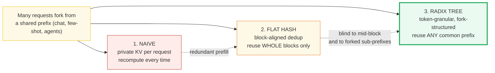
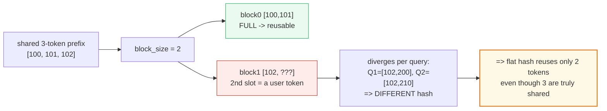
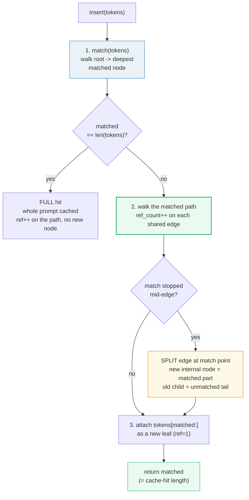
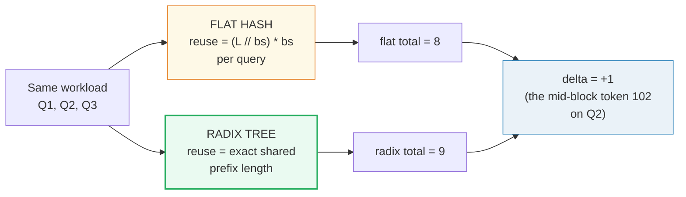
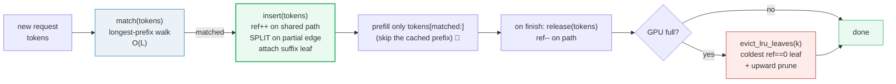

# RadixAttention (Prefix Caching with a Radix Tree) — A Visual, Worked-Example Guide

> **Who this is for:** someone with minimal systems background. Every concept
> arrives first as a **plain analogy**, then as a diagram, then as a worked
> example with real numbers. **Every number in this guide is printed by
> `uv run python prefix_cache.py`** — nothing hand-computed.
>
> **Companion code:** [`prefix_cache.py`](./prefix_cache.py).
> **Live animation:** [`prefix_cache.html`](./prefix_cache.html) — open in a
> browser and watch the radix tree grow, fork, split, and evict, with a live
> flat-hash-vs-radix reuse meter.
>
> **Sibling guides:** [`BLOCK_MANAGER.md`](./BLOCK_MANAGER.md) — your **direct
> contrast** (the flat chained-hash prefix cache whose block-alignment limit
> RadixAttention exists to fix; 🔗 throughout). [`PAGED_ATTENTION.md`](./PAGED_ATTENTION.md)
> — the compute that consumes whatever KV the tree points at.
> [`KV_CACHE.md`](./KV_CACHE.md) — the storage layout (where the bytes live).
> [`SCHEDULER.md`](./SCHEDULER.md) — the policy that calls `match`/`insert` and
> reacts to eviction.
>
> **Source material:** `learning_guide/03_Scale_Serving.md` §11 (RadixAttention),
> §5 (the BlockManager flat-hash baseline); `llmsystem2026/mds/llmsys-22-…-radixattention.txt`.

---

## Glossary (read once, refer back)

| Term | Plain-English meaning |
|---|---|
| **prefix** | The leading run of tokens two prompts have in common (e.g. a shared system prompt). |
| **block_size** | Tokens per physical page in the flat-hash scheme (vLLM default `16`; this demo `2`). The flat cache can only reuse **whole** blocks — the source of its limit. |
| **flat hash** (🔗 BLOCK_MANAGER) | A chained fingerprint of **block-aligned** token chunks → physical block. Reuse = `(L // block_size) * block_size` tokens. Any trailing tokens that don't fill a block are **invisible** to the cache. |
| **radix tree** | A **compressed trie** (a.k.a. Patricia/radix trie). Edges are labeled with token **segments** of arbitrary length, not single tokens. Internal nodes with one child are **merged** into their parent — so the tree is never spindly. |
| **node** | One vertex = `(token-segment edge, children map, KV reference / ref_count, last_access for LRU)`. The root has an empty segment; every other node's segment is the edge **from** its parent. |
| **edge** | The token segment stored **on** a node (`node.token_ids`). The full prefix a node represents = concatenation of segments from the root down to (and including) it. |
| **match (LPM)** | **Longest-prefix traversal**: walk from root, consuming the query's tokens edge-by-edge; stop at the first divergence. Returns how many leading tokens are a cache **hit** (skip prefill for them). |
| **insert** | walk+match; **share** the matched prefix (`ref_count++`); if the match stops **mid-edge**, **split** that edge; attach a new leaf for the unmatched suffix. **O(L)** in prompt length. |
| **split** | When a new prompt matches only **part** of an existing edge, cut the edge at the match point: the matched part becomes a new internal node, the old tail becomes its child, the new prompt's suffix becomes a sibling child. |
| **ref_count** | How many **live** requests currently read a node's KV. `>0` ⇒ live (cannot evict). `==0` ⇒ evictable (if a leaf). |
| **eviction** | **LRU on leaves** when GPU memory overflows: recursively remove the least-recently-used leaf with `ref_count==0`; walk up pruning childless, ref-less parents. Internal nodes are never directly evicted (they're shared backbones). |
| **page_size = 1** | SGLang stores KV in a paged layout where **one page = one token** — so the radix tree's token-granular sharing maps directly onto GPU pages with no rounding loss. |

> 🔗 **The single cross-reference to remember:** `BLOCK_MANAGER.md` shows that
> vLLM's flat chained-hash achieves prefix caching *"without the need of
> maintaining a tree structure among the KV blocks"* (vLLM design doc) — it
> reuses **whole blocks** only. This guide shows what a **tree** buys you on
> top: token-granular, fork-structured sharing that captures the prefixes a
> flat hash is structurally blind to. The two are the yin and yang of prefix
> caching; vLLM chose flatness for simplicity, SGLang chose the tree for hit
> rate on forked workloads.

---

## 0. TL;DR — the whole lineage in one picture

Every prompt is a **branch** in a growing **family tree** of conversations.
The trunk is the shared system prompt; each fork is where one conversation
diverges from another. RadixAttention stores the KV cache for the **whole
tree** in a radix tree (a compressed trie): **any** common prefix — no matter
its length, no matter how the prompts fork — is stored **once** and reused by
every descendant. A new prompt walks **down** the tree to find its longest
cached ancestor, then grows a new twig for whatever is genuinely new.

**The three generations, as analogies** (each fixes the prior's waste):

- **NAIVE per-request KV (the "before")** = *"every reader buys their own
  notebook, fills it from scratch, then throws it away. Two readers who copied
  the same system prompt each pay the full prefill cost — and pay it again next
  turn."*
- **BlockManager + flat chained-hash (vLLM / 🔗 BLOCK_MANAGER)** = *"pages
  become content-addressed by a chained hash of their tokens. Two requests
  that produced the same **block-aligned** token prefix share the same physical
  pages (`ref_count++`). Huge win — but the dedup unit is a WHOLE BLOCK. A
  shared prefix whose length isn't a multiple of `block_size` can't be reused
  past the last full block: the trailing tokens live in a block whose later
  slots belong to a divergent query, so its hash is unique to that query."*
- **RadixAttention (SGLang)** = *"replace the flat hash table with a RADIX TREE
  keyed by the raw token sequence. Edges hold token **segments** of arbitrary
  length; sharing is **token-granular** and **tree-structured**. Any common
  prefix — partial, forked, arbitrary length — is shared, with O(L) lookup.
  Chat, few-shot, and agent workloads reuse prefixes far more richly than
  block-aligned hashing captures."*



*Red → orange → green: each generation reuses more of the prefix. The only
change from flat-hash to radix is the **index** — a tree keyed by raw tokens
instead of a table keyed by block hashes. That single swap turns "reuse block
0 only" into "reuse all 3 system tokens, even though token 102 is mid-block."*

| | **Naive** | **Flat hash** (🔗 BLOCK_MANAGER) | **Radix tree** (SGLang) |
|---|---|---|---|
| Dedup unit | none | a **whole block** (`block_size` tokens) | a **token segment** (any length) |
| Shared prefix granularity | 0 | multiples of `block_size` | **exact** (token-granular) |
| Forked sub-prefixes (tree of prompts) | recompute | missed (each branch re-hashes) | **shared** (each fork = a tree edge) |
| Mid-block divergence | recompute the trailing token | **missed** (the whole block diverges) | **shared** up to the exact fork point |
| Index | none | flat `hash → block` dict | a **radix tree** on CPU |
| Lookup cost | — | O(blocks walked) | O(edges) ~ O(L) |
| Eviction | free everything | free blocks at `ref_count==0` | **LRU on leaves** with `ref_count==0` |
| Used by | toy servers | **vLLM** (SOSP 2023) | **SGLang** (arXiv:2312.07104) |

---

## 1. The flat-hash recap and its block-alignment limit — Section A output

**Analogy:** *the flat chained-hash (🔗 BLOCK_MANAGER) is a librarian who only
files **whole pages**. A page's identity is a chained fingerprint of its
tokens. Two readers who filled identical pages share them. But the librarian
refuses to file a **partial** page — so any shared prefix whose length isn't a
multiple of `block_size` has its trailing tokens trapped in a page whose
remaining slots belong to a divergent query, and that page's fingerprint never
recurs. The reuse is "all-or-nothing per page."*



> From `prefix_cache.py` **Section A** — `block_size=2`, inserting
> `Q1 = [100, 101, 102, 200, 201, 202]` (cold), then probing the 3-token
> system prefix `SYS = [100, 101, 102]`:
>
> Insert `Q1` (cold). Register its 3 full blocks:
> - `block0 [100, 101]`: chained hash = `0xecd0403d962ff8f4` → registered
> - `block1 [102, 200]`: chained hash = `0x75ad5e3ce0e74fe3` → registered
> - `block2 [201, 202]`: chained hash = `0x1a04813492aee2f7` → registered
>
> Now probe the 3-token system prefix `SYS = [100, 101, 102]`:
> - `(L // block_size) * block_size = (3 // 2) * 2 = 1 * 2 = 2` reusable tokens.
> - The 3rd token (`102`) is NOT in any full block by itself: it shares a block
>   with a user-query token, so its hash is unique to whichever query fills the
>   rest of that block.
>
> Two ways the 3rd system token could be packed into a block:
> - `block [100,101]` → hash `0xecd0403d962ff8f4` (always the same)
> - `block [102, 200]` (Q1's) → hash `0x75ad5e3ce0e74fe3`
> - `block [102, 210]` (Q2's) → hash `0x35e2a5e982cdf239`
> - → the `[102, *]` block **differs per query**, so token `102` is **never
>   shared** across divergent queries under the flat hash. The radix tree has
>   no such blind spot.
>
> `[check]` flat-hash reuse for a 3-token prefix == 2 (not 3): **OK**

> One plain sentence: a flat hash table can only answer *"do I have a block
> whose chained fingerprint equals THIS block's?"* — and that question is only
> well-posed for a FULL block of exactly `block_size` tokens. A 3-token shared
> prefix with `block_size=2` yields 2 reusable tokens, never 3.

---

## 2. Why the flat hash misses the mid-block shared token — Section B output

**Analogy:** *when `Q2 = [100,101,102,210,211]` arrives after `Q1`, the
librarian walks Q2's pages and stamps each. Page 0 `[100,101]` matches Q1's
page 0 → reuse. Page 1 is `[102,210]` for Q2 but was `[102,200]` for Q1 — same
first token, different second → different chained hash → MISS. The walk stops.
The truly-shared token `102` is invisible because it's wedged into a page whose
other slot diverges. That single blind slot is the entire reason the flat hash
undercounts the shared prefix by one token here — and by every mid-block fork
in a real workload.*

> From `prefix_cache.py` **Section B** — seed cache with `Q1`, probe `Q2`:
>
> | block | tokens | chained hash | in cache? | verdict |
> |---|---|---|---|---|
> | 0 | `[100, 101]` | `0xecd0403d962ff8f4` | yes | HIT (reuse) |
> | 1 | `[102, 210]` | `0x35e2a5e982cdf239` | NO | MISS (divergent 2nd slot) |
>
> - `flat-hash match(Q2) = 2` tokens (only `block0 [100,101]`).
> - The 3rd shared token `102` sits in `block1 = [102,210]`, whose hash is
>   **unique** to Q2 (Q1's `block1` was `[102,200]`) — so the walk stops.
> - The **true** shared prefix is 3 tokens (`[100,101,102]`); the flat hash can
>   only see 2 of them. **That is the block-alignment blind spot.**
>
> `[check]` flat-hash `match(Q2) == 2` (not 3): **OK**

> 🔗 This is the **exact** mechanism `BLOCK_MANAGER.md` §2 documents (chained
> hash → divergence at the block whose tokens differ). The BlockManager is
> *correct* — it reuses every shareable **block**. RadixAttention is *richer* —
> it reuses every shareable **token**. The gap is precisely the tokens that
> fall between a block boundary and the true fork point.

---

## 3. The radix tree node — segment, children, ref_count, LRU — Section C output

**Analogy:** *a radix node is a knot in the family tree. The rope leading into
it (from its parent) is labeled with a **segment** of tokens — possibly many,
possibly one. The knot holds a ring binder of child ropes (keyed by each
child's first token, so you can grab the right child in one motion), a tally of
how many live conversations currently flow through this knot (`ref_count`), and
a timestamp of when it was last touched (for LRU). The root is a special knot
with an empty rope; every other knot's full identity is the concatenation of
all ropes from the root down to it.*

```mermaid
graph TD
    N["RadixNode<br/>{ token_ids, children,<br/>ref_count, last_access, parent }"]
    N --> S["token_ids = the EDGE SEGMENT<br/>from parent (empty for root)"]
    N --> C["children = { first_token: node }<br/>O(1) child lookup per edge"]
    N --> R["ref_count = # live readers<br/>>0 live, ==0 evictable (if leaf)"]
    N --> L["last_access = LRU clock tick<br/>updated on every match/insert"]
    style N fill:#161b22,stroke:#8b949e
    style S fill:#eaf2f8,stroke:#2980b9
    style C fill:#eafaf1,stroke:#27ae60
    style R fill:#fef9e7,stroke:#e67e22
    style L fill:#f4ecf7,stroke:#8e44ad
```



> From `prefix_cache.py` **Section C**:
>
> `RadixNode([])` just created (the root): `token_ids=[]`, `children={}`,
> `ref_count=0`, `last_access=0`.
>
> | role | token_ids | children | ref_count meaning |
> |---|---|---|---|
> | root | `[]` | `{tok: node,...}` | # requests in tree |
> | internal | `[shared segment]` | `{tok: node,...}` | # readers of backbone |
> | leaf | `[unique tail]` | `{}` | # readers of this req |
>
> The **compressed-trie** rule: a node with exactly one child is **merged** into
> a single longer edge — so the tree never has spindly single-token chains.
> `match()` walks edge-by-edge (O(1) child lookup each), not token-by-token:
> O(edges) ~ O(L) but with a small constant.
>
> `[check]` `match(Q1)` on empty tree == 0: **OK**

> **The precise operations** (implemented from scratch in `prefix_cache.py`;
> mirrors SGLang's `radix_cache.py`):
> ```
> match(tokens):                       # longest-prefix traversal, O(L)
>     node = root; i = 0
>     while i < len(tokens):
>         child = node.children.get(tokens[i])     # O(1) by first token
>         if child is None: break                  # no edge -> stop
>         j = common_prefix_len(child.token_ids, tokens[i:])
>         if j == len(child.token_ids):            # full edge -> descend
>             node = child; i += j
>         else: break                              # partial -> stop (not cached)
>     return i, node                               # (matched_len, attach_node)
>
> insert(tokens):                      # share + split + attach, O(L)
>     matched, node = match(tokens)
>     # walk again, ref_count++ on each fully-matched edge; SPLIT on partial
>     # attach tokens[matched:] as a new leaf (ref_count=1)
>     return matched                  # = cache-hit length (prefill skipped)
> ```

---

## 4. insert + longest-prefix match — build the tree — Section D output

**Analogy:** *inserting a new conversation is like adding a new branch to the
family tree. You walk from the root, following edges as long as they spell out
matching tokens. Where you can keep going, you tick the knot's reader tally
(`ref_count++`) — your conversation now flows through that shared backbone.
Where an edge matches only **partly**, you cut it: the matched part becomes a
new knot, the old tail hangs off it as a child, and your new suffix hangs off
as a sibling. Where no edge starts with your next token, you tie on a brand-new
leaf. The number of tokens you walked **before** tying anything new is your
cache hit — that's prefill you skip entirely.*



> From `prefix_cache.py` **Section D** — insert `Q1`, `Q2`, `Q3` in order;
> after each: the cache-hit length and the tree.
>
> **`insert(Q1 = [100,101,102,200,201,202])`** — cache-hit = **0** (COLD miss;
> whole prompt is new; attach one edge):
> ```
> root {ref=1}
>   └ [100] [100,101,102,200,201,202] {ref=1, leaf}
> ```
>
> **`insert(Q2 = [100,101,102,210,211])`** — cache-hit = **3** (PARTIAL hit;
> share 3 tokens, attach suffix `[210,211]`). The single edge `[100,101,102,
> 200,201,202]` is **split** at token 3: the matched `[100,101,102]` becomes a
> new internal node; the old tail `[200,201,202]` becomes its child; Q2's
> `[210,211]` becomes a sibling leaf:
> ```
> root {ref=2}
>   └ [100] [100,101,102] {ref=2}            <- shared by Q1, Q2
>       ├ [200] [200,201,202] {ref=1, leaf}  <- Q1's tail
>       └ [210] [210,211] {ref=1, leaf}      <- Q2's tail
> ```
>
> **`insert(Q3 = [100,101,102,200,201,202,300,301])`** — cache-hit = **6**
> (PARTIAL hit; share 6 tokens, attach suffix `[300,301]`). Q3 descends through
> `[100,101,102]` (full) and `[200,201,202]` (full), then forks at token 300:
> ```
> root {ref=3}
>   └ [100] [100,101,102] {ref=3}            <- shared by Q1, Q2, Q3
>       ├ [200] [200,201,202] {ref=2}        <- shared by Q1, Q3
>       │   └ [300] [300,301] {ref=1, leaf}  <- Q3's tail
>       └ [210] [210,211] {ref=1, leaf}      <- Q2's tail
> ```
>
> `[check]` after Q1,Q2,Q3: `root.ref_count == 3`: **OK**
> `[check]` system-prompt node `[100,101,102].ref_count == 3`: **OK**

**Reading the trees like a story:**

- **After Q1** the tree is one long edge — nothing to share with yet.
- **After Q2** the edge splits at token 3. The `[100,101,102]` backbone is now
  shared by two requests (`ref=2`); each query's unique tail hangs off as its
  own leaf. **Q2 skipped prefill for 3 tokens** — the entire system prompt.
- **After Q3** the `[200,201,202]` node (Q1's "what is python") is promoted
  from a leaf to an internal node shared by Q1 and Q3 (`ref=2`); Q3's
  `[300,301]` extension hangs off it. **Q3 skipped prefill for 6 tokens** —
  system prompt + "what is python" — because Q1 already computed them.

> Notice the **split on Q2**: that is the operation a flat hash **cannot**
> express. The flat hash would have to choose — either `[100,101]` is a block
> (reusable) or `[102,200]`/`[102,210]` are blocks (per-query, not reusable).
> The radix tree simply cuts the edge at the exact fork point (token 3) and
> lets both tails coexist as siblings.

---

## 5. The worked prompt tree — shared nodes + tokens saved — Section E output

**Analogy:** *this is the centerpiece. One workload, one tree, one savings
table. The system prompt (3 tokens) is the trunk, shared by all three queries.
Q1's "what is python" (3 more tokens) is a branch shared by Q1 and Q3. The
ref_counts tell you how many conversations flow through each knot; the
cache-hit column tells you how many tokens each request got for free when it
arrived. The headline: across 3 requests totaling 19 prompt tokens, only 10
were actually computed — 9 were reused.*

> From `prefix_cache.py` **Section E** — the final tree + per-query savings:
>
> The 3-query workload (shared 3-token system prompt, diverging users):
> - `SYS = [100, 101, 102]` ("You are a helpful...")
> - `Q1 = [100,101,102, 200,201,202]` (sys + "what is python")
> - `Q2 = [100,101,102, 210,211]` (sys + "what is rust")
> - `Q3 = [100,101,102, 200,201,202, 300,301]` (sys + "what is python, example")
>
> Final radix tree (node = edge segment `{ref_count, last_access}`):
> ```
> root {ref=3}
>   └ [100] [100,101,102] {ref=3}
>       ├ [200] [200,201,202] {ref=2}
>       │   └ [300] [300,301] {ref=1, leaf}
>       └ [210] [210,211] {ref=1, leaf}
> ```
>
> Per-query cache-hit length (measured **when each request arrived**):
>
> | query | tokens (prompt) | len | radix cache-hit | prefill tokens saved |
> |---|---|---|---|---|
> | Q1 | `[100,101,102,200,201,202]` | 6 | 0 | 0 |
> | Q2 | `[100,101,102,210,211]` | 5 | 3 | 3 |
> | Q3 | `[100,101,102,200,201,202,300,301]` | 8 | 6 | 6 |
>
> TOTAL radix tokens saved vs no-cache = 0 + 3 + 6 = **9**
>
> `[check]` Q2 cache-hit == 3 (mid-block token 102 **IS** shared): **OK**
> `[check]` Q3 cache-hit == 6 (shares sys + 'what is python'): **OK**
> `[check]` TOTAL radix tokens saved == 9: **OK**

### Worked sample — the single example to remember

Pin these numbers (they are the `.html`'s gold check):

- **Total radix tokens saved = 9** (Q1:0 + Q2:3 + Q3:6) across the 3-query
  workload.
- **Q2 radix cache-hit = 3** — the mid-block case. Under the flat hash, Q2
  would reuse only 2 tokens (see [§7](#7-flat-hash-vs-radix-reuse-on-the-same-workload--section-g-output));
  the radix tree reuses all 3 system tokens because it has no block boundary.
- The `[100,101,102]` backbone has `ref_count=3` (all three queries); the
  `[200,201,202]` node has `ref_count=2` (Q1 and Q3). Those tallies are the
  sharing made visible.

> 🔗 Compare with `BLOCK_MANAGER.md` §4: there, B reuses A's block 0 and
> `ref_count` ticks 1→2. Here, Q2/Q3 reuse the `[100,101,102]` segment and its
> `ref_count` ticks to 3. Same ref-counting idea, **finer** sharing unit.

---

## 6. Eviction — LRU on leaves with ref_count==0 — Section F output

**Analogy:** *when the GPU runs out of shelf space, the librarian evicts the
**leaf** conversations that are both **dead** (`ref_count==0` — no live request
reads them) and **coldest** (least recently touched). Eviction starts at leaves
because they're the tips — internal knots are shared backbones that other
conversations still depend on. After lopping off a leaf, the librarian walks
up: if the parent knot is now childless AND also dead, it lops that off too
(recursive). The root always survives. A future request that would have hit the
evicted branch now misses where it used to hit — that's the price of memory
pressure.*

```mermaid
sequenceDiagram
    participant Sch as Scheduler
    participant RC as RadixCache
    participant G as GPU pages

    Note over Sch: request Q2 finishes
    Sch->>RC: release(Q2)
    RC->>RC: ref_count-- on Q2's path<br/>(root, system node, [210,211] leaf)
    Note over RC: [210,211] leaf ref -> 0<br/>(now evictable)
    Note over Sch: GPU memory overflows
    Sch->>RC: evict_lru_leaves(1)
    RC->>RC: find LRU leaf with ref==0<br/>(= [210,211])
    RC->>G: free [210,211]'s KV pages
    RC->>RC: walk up: parent still has<br/>[200,...] child -> STOP
    Note over Sch: later, Q4=[...,210,999] arrives
    Sch->>RC: match(Q4)
    RC-->>Sch: matched=3 (was 4 before<br/>eviction; [210,...] is gone)
```

> From `prefix_cache.py` **Section F** — start from the full tree
> (Q1,Q2,Q3 all live):
>
> **STEP 1: Q2 finishes → `release(Q2)`.** Decrement ref_counts on its path
> (root, system node, Q2 leaf). Q2's leaf `[210,211]` → ref 0:
> ```
> root {ref=2}                         (was 3)
>   └ [100] [100,101,102] {ref=2}      (was 3)
>       ├ [200] [200,201,202] {ref=2}
>       │   └ [300] [300,301] {ref=1, leaf}
>       └ [210] [210,211] {ref=0, leaf}   <- evictable now
> ```
>
> **STEP 2: memory pressure → `evict_lru_leaves(1)`.** Remove the
> least-recently-used leaf with `ref_count==0` (that's `[210,211]`):
> - evicted segments: `[[210, 211]]`
> - tree after eviction:
> ```
> root {ref=2}
>   └ [100] [100,101,102] {ref=2}
>       └ [200] [200,201,202] {ref=2}
>           └ [300] [300,301] {ref=1, leaf}
> ```
> (The `[100,101,102]` parent kept its `[200,...]` child, so the upward prune
> stops there — the shared backbone survives.)
>
> **STEP 3: a new query `Q4 = [100,101,102,210,999]` arrives.** BEFORE the
> eviction it would have matched `[100,101,102,210]` = 4 tokens (the `[210,...]`
> edge). AFTER eviction: `match(Q4) = 3` tokens (only the system prefix
> survives; `[210,...]` is gone).
>
> `[check]` Q2 leaf `ref_count==0` after `release(Q2)`: **OK**
> `[check]` `[210,211]` leaf removed after eviction: **OK**
> `[check]` `match(Q4)` after eviction == 3 (was 4 before): **OK**

**The eviction, step by step:** `release(Q2)` only decrements counters — the
tree structure is untouched (so a re-arrival of Q2 would still hit). Only when
memory overflows does `evict_lru_leaves` actually **remove** the coldest dead
leaf. After removal, the upward walk checks the parent: it still has the
`[200,...]` child, so pruning stops — the shared `[100,101,102]` backbone is
preserved for Q1 and Q3. The cost shows up in Q4: a query that would have hit
4 tokens now hits only 3. That trade — a smaller future hit for freed memory
now — is exactly what LRU optimizes.

> 🔗 This is the tree analogue of `BLOCK_MANAGER.md` §7 (preemption + ref
> counting). There, `deallocate` frees blocks at `ref_count==0` but keeps the
> hash (reclaimable). Here, eviction removes a leaf **and** its KV; the
> backbone stays because it's an internal node with live children. Both
> systems protect shared structure with ref counts; the tree just has finer-
> grained structure to protect.

---

## 7. Flat-hash vs radix reuse on the SAME workload — Section G output

**Analogy:** *run the identical 3 queries through both caches and lay the
receipts side by side. The flat hash ties or loses on every line. On Q1 both
are cold. On Q3 both reuse 6 — the divergence happens to land on a block
boundary, so all shared tokens form whole blocks. On Q2 they disagree: the flat
hash reuses 2, the radix tree reuses 3. That +1 is the 3rd system token, trapped
mid-block. It's the entire structural advantage on this workload, and it
compounds: every query that forks mid-block, and every `block_size` step a
shared prefix overshoots a boundary, adds another token the flat hash can't
see.*



> From `prefix_cache.py` **Section G** — `block_size=2`, fresh flat cache,
> measure each query's hit then register it:
>
> | query | prompt tokens | flat-hash hit | radix hit | delta | why the flat hash loses |
> |---|---|---|---|---|---|
> | Q1 | `[100,101,102,200,201,202]` | 0 | 0 | 0 | cold (no cache yet) |
> | Q2 | `[100,101,102,210,211]` | 2 | 3 | 1 | token 102 is mid-block (`[102,210]` != `[102,200]`) |
> | Q3 | `[100,101,102,200,201,202,300,301]` | 6 | 6 | 0 | divergence lands on a block boundary |
>
> TOTAL tokens saved — flat-hash: **8** · radix: **9** · radix advantage: **+1**
>
> `[check]` flat-hash total == 8: **OK**
> `[check]` radix total == 9 (== flat + 1): **OK**

**Reading the table:** flat-hash and radix **agree** on Q1 (cold) and Q3
(divergence happens to land on a block boundary, so all shared tokens form
whole blocks). They **disagree** on Q2: the 3rd shared token (`102`) is the
**first** slot of a block whose **second** slot diverges per query, so the flat
hash cannot reuse it. The radix tree has no block boundary and reuses all 3
system tokens. That `+1` is the entire structural advantage on this workload;
it grows with every query that forks mid-block and with every `block_size`
step missed. In production chat/agent traces — where system prompts are rarely
a clean multiple of `block_size` and conversations fork at arbitrary points —
the gap is far larger (SGLang reports up to **5× throughput** on such
workloads, see Sources).

> 🔗 This is the **direct head-to-head** with `BLOCK_MANAGER.md`. The
> BlockManager is not *wrong* — it reuses every shareable block, exactly as
> designed. RadixAttention reuses every shareable *token*. Whether the
> difference matters depends on the workload: block-aligned few-shot blocks →
> negligible gap; forked chat/agent trees → large gap. vLLM later added its
> own tree-based "automatic prefix caching" path; SGLang built on the tree
> from day one.

---

## 8. Pitfalls & debugging checklist

| # | Mistake | Symptom | Fix |
|---|---|---|---|
| 1 | **Re-matching** a prompt against the tree *after* inserting it and treating the full length as the "savings" | Inflated, meaningless hit numbers (the whole prompt is trivially cached once inserted) | Measure cache-hit **at insert time** (the value `insert` returns), not by a later `match` ([§5](#5-the-worked-prompt-tree--shared-nodes--tokens-saved--section-e-output)) |
| 2 | Forgetting to **split** an edge on a partial match | Two prompts' unique tails get mashed onto one edge → wrong KV reused | On partial match (`j < len(seg)`), cut the edge: new internal node = `seg[:j]`, old child = `seg[j:]` ([§4](#4-insert--longest-prefix-match--build-the-tree--section-d-output)) |
| 3 | Keying children by the **whole** segment instead of the **first** token | O(L) child lookup per edge instead of O(1); defeats the point | `children = { first_token: node }`; the rest of the segment disambiguates during the common-prefix walk |
| 4 | Evicting an **internal** node directly | Removes a shared backbone other requests still read → silent corruption | Evict only **leaves** with `ref_count==0`; walk up pruning childless ref-less parents, stop at the first live node ([§6](#6-eviction--lru-on-leaves-with-ref_count0--section-f-output)) |
| 5 | Evicting a leaf with `ref_count > 0` | A live request's KV vanishes mid-generation | Guard: `if not nd.children and nd.ref_count == 0`; `ref_count>0` means a request is still reading it |
| 6 | Not maintaining `parent` pointers (or scanning the whole tree to find a parent) | Eviction prune is O(N²) or buggy | Store `parent` on each node; the upward prune walks parent links directly |
| 7 | Touching `last_access` only on `insert`, not on `match` | LRU picks the wrong victim (a hot prefix looks cold) | Bump `last_access` on **every** match and insert, on every node traversed |
| 8 | Treating the radix tree as a replacement for **paged KV storage** | Conflating the index with the bytes | The tree is the **index** (lives on CPU); KV **tensors** live on GPU in a paged layout (🔗 KV_CACHE, PAGED_ATTENTION). The tree points at them. |
| 9 | Assuming block-aligned hashing is always worse | Over-engineering; on block-aligned workloads the flat hash ties and is simpler | The gap is **workload-dependent**: measure both. Forked chat/agent trees favor the tree; clean few-shot blocks favor the flat hash ([§7](#7-flat-hash-vs-radix-reuse-on-the-same-workload--section-g-output)) |
| 10 | Pruning a parent that became childless but still has `ref_count > 0` | Removes a terminal node some request ends at | Upward prune condition: `not children AND ref_count == 0` (both) |

---

## 9. Cheat sheet



- **Node:** `{token_ids (edge segment), children {first_tok: node}, ref_count,
  last_access, parent}`. Root has empty segment.
- **match(tokens):** walk root→deepest, consuming tokens edge-by-edge; stop at
  first divergence; return `(matched_len, attach_node)`. O(L).
- **insert(tokens):** match; `ref_count++` on each fully-matched edge; **split**
  the edge on a partial match; attach `tokens[matched:]` as a new leaf. Returns
  `matched` = cache-hit length (prefill skipped).
- **split:** partial match at position `j` → new node `seg[:j]`, old child
  becomes `seg[j:]`, new suffix becomes a sibling. The operation a flat hash
  cannot express.
- **release(tokens):** `ref_count--` on the path (structure unchanged).
- **evict_lru_leaves(k):** remove the `k` coldest leaves with `ref_count==0`;
  walk up pruning childless, ref-less parents (never internal/live nodes, never
  root).
- **Contrast (🔗 BLOCK_MANAGER):** flat hash reuses `(L // block_size) *
  block_size` tokens; radix reuses the **exact** shared-prefix length. The gap
  = tokens trapped between a block boundary and the true fork point.
- **Gold:** total radix tokens saved = **9**; Q2 radix cache-hit = **3**
  (flat-hash would give 2); flat-hash total = **8**; radix advantage = **+1**.

> 🔗 This guide is the **prefix-cache index** layer, contrasted with
> `BLOCK_MANAGER.md` (the flat-hash index). The **storage** layout (logical→
> non-contiguous-physical block tables) is `KV_CACHE.md`; the **compute** that
> reads the KV is `PAGED_ATTENTION.md`; the **policy** (who runs when, what to
> do on memory pressure) is `SCHEDULER.md`. Together they are the serving
> engine stack; vLLM (SOSP 2023) chose the flat hash, SGLang (arXiv:2312.07104)
> chose the tree.

---

## Sources

- **Primary paper:** L. Zheng et al., *"Efficiently Programming Large Language
  Models using SGLang,"* arXiv:2312.07104, 2023.
  [arXiv:2312.07104](https://arxiv.org/abs/2312.07104).
  - Verified: RadixAttention stores KV cache in a **radix tree** (a
    space-efficient alternative to a trie) mapping **sequences of tokens**
    (keys) → **KV cache tensors** (values); edges labeled with token sequences
    of varying length; **LRU eviction policy that recursively evicts leaf
    nodes**; compatible with continuous batching and paged attention; KV stored
    on GPU in a **paged layout where page size = 1 token**; up to **5×
    throughput** vs vLLM/Guidance on chat/few-shot/agent workloads; the blog's
    9-step figure shows insert, prefix reuse, **node split** (step 4: "node b
    is split into two nodes"), and **eviction** (steps 5, 8, 9).
- **SGLang launch blog:** L. Zheng et al., *"Fast and Expressive LLM Inference
  with RadixAttention and SGLang,"* LMSYS, Jan 2024.
  [lmsys.org/blog/2024-01-17-sglang](https://lmsys.org/blog/2024-01-17-sglang/).
  - Verified (verbatim): *"a radix tree is a data structure that serves as a
    space-efficient alternative to a trie... the edges of a radix tree can be
    labeled with not just single elements, but also with sequences of elements
    of varying lengths."* *"We utilize a radix tree to manage a mapping [between]
    sequences of tokens, which act as the keys, and their corresponding KV cache
    tensors, which serve as the values... stored on the GPU in a paged layout,
    where the size of each page is equivalent to one token."* *"We implement a
    Least Recently Used (LRU) eviction policy that recursively evicts leaf
    nodes."* The 9-step figure (Figure 4) is the canonical illustration of
    insert / reuse / split / evict; the node-split step is explicitly described
    ("node b from (3) is split into two nodes to allow the two chat sessions to
    share the system prompt").
- **vLLM Automatic Prefix Caching — design doc:**
  [docs.vllm.ai/.../prefix_caching](https://docs.vllm.ai/en/stable/design/prefix_caching/)
  (also the older
  [automatic_prefix_caching.html](https://docs.vllm.ai/en/v0.9.2/design/automatic_prefix_caching.html)).
  - Verified: vLLM's design *"achieves automatic prefix caching **without the
    need of maintaining a tree structure** among the KV blocks"* — the explicit
    contrast with RadixAttention. Each KV block is *"uniquely identified by the
    tokens within the block **and the tokens in the prefix before the block**"*
    (the chained hash of 🔗 BLOCK_MANAGER). This is the **flat-hash baseline**
    this bundle contrasts against (§A, §B, §G): block-aligned, no tree.
- **RadixAttention lecture (Lei Li, llmsystem2026):**
  `llmsystem2026/mds/llmsys-22-llm-serving-scheduler-radixattention-…txt`,
  slides 21–32.
  - Verified: *"KV mem pointers are stored in a radix tree (i.e. prefix tree);
    each edge is a string; each node contains memory pointers of KVs; the whole
    path's string represents the prefix."* *"Lookup a prompt string's longest
    prefix from the radix tree: very fast... returns: number of tokens in prefix
    matched, the matched node."* **Node Split** (slide 27) and **Node Eviction**
    (slide 28: *"least used KV nodes are evicted from GPU Cache if overflow"*)
    are illustrated. Cache-aware scheduling: *"sort the requests according to
    matched prefix length (to maximize the KV cache hit)"* (slide 35).
- **SGLang reference implementation:** `sgl-project/sglang`,
  `python/sglang/srt/mem_cache/radix_cache.py` (`RadixCache.match` /
  `insert` / `evict`), `base_prefix_cache.py`, `evict_policy.py`.
  [github.com/sgl-project/sglang](https://github.com/sgl-project/sglang);
  architecture write-up
  [zread.ai/sgl-project/sglang/12-radixattention-and-radix-cache](https://zread.ai/sgl-project/sglang/12-radixattention-and-radix-cache).
  - Verified: the tree stores a mapping token-sequence → KV; nodes represent a
    maximal shared token sequence; partial matches are refined via **node
    split** then reused without recompute — *"all of these operations are
    sub-linear in sequence length."* Eviction is LRU on leaves; the `extra_key`
    namespace mechanism keeps LoRA/salt/retrieval contexts isolated (out of
    scope for this bundle).
- **Sibling reference:** `BLOCK_MANAGER.md` (this repo) — the flat chained-hash
  baseline (`compute_hash(token_ids, prefix=h)`, `can_allocate`, `hash_blocks`),
  reproducing `nano-vllm/nanovllm/engine/block_manager.py` + the vLLM SOSP 2023
  paper ([arXiv:2309.06180](https://arxiv.org/abs/2309.06180)). The FNV-1a hash
  used in `prefix_cache.py` §A/§B/§G is byte-for-byte identical to the one in
  `block_manager.py`, so the flat-hash numbers here are directly comparable.
- **Local source:** `learning_guide/03_Scale_Serving.md` §11 (RadixAttention:
  radix tree, O(L) lookup, node split, LRU eviction; the block_size vs hit-rate
  tradeoff: *"If block_size=256 and system prompt = 50 tokens: First block: 50
  system tokens + 206 user tokens → cache hit only when same user query"*) and
  §5 (the BlockManager flat-hash baseline this bundle contrasts against).
- **Derived / approximated:** the FNV-1a digest values
  (`0xecd0403d962ff8f4`, `0x75ad5e3ce0e74fe3`, `0x35e2a5e982cdf239`, …) are
  properties of *this bundle's* from-scratch hash (shared with `block_manager.py`),
  **not** of vLLM's `xxhash`. They are reproducible (`uv run python
  prefix_cache.py`) and the `.html` recomputes them with the identical formula,
  but they differ from the digests real `xxhash` would produce. The **radix
  tree** itself (node/edge/split/evict) is a faithful miniature of SGLang's
  `RadixCache`; the token-granular sharing and the flat-hash contrast are the
  structural point, independent of the hash digest.
- **Unverified / uncertain:** the exact internal layout of SGLang's GPU page
  pool (`TokenToKVPool`, `ReqToTokenPool`) is summarized from the zread
  architecture page but not audited line-by-line against `memory_pool.py` —
  this bundle models only the **index** (the tree), not the tensor allocator.
  The reported *"up to 5× throughput"* is from the SGLang blog's Llama-7B /
  Mixtral-8x7B benchmarks on specific workloads (MMLU, ReAct, ToT, chat); it is
  workload-dependent and not a universal speedup.
