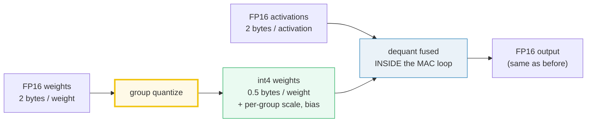
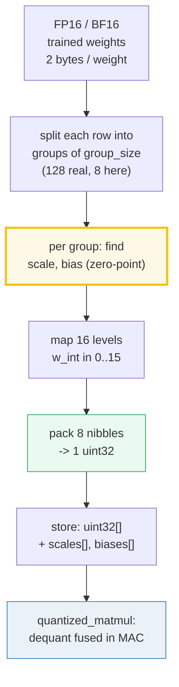
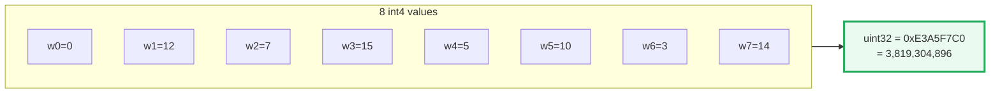
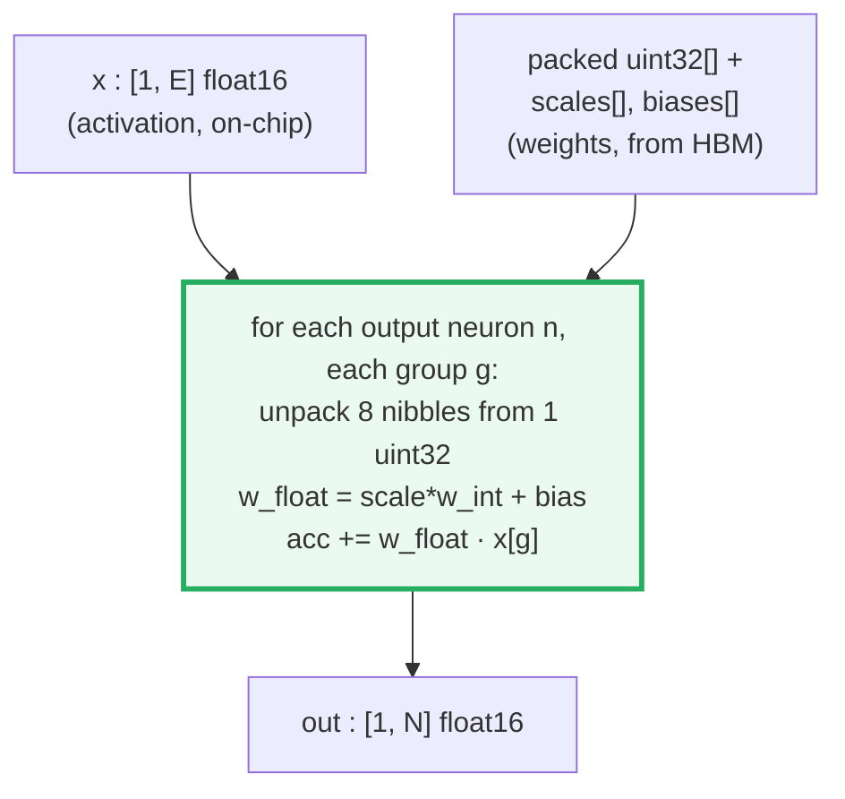
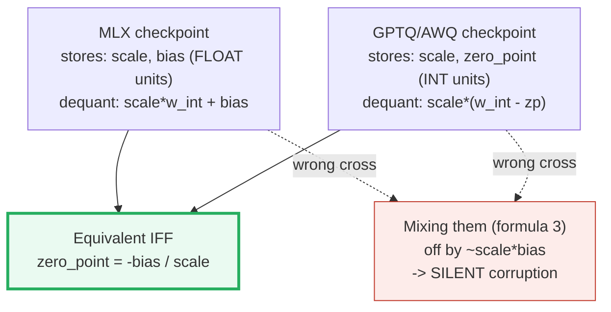
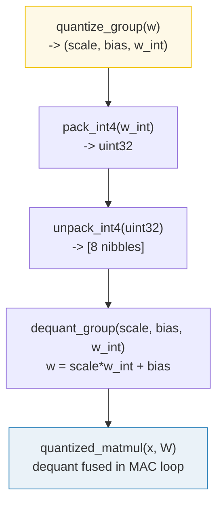
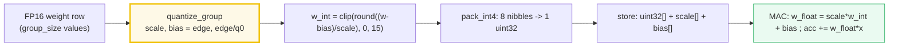

# W4A16 Group Quantization — A Visual, Worked-Example Guide

> **Companion code:** [`quantization.py`](./quantization.py). **Every number in
> this guide is printed by `uv run python quantization.py`** — change the code,
> re-run, re-paste. Nothing here is hand-computed.
>
> **Sibling guides:** [`ROPE.md`](./ROPE.md) and [`ABSOLUTE_PE.md`](./ABSOLUTE_PE.md)
> (position-embedding bundles — quantization composes *with* them, it is
> orthogonal). Cross-references are marked 🔗 throughout.
>
> **Live animation:** [`quantization.html`](./quantization.html) — open in a browser.
>
> **Who this is for:** you need almost no math and almost no code background.
> Every term is defined the first time it appears (see the
> [Glossary](#1-read-this-first--intuition--glossary) in §1). If a sentence has
> a number in it, that number came straight out of
> `quantization.py`, not from my head.
>
> **Source material:** `learning_guide/02_Acceleration.md` §5 (W4A16 Quantized
> Matmul) and `learning_guide/01_Math_Pipe.md` §5 (`QuantizedWeights`).

---

## 0. The one-sentence idea

> **Quantization rounds the model's weights to a coarser ruler so they take less
> memory and load faster — at the cost of a tiny rounding error.**

A 4-bit weight is only allowed **16 distinct values** per group (the numbers
`0..15`). Think of it like rounding a photo down to 16 colours, or rounding a
price to the nearest cent: you lose a hair of fidelity, but everything shrinks.
The whole game of this guide is: *how* do we round, *how much* do we save, and
*why* does it barely hurt quality?



One sentence for the picture above: *shrink the static weights to 4-bit, keep
the dynamic activations at 16-bit, and reconstruct each weight on the fly inside
the multiply.*

| | FP16 weights (baseline) | W4A16 (this guide) |
|---|---|---|
| **Weight storage** | 2 bytes / weight | 0.5 bytes + scale/bias overhead |
| **Activation storage** | 2 bytes | **2 bytes (unchanged)** |
| **Weight footprint** | 1.0× | **~3.8×** smaller (group_size=128) |
| **Accuracy** | baseline | near-lossless (per LLM.int8()) |
| **Where it runs** | everywhere | MLX, vLLM, llama.cpp, GPTQ models |

---

## 1. Read this first — intuition & glossary

If you read nothing else, read this. It is the entire concept in plain words.

### 1.1 Five intuitions (memorise these, the rest is detail)

1. **The coarser ruler.** A trained weight might be `+0.55`. Instead of storing
   that exact float, we snap it to the nearest of 16 allowed marks on a ruler.
   Fewer allowed marks → fewer bits to record which mark → less storage. 4 bits
   = 16 marks (`0..15`). That snapping is the *only* source of error, and for
   real models it barely matters (we prove it with numbers in §7).

2. **Why weights, not activations.** A model's **weights** are *static*: trained
   once, then loaded fresh from memory on **every single token** forever. They
   are also huge. So compressing them pays back constantly. **Activations** are
   *dynamic* — they change every token — and (per **LLM.int8()**, Dettmers 2022)
   a few "outlier" channels carry most of the signal; rounding those wrecks
   quality. So we quantize weights aggressively and leave activations at 16-bit.
   That asymmetry has a name: **W4A16** = **W**eights **4**-bit,
   **A**ctivations **16**-bit.

3. **Group, not global.** One ruler (a `scale`) and one offset (a `bias`) is
   shared by a **group** of weights — 128 in real models — not by each single
   weight. This keeps the number of stored rulers tiny while staying accurate,
   because weights that live next to each other usually have a similar range.

4. **Packing.** Eight 4-bit numbers each fit in a *nibble* (half a byte). Squeeze
   eight nibbles into one 32-bit box (`uint32`) and you've halved-halved-halved
   the storage versus 16-bit floats.

5. **Dequantize-on-the-fly.** At inference time we never rebuild the whole float
   weight matrix. Inside the matmul's inner loop, we unpack one nibble, multiply
   by the ruler, add the offset → get the real weight → multiply by the input,
   all in one breath. That fusion is *why* smaller weights actually make the chip
   faster, not just smaller.

### 1.2 The 12-word glossary

| Term | Plain meaning | Used in MLX as |
|---|---|---|
| **weight** | a learned number inside a layer; "static" model knowledge | `w`, packed as int4 |
| **activation** | the data flowing through each token; "dynamic" | `x`, kept at 16-bit |
| **bit / nibble** | 4 bits = half a byte = a *nibble*; a nibble holds **16 levels** (`0..15`) | the stored format |
| **scale** | the ruler's **step size** (float16); one per group | `s` |
| **bias** | the ruler's **offset / start point** (float16); one per group | `β` |
| **zero_point** | the *same* offset expressed in **int** units (`= -bias/scale`); GPTQ/AWQ use it | `zp` |
| **group_size** | how many consecutive weights share one (scale, bias); real = 128, here = 8 | 8 |
| **pack / unpack** | squeeze / extract eight nibbles into / from one `uint32` | §6 |
| **uint32** | one unsigned 32-bit box; stores **8 nibbles = 8 weights** | the storage unit |
| **matmul** | matrix multiply; the core op of every linear layer | `x @ W.T` |
| **dequantize** | int4 weight → float: `w = scale*w_int + bias` | fused in the MAC loop |
| **bandwidth-bound** | the chip *waits* for weights to arrive from memory; math is not the bottleneck | why smaller = faster |

> **Why 4-bit weights but 16-bit activations?** Weights are *static* — loaded
> once, reused every token, so shrinking them pays back every decode step.
> Activations are *dynamic* and (per LLM.int8(), Dettmers 2022) contain a few
> "outlier" channels that dominate the output; quantizing them aggressively
> wrecks accuracy. So we keep activations at 16-bit and quantize weights only.
> That is the whole meaning of "W4A16".

> 🔗 This is *orthogonal* to position embeddings: [`ROPE.md`](./ROPE.md) and
> [`ABSOLUTE_PE.md`](./ABSOLUTE_PE.md) decide *where a token is*; quantization
> decides *how the weights are stored*. A real model uses both, and they never
> interact.

---

## 2. The lineage: FP16 → W4A16 group quantization

How a row of ordinary float weights becomes a pile of packed 4-bit boxes:



One sentence: *chop each weight row into groups, give each group its own ruler
(scale + bias), snap every weight to one of 16 marks, cram eight marks into one
`uint32`, and at runtime unpack-and-multiply on the fly.*

Each group of `group_size` consecutive weights (along the **input** dimension of
a `[N, E]` weight matrix) shares **one** `scale` and **one** `bias`. The packed
int4 weights, scales, and biases are the only things stored — the original float
weights are thrown away.

---

## 3. The math — verified against the MLX C++ source

> **Sign convention verified** in `mlx/backend/cpu/quantized.cpp`, function
> `quantize<T,U>` (the quantizer) and `_qmm_t` (the matmul kernel). The MLX
> `dequantize` docs state the same formula verbatim:
> **`w_i = s · ŵ_i + β`** (scale times the int, then add the bias, where the
> bias is in **float** units). Source: [MLX dequantize docs](https://ml-explore.github.io/mlx/build/html/python/_autosummary/mlx.core.dequantize.html).

### 3.1 Quantize (per group) — "find the ruler"

```
w_min, w_max  = min, max of the group
mask          = |w_min| > |w_max|              # which extreme is "heavier"
scale         = mask ? +(w_max - w_min)/15 : -(w_max - w_min)/15
edge          = mask ? w_min : w_max
q0            = round(edge / scale)             # integer, ~ -9 or +9 for 4 bits
if q0 != 0:   scale = edge / q0 ;  bias = edge  # edge maps EXACTLY to int4 = q0
else:         bias = 0

w_int[i]      = clip( round( (w[i] - bias) / scale ), 0, 15 )
```

In plain English: find the group's widest value (the `edge`), lay out 16 evenly
spaced marks so that the `edge` lands exactly on a mark, then snap every weight
to its nearest mark and record *which mark* as a number `0..15`. The
`scale = edge / q0` readjustment is the subtle bit — it makes the heaviest
extreme reconstruct with **zero error** (it lands dead on an integer level).
Only the interior weights carry rounding error (up to `±scale/2`).

### 3.2 Dequant (fused inside the MAC loop) — "use the ruler"

```
w_float = scale * w_int + bias          # MLX convention: + bias, in FLOAT units
```

Take the stored mark number, multiply by the step size, add the offset → the
approximate real weight. Done.

### 3.3 Packing — 8 nibbles per `uint32`

```
bits[ 0: 4] = w_int[0]     (lowest nibble)
bits[ 4: 8] = w_int[1]
bits[ 8:12] = w_int[2]
...
bits[28:32] = w_int[7]     (highest nibble)

unpack:  nibble_k = (packed >> (4*k)) & 0xF
```

So for `group_size=128`: `128 / 8 = 16` uint32 values hold the whole group.

> ⚠️ **The headline pitfall** — see [§8](#8-sign-convention-pitfall--mlx-vs-textbook).
> The MLX dequant is `scale*w_int + bias` with `bias` in **float** units. The
> popular textbook formula is `scale*(w_int - zero_point)` with `zero_point`
> in **int** units. They are equal *only* when `zero_point = -bias/scale`.
> Mixing them silently corrupts the model — and the source guide's own prose
> (`w = (w_int + bias)*scale`) is itself wrong about MLX (its kernel code is
> right, its prose isn't).

---

## 4. Why quantize — the memory math — Section A output

Decode loads the weight matrix from HBM every token. For one linear layer of
Qwen3-0.5B (`E = 896`):

> From `quantization.py` **Section A**:
>
> | format | bytes (one [896,896] matrix) | vs FP16 |
> |---|---|---|
> | FP16 / BF16 | 1,605,632 = **1.606 MB** | 1.0× |
> | W4A16, group_size=8 | 802,816 = 0.803 MB | 2.0× |
> | W4A16, group_size=128 | 426,496 = **0.426 MB** | **3.76×** |

The `group_size=128` row is the real-world win: 128 weights pack into
`128/8 = 16` uint32s (64 bytes) plus one scale + one bias (4 bytes) = **68
bytes per group**, versus 256 bytes of FP16 → 3.76×. Small `group_size` (like
our printable 8) wastes bytes on scale/bias overhead.

**Why this matters at runtime:** LLM decode is **bandwidth-bound** — the chip
streams the weight matrix from HBM every single token, and the math is so fast
the chip mostly *waits for the weights to arrive*. Shrinking the static weight
footprint ~4× directly speeds up inference; keeping activations at 16-bit
preserves accuracy (per LLM.int8() findings). At Apple M2 bandwidth (~200 GB/s):
the FP16 matrix takes ~8 µs to load; the W4A16 matrix ~2 µs. Across 28 matrices
× 24 layers, that is the difference between ~4 tok/s and ~18 tok/s on
Qwen3-0.5B (per `learning_guide/02_Acceleration.md` §5.1).

---

## 5. Quantize ONE row of 8 floats — Section B output (the worked example)

This is the heart of the guide. We narrate it step by step.

**Setup.** Take a single row of 8 real-valued weights (a printable stand-in for
one group of 128). We deliberately chose values that make the MLX quantizer
produce clean `scale = 0.2`, `bias = -1.8`, so every number is easy to follow.

> From `quantization.py` **Section B**:
>
> Input `w = [-1.80, 0.55, -0.35, 1.20, -0.85, 0.25, -1.15, 1.05]`

**Step 1 — find the extremes.** `w_min = -1.80`, `w_max = +1.20`.

**Step 2 — which extreme is "heavier"?** `mask = |w_min| > |w_max| = 1.80 > 1.20
= True`, so the negative end is heavier. That heavier end is the `edge`:
`edge = w_min = -1.80`. The `edge` is special — MLX pins it to reconstruct with
**zero error** (it becomes the anchor of the ruler).

**Step 3 — lay out the ruler.** `scale = edge / q0 = -1.80 / -9 = 0.200000`.
`bias = edge = -1.800000` (in float units). So our ruler has marks every `0.2`,
starting at `-1.8` (mark 0) up to `+1.2` (mark 15).

> Deriving the per-group parameters:
> - `w_min = -1.80`, `w_max = +1.20`
> - `mask = |w_min| > |w_max| = 1.80 > 1.20 = True`
> - `edge = w_min = -1.80` (the heavier extreme → zero-error anchor)
> - `scale = edge / q0 = -1.80 / -9 = 0.200000`
> - `bias = edge = -1.800000` (float units)

**Step 4 — snap each weight to its nearest mark.** For each weight compute
`(w - bias) / scale`, round it, and clip to `0..15`. That integer is the stored
value.

> Per-element quantize `w_int = clip(round((w - bias)/scale), 0, 15)`:
>
> | k | w[k] | (w−bias)/scale | round | w_int | dequant | error |
> |---|---|---|---|---|---|---|
> | 0 | −1.80 | +0.0000 | 0 | **0** | −1.8000 | +0.0000 |
> | 1 | +0.55 | +11.7500 | 12 | **12** | +0.6000 | −0.0500 |
> | 2 | −0.35 | +7.2500 | 7 | **7** | −0.4000 | +0.0500 |
> | 3 | +1.20 | +15.0000 | 15 | **15** | +1.2000 | +0.0000 |
> | 4 | −0.85 | +4.7500 | 5 | **5** | −0.8000 | −0.0500 |
> | 5 | +0.25 | +10.2500 | 10 | **10** | +0.2000 | +0.0500 |
> | 6 | −1.15 | +3.2500 | 3 | **3** | −1.2000 | +0.0500 |
> | 7 | +1.05 | +14.2500 | 14 | **14** | +1.0000 | +0.0500 |

**Result:** `scale = 0.2`, `bias = −1.8`, `w_int = [0, 12, 7, 15, 5, 10, 3, 14]`.

**Read the result.** Notice `w[0] = −1.80` (the `edge`) and `w[3] = +1.20` (the
other extreme) both reconstruct with **zero error** — that is the whole point of
MLX's `bias = edge`, `scale = edge/q0` trick. The six interior weights drift by
at most `±scale/2 = ±0.1`. **That ~0.05 wobble is the entire price of 4-bit
quantization**; for real models it barely dents quality and ~4× the weights fit
in memory (see the matmul proof in §7).

---

## 6. Pack 8 int4 → one `uint32` — Section C output

We just produced 8 tiny integers. Now we cram them into one 32-bit box so they
take almost no space. Each integer lives in 4 bits (a *nibble*); eight nibbles
fit exactly into 32 bits.

> From `quantization.py` **Section C**:
>
> `w_int = [0, 12, 7, 15, 5, 10, 3, 14] = [0x0, 0xC, 0x7, 0xF, 0x5, 0xA, 0x3, 0xE]`
>
> | bit range | k | shift | w_int[k] | hex |
> |---|---|---|---|---|
> | [0:4] | 0 | 0 | 0 | 0x0 |
> | [4:8] | 1 | 4 | 12 | 0xC |
> | [8:12] | 2 | 8 | 7 | 0x7 |
> | [12:16] | 3 | 12 | 15 | 0xF |
> | [16:20] | 4 | 16 | 5 | 0x5 |
> | [20:24] | 5 | 20 | 10 | 0xA |
> | [24:28] | 6 | 24 | 3 | 0x3 |
> | [28:32] | 7 | 28 | 14 | 0xE |
>
> ```
> packed = 0 | (12<<4) | (7<<8) | (15<<12) | (5<<16) | (10<<20) | (3<<24) | (14<<28)
>        = 3819304896
>        = 0xE3A5F7C0
>        = 0b11100011101001011111011111000000
> ```
>
> Read the hex **right-to-left** to recover `w_int` in order: `0xE3A5F7C0` →
> nibbles `[0, C, 7, F, 5, A, 3, E]` = `[0, 12, 7, 15, 5, 10, 3, 14]`. ✔

One sentence: *the lowest nibble of the box holds `w_int[0]`, the next holds
`w_int[1]`, and so on — read the hex right-to-left to get them back in order.*



---

## 7. Unpack + dequant + quantized matmul — Sections D & E

### 7.1 Round-trip (Section D) — "does it come back correctly?"

The whole point of §5–§6 was to *throw away* the floats and keep only the box
`0xE3A5F7C0` plus two numbers (`scale`, `bias`). Now we prove we can get the
weights back, with only the tiny rounding error we accepted.

> From `quantization.py` **Section D** — unpacking `0xE3A5F7C0` and dequantizing:
>
> `unpacked = [0, 12, 7, 15, 5, 10, 3, 14]` (matches `w_int` ✔)
>
> `w_float = 0.2 * w_int + (-1.8) = [-1.8, 0.6, -0.4, 1.2, -0.8, 0.2, -1.2, 1.0]`
>
> Max abs error = **0.0500**, mean abs error = 0.0375 (ceiling is `scale/2 = 0.1`).

> **The gold values** (the exact floats `quantization.html` must reproduce
> bit-for-bit, from Section D's GOLD block):
> `scale = 0.19999999470180935`, `bias = -1.7999999523162842`,
> `w_int = [0, 12, 7, 15, 5, 10, 3, 14]`,
> `packed = 3819304896 (0xE3A5F7C0)`,
> `dequant = [-1.8, 0.6, -0.4, 1.2, -0.8, 0.2, -1.2, 1.0]`.

### 7.2 Quantized matmul vs float matmul (Section E) — "does the answer still come out right?"

The real test: feed these reconstructed weights into an actual matrix multiply
and compare against the float original. The kernel dequants **inside** the MAC
loop — it pulls a uint32, unpacks 8 nibbles, dequantizes each to float, and
immediately multiplies by the activation. It never builds the full float weight
matrix. Tiny test `[1,8] @ [8,4]`:

> From `quantization.py` **Section E**:
>
> `x = [0.5, -0.3, 0.8, -0.1, 0.4, -0.6, 0.2, 0.7]`, `W` is `[4, 8]` (each row
> quantized independently, row 0 = the hero row above).
>
> | output n | float `x@W.T` | quantized (dequant in MAC) | abs error |
> |---|---|---|---|
> | 0 | −1.4500 | −1.5000 | 0.0500 |
> | 1 | +2.0800 | +2.0800 | 0.0000 |
> | 2 | −1.9500 | −2.0267 | 0.0767 |
> | 3 | +2.0600 | +1.9987 | 0.0612 |
>
> Max abs error = **0.0767**, mean rel error = **2.59%**. `[check] < 0.5 : OK`.

**Reassurance, with numbers:** the worst output is off by `0.0767` on values
around `±2` — about **2.6% relative error**, and one output is *exact*. That is
the entire accuracy cost of cutting weight memory ~4×. On real LLMs the quality
drop is imperceptible to humans, which is why every major inference engine
(MLX, vLLM, llama.cpp) ships W4A16 by default.



One sentence: *the activation `x` stays on-chip in 16-bit; the weights arrive as
packed boxes and are unpacked-and-multiplied on the fly, so the big, slow memory
traffic is 4× smaller.*

This mirrors the real Metal kernel in `learning_guide/02_Acceleration.md` §5.3:
eight MAC lines unrolled per uint32, dequant (`scale*w_int + bias`) inline.

---

## 8. Sign-convention pitfall — MLX vs textbook 🔗

**This is the #1 source of silent corruption** — and the single most important
thing to internalise if you ever touch a quantized checkpoint by hand. Read this
even if you skip everything else technical.

**The finding, in plain English.** There are two ways to write the dequant
formula. Some textbooks write `w = scale*(w_int − zero_point)` (the offset is a
*zero_point* measured in **int** units). **MLX actually uses
`w = scale*w_int + bias`** (the offset is a *bias* measured in **float** units,
added *after* the scaling). It is the same idea with different bookkeeping — and
mixing the two silently corrupts the result by about `1.4` in our example. We
use the real MLX one throughout this guide.

> From `quantization.py` **Section F**, using the hero group
> (`scale=0.2`, `bias=−1.8`, `w_int[1]=12`):
>
> | # | formula | units of offset | result for w_int=12 | verdict |
> |---|---|---|---|---|
> | 1 | `scale*w_int + bias` (MLX) | bias = **float** (= edge) | `0.2*12 + (−1.8)` = **+0.6000** | ✅ correct |
> | 2 | `scale*(w_int − zero_point)` (GPTQ/AWQ textbook) | zp = **int** (= −bias/scale = 9) | `0.2*(12 − 9)` = **+0.6000** | ✅ correct |
> | 3 | `(w_int + bias)*scale` (source-guide prose) | misuses float-unit bias as int-unit | `(12 + (−1.8))*0.2` = **+2.0400** | ❌ **wrong by 1.44** |



One sentence: *formulas 1 and 2 agree when you convert the offset's units
correctly (`zero_point = -bias/scale`); formula 3 silently feeds a float-unit
`bias` into a slot that expects an int-unit `zero_point`, and the answer is off
by ~1.44 with no error message.*

**Why the source guide's prose is misleading:** `learning_guide/02_Acceleration.md`
§5.2 writes `w_float = (w_int4 + bias) * scale ← MLX sign convention`. But its
*own Metal kernel* (§5.3, line `sum += (... * scale + bias) * a[...]`) computes
`scale*w_int + bias` — matching real MLX. The prose and the kernel disagree;
the kernel is right. The MLX C++ source (`mlx/backend/cpu/quantized.cpp`) and
the MLX docs (`w_i = s·ŵ_i + β`) confirm: **bias is added AFTER scaling, in
float units**.

**The rule:** read the checkpoint format, pick the matching formula, and never
reuse a float-unit `bias` where an int-unit `zero_point` is expected.

---

## 9. The reference code (`quantization.py`)

Four tiny functions form the full pipeline:



`quantize_group` is a faithful line-by-line port of MLX's C++ `quantize<T,U>`
(`mlx/backend/cpu/quantized.cpp`), including the `edge / q0` scale readjustment
that pins the heavier extreme to zero error. The matmul dequants **inside** the
accumulator loop, exactly like the Metal/CPU kernels.

---

## 10. Pitfalls

| # | Mistake | Symptom | Fix |
|---|---|---|---|
| 1 | Using `(w_int + bias)*scale` with a float-unit `bias` | Silent ±1.44 corruption (§8) | MLX: `scale*w_int + bias`; or convert `zp = -bias/scale` first |
| 2 | Confusing MLX `bias` (float units) with GPTQ `zero_point` (int units) | Same as #1 | Check checkpoint format; they differ by a factor of `scale` |
| 3 | Packing nibbles in the wrong order (MSB-first vs LSB-first) | Garbled weights, huge matmul error | MLX/CPU kernel: `bits[4k:4k+4] = w_int[k]` (LSB-first), unpack `(packed >> 4k) & 0xF` |
| 4 | Quantizing activations too (W4A4) | Accuracy collapse on outlier channels | Keep activations at 16-bit (LLM.int8() finding); quantize weights only |
| 5 | Using `group_size` that doesn't divide `E` | Crash / misaligned groups | Pad or pick `group_size ∈ {32, 64, 128}` that divides `E` |
| 6 | Forgetting the `scale = edge/q0` readjustment | Min/max don't pin to exact levels; extra error | Implement the full MLX quantizer (see `quantize_group`) |
| 7 | Materializing the full dequantized weight matrix | Defeats the bandwidth win | Fuse dequant into the MAC loop (see `quantized_matmul`) |

---

## 11. Cheat sheet



- **Format:** W4A16 — 4-bit weights, 16-bit activations.
- **Group:** `group_size` consecutive weights (real: 128; this guide: 8) share
  one `scale` + one `bias`.
- **Quantize:** `w_int = clip(round((w − bias)/scale), 0, 15)`; `bias = edge`,
  `scale = edge/q0` (zero-error anchor on the heavier extreme).
- **Dequant:** `w = scale*w_int + bias` (MLX; bias in **float** units).
- **Pack:** `bits[4k:4k+4] = w_int[k]`; 8 nibbles per uint32.
- **Memory:** ~3.8× smaller weights (group_size=128); activations unchanged.
- **Matmul:** dequant fused inside the MAC loop — never materialize full weights.
- **Win:** bandwidth-bound decode speeds up ~3–4×, accuracy near-lossless
  (worst-case ~2.6% relative error on our toy matmul, one output exact).

> 🔗 Quantization is orthogonal to the position-embedding bundles — see
> [`ROPE.md`](./ROPE.md) (rotary) and [`ABSOLUTE_PE.md`](./ABSOLUTE_PE.md)
> (additive). A real Qwen3-style model uses RoPE for position *and* W4A16 for
> weights; the two never interact.

---

## Sources

- **MLX `dequantize` docs** — states the affine dequant verbatim as
  `w_i = s · ŵ_i + β` (bias added **after** scaling, in **float** units):
  https://ml-explore.github.io/mlx/build/html/python/_autosummary/mlx.core.dequantize.html
- **MLX C++ source** — `mlx/backend/cpu/quantized.cpp`, function `quantize<T,U>`
  (the `edge / q0` scale readjustment, `bias = edge`) and `_qmm_t`
  (`scale * w_int + bias` fused in the MAC loop):
  https://github.com/ml-explore/mlx/blob/master/mlx/backend/cpu/quantized.cpp
- **MLX `quantize` / `QuantizedLinear`** — Python layer calling
  `mx.quantize` / `mx.quantized_matmul`:
  https://github.com/ml-explore/mlx/blob/master/python/mlx/nn/layers/quantized.py
- **LLM.int8()** — Dettmers et al., 2022 (why activations stay high-precision:
  a few "outlier" channels dominate the output and must stay in 16-bit;
  weight-only quantization preserves accuracy):
  arXiv:2208.07339 — https://arxiv.org/abs/2208.07339
- **GPTQ** — Frantar et al., 2022 (accurate one-shot post-training weight
  quantization to 3–4 bits; uses the `scale*(w_int − zero_point)` textbook
  convention with **int-unit** `zero_point`):
  arXiv:2210.17323 — https://arxiv.org/abs/2210.17323
- **AWQ** — Lin et al., MLSys 2024 (activation-aware weight quantization,
  group_size=128): https://proceedings.mlsys.org/paper_files/paper/2024/file/42a452cbafa9dd64e9ba4aa95cc1ef21-Paper-Conference.pdf
- **Internal source material** — `learning_guide/02_Acceleration.md` §5
  (W4A16 kernel, memory math) and `learning_guide/01_Math_Pipe.md` §5
  (`QuantizedWeights` data structure). ⚠️ Note: the prose formula in
  `02_Acceleration.md` §5.2 (`w = (w_int + bias)*scale`) is inconsistent with
  its own Metal kernel and with real MLX; see [§8](#8-sign-convention-pitfall--mlx-vs-textbook).
