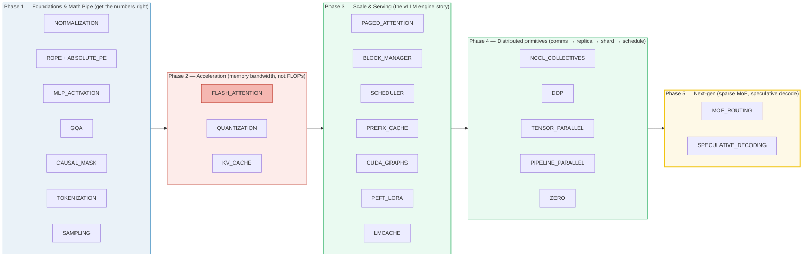
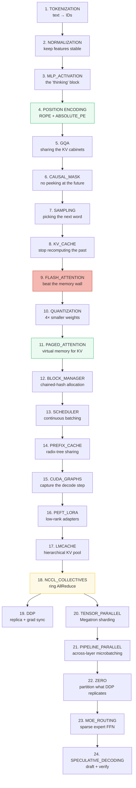

# research/ — ZeroServe Concept Bundles

> **One idea = four files that cite each other**, all deriving from a runnable
> `.py` that prints every number. Nothing is hand-computed; everything is
> fact-checked against the original papers. Each guide is written so a person
> with **minimal math and coding** background can follow every step.
>
> Source material: [`../learning_guide/`](../learning_guide/) (the ZeroServe
> journey). Start at [`HOW_TO_RESEARCH.md`](./HOW_TO_RESEARCH.md) for the
> philosophy, or just pick a bundle below.

---

## 🗺️ The map: every bundle, by phase



**Cross-reference web** (🔗 in every guide):
- RoPE's `offset` ⟷ KV_CACHE's decode offset ⟷ CAUSAL_MASK's `k=(S−L)`
- RoPE & GQA both operate on Q/K; the frequency ladder is shared with ABSOLUTE_PE
- FLASH_ATTENTION + KV_CACHE + QUANTIZATION all share the "LLMs are bandwidth-bound" thesis
- KV_CACHE's paged cache ⟷ PAGED_ATTENTION's logical→physical pages ⟷ BLOCK_MANAGER's `block_table`
- BLOCK_MANAGER's chained hash ⟷ PREFIX_CACHE's radix tree (flat dedup vs arbitrary-prefix sharing)
- SCHEDULER consumes BLOCK_MANAGER's allocation; CUDA_GRAPHS captures SCHEDULER's steady-state decode
- DDP & TENSOR_PARALLEL both consume NCCL_COLLECTIVES (grad AllReduce vs Megatron's AllReduce)
- ZERO partitions what DDP replicates ⟷ DDP (the redundancy ZeRO eliminates is exactly DDP's full copy)
- PIPELINE_PARALLEL splits work *across layers* vs TENSOR_PARALLEL within a single layer (both need NCCL_COLLECTIVES)
- MOE_ROUTING's sparse expert FFN ⟷ MLP_ACTIVATION's dense SwiGLU (same FFN, top-k routed instead of always-on)
- SPECULATIVE_DECODING's rejection sampling ⟷ SAMPLING (same distribution) and its draft-chain KV rewind ⟷ KV_CACHE
- PEFT_LORA's grouped GEMM + LMCACHE's hierarchy extend the serving engine beyond dense inference

---

## 📚 All 25 bundles at a glance

Every row is the 4-file bundle: `.py` (ground truth) · `.md` (guide) · `.html` (interactive).
Also commit `*_output.txt` (captured stdout — see each `.md`'s `> From X.py Section Y:` callouts).

| # | Concept (lineage) | Phase | `name.py` | Guide `.md` | Interactive `.html` |
|---|---|---|---|---|---|
| 1 | **Normalization** — LayerNorm → RMSNorm | 1 | [`normalization.py`](./normalization.py) | [`NORMALIZATION.md`](./NORMALIZATION.md) | [`normalization.html`](./normalization.html) |
| 2 | **Position encoding (a)** — RoPE (rotary) | 1 | [`rope.py`](./rope.py) | [`ROPE.md`](./ROPE.md) | [`rope.html`](./rope.html) |
| 2 | **Position encoding (b)** — absolute (sinusoidal/learned) | 1 | [`absolute_pe.py`](./absolute_pe.py) | [`ABSOLUTE_PE.md`](./ABSOLUTE_PE.md) | [`absolute_pe.html`](./absolute_pe.html) |
| 3 | **MLP & activation** — ReLU → GELU → SwiGLU/SiLU | 1 | [`mlp_activation.py`](./mlp_activation.py) | [`MLP_ACTIVATION.md`](./MLP_ACTIVATION.md) | [`mlp_activation.html`](./mlp_activation.html) |
| 4 | **Attention heads** — MHA → MQA → GQA | 1 | [`gqa.py`](./gqa.py) | [`GQA.md`](./GQA.md) | [`gqa.html`](./gqa.html) |
| 5 | **Attention mechanics** — causal mask + `k=(S−L)` offset + QK-Norm + shapes | 1 | [`causal_mask.py`](./causal_mask.py) | [`CAUSAL_MASK.md`](./CAUSAL_MASK.md) | [`causal_mask.html`](./causal_mask.html) |
| 6 | **Tokenization** — WordPiece → BPE → SentencePiece | 1 | [`tokenization.py`](./tokenization.py) | [`TOKENIZATION.md`](./TOKENIZATION.md) | [`tokenization.html`](./tokenization.html) |
| 7 | **Sampling** — greedy → top-k → top-p nucleus | 1 | [`sampling.py`](./sampling.py) | [`SAMPLING.md`](./SAMPLING.md) | [`sampling.html`](./sampling.html) |
| 8 | **Attention compute** — materialized softmax → FlashAttention (online softmax) ★hardest | 2 | [`flash_attention.py`](./flash_attention.py) | [`FLASH_ATTENTION.md`](./FLASH_ATTENTION.md) | [`flash_attention.html`](./flash_attention.html) |
| 9 | **Precision & weights** — FP16 → W4A16 group quantization | 2 | [`quantization.py`](./quantization.py) | [`QUANTIZATION.md`](./QUANTIZATION.md) | [`quantization.html`](./quantization.html) |
| 10 | **KV memory** — recompute → dense cache → paged cache (+ rewind) | 2 | [`kv_cache.py`](./kv_cache.py) | [`KV_CACHE.md`](./KV_CACHE.md) | [`kv_cache.html`](./kv_cache.html) |
| 12 | **Paged attention** — dense prealloc KV (93% wasted) → PagedAttention: OS virtual memory, logical→physical pages | 3 | [`paged_attention.py`](./paged_attention.py) | [`PAGED_ATTENTION.md`](./PAGED_ATTENTION.md) | [`paged_attention.html`](./paged_attention.html) |
| 13 | **Block manager** — flat alloc → BlockManager: chained xxHash prefix dedup + `ref_count` sharing | 3 | [`block_manager.py`](./block_manager.py) | [`BLOCK_MANAGER.md`](./BLOCK_MANAGER.md) | [`block_manager.html`](./block_manager.html) |
| 14 | **Scheduler** — static batching → continuous batching (Orca) + chunked prefill + preemption | 3 | [`scheduler.py`](./scheduler.py) | [`SCHEDULER.md`](./SCHEDULER.md) | [`scheduler.html`](./scheduler.html) |
| 15 | **Prefix cache** — block-hash reuse → RadixAttention: radix tree for arbitrary prefix sharing | 3 | [`prefix_cache.py`](./prefix_cache.py) | [`PREFIX_CACHE.md`](./PREFIX_CACHE.md) | [`prefix_cache.html`](./prefix_cache.html) |
| 16 | **CUDA graphs** — eager Python overhead per step → captured/replayed decode graphs (one per BS) | 3 | [`cuda_graphs.py`](./cuda_graphs.py) | [`CUDA_GRAPHS.md`](./CUDA_GRAPHS.md) | [`cuda_graphs.html`](./cuda_graphs.html) |
| 17 | **PEFT / LoRA** — full fine-tune replicas → LoRA/QLoRA low-rank adapters + Punica/S-LoRA grouped GEMM | 3 | [`peft_lora.py`](./peft_lora.py) | [`PEFT_LORA.md`](./PEFT_LORA.md) | [`peft_lora.html`](./peft_lora.html) |
| 18 | **LMCache** — single-GPU prefix cache → hierarchical GPU→CPU→NVMe→S3 global pool + RDMA lookup | 3 | [`lmcache.py`](./lmcache.py) | [`LMCACHE.md`](./LMCACHE.md) | [`lmcache.html`](./lmcache.html) |
| 19 | **NCCL collectives** — P2P comms → NCCL 5 primitives + ring-AllReduce (2N bytes regardless of K) | 4 | [`nccl_collectives.py`](./nccl_collectives.py) | [`NCCL_COLLECTIVES.md`](./NCCL_COLLECTIVES.md) | [`nccl_collectives.html`](./nccl_collectives.html) |
| 20 | **DDP** — single-GPU training → DDP: full replica + grad AllReduce + AMP + grad accumulation + cosine LR | 4 | [`ddp.py`](./ddp.py) | [`DDP.md`](./DDP.md) | [`ddp.html`](./ddp.html) |
| 21 | **Tensor parallel** — matrices too big for 1 GPU → Megatron column/row parallel (AllReduce cancels across MLP/attn) | 4 | [`tensor_parallel.py`](./tensor_parallel.py) | [`TENSOR_PARALLEL.md`](./TENSOR_PARALLEL.md) | [`tensor_parallel.html`](./tensor_parallel.html) |
| 22 | **Pipeline parallel** — TP not enough → GPipe micro-batching, 1F1B, interleaved (bubble `(K-1)/(K+M-1)`) | 4 | [`pipeline_parallel.py`](./pipeline_parallel.py) | [`PIPELINE_PARALLEL.md`](./PIPELINE_PARALLEL.md) | [`pipeline_parallel.html`](./pipeline_parallel.html) |
| 23 | **ZeRO** — DDP redundancy (20N bytes) → ZeRO 1/2/3 partition opt-state/grad/params | 4 | [`zero.py`](./zero.py) | [`ZERO.md`](./ZERO.md) | [`zero.html`](./zero.html) |
| 24 | **MoE routing** — dense FFN (all params active) → top-k sparse MoE + load-balance/z-loss + DeepSeek aux-free | 5 | [`moe_routing.py`](./moe_routing.py) | [`MOE_ROUTING.md`](./MOE_ROUTING.md) | [`moe_routing.html`](./moe_routing.html) |
| 25 | **Speculative decoding** — 1 token/step (memory-bound) → draft+verify parallel (rejection sampling, exact dist) | 5 | [`speculative_decoding.py`](./speculative_decoding.py) | [`SPECULATIVE_DECODING.md`](./SPECULATIVE_DECODING.md) | [`speculative_decoding.html`](./speculative_decoding.html) |

> The 11 files map to the **10 key problems** in the curriculum — position
> encoding is one problem split across two sibling bundles (`ROPE` ↔ `ABSOLUTE_PE`).

---

## 🧭 Suggested beginner reading order

Read the `.md` first, play with the `.html`, then skim the `.py` to see the
ground-truth numbers. Build the mental model bottom-up:



If you only have time for three: **ROPE** (the relative-position idea),
**FLASH_ATTENTION** (the bandwidth-bound thesis), **KV_CACHE** (why serving is hard).

---

## 🛠️ The meta-guides (how this folder works)

| Guide | What it's for | When to read |
|---|---|---|
| [`HOW_TO_RESEARCH.md`](./HOW_TO_RESEARCH.md) | The 4-file bundle law: `.py` = ground truth, `.md` = verbatim numbers under callouts, `.html` = recompute + gold-check. | Before building any bundle by hand |
| [`HOW_TO_ANIMATE.md`](./HOW_TO_ANIMATE.md) | The self-contained `.html` recipe (zero deps, dark palette, slider + `[check: OK]` badge). | Before writing any animation |
| [`SUBAGENTS_RESEARCH_GUIDE.md`](./SUBAGENTS_RESEARCH_GUIDE.md) | How to delegate many bundles to parallel subagents at scale (prompt template + verification sweep). | Before spawning a build/review swarm |

---

## ✅ Verify everything (re-runnable)

Every `.py` runs clean with `[check]` asserts; every `.html` passes `node --check`
and shows a green `[check: OK]` gold badge. Re-confirm the whole folder:

```bash
cd research
for n in normalization mlp_activation gqa causal_mask tokenization sampling \
         flash_attention quantization kv_cache rope absolute_pe \
         paged_attention block_manager scheduler prefix_cache cuda_graphs peft_lora lmcache \
         nccl_collectives ddp tensor_parallel \
         pipeline_parallel zero moe_routing speculative_decoding; do
  uv run python $n.py >/dev/null 2>&1 && echo "  $n.py: OK" || echo "  $n.py: FAILED"
  python3 -c "import re;open('/tmp/_j.js','w').write(re.search(r'<script>(.*)</script>',open('$n.html').read(),re.S).group(1))" 2>/dev/null
  node --check /tmp/_j.js 2>/dev/null && echo "  $n.html JS: OK" || echo "  $n.html JS: FAIL"
done
```

Each `.md` numbers its tables under `> From {name}.py Section X:` callouts —
diff them against `{name}_output.txt` to audit any value.

---

## ➕ Add a new bundle

1. Pick a concept from [`../learning_guide/`](../learning_guide/).
2. Follow [`HOW_TO_RESEARCH.md`](./HOW_TO_RESEARCH.md) (the 6-step workflow).
3. If building several at once, delegate via [`SUBAGENTS_RESEARCH_GUIDE.md`](./SUBAGENTS_RESEARCH_GUIDE.md).
4. Add a row to the table above and the reading-order mermaid.
5. 🔗 cross-reference the new bundle from the related existing ones.

---

## 🔑 The one rule (why this folder is trustworthy)

> **If a number appears in a `.md` or `.html`, it was printed by the `.py` — or
> recomputed in JS with the identical formula and gold-checked against it. Every
> formula is fact-checked against the original paper. Nothing is hand-waved.**

That single discipline is what lets these guides scale to 25+ topics without
drifting into "trust me" math.
