# Rotary Position Embeddings (RoPE) — A Visual, Worked-Example Guide

> **Companion code:** [`rope.py`](./rope.py). **Every number in this guide is
> printed by `uv run python rope.py`** — change the code, re-run, re-paste.
> Nothing here is hand-computed.
>
> **Sibling guide:** [`ABSOLUTE_PE.md`](./ABSOLUTE_PE.md) — learned & sinusoidal
> absolute position embeddings (nanoGPT / original Transformer). Cross-references
> are marked 🔗 throughout.
>
> **Live animation:** [`rope.html`](./rope.html) — open in a browser, drag a
> slider, watch the needles spin.
>
> **Source material:** `learning_guide/00_Foundations.md` §7.3 and
> `learning_guide/01_Math_Pipe.md` §2.3.

---

## 0. TL;DR — the whole idea in one picture

> **The compass analogy (read this first):** Imagine every token holds a small
> **compass needle**. The token's POSITION tells it how far to rotate its needle
> — position 0 = no turn at all, position 5 = turn a lot. When two tokens later
> compare themselves (a *dot product*, `Q · K`), what matters is the
> **difference** in how far their needles turned — i.e. how far apart they sit.
> Position becomes rotation; **relative distance appears for free**. That is the
> whole of RoPE.

The Transformer's attention is a dot product `Q · K`. A dot product has **no idea
where tokens are** — token #0 and token #5000 look identical to it. We must inject
"position" somehow. There are two big families:

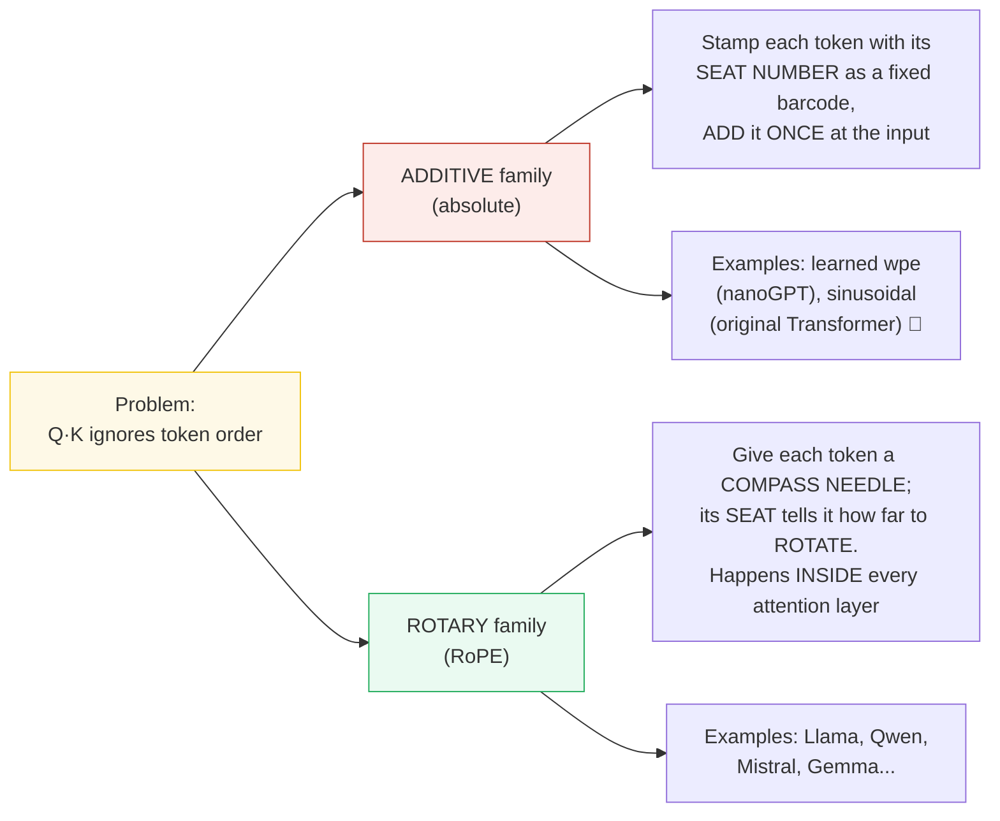

One plain sentence per family: **absolute PE stamps a barcode; RoPE spins a
compass needle.** The barcode depends on the exact seat number; the needle's
*relative* tilt is all that survives a comparison.

| | Additive (absolute) 🔗 | Rotary (RoPE) |
|---|---|---|
| **Mental model** | Stamp a seat-number barcode | Spin a compass needle |
| **Where applied** | Input embedding, once | Q & K in **every** layer |
| **What shape** | `[B, L, E]` (model dim) | `[B, L, H, D]` (head dim) |
| **Operation** | `x + pe[m]` | `rotate(x, angle=m·θ)` |
| **Encodes** | Absolute position | **Relative** position (emerges) |
| **Length generalization** | Hard (fixed table) | Better (esp. w/ YaRN/NTK) |
| **Used by** | GPT-2 (nanoGPT) | Llama, Qwen, Mistral... |

> 🔗 **If you only read one cross-reference:** absolute PE *adds* a vector and
> is done once at the input; RoPE *rotates* Q/K and happens in every layer. That
> single difference explains almost everything else. See
> [`ABSOLUTE_PE.md`](./ABSOLUTE_PE.md).

---

### Glossary (plain English — refer back any time)

| Term | Plain meaning |
|---|---|
| **token** | One word or piece of the input (e.g. "cat" might be token #3). |
| **position (`m`)** | The token's **seat number** in the sentence, counting from 0. |
| **embedding** | The list of numbers that represents a token's meaning. |
| **head dimension (`D`)** | How many numbers one attention head looks at. Must be EVEN, because we split it into `D/2` pairs and rotate each pair. Here `D=8`. |
| **pair (`j`)** | Two coordinates `(x1, x2)` treated as one 2-D arrow (a "complex number"). `D=8` ⇒ 4 pairs (`j=0,1,2,3`). Think of each pair as **one clock dial**. |
| **Q / K** | Query and Key — the two vectors whose dot product gives the attention score. |
| **dot product** | "How similar are these two vectors?" — big & positive means alike. This is the heart of attention. |
| **rotation / angle** | Turning a 2-D arrow by some radians without changing its length (like spinning a clock hand). |
| **frequency (`θ_j`)** | How fast pair `j` spins per step of position. Small `j` spins **fast** (tracks local detail); large `j` spins **slowly** (tracks global position). |
| **complex number** | Just a 2-D arrow `(x1, x2)`. Multiplying two arrows *adds their angles* — that is the trick that makes absolute positions cancel. |
| **RoPE** | Rotary Position Embedding = the rotation trick defined here. |
| **offset** | Which "seat" a freshly-decoded token is really sitting in (see [§10](#10-the-offset-parameter--kv-cache-prefill-vs-decode)). Getting it wrong ⇒ gibberish. |
| **KV cache** | Memory that stores already-computed keys/values so we don't redo work each step. 🔗 See [`KV_CACHE.md`](./KV_CACHE.md). |

---

## 1. Why position must be injected

Attention for one head, one query token, is:

```
score(query at pos m, key at pos n) = softmax( (Q_m · K_n) / √d )
```

`Q_m · K_n` is a plain dot product. If you **shuffle** the input tokens, the
embedding of each token is unchanged, so every `Q_m · K_n` is unchanged, so the
model output is unchanged. Shuffling-invariance = **the model is blind to order**.
That's fatal for language. Position info must be put in.


> One plain sentence: a dot product only sees *what* the vectors are, not *where*
> they sit — so order must be stitched in from the outside.

RoPE's specific claim: *don't add position — rotate the vectors, in a way that
makes the dot product automatically depend on **how far apart** two tokens are.*

---

## 2. The mental model: position = rotation angle

> **Compass, step by step.** Take two adjacent coordinates of Q (or K) and treat
> them as a single 2-D arrow — a "complex number" `x1 + i·x2`. The token's seat
> number `m` says how many radians to spin that arrow. Four pairs = four
> independent clock dials, each spinning at its own speed.

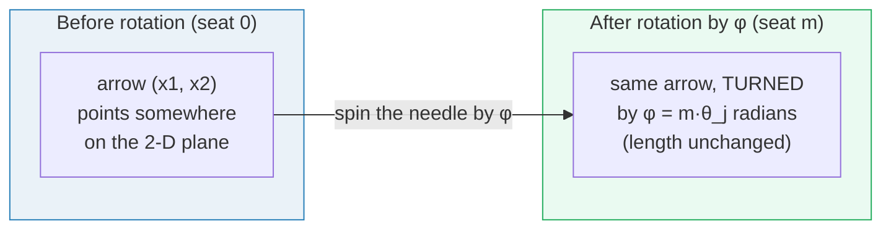

The rotation is a 2×2 matrix multiply per pair:

```
┌ new_x1 ┐       ┌ cos φ   -sin φ ┐ ┌ x1 ┐
│        │   =   │                 │ │    │
└ new_x2 ┘       └ sin φ    cos φ ┘ └ x2 ┘
```

> One plain sentence: multiply the arrow by a tiny turn-table; the turn-table's
> angle grows with the seat number.

The **whole trick** of RoPE: make `φ` depend on the token position `m` and on
*which pair* `j` you're rotating. Then, magically, the dot product of two rotated
vectors only depends on `φ_m − φ_n` = a function of **relative distance** `m − n`.
(Proof with real numbers in [§9](#9-why-this-encodes-relative-position--proof-with-numbers).)

---

## 3. The frequency table `θ_j` — Section A output

Each of the `D/2` pairs gets its own **base rotation-per-step** `θ_j` — i.e. how
fast that clock dial spins each time you advance one seat. With `D = 8` (so
`D/2 = 4` pairs) and `base = 10000`:

> From `rope.py` **Section A**:
>
> | j | inner = j/(D/2) | θ_j = base^(−inner) | meaning |
> |---|---|---|---|
> | 0 | 0.0000 | **1.000000** | FAST rotation (local position) |
> | 1 | 0.2500 | **0.100000** | FAST rotation (local position) |
> | 2 | 0.5000 | **0.010000** | SLOW rotation (long-range position) |
> | 3 | 0.7500 | **0.001000** | SLOW rotation (long-range position) |

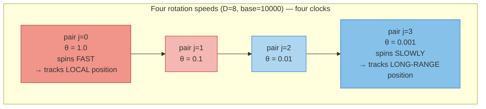

> One plain sentence: pair 0 is a twitchy stopwatch; pair 3 is a slow hour-hand.
> Together they record both fine-grained *and* coarse position at once.

**Why a range of frequencies?** It's a Fourier-like decomposition of position.
High-frequency pairs can tell nearby tokens apart (they change a lot per step).
Low-frequency pairs are nearly constant per step, so they encode coarse / global
position. Together: fine *and* coarse position, simultaneously.

- 🔗 *Contrast:* sinusoidal absolute PE also uses these exact frequencies, but
  **adds** them to the input once. RoPE **multiplies** (rotates) with them in
  every layer. See [`ABSOLUTE_PE.md`](./ABSOLUTE_PE.md) §2 — the table there proves
  the frequencies are identical.

> **Base choice:** GPT-NeoX/Llama-classic use `base = 10000`. **Qwen3 uses
> `base = 1000000`** (a YaRN-flavored choice) — slower spin overall, which
> lengthens the effective context the model can use. Always read `rope_theta`
> from the config.

---

## 4. The precomputed lookup tables — Section B/C output

We never recompute trig at runtime. At init we build two tables of shape
`[max_seq_len, D/2]`:

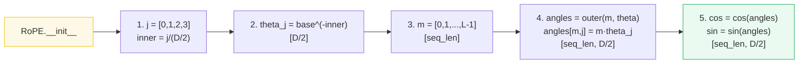

> One plain sentence: the angle at seat `m`, clock `j` is just `m × θ_j`; we
> pre-bake its cos and sin so a token only has to *look up row m*.

For `L = 4`, `D/2 = 4`:

> From `rope.py` **Section B+C**:
>
> **ANGLE** table `m · θ_j` (radians) — *how far each clock has turned at seat m*
>
> | m \ j | j=0 | j=1 | j=2 | j=3 |
> |---|---|---|---|---|
> | m=0 | 0.0000 | 0.0000 | 0.0000 | 0.0000 |
> | m=1 | 1.0000 | 0.1000 | 0.0100 | 0.0010 |
> | m=2 | 2.0000 | 0.2000 | 0.0200 | 0.0020 |
> | m=3 | 3.0000 | 0.3000 | 0.0300 | 0.0030 |
>
> **COS** table (what gets looked up)
>
> | m \ j | j=0 | j=1 | j=2 | j=3 |
> |---|---|---|---|---|
> | m=0 | 1.0000 | 1.0000 | 1.0000 | 1.0000 |
> | m=1 | 0.5403 | 0.9950 | 0.9999 | 1.0000 |
> | m=2 | **−0.4161** | 0.9801 | 0.9998 | 1.0000 |
> | m=3 | −0.9900 | 0.9553 | 0.9996 | 1.0000 |
>
> **SIN** table (what gets looked up)
>
> | m \ j | j=0 | j=1 | j=2 | j=3 |
> |---|---|---|---|---|
> | m=0 | 0.0000 | 0.0000 | 0.0000 | 0.0000 |
> | m=1 | 0.8415 | 0.0998 | 0.0100 | 0.0010 |
> | m=2 | **0.9093** | 0.1987 | 0.0200 | 0.0020 |
> | m=3 | 0.1411 | 0.2955 | 0.0300 | 0.0030 |

**How to read this (compass view):** a token at seat `m` grabs **row `m`** of the
cos table and **row `m`** of the sin table. That row is the recipe for "how much
to spin each of your 4 clock dials." Seat 0's row is all `cos=1, sin=0` →
**no spin at all** (the identity) — which is exactly right: seat 0 hasn't moved.
Notice clock j=0 swings hard (`−0.99` at m=3) while clock j=3 barely budges
(`1.0000` everywhere) — that's the fast/slow spread in action.

---

## 5. Rotating ONE token, step by step — Section D output

> **Reading four clocks.** Take one token's 8-number head vector and split it into
> 4 arrows (the "split" layout). Seat `m = 2` means: spin each arrow by the angle
> in row 2 of the tables above. Clock 0 spins the most (2.0 rad ≈ 115°); clock 3
> barely twitches (0.002 rad). Let's walk all four.

Take one token's head vector (D=8) and rotate it at position `m = 2`:

> Input token `x` (split layout):
> - `x1` (first half)  = `[1.0, 0.5, −0.3, 0.8]`
> - `x2` (second half) = `[0.2, −0.1, 0.4, 0.6]`

We use **row m=2** of the tables: `cos = [−0.4161, 0.9801, 0.9998, 1.0000]`,
`sin = [0.9093, 0.1987, 0.0200, 0.0020]`.

```mermaid
graph TD
    subgraph pair0["pair j=0   (the twitchy stopwatch, θ=1.0)"]
        P0a["arrow = (+1.0, +0.2)"] --> P0r["spin by m·θ = 2·1.0 = 2.0 rad ≈ 115°"]
        P0r --> P0o["arrow lands at (−0.5980, +0.8261)"]
    end
    subgraph pair1["pair j=1   (θ=0.1)"]
        P1a["arrow = (+0.5, −0.1)"] --> P1r["spin by 0.2 rad ≈ 11°"]
        P1r --> P1o["arrow lands at (+0.5099, +0.0013)"]
    end
    subgraph pair2["pair j=2   (θ=0.01)"]
        P2a["arrow = (−0.3, +0.4)"] --> P2r["spin by 0.02 rad ≈ 1°"]
        P2r --> P2o["arrow lands at (−0.3079, +0.3939)"]
    end
    subgraph pair3["pair j=3   (the slow hour-hand, θ=0.001)"]
        P3a["arrow = (+0.8, +0.6)"] --> P3r["spin by 0.002 rad ≈ 0.1°"]
        P3r --> P3o["arrow lands at (+0.7988, +0.6016) — barely moved"]
    end

    style pair0 fill:#fdebd0,stroke:#e67e22
    style pair1 fill:#fef9e7,stroke:#f1c40f
    style pair2 fill:#eaf2f8,stroke:#2980b9
    style pair3 fill:#e8f8f5,stroke:#1abc9c
```

**Walking the four clocks in plain English:**

- **Clock j=0** (θ=1.0, the fastest). Its arrow starts at `(+1.0, +0.2)`. At seat
  2 it must turn `2 × 1.0 = 2.0` radians (about 115°). After that big swing the
  arrow lands at `real = −0.5980, imag = +0.8261`. This is the clock that does
  the heavy lifting for *local* position.
- **Clock j=1** (θ=0.1). Arrow `(+0.5, −0.1)`, turns only `0.2` rad (~11°).
  Lands at `(+0.5099, +0.0013)` — a gentle nudge.
- **Clock j=2** (θ=0.01). Arrow `(−0.3, +0.4)`, turns `0.02` rad (~1°). Lands at
  `(−0.3079, +0.3939)` — almost the same arrow, nudged a hair.
- **Clock j=3** (θ=0.001, the slowest). Arrow `(+0.8, +0.6)`, turns `0.002` rad
  (~0.1°). Lands at `(+0.7988, +0.6016)` — you'd need a microscope to see the move.
  This clock only starts to matter over thousands of seats.

The per-pair math (complex multiply `(x1 + i·x2)·(cos + i·sin)`):

> From `rope.py` **Section D**:
>
> | pair j | x1 | x2 | cos(m·θ_j) | sin(m·θ_j) | real = x1·cos − x2·sin | imag = x2·cos + x1·sin |
> |---|---|---|---|---|---|---|
> | 0 | +1.0 | +0.20 | −0.4161 | +0.9093 | **−0.5980** | **+0.8261** |
> | 1 | +0.5 | −0.10 | +0.9801 | +0.1987 | **+0.5099** | **+0.0013** |
> | 2 | −0.3 | +0.40 | +0.9998 | +0.0200 | **−0.3079** | **+0.3939** |
> | 3 | +0.8 | +0.60 | +1.0000 | +0.0020 | **+0.7988** | **+0.6016** |

**Reassemble** (concatenate `real` then `imag`, because we use the split layout):

```
RoPE(x, m=2) = [ -0.5980,  0.5099, -0.3079,  0.7988,    ← reals of clocks 0..3
                  0.8261,  0.0013,  0.3939,  0.6016 ]   ← imags of clocks 0..3

original  x   = [  1.0,     0.5,    -0.3,    0.8,
                   0.2,    -0.1,     0.4,    0.6 ]
```

✅ `rope.py` verifies the by-hand math equals the `RoPE` class output (`[check] OK`).
✅ RoPE **preserves the L2 norm** (a pure rotation never stretches a vector): the
full-batch section shows `max|‖out‖−‖in‖| = 2.98e−08`.

> One plain sentence: 4 independent arrows each get spun by their own angle; the
> fastest one swings wildly, the slowest one holds almost still.

---

## 6. Tensor shapes: `[B, L, H, D]` — where, exactly, does it operate?

This is the #1 source of bugs. RoPE operates on Q and K **while they are still in
`[B, L, H, D]` layout — BEFORE the transpose** to `[B, H, L, D]` used by the
attention dot product.

```mermaid
graph LR
    X["x : [B, L, E]"] --> Lin["wq / wk / wv<br/>(linear projection)"]
    Lin --> QKV["q : [B, L, H, D]<br/>k : [B, L, H, D]<br/>v : [B, L, H, D]"]

    QKV --> QKnorm["QK-Norm (per-head RMSNorm)"]
    QKnorm --> ROPE["**RoPE here**<br/>apply on [B, L, H, D]"]
    ROPE --> T["transpose<br/>-> [B, H, L, D]"]
    T --> ATTN["attention<br/>Q·K^T"]
    ATTN --> OUT["out : [B, H, L, D]"]
    OUT --> T2["transpose back<br/>-> [B, L, H, D]"]
    T2 --> WO["wo projection"]

    style ROPE fill:#eafaf1,stroke:#27ae60,stroke-width:3px
    style T fill:#fef9e7,stroke:#f1c40f
```

> One plain sentence: spin the needles *before* you rearrange the tensor — the
> seat numbers live on the `L` axis, and that axis must be easy to reach.

**Why before the transpose?** Each token `m` needs its own rotation, and `m` is
the **L axis**. The cos/sin tables are indexed by `m` and broadcast over the **H**
axis (every head rotates independently but at the *same* position). In `[B, L, H, D]`
the position axis and the pair axis are both cleanly available; after transposing
to `[B, H, L, D]` the layout still works but the convention everywhere (Qwen/Llama
ref code, `tiny-llm`) is to rotate first.

Broadcasting shape walk (`D/2 = half`):

```
x1, x2 : [B, L, H, half]          # the two halves of the head vector
cos, sin: [1, L, 1, half]         # one row per position, same for all heads/batches
                                   #  ^L = position axis, broadcast over B and H
real = x1*cos - x2*sin : [B, L, H, half]
imag = x2*cos + x1*sin : [B, L, H, half]
out  = concat([real, imag], -1) : [B, L, H, D]
```

> 🔗 Because RoPE acts on Q and K *per head*, it composes cleanly with grouped-query
> attention, which also reshapes the Q/K head structure (shared K/V heads). See
> [`GQA.md`](./GQA.md): apply RoPE to the per-head Q/K *before* the GQA broadcast.

---

## 7. Full worked batch: `B=1, L=4, H=2, D=8` — Section E output

A real call rotates *every token, every head* at once. Input shape `(1, 4, 2, 8)`.
Each entry is a tiny deterministic value `0.1·m + 0.01·h + 0.001·(d+1)` so you can
trace which number came from where.

> From `rope.py` **Section E** — input then output, head `h=0`:
>
> **Input** (head h=0):
>
> | m | d0 | d1 | d2 | d3 | d4 | d5 | d6 | d7 |
> |---|---|---|---|---|---|---|---|---|
> | 0 | 0.001 | 0.002 | 0.003 | 0.004 | 0.005 | 0.006 | 0.007 | 0.008 |
> | 1 | 0.101 | 0.102 | 0.103 | 0.104 | 0.105 | 0.106 | 0.107 | 0.108 |
> | 2 | 0.201 | 0.202 | 0.203 | 0.204 | 0.205 | 0.206 | 0.207 | 0.208 |
> | 3 | 0.301 | 0.302 | 0.303 | 0.304 | 0.305 | 0.306 | 0.307 | 0.308 |
>
> **Output RoPE(x)** (head h=0):
>
> | m | d0 | d1 | d2 | d3 | d4 | d5 | d6 | d7 |
> |---|---|---|---|---|---|---|---|---|
> | 0 | 0.001 | 0.002 | 0.003 | 0.004 | 0.005 | 0.006 | 0.007 | 0.008 |
> | 1 | −0.034 | 0.091 | 0.102 | 0.104 | 0.142 | 0.116 | 0.108 | 0.108 |
> | 2 | −0.270 | 0.157 | 0.199 | 0.204 | 0.097 | 0.242 | 0.211 | 0.208 |
> | 3 | −0.341 | 0.198 | 0.294 | 0.303 | −0.259 | 0.382 | 0.316 | 0.309 |

Read the table:
- **Row m=0 is unchanged** — seat 0 is the identity rotation (`cos=1, sin=0`): no
  needle spins. ✔️
- **Rows get progressively more scrambled** as `m` grows, because the fast clocks
  (j=0,1) spin further. The slow clocks (j=2,3) barely move — see how `d6, d7`
  stay close to their inputs even at m=3.
- The **same is true for head h=1** (see `rope_output.txt`), proving heads rotate
  independently but at identical positions.

> One plain sentence: every seat m gets its own row of the table; seat 0 is
> untouched, later seats get more churned by the fast clocks.

---

## 8. Split vs Traditional layout — Section F output

There are two ways to decide *which two coordinates form a clock dial*. The
checkpoint's config fixes this; **you cannot choose**.

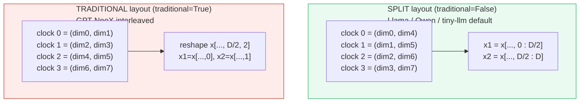

> From `rope.py` **Section F** — same input `x = [1,2,3,4,5,6,7,8]`, rotated at m=2:
>
> - Split:        `[−4.9626, 0.7681, 2.8594, 3.984, −1.1714, 6.2777, 7.0586, 8.008]`
> - Traditional:  `[−2.2347, 0.077, 2.1455, 4.5163, 4.879, 6.0988, 6.984, 8.014]`
>
> **Different outputs.** Qwen3 uses `traditional=False`. Mixing them up silently
> corrupts the model — no error, just garbage. Top pitfall in
> `learning_guide/01_Math_Pipe.md`.

> One plain sentence: "split" pairs far-apart coordinates; "traditional" pairs
> neighbours — same rotation math, different wiring, and the checkpoint picks.

The split layout is more **cache-friendly** (contiguous halves) and is what almost
all modern checkpoints ship with.

---

## 9. Why this encodes RELATIVE position — proof with numbers

> **The magic, in one breath.** Same distance apart → same score. That's the whole
> claim. Put a query at seat 5 and a key at seat 4, or put them at seats 2 and 1
> — in both cases the gap is 1, and RoPE makes the attention score identical. The
> absolute seat numbers vanish; only the gap survives.

This is the deep "why". Place a fixed raw `Q` at position `m_q` and a fixed raw `K`
at position `m_k`, rotate each, and take the dot product `Q·K` (the attention score
numerator, pre-softmax). **The score depends only on `m_q − m_k`:**

> From `rope.py` **Section H**:
>
> | m_q | m_k | relative = m_q − m_k | Q·K score |
> |---|---|---|---|
> | 2 | 1 | **1** | **+0.514498** |
> | 5 | 4 | **1** | **+0.514498** |
> | 10 | 9 | **1** | **+0.514499** |
> | 2 | 0 | **2** | **+0.285792** |
> | 5 | 3 | **2** | **+0.285792** |
> | 10 | 8 | **2** | **+0.285792** |

**Reading the proof like a story:**

- Look at the first three rows. The gap is always **1**, but the seats are totally
  different: (2,1), then (5,4), then (10,9). Yet the score is `+0.514498` every
  time (the last digit wobbles by `0.000001` only because of float rounding).
- Now the last three rows. The gap is always **2**: (2,0), (5,3), (10,8). Again the
  score is rock-constant: `+0.285792`.
- Compare to absolute PE (🔗 [`ABSOLUTE_PE.md`](./ABSOLUTE_PE.md) §6): there, the
  same gap gives wildly different scores (`+7.06`, `+4.90`, `+7.26` for gap 1).
  **Absolute PE cannot do this; only rotation can.**

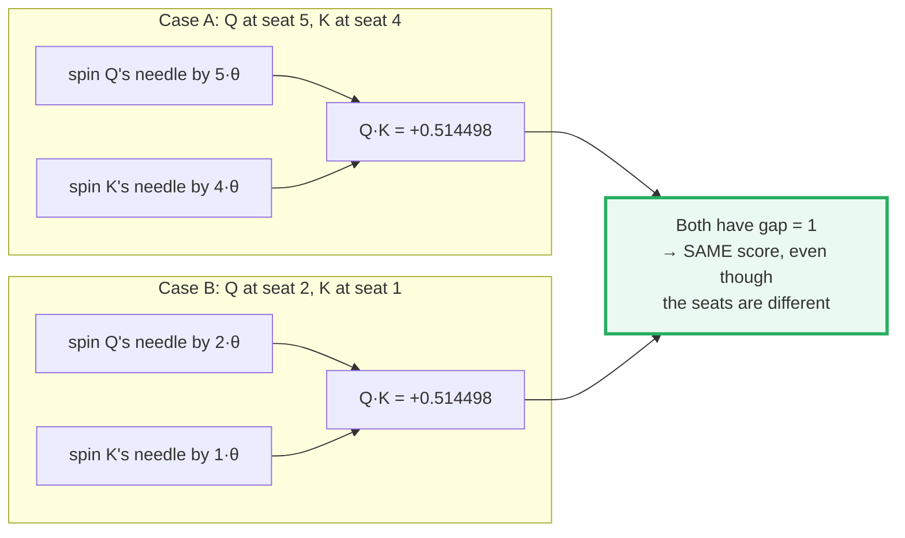

**Why it works (the algebra, one clock at a time):** for a single clock, spin `Q`'s
arrow by `m_q·θ` and `K`'s arrow by `m_k·θ`, then dot them. Multiplying two arrows
*adds their angles*, and the trig identity `cos²+sin²=1` collapses the leftovers,
leaving:

```
clock contribution = (q1·k1 + q2·k2)·cos((m_q − m_k)·θ)
                   + (q1·k2 − q2·k1)·sin((m_q − m_k)·θ)
```

Only `(m_q − m_k)` survives — absolute `m_q`, `m_k` vanish. Summed over all `D/2`
clocks, the full `Q·K` is a function of relative distance only. **Position entered
as absolute rotation angles; order emerged as relative geometry.**

> 🔗 This is the property absolute PE **lacks**: with learned/sinusoidal PE, the
> attention score is a function of *absolute* `m_q` and `m_k` separately, not just
> their difference. RoPE's whole point is winning this property without an explicit
> relative-position table. See [`ABSOLUTE_PE.md`](./ABSOLUTE_PE.md) §6.

---

## 10. The `offset` parameter — KV cache prefill vs decode

> **Compass + seat numbers, during generation.** When the model generates text one
> token at a time, the *new* token still has a real seat number. If you've already
> filled seats 0,1,2, the next token sits in **seat 3** — not seat 0. The
> `offset` slice tells RoPE "look up row 3 of the cos/sin tables, not row 0."
> Get this wrong and the new token's needle barely spins while every cached token's
> needle spun correctly → the relative geometry is destroyed → **gibberish**.

During **decode**, only one new token enters per step, but it must be rotated using
**its true position** (the current sequence length), not position 0. The `offset`
slice selects which row(s) of the cos/sin table to use.

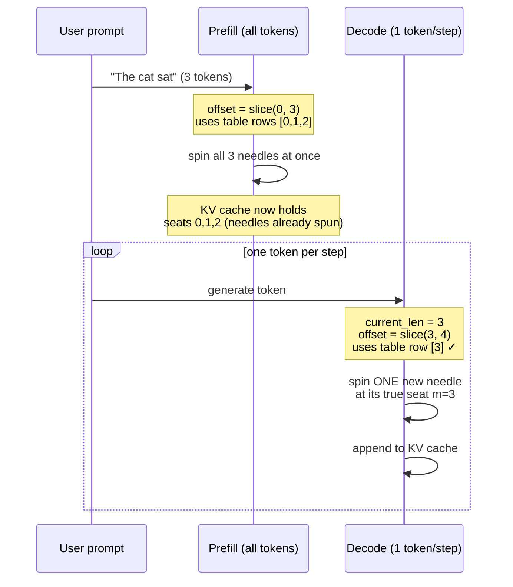

> From `rope.py` **Section G** — the 4th token (a one-hot at dim 3) at true pos `m=3`:
>
> - **CORRECT** `offset=slice(3,4)` → row m=3: `[−0.0, 0.0, 0.0, 1.0, 0.0, 0.0, 0.0, 0.003]`
> - **WRONG**   `offset=slice(0,1)` → row m=0: `[0.0, 0.0, 0.0, 1.0, 0.0, 0.0, 0.0, 0.0]`
>
> `[check] decode(offset=3) == prefill_all[3]? True` — the cached-token path and
> the all-at-once path agree **only** with the correct offset.

Notice the difference: the correct row m=3 leaves a tiny `+0.003` in the last slot
(the slowest clock j=3 has *just barely* started to spin after 3 seats). The wrong
row m=0 is the identity — the new token's needle doesn't spin at all, so it looks
like it's sitting next to every cached key at distance 0. That collapses all the
relative-position information and the output turns to nonsense.

The classic bug (from `learning_guide/02_Acceleration.md`): forgetting the offset
makes RoPE treat every decoded token as seat 0 → `Q` is un-rotated → relative
positions are destroyed → **gibberish after prefill**. Fix:
`offset = slice(current_len, current_len + 1)`.

**Per-batch offsets** (left-padded sequences of different lengths): pass a
`list[slice]`, one per batch element, so each sequence's tokens map to their true
seats.

> 🔗 This `offset` *is* the decode cursor the KV cache advances each step. The
> full prefill→decode→append loop (and exactly where the offset is read from) is
> animated in [`KV_CACHE.md`](./KV_CACHE.md); this guide only covers how RoPE
> *consumes* that offset to pick the right cos/sin row. In compass terms: the KV
> cache tracks "how many seats are filled"; RoPE uses that count to spin the new
> needle by the right amount.

---

## 11. The reference code (`rope.py`) — annotated

The `RoPE` class in [`rope.py`](./rope.py) is intentionally tiny. The flow:

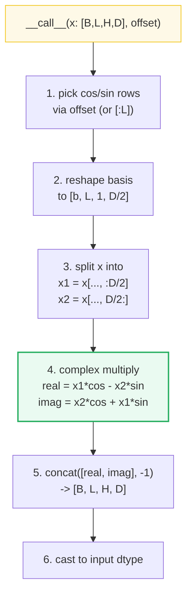

Map to source material:
- Matches `learning_guide/01_Math_Pipe.md` §2.3 `positional_encoding.py` (MLX),
  rewritten in PyTorch with the same semantics.
- Applied at `qwen3_week1.py` step "Step 3: RoPE" (see
  `learning_guide/01_Math_Pipe.md` § around line 422) and with offset in
  `qwen3_week2.py` (`learning_guide/02_Acceleration.md` §3.3).

Quick test against the reference (from the source guide, adapted):

```python
from rope import RoPE
import torch
x = torch.randn(1, 4, 8, 64)                 # [B=1, L=4, H=8, d=64]
rope = RoPE(64, seq_len=32768, base=1_000_000)   # Qwen3 base
y = rope(x, offset=slice(0, 4))
assert y.shape == x.shape
```

---

## 12. Pitfalls & debugging checklist

| # | Mistake | Symptom | Fix |
|---|---|---|---|
| 1 | Applying RoPE **after** the `[B,L,H,D]→[B,H,L,D]` transpose | Wrong per-position spin | Spin while still `[B,L,H,D]`, then transpose |
| 2 | Decode with `offset=slice(0,1)` instead of true seat | Gibberish after prefill | `offset=slice(current_len, current_len+1)` |
| 3 | Wrong `traditional` flag | Silent corruption (no error) | Read checkpoint config; Qwen/Llama = `False` |
| 4 | Wrong `base` (`rope_theta`) | Long-context quality drops | Qwen3 = `1_000_000`, not `10_000` |
| 5 | Applying RoPE to **V** | Wrong (only Q and K) | Spin only Q and K |
| 6 | Forgetting per-batch offsets with left padding | Cross-sequence position bleed | Pass `list[slice]`, one per batch element |
| 7 | Odd `D` | Crash / silent halving | RoPE requires even head dim |

---

## 13. Cheat sheet

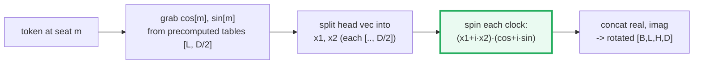

- **Shape in/out:** `[B, L, H, D]` → `[B, L, H, D]`. Applied to Q and K only.
- **Tables:** `cos`, `sin` of shape `[max_seq_len, D/2]`, built once at init.
- **Angle:** `angle[m, j] = m · base^(−j/(D/2))`.
- **Cost:** `O(L · D)` — memory-bandwidth bound, negligible vs attention.
- **Magic:** dot product `Q·K` depends only on `m_q − m_k` ⇒ relative position
  for free, no explicit table.

> 🔗 Want the *other* family (stamp a seat-number barcode once at the input)? Read
> [`ABSOLUTE_PE.md`](./ABSOLUTE_PE.md). It shares the same frequency idea but
> `add`s instead of `rotate`s — and that one difference is why it can't do the
> relative-position trick in [§9](#9-why-this-encodes-relative-position--proof-with-numbers).

---

## Sources

- **Su, J.; Lu, Y.; Pan, S.; Murtadha, A.; Wen, B.; Liu, Y. (2021).**
  *RoFormer: Enhanced Transformer with Rotary Position Embedding.*
  arXiv:2104.09864 — https://arxiv.org/abs/2104.09864
  The original RoPE paper. Defines `θ_j = base^(−j/(D/2))` (our [§3](#3-the-frequency-table-θ_j--section-a-output)),
  the split-pair rotation of Q/K ([§5](#5-rotating-one-token-step-by-step--section-d-output),
  [§11](#11-the-reference-code-ropepy--annotated)), and proves that `Q·K` depends
  only on relative distance ([§9](#9-why-this-encodes-relative-position--proof-with-numbers)).
  The EleutherAI companion write-up
  (https://blog.eleuther.ai/rotary-embeddings/) gives the cleanest derivation of
  the relative property and confirms the two differences from sinusoidal PE:
  (1) RoPE mixes coordinate *pairs*, sinusoidal acts per-coordinate; (2) RoPE
  *multiplies* (rotates), sinusoidal *adds*.

- **Vaswani, A.; Shazeer, N.; Parmar, N.; Uszkoreit, J.; Jones, L.; Gomez, A. N.;
  Kaiser, Ł.; Polosukhin, I. (2017).**
  *Attention Is All You Need.*
  arXiv:1706.03762 — https://arxiv.org/abs/1706.03762
  The original Transformer. Source of the sinusoidal frequency ladder RoPE reuses
  ([§3](#3-the-frequency-table-θ_j--section-a-output)) and of the additive position
  embedding that the 🔗 sibling [`ABSOLUTE_PE.md`](./ABSOLUTE_PE.md) contrasts
  against ([§0](#0-tldr--the-whole-idea-in-one-picture),
  [§9](#9-why-this-encodes-relative-position--proof-with-numbers)).
