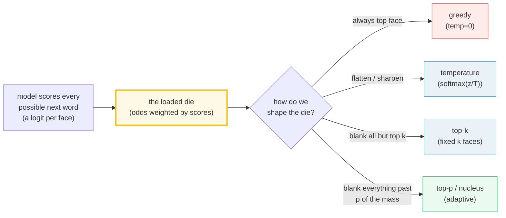
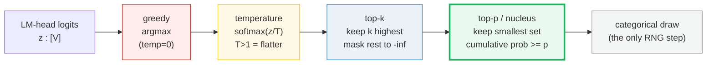
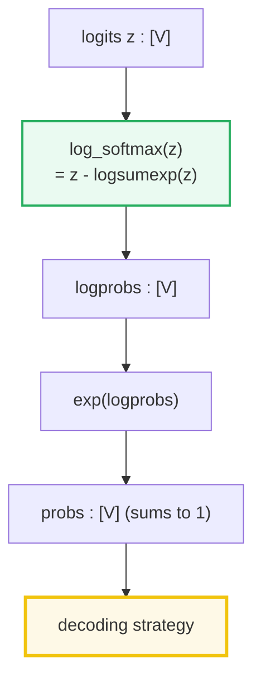
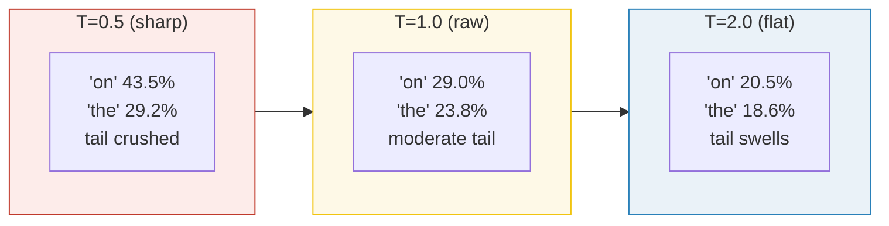
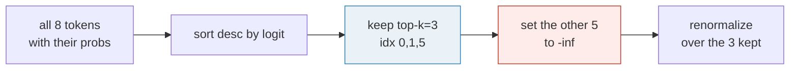
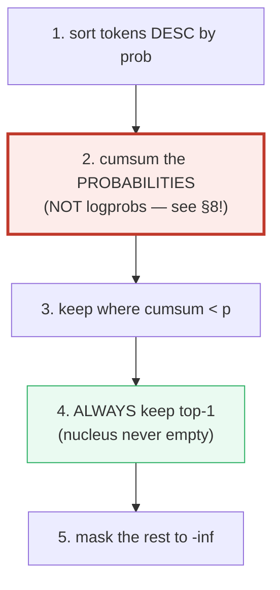
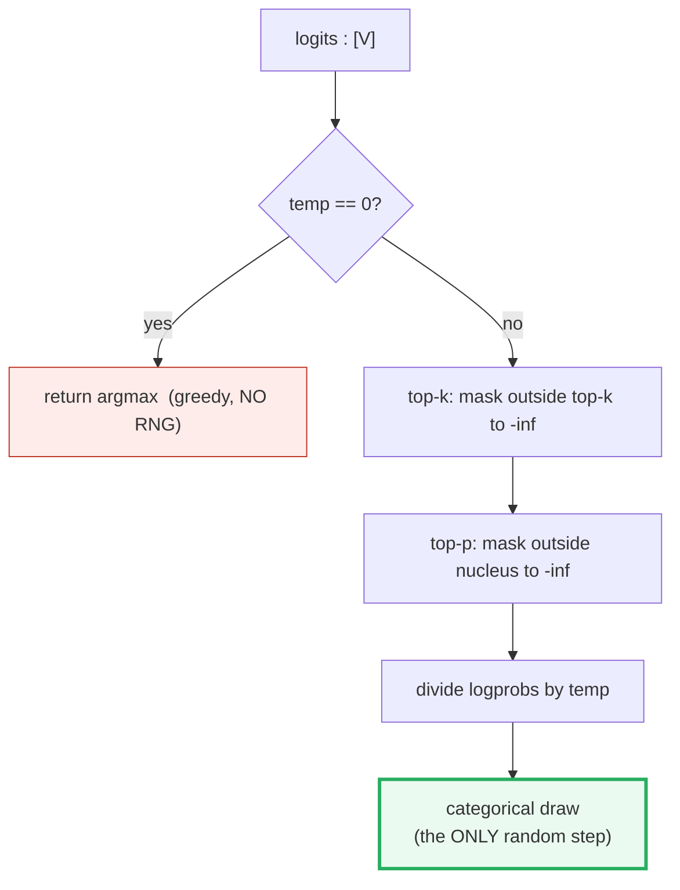
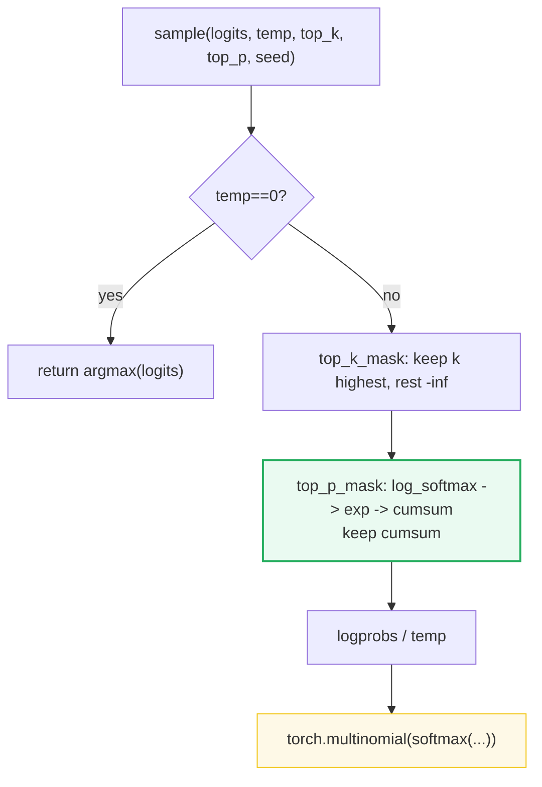
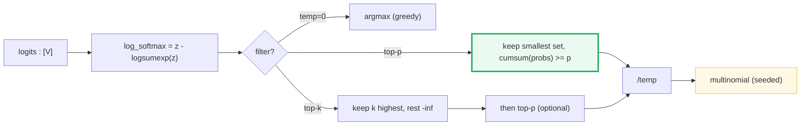

# Sampling Strategies (Greedy → Temperature → Top-k → Top-p) — A Worked-Example Guide

> **Companion code:** [`sampling.py`](./sampling.py). **Every number in this guide
> is printed by `uv run python sampling.py`** — change the code, re-run, re-paste.
> Nothing here is hand-computed.
>
> **Sibling guides:** [`ROPE.md`](./ROPE.md) and [`ABSOLUTE_PE.md`](./ABSOLUTE_PE.md)
> — they produce the attention that *yields* the logits this guide *samples* from.
> Cross-references are marked 🔗 throughout.
>
> **Live animation:** [`sampling.html`](./sampling.html) — drag sliders, watch the
> nucleus shrink/grow.
>
> **Source material:** `learning_guide/00_Foundations.md` §8.1 and
> `learning_guide/01_Math_Pipe.md` (`make_sampler`, ~line 560).

---

## 0. TL;DR — the whole idea in one picture

### The intuition (no math needed): sampling = rolling a *loaded* die

Imagine a **loaded die with `V` faces** — one face for every word in the
vocabulary. The model does **not** hand you ready-made odds. Instead, for the
*next* word it outputs a **preference score** (a *logit*) for every face.
**Sampling = pick the next word by rolling a die whose odds are weighted by
those scores.** The four strategies below are four ways of *shaping* that die
before you roll it:



> **One plain sentence each:**
> - **Greedy** — *"always pick the single highest-scoring face."* Safe but
>   repetitive/boring; the model gets trapped in loops.
> - **Temperature `T`** — *"how flat the die's odds are."* High `T` flattens
>   the die (more random/diverse); low `T` sharpens it (more predictable);
>   `T=0` is exactly greedy.
> - **Top-k** — *"only allow the top `k` faces; blank the rest."* Fixed `k` is
>   clumsy: sometimes the model is very sure (1 good word), sometimes unsure
>   (20 decent words), yet `k` ignores that and always keeps exactly `k`.
> - **Top-p (nucleus)** — *"the fix: keep the smallest set of top faces that
>   together cover `p` (e.g. 60%) of the probability."* It **adapts**: 1 word
>   when the model is sure, many when it isn't. Always keep the #1 face so we
>   never pick nothing.

### The lineage — each method fixes a flaw of the previous

A trained LLM outputs a **logit vector** `[V]` per position (the LM head's raw
scores). To turn logits into *one next token*, we need a **decoding strategy**.
There is a clean lineage — each method fixes a flaw of the previous:



| Strategy | Mechanism | Hyper-param | Effect | Deterministic? |
|---|---|---|---|---|
| **Greedy** | `argmax(logits)` | `temp=0` | Always the top-1; repetitive | YES |
| **Temperature** | `softmax(logits / T)` | `T` (0.1–2.0) | `T<1` sharpens, `T>1` flattens | no (after draw) |
| **Top-k** | mask all but k highest to `-inf` | `k` (e.g. 50) | Fixed-size shortlist; kills the tail | filtering YES |
| **Top-p (nucleus)** | keep smallest set with cum-prob ≥ p | `p` (e.g. 0.9) | **Adaptive** shortlist; shape-aware | filtering YES |

### Glossary (every term below is defined again at first use)

| Term | Plain meaning |
|---|---|
| **`V`** (vocab size) | How many faces the die has — one per possible next word. |
| **logit** | A raw preference score the model gives a word (any real number; bigger = liked more). |
| **softmax** | Turns scores into **probabilities that sum to 1**. Always implemented via the stable `exp(log_softmax(z))`. |
| **probability** (prob) | A number in `[0,1]`; all probs across the vocab add up to 1. |
| **logprob** | `log(prob)` — always `≤ 0`. Cheaper/more stable to work with than raw probs. |
| **temperature `T`** | A divisor applied to logits *before* softmax. `T<1` sharpens, `T>1` flattens, `T=0` = greedy. |
| **top-k** | Keep the `k` highest-scoring words; blank the rest. Fixed size. |
| **top-p / nucleus** | Keep the smallest set of words whose probs add up to `p`. Adaptive size. |
| **cumsum** (cumulative sum) | A running total. In top-p we cumsum the **probabilities**, never the raw logprobs (see §8). |
| **seed** | A fixed start value for the random number generator, so the final *draw* is reproducible. The filtering steps need no seed. |

> 🔗 **If you only read one cross-reference:** the logits this guide samples from
> come out of the model built in [`ROPE.md`](./ROPE.md) /
> [`ABSOLUTE_PE.md`](./ABSOLUTE_PE.md). Those guides inject *position* into `Q·K`;
> *this* guide decides *which token* the resulting distribution commits to. The
> whole pipeline is `tokens → [attention with PE/RoPE] → logits → [this guide] →
> next token`.

---

## 1. Why we sample at all

The model writes one word at a time: it scores every possible next word, then
we pick one, append it, and repeat. **Scoring is fixed; "picking" is where all
the strategy lives.** The autoregressive loop is:

```
logits  = model(tokens)[:, -1, :]          # [1, V]  — raw scores for next token
logprobs = logits - logsumexp(logits)       # [1, V]  — log-softmax (numerically stable)
token    = sampler(logprobs)                # int     — pick ONE
tokens   = concat(tokens, token)            # grow, repeat
```

The question is what `sampler` does. Two extremes are bad:

- **Always argmax** (greedy): produces *loops and repetition* — the model gets
  trapped, because the single most-likely next token after a repeated phrase is
  the phrase again. This is the "neural text degeneration" problem (Holtzman et
  al., 2019).
- **Pure sampling** (`temp=1`, no filtering): the long tail of low-probability
  "junk" tokens gets drawn too often → incoherent text.

The four strategies are a controlled path **between** these extremes.

---

## 2. The anchor math (all verified in `sampling.py`)

Every method starts from the same numerically-stable identity:

```
log_softmax(z) = z - logsumexp(z)          # never compute log(sum(exp(z))) directly
softmax(z)     = exp(log_softmax(z))
```

> From `sampling.py` **Section A** — `[check] logits - logsumexp(logits) ==
> log_softmax(logits): OK`, `[check] sum(softmax(logits)) == 1.0: OK`.

The fixed 8-token logit vector used everywhere below (deterministic — **no RNG
needed for filtering**, only for the final draw):

```
LOGITS = [2.3, 2.0, 0.4, 1.5, 0.1, 2.5, 0.7, 1.2]
TOKENS = ["the", "cat", "xyz", "sat", "qqq", "on", "a", "mat"]
```



---

## 3. The base distribution — Section A output

The model gave every face of the die a raw score (a **logit**). To *roll* the
die we first turn those scores into **probabilities that sum to 1** — that
conversion is `softmax` (computed stably as `exp(log_softmax)`):

> From `sampling.py` **Section A**:
>
> | idx | token | logit | prob (softmax) | logprob (log_softmax) |
> |---|---|---|---|---|
> | 0 | the | +2.3000 | **0.2377** | −1.4367 |
> | 1 | cat | +2.0000 | **0.1761** | −1.7367 |
> | 2 | xyz | +0.4000 | 0.0356 | −3.3367 |
> | 3 | sat | +1.5000 | 0.1068 | −2.2367 |
> | 4 | qqq | +0.1000 | 0.0263 | −3.6367 |
> | 5 | on | +2.5000 | **0.2903** | −1.2367 |
> | 6 | a | +0.7000 | 0.0480 | −3.0367 |
> | 7 | mat | +1.2000 | 0.0791 | −2.5367 |
>
> `sum(probs) = 1.000000`. `argmax = idx 5 ("on")`.

**How to read it:** `idx 5 ("on")` is the most likely token (29%), with `idx 0
("the")` close behind (24%). The tail (`idx 2,4,6` — the nonsense tokens "xyz",
"qqq", "a") is tiny but nonzero. A pure sampler would still draw "qqq" 2.6% of
the time. Every strategy below is about *controlling* that tail.

---

## 4. Temperature scaling — Section B output

Temperature controls *how flat the die is*. We divide the logits by `T`
**before** softmax. Divide by a small `T` and the gaps between scores grow
(the favorite word pulls ahead → a **sharper** die); divide by a large `T` and
the gaps shrink (the long tail catches up → a **flatter**, more random die):

```
probs_T = softmax(logits / T)
```

> From `sampling.py` **Section B**:
>
> | idx | token | T=0.5 | T=1.0 | T=2.0 |
> |---|---|---|---|---|
> | 0 | the | **0.2917** | 0.2377 | 0.1858 |
> | 1 | cat | 0.1601 | 0.1761 | 0.1599 |
> | 2 | xyz | 0.0065 | 0.0356 | 0.0719 |
> | 3 | sat | 0.0589 | 0.1068 | 0.1245 |
> | 4 | qqq | 0.0036 | 0.0263 | 0.0618 |
> | 5 | on | **0.4351** | 0.2903 | 0.2053 |
> | 6 | a | 0.0119 | 0.0480 | 0.0835 |
> | 7 | mat | 0.0323 | 0.0791 | 0.1072 |
>
> `entropy(T=0.5) = 1.3981`, `entropy(T=1.0) = 1.8062`, `entropy(T=2.0) = 1.9984`
> nats. `top-1` share: `T=0.5 → 0.4351`, `T=1.0 → 0.2903`, `T=2.0 → 0.2053`.



**The rule:** `T→0` ⇒ one-hot on the argmax (= greedy, §5); `T→∞` ⇒ uniform.
`T<1` is "confident", `T>1` is "creative". **Order matters:** temperature is a
*rescaling*, applied **after** any top-k/top-p masking in the tiny-llm pipeline
(see §9) — masking to `-inf` survives any rescaling, and applying temperature
*before* masking changes which tokens cross the threshold for **top-p**
(temperature reshapes the cumulative distribution) but **NOT for top-k** (positive
scaling preserves the top-k set exactly, since it does not change logit order).

---

## 5. Greedy decoding (temp=0) — Section C output

The degenerate case — **no die roll at all**, just grab the single highest face
every time. This is what `temp=0` collapses to:

```
greedy(logits) = argmax(logits)
```

> From `sampling.py` **Section C**:
>
> `greedy(LOGITS) = argmax = idx 5 ("on")`.

`temp=0` is handled as a **special case** in `make_sampler`: it returns `argmax`
directly, skipping softmax entirely. Every call returns the same token →
deterministic, repetitive, no diversity. Use it for **evaluation / factual QA**
where you want the single most-likely answer, never for creative generation.

---

## 6. Top-k — Section D output

Blank out all but the `k` highest faces of the die (set their score to `-inf`,
so their softmax probability is exactly 0). Whatever's left is *renormalized*
so the surviving faces still sum to 1:

```
mask = topk(logits, k).indices
logits[~mask] = -inf
```

> From `sampling.py` **Section D** — top-k=3:
>
> - **KEPT** indices: `[0, 1, 5]` → tokens `['the', 'cat', 'on']`
> - **MASKED** indices: `[2, 3, 4, 6, 7]`
>
> Renormalized over the 3 kept:
>
> | idx | token | logit | prob (softmax) |
> |---|---|---|---|
> | 0 | the | +2.3000 | 0.3376 |
> | 1 | cat | +2.0000 | 0.2501 |
> | 5 | on | +2.5000 | **0.4123** |
> | (others) | | -inf | 0.0000 |



**The flaw** (introduced by Fan et al., 2018, fixed by top-p): `k` is **fixed**.
On a *peaked* distribution (one token at 95%), keeping 50 tokens lets 49 tokens of
junk back in. On a *flat* distribution (many plausible continuations), keeping
only 10 chops off good options. Top-k cannot tell the difference — that is
exactly what top-p fixes.

---

## 7. Top-p / Nucleus sampling — Section E output

Keep the **smallest set** of tokens whose cumulative probability reaches `p`.
The size of the set *adapts* to the distribution shape — that is the whole point
(Holtzman et al., 2019). On this die, with `p=0.6`, the nucleus is **2 words**;
on a confident die it might be 1, on an uncertain die it might be 20.

**Narrate it on the fixed die (`p = 0.6`):** sort the faces most-likely first,
then keep a running total of their *probabilities* (never their scores):

1. **`"on"` (idx 5): prob 0.2903** → running total **0.2903**. Still under 0.6,
   so **keep** it (it's also the top-1, which we always keep).
2. **`"the"` (idx 0): prob 0.2377** → running total 0.2903 + 0.2377 =
   **0.5281**. Still under 0.6, so **keep** it.
3. **`"cat"` (idx 1): prob 0.1761** → running total 0.5281 + 0.1761 =
   **0.7042**. That **crosses** 0.6, so `"cat"` is **masked** (and so is every
   face after it, since the total only grows).

➡️ **Nucleus = `{on, the}` = indices `[0, 5]`**, holding **52.81%** of the
mass. Everything else is masked to `-inf`. Note the nucleus mass (52.81%) is
*below* `p=0.6` — that's because the token that would have pushed the total past
`0.6` is excluded by the strict `cumsum < p` rule. We always include the top-1,
so the nucleus is never empty.

> From `sampling.py` **Section E** — top-p=0.6, the algorithm step by step:
>
> | rank | idx | token | prob | cumsum | cumsum<0.6? | kept? |
> |---|---|---|---|---|---|---|
> | 0 | 5 | on | 0.2903 | 0.2903 | yes | **KEEP** |
> | 1 | 0 | the | 0.2377 | **0.5281** | yes | **KEEP** |
> | 2 | 1 | cat | 0.1761 | 0.7042 | no | mask |
> | 3 | 3 | sat | 0.1068 | 0.8110 | no | mask |
> | 4 | 7 | mat | 0.0791 | 0.8901 | no | mask |
> | 5 | 6 | a | 0.0480 | 0.9381 | no | mask |
> | 6 | 2 | xyz | 0.0356 | 0.9737 | no | mask |
> | 7 | 4 | qqq | 0.0263 | 1.0000 | no | mask |
>
> **NUCLEUS (top-p=0.6) = indices `[0, 5]`** (`['the', 'on']`), prob mass `0.5281`.



**Top-k vs top-p on this distribution — they disagree:**

> | | top-k=3 | top-p=0.6 |
> |---|---|---|
> | kept indices | `[0, 1, 5]` | `[0, 5]` |
> | size | 3 (fixed) | 2 (adaptive) |
> | why | always 3 | top-2 already cover 52.8%; the 3rd would push cumsum to 70.4%, past 0.6 |

Here top-p is **stricter** than top-k: the top-2 already cover most of the mass,
so top-p correctly cuts the 3rd token. On a *flatter* distribution, top-p would
keep *more* tokens than a fixed top-k. **That adaptivity is the entire reason
nucleus sampling displaced top-k in modern LLMs.**

> Production default (from `learning_guide/01_Math_Pipe.md`): `temp=0.7,
> top_p=0.95, top_k=None` — nucleus with mild temperature.

---

## 8. THE pitfall: cumsum on logprobs, not probs — Section F output

> **One sentence to remember:** *Do the cumulative sum on the **PROBABILITIES**
> (after `exp`), NOT on the raw logit scores. Doing it on the scores gives a
> totally wrong nucleus — and you'll never get an error, just garbage.*

The single most common top-p bug. Log-probabilities are **negative** (every
`logprob ≤ 0`). Their cumulative sum stays negative forever and is therefore
**always less than any positive p** — so `cumsum(logprobs) < p` is true for
*every* token, and **nothing gets masked**. The "nucleus" silently becomes the
whole vocabulary. No error, no crash — just degenerate, unfiltered sampling.

> From `sampling.py` **Section F** — p=0.6, side by side:
>
> | rank | idx | token | prob | cumsum(**probs**) | <p? | logprob | cumsum(**logprobs**) | <p? |
> |---|---|---|---|---|---|---|---|---|
> | 0 | 5 | on | 0.2903 | 0.2903 | yes | −1.2367 | −1.2367 | yes |
> | 1 | 0 | the | 0.2377 | 0.5281 | yes | −1.4367 | −2.6734 | yes |
> | 2 | 1 | cat | 0.1761 | **0.7042** | **no** | −1.7367 | −4.4100 | **yes** ← bug |
> | 3 | 3 | sat | 0.1068 | 0.8110 | no | −2.2367 | −6.6467 | yes |
> | 4 | 7 | mat | 0.0791 | 0.8901 | no | −2.5367 | −9.1834 | yes |
> | 5 | 6 | a | 0.0480 | 0.9381 | no | −3.0367 | −12.2201 | yes |
> | 6 | 2 | xyz | 0.0356 | 0.9737 | no | −3.3367 | −15.5567 | yes |
> | 7 | 4 | qqq | 0.0263 | 1.0000 | no | −3.6367 | −19.1934 | yes |
>
> - **CORRECT** (cumsum on probs): nucleus = `[0, 5]` (2 tokens)
> - **WRONG** (cumsum on logprobs): nucleus = `[0,1,2,3,4,5,6,7]` (8 tokens — **everything kept!**)

**Fix:** always `cumsum(exp(logprobs))` ≡ `cumsum(probs)`. The source
`make_sampler` does exactly `mx.cumsum(mx.exp(sorted_logprobs))` — note the
`exp`. Drop the `exp` and you get this bug.

> 🔗 This is the same "wrong domain" class of bug as RoPE's split-vs-traditional
> layout mixup ([`ROPE.md`](./ROPE.md) §8): silent, no error, garbage output.
> Always assert the nucleus size is sensible.

---

## 9. The combined pipeline + the only RNG step — Section G output

`make_sampler(temp, top_p, top_k)` composes the filters in a fixed order, then
draws once:



> From `sampling.py` **Section G** — config `temp=0.7, top_k=3, top_p=0.6`:
>
> After `top-k=3` **then** `top-p=0.6`, kept indices = **`[5]`**
> (only `"on"` survives both filters). After `/temp=0.7` and renormalize,
> `idx 5` has prob **1.0000**; everything else 0.
>
> `torch.manual_seed(0); multinomial → idx 5 ("on")`.

**Subtle but critical:** composing the filters is **not** the set-intersection
of their standalone results. Top-k=3 alone keeps `[0,1,5]`; top-p=0.6 alone
keeps `[0,5]`. But applying top-p *after* top-k operates on the **renormalized**
post-top-k distribution (where `"on"` already holds 41% and `"the"` 34%) — so
within that narrowed distribution the nucleus collapses to just `{"on"}`. The
order and renormalization matter; treat the composition as one pipeline, not
two independent masks.

**Reproducibility:** the filter steps are fully deterministic. Only the final
`multinomial` uses the RNG — so `torch.manual_seed(seed)` makes the *whole*
decode reproducible, token-for-token. Change the seed → different token (still
inside the nucleus). This is why seeding is set once per generation, not per
filter.

---

## 10. The reference code (`sampling.py`) — annotated



Maps to source `tiny-llm/src/tiny_llm_ref/sampler.py` (`make_sampler`), rewritten
in PyTorch with identical semantics. Key implementation notes:

- **`-inf` masking** is used for both top-k and top-p: setting a logit to `-inf`
  makes its softmax probability exactly 0, and it can never be drawn. Masking
  logits or logprobs gives the same result (the `-inf` is invariant under the
  monotone log_softmax).
- **`log_softmax` via `logsumexp`** is mandatory for numerical stability (see
  `learning_guide/01_Math_Pipe.md` §2.3): `exp(logit)` overflows for large
  logits; `logsumexp` shifts by the max first.
- **`top_p_mask` always sets `keep[0]=True`** — the highest-prob token is never
  masked, so the nucleus is never empty (important when `p` is tiny or the
  top-1 prob already exceeds `p`).

---

## 11. Pitfalls & debugging checklist

| # | Mistake | Symptom | Fix |
|---|---|---|---|
| 1 | **Top-p cumsum on logprobs** (not probs) | Nucleus = whole vocab, no filtering, junk output | `cumsum(exp(logprobs))` — never raw logprobs (§8) |
| 2 | Not always-keeping top-1 in top-p | Empty nucleus when top-1 prob ≥ p → crash / NaN | `keep[0] = True` unconditionally |
| 3 | Applying temperature **before** top-k/top-p | Changes which tokens cross the threshold | Mask first (`-inf` survives), then `/temp` (§9 order) |
| 4 | Treating top-k ∘ top-p as set-intersection | Wrong kept set; surprises after composition | Top-p re-runs on the renormalized post-top-k dist (§9) |
| 5 | `temp=0` going through softmax | NaN (`-inf/0`) or wasted compute | Special-case: `temp==0` → `argmax`, skip softmax (§5) |
| 6 | Computing `log(sum(exp(z)))` directly | Overflow → NaN for large logits | `z - logsumexp(z)` (the stable identity, §2) |
| 7 | Forgetting to seed the RNG | Non-reproducible decode; flaky tests | `torch.manual_seed(seed)` once before the draw |
| 8 | Masking **logits** vs **logprobs** inconsistently | Off-by-one in which tokens survive | Pick one domain; `-inf` is invariant, just be consistent |

---

## 12. Cheat sheet



- **Anchor identity:** `log_softmax(z) = z - logsumexp(z)`. Always.
- **Greedy:** `temp=0` ⇒ `argmax`. Deterministic, no RNG.
- **Temperature:** `softmax(z/T)`. `T<1` sharpens, `T>1` flattens, `T=0` = greedy.
- **Top-k:** mask all but the `k` highest logits to `-inf`. Fixed size.
- **Top-p (nucleus):** sort desc by prob, `cumsum(probs)`, keep where `cumsum <
  p`, **always keep top-1**. Adaptive size. `cumsum` on PROBS, never logprobs.
- **Order:** `top-k → top-p → /temp → multinomial`. Masking is deterministic; only
  the final draw uses the RNG (`torch.manual_seed`).
- **Gold (this guide):** logits `[2.3,2.0,0.4,1.5,0.1,2.5,0.7,1.2]` ⇒ top-k=3 →
  `[0,1,5]`, top-p=0.6 → `[0,5]`, greedy → `idx 5`.

> 🔗 These logits are the *output* of the LM head sitting on top of the
> attention layers in [`ROPE.md`](./ROPE.md) / [`ABSOLUTE_PE.md`](./ABSOLUTE_PE.md).
> The full stack is: tokens → embeddings → [+ absolute PE, once] → N× transformer
> blocks [each with RoPE on Q/K] → LM head → **logits → [this guide] → token**.

---

## Sources

- **Nucleus / top-p sampling** — Ari Holtzman, Jan Buys, Li Du, Maxwell Forbes,
  Yejin Choi. *"The Curious Case of Neural Text Degeneration."* ICLR 2020.
  arXiv:1904.09751 — https://arxiv.org/abs/1904.09751
  (defines nucleus sampling: sort by probability desc, keep the smallest set
  whose cumulative probability ≥ p; introduces it as the adaptive fix to top-k).
  Venue verified against the arXiv record ("Published in ICLR 2020").
  Definition cross-checked against Wikipedia, *"Top-p sampling"* —
  https://en.wikipedia.org/wiki/Top-p_sampling .
- **Top-k sampling** — Angela Fan, Mike Lewis, Yann Dauphin. *"Hierarchical
  Neural Story Generation."* ACL 2018. arXiv:1805.04833 —
  https://arxiv.org/abs/1805.04833
  (introduces top-k sampling for neural text generation: sample only from the k
  most-probable next tokens).
- **Temperature scaling** — standard softmax-with-temperature,
  `P = softmax(logits / T)`; low T sharpens, high T flattens. Verified against
  common references (e.g. Huyen Chip, *"Sampling methods for LLMs"*, 2024 —
  https://huyenchip.com/2024/01/16/sampling.html ; LLM Playbook, Cyril Zakka —
  https://cyrilzakka.github.io/llm-playbook/nested/temp.html ).
- **Source implementation** — `tiny-llm/src/tiny_llm_ref/sampler.py`,
  `make_sampler(temp, top_p, top_k)`, reproduced in
  `learning_guide/00_Foundations.md` §8.1 (line ~454) and
  `learning_guide/01_Math_Pipe.md` (line ~560). This guide mirrors its exact
  semantics (top-k mask → top-p `cumsum(exp(logprobs))` → `/temp` →
  `categorical`), in PyTorch.
- **Numerically stable log-softmax** — the `logsumexp` trick,
  `log(sum(exp(x))) = max(x) + log(sum(exp(x - max(x))))`, referenced in
  `learning_guide/01_Math_Pipe.md` §2.3.
