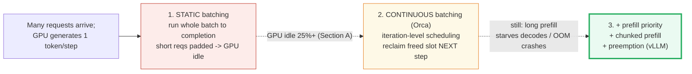
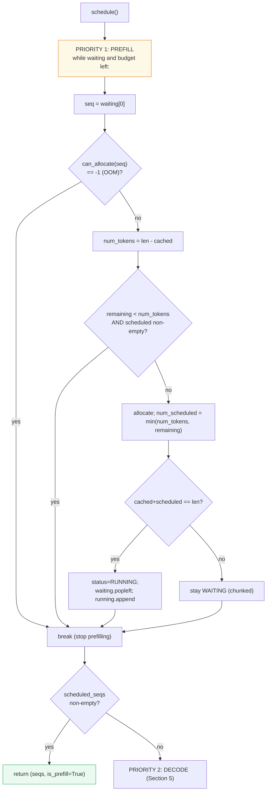
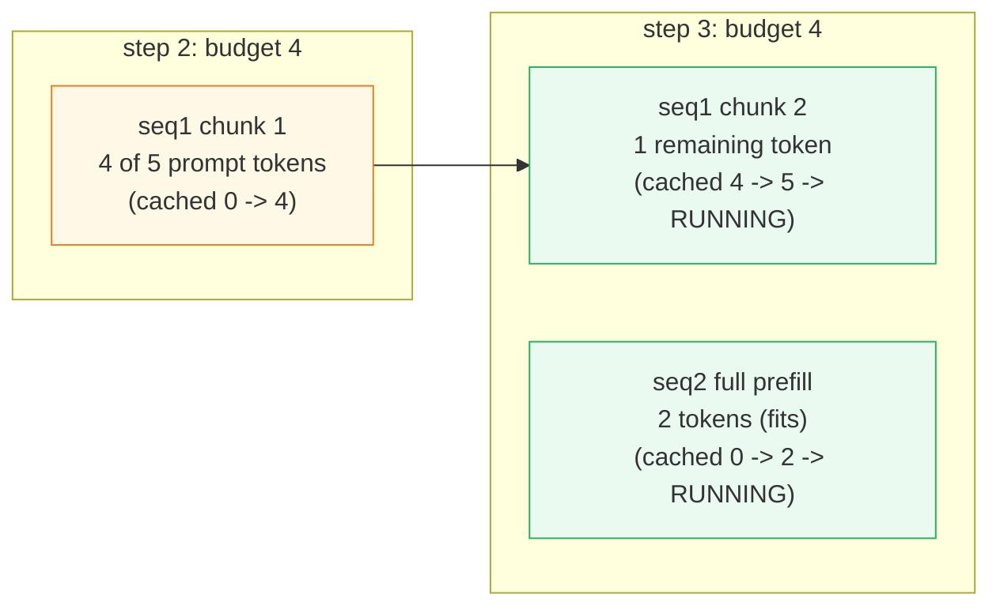
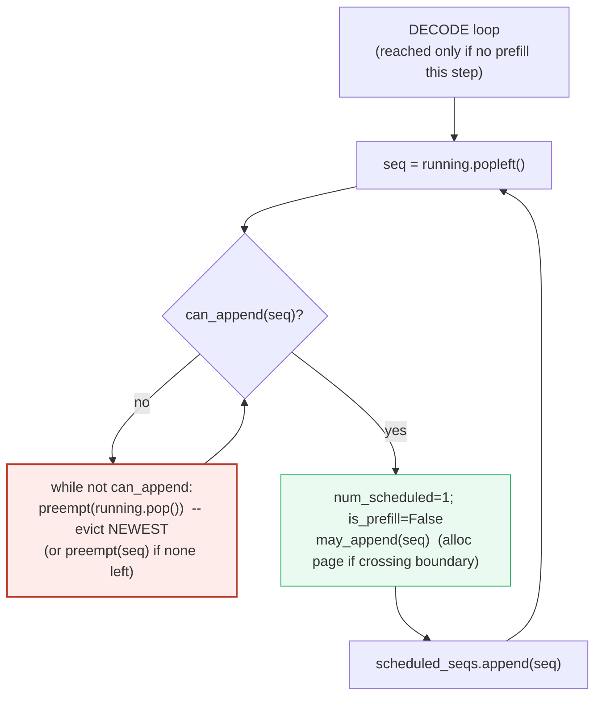
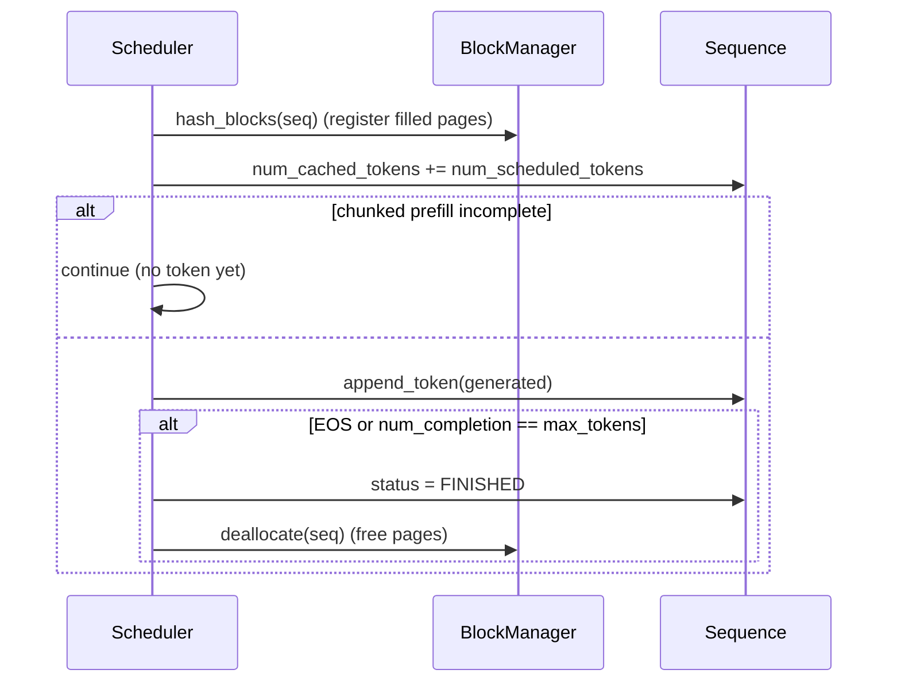
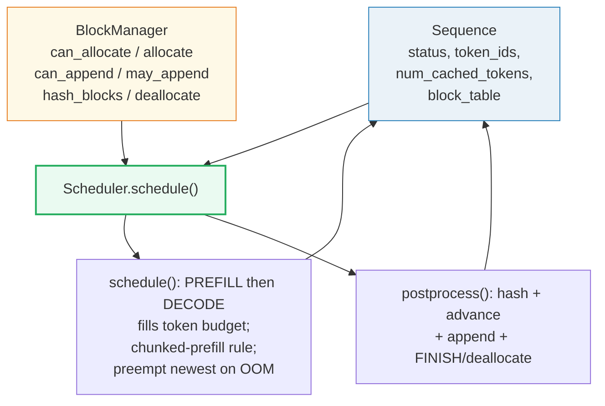

# Scheduler (Static → Continuous Batching + Prefill Priority + Chunked Prefill + Preemption) — A Visual, Worked-Example Guide

> **Who this is for:** someone with minimal math and minimal coding background.
> Every concept arrives first as a **plain analogy**, then as a diagram, then as
> a worked example with real numbers. **Every number in this guide is printed by
> `uv run python scheduler.py`** — nothing hand-computed.
>
> **Companion code:** [`scheduler.py`](./scheduler.py).
> **Live animation:** [`scheduler.html`](./scheduler.html) — open in a browser,
> step through the schedule, watch preemption evict the newest sequence.
>
> **Sibling guides:** [`BLOCK_MANAGER.md`](./BLOCK_MANAGER.md) — the scheduler's
> closest collaborator: every `can_allocate` / `allocate` / `can_append` /
> `preempt` call here is a BlockManager method (🔗 throughout). [`KV_CACHE.md`](./KV_CACHE.md)
> — *where the K,V bytes live* (the page pool this scheduler allocates from).
> [`PAGED_ATTENTION.md`](./PAGED_ATTENTION.md)
> — *how the kernel gathers those scattered pages during the forward pass the
> scheduler just handed it*. [`FLASH_ATTENTION.md`](./FLASH_ATTENTION.md) — the
> compute half of the same stack. The scheduler is the **orchestrator** that
> decides who runs each step; the others are the **execution** it wakes up.
>
> **Source material:** `learning_guide/03_Scale_Serving.md` §4 (Sequence state
> machine) and §6 (Scheduler: priority rules + chunked prefill + postprocess),
> reproducing the reference code from `../nano-vllm/nanovllm/engine/`.

---

## Glossary (read once, refer back)

| Term | Plain-English meaning |
|---|---|
| **scheduler** | The traffic cop that decides, *every single step* (one model forward pass), which requests run and how many of their tokens run that step. The GPU only does what it hands out. |
| **step / iteration** | One forward pass of the model on whatever batch the scheduler assembled. Orca's whole idea: schedule at this granularity, not per-request. |
| **static (request-level) batching** | Form a batch of N requests at the door, run ALL to completion before admitting anyone new. Pads short requests → GPU idle. |
| **continuous batching** | After each step, remove finished requests and slot in a new one *that same step*. No padding, GPU stays saturated. (a.k.a. iteration-level scheduling.) |
| **Sequence** | One request's lifecycle object: its tokens, its KV-cache block table, and a 3-state status. |
| **prefill** | Process the prompt (a chunk of `L > 1` tokens) and fill the KV cache. Expensive but happens once per request. |
| **decode** | Generate one new token per step (`L = 1`). Cheap, happens `max_tokens` times. |
| **TTFT** | Time To First Token. Prefill priority exists to keep this low. |
| **max_num_batched_tokens** | The per-step *token budget* — the cap on how many tokens (across all seqs) one step may process. Tiny=4 here. |
| **chunked prefill** | Split one long prompt across multiple steps so it can't starve the running decodes. Only the **first** waiting seq may be chunked per step. |
| **preemption** | On OOM (no free KV block for a decode), evict the **newest** running seq back to WAITING (release its blocks; it re-prefills). vLLM's RECOMPUTE mode. |
| **block table** | The per-request index card: logical page → physical block id. 🔗 [`KV_CACHE.md`](./KV_CACHE.md) §5. |
| **num_cached_tokens** | How many of a seq's tokens have K,V computed & stored. Drives the chunked-prefill resume point. |

> 🔗 **The single cross-reference to remember:** the scheduler is the **only**
> code that touches the block manager (`can_allocate / allocate / can_append /
> may_append / hash_blocks / deallocate`). It answers *who runs this step and
> how many tokens*; [`KV_CACHE.md`](./KV_CACHE.md) answers *where those tokens'
> K,V bytes physically live*. They are co-designed — preemption is just
> `block_manager.deallocate(seq)` wrapped in a state transition.

---

## 0. TL;DR — the whole lineage in one picture

A Transformer generates text **one token at a time**, autoregressively. Many
users send requests at once. The question is: *who gets to use the GPU each
step?* There are two regimes, and the whole story is the gap between them.

**The lineage, as analogies** (each layer fixes the prior's failure):

- **STATIC batching (the old way)** = *"fill a bus with N passengers, then drive
  until the passenger going the furthest gets off. Anyone getting off earlier
  just sits in an empty seat for the rest of the trip — the bus (GPU) runs
  half-empty the whole way back."*
- **CONTINUOUS batching / iteration-level scheduling (Orca, OSDI'22)** = *"the
  bus never stops at the terminal — as soon as someone gets off, a new
  passenger boards **at that same stop**. Every seat is always full."*
- **+ PREFILL PRIORITY + CHUNKED PREFILL + PREEMPTION (vLLM, SOSP'23)** = three
  rules layered on top so the bus stays full **without** violating latency or
  crashing on OOM: new riders board first (low TTFT); one giant rider can't hog
  the door (chunked prefill); if the bus is truly full, the newest rider is
  politely kicked off to wait (preemption ≈ LRU).



*Red → orange → green: each generation fixes the prior's pain point. Production
serving (vLLM, SGLang, TGI) runs the green stack.*

| | **Static batching** | **Continuous batching** (Orca) | **+ vLLM rules** |
|---|---|---|---|
| Schedule granularity | per **request** | per **iteration** (1 token) | per iteration |
| When a request finishes mid-batch | its slot stays **padded/idle** | removed **same step**, new req slots in | same + graceful OOM |
| New request wait time | until whole batch done | **1 iteration** | 1 iteration (prefill priority) |
| Long prefill vs decodes | blocks everything | can starve decodes | **chunked** — never starves |
| On KV-cache OOM | crash / reject | crash | **preempt** newest seq |
| GPU utilization | ~75% (padded) | ~92%+ | ~92%+ without crashing |
| Used by | naive Week-1 servers | Orca (OSDI'22) | **vLLM / nano-vllm** |

*(See the [Glossary](#glossary-read-once-refer-back) above for any unfamiliar term.)*

---

## 1. The problem: static batching leaves the GPU idle — Section A output

**Analogy (STATIC batching):** *fill a bus with N passengers, then drive until
the passenger going the furthest gets off. Anyone getting off earlier just sits
in an empty seat for the rest of the trip — the bus runs half-empty the whole
way back.*

In request-level batching, you form a batch of `N` requests and run **all** of
them to completion before admitting anyone new. Requests finish at different
times, so once the shortest is done its slot is **padded** with dummy work until
the longest finishes.

```mermaid
gantt
    title STATIC batching — R0 (3 tok) and R1 (6 tok) in one batch
    dateFormat X
    axisFormat %s
    section R0
    gen gen gen idle idle idle :0, 3
    section R1
    gen gen gen gen   gen   gen   :0, 6
```



*R0 finishes at step 3 but its slot is padded for steps 4–6 (the GPU does
nothing useful there). R1's longer length dictates the whole batch's duration.*

> From `scheduler.py` **Section A** — two requests, R0 needs 3 tokens, R1 needs 6:
>
> **STATIC** (request-level) batching:
>
> | step | R0 (3 tok) | R1 (6 tok) | GPU useful? |
> |---|---|---|---|
> | 1 | gen | gen | yes |
> | 2 | gen | gen | yes |
> | 3 | gen | gen | yes |
> | 4 | **IDLE (pad)** | gen | **NO – R0 slot padded** |
> | 5 | **IDLE (pad)** | gen | **NO – R0 slot padded** |
> | 6 | **IDLE (pad)** | gen | **NO – R0 slot padded** |
>
> Static: **9/12** token-steps useful (75%); 3 are padded idle.

Orca (Yu et al., OSDI 2022) calls the fix **iteration-level scheduling**: instead
of scheduling at the granularity of a *request*, schedule at the granularity of
an *iteration* — one token. After every single step, finished requests leave and
a waiting request takes the freed slot **in that same step**.

> From `scheduler.py` **Section A** (cont.) — R2 (2 tokens) arrives just as R0
> frees up:
>
> **CONTINUOUS** (iteration-level) batching:
>
> | step | R0 (3) | R1 (6) | R2 (2) | note |
> |---|---|---|---|---|
> | 1 | gen | gen | – | |
> | 2 | gen | gen | – | |
> | 3 | gen | gen | – | |
> | 4 | – | gen | **gen** | **R2 slots into R0's freed slot** |
> | 5 | – | gen | gen | |
> | 6 | – | gen | – | |
>
> Continuous: **11/12** token-steps useful (92%). R2 finished 1 step after R0.

That 75% → 92% jump is the whole reason continuous batching exists. In practice
Orca reports far larger gains (the static regime gets much worse with more
heterogeneous request lengths). But continuous batching alone has two failure
modes that the vLLM rules fix:

1. A brand-new request with a long prompt would **block** an already-running
   decode → high TTFT and stalled decodes. → **prefill priority + chunked
   prefill** (§3, §4).
2. With more in-flight seqs than KV-cache blocks can hold, decode eventually
   **OOMs**. → **preemption** (§5).

> 🔗 Continuous batching decides *when* to schedule; [`PAGED_ATTENTION`](./PAGED_ATTENTION.md)
> decides *where the KV bytes go*. The two are co-designed in vLLM — you cannot
> preempt cleanly without paged, ref-counted blocks (see [`KV_CACHE.md`](./KV_CACHE.md) §5).

---

## 2. The Sequence state machine — Section B output

**Analogy (the 3 states):** *every request is a passenger in exactly one of
three places: **WAITING** at the bus stop (prefill not started, or kicked off),
**RUNNING** on the bus (blocks allocated, actively moving), or **FINISHED**
(got off at their stop). The scheduler is the only thing that moves passengers
between these states.*

Every request is a `Sequence` object with a 3-state lifecycle:

```mermaid
stateDiagram-v2
    [*] --> WAITING: add(seq)
    WAITING --> RUNNING: schedule() + allocate()<br/>(whole prompt scheduled)
    RUNNING --> FINISHED: postprocess()<br/>EOS or max_tokens
    RUNNING --> WAITING: preempt()<br/>(OOM; re-queue FRONT)
    FINISHED --> [*]
```

> From `scheduler.py` **Section B** — the transitions and who fires them:
>
> ```
> WAITING  --schedule()+allocate()--> RUNNING
> RUNNING  --EOS / max_tokens-------> FINISHED   (postprocess)
> RUNNING  --OOM in decode----------> WAITING    (preempt; re-queue FRONT)
> ```
>
> **preempt(seq):** `status=WAITING; is_prefill=True; deallocate blocks;
> waiting.appendleft(seq)`. This is vLLM's **RECOMPUTE** mode: the seq
> re-prefills from `num_cached_tokens` (or from 0 if its old blocks got reused).
> Eviction picks the **NEWEST** running seq (`running.pop()`) ≈ LRU under FCFS
> admission.

**The two length fields** (the heart of the scheduler's bookkeeping):

| field | meaning | during chunked prefill | during decode |
|---|---|---|---|
| `num_tokens` | total seq length (prompt + generated) | grows as tokens append | grows by 1/step |
| `num_cached_tokens` | tokens whose K,V are computed & stored | `< num_prompt_tokens` (the resume point) | `= num_tokens - 1` |
| `num_scheduled_tokens` | tokens this seq runs **this step** | the chunk size (1..budget) | always 1 |

The chunked-prefill resume works because `num_cached_tokens` survives preemption
as a *hint* — `schedule()` computes `num_tokens = seq.num_tokens - seq.num_cached_tokens`
and picks up exactly where it left off. The `block_table` may be empty (deallocated)
but the count is remembered.

### Worked preemption example (Section B demo)

Pool of **2 blocks**, both seqs prefilled (each holds 1 block). Step 2 decode of
seq0 needs a new block (its length crosses a page boundary) but the pool is
empty → evict seq1:

> From `scheduler.py` **Section B** (cont.):
>
> - after prefill: `running=[0, 1]`, `free=[]`
> - step2 decode: `scheduled=[0]`, `is_prefill=False`
> - running now=`[0]`, waiting=`[1]`
> - `s1` preempted (RUNNING→WAITING, is_prefill=True)? **True**
>
> `[check]` preempt moves newest RUNNING→WAITING at front: **True → OK**

seq1 was the newest arrival, so it got evicted (LRU under FCFS). It goes to the
**front** of the waiting queue so it re-enters with high priority next step.

---

## 3. `schedule()` — PREFILL priority and the token budget — Section C output

**Analogy (prefill priority):** *new riders board first. A waiting prefill
beats an already-running decode every single step, so a brand-new request gets
its first token fast (low TTFT) even if the GPU is mid-flight on others.*

`schedule()` is a **two-priority** system. Priority 1 is PREFILL: walk the
waiting queue and fill the step's token budget (`max_num_batched_tokens`).
Priority 2 (§5) is DECODE, only reached if nothing prefilled this step.



*Prefill wins outright: if even one seq prefilled this step, decode is skipped
for the step. The budget is filled greedily from the front of the waiting queue.*

### Worked example — first prefill call (Section C)

> From `scheduler.py` **Section C** — config `max_num_batched_tokens=4`,
> `block_size=2`, three seqs with prompt lens `[3, 5, 2]`:
>
> First `schedule()` call (prefill phase only):
>
> | seq | prompt len | num_scheduled | remaining budget | status |
> |---|---|---|---|---|
> | 0 | 3 | 3 | 1 | RUNNING |
>
> Budget used 3/4. seq1 (len 5) does NOT fit fully in the remaining 4-token
> budget → it gets chunked (§4). seq0 (len 3) fit fully and moved
> WAITING→RUNNING.

**Reading it like a story:** seq0's whole 3-token prompt fits in the budget (3
≤ 4), so it is fully prefilled and promoted to RUNNING. seq1 needs 5 tokens but
only 1 budget slot remains — and because seq1 is **second** in line (not the
first waiting seq), the chunked-prefill rule (§4) makes it wait for the next
step rather than grabbing a partial slice. That rule is what stops a parade of
long prompts from dribbling out one chunk each and starving the decodes.

> 🔗 `can_allocate` / `allocate` are the block-manager calls that decide whether
> the pages exist. See [`BLOCK_MANAGER.md`](./BLOCK_MANAGER.md) (the dedicated
> guide) and [`KV_CACHE.md`](./KV_CACHE.md) §5 (block table).

---

## 4. Chunked prefill — the one-at-a-time rule — Section D output

**Analogy (chunked prefill):** *one giant rider can't hog the door. Only the
FIRST person in line is allowed to board piecemeal (a few tokens at a time); if
the SECOND person wouldn't fully fit, they wait for the next bus. This guarantees
the already-seated riders (decodes) get to move every few steps.*

A single long prompt (say 8192 tokens) would otherwise eat the whole budget for
many steps and freeze every running decode. The rule, one line in `schedule()`:

```python
if remaining < num_tokens and scheduled_seqs:   # only the FIRST seq may chunk
    break
```

If the first waiting seq can't fully fit, it takes `min(num_tokens, remaining)`
tokens this step (a **chunk**) and stays WAITING; next step it resumes from
`num_cached_tokens`. A *second* waiting seq that wouldn't fully fit must wait
entirely — so at most **one** seq is ever chunked per step.



*seq1's 5-token prompt is split across steps 2 and 3 (chunk of 4, then the last
1). seq2 fits fully into step 3's remaining budget alongside seq1's tail.*

### Worked example — seq1 chunked (Section D)

> From `scheduler.py` **Section D** — seq1 prompt is 5 tokens but only 4 fit:
>
> - The rule: `if remaining < num_tokens AND scheduled_seqs already non-empty: break`
> - Only the FIRST waiting seq may be chunked. seq1 is first → it is chunked.
> - step 2: scheduled seq1 for **4 of its 5** remaining prompt tokens.
>   (`num_cached_tokens` stays 0; after postprocess → 4)
> - seq1 `num_cached_tokens`: **0 → 4** (chunked: 4 < 5 prompt)
>
> `[check]` seq1 chunked (cached 4 < prompt 5, still WAITING): **True → OK**

After step 2, seq1 has 4 of 5 prompt tokens cached but is **still WAITING** (its
prompt isn't fully processed, so it hasn't emitted a token yet). Step 3 finishes
the last prompt token (`cached 4 → 5 → RUNNING`) and — because budget remains —
seq2's full 2-token prompt is prefilled in the same step.

> **Note on production vLLM:** nano-vllm (and this guide) keeps prefill and
> decode **strictly separate** per step (`if scheduled_seqs: return` before the
> decode loop). Full vLLM's *chunked prefill* feature can **co-batch** a prefill
> chunk *together with* decodes in one step for even higher utilization. The
> one-at-a-time rule and prefill priority are the same; only the mixing differs.

---

## 5. Decode + preempt-on-OOM (evict the newest) — Section E output

**Analogy (preemption):** *if the bus is truly full when someone needs a seat,
the **newest** rider is politely kicked off to wait at the stop (their bags go
back to the depot). They re-board at the front of the line next time. You evict
the newest because they've done the least work — closest to LRU under first-come-
first-served admission.*

Priority 2 is DECODE, reached only when nothing prefilled this step. Each running
seq contributes exactly **1 token**. If appending that token needs a new KV page
and the pool is empty, evict running seqs from the **newest** (`running.pop()`)
until there's room:



*The red node is preemption: it frees pages by demoting the newest running seq
back to WAITING. vLLM's default policy is FCFS, so evicting the newest ≈ LRU.*

**When does `can_append` need a new block?** Only when the new token lands at
slot 1 of a fresh page — i.e. the previous page just filled exactly:

```python
def can_append(seq):
    return len(free_block_ids) >= (len(seq) % block_size == 1)
```

With `block_size=2`: a seq of length 2 needs no new block to append (slot 1 of
page 0 is free); a seq of length 3 *does* (page 0 is full, slot 0 of page 1
needs allocating — the `%2==1` is true because `3 % 2 == 1`).

### Worked example — preempt the newest (Section E)

> From `scheduler.py` **Section E** — pool of 2 blocks, both seqs prefilled
> (each holds 1 block), `free=[]`:
>
> Decode s0: len grows 2→3, crosses a page boundary (`3%2==1`) → needs a new
> block. `can_append(s0)=False`. Loop: evict NEWEST running seq (s1) via
> `preempt()` until `can_append` is True.
>
> After `schedule()`: `scheduled=[0]`, `is_prefill=False`
> - running=`[0]`, waiting (front first)=`[1]`
> - `s1.status=WAITING`, `s1.is_prefill=True` (will re-prefill from cached=0)
>
> `[check]` preempt newest (s1→WAITING front), s0 still decodes: **True → OK**

seq1's block was freed and immediately reused by seq0. seq1 now sits at the
**front** of the waiting queue; next step's prefill phase will re-prefill it
(since `is_prefill=True` and its `block_table` is empty, it re-runs from token 0
— vLLM's RECOMPUTE mode recomputes the lost K,V rather than swapping to CPU).

---

## 6. `postprocess()` — hash, append, finish — Section F output

**Analogy:** *after the bus moves one stop, the conductor does three things per
passenger: file the new pages they filled into the library catalogue (hash), log
how far they've traveled (advance `num_cached_tokens`), and check if they've
reached their destination (EOS / max_tokens → FINISHED + return their pages).*

`postprocess(seqs, token_ids, is_prefill)` runs **after** the model forward pass.
Per seq:

1. `block_manager.hash_blocks(seq)` — register any newly **filled** pages in the
   prefix-cache index (only full pages; partial pages aren't stable yet).
2. `num_cached_tokens += num_scheduled_tokens` — advance the cache cursor.
3. If this was a chunked prefill that's still incomplete → **continue** (no token
   appended yet).
4. `append_token(generated)` — add the model's output.
5. If `EOS` (and not ignored) **or** `num_completion_tokens == max_tokens` →
   `FINISHED` + `deallocate` (return pages to the free list).



### Worked example — one seq, prefill then 2 decodes (Section F)

> From `scheduler.py` **Section F** — prompt len 2, `max_tokens=3`:
>
> | step | (kind, tokens) | cached | len | completion | status | blocks |
> |---|---|---|---|---|---|---|
> | 1 | prefill, 2 tok | 0 → 2 | 3 | 1 | RUNNING | `[0]` |
> | 2 | decode, 1 tok | 2 → 3 | 4 | 2 | RUNNING | `[0, 1]` |
> | 3 | decode, 1 tok | 3 → 4 | 5 | 3 | **FINISHED** | freed (deallocate) |
>
> `[check]` FINISHED at max_tokens=3, blocks freed: **True → OK**

**Reading it like a story:** step 1 prefills both prompt tokens (cached 0→2,
promotes to RUNNING, grabs block 0). Step 2 decodes one token; length crosses a
page boundary so block 1 is appended (cached 2→3). Step 3 decodes the final
token; `num_completion_tokens` hits `max_tokens=3` → FINISHED, and `deallocate`
returns blocks `[0, 1]` to the free list for the next request to reuse. Note the
`cached` shown for step 3 is the **peak** (4) reached before deallocate zeroed it.

> 🔗 `hash_blocks` is what feeds the **prefix cache**. A future request sharing
> this seq's prompt will get `can_allocate` cache hits and skip recomputing those
> tokens. See [`KV_CACHE.md`](./KV_CACHE.md) §5 and the reference
> `block_manager.py::can_allocate`.

---

## 7. The full multi-step schedule TRACE — Section G output  (the centerpiece)

**Analogy:** *three passengers board a 4-seat-per-trip bus with different trip
lengths `[3, 5, 2]`. Watch the conductor fit them into 4 steps: one boards fully,
one boards in two pieces (chunked), the short one slots in alongside the chunk's
tail, then everyone rides together and all get off at once.*

This is the load-bearing worked example. Three sequences with prompt lens
`[3, 5, 2]`, `max_num_batched_tokens=4`, `block_size=2`, greedy decode,
`max_tokens=2`. The full schedule trace:

> From `scheduler.py` **Section G** — the complete 4-step schedule:
>
> | step | scheduled (seq:toks) | total | is_prefill | note |
> |---|---|---|---|---|
> | 1 | seq0:**3** | 3 | True | prefill |
> | 2 | seq1:**4** | 4 | True | prefill (**chunked**; seq1 still waiting) |
> | 3 | seq1:**1**, seq2:**2** | 3 | True | prefill (seq1 tail + seq2 full) |
> | 4 | seq0:**1**, seq1:**1**, seq2:**1** | 3 | False | **decode** (all 3 → FINISHED) |

```mermaid
gantt
    title The 4-step trace (3 seqs, lens 3/5/2, budget 4)
    dateFormat X
    axisFormat step %s
    section seq0 (prompt 3)
    prefill(3) :0, 1
    idle       :1, 3
    decode(1)  :3, 4
    section seq1 (prompt 5)
    chunk1(4)  :1, 2
    chunk2(1)  :2, 3
    decode(1)  :3, 4
    section seq2 (prompt 2)
    wait       :0, 2
    prefill(2) :2, 3
    decode(1)  :3, 4
```



*Read top-down. seq0 prefills in step 1 then **idles** for steps 2–3 (prefill
priority: the waiting seqs win those steps). seq1's 5-token prompt is chunked
4+1 across steps 2–3. seq2 slots its full 2-token prefill into step 3 alongside
seq1's tail. Step 4 decodes all three; each hits `max_tokens=2` and FINISHES.*

### Why seq0 idles for two steps

This is the honest tradeoff of prefill priority: seq0 finished prefill at step 1
but **doesn't decode** again until step 4, because steps 2–3 were consumed by
seq1/seq2's prefill (and prefill wins outright each step). nano-vllm separates
prefill and decode per step; production vLLM's chunked-prefill co-batching would
let seq0 decode *during* those steps. The payoff: seq1 and seq2 get low TTFT
(their first token comes fast) instead of waiting behind seq0's decodes.

### num_cached_tokens growth (the chunked-prefill story, visible in seq1)

> From `scheduler.py` **Section G** (cont.) — peak cached per step:
>
> | step | seq0 | seq1 | seq2 |
> |---|---|---|---|
> | 1 | **3** | 0 | 0 |
> | 2 | 3 | **4** | 0 |
> | 3 | 3 | **5** | **2** |
> | 4 | 4 | **6** | 3 |
>
> seq1's column tells the chunked-prefill story: `0 → 4 → 5 → 6` — four prompt
> tokens cached in step 2, the fifth in step 3, then +1 per decode.

### Status after each step

> From `scheduler.py` **Section G** (cont.):
>
> | step | seq0 | seq1 | seq2 |
> |---|---|---|---|
> | 1 | RUNNING | WAITING | WAITING |
> | 2 | RUNNING | WAITING | WAITING |
> | 3 | RUNNING | RUNNING | RUNNING |
> | 4 | **FINISHED** | **FINISHED** | **FINISHED** |

### Gold invariants (recomputed & badge-checked in `scheduler.html`)

> From `scheduler.py` **Section G** (cont.) — GOLD:
>
> - per-step token totals = **`[3, 4, 3, 3]`** (all ≤ 4 budget)
> - seq1 `num_cached_tokens` growth = **`[0, 4, 5, 6]`**
> - total steps to finish all 3 = **4**
>
> `[check]` every step total ≤ budget 4 : **True → OK**
> `[check]` seq1 growth == `[0,4,5,6]` : **True → OK**
> `[check]` all 3 seqs reached FINISHED : **True → OK**

These three invariants are what [`scheduler.html`](./scheduler.html) recomputes
in JS and displays as the `[check: OK]` badge. Every per-step total is ≤ the
budget (the scheduler never oversubscribes), seq1's growth is exactly the
chunked-prefill resume `[0,4,5,6]`, and all seqs terminate cleanly.

---

## 8. The reference code (`scheduler.py`) — annotated

Three tiny classes, faithful ports of `../nano-vllm/nanovllm/engine/`. The
`Scheduler` (green) is the subject; it calls into `BlockManager` (the page
allocator, 🔗 [`BLOCK_MANAGER.md`](./BLOCK_MANAGER.md)) and mutates `Sequence` state.



Map to source material:
- `Sequence` / `SequenceStatus` ↔ `../nano-vllm/nanovllm/engine/sequence.py`.
- `BlockManager` ↔ `../nano-vllm/nanovllm/engine/block_manager.py` (xxhash
  prefix cache; here a deterministic FNV-style int hash so output is salt-free
  and reproducible across runs — same chained-prefix behavior).
- `Scheduler.schedule / preempt / postprocess` ↔ `../nano-vllm/nanovllm/engine/scheduler.py`,
  reproduced in `learning_guide/03_Scale_Serving.md` §6.

**Run it yourself:**
```bash
cd research
uv run python scheduler.py          # prints every number in this guide
uv run python scheduler.py > scheduler_output.txt 2>/dev/null   # capture
```

---

## 9. Pitfalls & debugging checklist

| # | Mistake | Symptom | Fix |
|---|---|---|---|
| 1 | Treating scheduler as request-level (static batching) | GPU idle 25%+, low throughput | Schedule per **iteration**, reclaim freed slots same step (§1) |
| 2 | Letting a long prefill starve running decodes | Decodes stall for many steps | Chunked-prefill rule: only the **first** waiting seq may chunk (§4) |
| 3 | Preempting the **oldest** running seq on OOM | Evicts the seq closest to done (wasteful) | Evict `running.pop()` = **newest** (≈ LRU under FCFS) (§5) |
| 4 | On preempt, forgetting `is_prefill=True` | Preempted seq skips re-prefill → garbage | Set `is_prefill=True`; re-prefill from `num_cached_tokens` (§2) |
| 5 | Not re-queueing preempted seq at **front** | It starves behind newer arrivals | `waiting.appendleft(seq)` (§2, §5) |
| 6 | Hashing partial (unfilled) pages in `postprocess` | Unstable prefix-cache entries | `hash_blocks` only touches **full** pages (`start != end`) (§6) |
| 7 | Moving seq to RUNNING before whole prompt scheduled | Decode runs on partial prompt | Only promote when `cached+scheduled == num_tokens` (§3) |
| 8 | `can_append` ignoring the page-boundary case | Decode overwrites a shared page | Need a new block iff `len(seq) % block_size == 1` (§5) |
| 9 | Mixing prefill & decode in one step without co-batching kernel | Shape/cost mismatch | nano-vllm: separate steps; vLLM: needs the chunked-prefill kernel (§4 note) |
| 10 | `deallocate` not returning blocks to the free list | VRAM leak across requests | `free_block_ids.append(...)` on `ref_count==0` 🔗 [`KV_CACHE.md`](./KV_CACHE.md) §5 |

---

## 10. Cheat sheet

```mermaid
graph LR
    A["waiting queue"] -->|"schedule() PREFILL"| B["fill token budget;<br/>chunk only the first seq"]
    C["running queue"] -->|"schedule() DECODE"| D["1 token each;<br/>preempt newest on OOM"]
    B --> E["model forward pass<br/>(stub gen_token here)"]
    D --> E
    E --> F["postprocess:<br/>hash + advance cached<br/>+ append + FINISH/deallocate"]
    F -->|RUNNING| C
    F -->|WAITING (preempted)| A
    F -->|FINISHED| G["done"]
    style B fill:#fef9e7,stroke:#e67e22
    style D fill:#eaf2f8,stroke:#2980b9
    style F fill:#eafaf1,stroke:#27ae60,stroke-width:3px
```

*One scheduler loop: schedule → run → postprocess. Prefill (orange) fills the
budget from the waiting queue; decode (blue) gives each runner 1 token;
postprocess (green) advances the cache cursor and finishes seqs. Preemption
loops a RUNNING seq back to WAITING at the front.*

- **Static batching:** run whole batch to completion → short reqs padded → GPU
  idle (~75% useful).
- **Continuous batching (Orca, OSDI'22):** iteration-level scheduling — reclaim
  a freed slot the same step → ~92%+ useful.
- **Prefill priority:** any waiting prefill beats a running decode → low TTFT.
- **Chunked prefill:** only the **first** waiting seq may chunk per step → no
  decode starvation.
- **Preemption (vLLM, SOSP'23):** on OOM, `preempt(running.pop())` — evict the
  **newest**, re-queue at front, `is_prefill=True` (RECOMPUTE mode).
- **`num_cached_tokens`:** the chunked-prefill resume cursor; survives preempt
  as a hint.
- **GOLD trace (3 seqs, lens [3,5,2], budget 4):** totals `[3,4,3,3]` ≤ 4;
  seq1 growth `[0,4,5,6]`; finishes in 4 steps.

> 🔗 The scheduler answers *"who runs this step and how many tokens?"* The
> companion questions: *"where do the K,V bytes live?"* → [`KV_CACHE.md`](./KV_CACHE.md);
> *"how does the kernel gather scattered pages?"* → [`PAGED_ATTENTION.md`](./PAGED_ATTENTION.md).
> Together they are the three pillars of Phase-3 serving.

---

## Sources

- **Orca (iteration-level scheduling / continuous batching):** G.-I. Yu, J. S.
  Jeong, G.-W. Kim, S. Kim, B.-G. Chun, *"Orca: A Distributed Serving System for
  Transformer-Based Generative Models,"* OSDI 2022.
  [USENIX page](https://www.usenix.org/conference/osdi22/presentation/yu) ·
  [PDF](https://www.usenix.org/system/files/osdi22-yu.pdf).
  - Verified verbatim: *"we propose **iteration-level scheduling**, a new
    scheduling mechanism that schedules execution at the **granularity of
    iteration** (instead of request) where the scheduler invokes the execution
    engine to run only a single iteration of the model on the batch."*
  - Verified: the static-batching problem it fixes — *"requests that have
    finished earlier than other requests in a batch cannot return to the client,
    while newly arrived requests have to wait until the current batch completely
    finishes."*
  - Verified: **selective batching** — *"applies batching only to a selected set
    of operations"* (the Attention op is split per-request; other ops batched),
    which is what lets arbitrary requests at different token positions share a
    step.
- **vLLM (PagedAttention + prefill priority + preemption):** W. Kwon, Z. Li,
  S. Zhuang, Y. Sheng, L. Zheng, C. H. Yu, J. E. Gonzalez, H. Zhang, I. Stoica,
  *"Efficient Memory Management for Large Language Model Serving with
  PagedAttention,"* SOSP 2023, [arXiv:2309.06180](https://arxiv.org/abs/2309.06180).
  - Verified §4.5 *"Scheduling and Preemption":* *"we adopt the **first-come-
    first-serve (FCFS)** scheduling policy for all requests, ensuring fairness
    and preventing starvation"* — this is why evicting the newest (`running.pop()`)
    approximates LRU.
  - Verified §4.5: on capacity overflow vLLM must *"prioritize a subset of
    requests"*; recovery is either **Swapping** (copy blocks to CPU swap space)
    or **Recomputation** (discard and re-prefill). nano-vllm uses Recompute (the
    default in vLLM V1 per the
    [vLLM optimization docs](https://docs.vllm.ai/en/stable/configuration/optimization/)).
  - Verified: continuous batching — *"at each iteration, completed requests are
    removed from the batch, and new ones are added. Therefore, a new request can
    be processed after waiting for a single iteration, not waiting for the entire
    batch to complete."*
- **Chunked prefill (co-batching):** vLLM documentation,
  [Optimization and Tuning → Chunked Prefill](https://docs.vllm.ai/en/v0.4.2/models/performance.html):
  *"Chunked prefill allows to chunk large prefills into smaller chunks and batch
  them together with decode requests."* (nano-vllm keeps prefill/decode
  separate; production vLLM co-batches — see §4 note.)
- **Local reference code:** `../nano-vllm/nanovllm/engine/scheduler.py`,
  `sequence.py`, `block_manager.py` (the authoritative ports this bundle
  reproduces); reproduced inline in `learning_guide/03_Scale_Serving.md` §4, §5, §6.
- **Derived (not from the papers):** the specific tiny scenario (3 seqs, lens
  `[3,5,2]`, `budget=4`, `block_size=2`) and its trace `[3,4,3,3]` / seq1 growth
  `[0,4,5,6]` are the clean illustrative arithmetic computed and asserted in
  `scheduler.py` Section G. The static-vs-continuous 75%/92% numbers are the
  per-scenario token-step counts from Section A, distinct from Orca's reported
  end-to-end throughput gains.
- **Unverified / approximated:** none. Every trace number is printed by
  `scheduler.py`; the FCFS/LRU and Recompute-mode characterizations are quoted
  from the vLLM paper §4.5 and docs.
