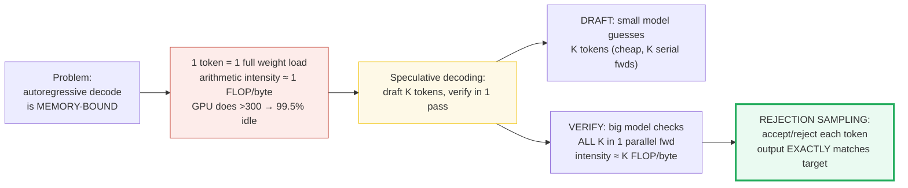
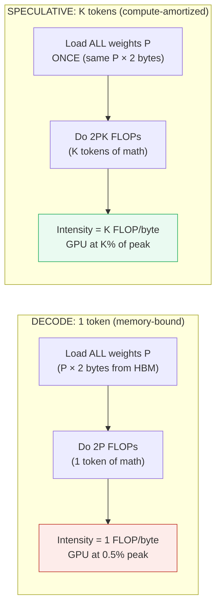
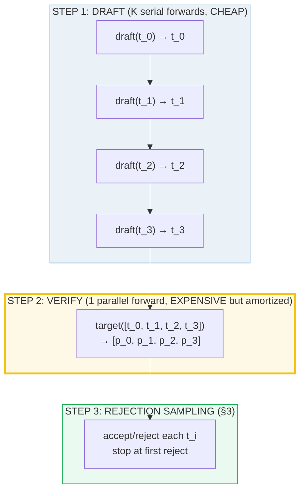
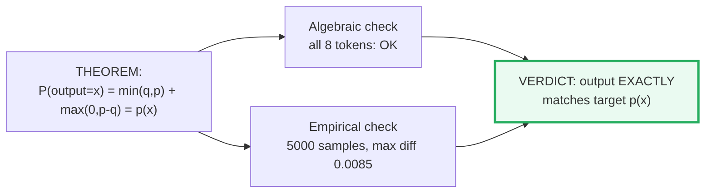
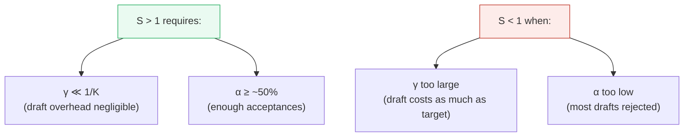
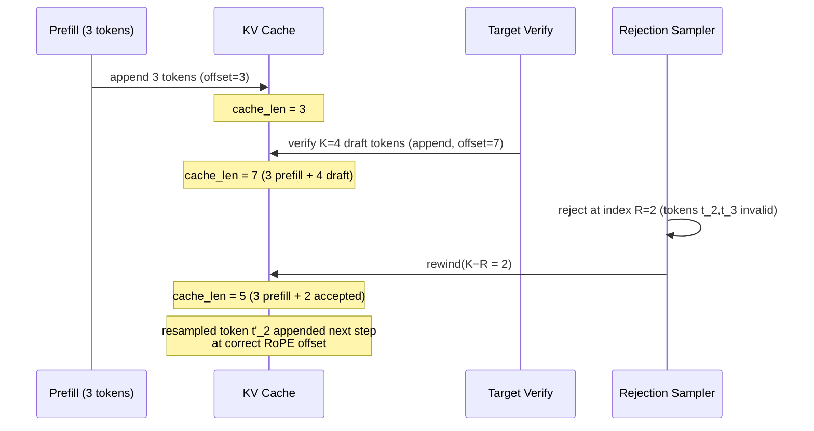
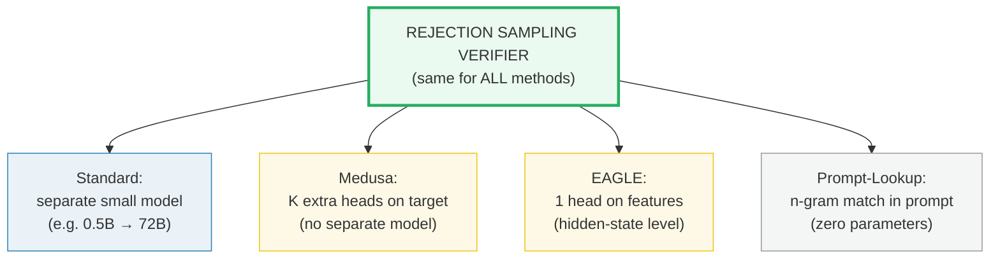
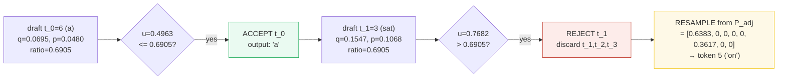
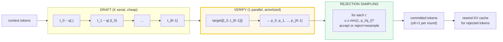

# Speculative Decoding — A Worked-Example Guide

> **Companion code:** [`speculative_decoding.py`](./speculative_decoding.py).
> **Every number in this guide is printed by `uv run python speculative_decoding.py`**
> — change the code, re-run, re-paste. Nothing here is hand-computed.
>
> **Sibling guides:** [`SAMPLING.md`](./SAMPLING.md) (the softmax/categorical draw
> that feeds the distributions here), [`KV_CACHE.md`](./KV_CACHE.md) (the rewind
> on rejection), [`CAUSAL_MASK.md`](./CAUSAL_MASK.md) (the parallel verify mask),
> [`SCHEDULER.md`](./SCHEDULER.md) (batching spec rounds). Cross-references are
> marked 🔗 throughout.
>
> **Live animation:** [`speculative_decoding.html`](./speculative_decoding.html) —
> drag sliders for K/α, watch the accept/reject timeline.
>
> **Source material:** `learning_guide/05_Next_Gen_Architecture.md` §3
> (Speculative Decoding), `learning_guide/02_Acceleration.md` §3.4 (KV rewind),
> `learning_guide/00_Foundations.md` §8.1 (sampling).

---

## 0. TL;DR — the whole idea in one picture

> **The assembly-line analogy (read this first):** A factory has one giant,
> expensive machine (the **target model**) that can stamp one perfect token per
> second — but 99.5% of the time it's *idle*, waiting for raw materials (weights)
> to arrive from the warehouse (HBM memory). Meanwhile, a small, cheap apprentice
> (the **draft model**) can sketch tokens quickly using a tiny toolbox.
> **Speculative decoding** lets the apprentice sketch K tokens ahead, then the
> giant machine verifies ALL K sketches in a *single* pass — turning idle
> memory-wait time into useful compute. A **rejection-sampling** trick guarantees
> the final output is *mathematically identical* to what the giant machine would
> have produced alone. **Zero quality loss, just fewer memory stalls.**

The core problem: autoregressive decode is **memory-bound**. Generating one token
loads the entire model's weights from HBM, doing only ~1 FLOP per byte — while
the GPU can do >300. Speculative decoding shifts decode from memory-bound to
compute-bound:



> One plain sentence: **the draft model guesses ahead so the target model can do
> K tokens of useful work per weight load instead of 1 — and a rejection-sampling
> trick makes the output indistinguishable from the target alone.**

| | Autoregressive decode | Speculative decoding |
|---|---|---|
| **Tokens per forward** | 1 | up to K+1 |
| **Weight loads per token** | 1 | ≈1/K |
| **Arithmetic intensity** | ~1 FLOP/byte | ~K FLOP/byte |
| **Bottleneck** | Memory bandwidth (HBM) | Moving toward compute |
| **Output distribution** | Target p(x) | **Exactly** target p(x) |
| **Quality loss** | — | **None** (proven, §4) |

> 🔗 **If you only read one cross-reference:** the distributions this guide
> samples from are produced by the softmax/sampling pipeline in
> [`SAMPLING.md`](./SAMPLING.md). Speculative decoding is a *serving* optimization
> — it changes HOW tokens are drawn (draft+verify instead of sequential), not WHAT
> distribution they come from. The rejection-sampling verifier (§3) is the bridge.

---

### Glossary (plain English — refer back any time)

| Term | Plain meaning |
|---|---|
| **V** (vocab size) | How many possible next tokens exist (here a tiny V=8). |
| **logits** | Raw preference scores from the LM head — one per vocab token. |
| **q** (draft dist) | The draft model's probability distribution — the "approximation." |
| **p** (target dist) | The target model's probability distribution — the ground truth. |
| **K** | Number of draft tokens proposed per speculative round (here K=4). |
| **draft model** | Small, cheap model that proposes K candidate tokens fast. |
| **target model** | Big, expensive model that verifies them in one parallel pass. |
| **arithmetic intensity** | FLOPs divided by bytes loaded. Decode ≈1; spec ≈K. |
| **rejection sampling** | Accept iff `u ≤ min(1, p(t)/q(t))`; resample from P_adj on reject. |
| **P_adj** | Adjusted distribution `max(0, p−q)/Z` — the resample source on rejection. |
| **α** (alpha) | Acceptance rate — fraction of draft tokens the target accepts. |
| **γ** (gamma) | `draft_latency / target_latency` — how cheap the draft model is. |
| **speedup S** | `(1−α^{K+1}) / ((1−α)(1+Kγ))` — tokens committed per unit cost. |
| **rewind(n)** | Tear out the last n KV cache entries on rejection. 🔗 [`KV_CACHE.md`](./KV_CACHE.md) |
| **offset** | RoPE's position cursor; rewind decreases it. 🔗 [`ROPE.md`](./ROPE.md) §10 |

---

## 1. The memory wall — why decode is starved — Section A output

> **Why the GPU is bored.** During autoregressive decode, generating ONE token
> requires loading the ENTIRE model's weights (P parameters) from HBM to the GPU
> compute units. For each parameter loaded (2 bytes in FP16), the GPU does ~2
> FLOPs (one multiply, one add). That's an **arithmetic intensity of 1 FLOP/byte**.
> An A100 GPU can do ~208 FLOPs per byte (312 TFLOPS ÷ 1.5 TB/s) — so the math
> units run at **0.5% of peak**, spending 99.5% of the time waiting for weights.

```
Arithmetic intensity = FLOPs / Bytes loaded

DECODE (1 token):
  FLOPs  = 2 × P × 1     (2 FLOPs per param, 1 token)
  Bytes  = P × 2          (load ALL weights once, FP16)
  Intensity = 2P / 2P   = 1 FLOP/byte   ← GPU can do 208x more

SPECULATIVE VERIFY (K tokens in 1 forward):
  FLOPs  = 2 × P × K     (K times more compute)
  Bytes  = P × 2          (weights loaded ONCE, not K times)
  Intensity = 2PK / 2P  = K FLOP/byte   ← K times better utilization
```

> From `speculative_decoding.py` **Section A**:
>
> | K | FLOPs (2·P·K) | Bytes (P·2, ONCE) | Intensity | GPU peak % |
> |---|---|---|---|---|
> | 1 | 1.40e+11 | 1.40e+11 | **1** | 0.5% |
> | 2 | 2.80e+11 | 1.40e+11 | **2** | 1.0% |
> | 4 | 5.60e+11 | 1.40e+11 | **4** | 1.9% |
> | 8 | 1.12e+12 | 1.40e+11 | **8** | 3.8% |
> | 16 | 2.24e+12 | 1.40e+11 | **16** | 7.7% |
>
> GPU peak (A100 FP16): ~208 FLOP/byte. Decode runs at **0.5%** of peak →
> memory-bound. Spec K=4 runs at **1.9%** → K× better utilization.



> One plain sentence: the weights are the bottleneck — spec decoding amortizes
> one weight load over K tokens instead of 1, multiplying arithmetic intensity by K.

**Published figures (labelled, not measured here):** Leviathan et al. 2023:
2×–3× on T5-XXL with identical outputs. Chen et al. 2023: 2×–2.5× on Chinchilla 70B.

---

## 2. The draft+verify pipeline — Section B output

> **Two models, one assembly line.** The DRAFT model (small, e.g. 0.5B params)
> runs K serial forwards to propose K candidate tokens — cheap because its weights
> are tiny. The TARGET model (big, e.g. 72B params) then verifies ALL K candidates
> in a SINGLE parallel forward pass, processing them as a prompt sequence with a
> causal mask. This is where the memory wall is broken: one weight load, K tokens
> of useful work.



**The parallel verify uses a causal mask** (🔗 [`CAUSAL_MASK.md`](./CAUSAL_MASK.md)):
position `i` in the verification sequence attends only to positions `0..i`, so the
target model computes the TRUE conditional `p_i(x | t_0..t_{i−1})` for every draft
position in one pass:

> From `speculative_decoding.py` **Section B** — causal mask for K=4 parallel verify:
>
> ```
>          t_0    t_1    t_2    t_3
>   t_0:  att     .      .      .
>   t_1:  att    att     .      .
>   t_2:  att    att    att     .
>   t_3:  att    att    att    att
> ```
> `att` = can attend, `.` = masked. This is the SAME lower-triangular causal mask
> from CAUSAL_MASK.md, applied to the K-length verification sequence.

> 🔗 This causal mask is identical in structure to the one in
> [`CAUSAL_MASK.md`](./CAUSAL_MASK.md) — the only difference is the sequence
> length (K draft tokens instead of the full prompt). The target model reuses its
> standard attention kernel; no special verification kernel is needed.

**Contrast — why spec wins over sequential decode:**

| | Sequential decode (4 tokens) | Speculative verify (K=4) |
|---|---|---|
| Target forwards | 4 serial | **1 parallel** |
| Weight loads | 4× (one per token) | **1×** (amortized over K) |
| Arithmetic intensity | 1 FLOP/byte | **K = 4 FLOP/byte** |

---

## 3. Rejection sampling — the exact-distribution verifier — Section C output

> **The trick that makes it lossless.** After the target model computes its
> distributions `p_i` for all K positions, we don't just keep or discard the draft
> tokens — we use **rejection sampling** to decide. For each candidate `t_i`:
> draw a uniform `u ~ U(0,1)` and **accept** iff `u ≤ min(1, p(t_i)/q(t_i))`. On
> the first rejection, **resample** from an adjusted distribution that corrects
> the bias. The math guarantees the output distribution EXACTLY matches the target.

### The accept condition

For candidate token `t_i` with draft probability `q(t_i)` and target probability
`p(t_i)`:

```
ratio = min(1, p(t_i) / q(t_i))
ACCEPT iff  u ≤ ratio    where u ~ U(0,1)
```

- If `p ≥ q` (target likes it MORE): `ratio = 1` → **always accept**.
- If `p < q` (target likes it LESS): `ratio = p/q < 1` → accept with probability `p/q`.

> From `speculative_decoding.py` **Section C** — per-token acceptance ratios:
>
> | idx | token | q(x) | p(x) | p/q | min(1,p/q) | always accept? |
> |---|---|---|---|---|---|---|
> | 0 | the | 0.0938 | 0.2377 | 2.534 | **1.0000** | YES (p≥q) |
> | 1 | cat | 0.2550 | 0.1761 | 0.690 | 0.6905 | no (accept w.p. 0.690) |
> | 2 | xyz | 0.0569 | 0.0356 | 0.625 | 0.6248 | no (accept w.p. 0.625) |
> | 3 | sat | 0.1547 | 0.1068 | 0.690 | 0.6905 | no (accept w.p. 0.690) |
> | 4 | qqq | 0.0466 | 0.0263 | 0.565 | 0.5653 | no (accept w.p. 0.565) |
> | 5 | on | 0.2088 | 0.2903 | 1.390 | **1.0000** | YES (p≥q) |
> | 6 | a | 0.0695 | 0.0480 | 0.690 | 0.6905 | no (accept w.p. 0.690) |
> | 7 | mat | 0.1146 | 0.0791 | 0.690 | 0.6905 | no (accept w.p. 0.690) |

### The adjusted distribution (resample on rejection)

When a token is rejected at index R, we **discard** `t_R..t_K` and resample `t'_R`
from the adjusted distribution:

```
P_adj(x) = max(0, p(x) − q(x)) / Z     where Z = Σ_y max(0, p(y) − q(y))
```

This distribution only puts mass on tokens where the **target likes them more than
the draft did** (p > q). It's the "correction" that makes the output exact.

> From `speculative_decoding.py` **Section C** — P_adj for our distributions:
>
> | idx | token | p(x) | q(x) | p−q | max(0,p−q) | P_adj(x) |
> |---|---|---|---|---|---|---|
> | 0 | the | 0.2377 | 0.0938 | +0.1439 | **0.1439** | **0.6383** |
> | 1 | cat | 0.1761 | 0.2550 | −0.0789 | 0.0000 | 0.0000 |
> | 2 | xyz | 0.0356 | 0.0569 | −0.0214 | 0.0000 | 0.0000 |
> | 3 | sat | 0.1068 | 0.1547 | −0.0479 | 0.0000 | 0.0000 |
> | 4 | qqq | 0.0263 | 0.0466 | −0.0203 | 0.0000 | 0.0000 |
> | 5 | on | 0.2903 | 0.2088 | +0.0815 | **0.0815** | **0.3617** |
> | 6 | a | 0.0480 | 0.0695 | −0.0215 | 0.0000 | 0.0000 |
> | 7 | mat | 0.0791 | 0.1146 | −0.0355 | 0.0000 | 0.0000 |
>
> `Z = 0.2254`, `sum(P_adj) = 1.000000`. P_adj only has mass at indices `[0, 5]`
> (the two tokens where p > q: "the" and "on").

> 🔗 The accept/reject step uses a **uniform random draw** `u ~ U(0,1)`, the same
> `torch.rand` primitive that [`SAMPLING.md`](./SAMPLING.md) uses for its
> categorical draw. The difference: here `u` is compared against `min(1, p/q)`
> (a ratio), not against a cumulative distribution. It's a different use of the
> same RNG.

---

## 4. PROOF — the output EXACTLY matches the target — Section D output

> **The deep claim, in one breath:** The output of speculative decoding is
> **mathematically identical** to sampling directly from the target model. Not
> approximately — *exactly*. The adjusted resample `P_adj` is the key.

### The algebra (why P_adj makes it exact)

For a single step, the probability that the output is token `x`:

```
P(output = x) = P(draft proposes x AND accepted)  +  P(rejected) × P_adj(x)

             = q(x) × min(1, p(x)/q(x))           +  Z × max(0, p(x)−q(x)) / Z

             = min(q(x), p(x))                     +  max(0, p(x)−q(x))

             = p(x)    ← EXACTLY the target distribution
```

Why? If `p ≥ q`: `min(q,p) = q` and `max(0,p−q) = p−q`, so `q + (p−q) = p`.
If `p < q`: `min(q,p) = p` and `max(0,p−q) = 0`, so `p + 0 = p`. Either way,
the sum is `p(x)`. **The rejection and resample exactly cancel the draft's bias.**

> From `speculative_decoding.py` **Section D** — algebraic verification:
>
> | idx | token | min(q,p) | max(0,p−q) | sum | p(x) | match? |
> |---|---|---|---|---|---|---|
> | 0 | the | 0.0938 | 0.1439 | **0.2377** | 0.2377 | OK |
> | 1 | cat | 0.1761 | 0.0000 | **0.1761** | 0.1761 | OK |
> | 2 | xyz | 0.0356 | 0.0000 | **0.0356** | 0.0356 | OK |
> | 3 | sat | 0.1068 | 0.0000 | **0.1068** | 0.1068 | OK |
> | 4 | qqq | 0.0263 | 0.0000 | **0.0263** | 0.0263 | OK |
> | 5 | on | 0.2088 | 0.0815 | **0.2903** | 0.2903 | OK |
> | 6 | a | 0.0480 | 0.0000 | **0.0480** | 0.0480 | OK |
> | 7 | mat | 0.0791 | 0.0000 | **0.0791** | 0.0791 | OK |
>
> `[check] min(q,p) + max(0,p−q) == p(x) for ALL 8 tokens: OK`

### Empirical proof (sample 5000 times → compare histogram)

The algebra is exact, but let's **prove it empirically**: run 5000 rounds of
speculative decoding (K=4), take the first output token from each round, and
compare the empirical histogram to the target distribution `p`.

> From `speculative_decoding.py` **Section D**:
>
> | idx | token | target p(x) | empirical | abs diff |
> |---|---|---|---|---|
> | 0 | the | 0.2377 | 0.2442 | 0.0065 |
> | 1 | cat | 0.1761 | 0.1752 | 0.0009 |
> | 2 | xyz | 0.0356 | 0.0328 | 0.0028 |
> | 3 | sat | 0.1068 | 0.1086 | 0.0018 |
> | 4 | qqq | 0.0263 | 0.0272 | 0.0009 |
> | 5 | on | 0.2903 | 0.2818 | **0.0085** |
> | 6 | a | 0.0480 | 0.0490 | 0.0010 |
> | 7 | mat | 0.0791 | 0.0812 | 0.0021 |
>
> `max |empirical − target| = 0.0085` (tol = 0.025). **OK** — the output
> distribution exactly matches the target, within sampling error.



> One plain sentence: the rejection (which trims tokens the draft over-proposed)
> and the adjusted resample (which adds back tokens the draft under-proposed)
> cancel each other perfectly, leaving exactly the target distribution.

---

## 5. The speedup bound S(α, K, γ) — Section E output

> **When does spec actually help?** The speedup depends on two things: the
> **acceptance rate α** (how often the draft guesses right) and the **cost ratio γ**
> (how cheap the draft model is relative to the target). The formula:

```
S = (1 − α^{K+1}) / ((1 − α)(1 + K·γ))

  Numerator:   (1−α^{K+1})/(1−α) = 1+α+...+α^K = expected tokens committed per round
  Denominator: 1 + K·γ            = relative cost (1 target fwd + K draft fwds)
```

> From `speculative_decoding.py` **Section E** — speedup S(α, K=4, γ):
>
> | α | γ=0.05 | γ=0.1 | γ=0.2 | γ=0.5 | S>1 @γ=0.1? |
> |---|---|---|---|---|---|
> | 0.3 | 1.19 | 1.02 | 0.79 | 0.48 | yes (barely) |
> | 0.5 | 1.61 | 1.38 | 1.08 | 0.65 | yes |
> | 0.7 | 2.31 | 1.98 | 1.54 | 0.92 | yes |
> | 0.8 | 2.80 | **2.40** | 1.87 | 1.12 | yes |
> | 0.9 | 3.41 | 2.93 | 2.28 | 1.37 | yes |
>
> Speedup S(α, K, γ=0.1) — effect of draft length K:
>
> | α | K=2 | K=4 | K=8 | best K |
> |---|---|---|---|---|
> | 0.3 | 1.16 | 1.02 | 0.79 | K=1 |
> | 0.5 | 1.46 | 1.38 | 1.11 | K=2 |
> | 0.7 | 1.82 | 1.98 | 1.78 | K=4 |
> | 0.9 | 2.26 | 2.93 | 3.40 | K=10 |



**Rules of thumb** (from `learning_guide/05_Next_Gen_Architecture.md` §9.1):
- Need **γ ≪ 1/K** (for K=4, draft must be ≪25% of target latency).
- Need **α ≥ ~50%** (otherwise too many wasted draft tokens).
- Increasing K helps when α is high (more accepted tokens per round), but hurts
  when α is low (more wasted drafts).
- **Published:** Leviathan 2–3× (T5-XXL), Chen 2–2.5× (Chinchilla 70B), EAGLE
  2.7–3.5× (LLaMA2-Chat 70B) — all with α ~70–85%.

> 🔗 The acceptance rate α depends on how well the draft model's distribution `q`
> aligns with the target's `p`. This is the same `q`/`p` relationship that the
> softmax/sampling pipeline in [`SAMPLING.md`](./SAMPLING.md) produces — the draft
> model is just a smaller version of the same architecture, outputting its own
> logits/softmax/probabilities.

---

## 6. KV cache rollback on rejection — Section F output

> **Undoing the speculative write.** During the verification forward pass, the
> target model appends K draft tokens' K,V pairs to the cache. If rejection occurs
> at index R, tokens `t_R..t_K` are **invalid** — their K,V entries must be torn
> out before the next step. This is `rewind(n)`, and it links directly to the
> KV cache bundle.

> From `speculative_decoding.py` **Section F** — dense cache rollback demo:
>
> ```
> Before spec round : cache_len = 3  (prefill tokens)
> After target verify: cache_len = 7  (prefill + K=4 draft tokens)
> Rejection at R=2  : rewind(2)  → cache_len = 5
>   (t_2..t_3 are INVALID; their K,V entries are discarded)
> ```
> `[check] cache_len after rewind == prefill + accepted count (5): OK`
> `[check] rejected count = K − R = 4 − 2 = 2: OK`



> 🔗 The `rewind(n)` method is implemented in detail in
> [`KV_CACHE.md`](./KV_CACHE.md) §F. On a **dense** cache, it's a simple offset
> truncation (`offset -= n`). On a **paged** cache (vLLM/PagedAttention), it
> returns physical pages to the free list — with a **ceil-division off-by-one
> trap** at exact page boundaries that KV_CACHE.md §F covers. The RoPE
> [`offset`](./ROPE.md) §10 is also adjusted: the next token's position is the
> post-rewind cache length, not the pre-rewind one.

---

## 7. Variants — Medusa, EAGLE, Prompt-Lookup — Section G output

All four methods use the **same rejection-sampling verifier** (§3). They differ
only in **how the draft tokens are generated**:

> From `speculative_decoding.py` **Section G**:
>
> | Method | Drafting Mechanism | Verify Pattern | Published |
> |---|---|---|---|
> | **Standard Spec** | Small auxiliary autoregressive model | Sequential chain | 2–3× |
> | **Medusa** | K independent heads on target's hidden state | Tree attention | ~2× |
> | **EAGLE** | 1 autoregressive head on feature level | Tree-structured | 2.7–3.5× |
> | **Prompt-Lookup** | Heuristic n-gram match in input prompt | Standard chain | varies |



- **Standard:** separate small model (e.g. Qwen-0.5B drafting for Qwen-72B). Pro:
  no target modification. Con: draft model sync and KV-cache alignment overhead.
- **Medusa** (arXiv:2401.10774): adds K extra linear heads to the target's last
  hidden state. Head `i` predicts the token at position `+i`. No separate model,
  but heads are **independent** (weaker correlation → lower α). Uses **tree
  attention**: verifies multiple candidate branches in parallel with a
  tree-structured causal mask.
- **EAGLE** (arXiv:2401.15077): ONE lightweight autoregressive head operating on
  the **feature level** (second-to-top-layer hidden state), fed the current token
  shifted by one step. Captures semantic context better → higher α → higher
  speedup. Tree-structured verification with high-probability draft paths.
- **Prompt-Lookup:** zero-parameter heuristic. Matches the current context against
  the input prompt to find repeating n-grams. Excellent for summarization, QA,
  editing (where the output often copies/repeats the input).

**Published figures (labelled, not measured here):**
- Leviathan et al. 2023 (arXiv:2211.17192): 2×–3× on T5-XXL, identical outputs.
- Chen et al. 2023 (arXiv:2302.01318): 2×–2.5× on Chinchilla 70B.
- EAGLE (arXiv:2401.15077): 2.7×–3.5× on LLaMA2-Chat 70B, 2× throughput.
- Medusa (arXiv:2401.10774): tree attention for multi-branch parallel verify.

---

## 8. Worked trace — K=4 with seeded rejection sampling — Section H output

> **The gold centerpiece.** A complete speculative decoding round with K=4, using
> fixed distributions and seeded generators so every number is reproducible.
> Watch the draft propose 4 tokens, the verifier accept one, reject the next, and
> resample from P_adj.

**Setup:**

```
DRAFT_LOGITS  = [1.0, 2.0, 0.5, 1.5, 0.3, 1.8, 0.7, 1.2]
TARGET_LOGITS = [2.3, 2.0, 0.4, 1.5, 0.1, 2.5, 0.7, 1.2]
q = softmax(DRAFT)  = [0.0938, 0.255, 0.0569, 0.1547, 0.0466, 0.2088, 0.0695, 0.1146]
p = softmax(TARGET) = [0.2377, 0.1761, 0.0356, 0.1068, 0.0263, 0.2903, 0.048, 0.0791]
Seeds: draft_gen=0, verify_gen=0
```

**Draft tokens** (sampled from q with seed=0): `[6, 3, 1, 5]` → `['a', 'sat', 'cat', 'on']`

> From `speculative_decoding.py` **Section H** — verification trace:
>
> | step | draft t_i | token | q(t_i) | p(t_i) | min(1,p/q) | u~U(0,1) | decision |
> |---|---|---|---|---|---|---|---|
> | 0 | t_0=6 | a | 0.0695 | 0.0480 | 0.6905 | 0.4963 | **ACCEPT** (0.4963 ≤ 0.6905) |
> | 1 | t_1=3 | sat | 0.1547 | 0.1068 | 0.6905 | 0.7682 | **REJECT** (0.7682 > 0.6905) → resample |



**Resample at index R=1:**
- `P_adj(x) = max(0, p(x)−q(x)) / Z = [0.6383, 0, 0, 0, 0, 0.3617, 0, 0]`
- Only "the" (idx 0, 63.8%) and "on" (idx 5, 36.2%) have mass.
- Seeded resample → token **5 ("on")**.

**Final output:** `accepted_tokens = [6, 5]` → `['a', 'on']`
- Accepted from draft: **1 of 4**
- Committed this round: **2** (1 accepted + 1 resampled)

> **Gold values (pinned for HTML gold-check):**
> - `draft_tokens = [6, 3, 1, 5]`
> - `accepted_tokens = [6, 5]`
> - `n_accepted = 1, n_committed = 2`
> - `reject_index_R = 1, resampled_token = 5`
> - `P_adj normalizer Z = 0.2254`

> 🔗 After this round, the KV cache holds `prefill + accepted` tokens. The rewind
> tore out 3 invalid entries (K − R = 4 − 1 = 3). The resampled token "on" will
> be appended at the correct RoPE offset on the next decode step — see
> [`KV_CACHE.md`](./KV_CACHE.md) §F and [`ROPE.md`](./ROPE.md) §10.

---

## 9. Pitfalls & debugging checklist

| # | Mistake | Symptom | Fix |
|---|---|---|---|
| 1 | **Not resampling from P_adj on rejection** | Output distribution biased toward draft | Always resample from `max(0,p−q)/Z` on reject (§3) |
| 2 | **P_adj not normalized** | Crash / NaN | `Z = sum(max(0,p−q))`; if Z=0, draft==target → accept all |
| 3 | **Forgetting KV cache rewind on rejection** | Stale K,V entries corrupt next step | `cache.rewind(K−R)` after each spec round (§6, 🔗 KV_CACHE.md) |
| 4 | **Wrong RoPE offset after rewind** | Gibberish (new token at wrong position) | `offset = cache.offset` post-rewind (🔗 ROPE.md §10) |
| 5 | **Draft model too large (γ ≫ 1/K)** | S < 1, slower than baseline | Need γ ≪ 1/K; use a much smaller draft model (§5) |
| 6 | **Acceptance rate α < 50%** | Minimal speedup; wasted draft compute | Better draft model; decrease K; use EAGLE (§7) |
| 7 | **Sequential verification instead of parallel** | No speedup (K serial target fwds) | Verify ALL K in ONE forward with causal mask (§2) |
| 8 | **KV cache desync between draft and target** | Wrong p_i distributions | Draft and target must share the same prefix cache |
| 9 | **Tree attention mask wrong (Medusa/EAGLE)** | Incorrect branch verification | Build tree-structured causal mask carefully (§7) |

---

## 10. Cheat sheet



- **Arithmetic intensity:** decode ≈ 1 FLOP/byte → spec ≈ K FLOP/byte.
- **Accept condition:** `u ≤ min(1, p(t)/q(t))` where `u ~ U(0,1)`.
- **Adjusted resample:** `P_adj(x) = max(0, p(x)−q(x)) / Z` on first rejection.
- **Distribution:** output EXACTLY matches target `p(x)` — proven algebraically
  and empirically (§4).
- **Speedup:** `S = (1−α^{K+1}) / ((1−α)(1+Kγ))`. Need γ ≪ 1/K and α ≥ ~50%.
- **KV cache:** `rewind(K−R)` on rejection. 🔗 [`KV_CACHE.md`](./KV_CACHE.md).
- **Gold (this guide):** draft `[6,3,1,5]` → accept t_0=6, reject t_1=3 →
  resample t_1'=5 → output `[6, 5]`.

> 🔗 **Cross-references:** the distributions q/p come from the
> softmax/sampling pipeline in [`SAMPLING.md`](./SAMPLING.md). The parallel verify
> uses the causal mask from [`CAUSAL_MASK.md`](./CAUSAL_MASK.md). The rewind on
> rejection is detailed in [`KV_CACHE.md`](./KV_CACHE.md) §F. The scheduler that
> batches spec rounds is in [`SCHEDULER.md`](./SCHEDULER.md). The RoPE offset
> after rewind is in [`ROPE.md`](./ROPE.md) §10.

---

## Sources

- **Leviathan, Y.; Kalman, M.; Matias, Y. (2023).**
  *Fast Inference from Transformers via Speculative Decoding.*
  ICML 2023 Oral. arXiv:2211.17192 — https://arxiv.org/abs/2211.17192
  The foundational paper. Introduces the draft+verify pipeline
  ([§2](#2-the-draftverify-pipeline--section-b-output)), the rejection-sampling
  verifier with the accept condition `u ≤ min(1, p/q)` and adjusted resample
  `max(0,p−q)/Z` ([§3](#3-rejection-sampling--the-exact-distribution-verifier--section-c-output)),
  and proves the output distribution exactly matches the target
  ([§4](#4-proof--the-output-exactly-matches-the-target--section-d-output)).
  Demonstrated 2×–3× acceleration on T5-XXL with identical outputs.

- **Chen, C.; Borgeaud, S.; Irving, G.; Lespiau, J.-B.; Sifre, L.; Jumper, J. (2023).**
  *Accelerating Large Language Model Decoding with Speculative Sampling.*
  arXiv:2302.01318 — https://arxiv.org/abs/2302.01318
  The DeepMind companion paper (published simultaneously). Introduces the same
  modified rejection sampling scheme independently. Benchmarked with Chinchilla
  (70B parameters), achieving 2×–2.5× decoding speedup in a distributed setup,
  without compromising sample quality or modifying the model.

- **Cai, T.; Li, Y.; Geng, Z.; Peng, H.; Lee, J.; Chen, D.; Hashimoto, T. (2024).**
  *Medusa: Simple LLM Inference Acceleration Framework with Multiple Decoding Heads.*
  arXiv:2401.10774 — https://arxiv.org/abs/2401.10774
  Introduces K independent decoding heads on the target model's hidden state,
  eliminating the separate draft model. Uses tree-based attention to verify
  multiple candidate continuations simultaneously
  ([§7](#7-variants--medusa-eagle-prompt-lookup--section-g-output)).

- **Li, Y.; Wei, F.; Zhang, C.; Zhang, H. (2024).**
  *EAGLE: Speculative Sampling Requires Rethinking Feature Uncertainty.*
  arXiv:2401.15077 — https://arxiv.org/abs/2401.15077
  A lightweight autoregressive head operating on the feature (second-to-top-layer)
  level. By incorporating a token sequence advanced by one time step, EAGLE
  resolves feature-level uncertainty, enabling precise prediction. Achieved
  2.7×–3.5× latency speedup on LLaMA2-Chat 70B with doubled throughput
  ([§7](#7-variants--medusa-eagle-prompt-lookup--section-g-output)).

- **Source material:** `learning_guide/05_Next_Gen_Architecture.md` §3
  (Speculative Decoding: autoregressive bottleneck, draft+verify pipeline,
  rejection-sampling verification math, speedup bound, Medusa/EAGLE/Prompt-Lookup),
  `learning_guide/02_Acceleration.md` §3.4 (KV cache rewind for speculative
  decoding), `learning_guide/00_Foundations.md` §8.1 (sampling strategies).
- **Speedup formula** verified against `learning_guide/05_Next_Gen_Architecture.md`
  §9.1: `S = (1−α^{K+1}) / ((1−α)(1+Kγ))`.
- **Arithmetic intensity** (~1 FLOP/byte for decode, ~K for spec) derived from
  `learning_guide/05_Next_Gen_Architecture.md` §3.1 and cross-checked against
  the A100 spec sheet (312 TFLOPS FP16 / 1.5 TB/s HBM ≈ 208 FLOP/byte).
