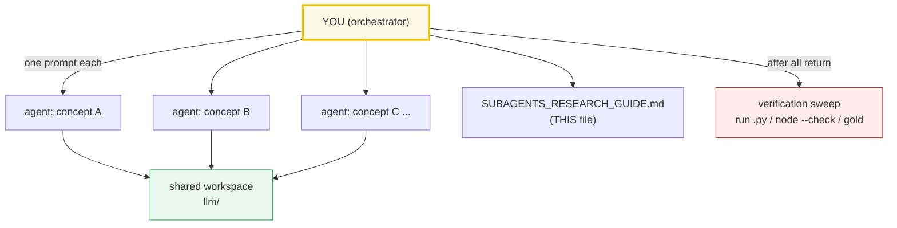

# SUBAGENTS_RESEARCH_GUIDE — Delegating Bundle-Building at Scale

> A note from past-me to future-me: **how to spin up many `llm/` concept
> bundles in parallel using subagents, without losing rigor.**
>
> This sits **above** [`HOW_TO_RESEARCH.md`](./HOW_TO_RESEARCH.md) (which is the
> per-bundle workflow) and [`HOW_TO_ANIMATE.md`](./HOW_TO_ANIMATE.md) (the `.html`
> recipe). Those two define *what* a bundle is and *how* to build one by hand.
> This guide defines *how to delegate* that work to many agents at once.



---

## 0. When to use this mode

Use subagent delegation when you need **≥3 concept bundles** built to a uniform
bar. For 1–2 bundles, just build them by hand (follow `HOW_TO_RESEARCH.md`) —
the overhead of writing tight prompts and running a verification sweep isn't
worth it. The moment you're doing a whole phase (Phase 1, Phase 2…), delegate.

**The trap it prevents:** when you build many things yourself in one session,
context fills up, quality drifts, and the later bundles get sloppy. Subagents
each get a *fresh* context, so bundle #9 is as rigorous as bundle #1.

---

## 1. The mental model: orchestrator + workers

- **You (the orchestrator)** do NOT write bundle code. You: (a) write the worker
  prompt template, (b) launch workers in parallel, (c) run the verification
  sweep, (d) re-spawn any worker that failed verification.
- **Each worker** owns exactly ONE bundle (4 files) and is told to follow
  `HOW_TO_RESEARCH.md` + `HOW_TO_ANIMATE.md` to the letter. It is forbidden from
  touching any other bundle's files.
- **The workspace is shared** (`llm/`), but file ownership is disjoint, so
  parallel writes are safe.

---

## 2. The standard worker prompt (copy this, fill the blanks)

Every worker gets this preamble verbatim, then a per-concept "brief". This is the
single most important artifact in this guide — get it right and the bundles come
back uniform.

```text
You are building ONE "concept bundle" for the ZeroServe learning repo. Work
ENTIRELY inside /Volumes/data/workspace/tutorials/llm/. Do NOT touch any
file that is not part of your assigned bundle.

=== STEP 0: ABSORB THE WORKFLOW (mandatory, do first, in order) ===
1. Read /Volumes/data/workspace/tutorials/llm/HOW_TO_RESEARCH.md IN FULL.
   It is the law: the 4-file bundle = {name}.py (ground truth) +
   {name}_output.txt (captured stdout) + {NAME}.md (guide) + {name}.html (anim).
2. Read /Volumes/data/workspace/tutorials/llm/HOW_TO_ANIMATE.md IN FULL.
3. Study the two canonical model bundles and COPY THEIR STYLE EXACTLY:
   - llm/rope.py + llm/ROPE.md + llm/rope.html
   - llm/absolute_pe.py + llm/ABSOLUTE_PE.md + llm/absolute_pe.html
   Match: the banner/section print structure of the .py; the
   "> From {name}.py Section X:" callouts + mermaid in the .md; the dark palette
   + slider + [check: OK] gold-badge in the .html.

=== STEP 1: MINE THE LOCAL SOURCE ===
Read these learning_guide sections (cited below) and quote real code/formulas:
/Volumes/data/workspace/learning/learning_guide/{00_Foundations.md,
01_Math_Pipe.md, 02_Acceleration.md}. {CITE_EXACT_SECTIONS_HERE}

=== STEP 2: FACT-CHECK VIA WEB SEARCH (mandatory, do NOT skip) ===
For every formula, year, author, and claim: web-search the original paper(s) on
arXiv and ≥1 other authoritative source. Verify the EXACT formula in ≥2 places.
Record every URL in a "## Sources" section at the bottom of {NAME}.md.
NEVER guess a formula or a number. If you cannot verify a fact, search until you
can, or flag it explicitly in your final report. Start your searches at:
{WEB_ANCHORS_HERE}

=== HARD RULES ===
- NEVER hand-compute. The .py prints every number. The .md pastes numbers
  verbatim under "> From {name}.py Section X:" callouts. The .html recomputes
  with the IDENTICAL formula and gold-checks against one known .py value.
- Use torch ONLY. Run scripts with `uv run python {name}.py`. DO NOT modify
  pyproject.toml or uv.lock; DO NOT add any dependency. Implement any algorithm
  (e.g. BPE) from scratch in pure Python — never import third-party libs.
- Deterministic inputs only (hardcoded vectors / seeded torch.Generator).
- Tiny-but-complete dims (E=8 or D=8, L=4) so every number prints while every
  behavior shows.

=== DELIVERABLES (exact paths) ===
- /Volumes/data/workspace/tutorials/llm/{name}.py
- /Volumes/data/workspace/tutorials/llm/{name}_output.txt
   (produce via: uv run python {name}.py > {name}_output.txt 2>/dev/null)
- /Volumes/data/workspace/tutorials/llm/{NAME}.md
- /Volumes/data/workspace/tutorials/llm/{name}.html

{NAME}.md MUST contain: the lineage old→new with WHY each step happened; mermaid
diagrams; "> From {name}.py Section X:" verbatim tables; a worked sample-level
example (B=1, L=4, ...); a pitfalls table; a cheat sheet; 🔗 cross-references to
ROPE.md / ABSOLUTE_PE.md / sibling bundles; and a "## Sources" section (URLs).

{name}.html MUST contain: a single self-contained file (zero deps, inline
<style>+<script>, opens from file://); the HOW_TO_ANIMATE.md dark palette; JS
that recomputes with the identical formula; a [check: OK] badge gold-checked
against a known .py value; header links to the .md and .py; a "compare with…"
link to a sibling where relevant.

=== VERIFICATION (do ALL of these, then report) ===
1. `uv run python {name}.py` runs clean; every `[check] ... OK` passes.
2. {name}_output.txt captured and non-empty.
3. Extract the <script> from {name}.html and `node --check` it (must pass).
4. The .html gold-check value equals the .py value exactly.

=== REPORT BACK (your final message) ===
- The 4 file paths created.
- Gold-check result: OK or FAIL.
- Web sources used (list URLs).
- Any fact you could NOT verify (do not hide uncertainty).

=== YOUR CONCEPT BRIEF ===
Bundle name: {name} / {NAME}
Lineage (old → new): {LINEAGE}
Anchor formulas (verify on web, implement from-scratch AND via torch, assert match):
  {ANCHOR_FORMULAS}
Suggested .py sections: {SECTION_LIST}
Suggested .html panels: {PANEL_LIST}
Suggested mermaid in .md: {MERMAID_IDEAS}
Gold value to anchor the .html check: {GOLD_VALUE_OR_HOW_TO_DERIVE_IT}
```

The `{BLANK}` fields are the only thing that changes between workers. Everything
else is constant — that's what keeps the bundles uniform.

---

## 3. Filling the brief — the per-concept fields

For each concept you delegate, you (orchestrator) fill in:

| Field | What to put |
|---|---|
| `{CITE_EXACT_SECTIONS}` | `00_Foundations.md:167` etc. — real line refs so the worker reads the right code |
| `{WEB_ANCHORS}` | The original papers (arXiv IDs) + a search phrase. e.g. "Ba et al 2016 Layer Normalization arXiv:1607.06450; RMSNorm Zhang & Sennrich 2019 arXiv:1910.07467" |
| `{ANCHOR_FORMULAS}` | The exact math, so the worker knows what to verify. e.g. "RMSNorm: x / sqrt(mean(x^2)+eps) * gamma; LayerNorm: (x-mean)/sqrt(var+eps)*gamma+beta" |
| `{SECTION_LIST}` / `{PANEL_LIST}` | Suggested teachable points (A: formula, B: table, C: worked example, D: contrast old vs new…) |
| `{GOLD_VALUE}` | A concrete number the .html must reproduce. Give it directly if you know it; else tell the worker to compute it in the .py first and pin it. |

**Rule of thumb:** spend 5 minutes on the brief. A lazy brief → a lazy bundle.
The brief is where your judgment as orchestrator actually lives.

---

## 4. Coordination rules (keep the swarm safe)

1. **Disjoint file ownership.** Each worker writes only its 4 files. State the
   exact paths in the prompt and forbid edits elsewhere. This is what makes
   parallel writes safe in the shared `llm/` dir.
2. **No dependency edits.** `pyproject.toml` / `uv.lock` are read-only to
   workers. torch is pre-installed and suffices for everything. If a worker
   "needs" another lib, it must implement from scratch (more educational anyway).
3. **Launch in parallel.** Send all worker `Task` calls in ONE message.
   Independent file ownership = safe concurrency = max throughput.
4. **One concept per worker.** Never let a worker build two bundles — context
   splits and both degrade. If a concept is huge (e.g. FlashAttention), it's
   still one worker; just give it a richer brief.

---

## 5. The verification sweep (do this after ALL workers return)

Workers self-verify, but you independently re-check the whole batch. Run this
sweep; it catches silent failures (a worker that reported OK but shipped a bug):

```bash
cd /Volumes/data/workspace/tutorials/llm
for name in normalization mlp_activation gqa causal_mask tokenization \
            sampling flash_attention quantization kv_cache rope absolute_pe \
            paged_attention block_manager scheduler prefix_cache cuda_graphs \
            peft_lora lmcache nccl_collectives ddp tensor_parallel \
            pipeline_parallel zero gradient_checkpointing moe_routing \
            speculative_decoding disaggregated_serving ktransformers_offload \
            jax_xla_tpu; do
  echo "===== $name ====="
  uv run python $name.py > /tmp/$name.out 2>/tmp/$name.err \
    && echo "  py: ran" || { echo "  py: FAILED"; cat /tmp/$name.err; }
  grep -c "\[check\]" /tmp/$name.out | xargs -I{} echo "  checks printed: {}"
  python3 -c "import re,sys; h=open('$name.html').read(); \
    open('/tmp/$name.js','w').write(re.search(r'<script>(.*)</script>',h,re.S).group(1))" \
    && node --check /tmp/$name.js && echo "  html JS: OK" || echo "  html JS: FAIL"
  test -s "${name}_output.txt" && echo "  output.txt: present" || echo "  output.txt: MISSING"
done
```

Then spot-check: open 2–3 `.html` files in a browser, confirm the `[check: OK]`
badge is green and a couple of on-screen numbers match `_output.txt`.

**Re-spawn failures.** Any bundle that fails the sweep: re-launch ONE worker for
just that bundle, paste its prior output as context, and ask it to fix only the
failing check. Don't rewrite from scratch unless the whole bundle is wrong.

---

## 6. Handling style drift (the "improve existing" worker)

When new bundles raise the bar (e.g. they add a `## Sources` section that older
bundles lack), spawn a **style-consistency worker** to backport. Its brief:

```text
Bring the EXISTING bundles up to the current house style. Edit ONLY:
  llm/rope.py, llm/ROPE.md, llm/rope.html,
  llm/absolute_pe.py, llm/ABSOLUTE_PE.md, llm/absolute_pe.html.
Do NOT change any computed number (they are ground truth). Do NOT touch the
new bundles. Conformance checklist per bundle:
  - .md has a "## Sources" section with arXiv URLs. For `ROPE.md` cite the
    RoFormer paper (arXiv:2104.09864 — this is the RoPE paper). For
    `ABSOLUTE_PE.md` cite the original Transformer paper (arXiv:1706.03762 —
    this defines sinusoidal absolute position encoding).
  - .md cross-references the new sibling bundles where relevant (🔗).
  - .html has the [check: OK] gold badge + links to .md/.py.
  - .py / .html style matches the new bundles (banners, palette).
Verify: re-run uv run python rope.py and absolute_pe.py (must still pass);
node --check the html JS. Report what you changed.
```

Run this worker **in parallel** with the new-bundle workers — it edits disjoint
files (the old bundles), so there's no conflict.

---

## 7. Common failure modes (and the fix)

| Worker symptom | Cause | Fix |
|---|---|---|
| `py: FAILED` / NaN | wrong formula or dtype | re-spawn with the correct `{ANCHOR_FORMULAS}` |
| `[check] FAIL` badge in .html | JS formula drifted from .py | re-spawn worker, tell it to copy the .py formula verbatim into JS |
| `node --check` fails | JS typo (unbalanced brace) | usually a 1-line fix; re-spawn with the error |
| Numbers in .md don't match `_output.txt` | worker hand-typed a table | re-spawn, emphasize "paste verbatim under callouts" |
| No `## Sources` | worker skipped web search | re-spawn, make Step 2 non-optional |
| Worker "improved" another bundle's file | brief was loose | restore from git; tighten the "do NOT touch" clause |

---

## 8. The batch-run checklist (orchestrator's pre-flight)

Before launching a swarm:
- [ ] `pyproject.toml` has torch installed; `uv run python -c "import torch"` works.
- [ ] Each worker's 4 file paths are disjoint from every other worker's.
- [ ] Each brief has `{WEB_ANCHORS}` (real arXiv IDs) and `{ANCHOR_FORMULAS}`.
- [ ] Each brief has a concrete `{GOLD_VALUE}` (or a way to derive it).
- [ ] You have the verification sweep script ready (§5).
- [ ] If raising the style bar, a style-consistency worker is queued (§6).

After the swarm returns:
- [ ] Verification sweep green for all bundles.
- [ ] Spot-checked 2–3 `.html` in a browser.
- [ ] Re-spawned any failures.
- [ ] Updated `HOW_TO_RESEARCH.md` §1 layout if the bundle list changed.

---

## 9. Why this works (and where it breaks)

- **Fresh context per bundle** → bundle #9 is as rigorous as #1. (This is the
  whole point; it's why hand-building many in one session degrades.)
- **Disjoint file ownership** → safe parallel writes; no merge conflicts.
- **The constant preamble** → uniform style without you micromanaging each.
- **The brief is the leverage** → your judgment is concentrated in 5-minute
  briefs, not 50-minute hand-writes.

Where it breaks: if a brief is vague, the worker guesses; if you skip the
verification sweep, silent bugs ship. **The brief + the sweep are
non-negotiable.** Everything else is automation.
