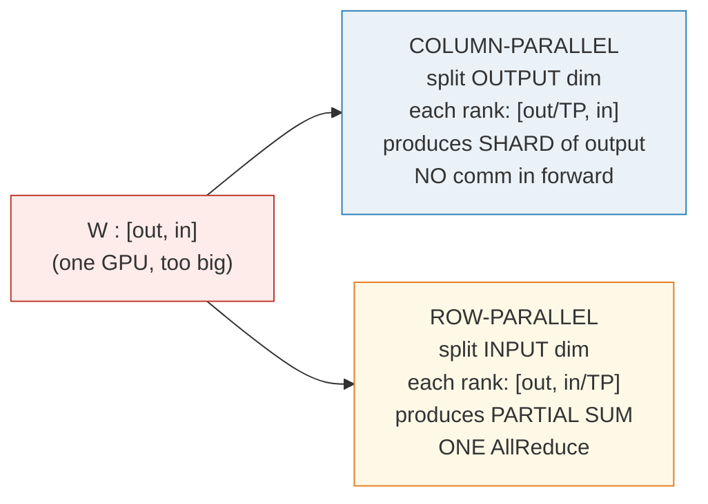
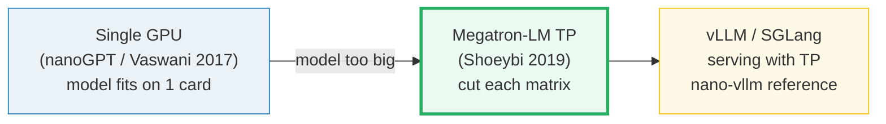
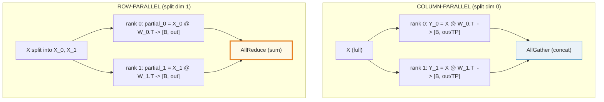
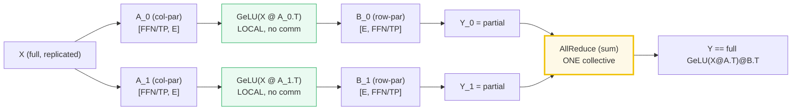
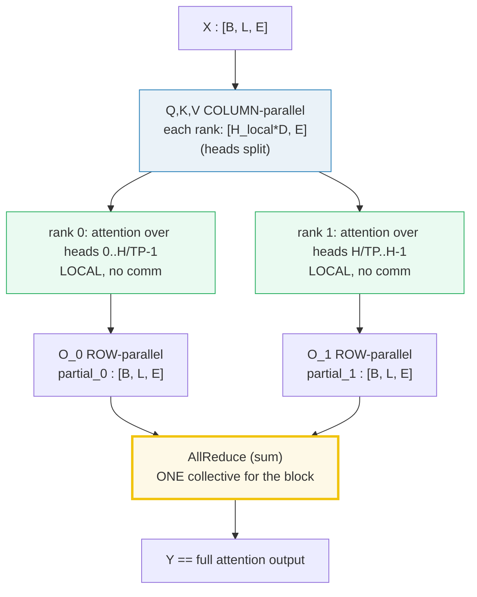
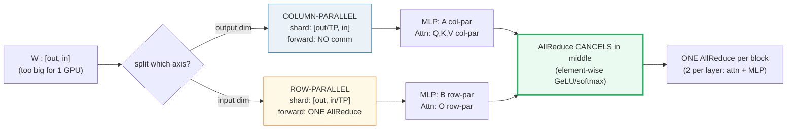

# Tensor Parallelism (TP) — A Visual, Worked-Example Guide

> **Companion code:** [`tensor_parallel.py`](./tensor_parallel.py). **Every number
> in this guide is printed by `uv run python tensor_parallel.py`** — change the
> code, re-run, re-paste. Nothing here is hand-computed.
>
> **Sibling guides:** [`GQA.md`](./GQA.md) (heads split by TP in
> `QKVParallelLinear`), 🔗 [`NCCL_COLLECTIVES.md`](./NCCL_COLLECTIVES.md) (the
> `AllReduce` primitive TP leans on per sub-block), [`DDP.md`](./DDP.md) (the
> data-parallel contrast — it `AllReduce`s gradients once/step, TP once/sub-block).
> 🔗 [`ZERO.md`](./ZERO.md) shards gradient/optimizer state. Cross-references marked 🔗 throughout.
>
> **Live animation:** [`tensor_parallel.html`](./tensor_parallel.html) — open in a browser.
>
> **Source material:** `learning_guide/04_Distributed_Scale.md` §4 and
> `../nano-vllm/nanovllm/layers/linear.py` (the `ColumnParallelLinear` /
> `RowParallelLinear` / `QKVParallelLinear` reference impl this bundle ports).

---

## 0. TL;DR — the whole idea in one picture

### Read this first — the warehouse that doesn't fit on one truck

You don't need any math to get the idea. Picture a giant **pallet of goods**
in a warehouse (= a single weight matrix) and **delivery trucks** (= GPUs):

- One pallet is too big for any one truck.
- **Tensor Parallelism** = cut *each* pallet into **strips** and load one strip
  per truck. Every truck gets a strip of *every* pallet (so all trucks
  cooperate on every layer — this is the key contrast with Pipeline Parallel,
  where each truck owns whole layers).
- The trucks drive together, compute in parallel on the same input, and
  briefly sync up (one `AllReduce`) to stitch their strips into the answer.

The Megatron-LM insight is **which way to cut** the matrix:



The **magic trick** (the centerpiece of this guide, [§3](#3-the-megatron-mlp-trick--section-c-output-the-gold-centerpiece)):
for `Y = GeLU(X @ A) @ B`, make `A` **column-parallel** and `B`
**row-parallel**. The `AllReduce` that *would* sit between `A` and `B` is
**cancelled** by the element-wise `GeLU` — you pay exactly **one** `AllReduce`
for the whole MLP block.

> **One-line definition:** *Tensor Parallelism* = split each weight MATRIX
> across GPUs (column-wise or row-wise) and insert the minimum communication
> (one `AllReduce` per MLP/attention block) so the sharded math is **bit-identical**
> to the unsharded math.

### Glossary (every term used below)

| Term | Plain meaning |
|---|---|
| **weight matrix `W`** | a learned matrix stored PyTorch-style as `[out, in]`; forward is `Y = X @ W.T` (=`F.linear`) |
| **column split** | slice `W` along its OUTPUT axis → `W[r·out/TP:(r+1)·out/TP, :]`; each rank gets `[out/TP, in]` |
| **row split** | slice `W` along its INPUT axis → `W[:, r·in/TP:(r+1)·in/TP]`; each rank gets `[out, in/TP]` |
| **rank (`r`)** | which GPU in the TP group, `r = 0 … TP-1` |
| **shard** | the slice of `W` one rank physically holds |
| **AllReduce** | collective: every rank ends with the SUM of all ranks' tensors. Simulated here as `t0 + t1`. 🔗 `NCCL_COLLECTIVES` |
| **partial sum** | what a row-parallel rank produces *before* `AllReduce` — a piece of the answer, not the answer |
| **GeLU** | element-wise activation between `A` and `B` in a vanilla MLP. Element-wise is WHY the AllReduce cancels. 🔗 `MLP_ACTIVATION` |

### The technical TL;DR



| | **Column-parallel** | **Row-parallel** |
|---|---|---|
| **split axis** | output dim (rows of `[out,in]`) | input dim (cols of `[out,in]`) |
| **per-rank weight** | `[out/TP, in]` | `[out, in/TP]` |
| **per-rank output** | `[B, out/TP]` (a *shard*) | `[B, out]` (a *partial sum*) |
| **forward comm** | NONE (AllGather only if next layer isn't row-par) | ONE `AllReduce(sum)` |
| **nano-vllm class** | `ColumnParallelLinear` | `RowParallelLinear` |
| **used for** | Q, K, V projections; MLP `gate`/`up` | O projection; MLP `down` |

> 🔗 **Why TP exists, in one line:** a single weight matrix in a 70B model is
> ~0.4 GiB (fp16); the whole model won't fit on one GPU. TP shards each matrix
> so `TP=8` makes every matrix 8× smaller per GPU, with **zero** change to the
> math — proven in [§3](#3-the-megatron-mlp-trick--section-c-output-the-gold-centerpiece)
> and [§4](#4-attention-tp--section-d-output) below. The price is one
> `AllReduce` per sub-block, so TP stays **within a node on NVLink** ([§7](#7-bandwidth-rule--section-g-output)).

---

## 1. Why one matrix doesn't fit — Section A output

A Llama-2-70B-style MLP has intermediate dim `FFN = 28672` and model dim
`E = 8192`. **One** weight matrix (`gate_proj`) is `[28672, 8192]` floats.

> From `tensor_parallel.py` **Section A** — one `[28672, 8192]` matrix, fp16:
>
> ```
> gate_proj: [28672, 8192]  = 234,881,024 elements
>            = 0.44 GiB (fp16)   0.88 GiB (fp32)
> ```
>
> Per-rank memory after sharding one `[28672, 8192]` matrix (fp16):
>
> | TP | shard shape | elements | bytes/rank (fp16) | savings |
> |---|---|---|---|---|
> | 1 | `[28672, 8192]` | 234,881,024 | 0.438 GiB | baseline |
> | 2 | `[14336, 8192]` | 117,440,512 | 0.219 GiB | 2× smaller |
> | 4 | `[7168, 8192]`  | 58,720,256  | 0.109 GiB | 4× smaller |
> | 8 | `[3584, 8192]`  | 29,360,128  | 0.055 GiB | 8× smaller |

The MLP block alone has **3** such matrices (`gate`, `up`, `down`) ≈ 1.3 GiB per
layer in fp16. With 80 layers + embeddings, the model blows past any single
GPU's memory. TP's surgical fix: divide every matrix by `TP`. 🔗 The deeper
serving/inference story (PagedAttention, BlockManager, Scheduler) lives in
`PAGED_ATTENTION.md` / `BLOCK_MANAGER.md` / `SCHEDULER.md`.

---

## 2. Column vs row parallel — Section B output

The two ways to slice `W` give **different per-rank outputs** and **different
communication costs**. Worked on a tiny `W[8,8]`, `X[1,8]`, `TP=2`:

> From `tensor_parallel.py` **Section B** — full reference `Y = X @ W.T`:
>
> ```
> Full (non-TP) forward:  Y = X @ W.T   -> (1, 8)
>   Y[0] = [-0.8029, +0.4008, -1.2338, +0.4680, -0.0224, -0.8494, +0.7460, +0.3059]
> ```

**Column-parallel** (split OUTPUT dim → each rank gets `[out/TP, in]`):

> ```
> rank 0: W_r (4, 8) = W[0*4:1*4, :]    Y_r = [-0.8029, +0.4008, -1.2338, +0.4680]
> rank 1: W_r (4, 8) = W[1*4:2*4, :]    Y_r = [-0.0224, -0.8494, +0.7460, +0.3059]
>
> AllGather (concat along last dim) = [-0.8029, +0.4008, -1.2338, +0.4680,
>                                      -0.0224, -0.8494, +0.7460, +0.3059]
> [check] AllGather(Y_0, Y_1) == full Y?  True   (NO comm in forward)
> ```

**Row-parallel** (split INPUT dim → each rank gets `[out, in/TP]`):

> ```
> rank 0: W_r (8, 4) = W[:, 0*4:1*4]    partial_0 = [-0.6191, +0.5776, ...]
> rank 1: W_r (8, 4) = W[:, 1*4:2*4]    partial_1 = [-0.1837, -0.1768, ...]
>
> AllReduce(sum) = partial_0 + partial_1
>               = [-0.8029, +0.4008, -1.2338, +0.4680, -0.0224, -0.8494, +0.7460, +0.3059]
> [check] AllReduce(partials) == full Y?  True   (ONE AllReduce per layer)
> ```



> **The comm cost table (forward only):**
>
> | style | split dim | per-rank output | comm in forward |
> |---|---|---|---|
> | column-parallel | output (0) | `[B, out/TP]` | NONE (or AllGather) |
> | row-parallel | input (1) | `[B, out]` partial | ONE AllReduce |

The deep distinction: **column-parallel produces a *shard* of the output**
(cheap but "incomplete"); **row-parallel produces a *full-size but wrong*
answer** (a partial sum) that must be `AllReduce`d before anyone reads it.

---

## 3. The Megatron MLP trick — Section C output (the GOLD centerpiece)

> ⚠️ **This is the whole reason Megatron-LM exists.** For `Y = GeLU(X @ A) @ B`,
> if `A` is column-parallel and `B` is row-parallel, the `AllReduce` that would
> sit *between* `A` and `B` **cancels**. You pay exactly **ONE** `AllReduce`
> for the entire MLP block.

Worked on the tiny gold model: `TP=2`, `X[1, 8]`, `A[FFN=4, E=8]`,
`B[E=8, FFN=4]` (seeded, so the `.html` reproduces byte-for-byte).

> From `tensor_parallel.py` **Section C** — the cancellation proof:
>
> ```
> Vanilla MLP (non-TP):   Y = GeLU(X @ A.T) @ B.T
>
> Megatron TP=2:    A COLUMN-parallel + B ROW-parallel
>   GPU 0:  Z_0 = GeLU(X @ A_0.T)   # [1, FFN/TP]   LOCAL
>           Y_0 = Z_0 @ B_0.T       # [1, E]        PARTIAL
>   GPU 1:  Z_1 = GeLU(X @ A_1.T)   # [1, FFN/TP]   LOCAL
>           Y_1 = Z_1 @ B_1.T       # [1, E]        PARTIAL
>   AllReduce:  Y = Y_0 + Y_1       # ONE collective for the WHOLE block
> ```
>
> | | d0 | d1 | d2 | d3 | d4 | d5 | d6 | d7 |
> |---|---|---|---|---|---|---|---|---|
> | **Y_0 (rank 0 partial)** | +0.0182 | +0.0190 | +0.0269 | −0.0209 | +0.0697 | +0.0000 | −0.0059 | −0.0326 |
> | **Y_1 (rank 1 partial)** | −0.1966 | +0.0195 | −0.0286 | −0.0892 | +0.1581 | +0.1559 | +0.6273 | +0.3876 |
> | **Y_0 + Y_1 (AllReduce)** | **−0.1784** | **+0.0385** | **−0.0017** | **−0.1101** | **+0.2278** | **+0.1560** | **+0.6214** | **+0.3550** |
> | **full `GeLU(X@A.T)@B.T`** | −0.1784 | +0.0385 | −0.0017 | −0.1101 | +0.2278 | +0.1560 | +0.6214 | +0.3550 |
>
> ```
> max|TP_Y - full_Y| = 7.451e-09
> [check] AllReduce(Y_0 + Y_1) == full GeLU(X@A.T)@B.T?  True
> ```

**Why it works** (one paragraph — block matmul + element-wise `GeLU`):

```
Split A.T vertically:   A.T = [ A_0.T | A_1.T ]
  =>  X @ A.T = [ X @ A_0.T  |  X @ A_1.T ]      (block matmul, no arithmetic)

GeLU is ELEMENT-WISE, so it applies block-by-block:
  GeLU(X @ A.T) = [ GeLU(X @ A_0.T) | GeLU(X @ A_1.T) ]

Split B.T horizontally:  B.T = [ B_0.T ; B_1.T ]
  =>  Y = GeLU(X @ A.T) @ B.T
       = GeLU(X @ A_0.T) @ B_0.T   +   GeLU(X @ A_1.T) @ B_1.T
       =       Y_0                  +          Y_1
```

The would-be `AllReduce` between `A` and `B` (needed to materialize the full
`GeLU(X @ A.T)` on any one GPU) is cancelled because `B` is row-parallel and
`GeLU` is element-wise. **This is exactly one `AllReduce` per MLP block.**



### The GOLD value (pinned for `tensor_parallel.html`)

> From `tensor_parallel.py` **Section C**:
>
> ```
> Y_full[0]              = [-0.1784, +0.0385, -0.0017, -0.1101,
>                           +0.2278, +0.1560, +0.6214, +0.3550]
> Y_full[0, 0] (scalar)  = -0.178412
> ```
>
> [`tensor_parallel.html`](./tensor_parallel.html) recomputes the full tiny MLP
> in JS (same seeds, identical formula) and checks against `Y[0, 0] = -0.178412`.

---

## 4. Attention TP — Section D output

The Megatron trick applies to attention too: **Q,K,V projections are
column-parallel** (so each rank owns `H/TP` heads and computes attention
*locally* on its heads — heads don't talk to each other), and the **O
projection is row-parallel** (so each rank emits a partial sum that the final
`AllReduce` combines). Result: **exactly one `AllReduce` for the whole
attention block**, just like MLP.

Worked on `TP=2`, `B=1, L=2, E=8, H=4, D=2` (so `H*D = 8 = E`, 2 heads/rank):

> From `tensor_parallel.py` **Section D** — TP attention `==` full attention:
>
> | | d0 | d1 | d2 | d3 | d4 | d5 | d6 | d7 |
> |---|---|---|---|---|---|---|---|---|
> | **partial_0 (heads 0–1)** | −0.0145 | +0.0037 | −0.0027 | +0.0151 | −0.0560 | −0.0303 | −0.0067 | +0.0473 |
> | **partial_1 (heads 2–3)** | +0.0331 | −0.0409 | −0.0332 | −0.0935 | −0.0171 | −0.0494 | −0.0396 | −0.0144 |
> | **AllReduce (m=0)** | +0.0187 | −0.0372 | −0.0359 | −0.0783 | −0.0731 | −0.0797 | −0.0462 | +0.0329 |
> | **full attention (m=0)** | +0.0187 | −0.0372 | −0.0359 | −0.0783 | −0.0731 | −0.0797 | −0.0462 | +0.0329 |
>
> ```
> max|TP_Y - full_Y| = 1.490e-08
> [check] AllReduce == full attention output?  True
> ```



> 🔗 With **GQA** (`H_kv < H_q`), the K,V column-shards are *smaller* than the Q
> column-shard on every rank — see [§5](#5-qkvparallellinear-for-gqa--section-e-output).
> RoPE ([`ROPE.md`](./ROPE.md)) is applied per-head *after* the column-parallel
> projection, so it works identically on each rank's local heads.

---

## 5. QKVParallelLinear for GQA — Section E output

nano-vllm / vLLM pack the three projections `Q, K, V` into **one**
`ColumnParallelLinear` so they share a single matmul + weight-loader. With
GQA, `K` and `V` have *fewer* heads than `Q`, so the packed width is
`(H_q + 2·H_kv) · D`, and TP shards the Q heads and the (smaller) KV heads
*independently*.

> From `tensor_parallel.py` **Section E** — `H_q=4, H_kv=2, D=2, TP=2` (🔗 `GQA.md`):
>
> ```
> Packed QKV weight: [(H_q + 2*H_kv)*D, E] = [16, 8]
>
> Layout (dim 0):
>   [ Q heads 0..3 (8 rows) | K heads 0..1 (4 rows) | V heads 0..1 (4 rows) ]
>
> After TP=2 sharding, EACH rank takes 2 Q-heads + 1 K-head + 1 V-head:
> ```
>
> | rank | Q heads | K heads | V heads | shard rows = (H_q/TP + 2·H_kv/TP)·D |
> |---|---|---|---|---|
> | 0 | 0..1 | 0..0 | 0..0 | 8 |
> | 1 | 2..3 | 1..1 | 1..1 | 8 |
>
> ```
> weight_loader (per rank, builds the packed shard):
>   rank 0: Q[0:4] K[0:2] V[0:2]  -> packed (8, 8)
>   rank 1: Q[4:8] K[2:4] V[2:4]  -> packed (8, 8)
> ```

**Constraints** (or `QKVParallelLinear.__init__` asserts via `divide()`):
`H_q % TP == 0` **and** `H_kv % TP == 0`. This is why production GQA configs
choose `H_kv` divisible by the maximum intended TP. 🔗 See `GQA.md` for the
broadcast trick that makes `n_repeats = H_q // H_kv` heads share one KV head.

---

## 6. Per-layer AllReduce accounting — Section F output

Counting `AllReduce`s in one transformer layer under Megatron TP:

> From `tensor_parallel.py` **Section F**:
>
> | sub-block | parallel pattern | AllReduces |
> |---|---|---|
> | attention | QKV col-parallel, O row-par | 1 |
> | MLP | A col-parallel, B row-par | 1 |
> | **TOTAL per layer** | | **2** |
>
> Per-rank traffic for a ring-AllReduce of `N = B·L·E` elements,
> `TP` ranks (🔗 `NCCL_COLLECTIVES.md`):
> ```
> per-rank traffic = 2 * (TP-1)/TP * N * bytes_per_element
> ```
>
> Worked (fp16, `E=8192`):
>
> | B, L | TP=2 | TP=4 | TP=8 |
> |---|---|---|---|
> | 1, 1      | 0.00 GiB | 0.00 GiB | 0.00 GiB |
> | 1, 4096   | 0.06 GiB | 0.09 GiB | 0.11 GiB |
> | 32, 4096  | 2.00 GiB | 3.00 GiB | 3.50 GiB |

> 🔗 Contrast with **DDP** ([`DDP.md`](./DDP.md)): DDP `AllReduce`s
> the *gradients* once per **optimizer step** (amortized over many
> micro-batches). TP `AllReduce`s activations once per **forward sub-block**
> — orders of magnitude more frequent, hence the bandwidth rule below.

---

## 7. Bandwidth rule — Section G output

TP's comm frequency (twice per layer, every forward) dictates **where it can
run**: only on links fast enough that the `AllReduce` doesn't dominate.

> From `tensor_parallel.py` **Section G**:
>
> | link | typical bandwidth | use case |
> |---|---|---|
> | NVLink (intra-node) | ~300 GB/s (bi-dir) | **TENSOR PARALLEL (here)** |
> | NVSwitch (8× H100) | ~900 GB/s agg. | large TP within a node |
> | PCIe Gen5 ×16 | ~64 GB/s | small TP, or CPU fallback |
> | InfiniBand (inter) | ~25–50 GB/s | DP / Pipeline (🔗 DDP/PP) |
> | Ethernet (RoCE) | ~12–25 GB/s | DP across racks |
>
> For one decode step (`B=1, L=4096, E=8192`, fp16), ONE `AllReduce` of the
> block output takes:
> ```
> over NVLink (300 GB/s):   223.7 us
> over IB     ( 25 GB/s):  2684.4 us   (12× slower)
> ```

**Rule of thumb:** keep `TP_size ≤ GPUs_per_node`. Going beyond a single node
explodes the `AllReduce` cost (inter-node bandwidth is ~10× slower). For
multi-node training, combine TP (intra-node) with DP or Pipeline Parallelism
(inter-node) — the **3D parallelism** recipe:

```
TP (within node, NVLink)  ×  DP (across nodes, IB)  ×  PP (across)
```

🔗 The `AllReduce` itself, ring topology, and `ReduceScatter + AllGather`
decomposition live in [`NCCL_COLLECTIVES.md`](./NCCL_COLLECTIVES.md). 🔗 [`ZERO.md`](./ZERO.md)
partitions the gradient/optimizer state (a *different* axis of
memory savings, often combined with TP). 🔗 [`PIPELINE_PARALLEL.md`](./PIPELINE_PARALLEL.md) is
the layer-wise split that pairs with TP across nodes.

---

## 8. The faithful single-process simulation

`tensor_parallel.py` does **not** spawn `torch.distributed` workers. Instead
it holds the `TP=2` shards as two ordinary tensors in one process and
implements `AllReduce` as an explicit element-wise sum (`t0 + t1`).


Why this is faithful:
- Every **shape** matches `nano-vllm/layers/linear.py` exactly.
- Every **shard index** (`W[r·out/TP:(r+1)·out/TP, :]` etc.) matches the real
  `weight_loader`.
- The `AllReduce` op is sum, which is **associative and commutative** — so
  `t0 + t1` in one process produces byte-identical results to NCCL's
  ring-`all_reduce(op=SUM)`. 🔗 See `NCCL_COLLECTIVES.md` for the ring math.
- The only thing skipped is the *communication latency itself* (modeled
  separately in [§7](#7-bandwidth-rule--section-g-output)).

---

## 9. Pitfalls & debugging checklist

| # | Mistake | Symptom | Fix |
|---|---|---|---|
| 1 | Putting the `AllReduce` between `A` and `B` in the MLP | 2× the comm cost, no correctness gain | Make `A` column-par, `B` row-par → `AllReduce` only at block end ([§3](#3-the-megatron-mlp-trick--section-c-output-the-gold-centerpiece)) |
| 2 | Using column-par for both `A` and `B` | Output is sharded across ranks, not summed; needs an extra `AllGather` | Use column-then-row (Megatron pattern) |
| 3 | `RowParallel` with bias added on **every** rank | Bias is summed `TP`× → `TP × bias` | Add bias only on `rank 0` (nano-vllm does `bias if tp_rank==0`) |
| 4 | Splitting heads when `H_q % TP != 0` | Crash / `divide()` assert | Pick `H_q` divisible by max intended TP |
| 5 | Same for `H_kv` under GQA | Crash in `QKVParallelLinear` | Pick `H_kv` divisible by max TP (🔗 GQA) |
| 6 | TP across nodes (over IB) | Comm dominates; 10×+ slowdown | Keep `TP ≤ GPUs_per_node` ([§7](#7-bandwidth-rule--section-g-output)) |
| 7 | Forgetting that TP also needs `AllReduce` in **backward** (for col-par weights) | Backward produces wrong grads | Backward of col-par = row-par of grads; same pattern |
| 8 | Treating `partial` as the answer (forgetting `AllReduce`) | Garbage output, no error | Row-par output is a *partial sum* — always `AllReduce` |

---

## 10. Cheat sheet



- **Lineage:** Single-GPU → **Megatron-LM TP** (Shoeybi 2019) → vLLM/SGLang serving.
- **Column-parallel:** split OUTPUT dim, shard `[out/TP, in]`, no forward comm.
- **Row-parallel:** split INPUT dim, shard `[out, in/TP]`, one `AllReduce(sum)`.
- **The trick:** `A` col-par + `B` row-par → `AllReduce` between them **cancels**
  (element-wise activation); exactly ONE `AllReduce` per MLP/attention block.
- **Per layer:** 2 `AllReduce`s (1 attention + 1 MLP), each over `[B, L, E]`.
- **Equivalence:** TP forward == non-TP forward, to `1e-8` (proven in §3, §4).
- **QKV packing:** `QKVParallelLinear` = one col-par matrix of width
  `(H_q + 2·H_kv)·D`; needs `H_q % TP == 0` and `H_kv % TP == 0` (🔗 GQA).
- **Bandwidth rule:** keep `TP ≤ GPUs/node`; TP lives on NVLink (~300 GB/s),
  DP/PP go cross-node on IB (~25 GB/s).
- **3D parallelism:** `TP (intra-node) × DP (inter-node) × PP (inter-node)`.

> 🔗 **TP vs the siblings:** [`DDP.md`](./DDP.md) (and 🔗 [`ZERO.md`](./ZERO.md))
> replicate the *whole model* on every GPU and split the *data*; TP splits the
> *model* and replicates the *data*. 🔗 [`PIPELINE_PARALLEL.md`](./PIPELINE_PARALLEL.md) splits the
> model *by layer* (vertical); TP splits *by matrix axis* (horizontal). They
> compose: TP within a node, DP/PP across.

---

## Sources

- **Megatron-LM** — Shoeybi, Patwary, Puri, LeGresley, Casper, Catanzaro.
  *Megatron-LM: Training Multi-Billion Parameter Language Models Using Model
  Parallelism.* 2019 (revised 2020). arXiv:1909.08053.
  https://arxiv.org/abs/1909.08053
  - Verified claims (from the abstract + paper): "a simple, efficient
    **in-layer** [intra-layer] model parallel approach"; "can be fully
    implemented with the insertion of a few communication operations in
    native PyTorch"; "orthogonal and complimentary to pipeline model
    parallelism". The column/row split + the `GeLU`-cancellation trick
    (this bundle's §3) is the paper's core contribution (§3 of the paper).
- **vLLM** — Kwon et al. *Efficient Memory Management for Large Language
  Model Serving with PagedAttention.* SOSP 2023. arXiv:2309.06180.
  https://arxiv.org/abs/2309.06180
  - Productionizes Megatron-style TP for serving; ships
    `ColumnParallelLinear`, `RowParallelLinear`, `QKVParallelLinear`.
- **nano-vllm reference implementation** (the code this bundle ports to
  single-process): `../nano-vllm/nanovllm/layers/linear.py` —
  `ColumnParallelLinear` (lines 54–73), `RowParallelLinear` (131–156),
  `QKVParallelLinear` (96–128). The `bias if self.tp_rank == 0 else None`
  and `dist.all_reduce(y)` calls are reproduced verbatim in
  `tensor_parallel.py:row_parallel_forward`.
- **Local source material** (the lineage narrative + the worked dims):
  `learning_guide/04_Distributed_Scale.md` §4 (§4.1 matrix-split idea,
  §4.2 MLP `AllReduce`-cancels trick, §4.3 attention TP, §4.4 nano-vllm
  annotated classes).
- **GQA cross-reference** (the head-asymmetry that makes
  `QKVParallelLinear` asymmetric): [`GQA.md`](./GQA.md); the original
  paper is Ainslie et al. 2023, arXiv:2305.13245.
- **GeLU** (the element-wise activation whose property makes the trick work):
  [`MLP_ACTIVATION.md`](./MLP_ACTIVATION.md); Hendrycks & Gimpel 2016,
  arXiv:1606.08415.
- **Forward siblings (🔗):** [`NCCL_COLLECTIVES.md`](./NCCL_COLLECTIVES.md) (the
  `AllReduce` primitive + ring math), [`DDP.md`](./DDP.md) (data-parallel
  contrast — gradient `AllReduce` per optimizer step vs TP's per-sub-block),
  🔗 [`ZERO.md`](./ZERO.md) (partition gradient/optimizer state, composes with TP),
  🔗 [`PIPELINE_PARALLEL.md`](./PIPELINE_PARALLEL.md) (layer-wise split, composes with TP across
  nodes). The not-yet-built ones are tracked as future bundles in
  [`NEXT.md`](./NEXT.md).
