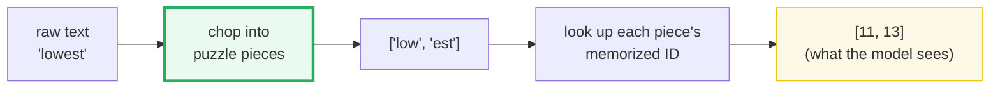
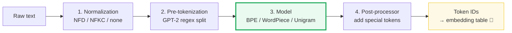
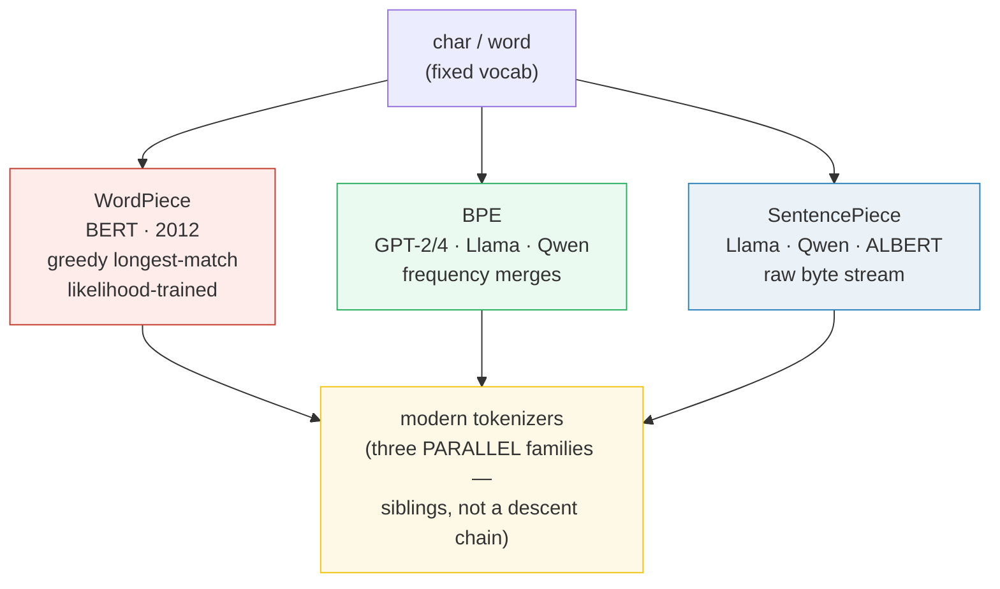
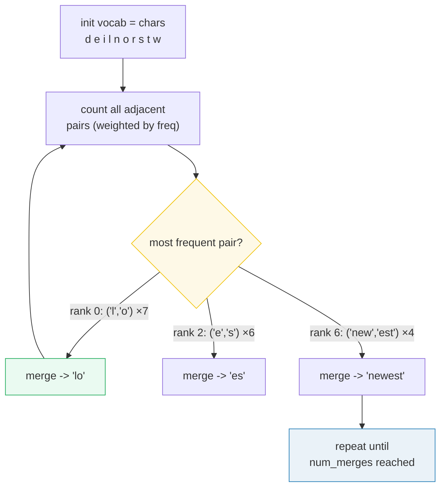
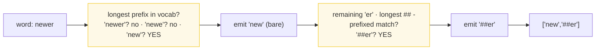
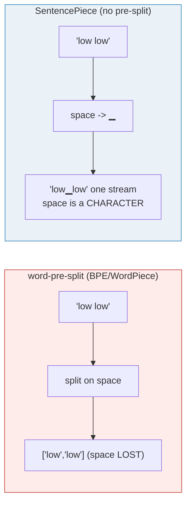
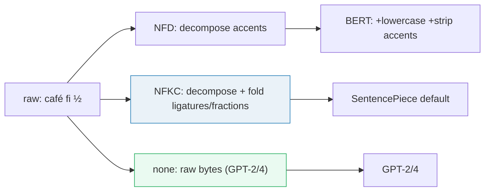
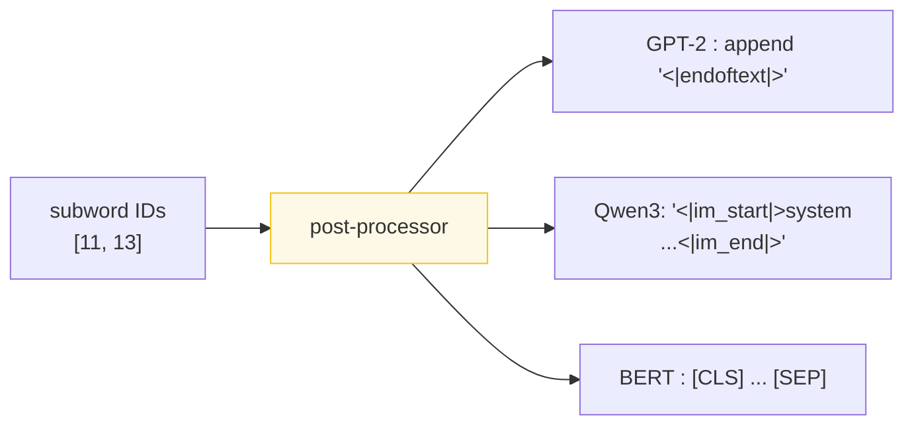
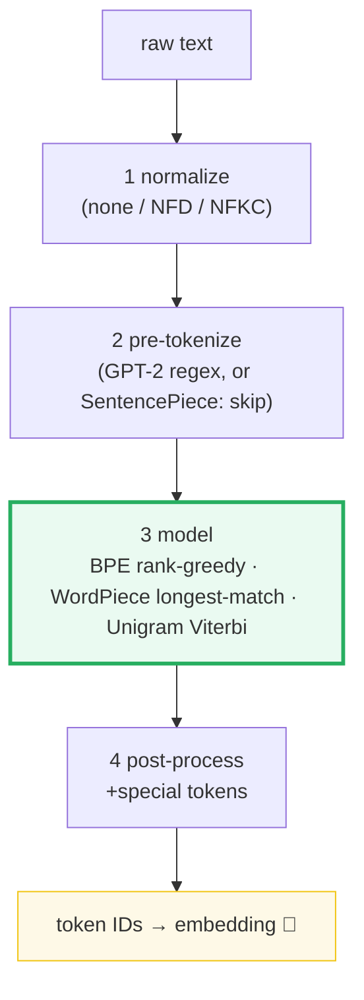

# Tokenization Pipelines — A Beginner's, Worked-Example Guide (BPE · WordPiece · SentencePiece)

> **One-sentence intuition:** tokenization chops raw text into reusable **puzzle
> pieces** (tokens) that the model has memorized integer **IDs** for. The model
> never sees letters or words — only integer IDs. Every number below comes from
> actually running the code, not hand-waving.
>
> **Companion code:** [`tokenization.py`](./tokenization.py). **Every number in
> this guide is printed by `uv run python tokenization.py`** — pure Python, no
> torch, no third-party tokenizer libs. BPE / WordPiece / SentencePiece are all
> built from scratch so every merge step is printable. Change the code, re-run,
> re-paste. Nothing here is hand-computed.
>
> **Live animation:** [`tokenization.html`](./tokenization.html) — train BPE in
> the browser, watch merges apply, and toggle BPE vs WordPiece vs SentencePiece
> on the same string. JS recomputes with the *identical* algorithm and is
> gold-checked against this `.py`.
>
> **Sibling guides:** tokenization is the step **before** position embeddings —
> it turns raw text into the integer IDs that [`ROPE.md`](./ROPE.md) and
> [`ABSOLUTE_PE.md`](./ABSOLUTE_PE.md) then embed. Cross-references marked 🔗.
>
> **Source material:** `learning_guide/00_Foundations.md` §12 (Tokenizer
> Pipelines) and `learning_guide/01_Math_Pipe.md` §4 (Tokenization Deep Dive).

---

## 0. Read this first — intuition, glossary, and the one-picture TL;DR

### 0.1 Intuition: text is chopped into reusable puzzle pieces

A Transformer cannot read strings — it reads **integer token IDs**, each pointing
at a row of an embedding table. Tokenization is the deterministic **assembly
line** that turns raw text into those IDs.

Think of it as chopping text into **reusable puzzle pieces**. The model has
memorized one integer ID for every piece it knows. Short, common pieces (`low`,
`est`, `ing`, `▁the`) are reused across thousands of words, so a modest
vocabulary covers a whole language. Rare or unseen words are simply assembled
from smaller pieces — `lowest` = `low` + `est`.



The pieces are called **tokens**; the fixed list of all pieces the model knows is
the **vocabulary**; each piece's position in that list is its **token ID**. The
 chopping happens in **4 stages** (§1), and there are **3 families** of chopping
rules (BPE / WordPiece / SentencePiece) — the heart of this guide.

### 0.2 Glossary (terms used throughout)

| Term | Plain meaning |
|---|---|
| **character** | A single Unicode letter/symbol: `l`, `o`, `é`, `你`. |
| **byte** | An 8-bit value 0–255. One UTF-8 char = 1–4 bytes. GPT-2 works on **bytes** so it can never meet a char it can't handle. |
| **token** | One "puzzle piece" the model knows: a char (`e`), a subword (`low`, `##er`, `▁the`), or a whole word. |
| **vocabulary (vocab)** | The fixed, ordered list of every token the model knows (size 22 in this demo; ~50k–150k in real LLMs). |
| **token ID** | The integer **index** of a token in the vocab — the only thing the model actually consumes. `low` = ID `11` here. |
| **merge** | One learned "glue rule" from BPE training: *replace adjacent pair `(a,b)` with the new token `ab`*. Each merge has a **rank** (the order it was learned). |
| **pre-tokenization regex** | The pattern that chops text into rough chunks (word / number / punct) *before* the subword model runs. GPT-2's is in §1. SentencePiece skips this. |
| **normalization (NFD / NFKC)** | Stage-1 text tidy-up: *split / fold accented & combined letters before chopping* (e.g. `é`→`e`+accent; `fi`→`fi`). GPT-2 does none. |
| **special token** | A marker the model treats as one atomic unit: `<|endoftext|>`, `[CLS]`, `<|im_start|>`. Added by the post-processor. |
| **▁ (U+2581)** | SentencePiece's **space marker**. Spaces are kept and written as `▁`, not thrown away — this is why it works on space-less languages like Chinese. |

### 0.3 TL;DR — one assembly line, three subword families

The chopping happens on a fixed **4-stage assembly line** — tidy text → chop
roughly → apply glue-rules → add special markers → IDs:



The three subword **model** families (Stage 3) are the heart of this guide:



| | **WordPiece** | **BPE** | **SentencePiece** 🔗 |
|---|---|---|---|
| **Train criterion** | max likelihood of data | most frequent adjacent pair | BPE **or** Unigram LM |
| **Encode rule** | greedy **longest-match** | apply merges by learned **rank** | apply merges / Viterbi |
| **Unit trained on** | words (pre-split) | words or **bytes** | **raw stream** (no pre-split) |
| **Space handling** | stripped (lost) | `Ġ` via byte map (GPT-2) | escaped to `▁` U+2581 |
| **UNK possible?** | **Yes** (`[UNK]`) | byte-level: **never** | byte fallback: **never** |
| **CJK-friendly?** | poor (no word spaces) | needs pre-tok | **yes** (no pre-split) |
| **Used by** | BERT | GPT-2, GPT-4, Llama, Qwen | Llama, Qwen, T5, ALBERT |

> 🔗 **The one cross-reference to remember:** tokenization produces the IDs that
> position embeddings *consume*. [`ABSOLUTE_PE.md`](./ABSOLUTE_PE.md) adds a
> position vector to each token; [`ROPE.md`](./ROPE.md) rotates each token's Q/K.
> Both happen **after** tokenization — garbage IDs in → garbage out, no matter
> how good the position encoding is.

---

## 1. The 4-stage pipeline — Section A output

**The assembly line, in one plain sentence per stage:**

1. **Normalize** — *tidy the text* (fold accents, lowercase…). GPT-2 does nothing.
2. **Pre-tokenize** — *chop roughly* with a regex into words / numbers / punctuation.
3. **Model** — *apply the glue-rules* (BPE / WordPiece) to fuse characters into subword pieces.
4. **Post-process** — *add special markers* (`<|endoftext|>`, `[CLS]`) → emit integer IDs.

Stages, on a sample sentence (GPT-2 style: **no** normalization, raw bytes):

```
Raw text    : "Hello, world! It's 2024."
1 Normalize : identity (GPT-2/GPT-4 touch nothing; BERT does NFD+lowercase;
              SentencePiece default NFKC — see §6)
2 Pre-tok   : ['Hello', ',', ' world', '!', ' It', "'s", ' 2024', '.']
3 Model     : each pre-token byte-encoded, then merged by learned BPE rank
4 Post-proc : + ['<|endoftext|>']  →  integer IDs  →  embedding lookup 🔗
```

> From `tokenization.py` **Section A** — pre-tokens of `"Hello, world! It's 2024."`:
>
> `['Hello', ',', ' world', '!', ' It', "'s", ' 2024', '.']`

The **GPT-2 pre-tokenization regex** (verbatim from `openai/gpt-2` `src/encoder.py`):

```python
r"""'s|'t|'re|'ve|'m|'ll|'d| ?\p{L}+| ?\p{N}+| ?[^\s\p{L}\p{N}]+|\s+(?!\S)|\s+"""
```

Reading the alternation left-to-right:
- `'s|'t|'re|'ve|'m|'ll|'d` — English contractions stay glued to the apostrophe.
- ` ?\p{L}+` — a run of letters, **optionally preceded by one space** (so ` the`
  becomes a single pre-token — that leading space becomes GPT-2's `Ġ` byte).
- ` ?\p{N}+` — a run of digits (optional leading space).
- ` ?[^\s\p{L}\p{N}]+` — a run of punctuation.
- `\s+(?!\S)` / `\s+` — trailing / internal whitespace runs.

> ⚠️ Python's stdlib `re` **cannot** compile `\p{L}` / `\p{N}` — that is exactly
> why GPT-2 depends on the `regex` module (and why `tokenization.py` ships an
> ASCII approximation `GPT2_PRETOK_ASCII` for the demo).

**Why pre-tokenize at all?** BPE merges are learned **per word**; without
pre-splitting, frequent cross-word pairs (e.g. `e␣t` from "the time") would waste
merge slots. The regex enforces *semantic* boundaries first. SentencePiece is the
one family that **deliberately skips this** (§5) — that is its defining trick.

---

## 2. BPE TRAINING — Section B output (every merge step)

**BPE in one analogy:** start with single letters. Repeatedly **glue the two
most-common neighboring pieces** into a new, bigger piece. Do this thousands of
times. `lowest` later becomes `low`+`est` precisely *because* we glued those
pairs so often during training that they earned their own IDs.

We train char-level BPE on a tiny **fixed gold corpus** (deterministic; pinned in
[`tokenization.html`](./tokenization.html) too):

```
"low low low low low"
"lower lower newest newest newest"
"newest widest widest"
```

Pre-token frequencies: `low:5, lower:2, newest:4, widest:2`. Initial vocabulary =
the 10 sorted unique characters: `[d,e,i,l,n,o,r,s,t,w]`.

> From `tokenization.py` **Section B** — the learned merge sequence:
>
> | rank | pair | → new token | count |
> |---|---|---|---|
> | 0 | `('l','o')` | `lo` | 7 |
> | 1 | `('lo','w')` | `low` | 7 |
> | 2 | `('e','s')` | `es` | 6 |
> | 3 | `('es','t')` | `est` | 6 |
> | 4 | `('n','e')` | `ne` | 4 |
> | 5 | `('ne','w')` | `new` | 4 |
> | 6 | `('new','est')` | `newest` | 4 |
> | 7 | `('low','e')` | `lowe` | 2 |
> | 8 | `('lowe','r')` | `lower` | 2 |
> | 9 | `('w','i')` | `wi` | 2 |
> | 10 | `('wi','d')` | `wid` | 2 |
> | 11 | `('wid','est')` | `widest` | 2 |
>
> Final vocabulary (base chars ++ merges): `[d,e,i,l,n,o,r,s,t,w, lo,low,es,est,
> ne,new,newest,lowe,lower,wi,wid,widest]` — **size 22**.

**Merge-by-merge narration** (read this alongside the table above — every count
is the weighted number of times the pair sat side-by-side in the corpus):

- **Round 0:** `('l','o')` sat together **7×** (5 in `low` + 2 in `lower`) — the
  most common pair — → glue to `lo`. Vocab grows to 11.
- **Round 1:** `('lo','w')` now sits together **7×** → glue to `low`. Vocab 12.
- **Round 2:** `('e','s')` sits together **6×** (4 in `newest` + 2 in `widest`)
  → glue to `es`. Vocab 13.
- **Round 3:** `('es','t')` **6×** → `est`. Vocab 14. *(Now `newest` can be built
  once `new` exists.)*
- **Rounds 4–6:** the `n,e,w` + `est` chain fires for `newest`: `ne`(4)→`new`(4)→
  `newest`(4). Vocab 15→16→17.
- **Rounds 7–8:** the `low` + `e` + `r` chain fires for `lower`: `lowe`(2)→
  `lower`(2). Vocab 18→19.
- **Rounds 9–11:** the `w,i,d` + `est` chain fires for `widest`: `wi`(2)→`wid`(2)
  →`widest`(2). Vocab 20→21→**22**.

After **12 rounds** the vocabulary is **22 pieces**. Every training word
(`low`, `lower`, `newest`, `widest`) is now a single learned token, and unseen
relatives like `lowest` can be built from the pieces `low`+`est`.



**The algorithm** (Sennrich et al. 2016):

1. **Init** vocabulary = every base char/byte in the corpus.
2. **Count** every adjacent symbol pair, weighted by the pre-token's frequency.
3. **Merge** the most frequent pair → new token appended to vocab; replace that
   pair everywhere in the corpus.
4. **Repeat** `V` times.

**Tie-break (must be pinned for reproducibility):** on equal frequency, pick the
pair seen **earliest** in a left-to-right scan of the pre-tokens. This exact rule
is ported to [`tokenization.html`](./tokenization.html) so JS and Python agree.

> 🔗 **byte-level BPE** (GPT-2's actual choice): the "base chars" are the **256
> byte values**, not Unicode chars. Every byte is first mapped through
> `bytes_to_unicode()` to a printable character, so the base vocab is always 256
> and an `<UNK>` is **impossible** — any input is representable. Our demo uses
> char-level for printability; the algorithm is identical.

---

## 3. BPE ENCODING — Section C output (the GOLD)

**Encoding = "replay the glue-rules in learned order."** To read a *new* word,
split it to letters, then fire the learned merges from earliest rank to latest:
`'l','o'` → `'lo'` → … until no learned pair is left. Whatever pieces remain are
looked up by their vocab position → **token IDs**.

Encoding uses the **learned merge ranks**, not frequency. The rule
(GPT-2's `bpe()`): repeatedly find the adjacent pair with the **lowest rank**
(earliest-learned merge), merge **all** its occurrences in one pass, repeat.

> From `tokenization.py` **Section C**:
>
> | word | char split | BPE pieces | **token IDs** |
> |---|---|---|---|
> | `lowest` | `l o w e s t` | `['low','est']` | **`[11, 13]`** |
> | `newer` | `n e w e r` | `['new','e','r']` | **`[15, 1, 6]`** |
> | `low` | `l o w` | `['low']` | `[11]` |
> | `newest` | `n e w e s t` | `['newest']` | `[16]` |
> | `xyz` | `x y z` | `['x','y','z']` | `[UNK]` (no byte fallback — char-level demo) |

Trace of **`lowest` → `[11, 13]`** (the gold used by the HTML check):

```
start   [l, o, w, e, s, t]
r=0 (l,o)   -> [lo, w, e, s, t]      ← lowest-rank pair is ('l','o')
r=1 (lo,w)  -> [low, e, s, t]
r=2 (e,s)   -> [low, es, t]
r=3 (es,t)  -> [low, est]            ← no learned pair left → stop
IDs: low=11, est=13   =>  [11, 13]
```

`newer` → `[new, e, r]` precisely because no `('e','r')` merge was ever learned
(it was never the most frequent pair), so rank-greedy stops after `new`. This is
the subtle bit: **BPE encoding is rank-greedy, not longest-match** — compare with
WordPiece in §4.

> From `tokenization.py` **Section C** — gold self-checks:
> - `[check] merge sequence matches pinned gold (12 merges): OK`
> - `[check] encode "lowest" -> [low, est] -> IDs [11, 13]: OK`
> - `[check] encode "newer"  -> [new, e, r]  -> IDs [15, 1, 6]: OK`
> - `[check] every training word encodes to a single token: OK`

> 🔗 These IDs index the **token embedding table** `wte` — the `[B, L]` → `[B, L,
> E]` lookup that [`ABSOLUTE_PE.md`](./ABSOLUTE_PE.md) then adds a position
> vector to, and that feeds the blocks whose attention [`ROPE.md`](./ROPE.md)
> rotates. Tokenization is the front door to the whole model.

---

## 4. WordPiece — Section D output (the BERT contrast)

**WordPiece vs BPE, in one line:** WordPiece picks pieces that make the training
text *most likely* (and marks word-continuations with `##`); BPE just glues the
*most frequent* pairs. So WordPiece encodes by **greedy longest-match** against a
fixed dictionary — no learned merge order to replay.

WordPiece (Schuster & Nakajima 2012; used by BERT) **drops the merge ranks**.
Encoding is a single **greedy longest-match-first** scan against a fixed
dictionary; the first piece is stored **bare**, continuations get the **`##`**
prefix, and a miss yields **`[UNK]`**.

> From `tokenization.py` **Section D** — same two words, three algorithms:
>
> | word | BPE pieces (§3) | WordPiece pieces | why they differ |
> |---|---|---|---|
> | `lowest` | `['low','est']` | `['low','##est']` | same split, but WordPiece uses the `##` continuation prefix |
> | `newer` | `['new','e','r']` | `['new','##er']` | WordPiece grabs `##er` directly (longest match) |
>
> `wordpiece('xyz') = ['[UNK]']` — first char `x` is absent → `[UNK]`. Byte-level
> BPE/GPT-2 would **never** produce `[UNK]`.



**The key contrast:** BPE encoded `newer` as `[new, e, r]` because rank-greedy
stopped where the learned merges ran out. WordPiece's dictionary has `##er`, so
longest-match grabs it in one step. **Same goal, different segmentation — and
WordPiece can fail with `[UNK]` where byte-level BPE cannot.** Training also
differs: WordPiece grows the vocab by the pair that **maximizes training-data
likelihood**, BPE by the **most frequent** pair.

---

## 5. SentencePiece — Section E output (raw stream, no pre-split)

**SentencePiece in one analogy:** treat the *whole text* as one stream of bytes —
no pre-splitting on spaces. Instead, mark each space with a special **`▁`**
character and treat it like any other letter. This works for languages like
Chinese and Japanese that have **no spaces** between words.

SentencePiece (Kudo & Richardson 2018) trains the subword model directly on the
**raw byte/char stream**. Spaces are not separators to discard — they are escaped
to the meta-symbol `▁` (U+2581) and treated as an ordinary character. This
removes the dependency on a language-specific pre-tokenizer.

> From `tokenization.py` **Section E** — `"low low new new"` → stream:
>
> `raw: 'low low new new'` → `stream: 'low▁low▁new▁new'`
> chars: `[l, o, w, ▁, l, o, w, ▁, n, e, w, ▁, n, e, w]`
>
> BPE trained on that **single stream unit** (no word pre-split):
>
> | rank | pair | → token | note |
> |---|---|---|---|
> | 0 | `('w','▁')` | `w▁` | space-trailing (glues word-end to the next space) |
> | 1 | `('l','o')` | `lo` | |
> | 2 | `('lo','w▁')` | `low▁` | space-trailing |
> | 3 | `('n','e')` | `ne` | |
> | 4 | `('low▁','low▁')` | `low▁low▁` | **▁ is INSIDE — crosses a former word boundary** |
> | 5+ | … | `low▁low▁ne`, … | further cross-boundary merges |

**Why this matters:** with no pre-tokenization, a merge can glue a word's last
character to the following space (and beyond). Real SentencePiece vocabularies
are full of **space-leading** tokens like `▁the` (the space *belongs* to the
token), plus a few cross-boundary ones. **Detokenization is lossless**: just
concatenate the pieces and replace `▁` → space.



**CJK** (the whole reason SentencePiece exists) — `"你好世界"`:

> From `tokenization.py` **Section E**:
> - char stream: `[你, 好, 世, 界]` (4 chars)
> - UTF-8 bytes: `[228,189,160, 229,165,189, 228,184,150, 231,149,140]` (12 bytes)
>
> A whitespace pre-tokenizer would see the **entire sentence as one "word"** (no
> spaces to split on) → useless. SentencePiece streams it and byte-fallback
> (≈3 bytes/CJK char) keeps it tokenizable. **This is why Llama / Qwen / T5 /
> ALBERT ship SentencePiece-style tokenizers.**

> 🔗 **Llama & Qwen nuance:** they use **tiktoken-style BPE** (byte-level BPE,
> "BBPE") as the *training algorithm* — **not SentencePiece**. They may apply
> SentencePiece-style **text normalization** (NFKC, `▁`-escaped spaces) first,
> but the merge training is BPE. The Qwen3 tokenizer is a ~151,936-token BPE
> with special tokens `<|im_start|>`, `<|im_end|>`, `<|endoftext|>` (see
> `learning_guide/01_Math_Pipe.md` §4.1).

---

## 6. Normalization — Section F output (NFD vs NFKC, who does what)

**Normalization = tidy up accented / combined letters *before* chopping**, so the
same word always produces the same pieces whether it was typed precomposed (`é`)
or as a base letter + accent (`e` + ◌́). Two Unicode forms matter for tokenizers:

> From `tokenization.py` **Section F**:
>
> **Example 1 — accented letter (NFC precomposed vs NFD decomposed)**
> - `NFC 'café'` → cps `[U+0063, U+0061, U+0066, U+00E9]`
> - `NFD` → cps `[U+0063, U+0061, U+0066, U+0065, U+0301]` — `é` (U+00E9) splits
>   into `e` (U+0065) + combining acute (U+0301).
>
> **Example 2 — compatibility folding (only NFKC does this)**
> - ligature `fi` (U+FB01) → `NFKC` → `fi` `[U+0066, U+0069]`.
>
> **Example 3 — fraction**
> - `½` (U+00BD) → `NFKC` → `1⁄2` `[U+0031, U+2044, U+0032]`.

**Who normalizes (web-verified — see Sources):**

| Tokenizer | Normalization |
|---|---|
| GPT-2 / GPT-4 (tiktoken) | **none** — raw bytes |
| BERT | **NFD** + lowercase + strip combining marks (its `BasicTokenizer`), then WordPiece |
| SentencePiece (default) | **NFKC** (`normalization_spec_name='nmt_nfkc'`) |



> From `tokenization.py` **Section F** — self-checks:
> - `[check] NFD of 'café' = c,a,f,e,U+0301: OK`
> - `[check] NFKC of 'fi' = f,i: OK`

---

## 7. Post-processor & detokenization

Stage 4 wraps the subword IDs with **template / special tokens**:



**Detokenization** reverses the model + pre-tokenization:
- **GPT-2 / byte-BPE:** decode each ID to bytes, concatenate (the `Ġ` byte maps
  back to a space) — lossless.
- **SentencePiece:** concatenate piece strings, then `▁` → space — lossless.
- **Token healing** (serving concern): when the prompt ends mid-token, the server
  re-tokenizes the boundary to avoid duplicated/dropped spaces.

---

## 8. Pitfalls & debugging checklist

| # | Mistake | Symptom | Fix |
|---|---|---|---|
| 1 | Forgetting pre-tokenization in a from-scratch BPE | merges glue cross-word junk (`e␣t`) | apply the GPT-2 regex (or SentencePiece's `▁`) first |
| 2 | Non-deterministic merge order on ties | two "identical" trainers diverge | pin a tie-break (here: earliest first-seen); JS must use the same |
| 3 | Encoding by longest-match instead of by merge rank | wrong IDs vs the trained model | BPE uses **rank-greedy** (lowest rank first); longest-match is WordPiece |
| 4 | `[UNK]` from a char not in a char-level vocab | crashes / dropped tokens | use **byte-level** base vocab (256 bytes) like GPT-2 → UNK impossible |
| 5 | Mismatched normalization (e.g. NFKC at train, none at serve) | gibberish, drifting embeddings | use the **identical** Stage-1 normalization at train and serve |
| 6 | Forgetting `<|endoftext|>` / EOS in the post-processor | runaway generation never stops | always append EOS; the loop checks `id == eos_id` |
| 7 | Treating `Ġ` (GPT-2) and `▁` (SentencePiece) as the same thing | silent space corruption | they are different escape schemes; never mix tokenizers |
| 8 | Assuming 1 word = 1 token | wrong sequence-length / FLOPS budget | 1 word ≈ 1–3 tokens; a CJK char ≈ 3 bytes ≈ up to 3 tokens |

---

## 9. Cheat sheet



- **BPE train:** init vocab = chars/bytes; repeatedly merge the **most frequent**
  adjacent pair; append to vocab; repeat `V` times.
- **BPE encode:** split to chars; repeatedly merge the **lowest-rank** pair (all
  occurrences per pass) until none apply.
- **WordPiece encode:** greedy **longest-prefix** match; first piece bare,
  continuations `##`; miss → `[UNK]`.
- **SentencePiece:** no pre-tokenization; space → `▁` U+2581; train BPE or
  Unigram on the **raw stream**; detokenize = concat + `▁`→space.
- **GPT-2 regex:** `'s|'t|'re|'ve|'m|'ll|'d| ?\p{L}+| ?\p{N}+| ?[^\s\p{L}\p{N}]+|\s+(?!\S)|\s+`
  (needs the `regex` module for `\p{L}`).
- **Gold (this guide):** 12 merges, vocab size 22; `lowest → [11,13]`,
  `newer → [15,1,6]`.

> 🔗 Token IDs feed [`ROPE.md`](./ROPE.md) (rotary position embeddings) and
> [`ABSOLUTE_PE.md`](./ABSOLUTE_PE.md) (additive position embeddings). Both
> operate **after** this pipeline — embeddings consume exactly the IDs produced
> here. Play with the merges live in [`tokenization.html`](./tokenization.html).

---

## Sources

- **[1] BPE** — Sennrich, Haddow & Birch (2016). *Neural Machine Translation of
  Rare Words with Subword Units.* ACL 2016. **arXiv:1508.07909**.
  https://arxiv.org/abs/1508.07909
- **[2] SentencePiece (tool)** — Kudo & Richardson (2018). *SentencePiece: A
  simple and language independent subword tokenizer and detokenizer for Neural
  Text Processing.* EMNLP 2018 demo. **arXiv:1808.06226**.
  https://arxiv.org/abs/1808.06226
- **[3] Unigram LM / Subword Regularization** — Kudo (2018). *Subword
  Regularization: Improving Neural Network Translation Models with Multiple
  Subword Candidates.* ACL 2018. **arXiv:1804.10959**.
  https://arxiv.org/abs/1804.10959 — *(SentencePiece supports both BPE and
  Unigram; the library default model is **Unigram**, from this paper.)*
- **[4] WordPiece** — Schuster & Nakajima (2012). *Japanese and Korean Voice
  Search.* ICASSP 2012. Adopted by BERT. Greedy longest-match-first confirmed by
  Song et al. (2020), *Fast WordPiece Tokenization*, EMNLP 2021
  (arXiv:2012.15524) and Google Research, *A Fast WordPiece Tokenization System*
  (https://research.google/blog/a-fast-wordpiece-tokenization-system/).
- **[5] GPT-2 byte-level BPE + pre-tokenization regex** — `openai/gpt-2`,
  `src/encoder.py`. Pattern quoted verbatim in §1; the `regex` module provides
  `\p{L}`/`\p{N}`. https://github.com/openai/gpt-2
- **Hugging Face NLP Course, ch. 6** — *Byte-Pair Encoding tokenization*
  (https://huggingface.co/learn/nlp-course/en/chapter6/5) — reference for the
  per-word frequency-weighted merge loop and the rank-order encoding.

> **Correction note:** the concept brief cited "SentencePiece ... arXiv:1804.10959".
> That arXiv ID is the *Unigram LM / Subword Regularization* paper [3], **not**
> the SentencePiece tool paper. The SentencePiece tool paper is **arXiv:1808.06226**
> [2]. Both are by Taku Kudo (2018) and both feed SentencePiece, so the confusion
> is common — this guide cites each by its correct ID.
