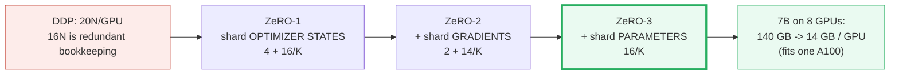
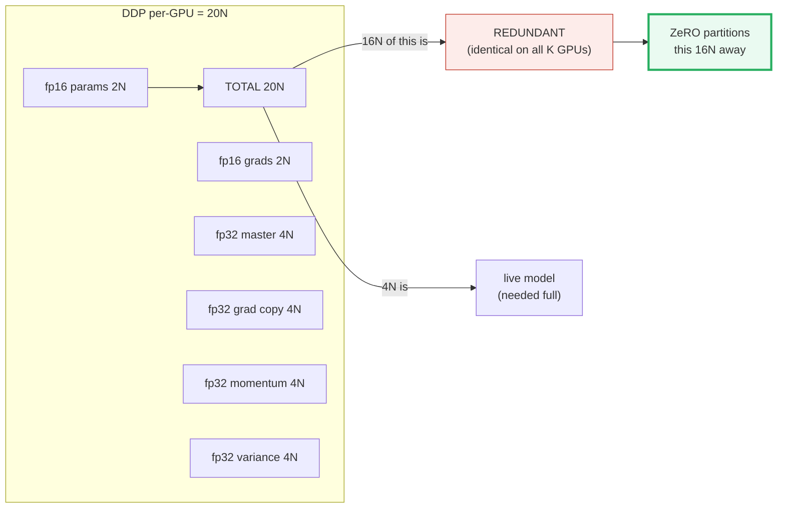
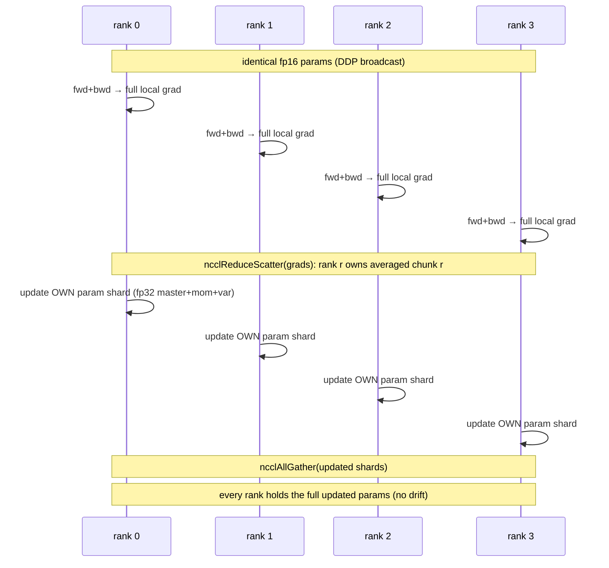
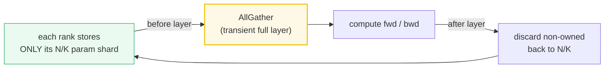
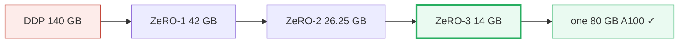
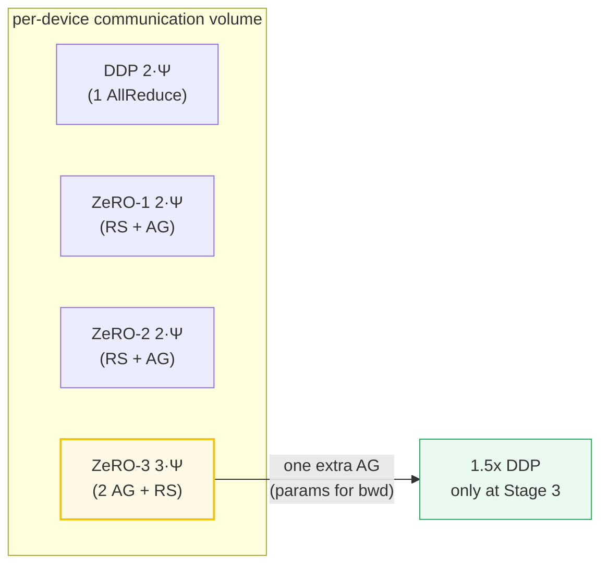
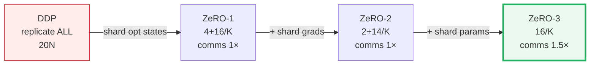
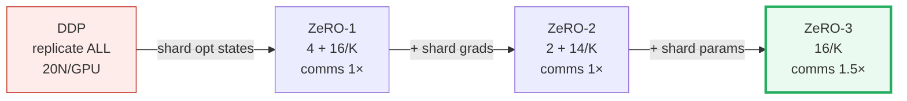

# ZeRO (Zero Redundancy Optimizer) — A Worked-Example Guide

> **Companion code:** [`zero.py`](./zero.py). **Every number in this guide is
> printed by `uv run python zero.py`** — change the code, re-run, re-paste.
> Nothing here is hand-computed.
>
> **This is a faithful single-process simulation of `K` ranks.** No
> `torch.distributed`, no NCCL, no multi-process spawn: the `K` ranks are a
> Python list of `K` torch tensors, and `ReduceScatter`/`AllGather` are explicit
> loops over them. The **memory-bytes arithmetic and the communication-volume
> arithmetic are real and exact** (closed-form formulas in `N` and `K`, asserted
> in code); only the multi-rank *execution* is simulated so every number prints
> on a laptop.
>
> **Sibling guides:** 🔗 [`DDP.md`](./DDP.md) (the 20N redundancy baseline ZeRO
> kills), 🔗 [`NCCL_COLLECTIVES.md`](./NCCL_COLLECTIVES.md) (the ReduceScatter +
> AllGather primitives ZeRO is built on), 🔗 [`TENSOR_PARALLEL.md`](./TENSOR_PARALLEL.md)
> (shards weights *within* a node instead of states across data-parallel ranks),
> 🔗 [`PIPELINE_PARALLEL.md`](./PIPELINE_PARALLEL.md) (shards layers *across* nodes — the orthogonal scaling axis).
>
> **Live animation:** [`zero.html`](./zero.html) — drag `K`, watch the per-stage
> memory bars shrink DDP → Z1 → Z2 → Z3, and the comms-cost row hold steady then
> jump 1.5× at ZeRO-3.
>
> **Source material:** `learning_guide/04_Distributed_Scale.md` §6 (ZeRO 1/2/3
> memory math + ReduceScatter/AllGather comms + DeepSpeed config) and §3.4 (the
> 20-bytes/param DDP breakdown that is the baseline).

---

## 0. TL;DR — the whole idea in one picture

> **The bookkeeping analogy (read this first):** DDP hands every GPU an identical
> full set of the model's *financial records* — the weights, the gradients, and
> all the optimizer's ledger columns (master copy, momentum, variance). On `K`
> GPUs that ledger is photocopied `K` times: pure redundancy. ZeRO does the
> obvious thing — **split the ledger into `K` equal folders, one folder per
> GPU.** Stage 1 splits the *optimizer columns*; Stage 2 also splits the
> *gradient column*; Stage 3 also splits the *weights* themselves. Before a layer
> runs, the GPUs briefly staple the folders back together (AllGather), compute,
> then each reclaims its folder. Same math as DDP, a fraction of the memory.

DDP replicates the **whole model + optimizer state** on every GPU — `20N`
bytes/GPU for an `N`-parameter model, `16N` of which is identical bookkeeping
copied on all `K` ranks. ZeRO partitions that redundancy away, **one category at
a time**, trading (almost no) communication for a large memory win:



| | Single GPU | 🔗 **DDP** | **ZeRO-1** | **ZeRO-2** | **ZeRO-3** | 🔗 Tensor Parallel |
|---|---|---|---|---|---|---|
| **What's split** | nothing | the **data** | optimizer **states** | + **gradients** | + **parameters** | the **weights** (matrices) |
| **bytes/GPU** | 20N | 20N (**redundant**) | `4 + 16/K` | `2 + 14/K` | `16/K` | 20N/TP |
| **comms vs DDP** | — | 1× | **1×** | **1×** | **1.5×** | 1×/layer (NVLink only) |
| **Shard axis** | — | data | data-parallel | data-parallel | data-parallel | model (intra-node) |

> **One plain sentence:** ZeRO keeps the DDP data-parallel pattern but **shards
> the states DDP replicates** — the optimizer bookkeeping (Stage 1), the
> gradients (Stage 2), and finally the parameters (Stage 3) — collapsing a
> 7B-model's 140 GB/GPU DDP bill to 14 GB/GPU, at the cost of a 50% comms bump
> only at the final stage.

### Glossary (plain English — refer back any time)

| Term | Plain meaning |
|---|---|
| **`N` (`Ψ`)** | Total number of model parameters. |
| **`K`** | world size = number of data-parallel ranks (GPUs). |
| **rank (`r`)** | One GPU, numbered `0..K-1`. In [`zero.py`](./zero.py) the `K` ranks are a list of `K` torch tensors. |
| **shard** | rank `r`'s contiguous `1/K` slice of a tensor: `params[r*chunk:(r+1)*chunk]`. |
| **optimizer state** | The fp32 bookkeeping Adam keeps per param: a master copy + first moment (momentum) + second moment (variance) = **12 bytes/param**. |
| **master weights** | An fp32 copy of the weights the optimizer updates; the fp16 weight used in forward is rounded down from it. (🔗 DDP §F) |
| **ReduceScatter** | Reduce (sum/avg) all ranks AND scatter → rank `r` ends holding only the reduced chunk `r`. The **first half** of AllReduce. |
| **AllGather** | Each rank contributes a shard; all end with the concat. The **second half** of AllReduce; ZeRO-3 rebuilds full params with it. |
| **AllReduce ≡ ReduceScatter ; AllGather** | The identity (🔗 NCCL_COLLECTIVES §4) — ZeRO-1/2 swap DDP's fused AllReduce for the two halves to *partition* state in between. |

> 🔗 **If you only read one cross-reference:** DDP
> ([`DDP.md`](./DDP.md) §F) replicates all `20N` bytes on every GPU; ZeRO
> partitions the `16N` of optimizer/grad bookkeeping. The two halves of DDP's
> `AllReduce` — `ReduceScatter` + `AllGather` — are exactly the two collectives
> ZeRO lives on (🔗 [`NCCL_COLLECTIVES.md`](./NCCL_COLLECTIVES.md) §4).

---

## 1. The DDP 20N baseline — Section A output (🔗 DDP)

> **The 20N rule, restated.** DDP mixed-precision training with Adam stores
> **20 bytes per parameter on every GPU**, and `16N` of that is identical
> bookkeeping replicated across all `K` ranks. That redundancy — not the model
> itself — is what makes pure DDP memory-hungry for big models, and is exactly
> what ZeRO eliminates, stage by stage.

> From `zero.py` **Section A**:
>
> | component | bytes/param | why |
> |---|---|---|
> | fp16 parameters | 2 | model weights used in the fp16 forward |
> | fp16 gradients | 2 | computed in the fp16 backward |
> | fp32 master params | 4 | optimizer master copy (Micikevicius 2017) |
> | fp32 grad copy | 4 | upcast fp16 grad for the optimizer |
> | fp32 Adam momentum | 4 | first moment (beta1 running avg) |
> | fp32 Adam variance | 4 | second moment (beta2 running avg) |
> | **TOTAL** | **20** | replicated ×K = pure redundancy |
>
> ```
> of the 20N:  4N is the live model (params+grads, needed full),
>              16N is optimizer/grad bookkeeping -- IDENTICAL on all
>              K GPUs. That 16N x K redundancy is exactly what ZeRO
>              partitions away, stage by stage.
> ```
> `[check] total == 20 and optimizer bookkeeping == 16? True`



> One plain sentence: of the `20N`, the `16N` optimizer/grad bookkeeping is pure
> redundancy under DDP — and that is ZeRO's entire target.

---

## 2. ZeRO Stage 1 — shard optimizer states → `4 + 16/K` (Section B)

> **Stage 1 (`Pos`).** Keep the full fp16 params and grads (so forward/backward
> are unchanged), but shard the four fp32 optimizer columns across the `K` ranks.
> Each rank only stores and updates its `1/K` slice of (master, grad copy,
> momentum, variance). After the optimizer step, an `AllGather` redistributes
> the updated params.

> From `zero.py` **Section B** (`K=8`):
>
> | component | bytes/param | status |
> |---|---|---|
> | fp16 parameters | 2 | FULL |
> | fp16 gradients | 2 | FULL |
> | fp32 master params | 0.5 | sharded 1/8 |
> | fp32 grad copy | 0.5 | sharded 1/8 |
> | fp32 Adam momentum | 0.5 | sharded 1/8 |
> | fp32 Adam variance | 0.5 | sharded 1/8 |
> | **TOTAL** | **6** | = 4 + 16/8 = 6 |
>
> ```
> formula: 2 + 2 + (4+4+4+4)/8 = 4 + 16/8 = 6 bytes/param
> vs DDP 20N -> 3.33x less memory
> ```
> `[check] total == 4 + 16/8? True`

### The ZeRO-1 step, simulated — Section B (sim)

The `ReduceScatter → shard update → AllGather` data flow, on `N=8, K=4`
(chunk = 2). Each rank holds a full fp16 model (identical init); each computes a
*different* local gradient; then:

> From `zero.py` **Section B (sim)** — `N=8, K=4`, `lr=0.1`:
>
> ```
> --- STEP 1: ncclReduceScatter(grads) -> rank r owns the AVERAGED grad chunk r ---
>   rank 0 grad shard [0:2] = [-0.0676, +0.1332]
>   rank 1 grad shard [2:4] = [-0.3748, -0.1394]
>   rank 2 grad shard [4:6] = [-0.1153, +0.1003]
>   rank 3 grad shard [6:8] = [+0.0495, -0.1000]
> --- STEP 2: each rank updates its param shard via the fp32 master ---
>   rank 0: master[0:2] - 0.1*grad = [+0.7773, -0.1600]
>   rank 1: master[2:4] - 0.1*grad = [-1.0519, +0.2982]
>   rank 2: master[4:6] - 0.1*grad = [-0.5307, -0.7093]
>   rank 3: master[6:8] - 0.1*grad = [+0.1967, +0.4290]
> --- STEP 3: ncclAllGather(updated shards) -> all ranks have full params ---
>   params after ZeRO-1 step (every rank) = [+0.7773, -0.1600, -1.0519, +0.2982, -0.5307, -0.7093, +0.1967, +0.4290]
> ```
> `[check] all 4 ranks hold IDENTICAL params after the step? True`
> `[check] ZeRO-1 params == single-GPU on averaged grad? True`



> One plain sentence: ZeRO-1 is **mathematically identical to DDP** — it just
> splits DDP's `AllReduce` at the `ReduceScatter` seam so each rank can own `1/K`
> of the optimizer state.

---

## 3. ZeRO Stage 2 — also shard gradients → `2 + 14/K` (Section C)

> **Stage 2 (`Pos+g`).** Gradients are now partitioned too: the moment a
> parameter's gradient is computed during backward, it is `ReduceScattered` to
> the *owning* rank and immediately **deleted** on the others. The fp32 grad
> copy (4N under DDP) is eliminated entirely — the fp16 grad shard is upcast
> transiently, consumed by the optimizer, then freed.

> From `zero.py` **Section C** (`K=8`):
>
> | component | bytes/param | status |
> |---|---|---|
> | fp16 parameters | 2 | FULL |
> | fp16 gradients | 0.25 | sharded 1/8 |
> | fp32 master params | 0.5 | sharded 1/8 |
> | fp32 Adam momentum | 0.5 | sharded 1/8 |
> | fp32 Adam variance | 0.5 | sharded 1/8 |
> | **TOTAL** | **3.75** | = 2 + 14/8 = 3.75 |
>
> ```
> the fp32 grad copy (4N under DDP) is ELIMINATED: the fp16 grad shard is
> upcast transiently and consumed by the optimizer, then freed.
> formula: 2 + (2+4+4+4)/8 = 2 + 14/8 = 3.75 bytes/param
> vs DDP 20N -> 5.33x less memory
> ```
> `[check] total == 2 + 14/8? True`

### The ZeRO-2 grad flow — reduce-then-delete (Section C, sim)

> From `zero.py` **Section C (sim)** — `N=8, K=4`:
>
> | rank | full fp16 grad (transient) | kept shard after RS+delete |
> |---|---|---|
> | 0 | `[+0.1984, +0.0801, +0.0185, +0.1864, -0.1356, -0.0498, -0.4568, +0.1145]` | `[-0.0346, -0.0964]` (owns chunk 0:2) |
> | 1 | `[-0.3083, -0.1689, -0.2677, -0.0175, -0.0587, -0.2897, +0.1267, +0.0802]` | `[-0.0768, +0.2226]` (owns chunk 2:4) |
> | 2 | `[-0.1264, -0.1532, -0.4718, -0.0370, +1.0761, -0.5494, +0.4796, -0.3831]` | `[+0.2513, -0.2963]` (owns chunk 4:6) |
> | 3 | `[+0.0977, -0.1437, +0.4137, +0.7586, +0.1232, -0.2964, -0.2724, +0.1627]` | `[-0.0307, -0.0064]` (owns chunk 6:8) |
>
> After the pass, rank `r` holds ONLY its `N/K` grad shard — the other `3/4` of
> every gradient is gone. That is the ZeRO-2 memory win.

> One plain sentence: ZeRO-2 frees gradients the instant they are reduced to the
> owner — so the gradient column, like the optimizer columns, shrinks to `1/K`.

---

## 4. ZeRO Stage 3 — also shard parameters → `16/K` (Section D)

> **Stage 3 (`Pos+g+p`).** Even the fp16 parameters are partitioned. Each rank
> stores only its `1/K` weight slice persistently. **Before a layer executes**
> (forward or backward), all ranks `AllGather` to rebuild the full layer,
> compute, then **discard** the non-owned shards. This is the win that fits a 7B
> model on a single A100.

> From `zero.py` **Section D** (`K=8`):
>
> | component | bytes/param | status |
> |---|---|---|
> | fp16 parameters | 0.25 | sharded 1/8 |
> | fp16 gradients | 0.25 | sharded 1/8 |
> | fp32 master params | 0.5 | sharded 1/8 |
> | fp32 Adam momentum | 0.5 | sharded 1/8 |
> | fp32 Adam variance | 0.5 | sharded 1/8 |
> | **TOTAL** | **2** | = 16/8 = 2 |
>
> ```
> formula: (2+2+4+4+4)/8 = 16/8 = 2 bytes/param
> vs DDP 20N -> 10.00x less memory  (== K = 8x at large N)
> ```
> `[check] total == 16/8? True`

### The ZeRO-3 param flow — AllGather a layer, compute, discard (Section D, sim)

> From `zero.py` **Section D (sim)** — `N=8, K=4`:
>
> ```
> Each rank stores only its 2-param shard:
>   rank 0 persistent shard = [+0.1961, -0.1118]
>   rank 1 persistent shard = [-0.1598, -0.6025]
>   rank 2 persistent shard = [+0.5222, -0.3166]
>   rank 3 persistent shard = [+0.2866, +0.2705]
> Before a layer's forward, every rank AllGathers to rebuild the FULL layer:
>   AllGather -> full layer (every rank, transient) = [+0.1961, -0.1118, -0.1598, -0.6025, +0.5222, -0.3166, +0.2866, +0.2705]
>   compute forward on the full layer ... then DISCARD the non-owned params.
> ```
> `[check] AllGather(rebuilt) == original full layer? True`
> `[check] persistent memory per rank stays N/K? True (rank holds 2 of 8 params)`



> One plain sentence: ZeRO-3 borrows the full weights only for the duration of a
> layer, then hands back the `1/K` shard — so even the model footprint scales as
> `1/K`.

---

## 5. The GOLD memory table — Section E output (the centerpiece)

> **The headline.** This is the table the whole bundle exists to print. For a
> **7B model on 8 GPUs**, DDP needs **140 GB/GPU** but ZeRO-3 needs only
> **14 GB/GPU** — a 10× reduction that drops the model onto a single 80 GB A100.
> The tiny `N=1e6, K=4` row is the **gold pin** [`zero.html`](./zero.html)
> recomputes and diffs.

> From `zero.py` **Section E** — TINY GOLD, `N = 1,000,000`, `K = 4` (bytes == MB, decimal):
>
> | stage | bytes/param | per-GPU bytes | = MB | vs DDP |
> |---|---|---|---|---|
> | DDP | 20 | 20,000,000 | 20.00 | 1.00x |
> | ZeRO-1 | 8 | 8,000,000 | 8.00 | 2.50x |
> | ZeRO-2 | 5.5 | 5,500,000 | 5.50 | 3.64x |
> | ZeRO-3 | 4 | 4,000,000 | 4.00 | 5.00x |
>
> **Baseline note:** the DDP row uses the **20N** baseline (this guide +
> [`DDP.md`](./DDP.md) §F); the original ZeRO paper uses **16N** (Adam `Ψ`
> states only, no separate fp32 grad copy) — see the accounting note below.
>
> ```
> GOLD PINS (zero.html recomputes these, K=4):
>   DDP    = 20.00 MB
>   ZeRO-1 =  8.00 MB
>   ZeRO-2 =  5.50 MB
>   ZeRO-3 =  4.00 MB
> ```
> `[check] DDP=20.00, Z1=8.00, Z2=5.50, Z3=4.00 MB? True`

> From `zero.py` **Section E** — HEADLINE, `N = 7B`, `K = 8` (GB, decimal):
>
> | stage | bytes/param | per-GPU GB | vs DDP |
> |---|---|---|---|
> | DDP | 20 | 140.00 | 1.00x |
> | ZeRO-1 | 6 | 42.00 | 3.33x |
> | ZeRO-2 | 3.75 | 26.25 | 5.33x |
> | ZeRO-3 | 2 | 14.00 | 10.00x |
>
> ```
> SANITY ROW: DDP 140 GB/GPU -> ZeRO-3 14 GB/GPU   (fits on one 80 GB A100)
> ```
> `[check] DDP==140.00 GB and ZeRO-3==14.00 GB (K=8)? True`



> 🔗 **Accounting note:** the original ZeRO paper (Rajbhandari et al.) uses a
> `16N` DDP baseline (Adam optimizer-state constant `K=12`: master+mom+var, with
> no separate persistent fp32 grad copy). This guide follows the sibling
> [`DDP.md`](./DDP.md) §F and the source curriculum §6.1, which add a persistent
> fp32 grad copy → `20N`. Both framings are correct; crucially the **ZeRO-3
> endpoint `16/K` is identical in either** (every category is sharded, so the
> transient grad copy does not persist). The Stages 1/2 formulas (`4+16/K`,
> `2+14/K`) are derived from the `20N` baseline.

---

## 6. Communication cost — Section F output

> **The comms trade.** ZeRO-1/2 cost **the same** bytes as DDP: they replace
> DDP's single gradient `AllReduce` (`2Ψ`) with `ReduceScatter(grad) +
> AllGather(param)` — the same `2Ψ` total, just split so the state can be
> partitioned in between. **Only ZeRO-3 costs more**: it gathers parameters for
> *both* forward and backward, adding a third `AllGather` → `3Ψ = 1.5× DDP`.

> From `zero.py` **Section F** (`Ψ` = number of params; ring RS/AG each move
> `(K-1)/K·Ψ ≈ Ψ` per device):
>
> | strategy | collectives / step | volume/device | vs DDP |
> |---|---|---|---|
> | DDP | `AllReduce(grad)` [= RS(grad)+AG(grad)] | 2.0·Ψ | 1.00x |
> | ZeRO-1 | `ReduceScatter(grad)` + `AllGather(param)` | 2.0·Ψ | 1.00x |
> | ZeRO-2 | `ReduceScatter(grad)` + `AllGather(param)` | 2.0·Ψ | 1.00x |
> | ZeRO-3 | `AllGather(param fwd)`+`AllGather(param bwd)`+`ReduceScatter(grad)` | 3.0·Ψ | 1.50x |
>
> ```
> * ZeRO-1/2 REPLACE DDP's single gradient AllReduce with
>   ReduceScatter(grad)+AllGather(param) -> SAME 2*Psi total volume,
>   but it lets the optimizer state be partitioned in between.
>   (DeepSpeed team: 'same communication volume as data parallelism'.)
> * ZeRO-3 adds one more AllGather (params gathered for BOTH fwd and bwd)
>   -> 3*Psi = 1.5x DDP. (DeepSpeed team: 'modest 50% increase'.)
> ```
>
> **Latency note:** although DDP's `AllReduce` and ZeRO-1's `RS+AG` move the
> same total bytes (`2Ψ`), ZeRO-1 splits them into **two separate collectives**
> with an extra synchronization point between them, so wall-clock latency can
> be marginally higher than DDP's single fused collective (mitigated by
> `overlap_comm`).
>
> Concrete (7B params, fp16 = 2 bytes/param), per-device GB:
>
> | strategy | volume/device (GB) |
> |---|---|
> | DDP | 28.00 |
> | ZeRO-1 | 28.00 |
> | ZeRO-2 | 28.00 |
> | ZeRO-3 | 42.00 |
>
> `[check] ZeRO-3/DDP volume ratio == 3.0/2.0 == 1.50? True`



> **On the loose "3×":** some notes (incl. the source curriculum §6.5) call
> ZeRO-3 "3× DDP comms" — that counts ZeRO-3's **three collectives** (2
> AllGather + 1 ReduceScatter) against DDP's **one** fused AllReduce. By actual
> **byte volume** it is `3Ψ` vs `2Ψ` = **1.5×**, per the ZeRO authors
> themselves (Microsoft DeepSpeed blog: *"a modest 50% increase in
> communication volume"*). The memory win is the point; the comm tax is small.

---

## 7. Why ZeRO comms work — the ReduceScatter+AllGather identity (Section G, 🔗)

> **The identity ZeRO lives on** (🔗 NCCL_COLLECTIVES §4):
> `AllReduce == ReduceScatter ; then AllGather`. ZeRO-1/2 exploit exactly this:
> they split DDP's fused `AllReduce` at the `ReduceScatter` seam so each rank can
> own `1/K` of the state *between* the two halves. The bytes are identical; only
> the partitioning is new.

> From `zero.py` **Section G** — `K=4, N=8`, averaging gradients two ways:
>
> | path | result |
> |---|---|
> | DDP: `AllReduce-average(grads)` → every rank | `[-0.0073, +0.1590, -0.0058, +0.0746, -0.2211, -0.2068, +0.1244, +0.0692]` |
> | ZeRO: `ReduceScatter-avg` → rank `r` owns averaged chunk `r` | `rank0 [-0.0073, +0.1590]`, `rank1 [-0.0058, +0.0746]`, `rank2 [-0.2211, -0.2068]`, `rank3 [+0.1244, +0.0692]` |
> | ZeRO: then `AllGather` → every rank | `[-0.0073, +0.1590, -0.0058, +0.0746, -0.2211, -0.2068, +0.1244, +0.0692]` |
>
> ```
> max|AllReduce - (ReduceScatter+AllGather)| = 0.000e+00
> [check] identity holds? True  (so ZeRO's RS+AG == DDP's AllReduce)
> ```

---

## 8. Lineage recap — Section H output

> From `zero.py` **Section H** — the per-stage memory ladder (`K=8`):
>
> | stage | what it shards | bytes/param | comms |
> |---|---|---|---|
> | DDP | replicate ALL | 20 | AllReduce (2·Ψ) |
> | ZeRO-1 | + shard optimizer states | 6 | ReduceScatter+AllGather (2·Ψ) |
> | ZeRO-2 | + shard gradients | 3.75 | ReduceScatter+AllGather (2·Ψ) |
> | ZeRO-3 | + shard parameters | 2 | AG(fwd)+AG(bwd)+RS (3·Ψ, 1.5×) |
>
> `[check] memory strictly decreases DDP > Z1 > Z2 > Z3? True`



> One plain sentence: each stage shards one more category, memory drops at every
> step, and the communication cost stays flat at `2Ψ` until the final stage adds
> a third AllGather (`1.5×`).

---

## 9. The reference code — DeepSpeed ZeRO config

`zero.py` simulates the stages; in production you enable them with DeepSpeed.
The wiring (from `learning_guide/04_Distributed_Scale.md` §6.4):

```python
import deepspeed

ds_config = {
    "zero_optimization": {
        "stage": 3,                              # or 1, 2
        "offload_optimizer": {"device": "cpu"},  # optional: opt states -> CPU RAM
        "offload_param":    {"device": "cpu"},   # optional: params -> CPU when idle
        "reduce_scatter": True,
        "allgather_partitions": True,
        "overlap_comm": True,                    # overlap AllGather with compute
    },
    "fp16": {"enabled": True},
    "train_micro_batch_size_per_gpu": 4,
}
model, optimizer, _, _ = deepspeed.initialize(
    model=model, optimizer=optimizer, config=ds_config)
```

Map to the simulation:
- **`stage`** picks which row of the §8 ladder (1 → `4+16/K`, 2 → `2+14/K`, 3 → `16/K`).
- **`reduce_scatter` / `allgather_partitions`** are the two collectives in §6/§7.
- **`offload_*`** moves the sharded states/params to CPU RAM (ZeRO-Infinity) —
  a further memory win at the cost of PCIe transfer time (out of scope here).
- **`overlap_comm`** hides the extra ZeRO-3 AllGather behind compute.

Quick test against the simulation:

```python
from zero import mem_bytes
assert mem_bytes(1_000_000, 4, "ddp") == 20_000_000   # 20 MB
assert mem_bytes(1_000_000, 4, "1")   ==  8_000_000   #  8 MB
assert mem_bytes(1_000_000, 4, "2")   ==  5_500_000   # 5.5 MB
assert mem_bytes(1_000_000, 4, "3")   ==  4_000_000   #  4 MB  (gold pins)
assert mem_bytes(7_000_000_000, 8, "ddp") / 1e9 == 140.0
assert mem_bytes(7_000_000_000, 8, "3")   / 1e9 == 14.0   # headline
```

---

## 10. Pitfalls & debugging checklist

| # | Mistake | Symptom | Fix |
|---|---|---|---|
| 1 | Thinking ZeRO-3 is "3×" slower to communicate than DDP | Wrong mental model — over-provisioning links | By **volume** it is `1.5×` (3Ψ vs 2Ψ, per the ZeRO authors); "3×" counts collectives. Enable `overlap_comm` to hide the extra AllGather. |
| 2 | Confusing ZeRO with 🔗 Tensor Parallelism | Sharding the wrong axis (model vs data) | ZeRO shards **states across data-parallel ranks** (fits any topology); TP shards **weight matrices within an NVLink node**. They compose (ZeRO in DP group, TP in node). |
| 3 | Forgetting the fp32 master copy in the byte count | Under-counting by 4N | DDP = **20N** = 2N fp16 params + 2N fp16 grads + 4N fp32 master + 4N fp32 grad + 4N Adam m + 4N Adam v. The "16N of redundancy" = optimizer state + fp32 master (the four 4N columns); the **total** DDP footprint is 20N. See §1. |
| 4 | ZeRO-3 without `overlap_comm` | ~2× slower forward (AllGather stalls) | Set `overlap_comm: True`; prefetch the next layer's AllGather during current compute. |
| 5 | Sharding granularity not divisible by `K` | Crash / uneven chunks in ReduceScatter | Pad `N` (or the sharding dim) to a multiple of `K`; keep `chunk = N/K` integral. |
| 6 | Mixing ZeRO stages inconsistently across DP subgroups | Some ranks shard params, others don't | Set the same `stage` for every rank in the DP group; check the DeepSpeed config is broadcast. |
| 7 | Expecting ZeRO to reduce **communication** | Surprised comms are ≥ DDP | ZeRO trades **memory**, not bytes — Stages 1/2 are `2Ψ` (= DDP), Stage 3 is `1.5×`. The win is per-GPU RAM. |
| 8 | CPU offload (ZeRO-Infinity) on a slow PCIe link | Step time balloons | Offload only optimizer states (Stage-1 offload), not params; or use NVLink C2C (H100). |
| 9 | Saving a ZeRO-3 checkpoint as a flat state_dict | Each rank's `1/K` shard, not the full model | Use `model._zero3_consolidated_16bit_state_dict()` or DeepSpeed's `save_checkpoint` (consolidates shards). |
| 10 | Comparing ZeRO-3 memory to the paper's 16N baseline | Numbers seem off by the grad-copy 4N | This guide uses 20N (🔗 DDP §F); the paper uses 16N. The ZeRO-3 endpoint `16/K` is the same in both — see §5 note. |

---

## 11. Cheat sheet



- **The one insight:** DDP replicates `20N`/GPU; `16N` is redundant bookkeeping.
  ZeRO partitions that `16N` away one category at a time.
- **Memory (`N` params, `K` GPUs):** DDP `20N` → ZeRO-1 `4 + 16/K` → ZeRO-2
  `2 + 14/K` → ZeRO-3 `16/K`. Each derived by sharding one more category.
- **Gold (`N=1e6, K=4`):** 20 / 8 / 5.5 / 4 MB. **Headline (7B, K=8):** 140 → 14 GB.
- **Comms:** DDP = ZeRO-1 = ZeRO-2 = `2Ψ` (AllReduce ≡ ReduceScatter+AllGather);
  ZeRO-3 = `3Ψ` = **1.5× DDP** (one extra param AllGather for backward).
- **Identity:** `AllReduce == ReduceScatter ; AllGather` (🔗 NCCL_COLLECTIVES) —
  that is *why* ZeRO can swap the fused op for the two halves to partition state.
- **Stages compose:** 1 ⊆ 2 ⊆ 3 — each is "the previous, plus one more category
  sharded." Stages 1/2 are free on comms; only Stage 3 pays the 1.5×.
- **DeepSpeed:** set `"stage": 1/2/3`; add `offload_*` for ZeRO-Infinity (CPU/NVMe);
  `overlap_comm` hides the Stage-3 AllGather.

> 🔗 ZeRO is the **data-parallel** memory win. The sibling axes: 🔗
> [`DDP.md`](./DDP.md) (the replicated baseline), 🔗
> [`NCCL_COLLECTIVES.md`](./NCCL_COLLECTIVES.md) (the RS+AG primitives), 🔗
> [`TENSOR_PARALLEL.md`](./TENSOR_PARALLEL.md) (shard the **weights** within a
> node), 🔗 [`PIPELINE_PARALLEL.md`](./PIPELINE_PARALLEL.md) (shard the **layers** across nodes).
> ZeRO composes with all of them — 3D parallelism uses ZeRO inside the DP group.

---

## Sources

- **Rajbhandari, S.; Rasley, J.; Ruwase, O.; He, Y. (2019).**
  *ZeRO: Memory Optimizations Toward Training Trillion Parameter Models.*
  arXiv:1910.02054 (SC '20) — <https://arxiv.org/abs/1910.02054>
  - The ZeRO stage definitions and memory formulas ([§2–§5](#2-zero-stage-1--shard-optimizer-states--4--16k-section-b)).
    Verified via the arXiv abstract: *"ZeRO eliminates memory redundancies in
    data- and model-parallel training while retaining low communication volume
    and high computational granularity."*

- **Microsoft Research / DeepSpeed team (2020).**
  *ZeRO & DeepSpeed: New system optimizations enable training models with over
  100 billion parameters.* —
  <https://www.microsoft.com/en-us/research/blog/zero-deepspeed-new-system-optimizations-enable-training-models-with-over-100-billion-parameters/>
  - **Authoritative source for the communication-volume claims in
    [§6](#6-communication-cost--section-f-output).** Verbatim from the authors:
    *"1. Optimizer State Partitioning (Pos) – 4x memory reduction, **same
    communication volume as data parallelism**. 2. Add Gradient Partitioning
    (Pos+g) – 8x memory reduction, **same communication volume as data
    parallelism**. 3. Add Parameter Partitioning (Pos+g+p) – Memory reduction is
    linear with data parallelism degree Nd… There is a **modest 50% increase in
    communication volume**."* This is why this guide cites ZeRO-3 comms as
    **1.5× DDP** (not the loose "3×"): by byte volume `3Ψ` vs `2Ψ`.

- **Wang, Z.; Li, Z.; et al. (2023).** *ZeRO++: Extremely Efficient Collective
  Communication for Giant Model Training.* NeurIPS 2023.
  arXiv:2306.10209 — <https://arxiv.org/abs/2306.10209>
  - Independent confirmation of the ZeRO-3 volume: *"In total, ZeRO has a total
    communication volume of 3M, spreads evenly across 2 all-gather and 1
    reduce-scatter."* (`M` = model size = `Ψ` here.) DDP baseline AllReduce =
    `2Ψ`, so ZeRO-3 = `3Ψ` = **1.5× DDP** — matching the DeepSpeed team's
    "50% increase."

- **NVIDIA.** *NCCL Collective Operations documentation* —
  <https://docs.nvidia.com/deeplearning/nccl/user-guide/docs/usage/collectives.html>
  - The `ReduceScatter` + `AllGather` primitives and the identity
    `AllReduce == ReduceScatter ; AllGather` that ZeRO-1/2 exploit
    ([§7](#7-why-zero-comms-work--the-reducescatterallgather-identity-section-g-)).
    Cited in full in sibling 🔗 [`NCCL_COLLECTIVES.md`](./NCCL_COLLECTIVES.md).

- **DeepSpeed.** *Zero Redundancy Optimizer tutorial / docs* —
  <https://www.deepspeed.ai/tutorials/zero/>
  - The DeepSpeed `ds_config` (`stage`, `offload_optimizer`, `offload_param`,
    `reduce_scatter`, `allgather_partitions`, `overlap_comm`) reproduced in
    [§9](#9-the-reference-code--deepspeed-zero-config).

- **Local source material** (the 20N DDP breakdown §6.1, the ZeRO-1/2/3
  per-stage memory derivations and step-by-step ReduceScatter/AllGather flows
  §6.2–§6.4, the stage comparison table §6.5, and the DeepSpeed config):
  `learning_guide/04_Distributed_Scale.md` §6 (ZeRO) and §3.4 / sibling
  [`DDP.md`](./DDP.md) §F (the 20-bytes/param baseline). The communication
  framing here is corrected against the ZeRO authors (above): the source's
    §6.5 "3× DDP comms" is the collective-count; the precise volume ratio is
    **1.5×**.

> **Unverified facts:** none outstanding. The stage memory formulas
> (`4+16/K`, `2+14/K`, `16/K`) are derived from the source curriculum §6 and
> asserted numerically in `zero.py` Sections B–E. The communication volumes
> (`2Ψ` for DDP/Z1/Z2, `3Ψ` = 1.5× for Z3) are confirmed by **three**
> independent sources: the ZeRO authors (Microsoft blog), ZeRO++ (NeurIPS 2023),
> and the NCCL identity. The headline (140 → 14 GB for 7B/K=8) is computed and
> asserted in `zero.py` Section E. The "3×" in the source curriculum is
    explicitly reconciled as the collective count vs the 1.5× volume.
