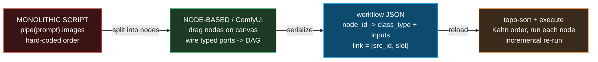
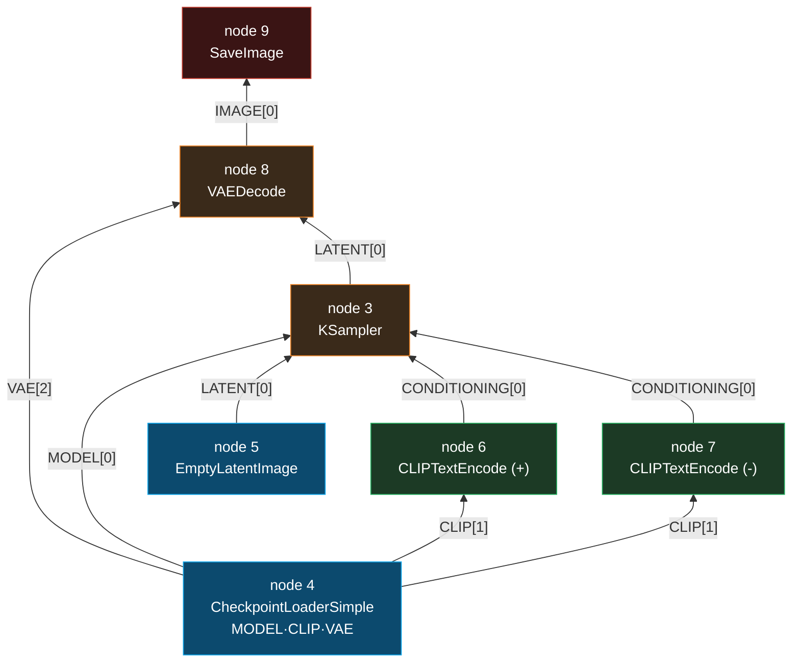

# ComfyUI Workflow — a node-graph executor for image/video generation

> Companion: [comfyui_workflow.py](https://github.com/quanhua92/tutorials/blob/main/local-llm/comfyui_workflow.py)
> Live: [comfyui_workflow.html](./comfyui_workflow.html)

## 0. TL;DR

ComfyUI is a **visual, node-based** interface for image/video generation. Instead
of a monolithic script that calls `model → encode → sample → decode → save` in a
fixed order, you drag **nodes** onto a canvas and wire their typed output ports
into other nodes' input ports. The wiring is a **DAG** (directed acyclic graph)
saved as a JSON file. ComfyUI **topo-sorts** it and executes the nodes in
dependency order, re-running only the nodes whose inputs changed.

**The lifecycle (the one thing to remember):**

```
prompt JSON (node_id -> {class_type, inputs})  ->
parse links [src_id, slot] into a DAG          ->
topo-sort (Kahn: emit zero-in-degree first)    ->
execute in order (load → encode → sample → decode → save)
```

**Gold (verified, [check: OK] in the `.py` and `.html`):** the canonical 7-node
workflow → **node_count = 7**, **topo order = [4, 5, 6, 7, 3, 8, 9]**,
**edge_count = 9** dependency wires (8 distinct source output ports).

---

## 1. What it is (lineage old → new, WHY each step)



| Step | Problem it fixes | What changes |
|---|---|---|
| **1. Monolithic script** | — (the baseline) | One Python file, fixed pipeline `pipe(prompt).images`. Changing a step means editing code; can't see data flow; sharing = copy-paste |
| **2. Node-based canvas** | Inflexible, opaque pipelines | Every operation is a node with typed I/O ports. Rewire nodes to change the pipeline — no code edits. Composable, visual |
| **3. Workflow JSON** | "How do I share / reproduce a setup?" | The canvas layout + links serialize to a portable JSON. The executor format maps `node_id → {class_type, inputs}`; each link is `[src_id, slot]` |
| **4. Incremental execution** | Re-running the heavy model load every tweak | Only nodes whose inputs changed re-execute. Tweak the prompt text → CLIPTextEncode onward re-runs; CheckpointLoaderSimple stays cached |

**Why node-based beats scripts:** **reusable** (save/share workflows as JSON),
**composable** (mix any nodes freely), **visual** (see the whole pipeline), and
**incremental** (only re-run changed nodes).

**Why it matters:** a generation pipeline *is* a DAG. Expressing it as a graph
(not a script) makes it reusable, shareable, and incrementally executable. The JSON
is portable — the same workflow runs on a laptop, a cloud GPU, or a headless API.

---

## 2. The mechanism (internals)

### 2a. The prompt JSON — one node

ComfyUI's executor consumes a **prompt-format** JSON: a dict keyed by node id
(string), each value has `class_type` (the registered Python class) and `inputs`
(a dict of input-name → value **or** a link):

```json
{
  "3": {"class_type": "KSampler", "inputs": {
          "model": ["4", 0], "positive": ["6", 0], "negative": ["7", 0],
          "latent_image": ["5", 0], "seed": 42, "steps": 20, "cfg": 8,
          "sampler": "euler", "scheduler": "normal"}},
  "4": {"class_type": "CheckpointLoaderSimple", "inputs": {"ckpt_name": "model.safetensors"}}
}
```

The crucial idea: **a link `[src_id, slot]` is the DAG edge.** It means "take
output slot `#slot` of node `src_id`". Node "4" (`CheckpointLoaderSimple`) has
three output slots: **`[0]=MODEL, [1]=CLIP, [2]=VAE`**.

### 2b. The standard node types

| Node | Outputs | Role |
|---|---|---|
| `CheckpointLoaderSimple` | MODEL, CLIP, VAE | loads one `.safetensors`; three output ports |
| `CLIPTextEncode` | CONDITIONING | encodes prompt text via CLIP into a conditioning vector |
| `EmptyLatentImage` | LATENT | start noise canvas (e.g. 512×512) for txt2img |
| `KSampler` | LATENT | runs the diffusion loop (denoises; needs MODEL + pos/neg CONDITIONING + LATENT) |
| `VAEDecode` | IMAGE | latent space → pixel space (needs VAE + LATENT) |
| `SaveImage` | (writes PNG) | final output to disk |

> From comfyui_workflow.py Section A:
> ```
> | node_id | class_type             | inputs (links marked *)              |
> |---------|------------------------|--------------------------------------|
> | 3       | KSampler               | cfg=8, latent_image*=[5,0], model*=[4,0], negative*=[7,0], positive*=[6,0], ... |
> | 4       | CheckpointLoaderSimple | ckpt_name='model.safetensors'        |
> | 5       | EmptyLatentImage       | batch_size=1, height=512, width=512  |
> | 6       | CLIPTextEncode         | clip*=[4,1], text='beautiful landscape' |
> | 7       | CLIPTextEncode         | clip*=[4,1], text='blurry, bad'      |
> | 8       | VAEDecode              | samples*=[3,0], vae*=[4,2]           |
> | 9       | SaveImage              | images*=[8,0]                        |
> [check] parsed 7 nodes: True -> OK
> ```

### 2c. The DAG — every link is a directed edge



> From comfyui_workflow.py Section B:
> ```
> | # | src_id | slot | -> | dst_id | input_name | source type |
> |---|--------|------|----|--------|------------|-------------|
> | 1 | 4      | 0    | -> | 3      | model      | MODEL       |
> | 2 | 6      | 0    | -> | 3      | positive   | CONDITIONING |
> | 3 | 7      | 0    | -> | 3      | negative   | CONDITIONING |
> | 4 | 5      | 0    | -> | 3      | latent_image | LATENT      |
> | 5 | 4      | 1    | -> | 6      | clip       | CLIP        |
> | 6 | 4      | 1    | -> | 7      | clip       | CLIP        |
> | 7 | 3      | 0    | -> | 8      | samples    | LATENT      |
> | 8 | 4      | 2    | -> | 8      | vae        | VAE         |
> | 9 | 8      | 0    | -> | 9      | images     | IMAGE       |
>
> total dependency edges (wires):   9
> distinct source output ports:     8
> (CLIP slot 1 of node 4 fans out to nodes 6 AND 7 -> counted once as a
>  source port, but twice as a dependency wire.)
> [check] edge_count == 9 (one wire per link): True -> OK
> [check] distinct source ports == 8: True -> OK
> ```

---

## 3. Topological sort & execution

A node can only execute once **all** its input producers have executed. ComfyUI
topo-sorts the DAG (Kahn's algorithm: repeatedly emit zero-in-degree nodes). With
a numeric tie-break on node id, the order is deterministic.


> From comfyui_workflow.py Section C:
> ```
> in-degree per node:
>   node 3  (KSampler              ) in-degree = 4
>   node 4  (CheckpointLoaderSimple) in-degree = 0
>   node 5  (EmptyLatentImage      ) in-degree = 0
>   node 6  (CLIPTextEncode        ) in-degree = 1
>   node 7  (CLIPTextEncode        ) in-degree = 1
>   node 8  (VAEDecode             ) in-degree = 2
>   node 9  (SaveImage             ) in-degree = 1
>
> order = ['4', '5', '6', '7', '3', '8', '9']
> [check] topo order == ['4','5','6','7','3','8','9']: True -> OK
> [check] order is a legal topological sort: True -> OK
> ```

### Incremental execution

ComfyUI only re-runs nodes whose inputs changed. Tweak the prompt text →
`CLIPTextEncode` (+), `KSampler`, `VAEDecode`, `SaveImage` re-run; the heavy
`CheckpointLoaderSimple` result (model weights in VRAM) is cached. The topo order
is recomputed, but cached outputs are reused.

---

## 4. Worked example (the gold trace)

> From comfyui_workflow.py Section G:
> ```
> STEP 1  parse prompt JSON
>         node_count = 7
>         edge_count = 9  (distinct source ports = 8)
> STEP 2  topo_sort (Kahn, numeric tie-break)
>         order = ['4', '5', '6', '7', '3', '8', '9']
> STEP 3  execute (symbolic)
> | order | node | class_type             | output[0]                            |
> |-------|------|------------------------|--------------------------------------|
> | 1     | 4    | CheckpointLoaderSimple | MODEL(model.safetensors)             |
> | 2     | 5    | EmptyLatentImage       | LATENT(512x512 noise)                |
> | 3     | 6    | CLIPTextEncode         | COND('beautiful landscape' via ...)  |
> | 4     | 7    | CLIPTextEncode         | COND('blurry, bad' via ...)          |
> | 5     | 3    | KSampler               | LATENT(denoised seed=42 steps=20)    |
> | 6     | 8    | VAEDecode              | IMAGE(512x512x3 pixels)              |
> | 7     | 9    | SaveImage              | SAVED(ComfyUI_00001_.png)            |
> STEP 4  result: SAVED(ComfyUI_00001_.png)
> [check] node_count == 7: True -> OK
> [check] topo order == [4,5,6,7,3,8,9]: True -> OK
> [check] topo order is legal: True -> OK
> [check] edge_count == 9 (dependency wires): True -> OK
> ```

---

## 5. Pitfalls (trap | symptom | fix)

| Trap | Symptom | Fix |
|---|---|---|
| **Graph JSON ≠ prompt JSON** | Drag the API-format JSON onto the canvas → nothing loads | The canvas saves a *graph* JSON (with x/y positions); the executor wants the *prompt* JSON (`class_type` + `inputs`). Use "Save (API Format)" or the `/prompt` endpoint |
| **A link points at a slot that doesn't exist** | "no output slot 2" / silent None | Check the producer's output count. `CheckpointLoaderSimple` has exactly 3 slots (0=MODEL, 1=CLIP, 2=VAE); `EmptyLatentImage` has 1 |
| **Cycle in the wiring** | `KSampler` never runs / infinite loop / "prompt has errors" | The workflow must be a **DAG** — no directed cycles. ComfyUI rejects cyclic graphs at topo-sort time |
| **Typing mismatch on a port** | "VAEDecode expected LATENT, got IMAGE" | Ports are typed. Only wire MODEL→model, CLIP→clip, LATENT→samples, etc. A wrong type errors at execute, not at load |
| **Node id collisions after merge** | Two nodes share id "6"; one silently overwrites | Node ids are unique dict keys. When pasting/importing a sub-workflow, ComfyUI renumbers to avoid collisions |
| **Assuming execution order = numeric id order** | KSampler runs before its encoders → empty conditioning | Execution follows **topo order**, not id order. Node "3" (KSampler) runs *after* 4/5/6/7 despite its lower id |
| **Forgetting the negative prompt** | Image quality drops / no prompt guidance control | `KSampler` needs *both* `positive` and `negative` CONDITIONING. Wire two `CLIPTextEncode` nodes (one per) |
| **Cache hides your change** | Edited a node but the output didn't change | Incremental execution skips unchanged nodes. Force a re-run by changing a seed/param or bypassing the cache |

---

## 6. Cheat sheet

```
prompt JSON : node_id (str) -> { class_type, inputs }
  class_type : registered Python node class (CheckpointLoaderSimple, KSampler, ...)
  inputs     : input_name -> value | link [src_id, slot]
  link       : [src_id, slot]  == "take output slot #slot of node src_id"

node types  : CheckpointLoaderSimple -> MODEL[0], CLIP[1], VAE[2]
              EmptyLatentImage       -> LATENT[0]
              CLIPTextEncode         -> CONDITIONING[0]
              KSampler               -> LATENT[0]   (MODEL + pos + neg + LATENT)
              VAEDecode              -> IMAGE[0]    (LATENT + VAE)
              SaveImage              -> writes PNG  (IMAGE)

DAG         : every [src,slot] link = a directed edge. no cycles.
topo sort   : Kahn's algorithm (emit zero-in-degree, decrement consumers).
              numeric tie-break => deterministic order.

execution   : run each node in topo order; resolve links from producer outputs.
incremental : only re-run nodes whose inputs changed (cache the rest).

gold        : 7 nodes, 9 edges (8 distinct source ports),
              topo order [4,5,6,7,3,8,9] -> ComfyUI_00001_.png
```

---

## 🔗 Cross-references

- **diffusion_fundamentals** (sibling) — the diffusion process itself. `KSampler`
  (node 3) *is* the diffusion loop: it iteratively denoises the LATENT. This bundle
  is the *orchestration* around it; that bundle is the *math inside* node 3.
- **[GGML_BACKEND](./GGML_BACKEND.md)** — the **same compute-graph concept**, applied
  to LLM layers. There, `ggml_cgraph` is a topo-sorted DAG of tensor ops; here, the
  workflow JSON is a topo-sorted DAG of generation nodes. Both: build a graph →
  topo-sort → execute in order.
- **flux_gguf** (sibling) — a Flux model in GGUF form plugs into
  `CheckpointLoaderSimple` (or the GGUF loader node). This bundle loads it; that
  bundle is the *format* of the `.safetensors`/`.gguf` it reads.

## Sources

- [ComfyUI GitHub — comfyanonymous/ComfyUI](https://github.com/comfyanonymous/ComfyUI) — the node-based workflow system this bundle models
- [ComfyUI workflow JSON spec (docs.comfy.org)](https://docs.comfy.org/specs/workflow_json) — the prompt/graph JSON schema
- [ComfyUI server / API (`/prompt` endpoint)](https://github.com/comfyanonymous/ComfyUI/blob/master/server.py) — how the prompt JSON is received and executed
- [ComfyUI docs — node reference](https://docs.comfy.org/) — `CheckpointLoaderSimple`, `KSampler`, `VAEDecode`, etc.
