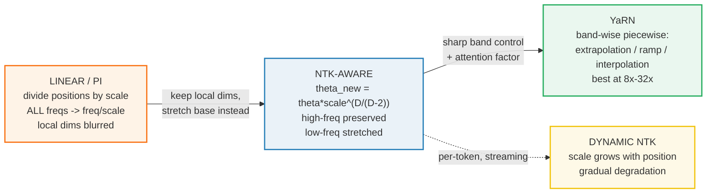
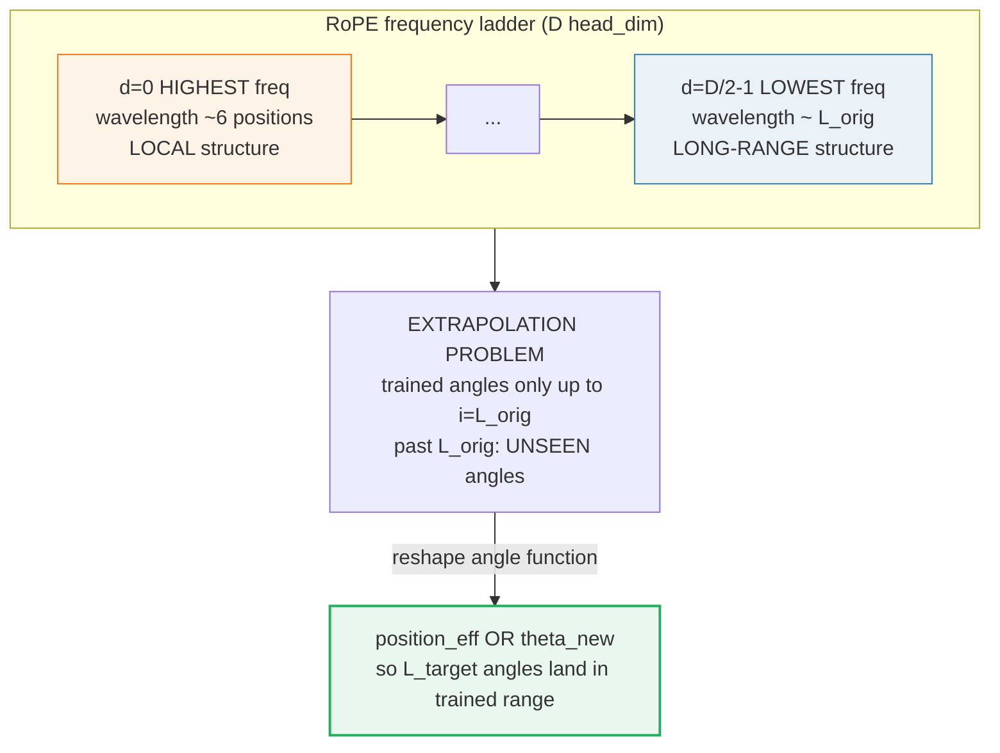
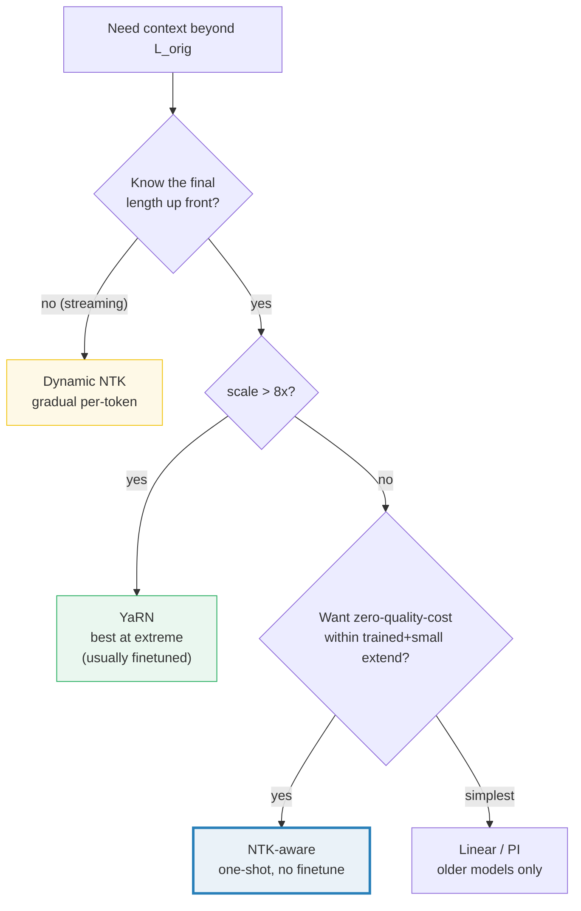

# RoPE Context Extension — linear → NTK-aware → YaRN → dynamic NTK

> Companion: [context_extension.py](https://github.com/quanhua92/tutorials/blob/main/local-llm/context_extension.py)
> Live playground: [context_extension.html](./context_extension.html)
> Sibling (the base rotation math): [../llm/ROPE.md](../llm/ROPE.md) — RoPE derivation, this guide scales it
> The VRAM cost of a longer window: [VRAM_ESTIMATOR.md](./VRAM_ESTIMATOR.md) 🔗

## 0. TL;DR

A model trained with **RoPE** on context `L_orig` cannot attend past `L_orig`:
the rotation angles `i·freq` were only ever seen up to `i = L_orig`, and beyond
that the angle is **unseen** — the model extrapolates and quality collapses. The
fix is to **reshape the angle function** so positions up to the new target
`L_target` land back inside the trained angle range.

Four methods, oldest → newest, each better at preserving quality:

| Method | What it scales | high-freq (local) | quality @4x | quality @8x+ | use case |
|---|---|---|---|---|---|
| **Linear (PI)** | positions (`/scale`) | blurred (`/scale`) | OK | degrades | simplest, old models |
| **NTK-aware** | base `θ` | preserved (~1.0) | good | soft drop | one-shot, no finetune |
| **YaRN** | bands + attention factor | preserved | best | best | extreme 8x–32x, finetuned |
| **Dynamic NTK** | base `θ` per-token | preserved early | good | gradual | streaming, unknown len |

**The recurring insight: never blur the high-frequency dims.** They encode
local token-to-token structure. Linear scaling blurs them uniformly; NTK, YaRN,
and dynamic NTK all leave them ~untouched and only stretch the long-range dims.

---

## 1. The lineage — WHY each step exists



**The single recurring trick: preserve the high-frequency (local) dims, stretch
only the low-frequency (long-range) ones.** Linear fails because it scales
everything uniformly. NTK achieves the split automatically through the base
frequency. YaRN makes the split explicit with bands. Dynamic NTK defers the
stretch until the sequence actually exceeds the trained window.

### The frequency ladder and the extrapolation problem



---

## 2. The mechanism — frequency ladder from scratch

Every number below is printed by `context_extension.py`. The base frequency and
angle formulas are the foundation all four methods modify.

### A — The RoPE frequency ladder

> From `context_extension.py` Section A:
> ```
> RoPE base theta = 10000 (default), head_dim D = 4
> freq_d = 1 / theta^(2d/D), for d in 0..D/2-1. angle_i_d = i * freq_d
>
> | d | exponent 2d/D | theta^(2d/D) |   freq_d   | wavelength 2pi/freq |
> |---|---------------|--------------|------------|----------------------|
> | 0 |        0.0000 |         1.00 |   1.000000 |               6.2832 |
> | 1 |        0.5000 |       100.00 |   0.010000 |             628.3185 |
>
> freqs = [+1.0000, +0.0100]
> ```

`d=0` is the **highest** frequency (wavelength ~6 positions): it encodes
**local** token-to-token structure. `d=1` is lower (wavelength ~628): it encodes
**long-range** structure. Every scaling method trades these off differently.

> From `context_extension.py` Section A (the trained angle ceiling):
> ```
> | d | freq_d   | angle at L_orig=4096 |
> |---|----------|----------------------|
> | 0 |   1.0000 |            4096.0000 |
> | 1 |   0.0100 |              40.9600 |
> ```

Beyond `L_orig=4096` the angle `i·freq` is **unseen**. That is the extrapolation
problem every method fixes.

### B — Linear scaling (Position Interpolation)

> From `context_extension.py` Section B:
> ```
> scale = L_target / L_orig = 4  (4096 -> 16384)
> Method:  position_eff = position / scale   (apply to ALL positions)
> Effect:  effective freq_d becomes freq_d / scale for EVERY dim.
>
> | d | original freq | linear freq  | ratio |
> |---|---------------|--------------|-------|
> | 0 |        1.0000 |       0.2500 |  0.25 |
> | 1 |        0.0100 |       0.0025 |  0.25 |
> ```

Divide **every** position by `scale`. This maps `L_target` back onto the trained
range, but the **high-freq dim `d=0` is also divided by 4** (`1.0 → 0.25`) — so
two adjacent tokens that used to differ by a full rotation now differ by only a
quarter. Local structure blurs. Simple, but quality degrades hard past ~4×.

> From `context_extension.py` Section B (linear maps L_target back to the ceiling):
> ```
> | d | linear freq | angle at L_target | original ceiling | match? |
> |---|-------------|-------------------|------------------|--------|
> | 0 |      0.2500 |         4096.0000 |        4096.0000 |    YES |
> | 1 |      0.0025 |           40.9600 |          40.9600 |    YES |
> ```

### C — NTK-aware (the gold-checked method)

> From `context_extension.py` Section C (GOLD):
> ```
> theta_new = theta * scale^(D/(D-2))
>          = 10000 * 4^(4/(4-2))
>          = 10000 * 4^2
>          = 10000 * 16
>          = 160000
>
> | d | original freq | NTK freq     | ratio freq_new/freq |
> |---|---------------|--------------|---------------------|
> | 0 |        1.0000 |     1.000000 |            1.000000 |
> | 1 |        0.0100 |     0.002500 |            0.250000 |
> ```

**This is the gold-checked value** the HTML playground reproduces:
`θ_new = 10000·4² = 160000`, `freq_1: 0.01 → 0.0025`.

The key: `d=0` (highest freq) is **unchanged** (ratio 1.0) → local structure
preserved. Only `d=1` (low freq) is stretched. Because
`θ^(2·0/D) = 1` for any `θ`, the `d=0` dim is immune to any base change — that
is the mathematical reason NTK never blurs the local dims.

### D — YaRN: band-wise scaling

> From `context_extension.py` Section D (D=8 so the bands are visible):
> ```
> | d | original | w_d (interp weight) | band          | YaRN freq  | linear | NTK freq |
> |---|----------|---------------------|---------------|------------|--------|----------|
> | 0 |   1.0000 |              0.0000 | extrapolation |   1.000000 | 0.2500 | 1.000000 |
> | 1 |   0.1000 |              0.0000 | extrapolation |   0.100000 | 0.0250 | 0.062996 |
> | 2 |   0.0100 |              0.4591 | ramp (blend)  |   0.006557 | 0.0025 | 0.003969 |
> | 3 |   0.0010 |              1.0000 | interpolation |   0.000250 | 0.0003 | 0.000250 |
> ```

YaRN splits the ladder into bands by how many full rotations each wavelength
completes over `L_orig`:

1. **Extrapolation band** (high freq, ≥32 rotations): **no change** — `freq·(1−w)`.
2. **Interpolation band** (low freq, <1 rotation): **full `/scale`** — `freq·w/scale`.
3. **Ramp** (middle): smooth blend `freq·(1−w) + (freq/scale)·w`.

The boundaries come from `β_fast=32` and `β_slow=1` rotation counts. YaRN also
multiplies the attention logits by an **attention factor**
`~ √(1 + ln(scale)/ln(L_orig))` to compensate for the distribution shift — the
second ingredient that makes it best at extreme (8×–32×) extension.

### E — Dynamic NTK (streaming)

> From `context_extension.py` Section E:
> ```
> | position | scale_t | theta_t  | freq_1 (low-freq dim) |
> |----------|---------|----------|-----------------------|
> |     2048 |  1.0000 |    10000 |              0.010000 |
> |     4096 |  1.0000 |    10000 |              0.010000 |
> |     8192 |  2.0000 |    40000 |              0.005000 |
> |    12288 |  3.0000 |    90000 |              0.003333 |
> |    16384 |  4.0000 |   160000 |              0.002500 |
> ```

For streaming (unknown final length), recompute `θ` each token:
`scale_t = max(1, position/L_orig)`, `θ_t = θ·scale_t^(D/(D−2))`. Within `L_orig`
`θ` stays original (zero degradation); past it `θ` grows gradually until it
reaches the full static NTK value at `L_target`.

---

## 3. Practical config / commands

```bash
# llama.cpp
./llama-cli -m model.gguf --rope-scale 4                 # linear (PI), 4x
./llama-cli -m model.gguf --rope-freq-base 160000        # manual NTK base
./llama-cli -m model.gguf --rope-scaling yarn --rope-scale 8   # YaRN 8x

# HuggingFace config.json rope_scaling
{"rope_scaling": {"type": "linear", "factor": 4}}
{"rope_scaling": {"type": "ntk",    "factor": 4}}
{"rope_scaling": {"type": "yarn",   "factor": 8,
                  "beta_fast": 32, "beta_slow": 1}}

# Ollama Modelfile
FROM model
PARAMETER num_ctx 32768        # set the target window
```

**Memory note:** extending context multiplies the **KV cache**, not the weights.
A 4× window costs ~4× more KV-cache VRAM (see
[VRAM_ESTIMATOR.md](./VRAM_ESTIMATOR.md)). The RoPE scaling itself is free — it
only changes how positions map to angles.

---

## 4. Worked example — pick a method

Decision tree (`scale = L_target / L_orig`):



---

## 5. Pitfalls (trap → symptom → fix)

| Trap | Symptom | Fix |
|---|---|---|
| **Using linear at large scale (>4×)** | Perplexity spikes, model "loses the plot" mid-document | Switch to NTK or YaRN. Linear blurs the high-freq (local) dims uniformly; NTK/YaRN preserve them. |
| **Forgetting that NTK high-freq is immune to θ** | Expecting `θ_new` to shift `d=0`, debugging "why did freq_0 stay 1.0?" | `θ^(2·0/D) = 1` for any θ. The `d=0` dim is mathematically invariant to the base — that is the *point*: local structure never blurs. |
| **Setting `θ_new` without matching the scale** | Garbled output at the extended length | `θ_new = θ·scale^(D/(D−2))`. The exponent depends on head_dim `D`; copy the model's real `D`, not the demo's `D=4`. |
| **YaRN on a tiny head_dim (D≤4)** | Bands collapse (only 1–2 freq pairs), YaRN ≈ NTK | YaRN needs several dim pairs to form bands. Real models have `D=64–128` (32–64 pairs) — the band structure is meaningful there, degenerate at `D=4`. |
| **Confusing position-scaling (PI) with base-scaling (NTK)** | Mixing CLI flags: `--rope-scale` (linear) vs `--rope-freq-base` (manual NTK) | PI divides *positions*; NTK changes *θ*. They are not interchangeable. Set only one; check the runtime's accepted flags. |
| **Dynamic NTK capped too early/late** | Quality drops before `L_target`, or theta never reaches full NTK | `scale_t = max(1, min(target_scale, position/L_orig))`. The cap must equal the intended target scale so theta converges to the static NTK value. |
| **Extending context, ignoring KV-cache VRAM** | OOM at long prompts even though weights fit | RoPE scaling is free; the **KV cache** grows with window size (~2·n_layer·n_kv_head·head_dim·ctx·bytes). Budget it (see VRAM_ESTIMATOR.md). |
| **Expecting no quality loss at all** | Subtle long-range retrieval errors even with YaRN | All methods trade some extrapolation ability. YaRN finetuning recovers most; zero-shot NTK is "good, not perfect". |

---

## 6. Cheat sheet

```python
# the four core formulas (pure Python)
import math
def freqs(theta, D):       return [1/(theta**(2*d/D))        for d in range(D//2)]
def ntk_theta(theta,s,D):  return theta * s**(D/(D-2))
def linear(f, s):          return [x/s for x in f]
def yarn(f, s, w):         return [x*(1-wi)+x/s*wi for x,wi in zip(f,w)]
def dyn_scale(p, L, s):    return max(1.0, min(s, p/L))
```

| You want… | Use | Flag |
|---|---|---|
| Quick 2–4× extend, no finetune | **NTK-aware** | `--rope-freq-base` or HF `type:ntk` |
| Extreme 8×–32×, can finetune | **YaRN** | `--rope-scaling yarn` / HF `type:yarn` |
| Streaming, unknown final length | **Dynamic NTK** | per-token theta (runtime feature) |
| Oldest models / simplest | **Linear (PI)** | `--rope-scale` / HF `type:linear` |

**Formulas to memorize:**
```
RoPE :     freq_d = 1 / theta^(2d/D)            angle = position * freq_d
Linear:    position_eff = position / scale      -> freq_eff = freq / scale   (all dims)
NTK:       theta_new = theta * scale^(D/(D-2))  -> high-freq preserved, low-freq stretched
YaRN:      freq_d*(1-w_d) + (freq_d/scale)*w_d  -> band-wise (w_d = 0 high, 1 low)
Dynamic:   theta_t = theta * scale_t^(D/(D-2)), scale_t = max(1, position/L_orig)
```

---

## 🔗 Cross-references

- **[../llm/ROPE.md](../llm/ROPE.md)** — the base rotation this guide *scales*.
  That guide derives why RoPE encodes relative position as a complex rotation
  (`angle = position·freq`); this guide is the **runtime side**: how to stretch
  the trained angle range without retraining. Same `freq_d = 1/θ^(2d/D)` ladder.
- **[VRAM_ESTIMATOR.md](./VRAM_ESTIMATOR.md)** — the KV-cache term in the VRAM
  budget. Extending context `s×` grows the cache `~s×`; RoPE scaling itself is
  free (it only remaps positions to angles). Long windows OOM through the cache,
  not the weights.
- **[KV_CACHE_QUANT.md](./KV_CACHE_QUANT.md)** 🔗 — the cache that a longer
  context inflates; quantizing it (Q8_0/Q4_0) is how you reclaim the VRAM that
  context extension costs.

---

## Sources

- [YaRN: Efficient Context Window Extension of Large Language Models (arXiv:2309.00071)](https://arxiv.org/abs/2309.00071) — the band-wise scaling method, the attention factor, and the NTK-by-parts lineage. Primary source for the YaRN band weights and the extrapolation/interpolation framing.
- [NTK-Aware Scaled RoPE (reddit r/LocalLLaMA)](https://www.reddit.com/r/LocalLLaMA/comments/14lz7j5/ntkaware_scaled_rope_allows_llama_models_to_have/) — the original `θ_new = θ·scale^(D/(D−2))` proposal, demonstrating 8k+ context on LLaMA without finetuning.
- [Extending the RoPE — EleutherAI blog](https://blog.eleuther.ai/yarn/) — the lineage from Position Interpolation → NTK-aware → NTK-by-parts → YaRN, with the wavelength-band intuition.
- [NTK-aware Scaling: Extending Context Length in LLMs (mbrenndoerfer.com)](https://mbrenndoerfer.com/writing/ntk-aware-scaling-context-extension) — step-by-step derivation of why high frequencies are preserved and low frequencies stretched.
- [HuggingFace `rope_scaling` config docs](https://huggingface.co/docs/transformers/en/model_doc/llama#transformers.LlamaConfig.rope_scaling) — the `type`/`factor`/`beta_fast`/`beta_slow` fields the HF runtime consumes.
- [llama.cpp `--rope-scale` / `--rope-freq-base` / `--rope-scaling` flags](https://github.com/ggml-org/llama.cpp/blob/master/examples/cli/README.md) — the local CLI surface for the same methods.
