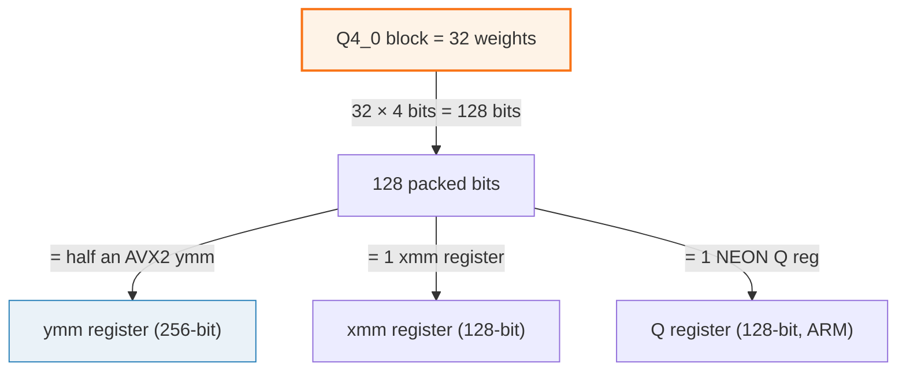

# CPU SIMD — how one instruction multiplies 8 (or 16) weights at once

> Companion: [cpu_simd.py](https://github.com/quanhua92/tutorials/blob/main/local-llm/cpu_simd.py)
> Live: [cpu_simd.html](./cpu_simd.html)

## 0. TL;DR

SIMD = **Single Instruction, Multiple Data**. One CPU instruction operates on
a *vector register* holding N data elements side by side. Scalar code does one
multiply per instruction; SIMD does N multiplies in the same clock — for free.

The Q4_0 block size of 32 weights (see [quant_types](./QUANT_TYPES.md)) is not
an accident: `32 × 4 bits = 128 bits`, which is exactly half an AVX2 `ymm`
register. A whole block's packed nibbles load in one instruction and unpack
into 8 float32 lanes per FMA. The block layout was *designed* for the silicon.

**The one-liner:** SIMD width caps *compute* throughput, but local LLM decode
is *bandwidth*-bound — so memory bandwidth and bpw usually matter MORE than raw
SIMD width. SIMD is the floor; bandwidth is the ceiling.

---

## 1. What it is (lineage old → new, WHY each step)

```mermaid
graph LR
    SCALAR["scalar<br/>(1 elem / op)<br/>the baseline"] -->|widen register| SSE["SSE / MMX<br/>(4 × fp32, 128-bit)<br/>1999"]
    SSE -->|double width| AVX2["AVX2<br/>(8 × fp32, 256-bit ymm)<br/>Haswell 2013"]
    AVX2 -->|double again| AVX512["AVX-512<br/>(16 × fp32, 512-bit zmm)<br/>Zen4 2022"]
    SCALAR -.->|ARM branch| NEON["NEON<br/>(4 × fp32, 128-bit)<br/>all Apple Silicon"]
    NEON -->|scalable width| SVE["SVE<br/>(128–2048-bit)<br/>Graviton4"]
    style SCALAR fill:#161b22,stroke:#8b949e
    style AVX2 fill:#fef3e7,stroke:#f97316,stroke-width:2px
    style AVX512 fill:#fef3e7,stroke:#f97316,stroke-width:3px
    style NEON fill:#eaf2f8,stroke:#2980b9
```



Each step in the lineage **doubles the register width**, which doubles the
lanes, which doubles throughput — at the same clock frequency and the same
pipeline depth. The hardware just replicates the ALU across more lanes. This is
the cheapest performance win in the history of computing: you change the
compiler, not the algorithm.

---

## 2. The mechanism — the Q4_0 dequant inner loop

> From cpu_simd.py Section C:
> ```
>   for each block of 32 weights:
>     1. LOAD scale: d = fp16->fp32(block.d)              [1 broadcast]
>     2. LOAD packed bytes: 16 bytes = 32 nibbles         [1 load]
>     3. UNPACK: split each byte into 2 nibbles            [shuffle]
>        AVX2: _mm256_shuffle_epi8 lookup table
>     4. SUBTRACT 8 + CONVERT to float32                  [_mm256_cvtepi32_ps]
>     5. MUL by scale: w = d * (q-8)                      [_mm256_mul_ps]
>     6. FMA accumulate: acc += w * x                     [_mm256_fmadd_ps]
>   after all blocks: HORIZONTAL SUM the lane accumulator  [_mm256_hadd]
> ```

The hero block (8 weights of a Q4_0 block, `d=0.5`, input `x=[1..8]`):

> From cpu_simd.py Section C:
> ```
> | i | q | q-8 | d*(q-8)  | x | w*x     |
> |---|---|-----|----------|---|----------|
> | 0 | 3 |  -5 |     -2.5 | 1 |     -2.5 |
> | 1 | 7 |  -1 |     -0.5 | 2 |     -1.0 |
> | 2 | 1 |  -7 |     -3.5 | 3 |    -10.5 |
> | 3 | 6 |  -2 |     -1.0 | 4 |     -4.0 |
> | 4 | 9 |   1 |     +0.5 | 5 |     +2.5 |
> | 5 | 2 |  -6 |     -3.0 | 6 |    -18.0 |
> | 6 | 5 |  -3 |     -1.5 | 7 |    -10.5 |
> | 7 | 8 |   0 |     +0.0 | 8 |     +0.0 |
>
> dequant  = [-2.5, -0.5, -3.5, -1.0, +0.5, -3.0, -1.5, +0.0]
> products = [-2.5, -1.0, -10.5, -4.0, +2.5, -18.0, -10.5, +0.0]
> dot      = -44.0
> ```

In scalar code this is a loop. In AVX2 the **entire dequant+mul+accumulate of
all 8 elements collapses into ~3 instructions**: one shuffle (unpack), one
`mul_ps` (scale), one `fmadd_ps` (accumulate). The horizontal sum at the end
reduces the lane vector back to a single scalar dot product.

---

## 3. ISA comparison — register width × element size = lanes

> From cpu_simd.py Section B:
> ```
> | ISA      | reg type    | bits  | float32 lanes | Q4 elem/lane | available on                     |
> |----------|-------------|-------|---------------|--------------|----------------------------------|
> | AVX2     | __m256i     |   256 |             8 |           64 | Intel Haswell (2013)+, AMD Zen (2017)+ |
> | AVX-512  | __m512i     |   512 |            16 |          128 | Intel Xeon Scalable, AMD Zen4 (2022)+ |
> | NEON     | uint8x16_t  |   128 |             4 |           32 | ARM: all Apple Silicon, mobile, Graviton |
> | SVE      | svint8_t    |   128 |             4 |           32 | ARM Neoverse V2, AWS Graviton4 (scalable) |
> ```

Read the table **two ways**:
- **For the dot product (fp32 FMA):** the `float32 lanes` column matters.
  AVX-512 = 16×, AVX2 = 8×, NEON = 4×.
- **For the unpack (nibble shuffle):** the `Q4 elem/lane` column matters. A
  single AVX2 register holds **64 packed nibbles** at once — a whole Q4_0 block
  plus its neighbor in one register.

### Why the block size is 32



The legacy GGUF block size of 32 was chosen so that `32 × 4 bits = 128 bits`
fits exactly into a 128-bit SSE/NEON register, and two blocks pack into a
single 256-bit AVX2 `ymm`. The K-quants doubled the block to 256 (`QK_K`) to
hold 8 sub-blocks — but each sub-block is still 32, still 128 bits, still
SIMD-width.

---

## 4. Worked example — scalar vs SIMD op count

> From cpu_simd.py Section D:
> ```
> SCALAR (no FMA):
>   8 multiplies + 7 adds = 15 ops
>   dot = -44.0
>
> SCALAR + FMA (acc = fma(w,x,acc)):
>   8 FMA instructions, 0 horizontal sums = 8 ops
>   dot = -44.0
>
> SIMD vector kernels (the SAME dot product, vectorized):
>
> | ISA      | lanes | load | dequant | fma | hsum | total | speedup vs scalar |
> |----------|-------|------|---------|-----|------|-------|-------------------|
> | AVX2     |     8 |    1 |       3 |   1 |    1 |     7 |             2.1x |
> | AVX-512  |    16 |    1 |       3 |   1 |    1 |     7 |             2.1x |
> | NEON     |     4 |    1 |       6 |   2 |    1 |    11 |             1.4x |
> ```

On 8 elements the speedup looks compressed because the **horizontal-sum and
load overhead is fixed** — you pay it once regardless of lane width. The real
win shows up on the production block of 32:

> From cpu_simd.py Section D:
> ```
> Real production block (32 weights = full Q4_0 block):
> | ISA      | lanes | fma ops | speedup vs scalar(32) |
> |----------|-------|---------|-----------------------|
> | AVX2     |     8 |       4 |                   3.3x |
> | AVX-512  |    16 |       2 |                   5.7x |
> | NEON     |     4 |       8 |                   1.8x |
> ```

AVX-512 issues **2 FMAs** for a full block where AVX2 needs 4 and NEON needs 8.
That is the raw compute advantage, before memory bandwidth enters the chat.

---

## 5. Pitfalls (trap | symptom | fix)

| Trap | Symptom | Fix |
|---|---|---|
| **Wrong build flags** | Binary built on an old CPU runs at half speed on a Zen4 / Sapphire Rapids box (falls back to AVX2 silently) | `GGML_NATIVE=ON` (auto-detect) or explicitly `GGML_AVX512=ON`. Verify with `cat /proc/cpuinfo \| grep avx512` then `llama-cli --version` shows the build flags. |
| **Cloud AVX-512 SIGILL** | GCP Cloud Run / some Kubernetes nodes report AVX-512 in CPUID but trap on the instructions → `SIGILL` crash on first matmul | `GGML_AVX512=OFF` to force AVX2 path, or pin node CPU family to one without AVX-512. [haitmg.pl writeup](https://haitmg.pl/blog/cloud-run-sigill-avx512-llama-cpp/) |
| **Confusing fp32 lanes with nibble lanes** | Expecting 64× speedup on Q4 because "64 nibbles per AVX2 register" | The FMA runs on **dequantized float32** — only 8 lanes per AVX2 ymm. The 64-nibble figure is for the *unpack shuffle*, not the *compute*. |
| **Thinking Apple Silicon is slow** | M2 looks 4× weaker than AVX-512 (NEON 128-bit vs zmm 512-bit) | Decode is bandwidth-bound, not compute-bound. Apple unified memory (~100 GB/s) compensates. A Q4_0 model often matches a Xeon at the same bpw. |
| **Ignoring the horizontal sum** | Computing per-block dot products and summing them scalarly in a loop | The `hadd` reduction is real overhead. Batch blocks and use `_mm256_hadd` trees, or let ggml's `vec_dot` kernels handle it. |
| **Forgetting FMA = 1 op** | Counting multiply and add as separate ops in the SIMD kernel | `_mm256_fmadd_ps` is a single fused instruction: `acc = w*x + acc`. AVX2+ hardware always has FMA; count it as 1, not 2. |

---

## 6. Practical config

```bash
# Auto-detect best ISA for THIS machine (recommended for local builds)
cmake -B build -DGGML_NATIVE=ON

# Force AVX-512 (when distributing to known-good Zen4 / Sapphire Rapids)
cmake -B build -DGGML_NATIVE=OFF -DGGML_AVX512=ON -DGGML_AVX2=ON

# Disable AVX-512 (cloud SIGILLA workaround, or old hardware)
cmake -B build -DGGML_NATIVE=OFF -DGGML_AVX512=OFF

# Verify what ggml picked at runtime
./build/bin/llama-cli --version    # prints build flags incl. AVX2/AVX-512
```

Apple Silicon builds use NEON + AMX (Apple Matrix Coordenator) automatically;
there are no flags to toggle. ARM server builds (Graviton) use NEON, and
Neoverse V2+ additionally get SVE.

---

## 7. Cheat sheet

| Quantity | Scalar | AVX2 | AVX-512 | NEON |
|---|---|---|---|---|
| Register width | 32 bit | 256 bit | 512 bit | 128 bit |
| Float32 lanes | 1 | **8** | **16** | 4 |
| FMA ops per 32-weight block | 32 | 4 | **2** | 8 |
| Q4 nibbles per register | 1 | 64 | 128 | 32 |
| Dominant platform | (none) | x86 baseline | Zen4, Xeon Scalable | Apple, ARM servers |

- **Block size 32 = 128 bits** = half an AVX2 `ymm` = one NEON `Q`. Not a coincidence.
- **FMA counts as one instruction**, not two. AVX2+ always has fused multiply-add.
- **Decode is bandwidth-bound.** SIMD is the floor, not the ceiling. See [quant_types](./QUANT_TYPES.md) §F: decode speed ≈ 1/bpw.
- **`GGML_NATIVE=ON`** is almost always the right choice for a local build.
- **AVX-512 doubles AVX2 lanes** — 16 vs 8 — at the same clock, on supported CPUs.

---

## 🔗 Cross-references

- [quant_types](./QUANT_TYPES.md) — the block size of 32 is *why* SIMD matters: `32 × 4 bits = 128 bits` matches the register width. Q4_0/Q4_K_M/IQ3_S all inherit this 32-element sub-block.
- [threading](./THREADING.md) 🔗 — SIMD is per-core; threading spreads blocks across cores. SIMD × threads = full CPU utilization. (upcoming)
- [mmap_weights](./MMAP_WEIGHTS.md) — decode bandwidth comes from mmap'd weights feeding the SIMD kernel; the two are a pipeline.
- [gpu_offload](./GPU_OFFLOAD.md) — when SIMD isn't enough, offload layers to the GPU; the CPU fallback path is exactly this SIMD kernel.

---

## Sources

- [ggml-cpu quants.c](https://github.com/ggml-org/llama.cpp/tree/master/ggml/src/ggml-cpu) — the real `vec_dot_q4_0_q8_0` intrinsic kernels (AVX2/AVX-512/NEON branches).
- [Intel SDM Vol 1](https://www.intel.com/sdm) — register widths (`__m256i` 256-bit, `__m512i` 512-bit), FMA instruction semantics.
- [ARM NEON Intrinsics Reference](https://developer.arm.com/architectures/instruction-sets/intrinsics/) — 128-bit `uint8x16_t`, `float32x4_t` on all Apple Silicon.
- [ARM SVE Reference](https://developer.arm.com/architectures/instruction-sets/sve) — scalable 128–2048-bit vectors on Neoverse V2 / Graviton4.
- [justine.lol/matmul](https://justine.lol/matmul/) — llamafile CPU matmul optimization writeup (AVX2/AVX-512/NEON performance comparison).
- [Cloud Run SIGILL: Sapphire Rapids Broke llama.cpp AVX-512](https://haitmg.pl/blog/cloud-run-sigill-avx512-llama-cpp/) — the CPUID-vs-trap cloud gotcha.
- [Optimizing SLMs on Intel Xeon (community.intel.com)](https://community.intel.com/t5/Blogs/Tech-Innovation/Artificial-Intelligence-AI/Optimizing-SLMs-on-Intel-Xeon-Processors-A-llama-cpp-Performance/post/1734305) — AVX-512 / AMX on Xeon for GGUF inference.
