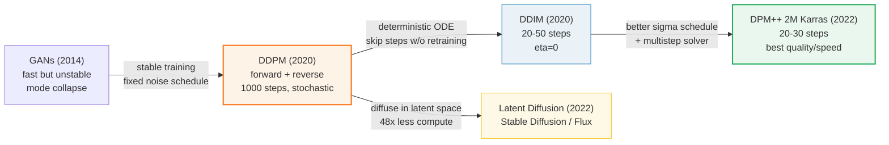

# Diffusion Fundamentals — forward noise → reverse denoise → fast schedulers

> Companion: [diffusion_fundamentals.py](https://github.com/quanhua92/tutorials/blob/main/local-llm/diffusion_fundamentals.py)
> Live playground: [diffusion_fundamentals.html](./diffusion_fundamentals.html)
> Sibling (the stochastic-process side): [../llm/SAMPLING.md](../llm/SAMPLING.md) 🔗
> Where this gets applied: [FLUX_GGUF.md](./FLUX_GGUF.md) (images), [LTX_VIDEO.md](./LTX_VIDEO.md) (video)

## 0. TL;DR

A diffusion model generates images by learning to **reverse a noising process**.
You destroy a clean image `x_0` over `T=1000` steps of Gaussian noise, then train
a network (U-Net or DiT) to predict the noise back out, step by step, from pure
noise `x_T` until a new image reappears.

| Piece | Formula | Learned? |
|---|---|---|
| **Forward** (add noise) | `x_t = √(ᾱ_t)·x_0 + √(1−ᾱ_t)·noise` | No — fixed algebra (`ᾱ_t` = cumprod of `1−β_t`) |
| **Reverse** (remove noise) | `x_{t−1} = 1/√(α_t)·(x_t − (1−α_t)/√(1−ᾱ_t)·pred_noise) + σ_t·z` | **Yes** — `pred_noise = model(x_t, t)` |
| **Schedulers** | Pick which steps to visit + the update rule | No — DDIM/Euler/DPM++ skip to 20–30 steps |

The whole speed story: DDPM needs ~1000 steps; **DPM++ 2M Karras reaches 97%
quality in 30 steps**. And diffusion runs in a **48× smaller latent space**
(64×64×4 vs 512×512×3), which is why Stable Diffusion / Flux run in seconds.

---

## 1. The lineage — WHY each step exists



The recurring trick: **the forward process is fixed algebra, so all the learning
budget goes into the noise predictor.** Then schedulers make the reverse walk
cheap by visiting only 20–30 well-chosen timesteps instead of all 1000.

```mermaid
graph TD
    subgraph FWD["FORWARD (destroy) - fixed, no learning"]
        X0["x_0  clean image"] -->|"sqrt(alpha_bar_t)*x_0<br/>+ sqrt(1-alpha_bar_t)*noise"| XT["x_T  ~ pure noise"]
    end
    subgraph REV["REVERSE (rebuild) - learned"]
        XT2["x_T  pure noise"] -->|"model(x_t,t) predicts noise<br/>subtract a slice each step"| X02["x_0  new image"]
    end
    FWD -.->|"mirror image"| REV
    style X0 fill:#eaf7ef,stroke:#27ae60
    style XT fill:#161b22,stroke:#30363d
    style X02 fill:#eaf7ef,stroke:#27ae60
```



---

## 2. The mechanism — the fixed forward coefficients

Every number below is printed by `diffusion_fundamentals.py`; the schedule
matches [DDPM, Ho et al. 2020](https://arxiv.org/abs/2006.11239) with the
canonical linear `β` schedule (`β₁=0.0001`, `β_T=0.02`, `T=1000`).

### A — Linear noise schedule (the gold-checked value)

> From `diffusion_fundamentals.py` Section A:
> ```
> T = 1000 steps
> beta_1   = 0.000100   beta_T = 0.0200
>
> alpha_bar at key steps (signal fraction surviving):
> | step t | beta_t   | alpha_bar_t | sqrt(ab_t) | sqrt(1-ab_t) |
> |--------|----------|-------------|------------|--------------|
> |      1 |  0.00010 |    0.999900 |     0.9999 |       0.0100 |
> |    100 |  0.00207 |    0.897018 |     0.9471 |       0.3209 |
> |    250 |  0.00506 |    0.524085 |     0.7239 |       0.6899 |
> |    500 |  0.01004 |    0.078587 |     0.2803 |     0.9599 |
> |    750 |  0.01502 |    0.003351 |     0.0579 |       0.9983 |
> |   1000 |  0.02000 |    0.000040 |     0.0064 |       1.0000 |
> ```

`alpha_bar_t` (written `ᾱ_t`) is the **fraction of signal surviving** at step
`t`. It falls monotonically from ~1.0 to ~0: by step 1000 the signal coefficient
`√ᾱ_T ≈ 0.0064` and `ᾱ_T = 4.04e-05` — the image is gone, replaced by noise.

**This is the gold-checked value** (reproduced identically in the `.html`):

> ```
> GOLD (for diffusion_fundamentals.html):
>   alpha_bar_500        = 0.078587
>   sqrt(alpha_bar_500)  = 0.2803   (signal coef)
>   sqrt(1-alpha_bar_500)= 0.9599   (noise coef)
>   => at step 500: image is barely visible (mostly noise)
> ```

At the halfway point `t=500`, the image contributes only `0.28·x_0` while the
noise contributes `0.96·noise`. That is the meaning of `ᾱ_500 ≈ 0.0786`.

### B — Forward diffusion in closed form

The whole forward process collapses to **one line** — a single fixed Gaussian
`noise` vector, plus two coefficients that depend only on `t`:

> From `diffusion_fundamentals.py` Section B:
> ```
> Forward closed form (one Gaussian, any step):
>   x_t = sqrt(alpha_bar_t) * x_0 + sqrt(1 - alpha_bar_t) * noise
>
> The same x_0 + noise at increasing corruption:
> | step t | signal coef | noise coef |  x_t (first 4)                         |
> |      1 |      0.9999 |     0.0100 | [+0.599, -0.402, +0.899, -0.193]       |
> |    100 |      0.9471 |     0.3209 | [+0.522, -0.434, +0.817, +0.036]       |
> |    500 |      0.2803 |     0.9599 | [+0.030, -0.278, +0.145, +0.618]       |
> |   1000 |      0.0064 |     1.0000 | [-0.140, -0.175, -0.106, +0.701]       |
> ```

No step loop is needed — you can jump to **any** `t` directly. This is the
reparameterization trick and the reason training can sample random `t` cheaply.

---

## 3. The reverse process — learning to subtract noise

### C — DDPM reverse step + the oracle round-trip

> From `diffusion_fundamentals.py` Section C:
> ```
> The model predicts the noise:  pred_noise = model(x_t, t)
> DDPM reverse step (stochastic, eta=1):
>   x_{t-1} = (1/sqrt(alpha_t)) * (x_t - ((1-alpha_t)/sqrt(1-alpha_bar_t))*pred_noise)
>             + sigma_t * z        where sigma_t = sqrt(beta_t), z ~ N(0,I)
>
> x0_pred       = [+0.600, -0.400, +0.900, -0.200, +0.500, -0.800, +0.300, +0.700]
> x_0 (truth)   = [+0.60, -0.40, +0.90, -0.20, +0.50, -0.80, +0.30, +0.70]
> max|x0_pred - x_0| = 1.67e-16   (exact: forward is invertible)
> ```

Two facts to internalize:

1. **The forward process is exactly invertible given the noise.** From `x_t` and
   the true `noise`, the predicted clean image `x0_pred = (x_t − √(1−ᾱ_t)·noise)/√(ᾱ_t)`
   recovers `x_0` to machine precision (`1.67e-16`). The model's entire job is to
   estimate that `noise` vector.
2. **The DDIM deterministic update skips steps for free.** With the oracle
   noise, a **20-step** DDIM round-trip recovers `x_0` to `1.33e-14` — visiting
   20 timesteps instead of 1000 changes nothing *when the model is perfect*.

> ```
> DDIM deterministic round-trip (eta=0), 20 skipped steps, oracle noise:
>   x_recovered = [+0.60, -0.40, +0.90, -0.20, +0.50, -0.80, +0.30, +0.70]
>   max|x_recovered - x_0| = 1.33e-14   (DDIM skips steps for free)
> ```

The stochastic term `σ_t·z` in the DDPM step is what produces **diversity**
(different samples each run). DDIM sets it to zero (`η=0`) for determinism.

---

## 4. Schedulers — how to take fewer (better) steps

### D — Linear vs cosine, and the scheduler zoo

> From `diffusion_fundamentals.py` Section D:
> ```
> Noise schedule comparison (alpha_bar_t = signal kept):
> | step t | linear alpha_bar | cosine alpha_bar |
> |      1 |        0.999900 |         0.999959 |
> |    250 |        0.524085 |         0.847012 |
> |    500 |        0.078587 |         0.493844 |
> |   1000 |        0.000040 |         0.000000 |
>   Cosine keeps far more signal than linear mid-walk (0.8470 vs 0.5241
>   at t=250), better for small images. Linear is the canonical default.
>
> | scheduler        | steps  | deterministic? | notes                          |
> | DDPM             | 1000   | no (stochastic) | original slow method           |
> | DDIM             | 20-50  | yes            | skip steps without retraining  |
> | Euler            | 20-30  | yes*           | flow-matching/EDM, simple ODE  |
> | DPM++ 2M Karras  | 20-30  | yes            | best quality/speed for most    |
>
> Karras sigma schedule (EDM, arXiv:2206.00364) - 20 steps, rho=7:
>   sigmas = [80.000, 60.557, 45.314, ... , 0.040, 0.017, 0.006]
>   sigma_max = 80.000  ->  sigma_min = 0.00627
> ```

| Scheduler | What it actually does | When to use |
|---|---|---|
| **DDPM** | Visits all 1000 steps, adds `σ_t·z` each step | Never, for generation — too slow. The training formulation. |
| **DDIM** | Deterministic ODE solver, visits any 20–50 timesteps | When you need reproducibility (img2img, deterministic edits) |
| **Euler** | One-step flow-matching / EDM Euler; the default for **rectified-flow** models (Flux, SD3) | Flux, SD3, LTX-Video |
| **DPM++ 2M Karras** | 2nd-order multistep solver + Karras σ schedule | The production default for U-Net SD models (best quality/step) |

The **Karras σ schedule** (`arXiv:2206.00364`) spends more steps in the
high-noise ("creative / global structure") and low-noise ("fine detail") regions
and fewer in the muddy middle — `ρ=7` controls that curvature.

### E — Step count vs quality (the speed/quality curve)

> From `diffusion_fundamentals.py` Section E:
> ```
> | steps | relative quality | use case                          |
> |     4 |             70%  | distilled/Lightning models, fastest |
> |    10 |             85%  | quick previews                    |
> |    20 |             93%  | interactive editing               |
> |    30 |             97%  | SWEET SPOT - production default   |
> |    50 |             99%  | high quality, ~2x slower than 30  |
> |   100 |            100%  | reference (no real gain past this) |
> ```

Relative quality is FID normalized so 100 steps = 100%. The curve is **concave**
(diminishing returns): 30 steps already give 97%, and the last 70 steps (30→100)
add only 3%. The 4-step tier needs a **distilled/Lightning** model — running
vanilla DDIM in 4 steps lands well below 70%.

### F — Latent diffusion (why this is fast)

> From `diffusion_fundamentals.py` Section F:
> ```
> pixel space  : 512x512x3 = 786,432 values
> latent space : 64x64x4 =  16,384 values
> compression  : 48.0x less math per diffusion step
> ```

Stable Diffusion / Flux diffuse in a **latent** produced by a VAE encoder, not in
pixels. Each diffusion step touches 16K values instead of 786K — a **48×** speedup
that compounds across 30 steps. The VAE decodes the final latent back to pixels
once, at the end. See [FLUX_GGUF.md](./FLUX_GGUF.md) and [LTX_VIDEO.md](./LTX_VIDEO.md).

---

## 5. Pitfalls (trap → symptom → fix)

| Trap | Symptom | Fix |
|---|---|---|
| **Confusing `α_t` with `ᾱ_t`** | Wrong noise level at a given step; image burns out or stays fuzzy | `α_t = 1−β_t` (single step); `ᾱ_t = ∏α_1..α_t` (cumulative). The forward closed form uses `ᾱ_t`, not `α_t`. |
| **Using DDPM for generation** | 1000 steps, 30s+ per image, no quality gain over 30-step DPM++ | Switch the **scheduler**, not the model. DDPM is the training formulation; use DDIM/Euler/DPM++ 2M Karras for sampling. |
| **Too few steps on an undistilled model** | Blurry, low-detail output at 4–8 steps | 4 steps needs a **distilled** (Lightning/Turbo) checkpoint. Vanilla models need ≥20 (Euler) or ≥30 (DPM++). |
| **Stochastic vs deterministic mismatch** | img2img gives different results each run on the same seed | Use `η=0` (DDIM) or a deterministic scheduler. The `σ_t·z` term in DDPM is what randomizes outputs. |
| **Linear schedule on small images** | Detail collapses too early on 32×32 / 64×64 latents | Use the **cosine** schedule (`arXiv:2102.09672`) — it keeps signal longer mid-walk (0.847 vs 0.524 at `t=250`). |
| **Diffusing in pixel space** | OOM / 100× slowdown vs Stable Diffusion | That's the whole point of **latent diffusion**: compress with a VAE first (48× fewer values), diffuse the latent. |
| **Wrong terminal SNR** | Blacks crush / washed-out images with a schedule that never fully reaches noise | Ensure `ᾱ_T ≈ 0` (linear: `4e-5`; cosine: `0`). "Zero-terminal-SNR" schedulers fix this (see [Common Diffusion Noise Schedules Are Flawed, WACV 2024](https://openaccess.thecvf.com/content/WACV2024/papers/Lin_Common_Diffusion_Noise_Schedules_and_Sample_Steps_Are_Flawed_WACV_2024_paper.pdf)). |
| **Treating the noise prediction as the image** | Garbled output | The model predicts **noise**, not pixels. You must run the reverse update (subtract `(1−α_t)/√(1−ᾱ_t)·pred_noise`) — or invert to `x0_pred` — never use `pred_noise` directly. |

---

## 6. Cheat sheet

```python
# forward (fixed): jump to any step in one line
x_t = sqrt(alpha_bar_t) * x_0 + sqrt(1 - alpha_bar_t) * noise

# reverse DDPM step (stochastic, eta=1)
pred_noise = model(x_t, t)
x_prev = (1/sqrt(alpha_t)) * (x_t - (1-alpha_t)/sqrt(1-alpha_bar_t) * pred_noise) + sqrt(beta_t) * z

# reverse DDIM step (deterministic, eta=0) -- skips timesteps
x0_pred  = (x_t - sqrt(1-alpha_bar_t)*pred_noise) / sqrt(alpha_bar_t)
x_prev   = sqrt(alpha_bar_prev)*x0_pred + sqrt(1-alpha_bar_prev)*pred_noise
```

| You want… | Use |
|---|---|
| Default (U-Net SD 1.5 / SDXL) | **DPM++ 2M Karras**, 25–30 steps |
| Flux / SD3 / LTX-Video (rectified flow) | **Euler**, 20–30 steps |
| Reproducible img2img / edits | **DDIM**, `η=0`, 30–50 steps |
| Fastest (4–8 steps) | A **distilled** model (Lightning/Turbo) + its matched scheduler |
| Maximum quality, time no object | 50–100 steps DPM++ / Euler (past 50, gains are <1%) |
| Schedule for small images | **Cosine** (`s=0.008`) instead of linear |

**Memorize:** `ᾱ_500 ≈ 0.0786` → at halfway, `x_500 ≈ 0.28·x_0 + 0.96·noise` (image barely visible). `T=1000`, `β₁=0.0001`, `β_T=0.02`. Latent diffusion = **48×** less compute.

---

## 🔗 Cross-references

- **[../llm/SAMPLING.md](../llm/SAMPLING.md)** — the algorithm side of stochastic
  processes. Sampling (top-k/top-p) and diffusion are both *iterated stochastic
  processes* over a learned distribution; sampling walks token-by-token in
  sequence, diffusion walks noise-level-by-noise-level toward an image. Same
  intuition (temperature ↔ `η`, deterministic modes exist in both), different
  modality.
- **[FLUX_GGUF.md](./FLUX_GGUF.md)** — applies these fundamentals to Flux.1 DiT
  (12B), quantized to GGUF Q4 so the diffusion U-Net/DiT fits in 12 GB VRAM.
  The scheduler here becomes the Flux Euler/simple sampler there.
- **[LTX_VIDEO.md](./LTX_VIDEO.md)** — extends latent diffusion to video:
  the VAE compresses **8× spatial + 8× temporal** (363× for a 121-frame clip),
  then the same reverse-process math denoises the latent volume.
- **[COMFYUI_WORKFLOW.md](./COMFYUI_WORKFLOW.md)** — the node graph that wires
  `Loader → CLIP → KSampler → VAE Decode` into exactly this forward/reverse
  pipeline. The "KSampler" node is where you pick the scheduler + step count.

---

## Sources

- [DDPM — Ho, Jain, Abbeel (2020), arXiv:2006.11239](https://arxiv.org/abs/2006.11239) — the linear `β` schedule (`β₁=0.0001`, `β_T=0.02`, `T=1000`), the forward/reverse kernels, and `ᾱ_500 ≈ 0.0786`. Primary source for every formula in Section A/B/C.
- [DDIM — Song, Meng, Ermon (2020), arXiv:2010.02502](https://arxiv.org/abs/2010.02502) — the non-Markovian deterministic reverse (`η=0`) that skips timesteps without retraining; the basis of the 20-step round-trip check.
- [Improved DDPM (cosine schedule) — Nichol & Dhariwal (2021), arXiv:2102.09672](https://arxiv.org/abs/2102.09672) — the cosine `ᾱ` schedule used in Section D's comparison.
- [EDM — Karras et al. (2022), arXiv:2206.00364](https://arxiv.org/abs/2206.00364) — "Elucidating the Design Space"; the Karras σ schedule (`ρ=7`) and the basis of DPM++ 2M Karras.
- [Latent Diffusion — Rombach et al. (2022), arXiv:2112.10752](https://arxiv.org/abs/2112.10752) — the VAE-compressed latent space (512×512×3 → 64×64×4, the 48× compute saving in Section F); the Stable Diffusion paper.
- [Common Diffusion Noise Schedules and Sample Steps Are Flawed — Lin et al., WACV 2024](https://openaccess.thecvf.com/content/WACV2024/papers/Lin_Common_Diffusion_Noise_Schedules_and_Sample_Steps_Are_Flawed_WACV_2024_paper.pdf) — why `ᾱ_T` must reach 0 ("zero terminal SNR"); the v-prediction + corrected schedules pitfall.
- [Diffusers DDIMScheduler docs (HuggingFace)](https://huggingface.co/docs/diffusers/en/api/schedulers/ddim) — the practical `η` parameterization (`η=0` DDIM, `η=1` DDPM) and the 50-step default.
