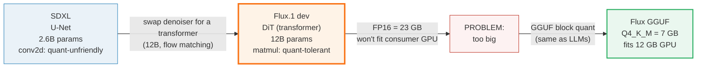
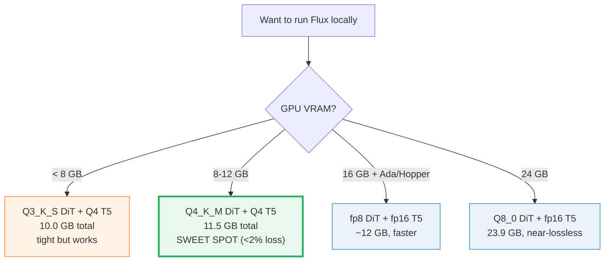

# Flux GGUF — running a 12B image model on a 6–12 GB GPU

> Companion: [flux_gguf.py](https://github.com/quanhua92/tutorials/blob/main/local-llm/flux_gguf.py)
> Live playground: [flux_gguf.html](./flux_gguf.html)
> Sibling (the block format): [QUANT_TYPES.md](./QUANT_TYPES.md) 🔗 — the same GGUF Q4_K_M blocks, applied to a transformer

## 0. TL;DR

**Flux.1 [dev]** is a **12-billion-parameter** image generator that uses a
**Diffusion Transformer (DiT)** instead of the U-Net in SD 1.5 / SDXL. At full
precision its weights are **23 GB** — only a 24 GB GPU (RTX 3090/4090) can hold
them. **GGUF quantization** (the same block format LLMs use) shrinks the DiT so
Flux fits on ordinary consumer GPUs:

| DiT quant | File size | Quality loss | Total VRAM (full gen) | GPU you need |
|---|---|---|---|---|
| **FP16** | 23 GB | reference | 34.9 GB | 24 GB+ (3090/4090) |
| **Q8_0** | 12 GB | <1% | 23.9 GB (fp16 T5) | 24 GB |
| **Q4_K_M** | 7 GB | ~2% | 11.5 GB (Q4 T5) | **12 GB (sweet spot)** |
| **Q4_K_S** | 6.5 GB | ~2% | 11.0 GB | 12 GB |
| **Q3_K_S** | 5.5 GB | ~4% | 10.0 GB | 12 GB (headroom) |

The key trick: **Flux is a transformer, and transformers tolerate 4-bit weight
quantization far better than the conv2d layers in a U-Net.** 4-bit Flux is
excellent; 4-bit SDXL is mush.

---

## 1. The lineage — WHY each step exists



**The single insight: transformer matmuls are quant-tolerant.** A U-Net's small
conv kernels (3×3) have few weights each, so 4-bit rounding dominates. A DiT's
large matmuls have thousands of weights contributing to each output, so
individual rounding errors average out. Same GGUF block format, totally different
quality outcome.

---

## 2. The mechanism — architecture + VRAM math

Every number below is printed by `flux_gguf.py`. File sizes are the actual
checkpoints from [city96/FLUX.1-dev-gguf](https://huggingface.co/city96/FLUX.1-dev-gguf)
on HuggingFace.

### A — Flux architecture: DiT, not U-Net

> From `flux_gguf.py` Section A:
> ```
> Component breakdown:
>   DiT denoiser   : 12.0B params  (the big one, 12B)
>   T5-XXL encoder : 4.7B params  (256-token context)
>   CLIP-L encoder : 0.4B params  (small, always fp16)
>   VAE            : decodes latent -> pixel (always fp16/fp32)
>
> Full-precision weight sizes:
>   DiT  fp16 = 24.0 GB   (12B x 2 bytes)
>   T5   fp16 = 9.4 GB    (4.7B x 2 bytes)
>   Total     = 33.4 GB (before VAE + activations)
> ```

The DiT is **4.6×** larger than SDXL's U-Net (12B vs 2.6B). Flux uses **flow
matching** (not DDPM): a straighter sampling trajectory that needs fewer steps
(20–28 vs SDXL's 30–50). The DiT denoises in **latent space**, not pixel space.

### B — VAE compression: why 12B is affordable at all

> From `flux_gguf.py` Section B:
> ```
> Pixel space : 1024x1024x3 =  3,145,728 values
> Latent space: 128x128x16 =    262,144 values
>
> Spatial downsample = 1024/128 = 8x per axis
>   -> 8x8 = 64x fewer spatial positions
> Channel expansion   = 16/3 = 5.33x
> Net compression     = 64/5.33 = 12.0x
>
> Attention sequence length:
>   if DiT saw pixels : 1,048,576 tokens  (1024x1024)
>   in latent space   :   16,384 tokens  (128x128)
>   -> 64x shorter sequence = 4096x less attention compute
> ```

This is the **gold-checked value** the HTML playground reproduces:

> From `flux_gguf.py` Section B (gold):
> ```
> GOLD: compression = 1024*1024*3 / (128*128*16)
>                    = 3,145,728 / 262,144
>                    = 12.0x
> ```

The VAE compresses the 1024×1024×3 image into a 128×128×16 latent (8× spatial,
16 channels). The DiT never sees pixels — it works in this 12× smaller latent
space. Without the VAE, the DiT's attention would be 64× longer (1M vs 16K
tokens) and **4096×** more expensive.

### C — The size problem

> From `flux_gguf.py` Section C:
> ```
> Flux DiT at FP16 = 12B params x 2 bytes = 24 GB (actual checkpoint: 23 GB)
>
> Consumer GPU VRAM tiers (2024-2026):
>   GPU               VRAM  Fits FP16?
>   ---------------- -----  ----------
>   GTX 1060            6GB          no
>   RTX 3060/4060       8GB          no
>   RTX 3060 12GB      12GB          no
>   RTX 4070           12GB          no
>   RTX 4080           16GB          no
>   RTX 3090/4090      24GB         YES
> ```

Only 24 GB GPUs can hold the FP16 model + T5 + VAE + activations. Everyone else
needs quantization.

### D — GGUF quant levels

> From `flux_gguf.py` Section D:
> ```
> | level    | file size | eff bpw | quality loss | min GPU |
> |----------|-----------|---------|--------------|---------|
> | FP16     |  23.0 GB |  15.33 |   ~0.0%      |  24 GB  |
> | Q8_0     |  12.0 GB |   8.00 |   ~0.5%      |  12 GB  |
> | Q4_K_M   |   7.0 GB |   4.67 |   ~1.8%      |   8 GB  |
> | Q4_K_S   |   6.5 GB |   4.33 |   ~2.0%      |   8 GB  |
> | Q3_K_S   |   5.5 GB |   3.67 |   ~4.0%      |   6 GB  |
> ```

Effective bpw = `file_GB × 8 / 12B`. It is slightly below the **structural** bpw
from [QUANT_TYPES.md](./QUANT_TYPES.md) (Q8_0 = 8.5, Q4_K_M = 4.84) because the
checkpoint keeps a few sensitive layers (embeddings, output) at higher precision.

**Why GGUF works for Flux but NOT for SDXL:**
Flux = DiT (transformer): dense matmuls, very quant-tolerant. SDXL = U-Net
(conv2d): conv kernels degrade fast below 8-bit. Same bytes, different arch.

---

## 3. VRAM budget — the full accounting

File size is **not** the VRAM cost. You also need the text encoder (T5), the VAE,
and intermediate activations. The T5 encoder can be quantized **separately** from
the DiT (it's a different model file), which swings the budget by ~7 GB.

> From `flux_gguf.py` Section E:
> ```
> T5 fp16 = 9.4 GB    (best text adherence)
> T5 Q4   = 2.0 GB    (saves 7.4 GB, minor text quality loss)
>
> | DiT quant | DiT   | T5    | VAE  | act  | TOTAL  | fits GPU |
> |-----------|-------|-------|------|------|--------|----------|
> | FP16      | 23.0G |  9.4G | 0.5G | 2.0G |  34.9G |    24 GB |
> | Q8_0      | 12.0G |  9.4G | 0.5G | 2.0G |  23.9G |    24 GB |
> | Q4_K_M    |  7.0G |  2.0G | 0.5G | 2.0G |  11.5G |    12 GB |
> | Q4_K_S    |  6.5G |  2.0G | 0.5G | 2.0G |  11.0G |    12 GB |
> | Q3_K_S    |  5.5G |  2.0G | 0.5G | 2.0G |  10.0G |    12 GB |
> ```

The DiT is the dominant term, but the **T5 choice swings the budget by ~7 GB**.
Pairing a Q4 DiT with a Q4 T5 lets Flux run comfortably on a 12 GB GPU.

---

## 4. fp8 vs GGUF — two paths to lower VRAM

> From `flux_gguf.py` Section F:
> ```
> |              | FP8                          | GGUF                        |
> |--------------|------------------------------|-----------------------------|
> | format       | 8-bit float (e4m3/e5m2)      | block quant (Q4-Q8)         |
> | VRAM         | ~12 GB (same as Q8_0)        | 6.5-12 GB (pick your level) |
> | speed        | FASTER (native fp8 matmul)   | SLOWER (dequant on the fly) |
> | hardware     | Ada/Hopper+ ONLY (RTX 40+)   | ANY GPU (even old Maxwell)   |
> | quality      | ~1% loss (good)              | <1%-4% (depends on level)    |
> | comfyUI      | built-in (LoadDiffusionModel)| ComfyUI-GGUF custom node     |
> ```

- **fp8** = fast + needs new hardware (Ada/Hopper) + one size (~12 GB).
- **GGUF** = slower + works everywhere + you pick the size (6.5–12 GB).

---

## 5. Worked example — pick a config

> From `flux_gguf.py` Section G:
> ```
> | Your GPU     | DiT quant | T5 quant | Total VRAM | Quality     |
> |--------------|-----------|----------|------------|-------------|
> | 24 GB (3090/4090) | FP16  | fp16     |    34.9 GB | reference   |
> | 24 GB (3090/4090) | Q8_0  | fp16     |    23.9 GB | near-lossless|
> | 24 GB (3090/4090) | Q8_0  | Q4       |    16.5 GB | near-lossless|
> | 12 GB (3060 12G)  | Q4_K_M| Q4       |    11.5 GB | excellent   |
> | 12 GB (3060 12G)  | Q4_K_S| Q4       |    11.0 GB | very good   |
> | 12 GB (3060 12G)  | Q3_K_S| Q4       |    10.0 GB | good (headroom)|
> ```

Decision tree:



---

## 6. Pitfalls (trap → symptom → fix)

| Trap | Symptom | Fix |
|---|---|---|
| **Confusing DiT file size with total VRAM** | Q4_K_M is 7 GB but OOMs on a 12 GB card | The 7 GB is the DiT *weights only*. Add T5 (2–9.4 GB), VAE (0.5 GB), activations (2 GB). Budget 11.5 GB total for Q4_K_M + Q4 T5. |
| **Forgetting to quantize T5 separately** | Q4 DiT still OOMs because T5 fp16 eats 9.4 GB | The DiT and T5 are separate model files. Quantize BOTH. Use `t5-v1_1-xxl-encoder-Q4_K_S.gguf` from city96's HF repo. |
| **Assuming GGUF = faster** | GGUF Q8 slower than fp8 on RTX 4090 | GGUF dequantizes on-the-fly (CPU→GPU overhead). fp8 uses native matmul hardware. On Ada/Hopper, fp8 wins on speed. GGUF wins on compatibility + lowest VRAM. |
| **Using Q3 or lower without expecting artifacts** | Blurry details, garbled text-in-image, color shifts | Q3_K_S has ~4% quality loss (noticeable). Stick to Q4_K_M unless VRAM forces you lower. Q2 is unusable for Flux. |
| **Loading the full T5 instead of the encoder-only** | Wastes ~5 GB VRAM on the T5 decoder you don't use | Flux only uses the T5 encoder. Download `t5-v1_1-xxl-encoder-gguf` (encoder-only), not the full T5. |
| **Treating GGUF on Flux like GGUF on SDXL** | Trying Q4 SDXL and getting garbage | U-Net conv2d layers are quant-hostile. The DiT vs U-Net difference is WHY Flux GGUF works. Don't extrapolate to non-DiT models. |
| **Not updating ComfyUI before ComfyUI-GGUF** | Custom-op errors on model load | ComfyUI-GGUF needs a recent ComfyUI that supports custom ops for UNET-only loading. Update ComfyUI first. |

---

## 7. Cheat sheet

**Install (ComfyUI):**
```bash
cd ComfyUI/custom_nodes
git clone https://github.com/city96/ComfyUI-GGUF
pip install --upgrade gguf
```

**Download models (HuggingFace):**
```bash
# DiT (pick one quant):
#   city96/FLUX.1-dev-gguf/flux1-dev-Q4_K_M.gguf   (7.0 GB - sweet spot)
#   city96/FLUX.1-dev-gguf/flux1-dev-Q8_0.gguf     (12 GB - near-lossless)
#   city96/FLUX.1-dev-gguf/flux1-dev-Q3_K_S.gguf   (5.5 GB - tightest)
# T5 encoder:
#   city96/t5-v1_1-xxl-encoder-gguf/t5-v1_1-xxl-encoder-Q4_K_S.gguf
# Place DiT in ComfyUI/models/unet, T5 in ComfyUI/models/clip
```

**ComfyUI nodes:** replace "Load Diffusion Model" → "UnetLoader (GGUF)" and
"CLIPLoader" → "CLIPLoader (gguf)".

| You have… | Use |
|---|---|
| 24 GB GPU (3090/4090) | Q8_0 DiT + fp16 T5 (23.9 GB, near-lossless) |
| 12 GB GPU (3060 12GB) | **Q4_K_M DiT + Q4 T5** (11.5 GB, <2% loss — **sweet spot**) |
| 8 GB GPU (3060/4060) | Q4_K_M + Q4 T5 + ComfyUI offloading (slower, swaps to RAM) |
| Ada/Hopper GPU + speed matters | fp8 (native matmul, faster, ~12 GB) |
| Tightest fit, accept artifacts | Q3_K_S DiT + Q4 T5 (10 GB) |

**The numbers to remember:**
```
Flux DiT:   FP16 = 23 GB,  Q8_0 = 12 GB,  Q4_K_M = 7 GB,  Q3_K_S = 5.5 GB
VAE:        1024x1024x3 (3.15M) → 128x128x16 (262K) = 12x compression
Sweet spot: Q4_K_M DiT + Q4 T5 = 11.5 GB total → fits 12 GB GPU
```

---

## 🔗 Cross-references

- **[QUANT_TYPES.md](./QUANT_TYPES.md)** 🔗 — the block format these quants use.
  Same `Q4_K_M` super-blocks (256 weights, double-quantized scales) from
  `quant_types.py`, just applied to a 12B DiT instead of an LLM. The structural
  bpw (Q8_0 = 8.5, Q4_K_M = 4.84) differs slightly from Flux's effective bpw
  because the checkpoint mixes layer precisions.
- **[DIFFUSION_FUNDAMENTALS.md](./DIFFUSION_FUNDAMENTALS.md)** — the denoising
  loop Flux runs. Flux uses flow matching (straighter trajectory than DDPM), but
  the core "denoise a latent over N steps" process is the same.
- **[COMFYUI_WORKFLOW.md](./COMFYUI_WORKFLOW.md)** — how to wire Flux into a
  ComfyUI node graph. The GGUF nodes (`UnetLoader (GGUF)`, `CLIPLoader (gguf)`)
  are drop-in replacements for the stock loaders.
- **[GGUF_FORMAT.md](./GGUF_FORMAT.md)** — the on-disk file format these `.gguf`
  checkpoints use: tensor metadata + quantized weight blobs.

---

## Sources

- [city96/ComfyUI-GGUF](https://github.com/city96/ComfyUI-GGUF) — the custom node pack that loads GGUF models in ComfyUI. Notes that DiT/transformer models are far less affected by quantization than UNET/conv2d models.
- [city96/FLUX.1-dev-gguf (HuggingFace)](https://huggingface.co/city96/FLUX.1-dev-gguf) — the pre-quantized Flux checkpoints (Q8_0, Q4_K_M, Q4_K_S, Q3_K_S, …). Source for every file size in this guide.
- [city96/t5-v1_1-xxl-encoder-gguf (HuggingFace)](https://huggingface.co/city96/t5-v1_1-xxl-encoder-gguf) — the separately quantized T5 encoder.
- [Black Forest Labs — Flux.1](https://blackforestlabs.ai/) — the official Flux.1 announcement and model card (12B params, flow matching, T5-XXL + CLIP-L).
- [quant_types.py](https://github.com/quanhua92/tutorials/blob/main/local-llm/quant_types.py) — the structural GGUF block sizes (Q8_0 = 8.5 bpw, Q4_K_M = 4.84 bpw) that this guide's effective bpw derives from.
