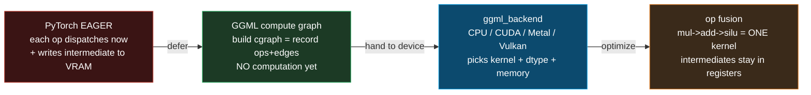

# GGML Compute Graph & Backend — one DAG, every device

> Companion: [ggml_backend.py](https://github.com/quanhua92/tutorials/blob/main/local-llm/ggml_backend.py)
> Live: [ggml_backend.html](./ggml_backend.html)

## 0. TL;DR

PyTorch runs tensor ops **eagerly** — each call dispatches the instant it happens,
paying Python + framework overhead and writing every intermediate to memory. GGML
(the tensor library inside llama.cpp) flips that: you **describe** the whole layer
as a DAG (`ggml_cgraph`), then a **backend** topo-sorts it, allocates every tensor
once, fuses neighbouring element-wise ops, and runs the kernels in order. The
*same* graph runs on a CPU (SIMD), an NVIDIA GPU (CUDA), an Apple GPU (Metal), or
Vulkan — the backend picks the kernel and the memory layout.

**The lifecycle (the one thing to remember):**

```
ggml_init(arena)  ->  build tensors + ops (record edges)  ->
ggml_build_forward_expand(gf, out)   [topo-sort]  ->
plan / backend_sched_alloc_graph   [allocate]  ->
graph_compute   [execute in topo order]  ->  read results
```

**Gold (verified, [check: OK] in the `.py` and `.html`):** for `A=2.0`,
`input=5.0`, `B=mul(A,input)`, `C=add(B, K=3.0)` → **B = 10.0, C = 13.0**.

---

## 1. What it is (lineage old → new, WHY each step)



| Step | Problem it fixes | What changes |
|---|---|---|
| **1. PyTorch eager** | — (the baseline) | Each op dispatched immediately; Python overhead per op; intermediates hit VRAM |
| **2. Deferred graph** | Per-op dispatch overhead + no global view | Model build only *records* ops as nodes (`src[]` edges, `op` enum). Compute happens once, in order |
| **3. Backend abstraction** | One library, many devices | Same `ggml_cgraph` shipped to ggml-cpu / ggml-cuda / ggml-metal / ggml-vulkan. Backend selects kernel + layout |
| **4. Op fusion** | Memory-bandwidth bound (every intermediate = a VRAM round-trip) | Consecutive element-wise ops merged into one kernel; intermediates live in registers |

**Why it matters:** LLM inference is **memory-bandwidth-bound, not compute-bound**.
The compute graph lets the backend see the *whole* layer and (a) allocate once,
(b) schedule across devices, (c) fuse kernels to halve the memory traffic. That is
why llama.cpp matches or beats PyTorch eager on the *same* hardware.

---

## 2. The mechanism (internals)

### 2a. `ggml_tensor` — one node

From `ggml/include/ggml.h` (verbatim struct fields, abbreviated):

```c
struct ggml_tensor {
    enum ggml_type type;          // F32, F16, Q4_0, Q8_0, ...
    struct ggml_backend_buffer *buffer;   // which device buffer owns this
    int64_t ne[4];                // shape; ne[0] = contiguous (innermost) dim
    size_t  nb[4];                // stride in bytes; nb[0]=sizeof(type), nb[i]=nb[i-1]*ne[i-1]
    enum ggml_op op;              // NONE=0 (leaf) | ADD | MUL | MUL_MAT | SILU | ...
    int32_t op_params[16];        // per-op parameters (e.g. SCALE's factor)
    int32_t flags;                // INPUT / OUTPUT markers for the allocator
    struct ggml_tensor * src[10]; // THE DAG EDGES (max 10 sources)
    void * data;                  // raw bytes
    char name[64];
};
```

The crucial idea: **`src[]` is the DAG.** `op != NONE` means the value is *not yet
computed* — the tensor only records *how* it will be produced.

> From ggml_backend.py Section A:
> ```
> The ggml_tensor struct (from ggml/include/ggml.h):
>   { type, ne[4], nb[4], op, op_params[], flags, src[10], data, name }
>   ne[0] is the contiguous (innermost) dim; src[] are the DAG edges.
> 
> Built tensors (note: op != NONE means the value is NOT computed yet):
> | name  | op      | type | ne   | nbytes | src            | flags   |
> |-------|---------|------|------|--------|----------------|---------|
> | A     | NONE    | F32  | [1]  | 4      | -              | INPUT   |
> | input | NONE    | F32  | [1]  | 4      | -              | INPUT   |
> | K     | NONE    | F32  | [1]  | 4      | -              | -       |
> | mul(A,input) | MUL     | F32  | [1]  | 4      | A,input        | -       |
> | add(mul(A,input),K) | ADD     | F32  | [1]  | 4      | mul(A,input),K | OUTPUT  |
> ```

### 2b. `ggml_cgraph` — the topo-sorted DAG

A computation graph (`ggml_cgraph`) holds two lists:

- **`nodes[]`** — tensors that *produce* a value (an op)
- **`leafs[]`** — tensors with no inputs (params, constants, inputs; `op == NONE`)

`ggml_build_forward_expand(gf, output)` walks the DAG **upward** from the output in
**post-order DFS** (every source registered before the tensor that consumes it) and
emits a topologically sorted node list. That list is the execution order.

```mermaid
graph BT
    A["A = const(2.0)<br/>leaf"] --> B["B = mul(A, input)<br/>op=MUL"]
    IN["input = 5.0<br/>leaf"] --> B
    B --> C["C = add(B, K)<br/>op=ADD"]
    K["K = const(3.0)<br/>leaf"] --> C
    style A fill:#161b22,stroke:#8b949e
    style IN fill:#161b22,stroke:#8b949e
    style K fill:#161b22,stroke:#8b949e
    style B fill:#0c4a6e,stroke:#0ea5e9,color:#fff
    style C fill:#0c4a6e,stroke:#0ea5e9,color:#fff
```



> From ggml_backend.py Section B:
> ```
> (1) post-order DFS (ggml_build_forward_expand):
>     ['mul(A,input)', 'add(mul(A,input),K)']
> 
> (2) Kahn's algorithm (BFS, emit zero-in-degree first):
>     ['A', 'input', 'K', 'mul(A,input)', 'add(mul(A,input),K)']
> [check] post-order DFS is a legal topo order: True -> OK
> [check] Kahn's order is a legal topo order: True -> OK
> ```

Both are **legal** topological orders. ggml uses the DFS form because it is a single
pass over `src[]` with no in-degree bookkeeping.

### 2c. Backend dispatch — same graph, different kernel

A `ggml_cgraph` is **backend-agnostic**. Each backend (`ggml-cpu`, `ggml-cuda`,
`ggml-metal`, `ggml-vulkan`, `ggml-sycl`, `ggml-cann`, ...) implements a table that
maps `(op, dtype)` → a concrete kernel, and decides the compute dtype + device
memory. `ggml_backend_sched` can even **split** one graph across backends — route
the heavy `MUL_MAT` to the GPU and a tiny reshape to the CPU, inserting a `CPY`
(copy) edge at the boundary.

> From ggml_backend.py Section C:
> ```
> Backend: ggml-cpu  (device=RAM, compute_dtype=F32)
> | tensor       | op   | kernel              | acceleration          |
> |--------------|------|---------------------|-----------------------|
> | mul(A,input) | MUL  | ggml_vec_mul_f32    | AVX2/AVX512/NEON SIMD |
> | add(...)     | ADD  | ggml_vec_add_f32    | AVX2/AVX512/NEON SIMD |
> 
> Backend: ggml-metal  (device=Apple GPU (unified memory), compute_dtype=F16)
> | mul(A,input) | MUL  | kernel_mul_f16      | Metal compute shader  |
> | add(...)     | ADD  | kernel_add_f16      | Metal compute shader  |
> 
> Backend: ggml-cuda  (device=NVIDIA GPU (VRAM), compute_dtype=F16)
> | mul(A,input) | MUL  | mul_f32             | CUDA elementwise kernel |
> | add(...)     | ADD  | add_f32             | CUDA elementwise kernel |
> ```
> **Key insight: the GRAPH IS IDENTICAL. Only the kernel table + dtype change.**

### 2d. Op fusion — the bandwidth win

Consecutive **element-wise** ops (`MUL → ADD → SILU`) can be fused into a single
kernel so the intermediates (`T1`, `T2`) stay in registers and never touch memory.
The math is **exact** (fusion is a scheduling choice, not an approximation). Matmul
(`MUL_MAT`) and reductions are not fused by the generic pass, though a backend may
fold an activation into a matmul's output epilogue.

> From ggml_backend.py Section D:
> ```
> Separate kernels (one pass per op):
>   separate total traffic: 64B (T1 and T2 each written AND read back)
> 
> Fused plan -> 1 kernel pass(es):
>   kernel #1: MUL -> ADD -> SILU
>              reads=24B (a+x+b), writes=8B (silu(...))
>   fused total traffic: 32B (T1, T2 never leave registers)
> 
> Bandwidth saved: 64B -> 32B (50% reduction)
> [check] fused result == separate result (fusion is EXACT): True
> ```

---

## 3. Practical config / commands

### Selecting a backend (build time)

llama.cpp builds the backend(s) available on your platform. CMake selects them
automatically, or you force one:

```bash
# CPU only (SIMD auto-detected: AVX2/AVX512/AMX on x86, NEON on ARM)
cmake -B build -DGGML_CPU=ON

# Apple Metal (macOS) — default on Apple Silicon
cmake -B build -DGGML_METAL=ON

# NVIDIA CUDA
cmake -B build -DGGML_CUDA=ON

# Vulkan (cross-vendor: AMD/Intel/NVIDIA/mobile)
cmake -B build -DGGML_VULKAN=ON
```

### Listing / forcing backends at run time

```bash
# show which backends were compiled in + the device list
./llama-cli --list-devices

# force a specific device (0-indexed)
./llama-cli -m model.gguf -ngl 99 --device "CUDA0"
./llama-cli -m model.gguf -ngl 99 --device "Metal0"
```

### The graph compute API (C)

The full lifecycle in real ggml code:

```c
// 1. arena
struct ggml_context * ctx = ggml_init(params);

// 2. build (record edges, no compute)
struct ggml_tensor * b = ggml_mul_mat(ctx, w, x);
struct ggml_tensor * out = ggml_add(ctx, b, bias);

// 3. topo-sort into a cgraph
struct ggml_cgraph * gf = ggml_new_graph(ctx);
ggml_build_forward_expand(gf, out);

// 4a. CPU path: plan + compute
struct ggml_cplan plan = ggml_graph_plan(gf, n_threads, NULL);
plan.work_data = malloc(plan.work_size);
ggml_graph_compute(gf, &plan);

// 4b. backend path: schedule + allocate + compute
ggml_backend_sched_alloc_graph(sched, gf);
ggml_backend_sched_graph_compute(sched, gf);
```

---

## 4. Worked example (the gold centerpiece)

> From ggml_backend.py Section G:
> ```
> Full lifecycle on the canonical 3-node graph:
>   A = const(2.0), input = 5.0, B = mul(A, input), K = const(3.0),
>   C = add(B, K)
> 
> STEP 1  ggml_init(arena=64KiB)
> STEP 2  build tensors + ops (no computation, edges recorded)
> STEP 3  ggml_build_forward_expand(gf, C)  [topo-sort]
>         nodes = ['mul(A,input)', 'add(mul(A,input),K)']
>         leafs = ['A', 'input', 'K']
> STEP 4  plan + allocate (backend assigns each tensor a buffer)
> STEP 5  graph_compute (execute in topo order):
> | order | node | op   | src            | result |
> |-------|------|------|----------------|--------|
> | 1     | mul(A,input) | MUL  | A,input        | 10.0   |
> | 2     | add(mul(A,input),K) | ADD  | mul(A,input),K | 13.0   |
> STEP 6  read: B = 10.0,  C = 13.0
> 
> [check] B == 10.0: True -> OK
> [check] C == 13.0: True -> OK
> [check] topo order is legal (deps before consumers): True -> OK
> ```

---

## 5. Pitfalls (trap | symptom | fix)

| Trap | Symptom | Fix |
|---|---|---|
| **Forgetting `build_forward_expand`** | `graph_compute` sees an empty node list → output never filled (NaN/zero) | Always call `ggml_build_forward_expand(gf, output)` before compute |
| **Reading a tensor before its op ran** | `data` is NULL / stale | The output of an op is only valid *after* `graph_compute`. Leaves (NONE) are valid as soon as you `ggml_set_*` them |
| **Assuming eager semantics** | You mutate an input tensor mid-graph and expect downstream ops to see it | ggml is **deferred**: inputs are read at compute time, in topo order. Set inputs *after* build, *before* compute |
| **Quantized matmul on the wrong backend** | `mul_mat_q4_0` "not supported" error or silent CPU fallback | Not every backend implements every (op, type) pair. `ggml_backend_supports_op()` reports it; the scheduler falls back to CPU + a copy |
| **Graph split copies you didn't expect** | A `CPY` (copy) node appears between a GPU matmul and a CPU op → stalls | `ggml_backend_sched` inserts copies at device boundaries. Keep a layer's hot path on one backend to avoid the round-trip |
| **No `ggml_set_input` / `ggml_set_output`** | The allocator over-allocates (it can't tell inputs from scratch) | Mark I/O tensors so `ggml_gallocr` / the backend can overlap scratch buffers and trim the footprint |
| **Fusion only helps element-wise chains** | Expecting matmul + softmax to fuse → no speedup | Generic fusion covers element-wise ops only. Matmul-epilogue fusion (e.g. matmul+relu) is backend-specific, not guaranteed |
| **Default graph size too small** | `build_forward_expand` silently truncates a >2048-node graph | `GGML_DEFAULT_GRAPH_SIZE = 2048`; use `ggml_new_graph_custom(ctx, size, grads)` for bigger graphs |

---

## 6. Cheat sheet

```
ggml_tensor : { type, ne[4], nb[4], op, op_params, flags, src[10], data, name }
  op==NONE   -> leaf (param/const/input), data preset
  op!=NONE   -> produced by the op, src[] = edges, computed at graph_compute
  ne[0]      -> contiguous (innermost) dim; nb[0]=sizeof(type)

ggml_cgraph : nodes[] (ops, topo order) + leafs[] (inputs/params)

lifecycle   : ggml_init -> build (record) -> build_forward_expand (topo)
              -> plan/alloc -> graph_compute -> read

build order : post-order DFS from output => deps before consumers
              (equivalent legal order: Kahn's BFS)

backend     : SAME graph on ggml-cpu(F32, SIMD) / ggml-cuda(F16, Tensor Core)
              / ggml-metal(F16, MPS) / ggml-vulkan. picks kernel + dtype + mem.
              ggml_backend_sched can SPLIT a graph across devices (+ CPY edges).

op fusion   : chain of element-wise ops (MUL->ADD->SILU) -> ONE kernel.
              intermediates stay in registers. math is EXACT.
              demo: 64B traffic -> 32B (-50%) for a 2-elem chain.

numbers     : A=2.0, input=5.0 -> B=mul=10.0 -> C=add(B,K=3.0)=13.0
```

---

## 🔗 Cross-references

- **[GGUF_FORMAT](./GGUF_FORMAT.md)** — the weights file format. The tensors loaded
  from a GGUF populate the *leafs* of this graph (the `W` in `mul_mat(W, x)`).
- **[llm/FLASH_ATTENTION](../llm/FLASH_ATTENTION.md)** — the *same* attention op,
  but here it is dispatched as `MUL_MAT + SOFT_MAX + MUL_MAT` nodes that each backend
  implements with its own fused-flash kernel. One algorithm, many backends.
- **quant_types** (sibling) — the `Q4_0`/`Q8_0` dtypes that appear in `tensor->type`
  and drive the matmul's dequant-fused kernel selection.
- **gpu_offload** (sibling) — `-ngl` controls *how many* graph layers the scheduler
  routes to the GPU; this bundle is *what* gets routed.

## Sources

- [ggml source tree](https://github.com/ggml-org/llama.cpp/tree/master/ggml) — all backends (ggml-cpu, ggml-cuda, ggml-metal, ggml-vulkan, ggml-sycl)
- [ggml.h — `struct ggml_tensor`, `enum ggml_op`, `ggml_cgraph`](https://github.com/ggml-org/llama.cpp/blob/master/ggml/include/ggml.h)
- [ggml docs — Computation Graph](https://ggml-org-ggml.mintlify.app/concepts/computation-graph) — deferred execution model, `build_forward_expand`, full workflow
- [llama.cpp Backend wiki](https://github.com/ggml-org/llama.cpp/wiki/Backend) — backend list + scheduling
- [llama.cpp CLI README (`-ngl`, `--device`)](https://github.com/ggml-org/llama.cpp/blob/master/examples/cli/README.md)
- [Introduction to ggml (HuggingFace)](https://huggingface.co/blog/introduction-to-ggml)
- [Optimizing llama.cpp AI Inference with CUDA Graphs (NVIDIA)](https://developer.nvidia.com/blog/optimizing-llama-cpp-ai-inference-with-cuda-graphs/)
