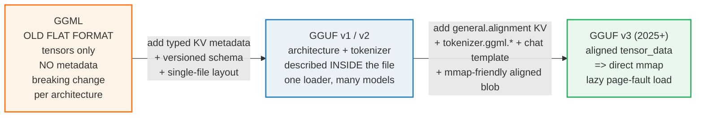
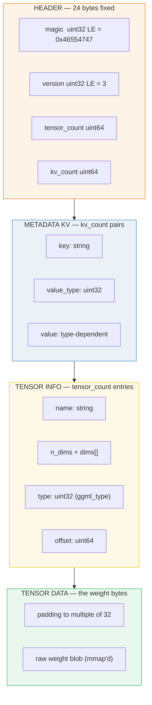
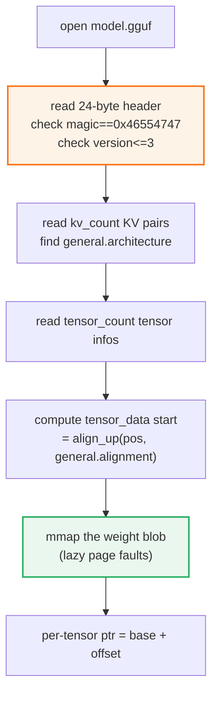

# GGUF Format — the single-file binary layout llama.cpp loads

> Companion: [gguf_format.py](https://github.com/quanhua92/tutorials/blob/main/local-llm/gguf_format.py)
> Live playground: [gguf_format.html](./gguf_format.html) — interactive hex viewer
> Sibling: [QUANT_TYPES.md](./QUANT_TYPES.md) 🔗 — what the tensor data stores
> Sibling: [GGML_BACKEND.md](./GGML_BACKEND.md) 🔗 — how tensors get loaded into a graph
> Sibling: [MMAP_WEIGHTS.md](./MMAP_WEIGHTS.md) — why tensor_data is aligned to 32

## 0. TL;DR

**GGUF** (GPT-Generated Unified Format) is a single-file binary layout for shipping
a whole model: tokenizer + chat template + hyperparameters + tensor metadata +
the raw weight bytes. It is what llama.cpp, Ollama, LM Studio, and friends load.
Four sections, in order:

| Section | What | Size |
|---|---|---|
| **Header** | `magic=0x46554747`, `version=3`, counts | 24 bytes fixed |
| **Metadata KV** | typed key/value pairs (architecture, tokenizer, chat template…) | variable |
| **Tensor info** | per-tensor name / dims / type / offset | variable |
| **Tensor data** | the actual weight bytes, **aligned to 32** | the bulk |

The whole point: **one loader, every model architecture.** The KV section
self-describes the model, so adding a new architecture needs no C code change.
And because `tensor_data` is alignment-padded, the OS can `mmap` the weight blob
directly — lazy, page-faulted loading.

The **gold-checked** fact: build a tiny GGUF in memory with 2 KV pairs + 1
tensor, parse it back, and `magic == 0x46554747`, `version == 3`.

---

## 1. The lineage — WHY each step exists



**The recurring theme: push model knowledge out of C code and into the file.**
The old GGML format hardcoded tensor order and hyperparameters in the loader, so
every new model architecture (Llama, Mistral, Qwen…) meant editing the loader and
bumping a *breaking* format version. GGUF's typed KV section lets one file declare
its own architecture name, block size, RoPE base, tokenizer vocab, and chat
template — backward compatible across versions.

> From `gguf_format.py` Section E (lineage table):
> ```
> stage            what changed                                   why
> ------------------------------------------------------------------------------
> GGML (old flat)  tensors only, no metadata, breaking change per architecture every new model = a code change + a new loader
> GGUF v1/v2       + KV metadata + version field + single-file layout architecture/tokenizer described IN the file
> GGUF v3 (now)    + general.alignment KV + tokenizer.ggml.* + chat template KV, mmap-friendly aligned tensor_data one loader runs every architecture; mmap loads weights lazily
> ```

### The binary layout (the four sections)



---

## 2. The mechanism — header, KV, tensor info, alignment

Every byte below is printed by `gguf_format.py`; offsets are verified against
[`gguf-py/gguf/gguf.py`](https://github.com/ggml-org/llama.cpp/blob/master/gguf-py/gguf/gguf.py)
and the [HuggingFace GGUF docs](https://huggingface.co/docs/hub/en/gguf). All
integers are **little-endian**. Strings are `uint64 length + UTF-8 bytes` with
**no null terminator**.

### A — Header: magic, version, counts

> From `gguf_format.py` Section A:
> ```
> GGUF header layout (verified: gguf-py/gguf/gguf.py GGUF_MAGIC/VERSION):
>   offset 0   magic             uint32 LE = 0x46554747 (ASCII 'GGUF')
>   offset 4   version           uint32 LE = 3
>   offset 8   tensor_count      uint64
>   offset 16  metadata_kv_count uint64
>   offset 24  ... metadata_kv[] / tensor_info[] / tensor_data ...
>
> Magic sanity: 0x46554747 little-endian = bytes 47475546 = ASCII 'GGUF'
>
> Built header (24 bytes):
> 000000  47 47 55 46 03 00 00 00 01 00 00 00 00 00 00 00  |GGUF............|
> 000010  02 00 00 00 00 00 00 00                          |........|
> ```

The first 4 bytes `47 47 55 46` spell **`GGUF`** in ASCII — `0x46554747` stored
little-endian. The version field `03 00 00 00` = **3**. The two 64-bit counts
follow. This header is the cheap "are you even a GGUF file?" check a loader does
before touching anything else.

### B — KV metadata: the typed value system

> From `gguf_format.py` Section B:
> ```
> GGUFValueType enum (the value_type uint32):
>    0  UINT8        1  INT8         2  UINT16       3  INT16
>    4  UINT32       5  INT32        6  FLOAT32      7  BOOL
>    8  STRING       9  ARRAY       10  UINT64      11  INT64
>   12  FLOAT64
> ```

A KV pair is `key(string) + value_type(uint32) + value`. The value's encoding
depends on its type:

- **Scalars** (`UINT8`…`FLOAT64`, `BOOL`): fixed-width, little-endian. `BOOL`
  serializes as a single `uint8` (0 or 1).
- **STRING**: `uint64 length + UTF-8 bytes`, **no null terminator**.
- **ARRAY**: `array_type(uint32) + array_len(uint64) + array_len scalars` — this
  is how a list like `llama.embedding_length=[4096,4096]` ships.

> From `gguf_format.py` Section B (5 typed pairs, round-tripped):
> ```
> key                          type     value
> ------------------------------------------------------------
> general.architecture         STRING   'llama'
> general.file_type            UINT32   1
> tokenizer.ggml.bos           BOOL     True
> llama.context_length         UINT32   4096
> llama.embedding_length       ARRAY    [4096, 4096]
> [check] 5 KV pairs parsed fully (cursor at end) :  OK  (pos=199 len=199)
> [check] BOOL True survives round-trip as 1 byte :  OK
> [check] STRING has uint64 length prefix (8 bytes) + payload :  OK
> ```

The `general.architecture` value (here `"llama"`) is the **key that names the
whole model family** — it tells the loader which `llama.*` and `tokenizer.ggml.*`
keys to expect. That single string is how one file describes "I am a Llama-style
transformer, here are my dims, here is my vocab."

### C — Tensor info: name, dims, type, offset

> From `gguf_format.py` Section C:
> ```
> Built tensor info for 'token_embd.weight' dims=[4, 2] type=F32 offset=0:
> 000000  11 00 00 00 00 00 00 00 74 6f 6b 65 6e 5f 65 6d  |........token_em|
> 000010  62 64 2e 77 65 69 67 68 74 02 00 00 00 04 00 00  |bd.weight.......|
> 000020  00 00 00 00 00 02 00 00 00 00 00 00 00 00 00 00  |................|
> 000030  00 00 00 00 00 00 00 00 00                       |.........|
>   (57 bytes)
> ```

Each tensor info entry is:
`name(string) + n_dims(uint32) + dims[n_dims](uint64 each, row-major)
 + type(uint32, ggml_type) + offset(uint64)`.

The `type` field is a `ggml_type` enum — `F32=0`, `F16=1`, `Q4_0=2`, `Q4_K=12`,
`Q6_K=14`, `BF16=31`, … — the same enum that [QUANT_TYPES.md](./QUANT_TYPES.md)
documents block-by-block. The `offset` is **relative to the start of the
tensor_data section**, NOT the file start. That distinction is exactly what the
alignment padding in Section D is for.

### D — Full build: alignment + mmap-friendly layout

> From `gguf_format.py` Section D (the GOLD value):
> ```
> Layout:
>   header              [   0 ..  24)   24 bytes
>   metadata_kv         [ 24 .. 102)   78 bytes  (2 pairs)
>   tensor_info         [102 .. 159)   57 bytes  (1 tensor)
>   alignment padding   [159 .. 160)    1 bytes  (align_up(159,32)=160)
>   tensor_data         [160 .. 192)   32 bytes  (8 x F32)
>   TOTAL FILE SIZE     = 192 bytes
> ```

`tensor_data` is padded so it starts at a multiple of `general.alignment`
(default **32**). Here `align_up(159, 32) = 160`, so **1 padding byte** sits
between the tensor info table and the weights. On a real multi-GB model the
same rule applies at scale: the loader `mmap`s the file, then hands each tensor a
pointer computed as `tensor_data_base + tensor.offset` — and because both the
base and the offsets land on the alignment grid, the OS pages map cleanly.

> From `gguf_format.py` Section D (full hex dump + round-trip):
> ```
> Full hex dump:
> 000000  47 47 55 46 03 00 00 00 01 00 00 00 00 00 00 00  |GGUF............|
> 000010  02 00 00 00 00 00 00 00 14 00 00 00 00 00 00 00  |................|
> 000020  67 65 6e 65 72 61 6c 2e 61 72 63 68 69 74 65 63  |general.architec|
> 000030  74 75 72 65 08 00 00 00 05 00 00 00 00 00 00 00  |ture............|
> 000040  6c 6c 61 6d 61 11 00 00 00 00 00 00 00 67 65 6e  |llama........gen|
> 000050  65 72 61 6c 2e 66 69 6c 65 5f 74 79 70 65 04 00  |eral.file_type..|
> 000060  00 00 01 00 00 00 11 00 00 00 00 00 00 00 74 6f  |..............to|
> 000070  6b 65 6e 5f 65 6d 62 64 2e 77 65 69 67 68 74 02  |ken_embd.weight.|
> 000080  00 00 00 04 00 00 00 00 00 00 00 02 00 00 00 00  |................|
> 000090  00 00 00 00 00 00 00 00 00 00 00 00 00 00 00 00  |................|
> 0000a0  00 00 80 3f 00 00 00 40 00 00 40 40 00 00 80 40  |...?...@..@@...@|
> 0000b0  00 00 a0 40 00 00 c0 40 00 00 e0 40 00 00 00 41  |...@...@...@...A|
>
> Round-trip parse:
>   magic = 0x46554747, version = 3
>   KV general.architecture = llama
>   KV general.file_type = 1
>   tensor 'token_embd.weight' dims=[4, 2] type=F32 offset=0
>   weights = [1.0, 2.0, 3.0, 4.0, 5.0, 6.0, 7.0, 8.0]
> [check] magic == 0x46554747 :  OK  (0x46554747)
> [check] version == 3 :  OK  (3)
> [check] tensor_data starts at a multiple of 32 :  OK  (160 % 32)
> ```

The eight F32 weights `1.0…8.0` show up as the clean float bytes `00 00 80 3f`
(`1.0`), `00 00 00 40` (`2.0`), … at offset `0xa0` (= 160, the aligned
tensor_data start). That 160 = `align_up(159, 32)` is the whole alignment story.

---

## 3. Practical config / commands

The KV metadata is what real tooling reads first. Common keys in a real `.gguf`:

| Key | Type | Meaning |
|---|---|---|
| `general.architecture` | STRING | model family (`llama`, `qwen2`, `mistral`, …) — selects the loader |
| `general.name` | STRING | human-readable model name |
| `general.quantization_version` | UINT32 | quant schema version |
| `general.file_type` | UINT32 | quant type id (the `ggml_type` enum, see QUANT_TYPES.md) |
| `general.alignment` | UINT32 | tensor_data alignment (default 32; rarely changed) |
| `llama.context_length` | UINT32 | max trained context |
| `llama.embedding_length` | UINT32 | hidden size |
| `llama.block_count` | UINT32 | number of layers |
| `llama.rope.freq_base` | FLOAT32 | RoPE base θ (10000 default; see context extension) |
| `tokenizer.ggml.model` | STRING | tokenizer type (`llama`, `gpt2`, …) |
| `tokenizer.ggml.tokens` | ARRAY\<STRING\> | the full vocab |
| `tokenizer.chat_template` | STRING | Jinja chat template (rendered per request) |

```bash
# inspect metadata + tensor list of any .gguf (no Python needed)
./gguf-py/scripts/gguf_dump_path.py model.gguf          # full dump
./gguf-py/scripts/gguf_set_metadata.py model.gguf       # edit KV in place

# the HuggingFace Hub viewer shows KV + tensor info for any .gguf in the browser:
#   https://huggingface.co/<repo>?show_tensors=<file>.gguf

# convert a HF checkpoint to GGUF (writes the header + KV + tensor info + data)
python convert_hf_to_gguf.py ./model --outtype f16 --outfile model.f16.gguf
# then quantize (rewrites tensor_data with packed blocks, sets file_type)
./llama-quantize model.f16.gguf model.Q4_K_M.gguf Q4_K_M
```

---

## 4. Worked example — what a loader does, step by step



1. **Header check** — read 24 bytes, assert `magic == 0x46554747` and the version
   is one the loader understands. If the magic mismatches, it isn't a GGUF file.
2. **KV read** — walk `kv_count` pairs into a dict. `general.architecture`
   selects the model code path; `general.alignment` (default 32) sets the tensor
   data alignment.
3. **Tensor info read** — build a table of `{name, dims, type, offset}`.
4. **Align + mmap** — `tensor_data_start = align_up(current_pos, alignment)`,
   then `mmap` the file and hand each tensor a pointer `base + offset`.

---

## 5. Pitfalls (trap → symptom → fix)

| Trap | Symptom | Fix |
|---|---|---|
| **Treating tensor `offset` as a file offset** | Tensors read garbage / segfault | `offset` is **relative to the tensor_data section start**, not the file start. Add the aligned `tensor_data_offset` first. |
| **Assuming big-endian** | magic check fails, all counts huge/wrong | GGUF is **little-endian** everywhere. `0x46554747` LE reads as bytes `47 47 55 46` = `GGUF`. |
| **Forgetting the alignment padding** | First tensor's data is off-by-a-few-bytes; floats look like noise | `tensor_data_start = align_up(pos_after_tensor_info, general.alignment)`. Default 32, but **read it from the KV** — it can differ. |
| **Null-terminating strings** | String keys/values parse shifted/corrupted | GGUF strings are `uint64 length + UTF-8 bytes`, **no null terminator**. The length prefix is the boundary. |
| **Hardcoding `version=1` logic** | v3 files with `general.alignment`/chat-template KVs misparsed | Read the version field; treat unknown KVs as ignorable (forward-compatible schema). Don't assume a fixed KV set. |
| **Confusing `value_type` (KV) with `ggml_type` (tensor)** | Reading a KV UINT32 as a tensor type, or vice versa | Two **separate** enums: KV uses `GGUFValueType` (UINT32=4…), tensor `type` uses `ggml_type` (F32=0, Q4_K=12…). |
| **Expecting tensors in a fixed order** | Wrong layer wiring after re-saving | The loader wires tensors **by name** (`token_embd.weight`, `blk.0.attn_q.weight`…), not by file order. Names are authoritative. |
| **mmap on a copy-on-write write** | Quantizing in place corrupts the shared mapping | mmap is COW; writes dirty pages. Re-quantize into a new file, don't mutate a mapped one in place. See [MMAP_WEIGHTS.md](./MMAP_WEIGHTS.md). |
| **Assuming GGUF == safetensors** | Expecting tensor-only, no metadata | GGUF encodes **both** tensors AND standardized metadata (architecture, tokenizer, chat template). safetensors is tensor-only. The metadata is GGUF's whole reason to exist. |

---

## 6. Cheat sheet

```
HEADER (24 bytes, all LE):
  0x00  uint32  magic    = 0x46554747   ("GGUF")
  0x04  uint32  version  = 3
  0x08  uint64  tensor_count
  0x10  uint64  metadata_kv_count

KV pair:     key(string) + value_type(uint32) + value
  string  = uint64 len + UTF-8 bytes        (NO null terminator)
  scalar  = fixed-width LE (uint8/16/32/64, int*, float32/64, bool)
  array   = uint32 elem_type + uint64 len + len scalars

TENSOR INFO: name(string) + n_dims(uint32)
           + dims[n_dims](uint64, row-major)
           + type(uint32, ggml_type) + offset(uint64)

LAYOUT:  header | metadata_kv | tensor_info | PAD | tensor_data
         tensor_data_start = align_up(pos, 32)   <- default alignment
         tensor ptr        = tensor_data_start + tensor.offset
```

| You want… | Use |
|---|---|
| Quick metadata peek | `./gguf_dump_path.py model.gguf` or the HF Hub `?show_tensors=` viewer |
| Convert HF → GGUF | `python convert_hf_to_gguf.py ./model --outtype f16` |
| Change quantization | `./llama-quantize model.f16.gguf model.Q4_K_M.gguf Q4_K_M` (rewrites tensor_data, sets `general.file_type`) |
| Run it | `./llama-cli -m model.Q4_K_M.gguf -p "hello"` (llama.cpp), `ollama run` (Ollama) |
| Read a tensor's bytes | `tensor_data_base + tensor.offset`, then dequant per its `ggml_type` (see QUANT_TYPES.md) |

**The three numbers to memorize:**
```
magic     = 0x46554747   (bytes LE: 47 47 55 46 = "GGUF")
version   = 3
alignment = 32           (tensor_data padded to a multiple of this)
```

---

## 🔗 Cross-references

- **[QUANT_TYPES.md](./QUANT_TYPES.md)** 🔗 — what the `tensor_data` bytes
  actually *mean*. Each tensor's `type` field (a `ggml_type`: `Q4_0`, `Q4_K`,
  `IQ3_S`…) says how to unpack its block layout. GGUF is the *container*;
  quant types are the *payload encoding*.
- **[GGML_BACKEND.md](./GGML_BACKEND.md)** 🔗 — how parsed tensors get wired into
  a compute graph. GGUF's tensor names (`blk.0.attn_q.weight`) are what the
  backend matches to graph nodes before execution.
- **[MMAP_WEIGHTS.md](./MMAP_WEIGHTS.md)** — the alignment=32 padding exists
  *for* mmap. This guide explains the layout; that one explains the page-fault /
  copy-on-write / shared-multi-process mechanics it enables.
- **[../llm/QUANTIZATION.md](../llm/QUANTIZATION.md)** — the algorithm side. Same
  affine `w = m + d·q` math, but server-side W4A16 with PyTorch; GGUF is the
  local block-quant container for the same idea.

---

## Sources

- [gguf-py/gguf/gguf.py](https://github.com/ggml-org/llama.cpp/blob/master/gguf-py/gguf/gguf.py) — the authoritative Python reader/writer. Primary source for `GGUF_MAGIC = 0x46554747`, `GGUF_VERSION = 3`, the `GGUFValueType` enum, and the string/KV/tensor-info encodings used throughout this guide.
- [ggml.h](https://github.com/ggml-org/llama.cpp/blob/master/ggml/include/ggml.h) — the `ggml_type` enum (`GGML_TYPE_F32=0`, `GGML_TYPE_Q4_K=12`, …) that populates each tensor info `type` field.
- [HuggingFace GGUF docs](https://huggingface.co/docs/hub/en/gguf) — confirms GGUF encodes both tensors AND standardized metadata (vs safetensors, which is tensor-only), the KV-metadata/self-describing rationale, and the full quant-type table.
- [GGUF spec (ggml/docs/gguf.md)](https://github.com/ggerganov/ggml/blob/master/docs/gguf.md) — the prose specification of the layout, alignment, and KV key conventions.
- [convert_hf_to_gguf.py](https://github.com/ggml-org/llama.cpp/blob/master/convert_hf_to_gguf.py) — the canonical HF → GGUF converter; shows exactly which KV keys each architecture writes.
- [PR #2346 — GGUF introduction](https://github.com/ggml-org/llama.cpp/pull/2346) — the PR that replaced the flat GGML format with the versioned KV-metadata GGUF; the "why this exists" rationale.
