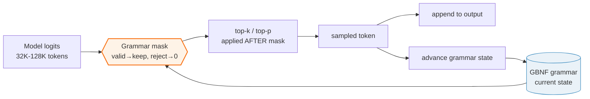
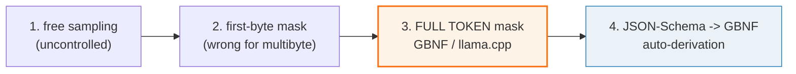
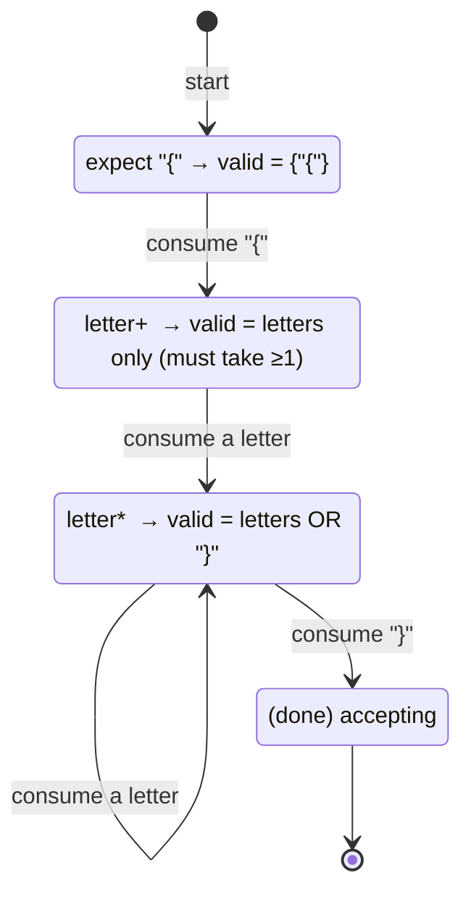

# Grammar-Constrained Generation (GBNF) — Forcing Valid Output With a Token Mask

> **Companion code:** [`grammar_output.py`](https://github.com/quanhua92/tutorials/blob/main/local-llm/grammar_output.py).
> **Live:** [`grammar_output.html`](./grammar_output.html) — interactive grammar sandbox.
> Every number in this guide is printed by `python3 grammar_output.py` — change the code, re-run, re-paste. Nothing here is hand-computed.

## 0. TL;DR

An LLM samples tokens from a probability distribution. Nothing in that distribution
*guarantees* the structure you need — a stray quote breaks JSON, a letter lands where a
digit belongs. **GBNF (GGML BNF)** lets you hand the sampler a *context-free grammar*;
before each token is drawn, the sampler builds a **mask** over the whole vocabulary: tokens
the grammar would reject are zeroed, accepted tokens keep their model probability. You then
sample from the masked distribution. **The output is guaranteed to parse.** This is how
llama.cpp's `--grammar` / `--grammar-file` flags and the `json_schema` field force valid JSON.



The cost: **~10–30% slower** — every token in the vocabulary is checked against the grammar
state at every step ([llama.cpp issue #4218](https://github.com/ggml-org/llama.cpp/issues/4218)).

---

## 1. What it is (lineage, old → new)

| Step | Mechanism | Why it failed |
|---|---|---|
| **1. Free sampling** | top-k / top-p / temperature over the **full** vocab. | Output format uncontrolled; "please output JSON" in the prompt is unreliable. |
| **2. Naive first-byte mask** | zero any token whose first byte the grammar forbids. | Wrong for **multi-byte / multi-char tokens**: the whole leading string must fit the grammar state, not just byte zero. |
| **3. Full token masking** (llama.cpp / GBNF) | for every vocab id, test the **entire** token text against the grammar's current parser state; keep prob if it fits, else 0. Then run top-k/top-p on the masked logits. | Still O(vocab × steps) → the 10–30% overhead. |
| **4. JSON-Schema → GBNF compiler** | auto-derive a grammar from a JSON schema (`examples/json_schema_to_gbnf.py`, `--json`/`-j`, or the server's `json_schema` field). | Tool/function calling emits structurally-valid JSON without hand-writing GBNF. |



---

## 2. The mechanism — a GBNF grammar, then a derivative

A GBNF grammar looks like BNF with regex-like sugar (`[a-z]`, `+ * ?`, `|`, alternation):

```gbnf
root  ::= "{" ws "\"name\"" ws ":" ws string "," ws "\"age\"" ws ":" ws number "}"
ws    ::= [ \t\n]*
string ::= "\"" [^"]* "\""
number ::= [0-9]+
```

`root` is always the entry point. The sampler tracks the **current parser state** — the set
of positions in the grammar reachable after consuming the output so far. At each step it
asks: *"from this state, which tokens can the grammar accept?"*

**This bundle's engine uses Brzozowski derivatives** (a concept-faithful model of
llama.cpp's `common/grammar-parser.cpp` / `llama-grammar.cpp`, which is a byte-level LL(1)
parser with a stack of rule positions). The *state is the residual grammar* after consuming
the output:

- `derive(state, c)` → residual after eating one char `c`. `Null` = forbidden (masked); anything else = accepted.
- A token is **valid** iff `derive(state, token_text)` is not `Null` — the *whole* token fits.

> From `grammar_output.py` Section B (driving the GOLD grammar `root ::= "{" letter+ "}"`,
> `letter ::= [abehlo]`, character by character):
> ```
> start state        = (('{' letter+) '}')
>   valid_chars      = ['{']
>   nullable (accept)= False
>
>   derive(state, '{' ) = (letter+ '}')                      ACCEPTED
>   derive(state, 'h' ) = (letter* '}')                      ACCEPTED
>   derive(state, 'e' ) = (letter* '}')                      ACCEPTED
>   derive(state, 'l' ) = (letter* '}')                      ACCEPTED
>   derive(state, 'l' ) = (letter* '}')                      ACCEPTED
>   derive(state, 'o' ) = (letter* '}')                      ACCEPTED
>   derive(state, '}' ) = (done)                             ACCEPTED
>
> final state        = (done)  (nullable -> output complete & valid)
> [check] input '{hello}' drives state to accepting (Eps): True -> OK
> [check] derive(root, '9') is Null (9 is out of class): True -> OK
> ```

Note how the residual changes shape: after the **first** letter the state becomes
`letter* "}"` (one-or-more satisfied → now zero-or-more), so the closer `}` is *also* live.
`9` and `x` (out of the `[abehlo]` class) are masked at every letter position.



---

## 3. Practical config / commands

llama.cpp ships GBNF natively across its tools ([GBNF Guide](https://github.com/ggml-org/llama.cpp/blob/master/grammars/README.md)):

```bash
# CLI: constrain output with a grammar file
./llama-cli -m model.gguf --grammar-file grammars/json.gbnf -p 'List 3 capitals.'

# CLI: derive the grammar from a JSON schema directly (-j / --json)
./llama-cli -m model.gguf \
  -j '{"type":"array","items":{"type":"object","properties":{"name":{"type":"string"},"age":{"type":"integer"}},"required":["name","age"]}}' \
  -p 'Generate a {name, age} array.'

# Server: pass grammar as a body field (or json_schema / response_format)
curl /v1/completions -d '{
  "prompt": "...", "grammar": "root ::= [0-9]+"
}'
```

The grammar is **only used to constrain sampling** — it is *not* injected into the prompt
(the model has no visibility into it for plain completion). For **tool calling** the schema
*is* injected into the prompt so the model learns the contract.

GBNF syntax cheat sheet (subset this bundle's parser supports):

| Construct | Meaning | Example |
|---|---|---|
| `name ::= ...` | a rule (the entry rule is `root`) | `root ::= [a-z]+` |
| `"abc"` | literal string terminal | `"{"` |
| `[a-z]` / `[^0-9]` | char class / negated class | `[abehlo]` |
| `A B` | concatenation | `"{" letter+ "}"` |
| `A \| B` | alternation | `pawn \| nonpawn \| castle` |
| `A+ A* A?` | one-or-more / zero-or-more / optional | `[^"]*` |
| `( ... )` | grouping | `("- " item)+` |
| `# comment` | to end of line | `# optional ws` |
| `<[id]>` / `<think>` | match a specific tokenizer token | `<think> ... </think>` |

---

## 4. Worked example — the GOLD mask

The GOLD grammar and a 10-token vocabulary (`x`, `9` are out-of-class distractors):

```gbnf
root   ::= "{" letter+ "}"
letter ::= [abehlo]
```

> From `grammar_output.py` Section C / Section G — the centerpiece, badge-checked in
> [`grammar_output.html`](./grammar_output.html):
> ```
> Vocabulary   : '{', 'a', 'b', 'h', 'e', 'l', 'o', '}', 'x', '9'
>
> STATE 0 (start, before any token):
>     valid   = ['{']
>     invalid = ['a', 'b', 'h', 'e', 'l', 'o', '}', 'x', '9']
>     -> only '{' can be sampled; the sampler sees all other logits as 0.
>
> STATE 1  (after sampling '{'):
>     valid   = ['a', 'b', 'h', 'e', 'l', 'o']
>     invalid = ['{', '}', 'x', '9']
>     -> the in-class letters are live; '}', 'x', '9', '{' are masked.
>
> [check] STATE 0 valid == ['{']: True -> OK
> [check] STATE 1 valid == ['a','b','h','e','l','o']: True -> OK
> [check] STATE 1 invalid contains '{','}','x','9': True -> OK
> ```

**This is the entire concept in one table.** At state 0, only `{` survives the mask. The
model's actual logit for `{` may be low, but it is the *only* non-zero token, so it is
sampled with probability 1. After `{`, the in-class letters are live and `}` / `x` / `9`
are masked. The output is *guaranteed* to be a string matching `{"{" letter+ "}"`.

### Constrained generation trace (seeded sampler)

> From `grammar_output.py` Section D:
> ```
> | step | grammar state (residual)            | picked | output so far |
> |------|-------------------------------------|--------|---------------|
> | 0    | (('{' letter+) '}')                 | {      |               |
> | 1    | (letter+ '}')                       | h      | '{'           |
> | 2    | (letter* '}')                       | o      | '{h'          |
> | 3    | (letter* '}')                       | o      | '{ho'         |
> | 4    | (letter* '}')                       | }      | '{hoo'        |
> | 5    | (done)                              | (stop) | '{hoo}'       |
>
> Final output: '{hoo}'   (always matches  '{' letter+ '}')
>
> [check] generated output parses against the grammar (ends accepting): True -> OK
> [check] generated output starts with '{' and ends with '}': True -> OK
> ```

At every step the mask is rebuilt from the residual grammar, a valid token is picked, and the
state advances. **Free sampling cannot make this guarantee** — it would happily emit `x` or
`9` if their logits were high.

### Multi-char tokens (why first-byte masking is wrong)

llama.cpp's real vocab has multi-char tokens. The mask must check the **whole** token, not
just its first byte:

> From `grammar_output.py` Section E (JSON grammar, multi-char vocab):
> ```
> multi-char vocab: ['{', '{"name"', '{"', 'name', '"name"', ':', '"hi"', '"', '}', ' ', '9']
>   valid   = ['{', '{"name"', '{"']
>   invalid = ['name', '"name"', ':', '"hi"', '"', '}', ' ', '9']
>   -> '{"name"' and '{"' are valid (the whole token fits the state);
>
> STATE after consuming '{"' :
>   valid   = ['name']
>   invalid = ['{', '{"name"', '{"', '"name"', ':', '"hi"', '"', '}', ' ', '9']
>   -> only 'name' (continuing the key) or the rest of the key is live.
> [check] '{"name"' accepted at start (whole token fits): True -> OK
> [check] '9' masked at start (not allowed by grammar): True -> OK
> [check] after '{"', '"name"' is NOT yet valid (key incomplete): True -> OK
> ```

After consuming `{"`, only `name` (continuing the key `name`) survives — `}` is masked
because the grammar still needs the rest of `"name"`.

---

## 5. Pitfalls (trap | symptom | fix)

| Trap | Symptom | Fix |
|---|---|---|
| **First-byte-only mask** | A multi-char token like `{"name"` is wrongly accepted when only `{` is valid, or wrongly rejected when the whole token fits. | Test the **whole** token text against the grammar state (`derive_str` over all chars), exactly as llama.cpp does. |
| **Slow `x? x? x? … x?`** | Sampling crawls (exponential grammar-state blowup) for many-optional patterns. ([#4218](https://github.com/ggml-org/llama.cpp/issues/4218)) | Rewrite as `x{0,N}` (or `(x (x … (x)?…)?)?` with N-deep nesting on older versions). |
| **Forgetting `ws` / whitespace** | JSON grammars reject valid output because a required space/newline was masked out. | Always include an explicit `ws ::= [ \t\n]*` rule and splice it between terminals. |
| **Schema not in the prompt** | The model "doesn't know" the schema and fights the grammar, producing degenerate output (e.g. empty strings). | For completion, describe the format in the prompt; the grammar only *masks*. (Tool-calling injects the schema into the prompt for you.) |
| **`additionalProperties` default** | JSON-schema→GBNF silently drops extra keys (defaults to `false`). | Set `"additionalProperties": true` in the schema if you want open objects. |
| **Left-recursive / nullable-star** | Derivative/parser hangs or overflows on pathological grammars. | GBNF grammars must be effectively non-left-recursive; the `[abehlo]`-style classes in this bundle are safe. |
| **Token boundary mid-rule** | A token whose text is valid *prefix* but leaves the grammar mid-state is accepted, then the next token has no valid continuation. | That is correct behaviour — the mask only guarantees *local* validity; completion may still need specific tokens (as in the `{"` → `name` trace). |
| **Negated class `[^x]` cannot enumerate** | A "show me the valid chars" display breaks for `[^"]`. | Fall back to testing each vocab token via `derive_str` (this bundle does exactly that for masking). |

---

## 6. Cheat sheet

```bash
# constrain with a grammar file
./llama-cli -m model.gguf --grammar-file grammars/json.gbnf -p '...'
# constrain from a JSON schema
./llama-cli -m model.gguf -j '<json-schema>' -p '...'
# server
curl /v1/completions -d '{"prompt":"...","grammar":"root ::= [0-9]+"}'
```

```
THE MASK, in 5 lines:
  1. grammar is in a current state (residual)
  2. for each vocab token: valid iff derive(state, token) != Null
  3. valid → keep model prob;  invalid → 0
  4. sample (top-k/top-p applied AFTER the mask)
  5. advance state by the sampled token's chars
COST: ~10–30% slower (O(vocab × steps) per token).
```

```
GOLD (grammar_output.py Section G, badge-checked in grammar_output.html):
  grammar : root ::= "{" letter+ "}"   letter ::= [abehlo]
  vocab   : { a b h e l o } x 9
  state 0 valid = ["{"]
  state 1 valid = ["a","b","h","e","l","o"]
  state 1 invalid contains {"{","}","x","9"}
```

---

## 🔗 Cross-references

- **[SAMPLING](../llm/SAMPLING.md)** — the base sampling algorithm (greedy → top-k → top-p)
  that grammar-constrained generation *masks before sampling*. The mask runs **before**
  top-k/top-p; this bundle is the "constrain" layer on top of that engine.
- [`ggml_backend`](./GGML_BACKEND.md) — the compute graph that produces the logits this
  sampler consumes.

---

## Sources

- [GBNF Guide — llama.cpp `grammars/README.md`](https://github.com/ggml-org/llama.cpp/blob/master/grammars/README.md) (official docs; GBNF syntax, JSON-Schema→GBNF, performance gotchas)
- [`examples/json_schema_to_grammar.py`](https://github.com/ggml-org/llama.cpp/blob/master/examples/json_schema_to_grammar.py) (schema → grammar compiler)
- [`common/grammar-parser.h`](https://github.com/ggml-org/llama.cpp/blob/master/common/grammar-parser.h) + `llama-grammar.cpp` (the production C++ LL(1) grammar parser + token mask)
- [llama.cpp issue #4218 — grammar performance](https://github.com/ggml-org/llama.cpp/issues/4218) (the ~10–30% overhead and `x{0,N}` rewrite)
- [Brzozowski derivatives (Wikipedia)](https://en.wikipedia.org/wiki/Brzozowski_derivative) — the mechanism this bundle's engine uses to model the grammar state
