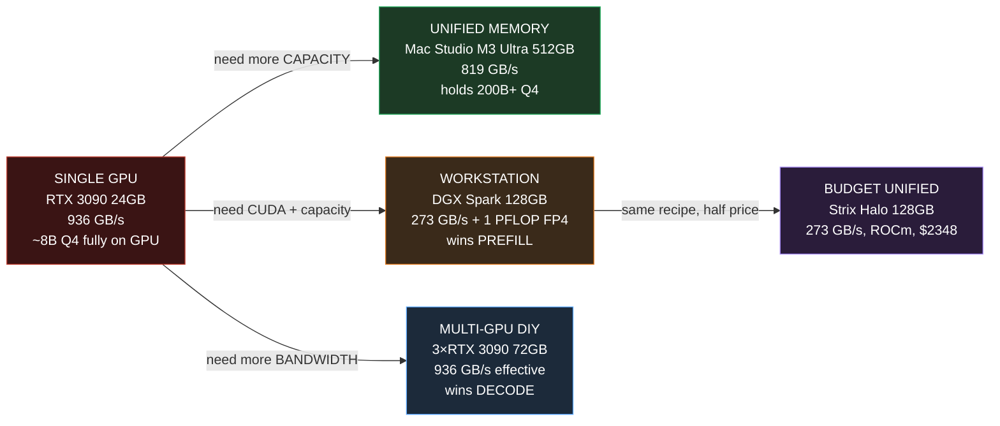
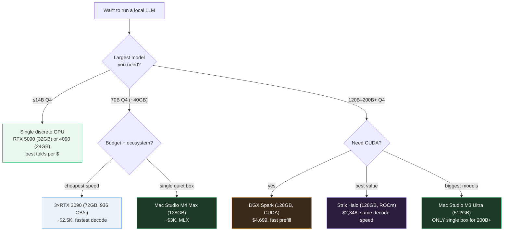
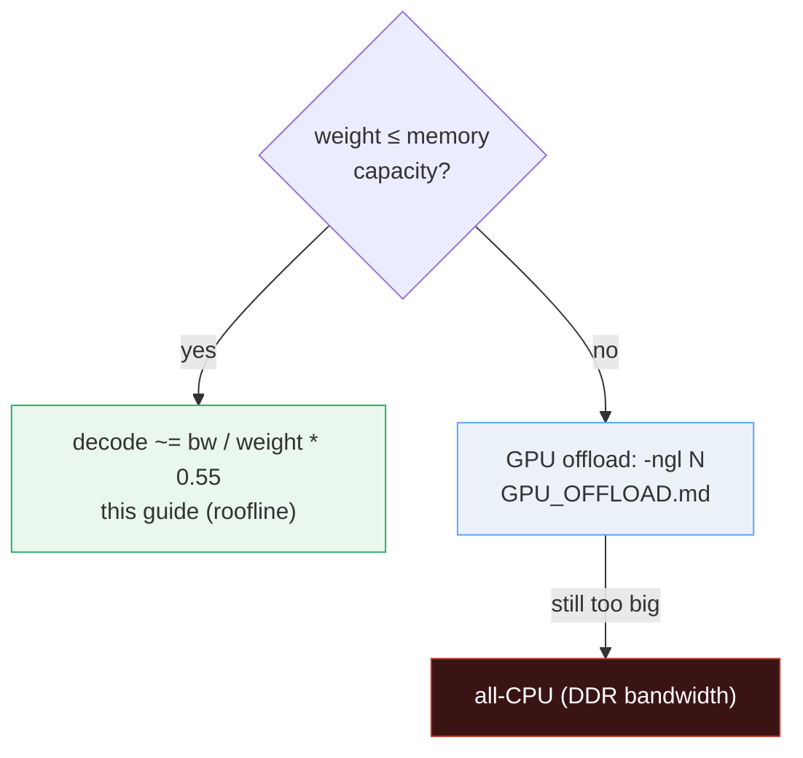

# Hardware Landscape — capacity decides what fits, bandwidth decides decode speed

> Companion: [hardware_landscape.py](https://github.com/quanhua92/tutorials/blob/main/local-llm/hardware_landscape.py)
> Live playground: [hardware_landscape.html](./hardware_landscape.html)
> The VRAM budget this builds on: [VRAM_ESTIMATOR.md](./VRAM_ESTIMATOR.md) 🔗
> When the model exceeds the GPU: [GPU_OFFLOAD.md](./GPU_OFFLOAD.md) 🔗

## 0. TL;DR

"Which computer do I buy to run local LLMs?" splits into **two independent
questions**, answered by **two different hardware specs**:

```
1. WILL IT FIT?        -> memory CAPACITY (GB)       [can I load the weights?]
2. HOW FAST IS DECODE? -> memory BANDWIDTH (GB/s)    [tok/s generation]
```

| Question | Spec | Set by | Example |
|---|---|---|---|
| **Will it fit?** | memory **capacity** (GB) | the model size + quant | 120B Q4 ≈ 63 GB → needs ≥128 GB box |
| **How fast (decode)?** | memory **bandwidth** (GB/s) | the roofline: `bw / bytes_per_token` | RTX 5090 (1792 GB/s) > Mac Mini M4 Pro (273 GB/s) |

**The one formula (the decode roofline):**

```
decode_tps ~= bandwidth_GBps / bytes_read_per_token
```

Decode is **memory-bandwidth-bound, not compute-bound**: to emit ONE token the
engine must stream (almost) all the active weights out of memory once. Doubling
bandwidth doubles tok/s; doubling FLOPS does ~nothing for decode. **Prefill is the
opposite** — it is compute-bound (FLOPS matter), which is why DGX Spark (1 PFLOP
FP4) wins prefill but loses decode to a 3×RTX 3090 (936 GB/s).

**Gold value** (reproduced in the HTML playground):

```
GPT-OSS 120B (MXFP4), measured effective bytes/token = bw / decode_tps:
  3×RTX 3090:  936 GB/s / 124.03 tps = 7.55 GB/token
  Strix Halo:  273 GB/s /  34.13 tps = 8.00 GB/token   <- gold (rounds clean)
Same model, ~constant bytes/token => decode IS bandwidth-bound.
```

---

## 1. The lineage — single GPU → unified → workstation → budget → multi-GPU



| Step | Problem it fixes | What changes |
|---|---|---|
| **1. SINGLE GPU (3090)** | — (the origin) | Cheap, fast (936 GB/s), but 24GB caps you at ~8B Q4 fully on GPU. Bigger models → offload to CPU ([GPU_OFFLOAD.md](./GPU_OFFLOAD.md)). |
| **2. UNIFIED (Mac Studio M3 Ultra)** | discrete VRAM too small | CPU + GPU share one memory pool: laptop-tier bandwidth (819 GB/s) but server-tier capacity (up to 512GB). The ONLY single box that holds 200B+ Q4. Trade-off: bandwidth-per-GB is ~3× worse than GDDR. |
| **3. WORKSTATION (DGX Spark)** | need CUDA + capacity | 128GB unified LPDDR5X (273 GB/s) + 1 PFLOP FP4 + full CUDA stack. Wins PREFILL (compute-bound); loses DECODE (273 GB/s = same as a budget Strix Halo). |
| **4. BUDGET (Strix Halo)** | Spark is expensive | Same 128GB / 273 GB/s recipe at ~half the price ($2,348), but ROCm not CUDA. Near-identical decode; ~5× slower prefill. The value pick. |
| **5. MULTI-GPU (3×3090)** | need max bandwidth | Three cards, pipeline-parallel: 72GB capacity + 936 GB/s effective decode bandwidth. Cheapest path to 100+ tok/s on 120B — at the cost of 1050W and no turnkey stack. |

---

## 2. The 2026 hardware table

Every number below is printed by `hardware_landscape.py`; the bandwidth/capacity
specs are from the vendor spec sheets, prices are 2026 market prices.

> From `hardware_landscape.py` Section A:
> ```
> | hardware                 | mem(GB) | bw(GB/s) | backend     | price       |
> |--------------------------|---------|----------|-------------|-------------|
> | 3x RTX 3090              |      72 |      936 | CUDA        | ~$2.5K      |
> | AMD Strix Halo           |     128 |      273 | ROCm        | $2,348 (Framework Desktop) |
> | DGX Spark (GB10)         |     128 |      273 | CUDA        | $4,699 (raised Feb 2026) |
> | Mac Mini M4 Pro          |      48 |      273 | Metal/MLX   | ~$1.6K      |
> | Mac Studio M3 Ultra      |     512 |      819 | Metal/MLX   | ~$6-12K (config-dependent) |
> | Mac Studio M4 Max        |     128 |      546 | Metal/MLX   | ~$2-4K      |
> | RTX 4090                 |      24 |     1008 | CUDA        | ~$1.6K      |
> | RTX 5090                 |      32 |     1792 | CUDA        | ~$2K        |
> | RX 7900 XTX              |      24 |      960 | ROCm/Vulkan | ~$900       |
> ```

**Read it in two directions:**

- **DOWN a column:** Mac Studio M3 Ultra has the most **capacity** (512GB); RTX 5090
  has the most **bandwidth** (1792 GB/s). **No single box wins both** — that is the
  central tension of the whole landscape.
- **ACROSS a row:** Strix Halo and DGX Spark share the *exact same* memory recipe
  (128GB / 273 GB/s) yet Strix Halo is ~half the price. You are paying for the CUDA
  stack and the FP4 tensor cores, not the memory.

> From `hardware_landscape.py` Section A (value metrics):
> ```
> | hardware                 | $/GB-mem | $/(GB/s)  | capacity tier | bw tier    |
> |--------------------------|----------|-----------|---------------|------------|
> | 3x RTX 3090              |    34.7  |      2.7  | big           | FAST       |
> | AMD Strix Halo           |    18.3  |      8.6  | HUGE          | low        |
> | DGX Spark (GB10)         |    36.7  |     17.2  | HUGE          | low        |
> | Mac Mini M4 Pro          |    33.3  |      5.9  | big           | low        |
> | Mac Studio M3 Ultra      |    17.6  |     11.0  | HUGE          | FAST       |
> | Mac Studio M4 Max        |    23.4  |      5.5  | HUGE          | mid        |
> | RTX 4090                 |    66.7  |      1.6  | small         | FAST       |
> | RTX 5090                 |    62.5  |      1.1  | small         | FAST       |
> | RX 7900 XTX              |    37.5  |      0.9  | small         | FAST       |
> ```

The discrete GPUs (RX 7900 XTX, RTX 5090/4090) have the **cheapest bandwidth** on
the market (`$/(GB/s)` < 2) but tiny capacity. The Mac Studio M3 Ultra has the
**cheapest capacity** (`$17.6/GB`) but mid bandwidth. DGX Spark is the most
expensive on *both* metrics — you pay a premium for the turnkey CUDA package.

---

## 3. Why decode is bandwidth-bound (the roofline)

During **decode** (generating one token at a time, batch=1), the engine must read
(almost) **all the active model weights** out of memory **once per token**. The
compute units sit idle waiting on memory. So:

```
decode_tps ~= bandwidth_GBps / bytes_read_per_token
```

This is the **roofline model**: the operation is pinned to the memory-throughput
ceiling, not the compute ceiling. Doubling bandwidth doubles tok/s; doubling FLOPS
does ~nothing for decode.

> From `hardware_landscape.py` Section B (dense 70B Q4_K_M = 39.38 GB):
> ```
> | hardware                 | bw(GB/s) | peak tps | est tps* |
> |--------------------------|----------|----------|----------|
> | 3x RTX 3090              |      936 |    23.8  |   13.1   |
> | AMD Strix Halo           |      273 |     6.9  |    3.8   |
> | DGX Spark (GB10)         |      273 |     6.9  |    3.8   |
> | Mac Mini M4 Pro          |      273 |     6.9  |    3.8   |
> | Mac Studio M3 Ultra      |      819 |    20.8  |   11.4   |
> | Mac Studio M4 Max        |      546 |    13.9  |    7.6   |
> | RTX 4090                 |     1008 |    25.6  |   14.1   |
> | RTX 5090                 |     1792 |    45.5  |   25.0   |
> | RX 7900 XTX              |      960 |    24.4  |   13.4   |
>   * est = peak * 0.55 (KV-cache reads + attention overhead)
> ```

Two facts this table forces on you:

1. **3×3090 (936 GB/s) decodes 3.4× faster than DGX Spark (273 GB/s)** — purely
   because of bandwidth. Same model, same quant.
2. **Mac Mini M4 Pro (273 GB/s) decodes a 70B at the SAME speed as a $4,699 DGX
   Spark** — they have identical bandwidth. The Spark's 1 PFLOP of compute buys
   you nothing here.

> ⚠️ This roofline is for **dense** models. MoE models (GPT-OSS, DeepSeek,
> Qwen3-MoE) read only the **active experts** per token (~7-8 GB for GPT-OSS 120B,
> not the full 60 GB on-disk), so they decode much faster than a dense 120B would —
> but the bandwidth-bound law still holds (Section 4 proves it with measurements).

---

## 4. The GPT-OSS 120B benchmark — the measured proof

GPT-OSS 120B in MXFP4 (4-bit), the canonical 2026 local-LLM benchmark, measured
across four very different systems. Source: hardware-corner.net +
aimultiple.com/dgx-spark-alternatives.

> From `hardware_landscape.py` Section C:
> ```
> | system               | prefill(tok/s) | decode(tok/s) | bw(GB/s) |
> |----------------------|----------------|---------------|----------|
> | 3x RTX 3090          |      1642.0    |      124.03   |      936 |
> | Mac Studio M3 Ultra  |         n/a    |       70.79   |      819 |
> | DGX Spark (GB10)     |      1723.1    |       38.55   |      273 |
> | AMD Strix Halo       |       339.9    |       34.13   |      273 |
> ```

**The diagnostic:** effective GB streamed per generated token = `bw / decode_tps`.
If decode is bandwidth-bound, this is ~constant across all hardware.

> From `hardware_landscape.py` Section C (effective bytes/token):
> ```
> | system               | bw(GB/s) | decode  | GB/token | reads how?        |
> |----------------------|----------|---------|----------|-------------------|
> | 3x RTX 3090          |      936 | 124.03  |    7.55  | CUDA (most efficient) |
> | Mac Studio M3 Ultra  |      819 |  70.79  |   11.57  | Metal/MLX (overhead) |
> | DGX Spark (GB10)     |      273 |  38.55  |    7.08  | CUDA (efficient) |
> | AMD Strix Halo       |      273 |  34.13  |    8.00  | ROCm |
> ```

GB/token clusters at **~7-8** for the CUDA/ROCm systems (the active MoE experts),
**~11.6** for the Mac (Metal/MLX moves more per token). The spread is software
efficiency, not a different model. The bandwidth-bound law holds:

```
decode(3×3090) / decode(DGX Spark) = 3.22   vs   bw ratio = 3.43
-> the ~3.2× measured decode gap tracks the ~3.4× bandwidth gap. That IS the
   bandwidth-bound signature.
[check] decode ratio (3x3090/DGX) within 15% of bandwidth ratio :  OK  (3.22 vs 3.43)
[check] same-bandwidth systems decode within 20% (DGX vs Strix, both 273 GB/s) :  OK
```

> From `hardware_landscape.py` Section C (gold):
> ```
> GOLD (for HARDWARE_LANDSCAPE.html): Strix Halo effective bytes/token
>     273 GB/s / 34.13 tok/s = 7.998828 GB/token  (~8.00 GB/token)
> [check] gold: Strix Halo bytes/token ~= 8.00 :  OK  (got 7.9988)
> ```

---

## 5. Prefill vs decode — compute-bound vs bandwidth-bound

LLM serving has **two phases with opposite bottlenecks**. Mixing them up is why
people buy the wrong hardware.

| Phase | What it does | Bottleneck | Wins on… |
|---|---|---|---|
| **PREFILL** | process the WHOLE prompt (one big matmul) | **COMPUTE** (FLOPS) | tensor cores |
| **DECODE** | emit ONE token at a time (batch=1) | **MEMORY** (bandwidth) | GB/s |

**Prefill** batches the entire prompt into one giant matmul, so the compute units
are the limit — FLOPS (tensor-core throughput) sets the speed. **Decode** emits one
token at a time, so each weight is read once per token and **memory bandwidth** is
the limit — FLOPS sit idle waiting for data.

> From `hardware_landscape.py` Section D:
> ```
> | system               | prefill | decode  | who wins prefill?   | who wins decode?  |
> |----------------------|---------|---------|---------------------|------------------|
> | DGX Spark (GB10)     |   1723  |  38.55  | 1 PFLOP FP4 -> WINS | 273 GB/s -> slow |
> | AMD Strix Halo       |    340  |  34.13  | ~50 TOPS -> slow    | 273 GB/s -> slow |
> | 3x RTX 3090          |   1642  | 124.03  | fast compute        | 936 GB/s -> WINS |
>
>   DGX Spark prefill / Strix Halo prefill = 5.1x
>   -> Spark's 1 PFLOP FP4 tensor cores crush prefill (compute-bound).
>   -> Yet they DECODE at nearly the same speed (both 273 GB/s, bandwidth-bound).
> ```

**Rule of thumb:** if your workload is **long prompts / short answers** (RAG, code
completion, document Q&A), prefill dominates → buy **compute** (DGX Spark, tensor
cores). If it is **chat / long generation**, decode dominates → buy **bandwidth**
(3×3090, Mac Studio). Section 7 shows you can split the two across machines.

---

## 6. "Which to buy?" — the decision tree + price/performance

Pick by your **largest model** and your **budget**. Memory capacity is a hard gate
(it either fits or it doesn't); bandwidth then sets the speed you get.

> From `hardware_landscape.py` Section E:
> ```
> | system               | price    | decode  | $/tok-per-sec | verdict           |
> |----------------------|----------|---------|---------------|-------------------|
> | 3x RTX 3090          |   $2,500 | 124.03  |           20  | best $/tok-s overall |
> | Mac Studio M3 Ultra  |   $9,000 |  70.79  |          127  | biggest models (512GB) |
> | DGX Spark (GB10)     |   $4,699 |  38.55  |          122  | prefill + CUDA stack |
> | AMD Strix Halo       |   $2,348 |  34.13  |           69  | best unified value |
> ```

**Decision tree (by what you want to run):**



| You want… | Buy | Why |
|---|---|---|
| ≤14B Q4, fast chat | RTX 5090 / 4090 | huge bandwidth, small but enough VRAM, best tok/s per $ |
| 70B Q4, cheapest speed | 3×RTX 3090 | 936 GB/s effective, 72GB, $20 per tok/s |
| 70B Q4, single quiet box | Mac Studio M4 Max | 128GB unified, 546 GB/s, MLX |
| 120B+ Q4, need CUDA | DGX Spark | 128GB + CUDA + 1 PFLOP FP4 (prefill) |
| 120B+ Q4, best value | Strix Halo | same 128GB/273 GB/s as Spark, half price |
| 200B+ Q4 (only single box) | Mac Studio M3 Ultra | 512GB — the ONLY one-box option |

---

## 7. The hybrid trick — disaggregate prefill from decode

Since prefill and decode have **opposite bottlenecks** (Section 5), no single box is
optimal at both. EXO Labs' insight: network **two** boxes and let each do the phase
it is best at.


Measured on GPT-OSS 120B (source: blog.exolabs.net), this disaggregated pair runs
**~2.8× faster end-to-end** than the Mac Studio alone:

> From `hardware_landscape.py` Section F:
> ```
>   Mac Studio alone:  prefill ~420 t/s, decode 70.79 t/s
>   Hybrid:            prefill ~1723 t/s (Spark), decode 70.79 t/s (Mac)
>   -> prefill speedup ~4.1x, decode unchanged; end-to-end ~2.8x (EXO Labs).
> [check] hybrid prefill (Spark) beats Mac-alone prefill :  OK
> [check] hybrid decode (Mac) beats Spark-alone decode :  OK
> ```

The Spark's prefill removes the Mac's weakness; the Mac's 819 GB/s decode removes
the Spark's 273 GB/s weakness. This is **prefill/decode disaggregation** at the
desktop scale — the same idea datacenters use (separate prefill pools from decode
pools). Cross-ref [../llm/DISAGGREGATED_SERVING.md](../llm/DISAGGREGATED_SERVING.md)
for the datacenter version.

---

## 8. "Will it fit + how fast?" — the calculator

For a given (model size, quant): does it **fit** in each hardware's capacity, and if
so what decode tok/s do we **estimate** (dense-model roofline at efficiency 0.55)?

> From `hardware_landscape.py` Section G:
> ```
> === 8B Q4_K_M  (8.0B @ 4.5 bpw = 4.5 GB weights) ===
> | hardware                 | fits? | est decode (tok/s) |
> |--------------------------|-------|--------------------|
> | 3x RTX 3090              |   yes |          114.4      |
> | AMD Strix Halo           |   yes |           33.4      |
> | DGX Spark (GB10)         |   yes |           33.4      |
> | Mac Mini M4 Pro          |   yes |           33.4      |
> | Mac Studio M3 Ultra      |   yes |          100.1      |
> | Mac Studio M4 Max        |   yes |           66.7      |
> | RTX 4090                 |   yes |          123.2      |
> | RTX 5090                 |   yes |          219.0      |
> | RX 7900 XTX              |   yes |          117.3      |
> ```

> From `hardware_landscape.py` Section G (120B):
> ```
> === 120B Q4  (120.0B @ 4.0 bpw = 60.0 GB weights) ===
> | hardware                 | fits? | est decode (tok/s) |
> |--------------------------|-------|--------------------|
> | 3x RTX 3090              |   yes |            8.6      |
> | AMD Strix Halo           |   yes |            2.5      |
> | DGX Spark (GB10)         |   yes |            2.5      |
> | Mac Mini M4 Pro          |    NO |  offload (see gpu_offload) |
> | Mac Studio M3 Ultra      |   yes |            7.5      |
> | Mac Studio M4 Max        |   yes |            5.0      |
> | RTX 4090                 |    NO |  offload (see gpu_offload) |
> | RTX 5090                 |    NO |  offload (see gpu_offload) |
> | RX 7900 XTX              |    NO |  offload (see gpu_offload) |
> ```

- **8B Q4 (4.5 GB):** fits *everything*, even a 24GB card. A single RTX 5090
  estimates ~219 tok/s — 1792 GB/s is enormous for 4.5 GB of weights.
- **120B Q4 (60 GB):** fits Mac Studio M3 Ultra (512GB), the 128GB unified boxes
  (DGX Spark / Strix Halo / M4 Max), AND 3×RTX 3090 (72GB). A single 24-32GB
  discrete GPU **cannot** hold it → must offload to CPU (slow). (MoE models like
  GPT-OSS decode faster than this dense estimate — see the measured 124 tok/s in
  Section 4.)



---

## 9. Pitfalls (trap → symptom → fix)

| Trap | Symptom | Fix |
|---|---|---|
| **Confusing capacity and bandwidth** | "My RTX 5090 has 32GB, so it'll run a 120B fast" — it loads a few layers then decodes at 2 tok/s | 32GB is **capacity** (what fits); 1792 GB/s is **bandwidth** (decode speed). A 120B Q4 needs 60GB of **capacity** first — it won't fit at all on 32GB without offload. Check capacity (fits?) THEN bandwidth (how fast?). |
| **Expecting FLOPS to speed up decode** | Buying DGX Spark (1 PFLOP) expecting fast chat, getting 38 tok/s on 120B | Decode is **bandwidth-bound**, not compute-bound. The 1 PFLOP only helps **prefill** (compute-bound). For fast decode, buy **bandwidth** (GB/s), not FLOPS. |
| **Quoting aggregate bandwidth for multi-GPU as 3× one card** | Claiming 3×3090 = 2808 GB/s and expecting 370 tok/s | In llama.cpp's default **pipeline-parallel** layer split, only one card streams per layer, so effective decode bandwidth ≈ 936 GB/s (one card), not 2808. The win is 3× **capacity** (72GB) + full single-card bandwidth, not 3× bandwidth. (Tensor-parallel mode can approach aggregate bandwidth but adds NCCL all-reduce overhead.) |
| **Comparing decode tok/s across model types** | "GPT-OSS 120B does 124 tok/s, so a dense 120B will too" | GPT-OSS is **MoE** — only ~7-8 GB of active experts is read per token. A **dense** 120B reads all 60 GB and would decode ~8× slower at the same bandwidth. Always note dense vs MoE. |
| **Trusting unified-memory bandwidth as equivalent to GDDR** | Assuming Mac Studio 819 GB/s ≈ RTX 4090 1008 GB/s in practice, then wondering why the Mac underperforms | Same raw GB/s, but Metal/MLX reads **~11.6 GB/token** vs CUDA's **~7.5 GB/token** for the same model (more data moved, lower memory-access efficiency). The effective bytes/token differs by ~1.5× across software stacks. |
| **Forgetting usable memory < nominal** | "128GB box, model is 63GB, I'm fine" → OOM at long context | Capacity must also hold the **KV cache** (linear in context) + overhead. Use [VRAM_ESTIMATOR.md](./VRAM_ESTIMATOR.md) for the exact weights+KV+overhead budget; plan for ~90% of nominal. |
| **Ignoring prefill for RAG / agent workloads** | Buying a decode monster (3×3090) for a RAG pipeline with huge prompts, getting slow prompt ingestion | If prompts are long and answers short, **prefill** (compute-bound) dominates. DGX Spark (1 PFLOP FP4) ingests prompts ~5× faster than Strix Halo. Match the bottleneck to the workload. |
| **Assuming Strix Halo == DGX Spark** | Buying Strix Halo for a CUDA-only workflow, then hitting the ROCm software gap | Same **decode** speed (both 273 GB/s), but Strix Halo is ROCm, not CUDA — ~5× slower **prefill** and a shallower ecosystem. Decode-bound chat: fine. CUDA-specific tooling / fast prefill: buy the Spark. |

---

## 10. Cheat sheet

```
# the two specs that matter
CAPACITY  (GB)    -> will it fit?        weight = params_b * bpw / 8  (see VRAM_ESTIMATOR)
BANDWIDTH (GB/s)  -> how fast decode?    tps ~= bw / bytes_per_token

# the decode roofline (memory-bound)
decode_tps ~= bandwidth_GBps / bytes_read_per_token
            = bandwidth_GBps / (active_weight_GB) * 0.55   # dense, est

# prefill is the opposite (compute-bound) -> FLOPS matter, bandwidth ~doesn't

# effective bytes/token (the bandwidth-bound diagnostic)
bytes_per_token = bandwidth_GBps / measured_decode_tps    # ~constant => bw-bound
```

| You want… | Spec to maximize | Hardware class |
|---|---|---|
| Run a bigger model | **capacity** (GB) | unified memory (Mac Studio, DGX Spark, Strix Halo) |
| Faster chat / decode | **bandwidth** (GB/s) | discrete GPU (RTX 5090/4090) or multi-GPU (3×3090) |
| Faster prompt ingestion / RAG | **compute** (FLOPS) | tensor cores (DGX Spark FP4) |
| Best decode value | **bandwidth / $** | 3×RTX 3090 ($20/tok-s) |
| Best big-model value | **capacity / $** | Strix Halo ($18.3/GB) |

| 2026 token | Meaning |
|---|---|
| **decode = bandwidth-bound** | tok/s set by GB/s, not FLOPS — the #1 insight in this guide |
| **prefill = compute-bound** | tok/s set by FLOPS (tensor cores) |
| **unified memory** | CPU + GPU share one pool (Mac, DGX Spark, Strix Halo): big capacity, mid bandwidth |
| **disaggregate** | run prefill on one box, decode on another (the hybrid trick, Section 7) |

---

## 🔗 Cross-references

- **[VRAM_ESTIMATOR.md](./VRAM_ESTIMATOR.md)** 🔗 — the exact `weights + KV + overhead`
  budget that decides whether a model **fits** in a given hardware's *capacity*. This
  guide's capacity check (`fits?`) is that estimator's total-vs-GPU test.
- **[GPU_OFFLOAD.md](./GPU_OFFLOAD.md)** 🔗 — what to do when the model **doesn't
  fit** in GPU VRAM: split the layer stack across GPU + CPU with `-ngl N`. The
  escape hatch when a 120B won't go on a single 24GB card.
- **[../llm/DISAGGREGATED_SERVING.md](../llm/DISAGGREGATED_SERVING.md)** — the
  datacenter version of Section 7's hybrid trick: separate prefill pools from
  decode pools. Same idea (opposite bottlenecks), rack scale instead of desk scale.
- **[../llm/NCCL_COLLECTIVES.md](../llm/NCCL_COLLECTIVES.md)** — the multi-GPU
  bandwidth story: tensor-parallel all-reduce is what lets 3×3090 approach aggregate
  bandwidth (and the overhead that keeps pipeline-parallel at single-card effective BW).
- **[QUANT_TYPES.md](./QUANT_TYPES.md)** — the `bpw` knob that sets the weight
  footprint (and hence both whether it fits *and* the bytes/token in the roofline).

---

## Sources

- [AIMultiple: DGX Spark vs Mac Studio & Halo — Benchmarks & Alternatives](https://aimultiple.com/dgx-spark-alternatives) — the canonical cross-system comparison; the GPT-OSS 120B prefill/decode numbers (DGX Spark 1723/38.55, Strix Halo 340/34.13, 3×3090 1642/124.03) and the $/GB, $/(GB/s) value analysis this guide formalizes.
- [Hardware-Corner.net: First DGX Spark LLM Benchmarks](https://www.hardware-corner.net/first-dgx-spark-llm-benchmarks/) — Allan Witt's llama.cpp benchmarks comparing DGX Spark, Strix Halo, and multi-GPU systems on GPT-OSS 120B MXFP4 (the measured tok/s this guide uses as gold values).
- [EXO Labs: DGX Spark + Mac Studio hybrid disaggregated inference](https://blog.exolabs.net/nvidia-dgx-spark/) — the ~2.8× end-to-end speedup from splitting prefill (Spark) and decode (Mac Studio) across the network (Section 7).
- [NVIDIA DGX Spark product page](https://www.nvidia.com/en-us/products/workstations/dgx-spark/) — official specs: 128GB LPDDR5X unified, 273 GB/s, up to 1 PFLOP FP4 (with sparsity), ConnectX-7 200 Gbps NIC.
- [Tom's Hardware: DGX Spark price increase](https://www.tomshardware.com/desktops/mini-pcs/nvidia-dgx-spark-gets-18-percent-price-increase-as-memory-shortages-bite-founders-edition-now-usd4-699-up-from-usd3-999) — the Feb 2026 MSRP rise to $4,699 (memory supply constraints).
- [Framework Desktop (Strix Halo)](https://community.frame.work/t/dgx-spark-vs-strix-halo-initial-impressions/77055) — the $2,348 128GB ROCm alternative and head-to-head DGX Spark impressions.
- AMD RX 7900 XTX spec sheet — 24GB GDDR6, 384-bit bus, 20 Gbps → 960 GB/s (the correct figure; 819 GB/s sometimes quoted online is the Mac Studio M3 Ultra's bandwidth).
