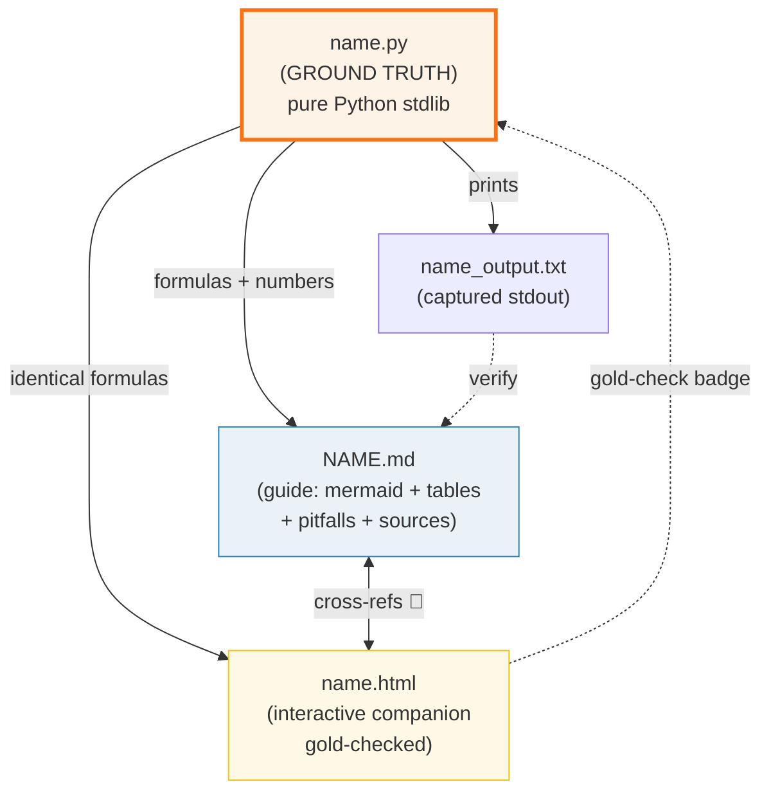
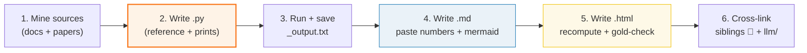

# HOW_TO_RESEARCH — Local LLM Inference "Concept-as-a-Bundle" Workflow

> Adapted from `concept-builder/SKILL.md`, `llm/HOW_TO_RESEARCH.md`, and
> `observability/HOW_TO_RESEARCH.md`. This is the per-bundle workflow — how to
> build ONE bundle by hand. For delegating many at once, see
> [`SUBAGENTS_RESEARCH_GUIDE.md`](./SUBAGENTS_RESEARCH_GUIDE.md).
>
> **Companion to [`llm/`](../llm/HOW_TO_RESEARCH.md)** — the algorithm/math side.
> This folder is the **practical runtime side**: how to run those models on YOUR
> machine (laptop, desktop, edge device). Each bundle cross-links to `llm/` at
> shared concepts (quantization, KV cache, RoPE, sampling, spec decoding).

---

## 0. The one rule

> **Every concept is a bundle of files that cite each other, all deriving from ONE
> ground-truth `.py`. Nothing is ever hand-computed.**

If a number appears in a `.md` or `.html`, it was either printed by the `.py` or
recomputed with the *identical* formula and spot-checked against it.



---

## 1. Focus

This folder covers **local LLM inference** — running language, image, video, and
audio models on your own hardware. The lens is **practical**: formats, runtimes,
hardware budgets, tooling, and the ecosystem.

| Phase | Focus | Bundles |
|---|---|---|
| **1 — Format & Runtime** | GGUF, GGML compute graph, mmap, quant types | 4 |
| **2 — Hardware & Memory** | VRAM math, GPU offload, CPU SIMD, threading, 2026 hardware landscape | 5 |
| **3 — Inference Features** | Context extension, KV cache quant, grammar output, spec decoding | 4 |
| **4 — Serving & Ecosystem** | vLLM serving, Ollama+LM Studio, Apple MLX, Open WebUI | 4 |
| **5 — Image & Video Gen** | Diffusion fundamentals, ComfyUI, Flux GGUF, LTX-Video, Wan 2.2 | 5 |
| **6 — Audio & Music** | Kokoro TTS, Qwen3-TTS, Whisper STT, music generation (ACE-Step/YuE) | 4 |
| | **Total** | **26** |

### What this folder is NOT (to avoid duplication with `llm/`)

| Concept | `llm/` covers | `local-llm/` covers |
|---|---|---|
| Quantization | W4A16 group quant (server-side, PyTorch) | GGUF block quants Q4_0/Q4_K_M/IQ3_S (local, GGML) |
| KV cache | Dense → paged → radix tree (engine internals) | KV cache quant Q8_0/Q4_0 (memory savings on local GPU) |
| RoPE | The base rotation (math derivation) | RoPE scaling for context extension (NTK/YaRN/dynamic) |
| Sampling | greedy → top-k → top-p (algorithm) | Grammar-constrained sampling (GBNF → token mask) |
| Spec decoding | Rejection sampling math (paper-level) | llama.cpp `--draft` flag, practical speedup |
| Paged attention | vLLM internals (logical→physical pages) | When to use vLLM vs llama.cpp locally |

---

## 2. The four roles of each file

| File | Role | Hard rules |
|---|---|---|
| **`name.py`** | Ground truth. Pure Python stdlib simulation/implementation of the concept. | `python3 name.py` (NO torch, NO external deps). `banner()`/`check()` helpers. Seeded RNG. Sorted maps. Tiny dims. |
| **`name_output.txt`** | Captured stdout. Committed. | `python3 name.py > name_output.txt 2>/dev/null` |
| **`NAME}.md`** | Static guide. Architecture + internals + practical config + pitfalls. | Numbers from `_output.txt` verbatim under `> From name.py Section X:` callouts. Mermaid diagrams. Pitfalls table. Cheat sheet. `## Sources`. |
| **`name.html`** | Interactive companion. Dark palette, orange accent. | Zero deps (inline `<style>`+`<script>`). Gold-check badge `[check: OK]`. Full GitHub URL badges. `./index.html` back-link. |

### No torch, no problem

Unlike `llm/` which uses PyTorch for tensor math, `local-llm/` bundles use **pure
Python stdlib only**. These concepts are about formats, runtimes, hardware math,
and tooling — not GPU kernel internals. When you need to show a dequant or a VRAM
calculation, implement it with plain Python arithmetic.

### Determinism hard rules (or `_output.txt` won't reproduce)

| Trap | Fix |
|---|---|
| Dict/set iteration randomized | `sorted(d.keys())` before printing |
| Float drift | `f"{x:.6f}"` or `.toFixed(1)` in JS |
| Unseeded RNG | `random.seed(42)` |
| Wall-clock as value | NEVER `time.time()` / `Date.now()` for a verified number |
| Pointer address | assert structural facts, never the address |

---

## 3. The `.md` structure

```markdown
# [Concept] — [one-line summary]

> Companion: [name.py](https://github.com/quanhua92/tutorials/blob/main/local-llm/name.py)
> Live: [name.html](./name.html)

## 0. TL;DR
## 1. What it is (lineage old → new, WHY each step)
[mermaid diagram — architecture/data flow/decision tree]
## 2. The mechanism (internals)
> From name.py Section A:
> ```
>   [verbatim output from _output.txt]
> ```
## 3. Practical config / commands
[real CLI flags, config files, commands — cited from docs]
## 4. Worked example
> From name.py Section B:
> ```
>   [numbers]
> ```
## 5. Pitfalls (trap | symptom | fix)
| Trap | Symptom | Fix |
|---|---|---|
## 6. Cheat sheet
## 🔗 Cross-references
- [SIBLING](../llm/SIBLING.md) — one-line WHY
## Sources
- [URL1] (official docs)
- [URL2] (paper/benchmark)
```

### Mermaid diagrams

Every `.md` must have **at least one** mermaid diagram (renders natively on GitHub).
Prefer: architecture diagrams, data flow, decision trees, comparison tables.

**Mermaid syntax rules** (to avoid GitHub rendering failures):
- Always use `-.->|label|` for dotted arrows with labels. Never `-.label.>`
- Quote edge labels containing `()` or `{}`: `|"text (parens)"|`
- Validate with `npx @mermaid-js/mermaid-cli` before shipping (see
  `skills/concept-builder/SKILL.md` §15.1)

### The pitfalls table is non-negotiable

It is the "expert payoff" — the silent-bug traps that separate juniors from experts.
Re-spawn any worker that ships a `.md` without one.

---

## 4. The `.html` structure

Single file, zero external deps (EXCEPT Tailwind Play CDN for styling), opens from
`file://`. Dark palette with orange accent.

```html
<!doctype html>
<html lang="en">
<head>
<meta charset="UTF-8" />
<meta name="viewport" content="width=device-width, initial-scale=1.0" />
<script src="https://cdn.jsdelivr.net/npm/@tailwindcss/browser@4"></script>
<style type="text/tailwindcss">
  @theme {
    --color-bg:#0d1117; --color-panel:#161b22; --color-ink:#e6edf3;
    --color-muted:#8b949e; --color-border:#30363d;
    --color-orange:#f97316; --color-green:#27ae60; --color-blue:#58a6ff;
  }
</style>
<style>
  .badge { display:inline-flex; align-items:center; gap:4px; padding:3px 10px;
    border-radius:9999px; font-size:.78rem; font-weight:600; border:1px solid; }
  .badge.md { color:#27ae60; border-color:rgba(39,174,96,.4);
    background:rgba(39,174,96,.08); }
  .badge.py { color:#e67e22; border-color:rgba(230,126,34,.4);
    background:rgba(230,126,34,.08); }
  .guide-callout { border-left:3px solid #f97316; background:rgba(249,115,22,.06);
    padding:10px 14px; border-radius:0 6px 6px 0; margin:12px 0; }
  .goldcheck { color:#27ae60; font-weight:700; }
</style>
</head>
<body class="bg-bg text-ink px-4 sm:px-6">
<header>
  <h1>...<span style="color:#f97316">Concept Title</span></h1>
  <a href="GUIDE.md URL" class="badge md" title="Full guide">📖 NAME.md</a>
  <a href="PY URL" class="badge py" title="Ground-truth source code">📄 name.py</a>
  <div class="guide-callout">📖 Read the full guide — ...</div>
</header>
<main> ... interactive panels ... </main>
<footer><a href="./index.html">← back to Local LLM dashboard</a></footer>
<script>
  // recompute with IDENTICAL formula from .py
  // gold-check: compare to known .py value
  // show [check: OK] or [check: FAIL]
</script>
</body>
</html>
```

### Gold-check rules

1. Pick one concrete value the `.py` prints (the "gold value").
2. In the `.html`'s `<script>`, recompute it with the **identical** formula.
3. Compare; show badge: `[check: OK]` (green) or `[check: FAIL]` (red).
4. `node --check` the extracted `<script>` before shipping (must pass).

JS gold-check conventions:
- `.join(",")` — no spaces after commas
- Floats: `.toFixed(1)` on both sides
- `const` never reassigned → use `let` if you need reassignment

### Link rules

- `.md` / `.py` links in `.html` headers: **full GitHub URLs** (`https://github.com/quanhua92/tutorials/blob/main/local-llm/NAME.md`)
- Back-link: `./index.html` (the local-llm dashboard, NOT `../index.html`)
- Cross-section links to `llm/`: `../llm/NAME.md` (relative) or full GitHub URL

---

## 5. The workflow (step by step)



### Step 1 — Mine the source
- Read official docs (llama.cpp GitHub, GGUF spec, Ollama docs, MLX docs, etc.)
- Read the relevant papers (arXiv) for architecture details
- Note: the code, the math, the pitfalls, the "what to implement" checklists

### Step 2 — Write the `.py` (the keystone)
- One clean implementation that is the reference
- A `section_*()` function per teachable point, each printing a **banner** + table
- Use a *tiny* but *complete* example (e.g. 4-element block, 8-layer model) so
  every number prints while every behavior shows
- **Deterministic inputs** (hardcoded values, seeded RNG)

### Step 3 — Run & capture
```bash
cd local-llm
python3 name.py > name_output.txt 2>/dev/null   # also prints to terminal
```
Verify `[check] ... OK` lines pass before moving on.

### Step 4 — Write the `.md`
- Paste tables **verbatim** from `_output.txt`, each under a `> From name.py Section X:` callout
- Add mermaid diagrams for the *dynamic* structure
- Add pitfalls table (the expert payoff)
- End with cheat sheet + `## Sources` (web-verified URLs)

### Step 5 — Write the `.html`
- Recompute in JS with the same formula
- **Gold-check** one known value from the `.py` → `[check: OK]` badge
- `node --check` the extracted `<script>` before shipping

### Step 6 — Cross-link
- `.md` ↔ sibling `.md` (🔗 markers for conceptual contrasts)
- `.md` ↔ `llm/` guides (the algorithm side, for depth)
- `.html` ↔ its `.md` (badges in the header)

---

## 6. Source material

### Primary sources (per concept)

| Concept | Primary source |
|---|---|
| GGUF format | [GGUF spec](https://github.com/ggml-org/llama.cpp/blob/master/gguf-py/gguf/gguf.py), [HuggingFace GGUF docs](https://huggingface.co/docs/hub/en/gguf) |
| Quant types | [k-quants docs](https://github.com/ggml-org/llama.cpp/blob/master/examples/quantize/README.md), [imatrix docs](https://github.com/ggml-org/llama.cpp/tree/master/examples/imatrix) |
| GGML backend | [ggml source](https://github.com/ggml-org/llama.cpp/tree/master/ggml), [backend scheduling docs](https://github.com/ggml-org/llama.cpp/wiki/Backend) |
| mmap | [llama.cpp mmap docs](https://github.com/ggml-org/llama.cpp/discussions/3800), POSIX `mmap(2)` |
| VRAM math | [llama.cpp memory math](https://github.com/ggml-org/llama.cpp/discussions/3800), [VRAM calculator](https://vram-calculator.ai/) |
| GPU offload | [llama.cpp `-ngl` docs](https://github.com/ggml-org/llama.cpp/blob/master/examples/cli/README.md) |
| CPU SIMD | [ggml-cpu SIMD impl](https://github.com/ggml-org/llama.cpp/tree/master/ggml/src/ggml-cpu), Intel/ARM intrinsics guides |
| Hardware | [Hardware-Corner.net benchmarks](https://hardware-corner.net), [AIMultiple DGX Spark analysis](https://aimultiple.com/dgx-spark-alternatives) |
| Context extension | [NTK-aware paper](https://www.reddit.com/r/LocalLLaMA/comments/14lz7j5), [YaRN paper arXiv:2309.00071](https://arxiv.org/abs/2309.00071) |
| KV cache quant | [llama.cpp KV cache quant PR](https://github.com/ggml-org/llama.cpp/pull/2832) |
| Grammar output | [GBNF docs](https://github.com/ggml-org/llama.cpp/blob/master/grammars/README.md) |
| Spec decoding | [speculative decoding in llama.cpp](https://github.com/ggml-org/llama.cpp/pull/2926) |
| vLLM | [vLLM docs](https://docs.vllm.ai/), [PagedAttention paper arXiv:2309.06180](https://arxiv.org/abs/2309.06180) |
| Ollama | [Ollama docs](https://github.com/ollama/ollama), [Modelfile docs](https://github.com/ollama/ollama/blob/main/docs/modelfile.md) |
| MLX | [MLX docs](https://ml-explore.github.io/mlx/), [MLX GitHub](https://github.com/ml-explore/mlx) |
| Open WebUI | [Open WebUI docs](https://docs.openwebui.com/) |
| Diffusion | [DDPM paper arXiv:2006.11239](https://arxiv.org/abs/2006.11239), [DDIM paper arXiv:2010.02502](https://arxiv.org/abs/2010.02502) |
| ComfyUI | [ComfyUI GitHub](https://github.com/comfyanonymous/ComfyUI) |
| Flux | [Flux.1 blog](https://blackforestlabs.ai/), [GGUF Flux](https://github.com/city96/ComfyUI-GGUF) |
| LTX-Video | [LTX-Video GitHub](https://github.com/Lightricks/ltx-video) |
| Wan 2.2 | [Wan2.1 GitHub](https://github.com/Wan-Video/Wan2.1), [ComfyUI Wan docs](https://docs.comfy.org/tutorials/video/wan/wan2_2) |
| Kokoro TTS | [Kokoro-82M HuggingFace](https://huggingface.co/hexgrad/Kokoro-82M), [StyleTTS2 paper arXiv:2306.07691](https://arxiv.org/abs/2306.07691) |
| Qwen3-TTS | [Qwen3-TTS blog](https://qwen.ai/blog?id=qwen3tts-0115), [GitHub](https://github.com/qwenlm/qwen2.5-omni) |
| Whisper | [Whisper paper arXiv:2212.04356](https://arxiv.org/abs/2212.04356), [faster-whisper](https://github.com/SYSTRAN/faster-whisper) |
| Music gen | [ACE-Step GitHub](https://github.com/ace-step/ACE-Step), [YuE GitHub](https://github.com/multimodal-art-projection/YuE) |

### Cross-references to `llm/`

| `local-llm/` bundle | Cross-refs to `llm/` | Why |
|---|---|---|
| quant_types | QUANTIZATION | Block-quant (GGUF) vs W4A16 (server) |
| ggml_backend | FLASH_ATTENTION | Same op, different backend |
| vram_estimator | KV_CACHE | The cache term in the VRAM budget |
| gpu_offload | KTRANSFORMERS_OFFLOAD | CPU weight storage principle |
| context_extension | ROPE | Scaling the base rotation |
| kv_cache_quant | KV_CACHE | Dense cache → quantized cache |
| grammar_output | SAMPLING | Constrained sampling |
| speculative_local | SPECULATIVE_DECODING | Same algo, local impl |
| vllm_serving | PAGED_ATTENTION, SCHEDULER | The deep math behind vLLM |
| open_webui | (vector-db/) | 9 vector DB backends |

---

## 7. Verification discipline (do not skip)

```bash
cd local-llm
for name in gguf_format quant_types ggml_backend mmap_weights \
            vram_estimator gpu_offload cpu_simd threading hardware_landscape \
            context_extension kv_cache_quant grammar_output speculative_local \
            vllm_serving ollama_lmstudio mlx_inference open_webui \
            diffusion_fundamentals comfyui_workflow flux_gguf ltx_video wan_video \
            tts_kokoro qwen3_tts whisper_stt music_generation; do
  echo "===== $name ====="
  python3 "$name.py" > /tmp/$name.out 2>/tmp/$name.err \
    && echo "  py: OK" || { echo "  py: FAILED"; cat /tmp/$name.err; }
  grep -c "\[check\]" /tmp/$name.out | xargs -I{} echo "  checks printed: {}"
  python3 -c "import re; h=open('$name.html').read(); \
    open('/tmp/$name.js','w').write(re.search(r'<script>(.*?)</script>',h,re.S).group(1))" 2>/dev/null
  node --check /tmp/$name.js 2>/dev/null && echo "  html JS: OK" || echo "  html JS: FAIL"
  test -s "${name}_output.txt" && echo "  output.txt: present" || echo "  output.txt: MISSING"
done
```

1. **`.py` self-checks:** every `[check] ... OK` passes.
2. **`.md` traceability:** every number under a `> From name.py Section X:` callout.
3. **`.html` gold-check:** `[check: OK]` green badge, `node --check` passes.
4. **Mermaid:** validate with `mmdc` before shipping.

---

## 8. Adding a new concept (checklist)

- [ ] Research the concept (official docs + papers + benchmarks).
- [ ] `name.py`: reference impl + `section_*()` printouts + `[check]` asserts.
- [ ] `python3 name.py > name_output.txt 2>/dev/null` — all checks pass.
- [ ] `NAME.md`: mermaid + verbatim tables + pitfalls + cheat sheet + `## Sources`, 🔗 to siblings + `llm/`.
- [ ] `name.html`: recompute in JS, gold-check badge, links to `.md`/`.py` (full GitHub URLs), `./index.html` back-link, `node --check` passes.
- [ ] Add card to `index.html` dashboard.
- [ ] Add row to `TODO.md`.

---

## 9. The directory layout

```
local-llm/
├── HOW_TO_RESEARCH.md          ← you are here (per-bundle workflow)
├── SUBAGENTS_RESEARCH_GUIDE.md ← delegation mechanics (parallel workers)
├── TODO.md                     ← the phase-by-phase build queue (26 bundles)
├── index.html                  ← dashboard (26 cards, 6 phases, orange accent)
│
├── gguf_format.py              ─┐
├── gguf_format_output.txt       │ one concept
├── GGUF_FORMAT.md               │ bundle
├── gguf_format.html            ─┘
│
├── quant_types.py              ─┐
├── ...                          │ another bundle
│                               ─┘
```

A **concept bundle** = `{name}.py` + `{name}_output.txt` + `{NAME}.md` + `{name}.html`.
When you add a concept, add all four.
