# KV Cache Quantization — Q8_0 / Q4_0 for memory savings

> Companion: [kv_cache_quant.py](https://github.com/quanhua92/tutorials/blob/main/local-llm/kv_cache_quant.py)
> Live: [kv_cache_quant.html](./kv_cache_quant.html)

## 0. TL;DR

The KV cache stores K and V tensors for every token in context, for every KV
head, in every layer. At long context it becomes the **dominant VRAM consumer**
— sometimes as large as the weights themselves. You can quantize the cache
**independently** of the weights: keep Q4_K_M weights (good quality) and drop
the cache from FP16 (2 B/E) to Q8_0 (1.0625 B/E) or Q4_0 (0.5625 B/E).

| format | B/E | savings vs FP16 | quality loss |
|--------|-----|-----------------|--------------|
| FP16 | 2.0000 | baseline | none |
| Q8_0 | 1.0625 | **47%** | negligible (<1% perplexity) |
| Q4_0 | 0.5625 | **72%** | moderate (2–8% perplexity) |

llama.cpp: `--cache-type-k q8_0 --cache-type-v q8_0` (or `-ctk q8_0 -ctv q8_0`).

---

## 1. What it is (lineage old → new)

```mermaid
graph LR
    FP16["FP16 KV cache<br/>2 B/E<br/>(default)"] -->|halve memory| Q8["Q8_0 KV cache<br/>1.0625 B/E<br/>block quant + fp16 scale"]
    Q8 -->|quarter memory| Q4["Q4_0 KV cache<br/>0.5625 B/E<br/>aggressive 4-bit"]
    style FP16 fill:#1a2744,stroke:#58a6ff
    style Q8 fill:#1a3a25,stroke:#27ae60
    style Q4 fill:#3a2a14,stroke:#f97316
```



**WHY each step exists:**

1. **FP16 (default):** The cache is stored in the same precision as the attention
   computation (fp16). No quality loss. But at 32K+ context this is huge — for
   Llama-3-8B it is 4.00 GB, nearly as large as the Q4_K_M weights (~4.5 GB).

2. **Q8_0 KV:** Quantize the cache to 8-bit blocks (32 int8 + 1 fp16 scale per
   block). Nearly halves the cache with **under 1% perplexity increase**. This is
   the "free lunch" — enable it whenever the cache is even slightly tight.

3. **Q4_0 KV:** Aggressive 4-bit cache. Quarters the cache at the cost of
   moderate quality loss. Acceptable for chat / long-context retrieval where
   exact per-token precision matters less. Avoid for code/math.

---

## 2. The mechanism (block quant format)

KV cache quantization reuses the **same GGML block format** as weight
quantization (cross-ref `quant_types`). Each block of 32 elements shares one
fp16 scale, giving each block its own dynamic range.

```
Block layout:
  Q8_0:  [fp16 scale: 2 bytes] [32 × int8: 32 bytes]  = 34 bytes / 32 elems
  Q4_0:  [fp16 scale: 2 bytes] [32 × int4: 16 bytes]  = 18 bytes / 32 elems
```

> From kv_cache_quant.py Section B:
> ```
> | format | data bits | data bytes/32 | scale | block bytes | B/E     | savings vs FP16 |
> |--------|-----------|----------------|-------|-------------|---------|-----------------|
> | FP16   |        16 |             64 |     0  |          64 |  2.0000 |        baseline |
> | Q4_0   |         4 |             16 |     2  |          18 |  0.5625 |           71.9% |
> | Q8_0   |         8 |             32 |     2  |          34 |  1.0625 |           46.9% |
> ```

The 2-byte fp16 scale per 32 elements is the **overhead floor**: it prevents
Q4_0 from reaching the theoretical 8× savings (4 bits vs 16 bits). At 0.5625
B/E the real savings is ~3.6×, not 4×. But the scale is what **preserves
quality**: each block gets its own dynamic range, so outliers are not crushed.

### KV cache size formula

```
bytes = n_layers × 2 (K+V) × n_ctx × n_kv_heads × head_dim × bytes_per_element
GB    = bytes / 1024³
```

The `× 2` is for K and V (both stored). `n_kv_heads` (not `n_heads`) because
GQA models share KV across query-head groups. `bytes_per_element` is the only
knob that doesn't trade quality for architecture: FP16=2.0, Q8_0=1.0625,
Q4_0=0.5625.

---

## 3. Practical config / commands

### llama.cpp CLI

```bash
# Q8_0 KV cache (~2x savings, <1% quality loss) — RECOMMENDED
./llama-cli -m model.gguf -c 32768 --cache-type-k q8_0 --cache-type-v q8_0
# shorthand:
./llama-cli -m model.gguf -c 32768 -ctk q8_0 -ctv q8_0

# Q4_0 KV cache (~4x savings, moderate quality loss)
./llama-cli -m model.gguf -c 32768 -ctk q4_0 -ctv q4_0

# FP16 KV cache (default, no flags needed)
./llama-cli -m model.gguf -c 32768
```

### Ollama / LM Studio

- **Ollama:** `num_ctx` in the Modelfile sets context length; KV quant is
  configurable via `OLLAMA_KV_CACHE_TYPE` environment variable (`q8_0` or
  `q4_0`).
- **LM Studio:** "KV Cache Type" dropdown in Advanced Settings.

### Independent of weight quant

The KV cache type is **independent** of the weight quant type. A Q4_K_M model
with Q8_0 KV keeps Q4_K_M weights (good quality) and only quantizes the
ephemeral cache. This is the standard local-LLM configuration.

You CAN mix K and V precisions (`-ctk q8_0 -ctv q4_0`) but the quality hit is
dominated by the lower precision, so symmetric is the common choice.

---

## 4. Worked example — Llama-3-8B at 32K context (GOLD)

> From kv_cache_quant.py Section C:
> ```
> Model: Llama-3-8B  (32 layers, 8 KV heads, head_dim=128, GQA 4x)
> Context: 32,768 tokens
> Total K+V elements: 2,147,483,648
>
> | format | bytes_per_elem | total bytes    | KV (GB) | savings |
> |--------|----------------|----------------|---------|---------|
> | FP16   |         2.0000 |  4,294,967,296 | 4.00 GB | baseline |
> | Q8_0   |         1.0625 |  2,281,701,376 | 2.13 GB |     47% |
> | Q4_0   |         0.5625 |  1,207,959,552 | 1.13 GB |     72% |
> ```

At 32K context, a Llama-3-8B in Q4_K_M (~4.5 GB weights) has a **4.00 GB**
FP16 KV cache — the cache is nearly as big as the weights! Switching to Q8_0
KV frees 1.87 GB. Q4_0 KV frees 2.88 GB.

### KV cache growth (FP16, Llama-3-8B)

> From kv_cache_quant.py Section A:
> ```
> | context  | n_elems (K+V)   | KV bytes       | KV (GB)  |
> |----------|----------------|----------------|----------|
> |     4096 |    268,435,456 |    536,870,912 |  0.50 GB |
> |     8192 |    536,870,912 |  1,073,741,824 |  1.00 GB |
> |    16384 |  1,073,741,824 |  2,147,483,648 |  2.00 GB |
> |    32768 |  2,147,483,648 |  4,294,967,296 |  4.00 GB |
> |    65536 |  4,294,967,296 |  8,589,934,592 |  8.00 GB |
> ```

The cache grows **strictly linearly** with context. Every doubling of `n_ctx`
doubles the cache. This is why context extension (cross-ref `context_extension`)
is VRAM-expensive, and why KV cache quant is the cheapest lever.

### Cross-model comparison

> From kv_cache_quant.py Section D:
> ```
> | model        | ctx    | FP16   | Q8_0   | Q4_0   | Q8 saved | Q4 saved |
> |--------------|--------|--------|--------|--------|----------|----------|
> | Llama-2-13B  | 4K     | 3.13 GB | 1.66 GB | 0.88 GB |      47% |      72% |
> | Llama-2-13B  | 32K    | 25.00 GB | 13.28 GB | 7.03 GB |      47% |      72% |
> | Llama-3-70B  | 4K     | 1.25 GB | 0.66 GB | 0.35 GB |      47% |      72% |
> | Llama-3-70B  | 32K    | 10.00 GB | 5.31 GB | 2.81 GB |      47% |      72% |
> | Llama-3-8B   | 4K     | 0.50 GB | 0.27 GB | 0.14 GB |      47% |      72% |
> | Llama-3-8B   | 32K    | 4.00 GB | 2.13 GB | 1.13 GB |      47% |      72% |
> | Qwen2.5-7B   | 4K     | 0.22 GB | 0.12 GB | 0.06 GB |      47% |      72% |
> | Qwen2.5-7B   | 32K    | 1.75 GB | 0.93 GB | 0.49 GB |      47% |      72% |
> ```

The savings **percentages** are identical across all models (46.875% for Q8_0,
71.875% for Q4_0) because they depend only on the B/E ratio. But the absolute
GB saved is proportional to the model's cache size. Llama-2-13B (plain MHA,
40 KV heads) has a massive cache — Q4_0 KV frees **17.97 GB** at 32K.

### Quality trade-off (approximate)

> From kv_cache_quant.py Section E:
> ```
> | format | ppl ratio (approx) | perplexity increase | quality      |
> |--------|--------------------|---------------------|--------------|
> | FP16   |              1.000 |                  0% | lossless     |
> | Q8_0   |              1.006 |                 <1% | negligible   |
> | Q4_0   |              1.050 |               2%-8% | moderate     |
> ```

These are **empirical** ranges from llama.cpp benchmarks and community reports,
not computed from a formula. Model- and task-dependent.

---

## 5. Pitfalls (trap | symptom | fix)

| Trap | Symptom | Fix |
|------|---------|-----|
| **Q4_0 KV for code/math** | Degraded output quality, wrong tokens in precise tasks | Use Q8_0 KV instead (<1% loss). Reserve Q4_0 for chat/retrieval. |
| **Forgetting to set `-c`** | Quantizing KV but still OOM because context is too large | Set `-c` explicitly. KV quant multiplies the savings from context reduction, not replaces it. |
| **Mixing K and V precisions** | Unpredictable quality degradation, hard to debug | Use symmetric (`-ctk q8_0 -ctv q8_0`). The lower precision dominates quality. |
| **Assuming 4-bit = 4× savings** | Budget off by ~12% (real Q4_0 is 3.6×, not 4×) | Use 0.5625 B/E (includes 2-byte scale per 32 elements), not 0.5. |
| **Confusing weight quant with KV quant** | Thinking Q4_K_M weights already quantized the cache | They are independent. Set `-ctk`/`-ctv` separately. Weights stay Q4_K_M. |
| **Q4_0 KV slower at very long context** | Prompt processing (prefill) slowdown at 64K+ | Q4_0 dequant overhead is real at extreme context. Q8_0 has negligible overhead. See [NVIDIA DGX Spark benchmarks](https://forums.developer.nvidia.com/t/kv-cache-quantization-benchmarks-on-dgx-spark-q4-0-vs-q8-0-vs-f16-llama-cpp-nemotron-30b-128k-context/365138). |
| **Decimal vs binary GB** | Numbers don't match between tools | This guide uses binary GB (GiB = 1024³). `vram_estimator.py` uses decimal GB (÷ 1e9). Savings % are identical. |

---

## 6. Cheat sheet

```bash
# Always start here: Q8_0 KV, the free lunch (<1% loss, ~2x cache savings)
./llama-cli -m model.gguf -c 32768 -ctk q8_0 -ctv q8_0

# Aggressive: Q4_0 KV when you need maximum context in limited VRAM
./llama-cli -m model.gguf -c 32768 -ctk q4_0 -ctv q4_0

# Formula:
#   bytes = n_layers × 2 × n_ctx × n_kv_heads × head_dim × B/E
#   FP16 B/E = 2.0 | Q8_0 B/E = 1.0625 | Q4_0 B/E = 0.5625

# Savings (convention-independent):
#   Q8_0: 46.875% (~47%)    Q4_0: 71.875% (~72%)

# Rule of thumb:
#   Q8_0 KV  → always on (free)
#   Q4_0 KV  → only when context > VRAM / quality allows
```

---

## 🔗 Cross-references

- [**KV_CACHE**](../llm/KV_CACHE.md) — the dense cache concept (algorithm side:
  how attention reuses K/V across positions). This bundle is the *runtime* side:
  how much VRAM that cache eats and how to compress it.
- [**VRAM_ESTIMATOR**](./VRAM_ESTIMATOR.md) — the KV cache is the dominant VRAM
  term at long context. KV cache quant directly shrinks this term in the
  `weights + KV + overhead` budget.
- [**QUANT_TYPES**](./QUANT_TYPES.md) — Q8_0 / Q4_0 use the *same* GGML block
  format for the KV cache as for weights. The block layout (fp16 scale + data)
  is identical; only the tensor being quantized differs.

## Sources

- [llama.cpp PR #2832 — KV cache quantization](https://github.com/ggml-org/llama.cpp/pull/2832) (the original implementation)
- [llama.cpp `--cache-type-k` / `--cache-type-v` docs](https://github.com/ggml-org/llama.cpp/blob/master/examples/cli/README.md)
- [llama.cpp quantize/README — block format spec](https://github.com/ggml-org/llama.cpp/blob/master/examples/quantize/README.md)
- [NVIDIA DGX Spark KV cache quant benchmarks (q4_0 vs q8_0 vs f16)](https://forums.developer.nvidia.com/t/kv-cache-quantization-benchmarks-on-dgx-spark-q4-0-vs-q8-0-vs-f16-llama-cpp-nemotron-30b-128k-context/365138)
- [Rigel Computer — Optimize GPU KV-Cache for llama.cpp](https://medium.com/rigel-computer-com/optimize-your-gpu-kv-cache-for-llama-cpp-opencode-co-13b6bc74f5ec)
- [Reddit r/LocalLLaMA — KV cache quantization memory tests](https://www.reddit.com/r/LocalLLaMA/comments/1dalkm8/memory_tests_using_llamacpp_kv_cache_quantization/)
