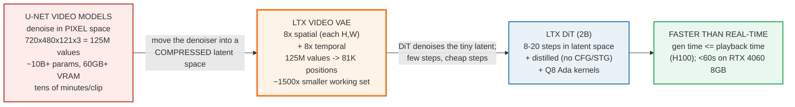
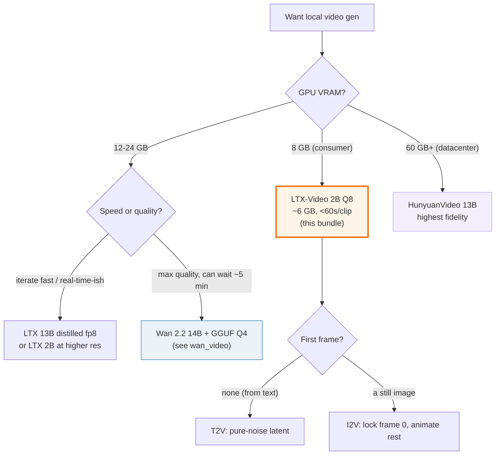

# LTX-Video — faster-than-real-time video gen on 8GB (the ~1500× VAE compression)

> Companion: [ltx_video.py](https://github.com/quanhua92/tutorials/blob/main/local-llm/ltx_video.py)
> Live playground: [ltx_video.html](./ltx_video.html)
> The denoising math side: [../llm/SAMPLING.md](../llm/SAMPLING.md) — what each diffusion step actually does
> Sibling (the heavier, higher-quality alternative): [WAN_VIDEO.md](./WAN_VIDEO.md) 🔗

## 0. TL;DR

LTX-Video (Lightricks) is a **Diffusion Transformer (DiT)** that generates video
**faster than it plays back**, on a single 8 GB consumer GPU. The speed is **not**
a smaller model — it is an **aggressive Video VAE** that compresses the pixel
buffer **~1500×** *before* the denoiser runs, so every diffusion step is cheap.

```
                        Video VAE compresses ~1500x, THEN the DiT denoises
  pixel space                         latent space (the DiT works HERE)
  720×480×121×3                       90×60×15  = 81,000 positions
  125,452,800 values                  (each carries C≈128 hidden channels)
  250.91 MB fp16                      20.74 MB fp16
        \                                  ^
         \-- 8× spatial + 8× temporal ---/
```

**Gold value** (reproduced in the HTML playground):

```
Reference clip 720×480×121×3:
  pixel values      = 720*480*121*3        = 125,452,800
  latent positions  = 90*60*15              = 81,000
  COMPRESSION RATIO = 125,452,800 / 81,000 = 1548.8x   (~1500x)
```

The result: a 5.04 s clip (121 frames @ 24 fps) generates in **~44 s on an RTX
4060 8 GB** (Q8 kernels, documented "<60 s") and **under playback time on an H100**
(the paper's "real-time" claim).

---

## 1. The lineage — heavy U-Net → fast DiT + aggressive VAE



**The key insight.** A video model's per-step cost is dominated by how many
spatial-temporal positions it must process. A U-Net denoising the raw pixel
buffer pays for **41.8 M positions** (×3 RGB = 125 M values). LTX's VAE collapses
that to **81,000 latent positions** before the DiT ever runs — so each of the
8–20 diffusion steps is ~1500× cheaper in "things to attend over". Few cheap steps
beat many expensive ones.

---

## 2. The mechanism — the ~1500× compression, step by step

Every number below is printed by `ltx_video.py`; the VAE factors and the 8k+1
frame rule come from the LTX-Video README ("resolution divisible by 32, frames
divisible by 8 + 1").

### A — Pixel space vs latent space

> From `ltx_video.py` Section A:
> ```
> Reference clip: 720 x 480 x 121 frames x 3 RGB channels
>
> PIXEL SPACE (what a U-Net would denoise directly):
>   grid    = 720 x 480 x 121            =   41,817,600 positions
>   values  = grid x 3 (RGB)          =  125,452,800 values
>   fp16    =       250.91 MB   (501.81 MB in fp32)
>
> LATENT SPACE (what the LTX DiT actually denoises):
>   spatial  : 720/8=90 , 480/8=60   (8x on each axis)
>   temporal : (121-1)/8=15                   (8x along time; T must be 8k+1)
>   grid     = 90 x 60 x 15              =       81,000 positions
>   fp16 (C=128) =      20.74 MB
>
> COMPRESSION (pixel values -> latent positions):
>    125,452,800 / 81,000  =  1548.8x   (~1500x)
> ```

Three facts that make the headline work:

1. **8× on EACH spatial axis** (not 8× total). 720→90 and 480→60, so the spatial
   reduction is 8×8 = **64×**, not 8×.
2. **8× temporal**, but LTX requires `T = 8k+1` input frames (so the VAE can
   downsample cleanly). 121 = 8×15+1 → 15 latent frames.
3. **The channel dimension is NOT free.** Each latent position carries C≈128
   hidden channels, so the latent *tensor* is 81,000 × 128 = 10.4 M values
   (20.7 MB fp16) — not 81K scalars. The ~1500× refers to **spatial-temporal
   positions the DiT attends over**, which is what sets per-step FLOPs.

> From `ltx_video.py` Section A (the channel nuance):
> ```
> Why the channel dimension does not break the headline:
>   Each latent position carries C=128 hidden channels, so the latent
>   TENSOR is 10,368,000 values = 20.7 MB fp16 - NOT 81K scalars.
>   True byte compression (pixel fp16 / latent fp16, C=128) = 12.1x.
>   The ~1500x is about how many SPATIAL-TEMPORAL positions the DiT attends
>   over (81K vs 41.8M) - that is what makes each diffusion step cheap.
>   Pure grid reduction (no channels) = 41,817,600 / 81,000 = 516.3x (~512x = 8^3).
> ```

### B — Text-to-video vs image-to-video (what the denoiser starts from)

The DiT always denoises a latent from `t=T_max` down to `t=0`. The **only**
difference between T2V and I2V is the **initial latent**:

> From `ltx_video.py` Section B:
> ```
>   T2V : start from PURE NOISE. The text prompt alone guides every frame.
>   I2V : encode the first frame to a latent, LOCK frame 0, fill the rest
>         with noise. The model generates MOTION for frames 1..T-1 only.
> ```

Both cost the same per step (same latent size). I2V is what makes LTX useful for
animation: feed a still image, get a coherent ~5 s clip anchored on it.

---

## 3. The VRAM budget — why 8 GB is enough

```
VRAM = DiT_weights + VAE_weights + latent_tensor + activations + overhead
```

> From `ltx_video.py` Section C:
> ```
> Reference: 720x480x121, DiT Q8 (the Ada-kernel path):
>   DiT weights   = 2.0B x 8.5 / 8        =  2.125 GB   (2B params, Q8)
>   VAE weights   = 0.15B x 16 / 8         =  0.300 GB   (~150M params, fp16)
>   latent tensor = 90*60*15*128*2 / 1e9 =  0.021 GB   (tiny)
>   activations   = 3.0 x 81000/81000     =  3.000 GB   (scales w/ latent positions)
>   overhead      = floor                 =  0.500 GB   (CUDA ctx + workspace)
>   TOTAL                                  =  5.946 GB
> ```

The DiT quant is the lever that decides whether 8 GB is comfortable:

> From `ltx_video.py` Section C:
> ```
> | DiT quant | bpw  | DiT GB | VAE  | latent | act   | oh   | TOTAL  | 8GB? |
> |-----------|------|--------|------|--------|-------|------|--------|------|
> | FP16      | 16.0 |  4.000 GB |  0.300 GB |  0.021 GB |  3.000 GB |  0.500 GB |   7.82 GB |  FIT  |
> | Q4_GGUF   |  4.5 |  1.125 GB |  0.300 GB |  0.021 GB |  3.000 GB |  0.500 GB |   4.95 GB |  FIT  |
> | Q8        |  8.5 |  2.125 GB |  0.300 GB |  0.021 GB |  3.000 GB |  0.500 GB |   5.95 GB |  FIT  |
> ```

**FP16 is borderline** (7.82 GB, no headroom). **Q8** (`LTX-VideoQ8`, the Ada-only
FP8/Q8 kernels) is the comfortable 8 GB path (~6 GB, ~2 GB free) and is exactly
the configuration behind the documented "<60 s on RTX 4060" claim. The latent
tensor is negligible (~21 MB) — the activations term (~3 GB) is what you actually
fight on a small card.

---

## 4. "Faster than real-time" — the real-time factor

```
real-time factor (RTF) = video_duration / generation_time      (RTF >= 1  ==>  faster than playback)
```

For the reference clip: `121 frames / 24 fps = 5.04 s` of video. Generation
**must be ≤ 5.04 s** to be literally faster than real-time.

> From `ltx_video.py` Section D:
> ```
>   8 diffusion steps (distilled model, no CFG/STG needed):
> | GPU                              | s/step | gen time | RTF   | faster than real-time? |
> |----------------------------------|--------|----------|-------|-------------------------|
> | H100 (paper 'real-time')         |   0.50 |    4.0 s |  1.26 | YES (RTF >= 1)          |
> | RTX 4090 24GB                    |   1.60 |   12.8 s |  0.39 | no (RTF 0.39)           |
> | RTX 4060 8GB (Q8 kernels)        |   5.50 |   44.0 s |  0.11 | no (RTF 0.11)           |
> ```

**Read this honestly:** on an RTX 4060 the clip is **not** literally real-time
(RTF ≈ 0.11, ~44 s for a 5 s clip) — but it is ~7–50× faster than Wan 14B /
HunyuanVideo, on an 8 GB card. The paper's "real-time" title holds on an **H100**
(RTF ≥ 1). The speed comes from three stacked wins: the 1500× smaller working set
(Section A) × a distilled 8-step schedule (no CFG/STG) × Q8 Ada kernels.

---

## 5. Worked example — the landscape

> From `ltx_video.py` Section E:
> ```
> | model                       | params | resolution   | VRAM    | gen      | RTF   |
> |-----------------------------|--------|--------------|---------|----------|-------|
> | LTX-Video 2B (Q8, distilled) |    2B  | 720x480x121  |     6 GB |     44 s | 0.115 |
> | LTX-Video 2B (H100)         |    2B  | 720x480x121  |     6 GB |      4 s | 1.260 |
> | Wan 2.2 14B                 |   14B  | 720x480x121  |    18 GB |    300 s | 0.017 |
> | HunyuanVideo 13B            |   13B  | 720p         |    60 GB |   1800 s | 0.003 |
> ```

LTX is the only one that fits a consumer 8 GB card **and** finishes in under a
minute. Wan 2.2 is the higher-quality but heavier alternative (its
Lightning/TeaCache/GGUF optimizations close the gap — see `wan_video`).
HunyuanVideo is the datacenter-tier quality leader.

Decision tree:



---

## 6. Pitfalls (trap → symptom → fix)

| Trap | Symptom | Fix |
|---|---|---|
| **Quoting "1500×" as a byte/file-size compression** | Predicted latent is ~1500× smaller in bytes; actual latent tensor is only ~12× smaller | The ~1500× compares **spatial-temporal grid positions** (81K vs 41.8M), which sets per-step FLOPs. Each latent position carries C≈128 channels, so the latent *tensor* is 10.4M values (20.7 MB) — the true byte compression is ~12×. Always state what the ratio counts. |
| **Using `T//8` for the temporal latent** | Latent frame count off-by-one; VRAM/step estimate slightly wrong | LTX requires `T = 8k+1` inputs; the temporal latent is `(T-1)//8 = k`. For 121 frames that is **15**, not `121//8=15` (coincidentally equal) and not `ceil(121/8)=16`. The +1 anchor frame is the VAE convention. |
| **Assuming 8× spatial means 8× total** | Underestimates the spatial reduction by 8× | It is 8× on **each** axis → 8×8 = 64× spatial. Combined with 8× temporal = 512× pure grid reduction. The headline 1500× additionally folds in the RGB→latent-position comparison. |
| **Treating "faster than real-time" as a universal claim** | Expecting <5 s on a 4060, then wondering why it takes ~44 s | "Real-time" is the **H100** claim (paper title). On an RTX 4060 8 GB it is "<60 s" (still fast, but RTF≈0.11). State the GPU with every timing. |
| **Forgetting the activations term** | VRAM estimate (weights only) says ~2.5 GB, you OOM near 6 GB | Activations (~3 GB at 81K tokens) dominate the non-weight budget and **scale with latent positions**. Raising resolution/frames raises activations, not just the (tiny) latent tensor. |
| **Running FP16 on an 8 GB card** | Works, then OOMs on a long prompt or high res with zero headroom | FP16 lands at 7.82 GB (no margin). Use **Q8** (LTX-VideoQ8 Ada kernels) → ~6 GB, ~2 GB free, and ~3× faster. |
| **Ignoring the 8k+1 frame rule** | Generation crashes or pads/crops unexpectedly | Number of frames must be `8k+1` (e.g. 9, 17, …, 121, 257). Non-conforming inputs get padded to the next valid count. Pick 121 for ~5 s @ 24 fps. |
| **Confusing the 2B and 13B variants** | Loading the 13B model expecting 8 GB fit | The 8 GB / <60 s claim is the **2B distilled + Q8** path. The 13B needs more VRAM (use fp8). Check the config name (`ltxv-2b-0.9.x-distilled`). |

---

## 7. Cheat sheet

```
# the compression (the whole point)
latent grid  = (W/8) x (H/8) x ((T-1)/8)        # T must be 8k+1
compression  = W*H*T*3 / (latent grid)          # ~1500x for 720x480x121
pure grid    = 8 * 8 * 8 = 512x                 # spatial x spatial x temporal

# the VRAM budget (decimal GB)
dit_w   = params_B * bpw / 8                     # 2B Q8 = 2.125 GB
vae_w   = 0.15 * 16 / 8 = 0.3 GB
latent  = (W/8)*(H/8)*((T-1)/8) * 128 * 2 / 1e9  # ~0.02 GB (negligible)
act     ~ 3.0 GB at 81K latent positions         # scales w/ positions
total   = dit_w + vae_w + latent + act + 0.5     # Q8 ~ 5.95 GB -> fits 8GB

# the speed
duration = T / fps                               # 121/24 = 5.04 s
RTF      = duration / gen_time                   # >= 1 means faster than real-time
```

```bash
# locally (recommended path: ComfyUI + the Lightricks custom nodes)
#   https://github.com/Lightricks/ComfyUI-LTXVideo
# load ltxv-2b-0.9.x-distilled, 8 steps, no CFG/STG, Q8 kernels on Ada GPUs

# direct inference (the official repo)
python inference.py \
  --prompt "PROMPT" \
  --height 480 --width 720 --num_frames 121 \
  --seed 42 \
  --pipeline_config configs/ltxv-2b-0.9.8-distilled.yaml

# image-to-video (lock frame 0 to an image, animate the rest)
python inference.py --prompt "PROMPT" \
  --conditioning_media_paths IMAGE.png --conditioning_start_frames 0 \
  --height 480 --width 720 --num_frames 121
```

| You want… | Do this |
|---|---|
| Cheapest 8 GB path | LTX 2B **distilled + Q8** kernels, 8 steps, 720×480×121 |
| Best quality on LTX | 13B dev (fp8 on 16 GB+), 30–40 steps |
| Real-time (gen ≤ playback) | H100-class GPU (RTF ≥ 1); on consumers it's "<60 s", not real-time |
| Higher quality, can wait | Wan 2.2 14B + GGUF Q4 (see `wan_video`) |
| Animate a still image | I2V: lock frame 0 to the encoded image latent |
| Frame-count crash | use `num_frames` ∈ {9, 17, …, 121, 257} (8k+1) |

---

## 🔗 Cross-references

- **[WAN_VIDEO.md](./WAN_VIDEO.md)** 🔗 — the heavier, higher-quality alternative.
  Wan 2.2 14B needs 12–24 GB and ~5 min unoptimized, but its Lightning
  distillation (30→4 steps), TeaCache (skip redundant attention), and GGUF Q4
  close the gap toward LTX's speed.
- **[COMFYUI_WORKFLOW.md](./COMFYUI_WORKFLOW.md)** — how to actually *run* LTX
  locally: the node graph (Loader → VAE Encode → KSampler → VAE Decode) that
  turns this architecture into a reproducible workflow. The Lightricks custom
  nodes are the recommended path.
- **[DIFFUSION_FUNDAMENTALS.md](./DIFFUSION_FUNDAMENTALS.md)** — the denoising
  math this DiT runs: forward noise schedule, reverse denoise, and why a
  *distilled* 8-step schedule with no CFG/STG is enough.
- **[../llm/SAMPLING.md](../llm/SAMPLING.md)** — the algorithm side of stochastic
  denoising (both diffusion and LLM sampling are iterative refinement).
- **[QUANT_TYPES.md](./QUANT_TYPES.md)** 🔗 — the `bpw` behind the Q8 path:
  why the LTX-VideoQ8 Ada kernels give ~3× speedup at near-lossless quality.
- **[VRAM_ESTIMATOR.md](./VRAM_ESTIMATOR.md)** — the same weights + working-set
  budgeting, applied to LLMs. The DiT-weights and activation terms here use the
  identical decomposition.

---

## Sources

- [Lightricks/LTX-Video (GitHub README)](https://github.com/Lightricks/LTX-Video) — official repository; the 8× spatial / 8× temporal VAE, the "frames divisible by 8 + 1" rule, the model table (2B / 13B / distilled / fp8), and the lineage (v0.9.0 → v0.9.8 distilled → LTX-2).
- [LTX-VideoQ8 (community, KONAKONA666)](https://github.com/KONAKONA666/LTX-Video) — the Ada-only 8-bit kernels behind the "generate 720×480×121 in **under a minute on RTX 4060 8GB VRAM**" claim (up to 3× speedup, no accuracy loss). This is the Q8 path this bundle's VRAM/speed budget targets.
- [LTX-Video paper — "Realtime Video Latent Diffusion", arXiv:2501.00103](https://arxiv.org/abs/2501.00103) — the "real-time" title (H100-class) and the DiT-in-compressed-latent-space architecture.
- [ComfyUI-LTXVideo](https://github.com/Lightricks/ComfyUI-LTXVideo) — the recommended local runtime (node workflows for T2V / I2V / multi-keyframe / control models).
- [HuggingFace LTX-Video model card](https://huggingface.co/Lightricks/LTX-Video) — the weight variants and configs (`ltxv-2b-0.9.x-distilled`, `ltxv-13b-0.9.x-dev-fp8`, etc.).
