# MLX Inference — Apple's Array Framework for Apple Silicon

> Companion (ground truth): [mlx_inference.py](https://github.com/quanhua92/tutorials/blob/main/local-llm/mlx_inference.py)
> Live interactive: [mlx_inference.html](./mlx_inference.html)
> Output: [mlx_inference_output.txt](https://github.com/quanhua92/tutorials/blob/main/local-llm/mlx_inference_output.txt)

**MLX** is the array framework Apple wrote *specifically* for Apple Silicon's
**unified memory**. Unlike PyTorch MPS, llama.cpp Metal, or TensorFlow Metal —
which all inherit a split CPU-RAM / GPU-VRAM design and bolt a copy path on top —
MLX assumes from line one that the CPU and GPU address the **same physical RAM**.
It pairs that with **lazy evaluation** (ops build a graph that executes only on
`mx.eval`) and **functional transforms** borrowed from JAX (`value_and_grad`,
`vmap`, `compile`, all stackable). The three combine into **op fusion**: a chain
of K elementwise ops collapses into **one Metal kernel** that reads the input
once and writes the output once, cutting memory traffic **K-fold**.

Because LLM decode is **bandwidth-bound** (you read essentially the whole model
per token), deleting intermediate memory traffic directly buys you tokens/sec.
MLX is reported **~2–3× faster than llama.cpp** for decode on Apple Silicon, and
**Ollama 0.19+** switched to the MLX backend on Apple Silicon for this reason.

## 0. TL;DR

- **Unified memory = zero copy.** The CPU and GPU share one RAM pool. You pick
  the device at *op* time (`stream=mx.gpu`), not array time — there is no
  `.to('gpu')`. A GPU matmul and a CPU `print(a[0])` read the *same* bytes.
- **Lazy evaluation = defer then fuse.** `a = mx.array([1,2,3,4])`, `b = a*2`,
  `c = b+5` builds a 3-node graph and computes **nothing** until `mx.eval(c)`.
- **Op fusion = K-fold less bandwidth.** A K-op elementwise chain run eagerly =
  `2K` array-sized transfers (K reads + K writes); fused = `2` transfers
  (1 read + 1 write). For **K=3 → 6 transfers down to 2 → 3× less**.
- **Functional transforms are stackable.** `grad`, `vmap`, `compile` are higher-
  order functions; `vmap(grad(compile(fn)))` traces once and fuses the whole
  thing. PyTorch's backward is an imperative pass — it can't compose like this.
- **Decode is bandwidth-bound.** Roofline tokens/s ≈ `unified_memory_BW /
  weight_bytes`. MLX's three edges (zero-copy, fusion, compiled kernels) all
  push utilisation toward the roofline.
- **mlx-lm is the CLI.** `pip install mlx-lm` → `mlx_lm.generate --model
  mlx-community/Llama-3.2-3B-Instruct-4bit`. `mlx.nn.QuantizedLinear` ships
  2/4/8-bit group quant (same idea as GGUF block quants, native MLX format).

**Gold (verified, [check: OK] in the `.py` and `.html`):** a 3-op elementwise
chain `c = (a*2+5)*3` — eager = **6 transfers** (3 reads + 3 writes), fused =
**2 transfers** (1 read + 1 write) → **3× less bandwidth**.

---

## 1. What it is (lineage old → new, WHY each step)

```mermaid
graph LR
    TORCH["PyTorch MPS<br/>split CPU-RAM / GPU-VRAM<br/>.to('mps') copies, .to('cpu') copies back<br/>eager: each op dispatches now"]
    LC["llama.cpp Metal<br/>hand-tuned Metal kernels<br/>but bolted onto a CPU-RAM design<br/>more copies, less fusion"]
    MLX["MLX (unified-native)<br/>CPU + GPU share ONE RAM pool<br/>zero copy (stream=, not .to())"]
    LAZY["lazy evaluation<br/>ops build a graph<br/>nothing runs until mx.eval()"]
    FUSE["op fusion + compile<br/>K ops -> 1 Metal kernel<br/>K-fold less bandwidth"]
    TORCH -->|"same hardware, copy overhead"| LC
    LC -->|"built for unified memory"| MLX
    MLX -->|"see the whole graph up front"| LAZY
    LAZY -->|"fuse elementwise neighbours"| FUSE
    style TORCH fill:#fdecea,stroke:#c0392b
    style LC fill:#fef3e7,stroke:#f97316
    style MLX fill:#eafaf1,stroke:#27ae60,stroke-width:3px
    style LAZY fill:#eaf2f8,stroke:#2980b9
    style FUSE fill:#fef9e7,stroke:#f1c40f
```



| Step | Problem it fixes | What changes |
|---|---|---|
| **1. PyTorch MPS** | — (the baseline) | Even on shared-memory hardware, PyTorch keeps separate CPU/GPU buffers and copies on `.to()`. Ops dispatch eagerly; intermediates hit memory |
| **2. llama.cpp Metal** | Need Apple-GPU kernels | Hand-written Metal kernels, fast matmuls — but inherits a design from a split-RAM world, so it copies more and fuses less |
| **3. MLX unified-native** | The copy path itself | Built *for* unified memory. Arrays live in one pool; you pick the device at op time (`stream=`). Zero copy by construction |
| **4. Lazy evaluation** | Eager dispatch hides the graph | Ops build a DAG; nothing runs until `mx.eval`. The compiler now *sees* the whole chain |
| **5. Op fusion + compile** | Memory-bandwidth-bound decode | Consecutive elementwise ops merge into one kernel; intermediates stay in registers. `mx.compile` caches the traced+fused graph |

**Why it matters:** LLM decode is **memory-bandwidth-bound, not compute-bound**.
Every byte of intermediate traffic you delete is bandwidth freed for reading
weights. MLX deletes it three ways: no copy (unified memory), no intermediates
(fusion), no per-op dispatch (compile).

---

## 2. The mechanism (internals)

### 2a. Unified memory — one pool, zero copy

On Apple Silicon the CPU and GPU address the **same physical RAM**. An MLX array
lives in that shared pool; you do **not** move it to a device. Instead you pick
the device at *op* time via the `stream=` argument. The same array can be used by
a GPU matmul and then by a CPU element-read — both hit the same bytes.

```python
a = mx.random.uniform(shape=(4096, 512))   # lives in unified memory
mx.matmul(a, W, stream=mx.gpu)             # GPU reads a directly -- NO copy
print(a[0])                                # CPU reads a[0] from the SAME pool -- NO copy
```

Contrast with PyTorch MPS on the *same* hardware: `.to('mps')` copies CPU→GPU,
`.to('cpu')` copies back — explicit transfers even though the RAM is shared.

> From mlx_inference.py Section A:
> ```
>   a = mx.array([1.0, 2.0, 3.0, 4.0])  -> lives in shared pool at offset 0
>   GPU op: mx.matmul(a, W, stream=mx.gpu)   reads shared pool -> 16 B, copied = 0
>   CPU op: print(a[0])                      reads shared pool -> 4 B, copied = 0
> [check] MLX unified memory: GPU then CPU read cost ZERO copy bytes: OK
> 
>   PyTorch MPS contrast (same 16 B array, on the SAME hardware):
>     .to('mps') copies CPU -> GPU : 16 B
>     .to('cpu') copies GPU -> CPU : 16 B
>     total explicit copies        : 32 B   (vs MLX 0 B)
> ```

Projected to a real layer pass — a 2 GB activation round-tripped once per layer
across 32 layers: MLX copies **0 GB**; PyTorch MPS copies **128 GB**.

### 2b. Lazy evaluation — build a graph, defer, execute

MLX ops are **lazy**. Each op appends a node to a computation graph and returns a
new *unmaterialised* array. Nothing executes until you call `mx.eval(x)` (or
`print(x)` / `x.item()`). This is exactly what lets the compiler see the whole
chain and fuse it.

```python
a = mx.array([1, 2, 3, 4])   # materialised (a leaf)
b = a * 2                    # LAZY -- no value yet, just a graph node
c = b + 5                    # LAZY -- still nothing computed
mx.eval(c)                   # NOW the graph walks, fuses, and runs
# c -> [7.0, 9.0, 11.0, 13.0]
```

> From mlx_inference.py Section B:
> ```
>   a = mx.array([1,2,3,4])               -> MXArray#1(const,materialised=[1.0, 2.0, 3.0, 4.0])
>   b = a * 2                             -> MXArray#2(mul(*2),LAZY)   (NOT computed yet)
>   c = b + 5                             -> MXArray#3(add(+5),LAZY)   (NOT computed yet)
> [check] b is lazy (no value) before eval: OK
> [check] c is lazy (no value) before eval: OK
> 
>   mx.eval(c)  ->  graph executes, 2 node(s) computed
>   c materialised = [7.0, 9.0, 11.0, 13.0]
> [check] after eval, c == [7.0, 9.0, 11.0, 13.0]: OK
> ```

### 2c. Op fusion — K ops → 1 kernel, K-fold less bandwidth (the payoff)

This is the core of the bundle. A chain of **K** consecutive elementwise ops
(mul, add, RMSNorm, SiLU, residual add, …) run **eagerly** = K separate Metal
kernel dispatches, each reading its input array from main memory and writing its
output array back. MLX's compiler **fuses** the chain into **one** kernel that
reads the input once and writes the output once; every intermediate lives in GPU
registers and never touches main memory.

**Counting "memory transfers"** (one array-sized read OR write = 1 transfer):

| Mode | Kernels | Reads | Writes | Transfers |
|---|---|---|---|---|
| WITHOUT fusion (K=3) | 3 | 3 | 3 | **6** |
| WITH fusion (K=3) | 1 | 1 | 1 | **2** |

Bandwidth reduction = `6 / 2 = 3×`. The ratio always equals K.

> From mlx_inference.py Section C:
> ```
>   array size N = 4 elements x 4 B = 16 B/transfer
>   chain c = (a * 2 + 5) * 3   ->   K = 3 elementwise ops (mul, add, mul)
> 
>   mode              kernels   reads   writes  transfers  bytes
>   WITHOUT fusion    3         3       3       6          96
>   WITH fusion       1         1       1       2          32
> 
>   bandwidth reduction = 6 transfers / 2 transfers = 3.0x less
> [check] K=3 eager = 3 reads + 3 writes = 6 transfers: OK
> [check] K=3 fused = 1 read + 1 write = 2 transfers: OK
> [check] K=3 fusion = 3x less bandwidth (6 -> 2): OK
> 
>   fusion ratio across chain length K (ratio == K):
>     K   eager transfers   fused transfers   ratio
>     1   2                 2                 1.0x
>     2   4                 2                 2.0x
>     3   6                 2                 3.0x
>     4   8                 2                 4.0x
>     5   10                2                 5.0x
>     8   16                2                 8.0x
> ```

### 2d. Functional transforms — grad, vmap, compile (stackable)

MLX borrows JAX's model: transforms are **higher-order functions** that take a
function and return a function. Because they're pure, you compose them freely —
`vmap(grad(compile(fn)))` traces once and fuses the whole composed graph.

```python
def square(x): return x * x
value, grad = mx.value_and_grad(square)(3.0)   # (9.0, 6.0)  in ONE pass
batch_vals   = mx.vmap(square)(mx.array([1,2,3,4]))   # [1, 4, 9, 16]
fast_square  = mx.compile(square)              # trace + fuse + cache
```

> From mlx_inference.py Section D:
> ```
>   mx.value_and_grad(square)(x=3.0)  ->  value = 9.0, grad = 6.0
>   vmap(square)([1,2,3,4])      ->  values  = [1.0, 4.0, 9.0, 16.0]
>   vmap(grad)([1,2,3,4])        ->  grads   = [2.0, 4.0, 6.0, 8.0]
>   mx.compile(square)(3.0)      ->  9.0   (graph traced, fused, cached)
>   composed = vmap(grad(compile(square)))  ->  [2.0, 4.0, 6.0, 8.0]
> ```
> (PyTorch can't compose like this: backward is a separate imperative pass, not
> a transform you can stack with `vmap`/`compile`.)

---

## 3. Practical config / commands

### Install + run a model

```bash
pip install mlx-lm
mlx_lm.generate \
  --model mlx-community/Llama-3.2-3B-Instruct-4bit \
  --prompt "Hello" --max-tokens 32
```

### Quantize a model to 4-bit (native MLX format)

```bash
mlx_lm.convert --hf-path meta-llama/Llama-3.2-3B-Instruct -q --q-bits 4
```

### Pick the device at op time (unified memory)

```python
import mlx.core as mx
a = mx.random.uniform(shape=(4096, 512))      # in unified memory
x = mx.matmul(a, W, stream=mx.gpu)            # GPU runs it
y = mx.exp(b,   stream=mx.cpu)                # CPU runs it -- SAME arrays, no copy
```

### Compile + functional transforms

```python
@mx.compile                                    # trace once, fuse, cache the graph
def step(x, w):
    return mx.matmul(mx.relu(x), w)
loss, grads = mx.value_and_grad(model)(x, y)   # value AND grad in one pass
batch_grads = mx.vmap(mx.grad(fn))(batch)      # grad over a batch as one fused op
```

### QuantizedLinear bit-widths

| Bits | Scale | Packed (group=32) | vs fp32 |
|---|---|---|---|
| 2 | 2 B | 10 B | 12.8× |
| 4 | 2 B | 18 B | 7.1× |
| 8 | 2 B | 34 B | 3.8× |

---

## 4. Worked example — decode performance model

Decode is **bandwidth-bound**: the engine reads essentially the whole model's
weights once per token. Roofline tokens/sec ≈ `unified_memory_BW /
weight_bytes`. MLX's three edges all push utilisation toward the roofline.

> From mlx_inference.py Section E:
> ```
>   model: 4B params @ 4-bit   ->  ~2.0 GB weights read per token
>   M2 Max unified-memory BW   = 400 GB/s
>   roofline tokens/sec        = 400 / 2.0 = 200 tok/s
> 
>   engine        eff vs roof   tok/s     reason it loses efficiency
>   MLX           65            130       no copy + fusion + compiled kernels
>   llama.cpp     45            90        Metal backend bolted onto a CPU-RAM design
> 
>   modelled decode speedup (MLX / llama.cpp) = 1.4x  (order-of-magnitude; reported 2-3x)
> ```
> The modelled 1.4× is order-of-magnitude; the reported **2–3×** is observed in
> practice (especially for small-model / low-batch serving where dispatch
> overhead dominates, e.g. the vLLM-MLX serving path). The exact computed gold
> value is the fusion ratio (**3× less bandwidth**), not the end-to-end speedup.

**Where MLX's bandwidth advantage comes from:**

1. **Zero CPU↔GPU copy** → 0 B transferred per layer (unified memory).
2. **Op fusion** → elementwise traffic cut K-fold (Section 2c).
3. **Compiled Metal kernels** → one dispatch per fused subgraph.

(llama.cpp's Metal backend works well, but inherits a design from a split
CPU-RAM / GPU-VRAM world — it copies more and fuses less.)

### Group quantization math

> From mlx_inference.py Section F:
> ```
>   group quantization model (group = 32 weights):
>     fp32 block        = 32 x 4 B         = 128 B
>     4-bit block       = 2 B scale + 16 B packed = 18 B
>     compression ratio = 128 / 18 = 7.1x  (~8x counting only weights)
> ```
> The quantized weights are dequantized **inside the fused Metal kernel** — there
> is no separate dequant pass, so quantization costs almost no extra bandwidth.

---

## 5. Pitfalls (trap | symptom | fix)

| Trap | Symptom | Fix |
|---|---|---|
| **Forgetting `mx.eval()` / not reading the result** | Nothing runs; memory looks flat; later `eval` of something else computes a surprise amount | Laziness means *no* work until forced. Call `mx.eval(out)` or `print(out)` to materialise. Inspect with `mx.eval` on a subtree to see what a graph costs. |
| **Confusing `stream=` with `.to(device)`** | You call `a.to(mx.gpu)` and get an AttributeError; or you assume placing an op on `mx.cpu` copies `a` | MLX has no `.to(device)`. Pick the device at *op* time (`mx.add(a, b, stream=mx.gpu)`). The array never moves. |
| **Expecting `mx.compile` to help a one-shot script** | First call is *slower* (tracing), you don't reuse it, no win | `compile` pays off across repeated calls (e.g. a decode loop). For a one-off, skip it. First call traces + caches; subsequent calls hit the fused graph. |
| **Building a huge eager graph by accident** | RAM / graph grows unbounded because you keep appending lazy nodes without ever evaluating | `mx.eval()` results you no longer need growing; call it in the loop. Lazy ≠ free — nodes accumulate until evaluated. |
| **Counting `vmap` as a Python loop** | You write a `for` over a batch, expect `vmap` speedup, get none | `vmap` only fuses if you call the *transform* (`mx.vmap(fn)(batch)`), not a manual loop. The transform emits one fused batched kernel. |
| **Assuming MLX == PyTorch API** | `x.requires_grad`, `x.backward()`, `optimizer.zero_grad()` all missing | MLX is functional: `value_and_grad(model)(...)` returns grads; you `optimizer.update(model, grads)`. No autograd graph state on tensors. |
| **Mixing GGUF and MLX quant formats** | You hand a GGUF file to `mlx_lm` (or an MLX safetensors to llama.cpp) and it errors | They are different formats. Use `mlx-community/*` safetensors for MLX; `*.gguf` for llama.cpp. (`🔗 QUANT_TYPES`, `🔗 GGUF_FORMAT`) |
| **`print` forces eval mid-pipeline** | You add a `print(debug)` and a fused pipeline suddenly runs eager in two pieces | Any materialisation (`print`, `.item()`, `.tolist()`) evaluates that subtree. Remove debug prints from hot paths or wrap them behind a flag. |

---

## Cheat Sheet

```text
THE THREE EDGES (why MLX is fast on Apple Silicon)
  unified memory  CPU+GPU share ONE RAM pool -> ZERO copy (stream=, not .to())
  lazy eval       ops build a graph; NOTHING runs until mx.eval()
  op fusion       K elementwise ops -> 1 Metal kernel -> K-fold less bandwidth

OP FUSION MATH (the gold value)
  eager : K kernels, K reads + K writes = 2K transfers
  fused : 1 kernel,  1 read  + 1 write  = 2 transfers
  ratio : K   (K=3 -> 6 down to 2 -> 3x less bandwidth)

DECODE ROOFLINE (bandwidth-bound)
  tokens/s ~ unified_memory_BW / weight_bytes
  4B @ 4-bit ~ 2 GB;  M2 Max ~ 400 GB/s  ->  roofline ~200 tok/s
  MLX utilises more of the roofline (no copy + fusion + compiled kernels)

THE CLI
  pip install mlx-lm
  mlx_lm.generate --model mlx-community/Llama-3.2-3B-Instruct-4bit --prompt "..."
  mlx_lm.convert  --hf-path meta-llama/Llama-3.2-3B-Instruct -q --q-bits 4

TRANSFORMS (stackable, JAX-style)
  mx.value_and_grad(fn)(x)   -> (value, grad) in one pass
  mx.vmap(fn)(batch)         -> batched, one fused kernel
  mx.compile(fn)             -> trace + fuse + cache the graph
  compose freely: vmap(grad(compile(fn)))
```

**The one-liner:** MLX is the only major tensor framework written *natively*
for unified memory — and that single design choice is what makes zero-copy,
lazy fusion, and the 2–3× decode speedup over llama.cpp all fall out at once.

---

## Cross-references

- 🔗 [GGML_BACKEND](./GGML_BACKEND.md) — the *same* compute-graph idea (build a
  DAG, topo-sort, fuse, hand to a backend) but in llama.cpp's world. MLX's lazy
  graph and GGML's `ggml_cgraph` solve the identical problem; the difference is
  MLX is unified-memory-native and fuses at the Metal-kernel level, while GGML
  ships the same graph to CPU / CUDA / Metal / Vulkan backends.
- 🔗 [OLLAMA_LMSTUDIO](./OLLAMA_LMSTUDIO.md) — Ollama **0.19+** switched to the
  MLX backend on Apple Silicon for exactly the reasons above (no copy, fusion,
  compiled kernels). On non-Apple hardware Ollama still uses llama.cpp's
  backends — MLX is Apple-Silicon-only.
- 🔗 [QUANT_TYPES](./QUANT_TYPES.md) — `mlx.nn.QuantizedLinear`'s 2/4/8-bit
  *group* quantization is conceptually the same block quantization as GGUF's
  Q4_0 / Q4_K_M, just in MLX's native format and dequantized inside the fused
  Metal kernel.
- 🔗 [MMAP_WEIGHTS](./MMAP_WEIGHTS.md) — MLX also gets the "load on demand"
  benefit on Apple Silicon, but via unified-memory pointers rather than POSIX
  page faults: weights sit in shared RAM and are read directly by the GPU.

---

## Sources

- MLX documentation (official) — Unified Memory, Lazy Evaluation, Function
  Transforms, Compilation:
  https://ml-explore.github.io/mlx/build/html/usage/unified_memory.html
  https://ml-explore.github.io/mlx/build/html/usage/lazy_evaluation.html
  https://ml-explore.github.io/mlx/build/html/usage/function_transforms.html
  https://ml-explore.github.io/mlx/build/html/usage/compile.html
- MLX GitHub (source, Metal kernels, the array/stream design):
  https://github.com/ml-explore/mlx
- mlx-lm (LLM CLI/library on top of MLX, QuantizedLinear, model conversion):
  https://github.com/ml-explore/mlx-examples/tree/main/llms
- WWDC25 — "Get started with MLX for Apple silicon" (unified memory, lazy
  computation, function transforms): https://developer.apple.com/videos/play/wwdc2025/315/
- "Native LLM and MLLM Inference at Scale on Apple Silicon" (arXiv) — zero-copy
  ops, lazy evaluation enabling fusion: https://arxiv.org/html/2601.19139v2
- Apple Machine Learning Research — "Exploring LLMs with MLX and the M5 GPU"
  (M5/M-series benchmarking with MLX):
  https://machinelearning.apple.com/research/exploring-llms-mlx-m5
- vLLM-MLX serving path / "I Ran Claude Code on my MacBook with vllm-mlx"
  (reported ~2–3× over llama.cpp for small-model serving):
  https://pub.towardsai.net/i-ran-claude-code-on-my-macbook-with-vllm-mlx-it-embarrassed-llama-cpp-by-87-093e8c777826
- Ollama — MLX backend on Apple Silicon (0.19+):
  https://github.com/ollama/ollama
