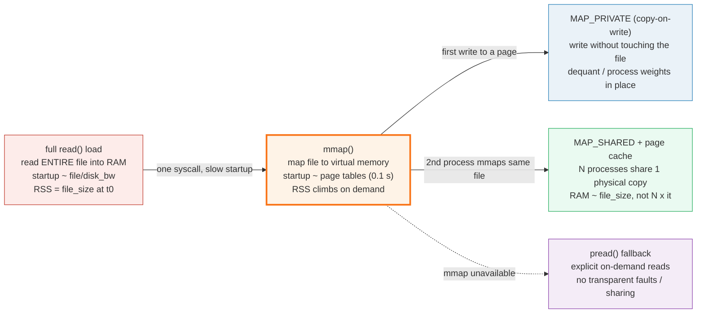
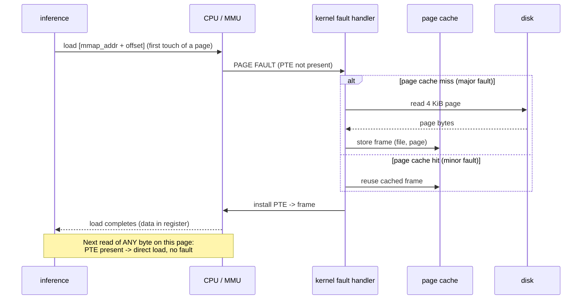

# mmap Weights — Lazy-Loaded Model Files in llama.cpp

> Companion (ground truth): [mmap_weights.py](https://github.com/quanhua92/tutorials/blob/main/local-llm/mmap_weights.py)
> Live interactive: [mmap_weights.html](./mmap_weights.html)
> Output: [mmap_weights_output.txt](https://github.com/quanhua92/tutorials/blob/main/local-llm/mmap_weights_output.txt)

llama.cpp / Ollama load a GGUF model with **`mmap(2)`** — the file is mapped
into the process's *virtual* address space, not `read()` into a heap buffer. At
the moment `mmap()` returns, almost nothing has been read from disk: the kernel
has only installed page-table entries marked *not present*. The file *looks*
like a flat byte array. When inference first dereferences a weight, the MMU
raises a **page fault**; the kernel reads that **4 KiB page** from disk into the
**page cache**, installs the PTE, and resumes — the next read on the same page
is a plain load. This is **lazy / demand paging**: only pages actually touched
get loaded, so a 4 GB mmap can settle at ~1.6 GB resident. `MAP_PRIVATE` makes
writes **copy-on-write** (dequantize in place without touching the GGUF), and
the page cache makes multiple processes **share** one physical copy.

## 0. TL;DR

- **`mmap()` maps a file into virtual address space.** The file appears as a
  memory array; the fd can be closed immediately. **No data is read at map
  time** — only page tables are set up.
- **Page faults load pages on demand.** First touch of a 4 KiB page → **major
  fault** (read from disk into the page cache) → PTE installed → resume. Next
  touch of the same page → direct load, no fault.
- **Lazy loading bounds RSS to what inference reads.** A 4 GB model with only
  40% of its pages touched settles at **1.60 GB resident**; the other 60% may
  never fault in (e.g. CPU-only layers when everything fits on the GPU).
- **`MAP_PRIVATE` = copy-on-write.** Reads share the page-cache page (zero
  copy); a write faults a **private copy** so the on-disk GGUF is never
  modified. This lets llama.cpp dequantize / process weights in place.
- **Multi-process sharing via the page cache.** Every process that mmaps the
  same page gets a PTE to the **same physical frame**. 3 Ollama instances on one
  4 GB model pay **~1.60 GB** total (shared), not 3 × 1.60 = 4.80 GB.
- **Startup: mmap ~0.1 s (page-table setup) vs full `read()` ~12 s** for a 4 GB
  file off a SATA SSD. mmap makes startup nearly **independent of model size**.
- **`pread()` fallback:** when mmap is unavailable (some networked/sandboxed
  filesystems), llama.cpp reads explicit byte ranges — same lazy effect, but no
  transparent faults and no free cross-process sharing.

---

## 1. The lineage — full load → mmap → copy-on-write → multi-process sharing



| Stage | What happens | Startup | RSS |
|---|---|---|---|
| **full `read()` load** | `read()` the whole GGUF into a heap buffer | `file_size / disk_bw` (slow, linear) | `file_size` immediately |
| **`mmap()`** | Map file to virtual memory; pages marked not-present | ~0.1 s (page tables only) | grows as pages fault in |
| **`MAP_PRIVATE` (COW)** | Same as mmap; writes get a private page copy | same as mmap | +1 page per written page |
| **`MAP_SHARED` + page cache** | N processes reference the same physical frame | per-process: ~0.1 s | shared: ~`file_size` once |
| **`pread()` fallback** | Explicit positional reads of needed ranges | ~sum of touched ranges | caller-buffer cache only |

> From mmap_weights.py Section A:
> ```
>   created model file: model.gguf  (8 pages x 4096 B = 32768 B)
>
>   full read() load: read all 32768 bytes into a bytes object
>     -> startup cost ~ file_size / disk_bw = sequential read of the whole file
>     -> RSS = 32768 bytes immediately (everything resident)
>
>   mmap(fd, 32768, PROT_READ, MAP_PRIVATE): mapped 32768 bytes
>     -> bytes transferred at mmap() return ~ 0 (page tables only)
>     -> RSS right after mmap ~ 0 file bytes resident
>
>   on-demand byte reads through the mapped view:
>     mm[0] = 108  (file byte = 108)
>     mm[4096] = 148  (file byte = 148)
>     mm[8197] = 76  (file byte = 76)
>     mm[32767] = 87  (file byte = 87)
> [check] mmap bytes match the file bytes at every sampled offset: OK
> ```

The defining shift: with `read()`, the file is a **buffer** the process owns
(startup = full sequential read, RSS = file size at once). With `mmap()`, the
file is a **virtual array** backed by the kernel's page cache — startup is page-
table setup, and residency is driven by what the code actually dereferences.

---

## 2. The mechanism — page faults, demand paging, the page cache



A page fault is the trap raised when code touches a not-present page (or writes
to a read-only-when-COW page). The handler reads the 4 KiB page from the file
(via the page cache, which is **shared by every process**), installs the PTE,
and resumes the faulting instruction. The cost is paid **once per page**; after
that, access is a hardware load.

> From mmap_weights.py Section B:
> ```
>   access plan (virtual page indices): [0, 0, 3, 3, 7, 0, 7, 12, 7, 12, 3]
>   step page  kind    major  minor  resident
>   0    0     major   1      0      1
>   1    0     hit     1      0      1
>   2    3     major   2      0      2
>   3    3     hit     2      0      2
>   4    7     major   3      0      3
>   5    0     hit     3      0      3
>   6    7     hit     3      0      3
>   7    12    major   4      0      4
>   8    7     hit     4      0      4
>   9    12    hit     4      0      4
>   10   3     hit     4      0      4
> [check] major faults == number of DISTINCT pages touched: OK
> [check] no page is read from disk twice (page cache): OK
> [check] repeated touches never fault: OK
> ```

The **first** touch of each distinct page is a `major` fault (disk read);
**every** later touch is a free `hit` (PTE already present). Fault count =
distinct pages, not access count. Projected to a real model:

> From mmap_weights.py Section B:
> ```
>   project to a 4.0 GB model (page size = 4 KiB):
>     total pages         = 4.0 GB / 4096 B = 1,048,576
>     pages touched @ 40% = 419,430
>     resident (faulted)  = 419,430 pages = 1.60 GB
>     untouched & unloaded = 629,146 pages = 2.40 GB
> [check] 40% of a 4 GB model faulted in = 1.60 GB resident: OK
> ```

**Lazy loading means RSS tracks what inference actually reads, not the file
size.** Layers never executed — for example CPU-resident layers when the whole
active set fits on the GPU — may never fault in at all.

---

## 3. Copy-on-write (`MAP_PRIVATE`) — write without touching the file

`MAP_PRIVATE` (Python's `mmap.ACCESS_COPY`) gives a copy-on-write mapping.
**Reads share** the page-cache page with the file (zero copy). The **first
write** to a page faults a **private copy** into being; the on-disk file is
never modified. This is exactly what lets llama.cpp dequantize, reorder, or pad
a weight in place without corrupting the GGUF.

> From mmap_weights.py Section C:
> ```
>   MAP_PRIVATE (ACCESS_COPY) write at offset 10:
>     in-mmap view : 205 -> 50
>     file on disk : 205 (unchanged)
> [check] COW write changes the in-memory view: OK
> [check] COW write does NOT change the file on disk: OK
>
>   copy-on-write cost: writing K of M pages triggers K COW faults
>     write  0/32 pages -> 0 COW copies (0% of model RAM duplicated)
>     write  4/32 pages -> 4 COW copies (12% of model RAM duplicated)
>     write 16/32 pages -> 16 COW copies (50% of model RAM duplicated)
>     write 32/32 pages -> 32 COW copies (100% of model RAM duplicated)
> [check] COW duplicates only written pages, not the whole file: OK
> ```

COW duplicates **only the pages you write**, page by page. RAM grows by one
page per page actually modified — never a whole-file copy up front.

---

## 4. Multi-process sharing — one physical page per (file, page)

The page cache stores each file page **once** in RAM. Every process that mmaps
that page (read-only, or reading a `MAP_PRIVATE` / `MAP_SHARED` region) gets a
PTE to the **same physical frame**. The 2nd+ processes pay only `minor` faults
(no disk I/O). So N processes loading the same GGUF share physical pages — total
RAM ~ file size, **not** N × file size.

> From mmap_weights.py Section D:
> ```
>   3 processes, each touches the same 30 pages:
>     pid 0: major=30 minor=0 resident=30 pages
>     pid 1: major=0 minor=30 resident=30 pages
>     pid 2: major=0 minor=30 resident=30 pages
>
>   logical sum of resident pages = 90 (3 x 30)
>   physical pages in page cache  = 30  (each page read from disk ONCE)
>   sharing ratio (logical/phys)  = 3.0x
> [check] 3 processes share 1 physical copy -> 3.0x logical/physical: OK
> [check] disk reads == distinct pages (not 3x): OK
> ```

Only `pid 0` incurs `major` faults (disk reads); `pid 1` and `pid 2` get every
page from the cache (`minor` faults). The page is read from disk **once** total.
Projected to a real deployment:

> From mmap_weights.py Section D:
> ```
>   project: 3 Ollama instances loading the SAME 4.0 GB GGUF
>     resident per instance (40% of model) = 1.60 GB
>     WITHOUT sharing (3 copies)           = 4.80 GB
>     WITH page-cache sharing (1 copy)     = 1.60 GB
>     RAM saved                            = 3.20 GB (67%)
> [check] sharing 3 instances saves 2/3 of the weight RAM: OK
> ```

The page cache **is** the sharing mechanism. Three instances on one model save
2/3 of the weight RAM. (Note: each process's *virtual* size still shows the full
mapping — the sharing is in *physical* RSS, via `MAP_SHARED` or a read-only
`MAP_PRIVATE` view.)

---

## 5. The `pread()` fallback — lazy loading without mmap

When `mmap()` is unavailable (some networked filesystems, sandboxes, locked-down
runtimes), llama.cpp falls back to `pread()`: explicit positional reads of just
the byte range needed. The effect is the same on-demand loading, but driven by
**explicit calls** instead of transparent page faults.

> From mmap_weights.py Section E:
> ```
>   access plan: [0, 3, 3, 7, 0, 12, 7]
>   pread() syscalls issued   = 4  (one per DISTINCT page)
>   pread() bytes transferred = 16384  (4 x 4096)
>   pages resident in process = 4
> [check] pread loads each distinct page once (caller-side cache): OK
> [check] pread bytes = distinct pages x PAGE_SIZE: OK
>
>   mmap vs pread -- same lazy loading, different mechanism:
>     mechanism driver                      transparent?  shared across procs?
>     mmap      kernel page faults          yes           yes (page cache)
>     pread     explicit read() calls       no            no (caller buffer)
> [check] both mmap and pread achieve on-demand loading of only touched pages: OK
> ```

`pread` keeps the key win — **don't read pages you never use** — but loses
transparent faulting (the code must call `pread` explicitly) and cross-process
sharing (each process has its own caller-side buffer).

---

## 6. Worked example — startup time and RSS for a 4 GB model

> From mmap_weights.py Section F:
> ```
>   model size             = 4.0 GB
>   disk seq read bandwidth= 0.333 GB/s (SATA SSD, cold/busy)
>   full read() startup    = 4.0 / 0.333 = 12.0 s
>   mmap() startup         = ~0.1 s (page-table setup only)
>   startup speedup        = 12.0 / 0.1 = 120x
> [check] 4 GB / (1/3 GB/s) = 12.0 s full-load startup: OK
> [check] mmap startup ~0.1 s: OK
>
>   RSS during inference:
>     full read() load RSS = 4.00 GB (whole file resident at t0)
>     mmap RSS @ 40% touched = 1.60 GB (only faulted pages)
>     RSS reduction        = 2.40 GB (60%)
> [check] 40% of 4 GB resident under mmap = 1.60 GB: OK
>
>   startup time across model sizes (mmap ~flat, read ~linear):
>     model     read() load     mmap()      speedup
>     1.0       3.0 s           0.1 s       30x
>     4.0       12.0 s          0.1 s       120x
>     8.0       24.0 s          0.1 s       240x
>     14.0      42.0 s          0.1 s       420x
>     40.0      120.0 s         0.1 s       1200x
> ```

mmap makes startup nearly **independent of model size** (page-table setup is
~constant), while a full `read()` load scales **linearly** with file size. RSS
under mmap is bounded by the pages inference actually reads. The cost is
page-fault latency on the first touch of each page — largely hidden by the
kernel's **readahead** (sequential faults trigger prefaulting of nearby pages).

---

## 7. Practical commands (llama.cpp / Ollama)

```bash
# llama.cpp: mmap is ON by default. Toggle explicitly:
./llama-cli -m model.gguf --mmap              # default: lazy mmap loading
./llama-cli -m model.gguf --no-mmap           # full read() load (slower startup)

# Pin the model in RAM (no swap-out): --mlock faults all pages in + locks them.
# mlock trades startup speed (forces eager fault-in) for stable latency.
./llama-cli -m model.gguf --mlock

# Ollama: mmap is automatic. Multiple `ollama run` of the SAME model share the
# page-cache pages automatically (no flag needed) -- that's why a 2nd instance
# of the same model feels instant and barely raises total RSS.
```

| Flag | Effect |
|---|---|
| `--mmap` (default) | Map the GGUF; pages fault in on demand; near-instant startup |
| `--no-mmap` | `read()` the whole file; startup ~ `file_size / disk_bw`; full RSS at once |
| `--mlock` | `mlock(2)` the mapping: eagerly fault + pin every page in RAM (no swap) |
| `madvise(WILLNEED)` | Hint the kernel to prefetch pages (readahead) — llama.cpp applies this |
| `madvise(RANDOM)` | Disable readahead — used for NUMA / random-access patterns |

---

## Killer Gotchas

| Trap | Symptom | Fix |
|---|---|---|
| **mmap hides true peak RAM** | RSS looks tiny right after load, then climbs as inference faults pages in; OOM happens *during* generation, not at startup | Size for the pages inference will touch, not the post-`mmap` RSS. Watch `top`/`ps` RSS during a real prompt, or `mincore(2)` residency. |
| **`--no-mmap` forced (some loaders)** | Startup takes 10–120 s and RSS jumps to the full file size | Use `--mmap` (default). Only force `--no-mmap` when the filesystem doesn't support it or you need deterministic eager loading. |
| **mmap on a networked / tmpfs filesystem** | Page faults become network round-trips; or sharing is lost across hosts | mmap shares only within one host's page cache. Use `pread` fallback, or copy the model to local NVMe. |
| **First-token latency spike** | The first prompt is slow (every page faults cold); later prompts are fast | Run a warmup prompt, or use `--mlock` (forces eager fault-in at load) when you have the RAM. |
| **GGUF tensor misalignment breaks mmap** | Weights land mid-page; faults pull extra bytes; alignment assumptions fail | GGUF aligns tensor data (32/64 B; page-aligned regions for mmap). Re-quantize with a current converter. (🔗 `GGUF_FORMAT`) |
| **CPU-only layers never load when GPU-bound** | A layer's pages stay un-faulted because it's offloaded to GPU and never executed on CPU | Expected — that's lazy loading *working*. If you later change `-ngl`, those pages fault then. |
| **Counting virtual size as RAM** | `VIRT`/`VSZ` shows the full 4 GB mapping; people think the process holds 4 GB | Look at `RSS` (resident), not `VIRT`. mmap inflates virtual size; RSS is what's actually in RAM. |
| **COW writeback surprises (MAP_SHARED)** | Writes to a `MAP_SHARED` mapping silently modify the GGUF on disk | llama.cpp uses read-only / `MAP_PRIVATE` for weights. Reserve `MAP_SHARED` writeback for tools that intend to mutate the file. |
| **`mlock` + insufficient RAM** | `mlock` fails (or the OOM killer fires) because every page is forced resident | `mlock` needs `file_size` of free RAM. Only use it when you can afford the whole model resident. |
| **Page cache evicted under memory pressure** | Model pages get reclaimed; re-access re-faults from disk (stalls) | Use `--mlock` to pin, or ensure the box has headroom; the kernel reclaims least-recently-used file pages under pressure. |

---

## Cheat Sheet

```text
WHAT mmap() DOES
  maps a file into VIRTUAL address space -> looks like a byte array
  no data read at mmap() return (page tables only)
  first touch of a 4 KiB page -> MAJOR page fault -> read from disk -> resident
  later touches -> direct load (no fault, no syscall, no copy)

THE FOUR MOVES
  read() load   : whole file into RAM        startup ~ file/disk_bw   RSS = file_size
  mmap()        : virtual array, on demand   startup ~ 0.1 s          RSS = touched pages
  MAP_PRIVATE   : COW writes, file untouched dequant in place         +1 page/write
  MAP_SHARED    : N procs share 1 phys frame shared weights            RAM ~ file_size once

THE NUMBERS (4 GB model, SATA SSD)
  full read() startup = 12.0 s     mmap() startup = 0.1 s   -> 120x
  RSS @ 40% touched    = 1.60 GB   (vs 4.00 GB full load)   -> 60% less
  3 instances shared   = 1.60 GB   (vs 4.80 GB unshared)    -> 67% saved

FLAGS
  --mmap (default)   lazy load
  --no-mmap          eager read() load
  --mlock            fault + pin all pages (stable latency, needs full RAM)
```

**Read `RSS`, not `VIRT`.** mmap inflates virtual size; only resident pages cost
RAM. **mmap is the default** in llama.cpp / Ollama — it's why a 2nd instance of
the same model starts instantly.

---

## Cross-references

- 🔗 [GGUF_FORMAT](./GGUF_FORMAT.md) — tensor **alignment** matters for mmap:
  weights must be laid out so a page fault pulls a clean tensor region. GGUF's
  alignment fields (32/64 B; page-aligned regions) exist precisely to make mmap
  efficient.
- 🔗 [GPU_OFFLOAD](./GPU_OFFLOAD.md) — only the layers actually offloaded need
  to be fully loaded; the rest may never fault in. `-ngl` controls how much
  weight data is resident.
- 🔗 [VRAM_ESTIMATOR](./VRAM_ESTIMATOR.md) — the RSS terms (weights + KV cache)
  that lazy loading bounds in practice.
- 🔗 [OLLAMA_LMSTUDIO](./OLLAMA_LMSTUDIO.md) — both wrap llama.cpp; the
  automatic page-cache sharing across instances is why concurrent runs of the
  same model are cheap.

---

## Sources

- POSIX `mmap(2)` — Linux man page (MAP_SHARED / MAP_PRIVATE, page faults, flags):
  https://man7.org/linux/man-pages/man2/mmap.2.html
- Linux Kernel Internals — Memory-Mapped I/O (page-cache sharing, COW fault
  path, `filemap_fault`): https://kernel-internals.org/io/mmap-io/
- Linux Kernel Internals — Copy-on-Write:
  https://kernel-internals.org/mm/cow/
- Linux Kernel Internals — File-backed mmap and Page Faults:
  https://kernel-internals.org/mm/file-mmap/
- Linux Kernel Internals — Page Cache:
  https://kernel-internals.org/mm/page-cache/
- llama.cpp — model loader (uses mmap for weight loading):
  https://github.com/ggml-org/llama.cpp/blob/master/src/llama-model-loader.cpp
- llama.cpp — `--mmap` / `--no-mmap` / `--mlock` flags (llama-server man page):
  https://manpages.debian.org/unstable/llama.cpp-tools/llama-server.1.en.html
- llama.cpp discussion — "30B model now needs only 5.8GB of RAM? How?" (mmap &
  true memory usage): https://github.com/ggml-org/llama.cpp/discussions/638
- Hacker News — "Why MMAP in llama.cpp hides true memory usage":
  https://news.ycombinator.com/item?id=35426679
- Understanding llama.cpp — Efficient Model Loading (mmap, demand paging,
  madvise, NUMA): https://www.linkedin.com/pulse/understanding-llamacpp-efficient-model-loading-divya-mehta-y3nre
- Python `mmap` module (stdlib) — `ACCESS_READ` / `ACCESS_WRITE` / `ACCESS_COPY`:
  https://docs.python.org/3/library/mmap.html
