# Music Generation — audio codecs (RVQ) + ACE-Step / YuE on local hardware

> Companion: [music_generation.py](https://github.com/quanhua92/tutorials/blob/main/local-llm/music_generation.py)
> Live playground: [music_generation.html](./music_generation.html)
> Sibling (the math side): [DIFFUSION_FUNDAMENTALS.md](./DIFFUSION_FUNDAMENTALS.md) 🔗 (ACE-Step is flow-matching)
> Where codecs also appear: [TTS_KOKORO.md](./TTS_KOKORO.md) (speech uses simpler codecs)

## 0. TL;DR

Music is far harder to generate than speech: a **3-minute 44.1 kHz stereo song is
15,876,000 samples** (~30 MB as 16-bit PCM, ~60 MB as fp32). Predicting raw
samples one-by-one is hopeless. The fix is a **neural audio codec** (EnCodec /
SoundStream) that compresses raw audio to a few hundred **discrete tokens per
second** using **residual vector quantization (RVQ)**, then a generative model
operates on those tokens.

| Piece | What it does | Number |
|---|---|---|
| **Raw audio budget** | 3-min 44.1 kHz stereo | **15,876,000 samples** |
| **Codec (EnCodec 24 kHz)** | stride 320 → 75 frames/s × 8 codebooks | **600 tokens/s** |
| **3-min as tokens** | 75 × 180 × 8 | **108,000 tokens** (147× fewer than raw) |
| **ACE-Step (3.5B)** | flow-matching, **parallel** ODE steps | **~2.2 s/min on A100**, 8 GB VRAM |
| **YuE (7B)** | **two-stage autoregressive** cascade (semantic→acoustic) | minutes/min, 8–14 GB VRAM |

The whole story: **the codec makes the problem tractable** (147× fewer things to
predict), and **ACE-Step's parallel flow-matching makes it fast** (a fixed ~27
ODE steps over the whole song vs. YuE's ~108,000 sequential token emissions).

---

## 1. The lineage — WHY each step exists

```mermaid
graph LR
    RAW["raw audio<br/>15.88M samples / song<br/>intractable to predict"] -->|"neural codec<br/>EnCodec/SoundStream"| CODEC["discrete tokens<br/>75 Hz x 8 codebooks<br/>= 600 tokens/s"]
    CODEC -->|"autoregressive<br/>token-by-token"| AR["MusicGen (2023)<br/>mono, slow"]
    CODEC -->|"two-stage cascade<br/>semantic -> acoustic"| YUE["YuE (2025) 7B<br/>vocals+accomp<br/>great lyric align"]
    CODEC -->|"flow-matching<br/>PARALLEL ODE steps"| ACE["ACE-Step (2025) 3.5B<br/>~2.2 s/min A100<br/>beats Suno v5"]
    style RAW fill:#161b22,stroke:#c0392b
    style CODEC fill:#fef3e7,stroke:#f97316,stroke-width:2px
    style ACE fill:#eaf7ef,stroke:#27ae60,stroke-width:2px
    style YUE fill:#eaf2f8,stroke:#2980b9
```



The recurring trick: **the codec does the heavy compression once (offline-style),
so the generative model predicts ~108,000 tokens instead of ~15.88M samples.**
Then ACE-Step avoids emitting even those 108,000 sequentially by denoising the
entire song latent in parallel.

```mermaid
graph TD
    subgraph ENC["CODEC ENCODER (compress)"]
        R["raw waveform<br/>24000 samples/s"] -->|"stride 320"| F["75 frames/s"]
        F -->|"RVQ: 8 codebooks<br/>in series"| T["8 tokens / frame<br/>= 600 tokens/s"]
    end
    subgraph DEC["CODEC DECODER (reconstruct)"]
        T2["8 tokens / frame"] -->|"decoder net"| W["waveform<br/>(vocals+accomp)"]
    end
    T -.->|"model generates these"| GEN["ACE-Step / YuE<br/>(text + lyrics -> tokens)"]
    GEN -.->|"feed to decoder"| T2
    style R fill:#161b22,stroke:#c0392b
    style T fill:#fef3e7,stroke:#f97316,stroke-width:2px
    style GEN fill:#eaf7ef,stroke:#27ae60,stroke-width:2px
```



---

## 2. Why music is harder than speech — the raw audio budget

Every number below is printed by `music_generation.py`; the budget uses CD quality
(44.1 kHz stereo).

### A — The sample budget

> From `music_generation.py` Section A:
> ```
> Raw audio budget (CD quality, 44.1kHz stereo):
> | clip            |  samples   | 16-bit PCM |  fp32     |
> |-----------------|------------|------------|-----------|
> | 1 s             |     88,200 |   0.18 MB |   0.35 MB |
> | 10 s            |    882,000 |   1.76 MB |   3.53 MB |
> | 1 min           |  5,292,000 |  10.58 MB |  21.17 MB |
> | 3 min           | 15,876,000 |  31.75 MB |  63.50 MB |
> ```

A model that predicted raw samples would need **15,876,000 sequential steps** for
one song. For scale, that's ~99× more samples than a 10-second 16 kHz speech clip
(the domain Kokoro/Whisper operate in). Music needs compression first.

**This is the gold-checked value** (reproduced identically in the `.html`):

> ```
> GOLD (for music_generation.html):
>   3-min song samples (44.1kHz stereo) = 15,876,000  (~15.88M)
>   16-bit PCM  = 31,752,000 bytes  (30.28 MiB)
>   fp32        = 63,504,000 bytes  (60.56 MiB)
> ```

---

## 3. Neural audio codecs — RVQ turns raw audio into tokens

### B — EnCodec / SoundStream and the token budget

EnCodec strided-convolves the waveform by **320×** (at 24 kHz → **75 frames/s**),
then quantizes each frame with **8 RVQ codebooks in series**: codebook 1 grabs
coarse structure, codebook 2 the residual, … codebook 8 the fine detail.

> From `music_generation.py` Section B:
> ```
> EnCodec 24kHz config: stride = 320  ->  frame rate = 24000/320 = 75 frames/s
>   with 8 RVQ codebooks:  600 tokens/s  (24000/75 = 320x downsample on the time axis)
>
> Token budget vs raw audio (3-minute clip):
> | representation                |   values   | vs raw stereo |
> |-------------------------------|------------|---------------|
> | raw 44.1kHz stereo (samples)  | 15,876,000 |           1x fewer |
> | raw 24kHz mono (samples)      |  4,320,000 |           4x fewer |
> | EnCodec frames (75Hz)         |     13,500 |        1176x fewer |
> | EnCodec tokens (x8 codebooks) |    108,000 |         147x fewer |
> ```

> ```
> GOLD (for music_generation.html):
>   frame rate       = 75 frames/s   (stride 320)
>   3-min frames     = 13,500
>   3-min tokens     = 108,000   (75 * 180 * 8)
>   tokens vs raw    = 147x fewer things to predict
> ```

### RVQ simulation — each codebook layer peels off residual energy

The `.py` runs a real residual-quantization pass on a 16-frame signal, using 8
**independent** codebooks whose granularity halves each layer (a faithful
stand-in for EnCodec's 8 trained 1024-vector codebooks). Watch the residual
energy collapse:

> From `music_generation.py` Section B:
> ```
>   signal (16 frames) = [0.82, -0.31, 0.55, -0.74, 0.18, -0.92, 0.41, 0.67, -0.15, 0.89, -0.58, 0.26, -0.43, 0.71, -0.09, 0.34]
>   signal energy      = 5.1457
>   layer codebook steps (halving) = [0.5, 0.25, 0.125, 0.0625, 0.03125, 0.015625, 0.0078125, 0.00390625]
>
>   | layer | role         | step      | residual energy | % of signal left |
>   |-------|--------------|-----------|-----------------|------------------|
>   |     1 | coarse structure |   0.50000 |        0.385700 |            7.50% |
>   |     2 | main residual |   0.25000 |        0.088200 |            1.71% |
>   |     3 | mid detail   |   0.12500 |        0.027575 |            0.54% |
>   |     4 | fine detail  |   0.06250 |        0.005075 |            0.10% |
>   |     5 | texture      |   0.03125 |        0.001481 |            0.03% |
>   |     6 | fine texture |   0.01562 |        0.000387 |            0.01% |
>   |     7 | noise floor  |   0.00781 |        0.000082 |            0.00% |
>   |     8 | ultra-fine   |  0.00391 |        0.000023 |            0.00% |
> ```

Layer 1 alone removes 92.5% of the energy (coarse structure); each finer layer
carves away the residual until <0.005% remains. **The indices emitted at each
layer are the tokens a music model learns to generate.**

---

## 4. ACE-Step vs YuE — the two SOTA open-source paths

### C — Architecture, speed, capability

Both turn text (genre/mood/instruments) + lyrics into a full song with **vocals +
accompaniment**. The crucial difference is **stage 4 (how the tokens/latent are
produced)**:

- **ACE-Step (3.5B)** is **flow-matching** (a diffusion-family ODE method). It
  denoises the **entire** song latent **in parallel** over a fixed ~27–60 steps —
  not token-by-token. This is why it reaches **~2.2 s/min on an A100**. Minimum
  VRAM is **8 GB**, and it outperforms Suno v5 on melody/harmony/rhythm
  benchmarks. It also supports remix, repaint, lyric-edit, and voice cloning.
- **YuE (7B)** is a **two-stage autoregressive cascade**: stage 1 (semantic)
  turns lyrics → semantic tokens one at a time; stage 2 (acoustic) expands those
  into codec tokens. Excellent lyric alignment, but slow because every token is
  emitted sequentially.

> From `music_generation.py` Section C:
> ```
> Model comparison (verified from GitHub READMEs):
> | model            | params | VRAM    | architecture              | license    |
> |------------------|--------|---------|---------------------------|------------|
> | ACE-Step         |   3.5B | 8-10    | flow-matching, parallel ODE steps (27-60) | Apache 2.0 |
> | YuE              |     7B | 8-14    | two-stage cascade: semantic -> acoustic (autoregressive) | Apache 2.0 |
> | Stable Audio Open |   1.2B | 6-8     | diffusion (DiT), latent   | CC-BY-NC (non-commercial) |
> | MusicGen (Meta)  |   3.3B | 8-16    | autoregressive EnCodec tokens, mono | CC-BY-NC   |
> | DiffRhythm       |     2B | 8-10    | diffusion over full-song latent | Apache 2.0 |
> ```

> From `music_generation.py` Section C (ACE-Step hardware, 27 steps; RTF = real-time factor):
> ```
> | device           | RTF (27 steps) | time / minute of audio |
> |------------------|----------------|------------------------|
> | NVIDIA RTX 4090  |       34.48x   |   1.74 s                |
> | NVIDIA A100      |       27.27x   |   2.20 s                |
> | NVIDIA RTX 3090  |       12.76x   |   4.70 s                |
> | MacBook M2 Max   |        2.27x   |  26.43 s                |
> ```

> ```
> GOLD (for music_generation.html):
>   ACE-Step A100 (27 steps): RTF = 27.27x  ->  2.20 s / min
>   => a 4-minute full song ~ 8.8 s on A100 (parallel, not 4 separate minutes of autoregression)
> ```

### D — The pipeline (text + lyrics → song)

> From `music_generation.py` Section D:
> ```
>   [1] prompt encode : text tags (genre/mood/instruments) + lyrics -> text embeddings
>   [2] lyrics align  : syllable/line timestamps (YuE explicit; ACE-Step via REPA)
>   [3] latent space  : audio codec (DCAE/EnCodec) frames (75 Hz, 8 codebooks)
>   [4] GENERATE      : ACE-Step = parallel flow-matching (~27 steps)
>                      YuE      = autoregressive cascade (semantic->acoustic)
>   [5] codec decode  : tokens/latent -> raw waveform
>   [6] post          : vocals + accompaniment mixed -> stereo song
> ```

**Why ACE-Step is fast:** stage 4 visits a fixed ~27 ODE steps, each touching the
**entire** song latent at once. YuE must emit ~108,000 tokens sequentially. So
ACE-Step's step budget is **~4000× smaller** than YuE's token budget — that is the
whole speed advantage of parallel flow-matching over autoregressive cascades.

---

## 5. Pitfalls (trap → symptom → fix)

| Trap | Symptom | Fix |
|---|---|---|
| **Generating raw samples directly** | OOM / hours per clip; never finishes a full song | Run through a **neural codec** (EnCodec) first. 15.88M samples → 108,000 tokens (147× fewer). |
| **Confusing frames with tokens** | Wrong sequence-length / VRAM estimate | 75 **frames/s** × 8 codebooks = 600 **tokens/s**. A 3-min song is 13,500 frames = 108,000 tokens. Count codebooks when sizing the model's output. |
| **Treating ACE-Step as "diffusion-free"** | Misjudges speed/scheduler behavior | ACE-Step **is** flow-matching (diffusion-family) — it runs ~27 ODE steps. It avoids *autoregression*, not *diffusion*. The win is **parallel** (whole-song latent), not "no diffusion." |
| **Expecting YuE-speed from ACE-Step numbers** | Plan a real-time service on wrong latency | YuE is token-by-token (~minutes/min). ACE-Step's ~2.2 s/min is A100-specific; on a 10 GB consumer GPU a full song is ~30 min. Always check the device in the RTF table. |
| **VRAM: ignoring the codec + text encoder** | OOM at 8 GB even though "ACE-Step needs 8 GB" | 8 GB is the **min** with `--cpu_offload true --overlapped_decode true`. Add headroom for the codec decoder and text encoder. Use FP16/BF16. |
| **Mono models for music** | Thin, instrumental-only output | MusicGen is mono and instrumental-focused. For vocals + accompaniment + stereo use **ACE-Step** or **YuE**. |
| **License: assuming permissive** | Can't ship commercially | ACE-Step & YuE are **Apache 2.0** (commercial-OK). Stable Audio Open & MusicGen are **CC-BY-NC** (non-commercial only). Verified from each GitHub README. |
| **Too few codebook layers** | Muffled / artifact-heavy reconstruction | Music uses **4–8** RVQ codebooks. Fewer layers = lower bandwidth = coarser fidelity. More layers = more tokens to predict. |

---

## 6. Cheat sheet

```python
# raw audio budget (CD quality)
samples   = 44100 * 2 * 180          # = 15,876,000 for a 3-min stereo song
pcm16_mb  = samples * 2 / 1e6        # = 31.75 MB

# EnCodec token budget (24 kHz, stride 320, 8 codebooks)
frame_rate = 24000 / 320             # = 75 frames/s
tokens_s   = frame_rate * 8          # = 600 tokens/s
tokens_3min = 75 * 180 * 8           # = 108,000 tokens  (147x fewer than raw)

# ACE-Step speed (A100, 27 steps)
sec_per_min = 60 / 27.27             # = 2.20 s to render 1 minute of audio
```

| You want… | Use |
|---|---|
| Fast full songs (vocals + accompaniment), remix/edit | **ACE-Step** 3.5B (parallel flow-matching, ~2.2 s/min A100, 8 GB) |
| Tightest lyric alignment, vocals + accompaniment | **YuE** 7B (two-stage semantic→acoustic, 8–14 GB) |
| Commercial use | **ACE-Step** or **YuE** (both Apache 2.0) — *not* MusicGen/Stable Audio Open (CC-BY-NC) |
| Run on 8–10 GB consumer GPU | ACE-Step with `--cpu_offload true --overlapped_decode true --bf16 true` |
| Sound effects / short instrumental clips | **Stable Audio Open** |
| Fast diffusion-based full song (simpler controls) | **DiffRhythm** |

**Memorize:** 3-min song = **15.88M samples** → EnCodec = **75 frames/s × 8 codebooks = 600 tokens/s** → **108,000 tokens** (147× fewer). ACE-Step = **~2.2 s/min on A100** (parallel flow-matching); YuE = **two-stage autoregressive** (sequential).

---

## 🔗 Cross-references

- **[DIFFUSION_FUNDAMENTALS.md](./DIFFUSION_FUNDAMENTALS.md)** — ACE-Step is
  **flow-matching** (a diffusion-family ODE). Its ~27 denoising steps are the same
  reverse-process idea: a fixed scheduler visits a small number of well-chosen
  timesteps. The difference is ACE-Step runs them over the *whole-song latent in
  parallel*, while image diffusion runs them over one image.
- **[TTS_KOKORO.md](./TTS_KOKORO.md)** — speech synthesis uses the same codec
  idea but on a far simpler budget: a single speaker, seconds-long clips, limited
  acoustic patterns (~99× fewer samples than a 3-min song). Kokoro doesn't need
  the multi-codebook RVQ depth that music demands.
- **[FLUX_GGUF.md](./FLUX_GGUF.md)** / **[LTX_VIDEO.md](./LTX_VIDEO.md)** — the
  latent-diffusion trick (compress with a VAE/codec, then generate in the small
  space) is identical in spirit: image (48×) / video (363×) / music (147×) all
  shrink the generation target before the model touches it.

---

## Sources

- [ACE-Step — Gong et al. (2025), arXiv:2506.00045](https://arxiv.org/abs/2506.00045) — the 3.5B flow-matching music foundation model; integrates Sana's DCAE + a lightweight linear transformer; REPA semantic alignment. Primary source for ACE-Step architecture and capabilities.
- [ACE-Step GitHub — github.com/ace-step/ACE-Step](https://github.com/ace-step/ACE-Step) — the hardware performance / RTF table (RTX 4090 34.48×, A100 27.27× = 2.20 s/min, RTX 3090 12.76×, MacBook M2 Max 2.27×), 8 GB min VRAM with `--cpu_offload`, **Apache 2.0** license, up to 4-min songs. Verified 2025.
- [YuE — github.com/multimodal-art-projection/YuE](https://github.com/multimodal-art-projection/YuE) — the 7B two-stage (semantic → acoustic) autoregressive cascade for lyrics → full song (vocals + accompaniment); 8–14 GB VRAM; **Apache 2.0**.
- [EnCodec — Défossez et al. (2022), arXiv:2210.13838](https://arxiv.org/abs/2210.13838) — neural audio compression with residual vector quantization; 24 kHz → 75 frames/s (stride 320), 4–8 codebook layers; the codec both ACE-Step and YuE build on.
- [SoundStream — Zeghidour et al. (2021), arXiv:2107.03312](https://arxiv.org/abs/2107.03312) — the streaming RVQ audio codec; the encoder-stride / multi-codebook design that EnCodec refines.
- [MusicGen — Copet et al. (2023), arXiv:2306.05284](https://arxiv.org/abs/2306.05284) — Meta's autoregressive EnCodec-token model (mono, instrumental); the CC-BY-NC lineage that ACE-Step/YuE improve on (stereo, vocals, faster).
