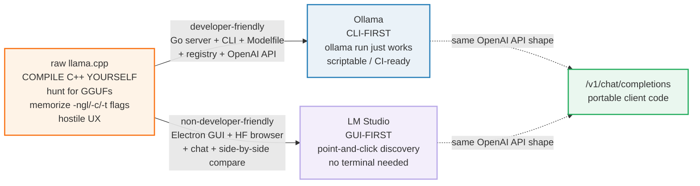
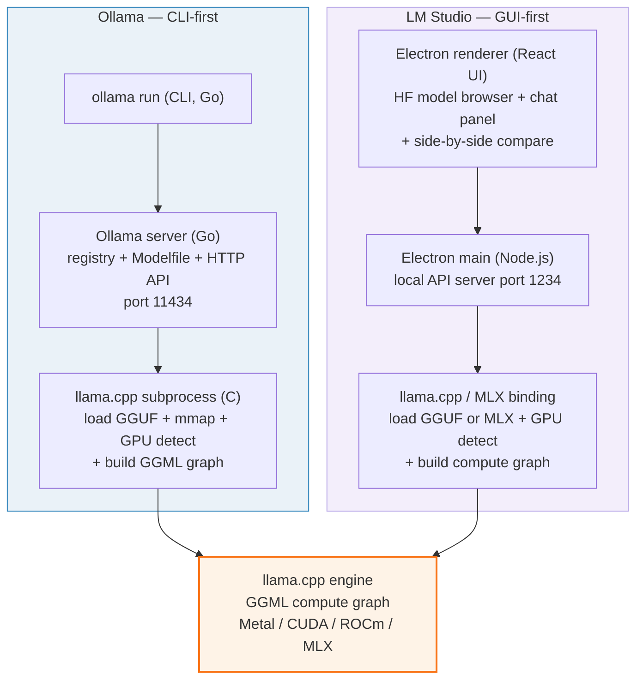
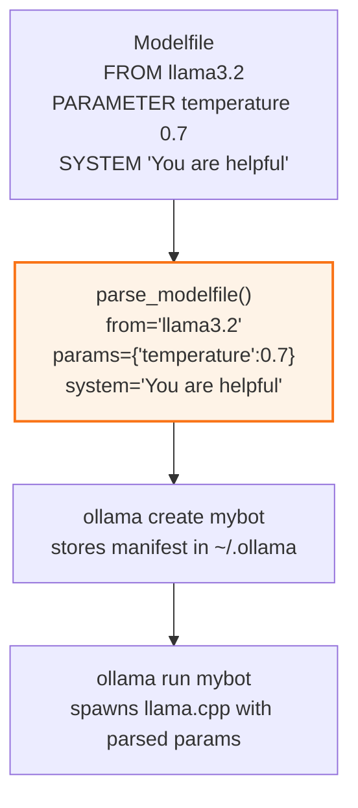

# Ollama & LM Studio — the user-friendly layers on llama.cpp

> Companion: [ollama_lmstudio.py](https://github.com/quanhua92/tutorials/blob/main/local-llm/ollama_lmstudio.py)
> Live playground: [ollama_lmstudio.html](./ollama_lmstudio.html) — interactive architecture + live Modelfile parser
> Sibling: [GGUF_FORMAT.md](./GGUF_FORMAT.md) 🔗 — both load GGUF files
> Sibling: [GGML_BACKEND.md](./GGML_BACKEND.md) 🔗 — both run the GGML compute graph

## 0. TL;DR

**Ollama** and **LM Studio** are wrappers around the *same* engine: llama.cpp
(the GGML compute graph). Neither writes inference kernels. The only difference
is the shape of the wrapper:

| | Ollama | LM Studio |
|---|---|---|
| **Shape** | CLI + Go HTTP server | Electron desktop GUI |
| **Discovery** | `ollama pull` (registry) | In-app HuggingFace browser |
| **API** | `localhost:11434/v1/chat/completions` | `localhost:1234/v1/chat/completions` |
| **Headless / CI** | ✅ Yes | ❌ No |
| **Side-by-side compare** | ❌ No | ✅ Yes |
| **License** | MIT (open) | Proprietary (free) |
| **Engine** | llama.cpp | llama.cpp |

The whole story: **Ollama = CLI-first dev tool, LM Studio = GUI-first discovery
tool.** Same OpenAI-compatible API shape on both, so client code is portable —
change the port, nothing else.

The **gold-checked** fact: Ollama's **Modelfile** parser turns

```
FROM llama3.2
PARAMETER temperature 0.7
SYSTEM "You are helpful"
```

into `{from: "llama3.2", params: {temperature: 0.7}, system: "You are helpful"}`.

---

## 1. The lineage — WHY each wrapper exists



Raw llama.cpp is powerful but hostile: compile C++ yourself, hunt for GGUFs on
HuggingFace, and memorize flags (`-ngl` for GPU layers, `-c` for context,
`-t` for threads). Two philosophies filled the UX gap:

- **Ollama** (2023, Go) brought the `docker pull` / `docker run` model to models.
  `ollama run llama3.2` just works. It is scriptable and runs headless in CI.
- **LM Studio** (2023, Electron) brought the "App Store" model: a built-in
  HuggingFace browser with search, size filtering, one-click download, a chat
  GUI, and side-by-side model comparison — no terminal needed.

Both converge on the same outcome (hide llama.cpp's rough edges) but diverge on
*who* they hide them from: developers (Ollama) vs everyone else (LM Studio).

> From `ollama_lmstudio.py` Section F (lineage table):
> ```
> stage              what changed                                             why
> ------------------------------------------------------------------------------
> raw llama.cpp      compile C++ yourself, hunt for GGUFs, memorize -ngl/-c/-t flags powerful but hostile UX; no model discovery; no API
> Ollama (2023)      Go server + CLI + Modelfile + registry + OpenAI API, all CLI-driven developer-friendly: `ollama run` just works; scriptable; CI-ready
> LM Studio (2023)   Electron GUI + HuggingFace browser + chat + side-by-side compare non-developer-friendly: point-and-click discovery; no terminal
> ```

### The architecture (two stacks, one engine)



---

## 2. The mechanism — the Modelfile + the two call stacks

### A — The Modelfile (Ollama's Dockerfile for models)

The Modelfile is the one Ollama-specific artifact worth knowing. It is a
declarative manifest that pins a base model and overrides its runtime behaviour —
exactly what a Dockerfile does for containers. Verified against
[Ollama's `docs/modelfile.md`](https://github.com/ollama/ollama/blob/main/docs/modelfile.md).

| Directive | Purpose | Example |
|---|---|---|
| `FROM` | base model (registry tag or GGUF path) | `FROM llama3.2` |
| `PARAMETER` | an inference parameter (typed) | `PARAMETER temperature 0.7` |
| `SYSTEM` | the system prompt | `SYSTEM "You are helpful"` |
| `TEMPLATE` | Go chat template (`{{ .Prompt }}`) | `TEMPLATE """{{ .System }}\n{{ .Prompt }}"""` |
| `ADAPTER` | a LoRA adapter file | `ADAPTER ./my-lora.gguf` |
| `MESSAGE` | a chat message (user/assistant/system) | `MESSAGE user "Hi"` |
| `LICENSE` | license text | `LICENSE "MIT"` |

`PARAMETER` values are **type-coerced**: `0.7`→float, `4096`→int, `true`→bool,
`"User:"`→string. Strings may be bare, `"double-quoted"`, or
`"""triple-quoted"""` (multi-line).

> From `ollama_lmstudio.py` Section A (the GOLD value):
> ```
> INPUT (the gold Modelfile):
>   | FROM llama3.2
>   | PARAMETER temperature 0.7
>   | SYSTEM "You are helpful"
>
> PARSED:
>   from    = 'llama3.2'
>   params  = {'temperature': 0.7}
>   system  = 'You are helpful'
>
> [check] from == 'llama3.2' :  OK  ('llama3.2')
> [check] params has temperature :  OK
> [check] temperature == 0.7 (float) :  OK  (0.7)
> [check] system == 'You are helpful' :  OK  ('You are helpful')
> ```

A richer Modelfile exercises every directive and the type system:

> From `ollama_lmstudio.py` Section A (richer Modelfile, every directive):
> ```
> PARSED:
>   from     = 'llama3.2:3b'
>   params   = {
>     num_ctx        = 8192            (int)
>     stop           = 'User:'         (str)
>     stream         = True            (bool)
>     temperature    = 0.8             (float)
>     top_p          = 0.9             (float)
>   }
>   template = '{{ .System }}\n{{ .Prompt }}'
>   system   = 'You are a concise coding assistant.'
>   adapter  = './my-lora.gguf'
>   license  = 'MIT'
>   messages = [{'role': 'user', 'content': 'What is mmap?'}, {'role': 'assistant', 'content': 'Memory-mapped file I/O.'}]
>
> [check] temperature coerced to float 0.8 :  OK
> [check] num_ctx coerced to int 8192 :  OK
> [check] stream coerced to bool True :  OK
> [check] stop string quotes stripped :  OK
> [check] multi-line template parsed (3 lines) :  OK
> ```

### B — Ollama: what `ollama run` actually does

> From `ollama_lmstudio.py` Section B (call stack):
> ```
>   ollama run llama3.2 "Hello"
>       [CLI client (Go)]
>     |-resolve model -> registry tag -> local blob path
>     |-if missing: ollama pull -> download GGUF from registry
>     |-spawn llama.cpp runner subprocess (cgo / shared C lib)
>       |-load GGUF: header + KV + tensor info + mmap tensor_data   [llama.cpp (C)]
>       |-detect GPU backend: Metal | CUDA | ROCm (auto-offload)     [llama.cpp (C)]
>       |-build GGML compute graph for this architecture             [llama.cpp (C)]
>         |-tokenize prompt  ->  token ids                            [llama.cpp (C)]
>         |-forward pass: matmul + RoPE + attention + sampling        [llama.cpp (C)]
>         |-detokenize -> text, stream tokens back over stdout        [llama.cpp (C)]
>     |-relay token stream to the terminal
> ```

The Go layer is a **thin orchestrator**. All math runs in the llama.cpp
subprocess. Ollama adds only: the model registry, the Modelfile, the
OpenAI-compatible HTTP API, and auto GPU detection. Ollama 0.19+ adds an MLX
backend on Apple Silicon (up to 93% faster decode) — same orchestration shape.

### C — LM Studio: what clicking "Send" does

> From `ollama_lmstudio.py` Section C (call stack):
> ```
>   LM Studio app window (chat panel)                                    [Electron renderer (React UI)]
>     |-Model browser tab -> HuggingFace API (search/filter/download)    [Electron renderer]
>     |-user picks model -> one-click GGUF/MLX download to ~/.cache      [Electron renderer]
>     |-click 'Start Server' -> local API on port 1234                   [Electron main (Node.js)]
>     |-click 'Send' in chat -> request to in-process llama.cpp          [Electron main (Node.js)]
>       |-load GGUF or MLX weights (mmap)                                [llama.cpp / MLX]
>       |-detect GPU (Metal/CUDA) or MLX backend; multi-GPU supported    [llama.cpp / MLX]
>       |-forward pass -> tokens                                         [llama.cpp / MLX]
>     |-stream tokens back to renderer, render in chat bubble            [Electron renderer]
>     |-OPTIONAL: 2nd model column -> same prompt, both responses shown  [Electron renderer]
> ```

The Electron layer adds **discovery + UX**: the in-app HuggingFace browser, the
chat GUI, and side-by-side model comparison — none of which Ollama has. The
trade-off: no CLI, no headless mode. You cannot script LM Studio in CI.

### D — The shared OpenAI-compatible API

Both expose `/v1/chat/completions` with the **same** request body. Client code
is portable: change the host:port, nothing else.

> From `ollama_lmstudio.py` Section D:
> ```
> Request body (identical for both):
>   POST /v1/chat/completions
>   {"messages": [{"content": "Hello", "role": "user"}], "model": "llama3.2", "stream": false, "temperature": 0.7}
>
>   -> Ollama:    POST http://localhost:11434/v1/chat/completions
>   -> LM Studio: POST http://localhost:1234/v1/chat/completions
>
> [check] both share the same API path :  OK
> [check] ports differ (11434 vs 1234) :  OK
> ```

---

## 3. Practical config / commands

```bash
# ---- Ollama (CLI-first) ----
ollama pull llama3.2                       # download GGUF from the registry
ollama run llama3.2                        # interactive chat in the terminal
ollama run llama3.2 "Summarize this"       # one-shot prompt

# build a custom model from a Modelfile
ollama create mybot -f Modelfile           # mybot = llama3.2 + your params/system
ollama run mybot

# the OpenAI-compatible API (no extra setup -- it's always on)
curl http://localhost:11434/v1/chat/completions \
  -d '{"model":"llama3.2","messages":[{"role":"user","content":"hi"}]}'

# ---- LM Studio (GUI-first) ----
# 1. Open the app -> Browse Models tab -> search HuggingFace -> Download
# 2. Load model in the chat tab, or click "Start Server" for the API
curl http://localhost:1234/v1/chat/completions \
  -d '{"model":"llama3.2","messages":[{"role":"user","content":"hi"}]}'
```

Common `PARAMETER` keys (passed to llama.cpp at run time):

| Key | Type | Meaning |
|---|---|---|
| `temperature` | float | sampling temperature (0 = greedy) |
| `top_p` | float | nucleus sampling cutoff |
| `top_k` | int | top-k sampling cutoff |
| `num_ctx` | int | context window size (KV cache budget — see VRAM_ESTIMATOR.md) |
| `num_predict` | int | max tokens to generate |
| `stop` | string | stop sequence(s) |
| `stream` | bool | stream tokens as SSE |
| `num_gpu` | int | GPU layer offload count (manual override of auto-offload) |

A sample `Modelfile`:

```dockerfile
FROM llama3.2
PARAMETER temperature 0.7
PARAMETER num_ctx 4096
PARAMETER stop "User:"
SYSTEM "You are a helpful assistant."
TEMPLATE """{{ .System }}

{{ .Prompt }}"""
```

---

## 4. Worked example — Modelfile → running model



1. **Write** a `Modelfile` (the three-line gold example above).
2. **Parse** it — `from` selects the base GGUF; `params` override llama.cpp
   sampling/context flags; `system` seeds the first message.
3. **Create** — `ollama create mybot -f Modelfile` stores the parsed manifest
   alongside the base model blob.
4. **Run** — `ollama run mybot` spawns llama.cpp with `temperature=0.7`, the
   4096-token context, and the system prompt prepended.

The parser is the entire `ollama_lmstudio.py` Section A: it coerces types,
strips quotes, handles `"""multi-line"""` blocks, and ignores `# comments`.

---

## 5. Pitfalls (trap → symptom → fix)

| Trap | Symptom | Fix |
|---|---|---|
| **Pointing both tools at the same port** | One fails to start ("address in use") | Ollama=11434, LM Studio=1234. They are different defaults for a reason; don't override them to collide. |
| **Expecting LM Studio to be scriptable** | CI pipeline can't load a model headlessly | LM Studio has **no CLI / no headless mode**. Use Ollama (or raw llama.cpp) for automation. |
| **Treating `PARAMETER` values as strings** | `temperature 0.7` passed as the string `"0.7"`, sampling breaks | Modelfile **type-coerces** values: `0.7`→float, `4096`→int, `true`→bool. Parse them, don't quote them. |
| **Forgetting the chat template** | Multi-turn conversations lose context / role markers | Set `TEMPLATE` with `{{ .System }}`, `{{ .Prompt }}`, `{{ .Messages }}`. Without it, messages concatenate as raw text. |
| **Assuming `num_ctx` is free** | OOM on long contexts | `num_ctx` sizes the KV cache linearly. 32K ctx can double VRAM use vs 4K. See VRAM_ESTIMATOR.md. |
| **Confusing the two OpenAI APIs** | Code hardcodes one port and breaks on the other | Same `/v1/chat/completions` path on both — make the **base URL configurable** (`http://localhost:11434` vs `:1234`). |
| **Expecting Ollama to scale to many users** | Latency collapses under concurrent load | Ollama is **single-user optimized**. For production throughput, graduate to vLLM (continuous batching). See VLLM_SERVING.md. |
| **Thinking the GUI means no GPU config** | Model loads on CPU, 2 tok/s | Both **auto-offload** GPU layers, but verify: check the load log for `Metal`/`CUDA` or set `num_gpu` explicitly. |
| **Editing a Modelfile's base model by hand** | Mismatched architecture / tokenizer | `FROM` must match the registry tag or a valid GGUF path. A wrong architecture name = a load error from llama.cpp. |
| **Assuming identical feature parity** | Surprised LM Studio has no headless mode (or Ollama has no GUI) | They are **deliberately asymmetric**: Ollama trades GUI for scriptability; LM Studio trades CLI for discoverability. Pick by workflow, not by hype. |

---

## 6. Cheat sheet

```
OLLAMA (CLI-first, Go, MIT, port 11434)
  ollama pull <model>        download GGUF from registry
  ollama run <model>         interactive chat
  ollama create <name> -f Modelfile   build a custom model
  API: localhost:11434/v1/chat/completions   (OpenAI-compatible)
  headless / CI: YES

LM STUDIO (GUI-first, Electron, proprietary-free, port 1234)
  in-app: HuggingFace browser + chat + side-by-side compare
  API:  localhost:1234/v1/chat/completions   (OpenAI-compatible)
  headless / CI: NO

MODELFILE (Ollama's Dockerfile for models)
  FROM <model>            base model
  PARAMETER <key> <val>   typed param (float/int/bool/string)
  SYSTEM <string>         system prompt
  TEMPLATE <go-template>  chat template ({{ .Prompt }}, {{ .System }})
  ADAPTER <path>          LoRA adapter
  MESSAGE <role> <str>    chat message (user|assistant|system)
```

| You want… | Use |
|---|---|
| Quick terminal chat | `ollama run llama3.2` |
| Browse & compare models visually | LM Studio |
| Scriptable / CI model serving | Ollama (or raw llama.cpp) |
| OpenAI-compatible local API | Either (same `/v1/chat/completions`) |
| Custom params + system prompt | Ollama Modelfile (`ollama create`) |
| LoRA adapters | Ollama `ADAPTER` directive |
| Multi-user production throughput | Graduate to vLLM (see VLLM_SERVING.md) |
| Apple Silicon MLX backend | Both (Ollama 0.19+, LM Studio native) |

**The three facts to memorize:**
```
shared engine = llama.cpp (GGML compute graph)   -- BOTH wrap it
Ollama  API   = localhost:11434/v1/chat/completions   (CLI-first, headless)
LM Studio API = localhost:1234/v1/chat/completions    (GUI-first, no headless)
```

---

## 🔗 Cross-references

- **[GGUF_FORMAT.md](./GGUF_FORMAT.md)** 🔗 — both tools *load* GGUF files. The
  header + KV + tensor-info + aligned tensor_data layout is what
  `ollama pull` downloads and what LM Studio's browser fetches from HuggingFace.
- **[GGML_BACKEND.md](./GGML_BACKEND.md)** 🔗 — both tools *run* the GGML
  compute graph. The "build graph → schedule on backend → execute" pipeline is
  the engine hidden under both wrappers.
- **[OPEN_WEBUI.md](./OPEN_WEBUI.md)** 🔗 — Ollama has no built-in GUI; it pairs
  with Open WebUI (multi-model chat, RAG, MCP tools) for a web frontend that
  talks to Ollama's API.
- **[VLLM_SERVING.md](./VLLM_SERVING.md)** 🔗 — when you outgrow single-user
  local serving. Ollama/LM Studio are dev/single-user tools; vLLM is the
  production multi-user step (PagedAttention + continuous batching).
- **[MLX_INFERENCE.md](./MLX_INFERENCE.md)** — both support the MLX backend on
  Apple Silicon (Ollama 0.19+; LM Studio natively). MLX exploits unified memory.

---

## Sources

- [ollama/ollama](https://github.com/ollama/ollama) — the Go server + CLI. Primary source for the architecture (Go server spawning a llama.cpp runner subprocess via cgo), the model registry, and the OpenAI-compatible API at port 11434.
- [Ollama Modelfile docs](https://github.com/ollama/ollama/blob/main/docs/modelfile.md) — the authoritative Modelfile specification: `FROM`, `PARAMETER`, `SYSTEM`, `TEMPLATE`, `ADAPTER`, `MESSAGE`, `LICENSE` directives and their value semantics. The gold parser in `ollama_lmstudio.py` implements these.
- [lmstudio.ai](https://lmstudio.ai/) — LM Studio (Electron desktop app, proprietary-but-free). Built-in HuggingFace model browser, side-by-side model comparison, local API server at port 1234, GGUF + MLX support.
- [HuggingFace GGUF docs](https://huggingface.co/docs/hub/en/gguf) — confirms GGUF is the shared model format both tools consume (cross-ref to GGUF_FORMAT.md).
- [Ollama MLX backend](https://github.com/ollama/ollama) — Ollama 0.19+ adds an MLX backend on Apple Silicon (up to 93% faster decode for supported models).
- Web-verified (2026): both tools wrap the same llama.cpp engine; Ollama is CLI-first/scriptable/headless, LM Studio is GUI-first/discovery-focused with no headless mode; both expose OpenAI-compatible `/v1/chat/completions`; LM Studio excels with MLX on single-user, Ollama better at concurrent batching.
