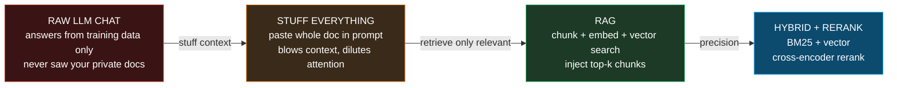

# Open WebUI & RAG Pipeline — self-hosted ChatGPT for local LLMs

> Companion: [open_webui.py](https://github.com/quanhua92/tutorials/blob/main/local-llm/open_webui.py)
> Live: [open_webui.html](./open_webui.html)

## 0. TL;DR

Open WebUI is a **self-hosted web frontend** for LLMs. It does **not** run models
— it connects to backends (Ollama, OpenAI, Anthropic, or any OpenAI-compatible API)
and layers features on top: multi-model chat, **RAG** (chat with your documents),
tools/MCP, pipelines, and multi-user RBAC. Its flagship feature is **RAG**
(Retrieval-Augmented Generation): upload a document → **chunk** it → **embed** each
chunk → store in a **vector DB** → at query time, embed the query, find the top-k
closest chunks by cosine similarity, optionally **rerank** them, then **inject**
only those chunks into the LLM prompt. The model answers grounded in *your* data,
cheaply, without stuffing the whole document into context.

**The pipeline (the one thing to remember):**

```
Document -> [CHUNK] -> [EMBED] -> [VECTOR DB]
Query    -> [EMBED] -> [cosine top-k] -> [RERANK] -> [INJECT] -> [LLM]
```

**Gold (verified, [check: OK] in the `.py` and `.html`):** document
`"The cat sat on the mat. The dog ran in the park. Cats love fish."` chunked at
**5 words, overlap 2** (step 3) → 5 chunks. Query `"What do cats eat?"` → top
chunk **`"Cats love fish."`** at cosine similarity **0.288675**.

---

## 1. What it is (lineage old → new, WHY each step)



| Step | Problem it fixes | What changes |
|---|---|---|
| **1. Raw LLM chat** | — (the baseline) | Model answers from training data; cannot see private docs; hallucinates what it does not know |
| **2. Stuff context** | Model has no access to your docs | Paste the whole doc into the prompt. Works for one short doc; dies at scale — blows the context window, costs tokens, dilutes attention |
| **3. RAG** | Context window + cost + relevance | Split doc into **chunks**, **embed** each, store in a **vector DB**. At query time retrieve only the **top-k** relevant chunks and inject those |
| **4. Hybrid + rerank** | Vector search misses exact keyword matches | Combine **BM25** (keyword) + **vector** (semantic), then a **cross-encoder** re-scores the (query, chunk) pairs for precision |

Open WebUI is the **frontend** that orchestrates all of this. It connects to:

| backend | local/remote | endpoint | serves |
|---|---|---|---|
| Ollama | local | `http://localhost:11434` | any GGUF model via `/api/chat` |
| OpenAI API | remote | `https://api.openai.com` | GPT-4o, o-series |
| Anthropic | remote | `https://api.anthropic.com` | Claude (OpenAI-compat endpoint) |
| OpenAI-compat | either | `<any base_url>` | vLLM, LM Studio, llama.cpp server, Together, Groq, … |

**Why it matters:** you get a ChatGPT-grade interface (RAG, tools, multi-user) over
*your own* model on *your own* hardware — private, offline-capable, and free.

---

## 2. The mechanism (internals)

### 2a. The RAG pipeline — six stages

```mermaid
graph TD
    D["📄 Document"] --> CH["CHUNK<br/>size 512 tok, overlap 50<br/>(or sentence-based)"]
    CH --> EM["EMBED<br/>nomic-embed-text<br/>768-dim vector"]
    EM --> VDB[("VECTOR DB<br/>ChromaDB / PGVector /<br/>Qdrant / Milvus / ...")]
    Q["❓ Query"] --> EMQ["EMBED query"]
    EMQ --> SR["COSINE SEARCH<br/>top-k = 5"]
    VDB --> SR
    SR --> RR["RERANK<br/>cross-encoder"]
    RR --> IN["INJECT into prompt<br/>'Context: {chunks}<br/><br/>Question: {query}'"]
    IN --> LLM["🤖 LLM generates<br/>grounded answer"]
    style D fill:#161b22,stroke:#8b949e
    style Q fill:#161b22,stroke:#8b949e
    style CH fill:#3a2a1a,stroke:#e67e22,color:#fff
    style EM fill:#3a2a1a,stroke:#e67e22,color:#fff
    style VDB fill:#0c4a6e,stroke:#0ea5e9,color:#fff
    style SR fill:#1c3a25,stroke:#27ae60,color:#fff
    style RR fill:#1c3a25,stroke:#27ae60,color:#fff
    style IN fill:#0c4a6e,stroke:#0ea5e9,color:#fff
    style LLM fill:#0c4a6e,stroke:#0ea5e9,color:#fff
```



### 2b. Chunking — where retrieval quality is won or lost

The document is split into overlapping windows. `step = size - overlap`. Overlap
prevents a fact split across two chunks from being lost at the seam.

> From open_webui.py Section B:
> ```
> Demo document (15 words):
>   'The cat sat on the mat. The dog ran in the park. Cats love fish.'
> 
> Chunk it at size=5, overlap=2 (step=3):
> | # | chunk                          | words |
> |---|--------------------------------|-------|
> | 0 | The cat sat on the             | 5     |
> | 1 | on the mat. The dog            | 5     |
> | 2 | The dog ran in the             | 5     |
> | 3 | in the park. Cats love         | 5     |
> | 4 | Cats love fish.                | 3     |
> [check] chunks == gold (5 overlapping windows, step 3): True -> OK
> 
> Effect of chunk size on chunk count (overlap=2 fixed):
> | size | overlap | step | #chunks |
> |------|---------|------|---------|
> | 3    | 2       | 1    | 13      |
> | 5    | 2       | 3    | 5       |
> | 7    | 2       | 5    | 3       |
> | 10   | 2       | 8    | 2       |
> ```

Open WebUI's production defaults are **token-based** (`CHUNK_SIZE=512`,
`CHUNK_OVERLAP=50`), but sentence-based chunking is available. This simulator
chunks at the **word** level so every number prints; the math is identical.

### 2c. Fake embeddings — the feature-hashing trick

A real embedding model (nomic-embed-text, 768 dims) needs PyTorch + weights —
forbidden by the pure-stdlib rule. Instead we use the **feature-hashing trick**:
each lowercase word → **FNV-1a hash** (deterministic — *not* Python's randomized
`hash()`) → one of 256 dims → count → L2-normalize. Two texts sharing words land
in the same buckets, so cosine similarity tracks lexical overlap.

> From open_webui.py Section C:
> ```
> Corpus vocabulary (15 words) -> hash bucket (mod 256):
> | word  | bucket |
> |-------|--------|
> | cat   | 7      |
> | cats  | 156    |
> | do    | 20     |
> | dog   | 9      |
> | eat   | 37     |
> | fish  | 99     |
> | in    | 158    |
> | love  | 209    |
> | mat   | 253    |
> | on    | 208    |
> | park  | 185    |
> | ran   | 246    |
> | sat   | 215    |
> | the   | 28     |
> | what  | 47     |
> [check] zero hash collisions at DIM=256 (exact bag-of-words): True -> OK
> ```

### 2d. Vector search — cosine top-k

Because embeddings are L2-normalized, cosine similarity is a plain dot product.
The query `"What do cats eat?"` (tokens: what, do, cats, eat) shares only **cats**
with two chunks; the chunk with fewer total tokens wins (higher density).

> From open_webui.py Section C:
> ```
> Query: 'What do cats eat?'  tokens=['what', 'do', 'cats', 'eat']
>   non-zero dims of the query embedding: [47, 20, 156, 37]
> 
> Cosine similarity of each chunk to the query (sorted desc):
> | rank | cosine  | chunk                          |
> |------|---------|--------------------------------|
> | 1    | 0.2887  | Cats love fish.                |
> | 2    | 0.2236  | in the park. Cats love         |
> | 3    | 0.0000  | The cat sat on the             |
> | 4    | 0.0000  | The dog ran in the             |
> | 5    | 0.0000  | on the mat. The dog            |
> 
> Top chunk: 'Cats love fish.'  (cosine = 0.2887)
> [check] top chunk == 'Cats love fish.': True -> OK
> [check] top cosine == 0.2887 (1/(2*sqrt3)): True -> OK
> ```

The exact value: the query has 4 unit-normalized terms, the chunk has 3, they
share **1** term (`cats`). `cos = (1/√4) · (1/√3) = 0.5 × 0.577350 = 0.288675`.

### 2e. Hybrid search + cross-encoder rerank

Pure vector search misses exact keyword matches. **BM25** is the classic keyword
ranker (rewards rare terms, short docs). **Hybrid** = `α·vector + (1−α)·BM25`
(scores min-max normalized first). Then a **cross-encoder** reranks the top-k.

> From open_webui.py Section D:
> ```
> BM25 index stats (k1=1.5, b=0.75):
>   N (chunks) = 5,  avgdl = 4.60 tokens
>   query content terms: ['cats', 'eat']
> 
> | chunk                          | bm25  | vector  | rerank |
> |--------------------------------|-------|---------|--------|
> | The cat sat on the             | 0.000 | 0.0000  | 0.0000 |
> | on the mat. The dog            | 0.000 | 0.0000  | 0.0000 |
> | The dog ran in the             | 0.000 | 0.0000  | 0.0000 |
> | in the park. Cats love         | 0.843 | 0.2236  | 0.2000 |
> | Cats love fish.                | 1.038 | 0.2887  | 0.3333 |
> 
> Hybrid blend (alpha=0.5, scores min-max normalized first):
> | rank | hybrid | chunk                          |
> |------|--------|--------------------------------|
> | 1    | 1.0000 | Cats love fish.                |
> | 2    | 0.7932 | in the park. Cats love         |
> ```

All three signals (vector, BM25, rerank) agree: **`"Cats love fish."`** is #1.

### 2f. The 9 vector databases

Open WebUI supports 9 vector DB backends (docs.openwebui.com/features):

| DB | tier | notes |
|---|---|---|
| **ChromaDB** | official | default, bundled in the Docker image |
| **PGVector** | official | Postgres extension; can share the app DB |
| Qdrant | community | production-grade, rich filtering |
| Milvus | community | billion-scale, sharded |
| Elasticsearch | community | BM25 + kNN in one engine |
| OpenSearch | community | AWS fork of Elasticsearch |
| Redis | community | in-memory, low latency |
| MongoDB Atlas | community | `$vectorSearch` aggregation |
| SurrealDB | community | multi-model |

---

## 3. Practical config / commands

### Install + run

```bash
# pip (simplest)
pip install open-webui && open-webui serve      # http://localhost:8080

# Docker (recommended for production; bundles Ollama)
docker run -d -p 3000:8080 \
  --add-host=host.docker.internal:host-gateway \
  -v open-webui:/app/backend/data \
  -e OLLAMA_BASE_URL=http://host.docker.internal:11434 \
  --name open-webui --restart always \
  ghcr.io/open-webui/open-webui:main
```

### RAG / Knowledge settings (env vars)

```bash
CHUNK_SIZE=512                 # tokens per chunk
CHUNK_OVERLAP=50               # overlap between chunks
RAG_TOP_K=5                    # chunks to retrieve
RAG_EMBEDDING_ENGINE=ollama    # ollama | openai | sentence_transformers
RAG_EMBEDDING_MODEL=nomic-embed-text
RAG_RERANKING_ENGINE=ollama    # cross-encoder reranker
RAG_RERANKING_MODEL=jina-reranker-v2-base-multilingual
RAG_HYBRID_SEARCH=true         # BM25 + vector (Section 2e)
VECTOR_DB=chromadb             # chromadb | pgvector | qdrant | milvus | ...
```

### Connect a backend

- **Ollama** (local): point at `OLLAMA_BASE_URL=http://localhost:11434` — no key.
- **OpenAI**: set `OPENAI_API_KEY`; base URL defaults to OpenAI.
- **Any OpenAI-compatible** (vLLM, LM Studio, llama.cpp server): set
  `OPENAI_API_BASE_URL` + `OPENAI_API_KEY`.

---

## 4. Worked example (the gold centerpiece)

> From open_webui.py Section G:
> ```
> Full end-to-end pipeline on the canonical example:
>   Document : 'The cat sat on the mat. The dog ran in the park. Cats love fish.'
>   Query    : 'What do cats eat?'
>   Chunk    : size=5 words, overlap=2, step=3
> 
> STEP 1  CHUNK
>         [0] 'The cat sat on the'
>         [1] 'on the mat. The dog'
>         [2] 'The dog ran in the'
>         [3] 'in the park. Cats love'
>         [4] 'Cats love fish.'
> 
> STEP 2  EMBED  (256-dim hashing vectors, L2-normalized)
>         query tokens   = ['what', 'do', 'cats', 'eat']
>         query non-zero = [47, 20, 156, 37]
>         vector DB now holds 5 chunk vectors
> 
> STEP 3  VECTOR SEARCH (cosine, top-5)
>         1. cos=0.2887  'Cats love fish.'
>         2. cos=0.2236  'in the park. Cats love'
>         3. cos=0.0000  'The cat sat on the'
>         4. cos=0.0000  'The dog ran in the'
>         5. cos=0.0000  'on the mat. The dog'
> 
> STEP 4  RERANK (cross-encoder proxy: match density)
>         rerank=0.3333 (cos=0.2887)  'Cats love fish.'
>         rerank=0.2000 (cos=0.2236)  'in the park. Cats love'
> 
> STEP 5  INJECT into prompt template
>         Context: - Cats love fish.
>         
>         Question: What do cats eat?
> 
> STEP 6  LLM generates (grounded in injected context):
>         -> 'Cats eat fish.'
> 
> [check] chunks == gold (5 overlapping windows): True -> OK
> [check] top chunk == 'Cats love fish.': True -> OK
> [check] top cosine == 0.288675: True -> OK
> [check] prompt contains the retrieved context: True -> OK
> ```

---

## 5. Pitfalls (trap | symptom | fix)

| Trap | Symptom | Fix |
|---|---|---|
| **Chunks too large** | Retrieved chunk buries the answer in irrelevant text; model ignores the right sentence; context window fills fast | Lower `CHUNK_SIZE` (512 is a sound default); the relevance signal gets diluted when one chunk spans many topics |
| **Chunks too small / no overlap** | A fact split across the seam is lost; recall drops | Add `CHUNK_OVERLAP` (≈10% of size, e.g. 50/512) so boundary context repeats |
| **Wrong embedding model** | Semantically similar text gets low cosine (e.g. a multilingual embedder on domain jargon, or a model whose max input < chunk size) | Use a model trained for your language/domain (`nomic-embed-text` is a solid general default); verify its `max_length` ≥ `CHUNK_SIZE` |
| **Mixing embedding spaces** | You re-embed the query with a *different* model than the chunks → cosine is meaningless, retrieval is random | The query embedder **must** be the same model used at ingest. Re-embed the whole corpus if you switch models |
| **Top-k too low** | The one relevant chunk lands at rank 6+ and is never injected | Raise `RAG_TOP_K`; or enable **hybrid + rerank** so the right chunk surfaces even from a larger candidate pool |
| **Forgetting to rerank** | Vector search returns semantically-near but not precisely-relevant chunks (a paraphrase beats the exact answer) | Enable a **cross-encoder reranker** (`RAG_RERANKING_MODEL`); it re-scores the (query, chunk) pair jointly for precision |
| **Using Python's `hash()` for embeddings** | Results change every run (`PYTHONHASHSEED` randomization) → non-reproducible, vector DB silently corrupt | Use a **deterministic** hash (this bundle uses FNV-1a) — or, in production, the real embedding model |
| **Hash collisions (feature-hashing trick)** | Two unrelated words map to the same dim → false similarity, ranking noise | Use a wide enough `DIM` (256 here is collision-free for a 15-word vocab); real embedders sidestep this entirely |
| **Stuffing instead of RAG** | Pasting a huge doc into the prompt → slow, expensive, attention diluted | Only inject the **top-k retrieved chunks**; that is the entire point of RAG |
| **Backend not reachable** | "Ollama: connection refused" inside Docker | Use `host.docker.internal:11434` (not `localhost`) when Open WebUI runs in Docker but Ollama runs on the host |

---

## 6. Cheat sheet

```
Open WebUI : SELF-HOSTED FRONTEND (does NOT run models)
             connects to Ollama / OpenAI / Anthropic / OpenAI-compat
             adds RAG, tools/MCP, pipelines, multi-user RBAC.

install    : pip install open-webui && open-webui serve
             docker run -p 3000:8080 ghcr.io/open-webui/open-webui:main

RAG pipeline:
  Document -> [CHUNK size=512 overlap=50] -> [EMBED nomic-embed-text]
           -> [VECTOR DB]                                  (ingest, once)
  Query    -> [EMBED] -> [cosine top-k=5] -> [RERANK cross-encoder]
           -> [INJECT "Context:{chunks}\n\nQuestion:{q}"] -> [LLM]

chunking   : step = size - overlap. token-based (default) | sentence-based.
             too small -> lose context; too large -> dilute relevance.

embedding  : this bundle = feature-hashing trick (FNV-1a -> 256 dims ->
             count -> L2-normalize). Deterministic surrogate for
             nomic-embed-text (768 dims). cosine = dot product (normalized).

hybrid     : alpha*vector + (1-alpha)*BM25, min-max normalized.
             BM25: IDF * tf*(k1+1)/(tf + k1*(1-b+b*dl/avgdl)), k1=1.5,b=0.75.

vector DBs : 9 backends -- ChromaDB, PGVector (official);
             Qdrant, Milvus, Elasticsearch, OpenSearch, Redis, MongoDB, SurrealDB.

numbers    : doc chunked size=5 overlap=2 -> 5 chunks.
             query "What do cats eat?" -> top "Cats love fish." cos=0.288675
             = (1/sqrt4)*(1/sqrt3) [shared word 'cats', normalized vectors].
```

---

## 🔗 Cross-references

- **[ollama_lmstudio](./OLLAMA_LMSTUDIO.md)** — Open WebUI's default local backend.
  It connects to Ollama at `http://localhost:11434`; the model serving, Modelfiles,
  and GGUF management happen there. This bundle is the *frontend*; that one is the
  *engine* it talks to.
- **vector-db** (sibling) — the 9 vector DB backends Open WebUI's RAG layer can
  store embeddings in. This bundle *uses* a vector search; that one covers the
  engines (HNSW, IVF, filtering) that make it fast at scale.
- **[gguf_format](./GGUF_FORMAT.md)** / **quant_types** — the model files Open
  WebUI loads indirectly through Ollama.

## Sources

- [Open WebUI — Features](https://docs.openwebui.com/features/) — the canonical
  feature list (chat, Knowledge & RAG, 9 vector DBs, hybrid search, MCP, RBAC,
  Open Terminal, extensibility)
- [Open WebUI — Quick Start](https://docs.openwebui.com/getting-started/quick-start) —
  `pip install open-webui && open-webui serve`, Docker one-liner
- [Open WebUI — Knowledge (RAG)](https://docs.openwebui.com/features/workspace/knowledge) —
  vector search vs full-content injection, hybrid search + reranking
- [Open WebUI — Extensibility (Pipelines, MCP, OpenAPI)](https://docs.openwebui.com/features/extensibility) —
  tools, pipelines, MCP Streamable HTTP
- [Open WebUI — Authentication & Access](https://docs.openwebui.com/features/authentication-access) —
  RBAC, SSO/OIDC/LDAP, SCIM 2.0
- [Open WebUI GitHub](https://github.com/open-webui/open-webui)
- [BM25 (Wikipedia)](https://en.wikipedia.org/wiki/Okapi_BM25) — the Okapi BM25
  ranking function, k1/b parameters
- [Feature hashing (Wikipedia)](https://en.wikipedia.org/wiki/Feature_hashing) —
  the hashing trick used by the fake embedder
