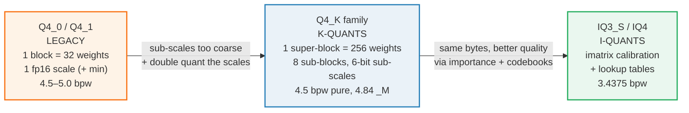
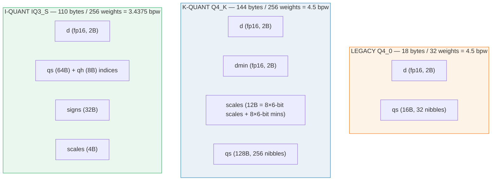
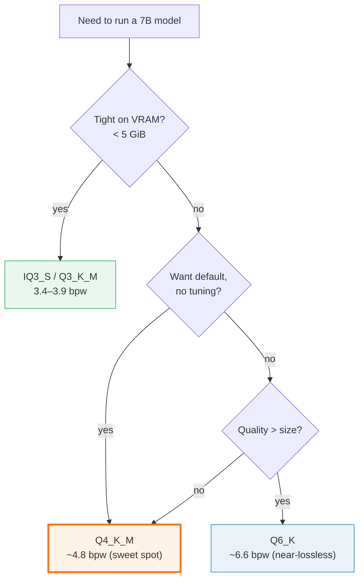

# GGUF Quant Types — legacy Q4_0 → K-quants Q4_K_M → I-quants IQ3_S

> Companion: [quant_types.py](https://github.com/quanhua92/tutorials/blob/main/local-llm/quant_types.py)
> Live playground: [quant_types.html](./quant_types.html)
> Sibling (the algorithm side): [../llm/QUANTIZATION.md](../llm/QUANTIZATION.md) — W4A16 server-side group quant
> Where these tensors actually live in a file: [GGUF_FORMAT.md](./GGUF_FORMAT.md) 🔗

## 0. TL;DR

A **quant type** is a recipe for packing a **block** of consecutive weights into
a fixed number of bytes, plus the formula that unpacks them back to a float
inside the matmul. Three families, oldest → newest, each strictly better at the
same byte budget:

| Family | Canonical member | bpw | Why it exists |
|---|---|---|---|
| **Legacy** | `Q4_0` | 4.5 | One fp16 scale per 32 weights, uniform across all layers. The baseline. |
| **K-quants** | `Q4_K_M` | ~4.84 | Super-blocks of 256 + **double-quantized** scales + **mixed** precision across layers. The default choice. |
| **I-quants** | `IQ3_S` | 3.4375 | **Importance matrix** (calibration) + **lookup tables**. Same bytes as Q3_K, much lower perplexity. The extreme-compression choice. |

Decode is **bandwidth-bound**: weights stream from memory every token, so
*bits/weight (bpw) ≈ decode speed*. Pick the lowest bpw your quality target allows.

---

## 1. The lineage — WHY each step exists



**The single recurring trick: spend the scale-metadata budget more cleverly.**
Legacy uses 2–4 bytes of metadata for 32 weights. K-quants pack 8 sub-scales
into 12 bytes for 256 weights (≈ 50% less metadata overhead per weight) AND
quantize those sub-scales themselves. I-quants keep the same byte budget but
redistribute the *error* to where it costs the least perplexity.

### Block layout comparison (the bytes that actually ship)



---

## 2. The mechanism — dequant formulas from scratch

Every number below is printed by `quant_types.py`; byte counts are verified
against the `static_assert(sizeof(block_*) == …)` lines in
[`ggml/src/ggml-common.h`](https://github.com/ggml-org/llama.cpp/blob/master/ggml/src/ggml-common.h).

### A — Q4_0: symmetric 4-bit (the original)

> From `quant_types.py` Section A:
> ```
> Q4_0 block layout (verified: ggml/src/ggml-common.h block_q4_0):
>   QK4_0 = 32 weights per block
>   bytes = sizeof(ggml_half) + QK4_0/2 = 2 + 16 = 18 bytes
>   bits/weight = 18*8 / 32 = 4.5000
>
> Dequant formula (symmetric):
>   weight = d * (q - 8)     where d = fp16 scale, q = 4-bit value in 0..15
> ```

The `- 8` centers the 16-level codebook on zero (`0..15 → -8..+7`). Cheap, but a
block of all-positive weights wastes half the range. **This is the gold-checked
value** the HTML playground reproduces:

> From `quant_types.py` Section A (hero block):
> ```
> | i | q  | q-8 |  d*(q-8)  |
> |---|----|-----|-----------|
> | 0 |  3 |  -5 |      -2.5 |
> | 1 |  7 |  -1 |      -0.5 |
> | 2 |  1 |  -7 |      -3.5 |
> | 3 |  6 |  -2 |      -1.0 |
> | 4 |  9 |   1 |      +0.5 |
> | 5 |  2 |  -6 |      -3.0 |
> | 6 |  5 |  -3 |      -1.5 |
> | 7 |  8 |   0 |      +0.0 |
> GOLD: dequant_q4_0(d=0.5, q=[3,7,1,6,9,2,5,8]) = [-2.5,-0.5,-3.5,-1.0,+0.5,-3.0,-1.5,+0.0]
> ```

### B — Q4_1: asymmetric, adds an fp16 min

> From `quant_types.py` Section B:
> ```
> Q4_1 block layout (verified: block_q4_1):
>   QK4_1 = 32 weights per block
>   bytes = 2*sizeof(ggml_half) + QK4_1/2 = 4 + 16 = 20 bytes
>   bits/weight = 20*8 / 32 = 5.0000
>
> Dequant formula (asymmetric affine):
>   weight = m + d * q     m = fp16 min (offset), q in 0..15
> ```

The min lets `q=0` map to the block's actual minimum, so **no codebook range is
wasted**. The price is 2 extra bytes/block → 5.0 bpw. This affine form `m + d·q`
is the same shape as the W4A16 group quant in `llm/QUANTIZATION.md`, just with a
smaller group size (32 vs 128) and fp16 metadata.

### C — Q8_0: the 8-bit reference

> From `quant_types.py` Section C:
> ```
> Q8_0 block layout (verified: block_q8_0):
>   QK8_0 = 32 weights per block
>   bytes = sizeof(ggml_half) + QK8_0 = 2 + 32 = 34 bytes
>   bits/weight = 34*8 / 32 = 8.5000
> Dequant formula (symmetric int8):
>   weight = d * q     q = signed 8-bit (-128..127)
> ```

256 levels → quantization error ~ scale/256. Q8_0 is the **reference** locals
measure everything else against; it is also the intermediate format used during
dot-product accumulation (`block_q8_K`).

> From `quant_types.py` Section C (round-trip error):
> ```
> orig   = [-0.72, 0.31, -0.05, 1.12, -0.88, 0.46, -1.2, 0.93]
> d      = 0.0094451904296875
> q8     = [-76, 33, -5, 119, -93, 49, -127, 98]
> max abs error = 0.00437  (vs Q4_0's ~scale/2 ceiling)
> [check] Q8_0 round-trip error < d/2 :  OK
> ```

### D — K-quants: super-blocks + double-quantized scales

> From `quant_types.py` Section D:
> ```
> Super-block layout (verified: QK_K = 256, block_q4_K):
>   A super-block = 256 weights = 8 sub-blocks of 32 weights each.
>   Each sub-block gets its OWN 6-bit scale (+ 6-bit min).
>   Those 6-bit sub-scales are re-scaled by a fp16 super-block d/dmin.
>   => DOUBLE quantization: the scales of the scales are quantized too.
>
> Q4_K pure block size = 2*sizeof(ggml_half) + K_SCALE_SIZE + QK_K/2
>   = 4 + 12 + 128 = 144 bytes  -> 4.5000 bpw (pure Q4_K)
> ```

Two ideas stacked:

1. **Sub-blocks.** 8 sub-blocks of 32 weights each get their own scale, so a
   super-block isn't stuck with one scale for 256 wildly-varying weights.
2. **Double quantization.** Those 8 six-bit sub-scales (48 bits) + 8 six-bit
   sub-mins (48 bits) = 96 bits = **12 bytes** (`K_SCALE_SIZE`), re-scaled by
   one fp16 `d` (scales) and one fp16 `dmin` (mins). The scales-of-the-scales
   are themselves quantized.

Dequant per sub-block `j`: `weight = (dmin·min6_j) + (d·scale6_j)·q`.

> From `quant_types.py` Section D (tiny 2-sub-block demo):
> ```
>   d=0.02, dmin=0.01
>   sub_scales6=[40, 55], sub_mins6=[10, 20]
>   sub-block 0: eff_scale=d*40=0.8002, eff_min=dmin*10=0.1000
>   sub-block 1: eff_scale=d*55=1.1002, eff_min=dmin*20=0.2000
> ```

**The `_M` suffix means MIXED types across layers, not a single block format.**
`Q4_K_M` ≈ 4.84 bpw because the sensitive layers (attention, embedding, output
head) use the higher-precision `Q6_K`, while the bulk MLP layers use `Q4_K`.
That is why `Q4_K_M` beats pure `Q4_K` on perplexity at a small size cost.

### E — I-quants: importance matrix + lookup tables

> From `quant_types.py` Section E:
> ```
> IQ3_S block layout (verified: block_iq3_s, QK_K=256):
>   d       : ggml_half (2 bytes)        super-block scale
>   qs      : 64 bytes             packed 2-bit+1-bit indices
>   qh      : 8 bytes             extra high bits
>   signs   : 32 bytes             1 sign bit per weight
>   scales  : 4 bytes             4-bit block scales
>   total   = 110 bytes -> 3.4375 bpw
>   (same SIZE as Q3_K = 110 bytes/256 = 3.4375 bpw, but much lower ppl)
> ```

Two new ingredients:

1. **Importance matrix (imatrix).** Run a calibration set through the FP16
   model; accumulate the average `|activation|²` per row/column. Channels that
   drive the output strongly get finer quantization; quiet channels get coarser.
   The error budget is spent **where it matters**, not uniformly.
2. **Lookup tables (codebooks).** Instead of an affine `m + d·q`, the packed
   index addresses a precomputed grid of 8-float vectors (`iq3s_grid`, 2048
   entries). Non-linear → fits the weight distribution better than any line.

> From `quant_types.py` Section E (imatrix concept):
> ```
> weights     = [0.9, -0.8, 0.1, 2.5]
> importance  = [0.2, 0.3, 5.0, 0.1]  (col 2 drives output)
> uniform deq = [0.96, -0.8, 0.08, 2.5]
> importance-weighted total error = 0.1120
>   -> I-quants shift the step boundaries so the high-importance column
>      quantizes with ~zero error, accepting more error on col 3 instead.
> ```

The build step: `./llama-imatrix -m model.fp16.gguf -f calibration.txt -o
model.imatrix`, then `./llama-quantize ... Q4_K_M --imatrix model.imatrix`.

---

## 3. The full comparison table

> From `quant_types.py` Section F (pure-format bpw, struct-verified):
> ```
> | type     | block | bytes | bpw    | family   | scale model          |
> |----------|-------|-------|--------|----------|----------------------|
> | Q4_0     |    32 |    18 | 4.5000 | legacy   | 1 fp16 d, symmetric  |
> | Q4_1     |    32 |    20 | 5.0000 | legacy   | fp16 d + fp16 m      |
> | Q5_1     |    32 |    24 | 6.0000 | legacy   | fp16 d+m + 1 high bit|
> | Q8_0     |    32 |    34 | 8.5000 | legacy   | 1 fp16 d, int8       |
> | Q2_K     |   256 |    84 | 2.6250 | k-quant  | super d/dmin, 4-bit  |
> | Q3_K     |   256 |   110 | 3.4375 | k-quant  | super d, 6-bit       |
> | Q4_K     |   256 |   144 | 4.5000 | k-quant  | super d/dmin, 6-bit  |
> | Q5_K     |   256 |   176 | 5.5000 | k-quant  | super d/dmin + high  |
> | Q6_K     |   256 |   210 | 6.5625 | k-quant  | super d, int8 scale  |
> | IQ3_S    |   256 |   110 | 3.4375 | i-quant  | super d, codebook    |
> ```

> From `quant_types.py` Section F (model-level bpw, _M/_S mixed variants —
> Llama-2-7B, k-quants README):
> ```
> | variant  | bpw   | note                                  |
> |----------|-------|---------------------------------------|
> | Q2_K     |  3.35 | 2-bit baseline, often degraded        |
> | Q3_K_S   |  3.50 | small 3-bit                           |
> | Q3_K_M   |  3.91 | medium 3-bit                          |
> | Q3_K_L   |  4.27 | large 3-bit, some Q5_K layers         |
> | Q4_K_S   |  4.58 | small 4-bit                           |
> | Q4_K_M   |  4.84 | DEFAULT: best quality/size tradeoff   |
> | Q5_K_S   |  5.52 | small 5-bit                           |
> | Q5_K_M   |  5.68 | medium 5-bit                          |
> | Q6_K     |  6.56 | near-lossless, ~Q8_0 quality smaller  |
> ```

---

## 4. Worked example — pick a quant

Decision tree (decode is bandwidth-bound, so bpw ≈ speed):



---

## 5. Pitfalls (trap → symptom → fix)

| Trap | Symptom | Fix |
|---|---|---|
| **Confusing `_S`/`_M`/`_L` with a block format** | Expecting a `Q4_K_M` struct in `ggml-common.h` (it doesn't exist) | `_M` is a *layer-mix* recipe, not a type. The blocks are still `Q4_K`/`Q6_K`; the converter picks which type per tensor. |
| **Using `Q4_0` where weights are skewed** | High perplexity on layers with all-positive or all-negative weight distributions | Use an *asymmetric* type (`Q4_1`, or any `*_K` with a min). The symmetric `-8` wastes half the codebook. |
| **Forgetting the imatrix for I-quants** | IQ3_S barely beats Q3_K, or random garbage on small models | Build `model.imatrix` from a calibration set *first* and pass `--imatrix`. Without it I-quants fall back to uniform. |
| **Mixing dequant sign conventions** | Garbled output, NaNs | `Q4_0` is `d*(q-8)` (symmetric, centered); `Q4_1`/K-quants are `m + d*q` (asymmetric). They are NOT interchangeable. |
| **Assuming bpw == file size / num_weights for `_M`** | Quoted 4.5 bpw (pure Q4_K) vs actual 4.84 (Q4_K_M) disagree | Pure-format bpw comes from the struct; `_M`/`_S`/`_L` bpw is a *model-level average* across mixed layer types. Use the README table for real models. |
| **Comparing Q8_0 to F16 as "lossless"** | Subtle accuracy regressions vs the FP16 checkpoint | Q8_0 is *near*-lossless (8.5 bpw, ~scale/256 error). It is the local *reference*, not bit-exact. |
| **Expecting I-quants to be faster** | IQ4_XS runs slower than Q4_K_M on some CPUs | Codebook lookup needs gather loads (4 loads to fill one SIMD register on IQ3_S). I-quants optimize *size/quality*, not always speed — especially off-GPU. |
| **Block size != 32 assumption** | Code that hardcodes 32 breaks on K/I-quants | Legacy = 32; K/I super-blocks = **256** (`QK_K`). The sub-block inside a super-block is 32 (or 16 for Q2_K/Q3_K/Q6_K). |

---

## 6. Cheat sheet

```bash
# quantize (the type name IS the CLI flag)
./llama-quantize model.f16.gguf model.Q4_K_M.gguf Q4_K_M

# build an importance matrix for I-quants (calibration set required)
./llama-imatrix -m model.f16.gguf -f wiki.train.txt -o model.imatrix
./llama-quantize model.f16.gguf model.IQ3_S.gguf IQ3_S --imatrix model.imatrix
```

| You want… | Use |
|---|---|
| Default, no thought | **Q4_K_M** (~4.8 bpw) |
| Smallest that still works | IQ3_S or Q3_K_M (3.4–3.9 bpw) |
| Near-lossless, smaller than F16 | Q6_K (~6.6 bpw) or Q8_0 (8.5 bpw) |
| Local reference / error baseline | Q8_0 |
| Legacy / widest compatibility | Q4_0 |

**Dequant formulas (memorize these):**
```
Q4_0 :  w = d * (q - 8)           symmetric,  q ∈ 0..15
Q4_1 :  w = m + d * q             asymmetric, q ∈ 0..15
Q8_0 :  w = d * q                 symmetric,  q ∈ -128..127
Q4_K :  w = (dmin·min6) + (d·scale6)·q   per 32-weight sub-block
IQ3_S:  w = d · codebook[idx] · sign     + imatrix-weighted d
```

---

## 🔗 Cross-references

- **[../llm/QUANTIZATION.md](../llm/QUANTIZATION.md)** — the algorithm side.
  Same affine idea `w = m + d·q`, but **W4A16** (4-bit weights, 16-bit activations)
  on the *server* with PyTorch and group_size=128. This guide is the **local
  GGUF block-quant** side (group_size=32, fp16 metadata, dequant-fused-in-matmul
  inside llama.cpp). The two share the math; they differ in where the dequant
  happens and how the scale/metadata is packed.
- **[GGUF_FORMAT.md](./GGUF_FORMAT.md)** 🔗 — where these quantized tensors
  actually live in a `.gguf` file: the `general.quantization_version` metadata,
  the per-tensor `type` field (`GGML_TYPE_Q4_K`, `GGML_TYPE_IQ3_S`, …), and the
  raw blob that `mmap` hands to the runtime.
- **[VRAM_ESTIMATOR.md](./VRAM_ESTIMATOR.md)** — bpw × num_params is the
  dominant term in the VRAM budget; the quant type is the single biggest lever.
- **[GGML_BACKEND.md](./GGML_BACKEND.md)** — the CPU/GPU/Metal kernels that
  *consume* these blocks; why block size 32 matches a 256-bit SIMD lane.

---

## Sources

- [ggml/src/ggml-common.h](https://github.com/ggml-org/llama.cpp/blob/master/ggml/src/ggml-common.h) — the authoritative struct definitions (`block_q4_0`, `block_q4_K`, `block_iq3_s`, `QK_K=256`, `K_SCALE_SIZE=12`) with `static_assert(sizeof …)` byte checks. Primary source for every byte count in this guide.
- [examples/quantize k-quants README](https://github.com/ggml-org/llama.cpp/blob/master/examples/quantize/README.md) (archived) — the Llama-2-7B/13B/70B bits-per-weight table for the `_S`/`_M`/`_L` mixed variants.
- [examples/imatrix](https://github.com/ggml-org/llama.cpp/tree/master/examples/imatrix) — the importance-matrix tool (`llama-imatrix`), calibration workflow, PRs #4861 / #4930 / #4969.
- [ggml/src/ggml-quants.c](https://github.com/ggml-org/llama.cpp/blob/master/ggml/src/ggml-quants.c) — the `dequantize_row_*` and `quantize_row_*` kernels these formulas are ported from.
- [PR #5676 — IQ3_S](https://github.com/ggml-org/llama.cpp/pull/5676) — "a much better alternative to Q3_K", 3.4375 bpw, codebook gather math.
- [PR #1684 — k-quants](https://github.com/ggml-org/llama.cpp/pull/1684) — the original super-block + double-quantization PR.
- [Which Quantization Should I Use? (arXiv:2601.14277)](https://arxiv.org/html/2601.14277v1) — unified evaluation confirming 4-bit K-quants as the near-maximal-compression sweet spot.
