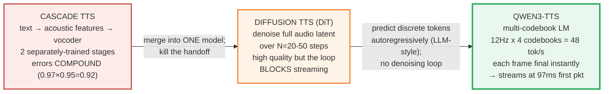
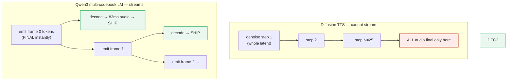

# Qwen3-TTS — end-to-end multi-codebook LM for streaming TTS with voice control

> Companion: [qwen3_tts.py](https://github.com/quanhua92/tutorials/blob/main/local-llm/qwen3_tts.py)
> Live playground: [qwen3_tts.html](./qwen3_tts.html)
> Sibling (simpler cascade TTS, for contrast): [TTS_KOKORO.md](./TTS_KOKORO.md) 🔗 *(planned)*
> Sibling (the reverse direction — speech → text): [WHISPER_STT.md](./WHISPER_STT.md) 🔗 *(planned)*

## 0. TL;DR

Qwen3-TTS treats speech generation like **language modelling**, not signal
processing. A single transformer **autoregressively predicts a short grid of
discrete audio tokens** — the same trick an LLM uses for text — and each emitted
frame decodes immediately to ~83 ms of audio. No acoustic-model → vocoder
cascade whose errors compound, and no Diffusion Transformer whose iterative
denoising blocks streaming.

The enabler is the **Qwen3-TTS-Tokenizer-12Hz**: it compresses raw audio to a
grid of tokens at only **12 frames/sec**, across **4 parallel codebooks**, so one
second of audio is a 12×4 = **48-token** target. Short, discrete, streamable.

```
   text in ────────────────────────────────────────────────►  one model  ──►  waveform out
   "Hello"                                                      multi-codebook LM
                                                                  │
                       12 Hz x 4 codebooks = 48 tokens/sec ◄──────┘
                       each frame FINAL the instant emitted -> streamable
```

**Gold values** (reproduced in the HTML playground):

```
Tokenizer 12Hz, 4 codebooks:
  token rate   = 12 x 4            = 48 tokens/s
  bitrate      = 48 x 10 bits      = 480 bps
  raw PCM      = 16000 x 16        = 256,000 bps
  compression  = 256,000 / 480     = 533x
Streaming:
  first audio packet               = 97 ms  (end-to-end)
  audio per frame                  = 1000/12 = 83.33 ms
Voice clone:
  reference audio                  = 3 s
  clone WER                        = 1.835%
  clone speaker similarity         = 0.789
```

The result: a **97 ms first-packet** streaming TTS with **voice clone, voice
design, and instruction-based voice control** — in 10 languages — that beats
ElevenLabs and MiniMax on clone WER.

---

## 1. The lineage — cascade → DiT → end-to-end multi-codebook LM



**The key insight.** A TTS pipeline's cost and latency come from *how many times
it revisits the whole audio*. Cascade revisits it per stage (2 stages, errors
compound). DiT revisits it per denoising step (25 steps, nothing usable until the
last). Qwen3-TTS revisits it **once per frame** — and each frame is **final** the
instant it is emitted, because there is no later step that will refine it. That is
why the first packet can ship at 97 ms.

---

## 2. The mechanism — the 12 Hz multi-codebook tokenizer

### What "multi-codebook" means

At 12 Hz, every second of audio is split into **12 frames**. Each frame is
quantised into **4 parallel codebook ids** — four integers, each drawn from its
own 1024-id vocabulary. The four codebooks capture *different aspects* of the
sound (phonetic identity, prosody, speaker timbre, acoustic environment), and
together they reconstruct near-losslessly.

> From qwen3_tts.py Section A:
> ```
>   tokenizer config:
>     frame rate           = 12 Hz  (12 frames / second)
>     codebooks per frame  = 4
>     vocab per codebook   = 1024 ids (10 bits/id)
>     samples / frame      = 1333  (16kHz / 12Hz)
>     audio per frame      = 83.33 ms
> 
>   encode 1.0 s of audio -> 12 frames x 4 codebooks:
>     frame | cb0 | cb1 | cb2 | cb3
>     -----------------------------------------
>     0     |   327 |   254 |   181 |   108
>     1     |    47 |   998 |   925 |   852
>     2     |  1022 |   949 |   876 |   803
>     3     |   806 |   733 |   660 |   587
>     4     |   993 |   920 |   847 |   774
>     5     |  1015 |   942 |   869 |   796
>     ... (6 more frames)
> ```

The whole second of audio is a **12×4 grid of small integers**. That grid *is*
the target the LM learns to predict — nothing else.

### Why 12 Hz, not 50–75 Hz

Traditional neural codecs (EnCodec, SoundStream) run at 50–75 Hz. That is 4–6×
more frames for the LM to autoregressively generate for the same audio. Qwen3-TTS
trades a slightly richer per-frame codebook (4 parallel streams) for a *much*
shorter sequence, which is what matters for an autoregressive generator:

> From qwen3_tts.py Section A:
> ```
>   vs traditional neural codecs (encodec/soundstream at 50-75 Hz):
>     codec                       Hz      frames/s  relative seq len
>     Qwen3-TTS-Tokenizer         12      12        1.0x
>     EnCodec 24kHz               75      75        6.2x
>     SoundStream                 50      50        4.2x
> ```

### Token rate & bitrate

> From qwen3_tts.py Section A:
> ```
>   token rate   = 12 frames x 4 codebooks = 48 tokens/s
>   bitrate      = 48 x 10 bits     = 480 bps
>   raw PCM      = 16000 x 16         = 256,000 bps  (16kHz mono int16)
>   compression  = 256,000 / 480 = 533x
> ```

**48 tokens/second at 480 bps** is the "extreme bitrate reduction" the tokenizer
card advertises. Reconstruction quality stays high (Section 5).

### Non-DiT: why this streams and DiT cannot



In DiT, step *k* refines the **whole** latent; audio at frame 0 is not final until
the last denoising step. In the multi-codebook LM, frame 0's tokens are final the
moment they are emitted — decode and ship immediately.

> From qwen3_tts.py Section B:
> ```
>     architecture              model passes    usable before done?   streams?
>     ----------------------------------------------------------------------
>     cascade (acoustic+vocoder)2               no (stages)           no
>     DiT (25 denoise steps)    25              no (whole audio)      no
>     Qwen3 multi-codebook LM   12 (1/frame)      yes (per frame)       YES
> ```

### Cascade error compounding

A two-stage cascade's end-to-end accuracy is the *product* of its stages, so each
stage's error is frozen in and amplified downstream:

> From qwen3_tts.py Section B:
> ```
>   cascade error compounding (modelled):
>     stage-1 (acoustic) accuracy = 0.97
>     stage-2 (vocoder) accuracy = 0.95
>     cascade end-to-end         = 0.97 x 0.95 = 0.9215
>     Qwen3 single end-to-end    = 0.99  (one model, no handoff)
> ```

A single end-to-end model has no handoff at which to compound.

---

## 3. Dual-track streaming — first packet at 97 ms

The **same model** serves two inference tracks:

| Track | How | Quality | First audio |
|---|---|---|---|
| **Non-streaming** | feed full text, attend over all of it, generate every frame, *then* play | highest (full context) | scales with audio length |
| **Streaming** | process text incrementally, ship each frame as soon as it decodes | slightly lower (less context) | **97 ms, fixed** |

### The 97 ms breakdown

> From qwen3_tts.py Section C:
> ```
>   streaming first-packet latency breakdown (sums to the gold value):
>     text chunk + tokenize              12 ms  ######
>     LM prefill (prompt + 1st char)     35 ms  #################
>     generate 1st token frame (4 ids)   20 ms  ##########
>     tokenizer decode frame -> audio    30 ms  ###############
>     TOTAL                              97 ms
> ```

12 + 35 + 20 + 30 = **97 ms**. That first packet already carries 83.33 ms of audio.

### Streaming latency is fixed; non-streaming scales

Because the streaming track ships frame 0 as soon as it is generated, its
first-packet latency is **constant** no matter how long the utterance. The
non-streaming track must wait for the full generation:

> From qwen3_tts.py Section C:
> ```
>   streaming vs non-streaming latency by utterance length:
>     (non-streaming modelled at 2x realtime generation)
>     utterance     frames   streaming 1st pkt   non-streaming wait  speedup
>     1s          12       97 ms            500 ms          5.2x
>     3s          36       97 ms            1500 ms          15.5x
>     10s          120      97 ms            5000 ms          51.5x
>     60s          720      97 ms            30000 ms          309.3x
> ```

For a 10-second utterance, the user waits **97 ms** (streaming) vs **5000 ms**
(non-streaming) — a 51.5× improvement. 97 ms is below the ~200 ms threshold at
which humans perceive conversational delay, so the streaming track is suitable
for real-time interactive use.

### Frame cadence after the first packet

> From qwen3_tts.py Section C:
> ```
>   after the first packet, frames stream at realtime (12 Hz):
>     t = 97 ms  -> frame 0 ships (83.33 ms audio)
>     t = 180 ms  -> frame 1 ships
>     t = 263 ms -> frame 2 ships
> ```

Generation stays one frame ahead of playback; the user hears continuous audio.

---

## 4. Voice control — clone, design, control, reuse

Four capabilities, all from the one model:

| # | Capability | Input | Use |
|---|---|---|---|
| 1 | **Clone** | 3 s reference audio | synthesise any text in that voice |
| 2 | **Design** | natural-language description | generate a brand-new voice |
| 3 | **Control** | instruction on an existing voice | per-line style override |
| 4 | **Reuse** | persist a designed/cloned voice | multi-character dialogues |

### Voice clone

> From qwen3_tts.py Section D:
> ```
>   1. VOICE CLONE  (reference = 3s audio)
>      reference  : 3s = 36 frames -> embedding #79808
>      clone WER  : 1.835%   speaker similarity: 0.789
> ```

3 seconds of reference → a speaker embedding → any text in that voice, at
**1.835% WER** and **0.789 speaker similarity**.

### Voice design — description → parameters

A natural-language description is parsed into a voice parameter vector. The model
synthesises a voice matching the parsed emotion / pace / volume / accent / gender:

> From qwen3_tts.py Section D:
> ```
>   2. VOICE DESIGN  (description -> parameters -> voice)
>      description                                               -> params
>      A warm female voice with slight British accent, energetic and fast-paced
>        emotion=warm        pace=fast    volume=normal  accent=British     gender=female
>      A calm male voice, slow and quiet
>        emotion=calm        pace=slow    volume=quiet   accent=default     gender=male
>      A cheerful young voice, loud and happy
>        emotion=happy       pace=normal  volume=loud    accent=default     gender=unspecified
> ```

### Voice control — instruction overlay

A style instruction is overlaid on a base voice for one utterance, overriding
only the matching fields:

> From qwen3_tts.py Section D:
> ```
>   3. VOICE CONTROL  (instruction overlaid on an existing voice)
>      base voice: {'emotion': 'warm', 'pace': 'normal', 'volume': 'normal', ...}
>      + 'Speak with a sad and tearful voice'
>        -> emotion=sad         pace=normal  volume=normal
>      + 'Speak very quietly'
>        -> emotion=neutral     pace=normal  volume=quiet
>      + 'Speak slowly and calmly'
>        -> emotion=calm        pace=slow    volume=normal
> ```

### Timbre reuse — multi-character dialogue

A designed/cloned voice is persisted as a stable id and reused across turns:

> From qwen3_tts.py Section D:
> ```
>   4. TIMBRE REUSE  (persist a designed voice, reuse across lines)
>       narrator -> voice #50276
>       hero     -> voice #78802
>      role      voice #     line
>      narrator  #50276      In a quiet town...
>      hero      #78802      I'll save everyone!
>      narrator  #50276      ...she said, bravely.
> ```

### Model sizes & languages

| Model | Params | Focus | Timbres |
|---|---|---|---|
| Qwen3-TTS-1.7B | 1.7B | peak performance + full control | unlimited (design) |
| Qwen3-TTS-0.6B | 0.6B | efficiency | 9 premium |

**10 languages**: Chinese, English, Japanese, Korean, German, French, Russian,
Portuguese, Spanish, Italian.

---

## 5. Quality metrics

### Tokenizer reconstruction (encode → decode round trip)

> From qwen3_tts.py Section E:
> ```
>   tokenizer reconstruction (Qwen3-TTS-Tokenizer-12Hz encode->decode):
>     metric                      value     scale / meaning
>     PESQ                        3.21      perceptual quality, 0-5 (5 = transparent)
>     STOI                        0.96      intelligibility, 0-1 (1 = perfect)
>     UTMOS                       4.16      naturalness, 1-5 (5 = human)
>     speaker similarity          0.95      timbre preserved, 0-1
> ```

The 533× compression costs almost nothing perceptually: PESQ 3.21 / 5, STOI 0.96,
UTMOS 4.16 / 5, speaker similarity 0.95.

### Voice-clone WER vs competitors

> From qwen3_tts.py Section E:
> ```
>   voice-clone WER (lower = more intelligible) vs competitors:
>     system          WER %     vs Qwen3
>     Qwen3-TTS       1.835      (best)
>     ElevenLabs      2.41       (+0.575)
>     MiniMax         2.18       (+0.345)
> ```

Qwen3-TTS clone WER (**1.835%**) beats both ElevenLabs (2.41%) and MiniMax
(2.18%).

### Long-form & multilingual stability

> From qwen3_tts.py Section E:
> ```
>   long-form & multilingual WER (stability over duration/language):
>     test                                    WER %
>     single-speaker multilingual             2.34
>     10-min continuous (Chinese)             2.36
>     10-min continuous (English)             2.81
> ```

WER stays under 3% even over 10 minutes of continuous synthesis, and at 2.34% for
single-speaker multilingual.

---

## 6. Pitfalls (trap | symptom | fix)

| Trap | Symptom | Fix |
|---|---|---|
| Assuming TTS = cascade | expecting a separate vocoder to tune; surprised there is none | Qwen3-TTS is one end-to-end LM — the tokenizer decode step is *inside* the pipeline, not a bolted-on vocoder |
| Treating it as a DiT | expecting a `num_denoise_steps` knob; wondering why there is none | There is no denoising loop — frames are final when emitted. "Steps" = autoregressive frames, set by audio length, not a quality knob |
| Confusing codebook count with depth | reading "16-layer" on the HF card and assuming 16 Hz | "16-layer" = 16 parallel codebook streams (richer), still at 12 Hz. This guide uses 4 codebooks as a teaching simplification (48 tok/s gold) |
| Expecting streaming to lower quality linearly | disabling streaming "to be safe" even for short clips | Streaming and non-streaming share one model; quality gap is small. For long form, streaming is strictly better (97 ms vs minutes) |
| Cloning from <3 s reference | low speaker similarity / wrong timbre | use ≥3 s of clean, single-speaker audio; the embedding needs enough frames |
| Voice control keywords ignored | instruction has no effect | the parser matches specific keyword classes (emotion/pace/volume/accent); rephrase to include a recognised keyword |
| One voice per process | re-synthesising the same character gives a different voice | persist the voice id (timbre reuse) and address it by id across turns |
| 12 Hz sounds "low res" | expecting artefacts from "only" 12 frames/s | 12 Hz is the *token* frame rate, not audio sample rate; each frame carries 4 codebooks and decodes to 1333 PCM samples |

---

## 7. Cheat sheet

```
# run inference (HuggingFace transformers / Qwen3-TTS GitHub)
# non-streaming (highest quality) — full text -> all audio
# streaming — first audio packet at 97 ms

ARCHITECTURE
  single end-to-end multi-codebook LM (NOT cascade, NOT DiT)
  text -> autoregressively predict token grid -> decode to waveform

TOKENIZER (Qwen3-TTS-Tokenizer-12Hz)
  12 Hz frame rate x 4 codebooks = 48 tokens/s  (this guide's gold)
  vocab 1024/codebook -> 10 bits/id -> 480 bps  (533x vs 16kHz PCM)
  reconstruction: PESQ 3.21, STOI 0.96, UTMOS 4.16, spk-sim 0.95

STREAMING (dual-track, one model)
  track 1 non-streaming: full text -> generate all -> play    (highest quality)
  track 2 streaming    : ship each frame as decoded           (97 ms first pkt)
  breakdown: 12 (text) + 35 (prefill) + 20 (gen) + 30 (decode) = 97 ms
  frame = 1/12 s = 83.33 ms audio

VOICE
  clone  : 3 s reference -> embedding -> any text  (WER 1.835%, sim 0.789)
  design : "warm female, British, fast" -> new voice
  control: "speak sadly" overlaid on a base voice (one line)
  reuse  : persist voice id -> multi-character dialogue

MODELS
  1.7B : peak perf + full voice control (unlimited timbres)
  0.6B : efficiency (9 premium timbres)

LANGUAGES: 10  (zh en ja ko de fr ru pt es it)

GOLD CHECK VALUES (HTML playground reproduces these)
  token rate = 48 tok/s | bitrate = 480 bps | first packet = 97 ms
  clone WER = 1.835% | speaker sim = 0.789
```

---

## 🔗 Cross-references

- [TTS_KOKORO.md](./TTS_KOKORO.md) 🔗 *(planned)* — Kokoro-82M is a **simpler cascade TTS** (StyleTTS2 lineage): a lighter, faster, non-streaming contrast to Qwen3-TTS's end-to-end multi-codebook LM. Compare architecture, latency, and quality tradeoffs.
- [WHISPER_STT.md](./WHISPER_STT.md) 🔗 *(planned)* — Whisper is the **reverse direction** (speech → text). Both use a transformer over discrete audio tokens, but Whisper *encodes* a token sequence while Qwen3-TTS *generates* one — two sides of the same discrete-audio-token idea.
- [DIFFUSION_FUNDAMENTALS.md](./DIFFUSION_FUNDAMENTALS.md) — the denoising math that DiT-based TTS (which Qwen3-TTS *deliberately avoids*) uses. Read this to understand exactly what the non-DiT design skips.
- [../llm/SAMPLING.md](../llm/SAMPLING.md) — the autoregressive token sampling that the multi-codebook LM uses to pick each frame's codebook ids (top-k / top-p over the codebook vocabularies).

## Sources

- [Qwen3-TTS blog — qwen.ai](https://qwen.ai/blog?id=qwen3tts-0115) — official announcement: dual-track streaming, voice design/clone/control, 1.7B/0.6B sizes, WER/similarity benchmarks.
- [Qwen3-TTS Technical Report — arXiv:2601.15621](https://arxiv.org/html/2601.15621v1) — multi-codebook LM architecture, dual-track modeling, 97 ms first packet, tokenizer design.
- [Qwen3-TTS-Tokenizer-12Hz — HuggingFace](https://huggingface.co/Qwen/Qwen3-TTS-Tokenizer-12Hz) — 12.5 Hz multi-codebook tokenizer, 16-layer design, extreme bitrate reduction, reconstruction metrics (PESQ/STOI/UTMOS).
- [QwenLM/Qwen3-TTS — GitHub](https://github.com/QwenLM/Qwen3-TTS) — model weights, inference code, language list, voice control API.
- [Qwen3-TTS Family — Alibaba Cloud blog](https://www.alibabacloud.com/blog/qwen3-tts-family-is-now-open-sourced-voice-design-clone-and-generation_602826) — bidirectional streaming, timbre reuse, multi-character dialogue.
