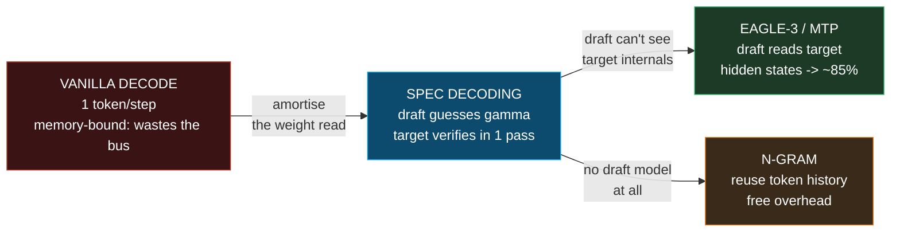
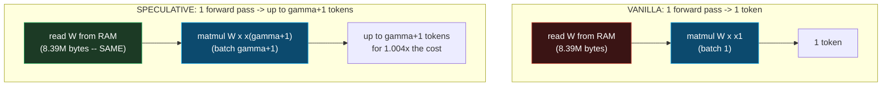
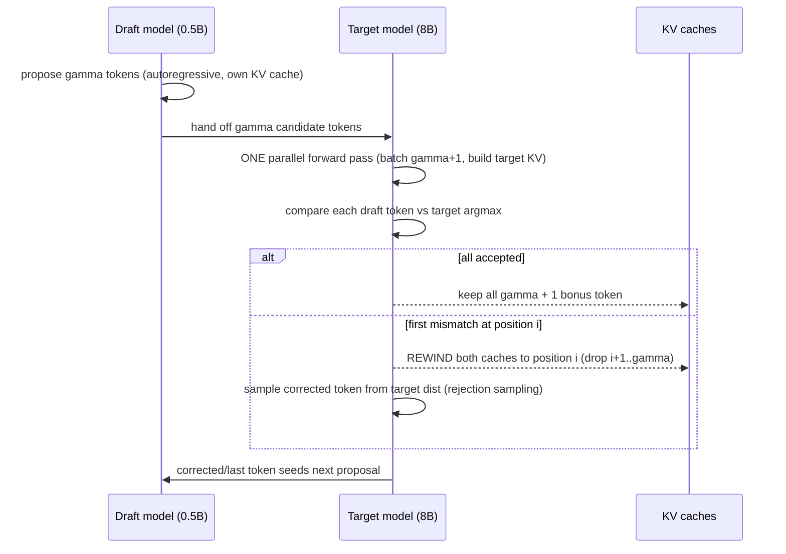

# Speculative Decoding — `--draft` / `--spec-type draft-simple` (a tiny model guesses, the big model verifies in one pass)

> Companion: [speculative_local.py](https://github.com/quanhua92/tutorials/blob/main/local-llm/speculative_local.py)
> Live: [speculative_local.html](./speculative_local.html)

## 0. TL;DR

LLM **decode is memory-bandwidth-bound**: generating one token per step streams
the entire weight matrix from RAM for a single column of work — the matmul for 8
tokens costs **barely more** than for 1. Speculative decoding exploits this:

1. A **small fast draft model** (e.g. 0.5B) proposes **γ** candidate tokens
   autoregressively (γ = 4–8 typically).
2. The **target model** (e.g. 8B) processes all γ+1 tokens in **ONE parallel
   forward pass** (using its KV cache).
3. Each draft token is **accepted** if the target's argmax agrees; the **first
   mismatch** is rejected and a token is drawn from the target's distribution
   there (rejection sampling → **identical output distribution**).
4. You **always** get ≥ 1 token (the target's verified / bonus token).

**Gold (verified, [check: OK] in the `.py` and `.html`):** for γ=4,
acceptance=0.75 (Llama-3.2-1B drafting Llama-3.1-8B) — you generate **3.05
tokens per step** (`1 + 0.75 + 0.75² + 0.75³ + 0.75⁴`), and after the draft
model's own cost the **net speedup ≈ 2.4×**. Free speedup, same quality.

---

## 1. What it is (lineage old → new, WHY each step)



| Step | Problem it fixes | What changes |
|---|---|---|
| **1. Vanilla decode** | — (the baseline) | 1 token/step. The weight matrix is streamed from RAM for one token of work — the memory bus is underused. |
| **2. Draft-model spec decoding** | Wasted memory bandwidth | A tiny model guesses γ tokens; the target verifies them in one batched pass. Since batch γ+1 costs ~same as batch 1, you amortise the one weight-read across γ+1 tokens. |
| **3. EAGLE-3 / MTP** | Standalone draft caps at ~70–80% acceptance | The draft reads the **target's hidden states** (EAGLE-3) or uses multi-token-prediction heads baked into the model (MTP) → ~85%+ acceptance. |
| **4. N-gram (no draft model)** | Draft model has its own cost/VRAM | Reuse the token history (n-gram matching) to propose tokens. Zero draft-model cost, lower acceptance, but free overhead — great for repetitive text. |

**Why it matters:** for γ=4, acceptance=0.75, you generate **3.05 tokens per
speculative step** (vs 1 for vanilla). After the draft model's own cost, the net
speedup is **~2.4×**. On long generations this is huge — and crucially the
**output distribution is identical** to vanilla decode (rejection sampling
guarantees this). Free speedup, same quality.

---

## 2. The mechanism (internals)

### 2a. Decode is memory-bound — why batch γ+1 ≈ batch 1

A decode forward pass is dominated by **streaming the weight matrix** from RAM:

- **weight bytes** = `M·K·bw` (the big term; `bw` = bytes/weight)
- **activation** = `K·N·2` (F16; grows with batch N — but tiny)
- **compute** = `2·M·K·N` (grows with N — but hidden under memory latency)

For batch=1 vs batch=γ+1, the weight term is **identical**. The activation and
compute grow with N, but they are dwarfed by the weight streaming. So the pass
time (memory-bound) is ~constant: **you get γ+1 tokens for the price of 1.**



> From speculative_local.py Section A:
> ```
> Layer [d=4096,d=4096] Q4_0 weights (0.5 B/elem):
>
> | pass        | batch | weight mem | activation mem | total mem   | vs batch 1 |
> |-------------|-------|------------|----------------|-------------|------------|
> | vanilla     | 1     | 8388608    | 8192           | 8396800     | 1.000x     |
> | spec verify | 5     | 8388608    | 40960          | 8429568     | 1.004x     |
>
> Verifying 5 tokens costs 1.004x a single-token pass --
> i.e. 5 tokens for ~the price of 1. The weight read (which dominates)
> is amortised across the whole batch.
> ```

### 2b. The draft-propose-verify-accept/reject cycle



The expected tokens per step is a **geometric series**: position k is only
reached if all k−1 prior tokens were accepted (probability `p^(k−1)`), so the
expected number of **accepted draft tokens** is `p + p² + … + p^γ`, plus the
guaranteed **+1 bonus token** from the target's verify pass.

> From speculative_local.py Section B:
> ```
> gamma = 4, acceptance = 0.75  (e.g. Llama-3.2-1B drafting Llama-3.1-8B)
>
> Probability of producing exactly n tokens in one step:
> | tokens | probability | bar                  |
> |--------|-------------|----------------------|
> | 1      | 0.25000     | ############         |
> | 2      | 0.18750     | #########            |
> | 3      | 0.14062     | #######              |
> | 4      | 0.10547     | #####                |
> | 5      | 0.31641     | ###############      |
>
> E[tokens/step] = 1 + p + p^2 + p^3 + p^4
>                = 1 + 0.75 + 0.56250 + 0.42188 + 0.31641
>                = 3.05078  (analytic)
>                = 3.04870  (Monte-Carlo, 200k steps)
> ```

### 2c. KV cache behaviour on rejection

- The **draft model** has its **own** KV cache, filled during the autoregressive
  proposal.
- The **target model** builds KV for the γ+1 verified positions in its single
  batched pass.
- On rejection at position `i`, **both caches rewind** to position `i` — just
  move the write pointer back (same as a normal decode truncate). No recomputation.
- The corrected token seeds the next step's draft proposal.

---

## 3. Practical config / commands

### llama.cpp flags

```bash
--spec-type draft-simple     # enable draft-model speculation (legacy: --draft)
-md, --model-draft FNAME     # the small draft model (.gguf)
--spec-draft-n-max N         # max draft tokens per step = gamma (legacy: --draft-max N; default 3)
--spec-draft-ngl N           # GPU layers for the draft model (keep it FULLY on GPU -- it's tiny)
-td, --threads-draft N       # CPU threads for the draft model
```

### Typical invocations

```bash
# 8B target + 0.5B draft, gamma=4 (the canonical setup)
llama-server -m Llama-3.1-8B.gguf \
    -md Llama-3.2-0.5B.gguf \
    --spec-type draft-simple --spec-draft-n-max 4 \
    --spec-draft-ngl 99

# EAGLE-3 draft (reads target hidden states -> ~85% acceptance)
llama-server -m Llama-3.1-8B.gguf \
    -md EAGLE3-LLaMA3.1-8B.gguf \
    --spec-type draft-eagle3 --spec-draft-n-max 8

# n-gram speculation (NO draft model -- free, best for repetitive text)
llama-server -m model.gguf --spec-type ngram-simple --spec-draft-n-max 32
```

### What drives the acceptance rate

> From speculative_local.py Section C:
> ```
> | draft model             | target model  | relationship            | acceptance |
> |-------------------------|---------------|-------------------------|------------|
> | Llama-3.2-1B            | Llama-3.1-8B  | same family             | 0.75       |
> | Llama-3.2-0.5B          | Llama-3.1-8B  | same family (tiny)      | 0.65       |
> | Qwen2.5-1.5B            | Llama-3.1-8B  | different family        | 0.45       |
> | Llama-3.2-1B (EAGLE-3)  | Llama-3.1-8B  | EAGLE-3 (hidden state)  | 0.85       |
> | 0.5B n-gram (no model)  | Llama-3.1-8B  | n-gram (repetitive)     | 0.55       |
> ```

llama.cpp prints live acceptance stats — watch for `draft acceptance rate`:

```
draft acceptance rate = 0.57576 (171 accepted / 297 generated)
statistics draft: #calls = 10, #gen tokens = 110, #acc tokens = 98
```

---

## 4. Worked example (the gold centerpiece)

Two speedup notions — **do not confuse them**:

- **Effective (naive):** tokens/step *if the draft were free* = `1 + Σp^k`
  (exact geometric series). The loose quote `γ·p + (1−p)` slightly overestimates.
- **Net (real):** accounts for the draft model's own forward passes.

> From speculative_local.py Section D:
> ```
> gamma=4, p=0.75, draft=0.5B (ratio 0.0625 of 8B target):
>
>   effective tokens/step   = 3.051  (exact geometric series)
>   loose approx gamma*p+(1-p) = 3.250  (overestimate)
>   net speedup (w/ draft cost) = 2.43x
> ```

> From speculative_local.py Section G:
> ```
> Canonical setup: gamma=4, acceptance=0.75, 0.5B draft for 8B target (ratio 0.0625).
>
> | metric                       | value     |
> |------------------------------|-----------|
> | gamma (draft tokens/step)    | 4         |
> | acceptance rate              | 0.75      |
> | accepted draft tokens (E)    | 2.0508    |
> | + bonus token (verify pass)  | 1         |
> | tokens/step (effective)      | 3.0508    |
> | batch(gamma+1)/batch(1) cost | 1.004     |
> | net speedup (w/ draft cost)  | 2.43      |
>
> GOLD (recomputed & badge-checked in speculative_local.html):
>   accepted draft tokens = p + p^2 + p^3 + p^4
>                         = 0.75 + 0.5625 + 0.4219 + 0.3164 = 2.0508
>   + 1 bonus token (target verify pass) -> 3.0508 tokens/step
>   net speedup (0.5B/8B) = 2.43x
>
> [check] accepted draft tokens == 2.0508: True -> OK
> [check] tokens/step == 3.0508 (1 + geometric series): True -> OK
> [check] net speedup == 2.43x (w/ draft cost): True -> OK
> [check] net < effective (draft not free): True -> OK
> [check] always >= 1 token/step (target guarantees): True -> OK
> ```

The draft-size trade-off (γ=4, p=0.75):

| draft ratio | example | net speedup |
|---|---|---|
| 0.03125 | 0.25B/8B | **2.70×** |
| 0.0625 | 0.5B/8B | **2.43×** |
| 0.125 | 1B/8B | 2.03× |
| 0.250 | 2B/8B | 1.52× |
| 0.500 | 4B/8B | 1.02× |

**Sweet spot:** the smallest draft that still gives >60% acceptance (0.5B–1B
for an 8B target). A bigger draft is more accurate but its own forward passes
eat the gains.

---

## 5. Pitfalls (trap | symptom | fix)

| Trap | Symptom | Fix |
|---|---|---|
| **Cross-family draft model** | Acceptance ~40–50%, speedup < 1.3× (draft overhead ≥ gains) | Use a draft from the **same family** (e.g. Llama-3.2-1B for Llama-3.1-8B), or EAGLE-3. Watch the printed `draft acceptance rate`; if < 0.5, drop the draft. |
| **Draft model not on GPU** | Spec decode is *slower* than vanilla (draft copies stall) | Set `--spec-draft-ngl 99` — the draft is tiny, keep it fully in VRAM. CPU-only draft kills the speedup. |
| **Confusing effective vs net speedup** | Expecting 3× (tokens/step), measuring 1.5× | The **effective** gain (3.05) is eroded by the draft's own γ passes. The **net** (2.43×) is what you measure. Always divide by `γ·draft_ratio + batch_overhead`. |
| **`--spec-draft-n-max` too large** | Returns flatten past γ≈5–6; longer drafts have lower per-token acceptance | Sweep γ from 4–8 and benchmark. The geometric tail `p^k` decays; diminishing returns past ~5–6. |
| **Expecting different output** | "Does spec decoding change quality?" | No — rejection sampling makes the output **distributionally identical** to vanilla decode. Any quality change is a bug. |
| **Draft KV cache misalignment** | Garbled text after a rejection | The draft KV must be **rewound in lockstep** with the target KV on rejection. Both caches truncate to the rejection point. |
| **Tiny prompt, lots of restating** (code/reasoning) | Plain draft underperforms | Switch to `--spec-type ngram-simple` (no draft model) — repetitive/restated text matches n-grams at near-zero cost. |
| **Trusting `gamma*p + (1-p)`** | Over-optimistic speedup estimate (3.25× vs real 3.05×) | Use the exact geometric series `1 + Σp^k`; the linear approximation overestimates because later tokens are only reached if all prior ones pass. |

---

## 6. Cheat sheet

```
premise    : decode is MEMORY-BOUND. batch(gamma+1) costs 1.004x batch(1).
             the weight read is amortised across gamma+1 tokens.

cycle      : 1. draft model proposes gamma tokens (autoregressive, own KV cache)
             2. target verifies all gamma+1 in ONE batched pass
             3. accept until first mismatch -> sample corrected token there
             4. ALWAYS >= 1 token (target's bonus/verified token)

gold       : gamma=4, acceptance=0.75:
               tokens/step = 1 + 0.75 + 0.5625 + 0.4219 + 0.3164 = 3.05
               net speedup (0.5B/8B) = 3.05 / (4*0.0625 + 1.004) = 2.43x

acceptance : same family ~75%   EAGLE-3 ~85%   cross-family ~45%   n-gram ~55%
             below ~40%, draft overhead >= gains -> skip spec decoding.

flags      : --spec-type draft-simple   (-md draft.gguf   --spec-draft-n-max N)
             --spec-type draft-eagle3   (EAGLE-3 draft, reads hidden states)
             --spec-type ngram-simple   (no draft model, free overhead)
             --spec-draft-ngl 99        (KEEP DRAFT ON GPU)

kv cache   : draft has its OWN cache. on rejection, BOTH caches rewind to the
             rejection point (pointer truncate, no recompute). corrected token
             seeds the next proposal.

invariant  : output distribution == vanilla decode (rejection sampling).
             free speedup, SAME quality.
```

---

## 🔗 Cross-references

- **[SPECULATIVE_DECODING](../llm/SPECULATIVE_DECODING.md)** (in `llm/`) — the
  rejection-sampling math that *proves* the output distribution is identical.
  This bundle is the practical llama.cpp side: the `--draft` flags, the real
  speedup you measure, and the draft-model selection.
- **[KV_CACHE](../llm/KV_CACHE.md)** (in `llm/`) — the KV-cache **rewind on
  rejection** is the same truncate-pointer operation as normal decode. The draft
  model maintains its own cache; both rewind in lockstep.
- **[THREADING](./THREADING.md)** (sibling) — decode is memory-bandwidth-bound,
  which is *why* spec decoding works: batch γ+1 ≈ batch 1. The roofline analysis
  here is the same one that explains why `--threads` saturates at ~2×.
- **[KV_CACHE_QUANT](./KV_CACHE_QUANT.md)** (sibling) — the draft model doubles
  your KV-cache footprint; quantising the draft's KV (Q8_0/Q4_0) recovers VRAM.

## Sources

- [llama.cpp speculative decoding docs (`docs/speculative.md`)](https://github.com/ggml-org/llama.cpp/blob/master/docs/speculative.md)
- [llama.cpp speculative decoding PR #2926 (original draft-model implementation)](https://github.com/ggml-org/llama.cpp/pull/2926)
- [Accelerating Large Language Model Decoding with Speculative Sampling (Leviathan et al., arXiv:2302.01318)](https://arxiv.org/abs/2302.01318)
- [Fast Inference from Transformers via Speculative Decoding (Chen et al., arXiv:2211.17192)](https://arxiv.org/abs/2211.17192)
- [EAGLE-3 draft models (llama.cpp docs)](https://github.com/ggml-org/llama.cpp/blob/master/docs/speculative.md#eagle-3-draft-eagle3)
- [Speculative decoding potential on consumer hardware (llama.cpp discussion #10466)](https://github.com/ggml-org/llama.cpp/discussions/10466)
- [LM Studio 0.3.10: Speculative Decoding (1.5×–3× speedup benchmarks)](https://lmstudio.ai/blog/lmstudio-v0.3.10)
