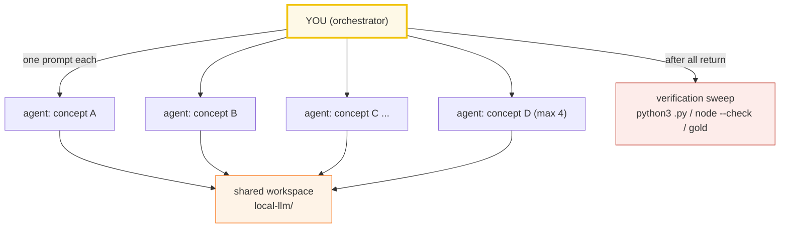

# SUBAGENTS_RESEARCH_GUIDE — Delegating Bundle-Building at Scale

> Adapted from `llm/SUBAGENTS_RESEARCH_GUIDE.md` and `concept-builder/SKILL.md`.
> This sits **above** [`HOW_TO_RESEARCH.md`](./HOW_TO_RESEARCH.md) (the per-bundle
> workflow). That file defines *what* a bundle is and *how* to build one by hand.
> This guide defines *how to delegate* that work to many agents at once.



---

## 0. When to use this mode

Use subagent delegation when you need **≥3 concept bundles** built to a uniform
bar. For 1–2 bundles, just build them by hand (follow `HOW_TO_RESEARCH.md`).

**The trap it prevents:** when you build many things yourself in one session,
context fills up, quality drifts, and later bundles get sloppy. Subagents each
get a *fresh* context, so bundle #26 is as rigorous as bundle #1.

---

## 1. The mental model: orchestrator + workers

- **You (the orchestrator)** do NOT write bundle code. You: (a) write the worker
  prompt template, (b) launch workers in parallel, (c) run the verification
  sweep, (d) re-spawn any worker that failed verification.
- **Each worker** owns exactly ONE bundle (4 files) and is told to follow
  `HOW_TO_RESEARCH.md` to the letter. It is forbidden from touching any other
  bundle's files, the dashboard, TODO.md, or any guide file.
- **The workspace is shared** (`local-llm/`), but file ownership is disjoint, so
  parallel writes are safe.

---

## 2. The standard worker prompt (copy this, fill the blanks)

Every worker gets this preamble verbatim, then a per-concept "brief". This is the
single most important artifact in this guide — get it right and the bundles come
back uniform.

```text
You are building ONE "concept bundle" for the local-llm learning repo. Work
ENTIRELY inside /Volumes/data/workspace/tutorials/local-llm/. Do NOT touch any
file that is not part of your assigned bundle, and do NOT edit TODO.md,
HOW_TO_RESEARCH.md, SUBAGENTS_RESEARCH_GUIDE.md, index.html, or any other
bundle's files.

=== STEP 0: ABSORB THE WORKFLOW (mandatory, do first, in order) ===
1. Read /Volumes/data/workspace/tutorials/local-llm/HOW_TO_RESEARCH.md IN FULL.
   It is the law: the 4-file bundle = {name}.py (ground truth, pure Python
   stdlib) + {name}_output.txt (captured stdout) + {NAME}.md (guide) +
   {name}.html (interactive companion, gold-checked).
2. Study the canonical model bundle(s) and COPY THEIR STYLE EXACTLY:
   {MODEL_BUNDLES}
   Match: the banner()/check() helpers + section_*() print structure of the .py;
   the "> From {name}.py Section X:" verbatim callouts + mermaid + pitfalls table
   + cheat sheet + ## Sources in the .md; the dark palette (#0d1117 bg, #f97316
   orange accent) + slider + [check: OK] gold-badge in the .html.

=== STEP 1: MINE THE AUTHORITATIVE SOURCE ===
Read these and quote real code/API/specs, not paraphrases:
{CITE_SOURCES}

=== STEP 2: FACT-CHECK VIA WEB SEARCH (mandatory, do NOT skip) ===
For every formula, version, spec detail, and behavioral claim: web-search the
official docs and >=1 other authoritative source. Verify the EXACT fact in >=2
places. Record every URL in a "## Sources" section at the bottom of {NAME}.md.
NEVER guess a formula, byte offset, or number. If you cannot verify a fact,
search until you can, or flag it explicitly in your final report. Start your
searches at:
{WEB_ANCHORS}

=== HARD RULES ===
- NEVER hand-compute. The .py prints every value. The .md pastes values verbatim
  under "> From {name}.py Section X:" callouts. The .html recomputes with the
  IDENTICAL formula and gold-checks against one known .py value.
- PURE PYTHON STDLIB ONLY. Run scripts with `python3 {name}.py`. DO NOT use torch,
  numpy, or any external library. Implement everything from scratch in pure Python.
  If you "need" a lib (e.g. struct for binary parsing), use the stdlib version.
- Deterministic inputs only (hardcoded values, seeded random.seed(42)).
- Tiny-but-complete examples (4-element block, 8-layer model, 512-byte file) so
  every number prints while every behavior shows.
- NO raw assert(): use the check(desc, ok) helper that prints "[check] desc: OK"
  and exits non-zero on failure.
- Determinism: sorted dict keys, seeded RNG, no wall-clock as values, no pointer
  addresses. _output.txt must be byte-identical on re-run.

=== DELIVERABLES (exact paths) ===
- /Volumes/data/workspace/tutorials/local-llm/{name}.py
- /Volumes/data/workspace/tutorials/local-llm/{name}_output.txt
    (produce via: python3 {name}.py > {name}_output.txt 2>/dev/null)
- /Volumes/data/workspace/tutorials/local-llm/{NAME}.md
- /Volumes/data/workspace/tutorials/local-llm/{name}.html

{NAME}.md MUST contain: the lineage old->new with WHY each step happened (for
ecosystem bundles) or the mechanism (for format bundles); mermaid diagrams (>=1;
ALL diagrams MUST be mermaid fenced blocks — NEVER ASCII art or images);
"> From {name}.py Section X:" verbatim output blocks; a worked smallest-scale
example; a pitfalls table (trap | symptom | fix); a cheat sheet; cross-references
to sibling bundles (each link with a one-line WHY it matters) and to llm/
(the algorithm side); and a "## Sources" section (URLs, web-verified >=2).

{name}.html MUST be a single self-contained file (zero deps except Tailwind Play
CDN, inline <style>+<script>, opens from file://). Dark palette
(--bg:#0d1117; --panel:#161b22; --ink:#e6edf3) with orange accent #f97316. JS
that recomputes with the IDENTICAL formula; a [check: OK] badge gold-checked
against a known runnable value. Header links to the .md and the runnable as FULL
GitHub URLs (https://github.com/quanhua92/tutorials/blob/main/local-llm/{NAME}.md
and .../local-llm/{name}.py) — NOT relative links. Back-link to ./index.html
(the local-llm dashboard, NOT ../index.html). Badge styling: .md links use
class="badge md" with green #27ae60 and emoji 📖; .py links use class="badge py"
with orange #e67e22 and emoji 📄. Include a guide-callout div after the header.
Extract the <script> and run `node --check` (must pass) before reporting.

=== VERIFICATION (do ALL of these, then report) ===
Run from /Volumes/data/workspace/tutorials/local-llm/ :
1. `python3 {name}.py` runs clean; every "[check] ... OK" prints (count > 0).
2. `python3 {name}.py > {name}_output.txt 2>/dev/null` -> non-empty AND
   byte-identical on a 2nd run (determinism).
3. Extract the <script> from {name}.html and `node --check` it (must pass).
4. The .html gold-check value equals the .py value exactly.
5. Validate all mermaid blocks with `npx @mermaid-js/mermaid-cli -i block.mmd -o /dev/null`.

=== REPORT BACK (your final message) ===
- The 4 file paths created.
- Check result: how many "[check] ... OK" printed, and the node --check verdict.
- Web sources used (list URLs).
- Any fact you could NOT verify (do not hide uncertainty).

=== YOUR CONCEPT BRIEF ===
Bundle name: {name} / {NAME}
Phase: {PHASE_N} ({PHASE_THEME})
Lineage (old -> new / why): {LINEAGE}
Anchor concepts/signatures (verify on web, implement, assert):
  {ANCHOR_CONCEPTS}
Suggested runnable sections: {SECTION_LIST}
Suggested mermaid in .md: {MERMAID_IDEAS}
A concrete value the runnable must print (pin it so you can sanity-check):
  {PINNED_VALUE_OR_HOW_TO_DERIVE_IT}
Cross-references to wire up: {SIBLING_LINKS}
```

The `{BLANK}` fields are the only thing that changes between workers. Everything
else is constant — that's what keeps the bundles uniform.

---

## 3. Filling the brief — the per-concept fields

For each concept you delegate, you (orchestrator) fill in:

| Field | What to put | Example |
|---|---|---|
| `{MODEL_BUNDLES}` | 1–2 already-shipped bundles to copy style from | `local-llm/gguf_format.py + GGUF_FORMAT.md + gguf_format.html` |
| `{CITE_SOURCES}` | Real docs/specs to mine — not paraphrases | `GGUF spec: github.com/ggml-org/llama.cpp/gguf-py; HuggingFace GGUF docs` |
| `{WEB_ANCHORS}` | Official doc URL + search phrases for Step 2 | `GGUF format spec; llama.cpp quantize README; k-quants paper` |
| `{ANCHOR_CONCEPTS}` | Exact behaviors/offsets/formulas to verify & assert | `GGUF magic = 0x46554747; version 3; tensor count at offset 8` |
| `{SECTION_LIST}` | Suggested runnable teachable points (A/B/C/D) | `A: header parse, B: KV metadata, C: tensor table, D: alignment` |
| `{MERMAID_IDEAS}` | Diagrams the `.md` should contain | `GGUF binary layout; mmap data flow; quant type comparison` |
| `{PINNED_VALUE}` | A concrete output the runnable MUST print | `GGUF magic bytes: 47 47 55 46 (little-endian 0x46554747)` |
| `{SIBLING_LINKS}` | Which 🔗 bundles to reference, each with one-line why | `quant_types (what the quantized tensors decode to)` |
| `{LINEAGE}` | old→new with WHY | `GGML (old flat format) → GGUF v1/v2/v3 (extensible KV metadata + mmap-friendly)` |
| `{PHASE_N}` / `{PHASE_THEME}` | Phase from TODO.md | `Phase 1 (Format & Runtime)` |

**Rule of thumb:** spend 5 minutes on the brief. A lazy brief → a lazy bundle.

---

## 4. Coordination rules (keep the swarm safe)

1. **Disjoint file ownership.** Each worker writes only its 4 files (different
   stems). State the exact paths in the prompt and forbid edits elsewhere.
2. **No manifest/dependency edits.** No pyproject.toml needed (pure stdlib). No
   npm/pip installs. Workers implement everything from scratch.
3. **Max 4 workers per batch.** All `Task` calls in ONE message. Sweep, then the
   next 4. Small batches = observable, recoverable failures.
4. **One concept per worker.** Never two — context splits and both degrade.
5. **The brief + the sweep are non-negotiable.** Vague brief → worker guesses.
   Skip the sweep → silent bugs ship.

---

## 5. The verification sweep (do this after ALL workers return)

Workers self-verify, but you independently re-check the whole batch:

```bash
cd /Volumes/data/workspace/tutorials/local-llm
for name in {batch_stems}; do
  echo "===== $name ====="
  python3 "$name.py" > /tmp/$name.out 2>/tmp/$name.err \
    && echo "  py: OK" || { echo "  py: FAILED"; cat /tmp/$name.err; }
  grep -c "\[check\]" /tmp/$name.out | xargs -I{} echo "  checks printed: {}"
  python3 -c "import re; h=open('$name.html').read(); \
    open('/tmp/$name.js','w').write(re.search(r'<script>(.*?)</script>',h,re.S).group(1))" 2>/dev/null
  node --check /tmp/$name.js 2>/dev/null && echo "  html JS: OK" || echo "  html JS: FAIL"
  test -s "${name}_output.txt" && echo "  output.txt: present" || echo "  output.txt: MISSING"
done
```

Then spot-check: open 2–3 `.html` files in a browser, confirm the `[check: OK]`
badge is green and numbers match `_output.txt`. For mermaid, run:
```bash
# Validate all mermaid blocks in the batch's .md files
for name in {batch_stems}; do
  python3 -c "
import re
from pathlib import Path
for i, m in enumerate(re.finditer(r'\`\`\`mermaid\n(.*?)\`\`\`', Path('${name^^}.md').read_text(errors='replace'), re.S)):
    open(f'/tmp/mmd_${name}_{i}.mmd','w').write(m.group(1))
" 2>/dev/null
done
# Then render each with mmdc (background, ~2s per block)
for f in /tmp/mmd_*.mmd; do
  npx @mermaid-js/mermaid-cli -i "$f" -o /dev/null 2>/dev/null \
    && echo "  $f: OK" || echo "  $f: BROKEN"
done
```

**Re-spawn failures.** Any bundle that fails: re-launch ONE worker for just that
bundle, paste its prior output + the failing check, ask it to fix ONLY the
failure. Don't rewrite from scratch unless the whole bundle is wrong.

---

## 6. Handling style drift (the "improve existing" worker)

When new bundles raise the bar, spawn a **style-consistency worker** to backport.
Its brief edits ONLY the named old bundles, changes no computed value (ground
truth), and re-runs the gate for each. Runs in parallel with the next batch
(disjoint files → no conflict).

---

## 7. Common failure modes (and the fix)

| Worker symptom | Cause | Fix |
|---|---|---|
| `py: FAILED` | wrong formula / offset / spec detail | re-spawn with correct `{ANCHOR_CONCEPTS}` |
| `[check] FAIL` badge in .html | JS formula drifted from .py | re-spawn: copy .py formula verbatim into JS |
| `node --check` fails | JS typo (unbalanced brace) | usually 1-line fix; re-spawn with error |
| `_output.txt` differs on re-run | nondeterminism (unsorted dict, unseeded RNG) | re-spawn citing DETERMINISM rules |
| Numbers in .md don't match `_output.txt` | worker hand-typed a table | regenerate, paste verbatim |
| No `## Sources` | worker skipped web search | re-spawn, make Step 2 non-optional |
| No pitfalls table | junior tutorial, no expert payoff | re-spawn, cite three-layer depth rule |
| Relative links in .html | must be full GitHub URLs; back-link must be ./index.html | re-spawn citing HTML link rules |
| Mermaid doesn't render on GitHub | syntax not supported (see HOW_TO_RESEARCH.md) | run mmdc sweep, fix broken blocks |
| Worker edited another bundle/guide | brief was loose | restore from git; tighten "do NOT touch" clause |

---

## 8. The batch-run checklist (orchestrator's pre-flight)

Before launching a swarm:
- [ ] Each worker's 4 file paths are disjoint from every other worker's.
- [ ] Each brief has `{CITE_SOURCES}`, `{WEB_ANCHORS}`, `{ANCHOR_CONCEPTS}`,
      and a concrete `{PINNED_VALUE}`.
- [ ] Style anchor shipped (Phase 1 bundle #1 exists for `{MODEL_BUNDLES}`).
- [ ] Verification sweep script ready (§5).
- [ ] All ≤4 `Task` calls drafted in ONE message (parallel launch).

After the swarm returns:
- [ ] Verification sweep green for all bundles.
- [ ] Spot-checked 2–3 `.html` in a browser.
- [ ] Mermaid validated with `mmdc`.
- [ ] Re-spawned any failures.
- [ ] Ticked `TODO.md`; updated progress.
- [ ] Committed + pushed.

---

## 9. Why this works (and where it breaks)

- **Fresh context per bundle** → bundle #26 is as rigorous as #1.
- **Disjoint file ownership** → safe parallel writes; no merge conflicts.
- **The constant preamble** → uniform style without micromanaging each worker.
- **The brief is the leverage** → your judgment is concentrated in 5-minute
  briefs, not 50-minute hand-writes.

Where it breaks: if a brief is vague, the worker guesses; if you skip the
verification sweep, silent bugs ship. **The brief + the sweep are
non-negotiable.**
